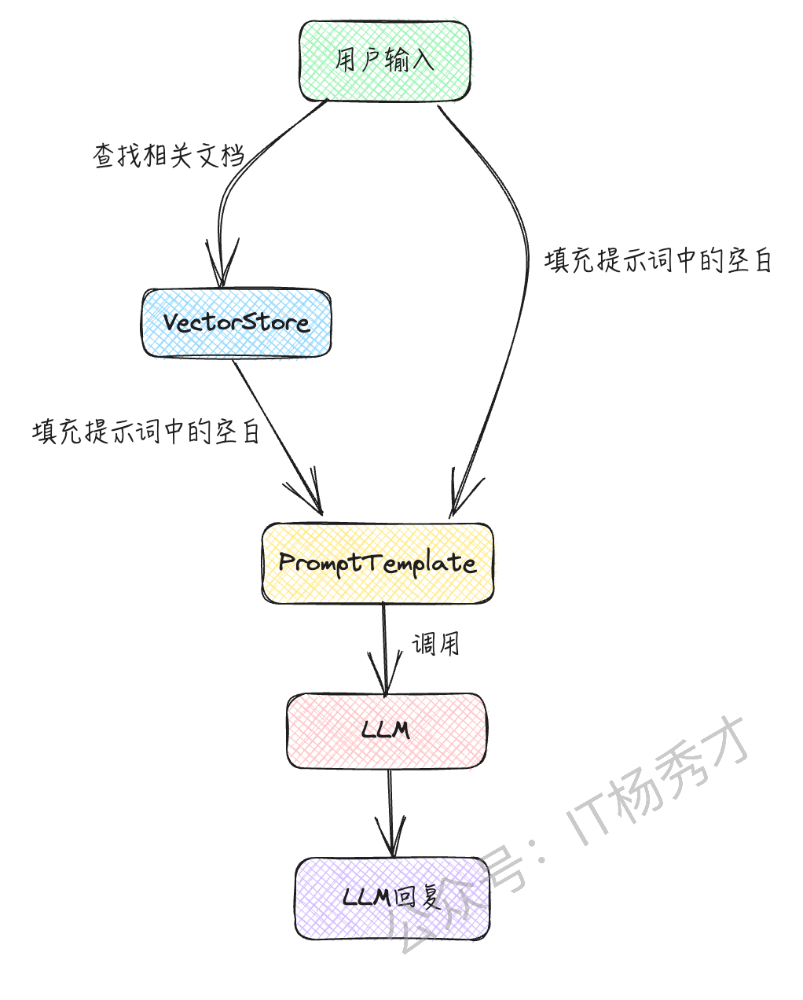
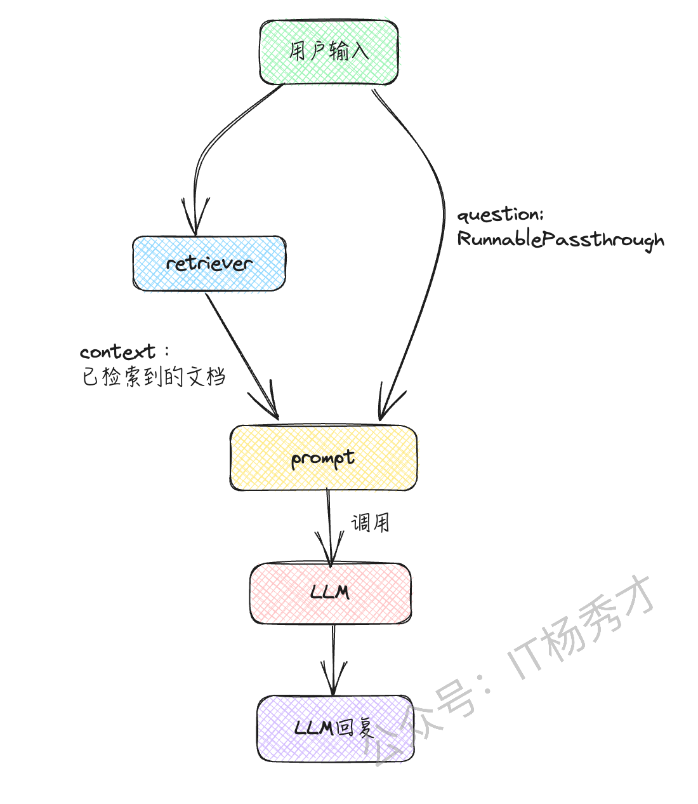

---
tags:
  - AI
  - AI应用开发
  - llm
  - 大模型
  - 大模型应用开发
  - LangChain
  - LCEL
---

# LCEL

LangChain Expression Language (LCEL) 是 LangChain 中代码的一种新的描述方法。在 LCEL 中，可以通过使用 `|` 将提示词或 LLM 连接起来，实现处理的链式 (Chain) 实现，从 2023 年 10 月下旬开始，LangChain 中使用 LCEL 的实现已经成为标准。更多关于LCEL的知识可以参考LangChain官网：https://python.langchain.com/docs/expression\_language/

## 1. LCEL 的基本用法

### 1.1 连接prompt和model

首先，作为使用 LCEL 的最简单示例，可以将 prompt 和 model 连接起来。首先，准备 prompt (PromptTemplate) 和 model (ChatOpenAI)。

```python
from langchain.chat_models import ChatOpenAI
from langchain.prompts import PromptTemplate

prompt = PromptTemplate.from_template("""请帮我想一份食谱。菜名: {dish}""")

model = ChatOpenAI(model_name="gpt-3.5-turbo-1106", temperature=0)
```

然后，创建这些 chain 连接而成的链（chain）

```python
chain = prompt | model
```

运行这个chain

```python
result = chain.invoke({"dish": "咖喱"})
print(result.content)
```

运行结果

```markdown
咖喱鸡食谱

材料:
- 500克鸡肉，切块
- 1个洋葱，切丁
- 2个大蒜瓣，切碎
- 1块姜，切碎
- 2个番茄，切丁
- 2汤匙咖喱粉
- 1汤匙辣椒粉
- 1汤匙花椒粉
- 1罐椰奶
- 2汤匙植物油
- 盐和胡椒粉

做法:
1. 在一个大锅中，加热植物油，加入洋葱，大蒜和姜，炒至香气四溢。
2. 加入鸡肉块，煮至金黄色。
3. 加入咖喱粉，辣椒粉和花椒粉，搅拌均匀。
4. 加入番茄和椰奶，搅拌均匀，煮沸后转小火炖煮20分钟。
5. 根据口味加入盐和胡椒粉调味。
6. 享用时可搭配米饭或面包。

这是一份简单美味的咖喱鸡食谱，希望你喜欢！
```

由此可以看出 prompt (PromptTeamplte) 的填充和 model (ChatOpenAI) 的调用是连贯执行的。在 LCEL 中，通过 `chain = prompt | model` 的方式，将 LLM 与 `|` 连接起来编写，实现处理的连贯 (Chain)。对比之前学习的Chain，以前使用的是 `chain = LLMChain(prompt=prompt, llm=llm)` 的方式来实现 Chain，比较起来，LCEL 的代码看起来更直观。

### 1.2 连接 output\_parser

LCEL除了可以连接 prompt 和 model，还可以将连接 prompt 和 model 以及 output\_parser。这里我们让大语言模型生成一道菜的食谱，并将结果转换为 Recipe 类的实例

1. 首先，定义 Recipe 类，并准备输出解析器（PydanticOutputParser）

```python
from dotenv import load_dotenv
from langchain.chat_models import ChatOpenAI
from langchain.output_parsers import PydanticOutputParser
from langchain.prompts import PromptTemplate
from pydantic import BaseModel, Field

class Recipe(BaseModel):
    ingredients: list[str] = Field(description="这道菜的食材")
    steps: list[str] = Field(description="制作这道菜的步骤")

output_parser = PydanticOutputParser(pydantic_object=Recipe)
```

2. 接着，准备提示（PromptTemplate）和模型（ChatOpenAI）

```python
prompt = PromptTemplate.from_template(
    "请想出一道菜的食谱。\n\n{format_instructions}\n\n菜名: {dish}",
    partial_variables={"format_instructions": output_parser.get_format_instructions()},
)

model = ChatOpenAI(model="gpt-3.5-turbo-1106").bind(
    response_format={"type": "json_object"}
)
```

> **注意**：提示（prompt）中的 `{format_instructions}` 部分包含基于 Recipe 类定义的“请返回这种格式的 JSON”这样的文本。此外，在模型（model）的设置中，使用了 Chat Completions API 新增的 JSON 模式。

3. 使用 LCEL 的记法，创建连接提示、模型和输出解析器的链（chain）。

```python
chain = prompt | model | output_parser
```

4. 执行链（chain）

```python
result = chain.invoke({"dish": "咖喱"})
print(type(result))
print(result)
```

程序输出

```python
<class '__main__.Recipe'>
ingredients=['鸡肉', '土豆', '胡萝卜', '洋葱', '咖喱块', '椰奶', '盐', '胡椒'] steps=['1. 将鸡肉切块，土豆和胡萝卜切成小块，洋葱切丝。', '2. 在锅中加热油，倒入洋葱翻炒至金黄色。', '3. 加入鸡肉煸炒至变色，加入土豆和胡萝卜继续翻炒。', '4. 倒入适量水，加入咖喱块搅拌至溶化。', '5. 倒入椰奶，煮至汤汁浓稠，加盐和胡椒调味。', '6. 菜肴煮好后即可享用。']
```

结果得到了一个 Recipe 类的实例作为最终输出

## 2. LCEL 的原理

这里，只是简单解释一下 LCEL 的记法是如何实现的，对于细节问题不做过多阐述.LCEL 是通过 LangChain 各种模块继承`Runnable` 接口来实现的。通过实现Runnable接口，LCEL定义了一组具有通用调用方式的方法集。在这些方法集中，与LCEL相关的主要是`__or__` 和 `__ror__`方法，Runnable的\_\_or\_\_()方法重新定义了"|"语法，所以基于LCEL的`chain`就能通过或(也类似shell中的管道)操作符号"|"串起来。感兴趣的可以访问https://github.com/langchain-ai/langchain/blob/f4d520ccb5ea2bc648a88adf689eb866384b9ae1/libs/core/langchain\_core/runnables/base.py#L83深入了解。

```python
class Runnable(Generic[Input, Output], ABC):
    ...
    ...
    def __or__(
        self,
        other: Union[
            Runnable[Any, Other],
            Callable[[Any], Other],
            Callable[[Iterator[Any]], Iterator[Other]],
            Mapping[str, Union[Runnable[Any, Other], Callable[[Any], Other], Any]],
        ],
    ) -> RunnableSerializable[Input, Other]:
        """Compose this runnable with another object to create a RunnableSequence."""
        return RunnableSequence(first=self, last=coerce_to_runnable(other))

    def __ror__(
        self,
        other: Union[
            Runnable[Other, Any],
            Callable[[Other], Any],
            Callable[[Iterator[Other]], Iterator[Any]],
            Mapping[str, Union[Runnable[Other, Any], Callable[[Other], Any], Any]],
        ],
    ) -> RunnableSerializable[Other, Output]:
        """Compose this runnable with another object to create a RunnableSequence."""
        return RunnableSequence(first=coerce_to_runnable(other), last=self)
    ...
    ...
```

从上述源码可以看出通过"|"(\_\_or\_\_()重定义的管道操作)前后两个组件合成一个Runnable的子孙类RunnableSequence对象返回，从而达到串起来形成链(chain)的目的。

## 3. LCEL高级用法

### 3.1 连接函数

在使用大语言模型（LLM）的应用程序中，经常需要对大语言模型的响应进行基于规则的进一步处理或进行某种转换。这时，就可以运用 LCEL ，在链（Chain）的链式调用中添加任意处理（函数）

比如，如果想对大语言模型生成的文本进行小写转大写的处理，可以按以下方式实现。

```python
from langchain.schema.runnable import RunnableLambda

def upper(inp: str) -> str:
    return inp.upper()

chain = prompt | model | output_parser | RunnableLambda(upper)
```

这种将自定义处理函数和大语言模型的调用链式连接起来的场景非常多，LCEL的这种写法也十分的简洁直观

### 3.2 RAG（检索增强生成）

在 RAG 中，如下图所示，从向量存储（VectorStore）中搜索与用户输入相关的文档，并将其包含在提示词中使用。



通过对文档进行向量搜索并将其包含在提示中，可以让大语言模型基于其原本不知道的信息（如公司内部文档）进行回答。以下示例将简单介绍在RAG中如何使用LCEL

1. 首先安装向量数据库

```python
pip install faiss-cpu
```

2. 首先准备检索器（retriever，LangChain 中用于搜索文档的接口）

```python
from langchain.chat_models import ChatOpenAI
from langchain.embeddings import OpenAIEmbeddings
from langchain.prompts import ChatPromptTemplate
from langchain.schema.runnable import RunnablePassthrough
from langchain.vectorstores.faiss import FAISS

texts = [
    "我的爱好是读书。",
    "我喜欢的食物是咖喱。",
    "我讨厌的食物是馒头。",
]
vectorstore = FAISS.from_texts(texts, embedding=OpenAIEmbeddings())

retriever = vectorstore.as_retriever(search_kwargs={"k": 1})
```

3. 准备提示词（prompt）、模型（model）和输出解析器（output\_parser）

```python
from langchain.schema.output_parser import StrOutputParser
prompt = ChatPromptTemplate.from_template(
    "请仅根据以下上下文进行回答。\n\n{context}\n\n问题: {question}"
)

model = ChatOpenAI(model="gpt-3.5-turbo-1106", temperature=0)

output_parser = StrOutputParser()
```

4. 在 LCEL 中实现 chain

```python
chain = (
    {"context": retriever, "question": RunnablePassthrough()}
    | prompt
    | model
    | output_parser
)
```

在这个 LCEL 的链中，首先写了 `{"context": retriever, "question": RunnablePassthrough()}`。
这意味着输入在传递给检索器的同时，也传递给了提示



5. 执行这个链

```python
result = chain.invoke("我喜欢的食物是什么？")
print(result)
```

这样，它会根据检索到的自定义知识进行回答。程序输出

```python
咖喱。
```

## 4. 小结

在使用大语言模型（LLM）的应用程序开发中，经常需要链式执行处理。LCEL能够直观和简洁地编写这样的链式处理流程，一定程度的简化开发，同时也极大的增加了代码的可读性
