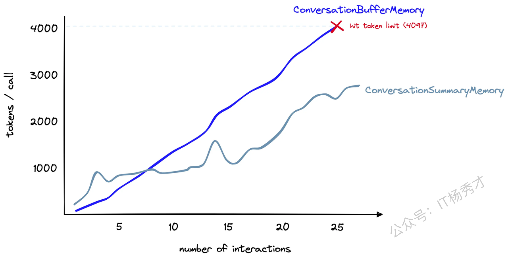

---
tags:
  - AI
  - AI应用开发
  - llm
  - 大模型
  - 大模型应用开发
  - LangChain
  - Data Connection
  - Memory
  - 记忆
---

# Memory


## 1. 什么是 LangChain Memory

LangChain Memory 是 LangChain 框架中的 **记忆（Memory）管理组件**，用于 **存储和管理会话历史**，从而让 LLM（大语言模型）在多轮对话中保持上下文。简单来说，它的主要作用是**给语言模型应用添加“记忆力”**。使得应用能够“记住”之前的交互，从而提供更智能、更自然的对话体验。


## 2. 为什么需要 Memory

默认情况下，LLM 是 **无状态的**，每次调用都是独立的，也就是每次调用都不会记住之前的对话。这种无状态性在需要连续交互的应用（如聊天机器人）中，会导致不少问题，比如**对话不连贯，**&#x6BCF;次提问都需要提供完整的背景信息，否则模型的回答可能会脱离上下文，显得前言不搭后语。而直接把所有历史对话传递给 LLM 又可能导致 Token 超出限制。

所以，引入 Memory 组件，LLM 就能“知道”之前的对话内容，理解当前的交互是在什么背景下发生的，更智能，更准确的提供回复

## 3. ConversationChain  

我们可以以多种方式实现会话记忆，但是它们都是建立在 ConversationChain 之上的。所以在学习这些具体的Memory机制之前，需要先了解一下**ConversationChain。**

在上一章节，我们学习了部分LangChain中的链结构，ConversationChain其实也是属于LangChain中链结构的一种。ConversationChain 是 LangChain 提供的一个基础对话链（Chain），用于处理简单的多轮对话。这个 Chain 最主要的特点就是它提供了包含 AI 前缀和人类前缀的对话摘要格式，这个对话格式能够和记忆机制紧密结合，把上下文作为提示的一部分，在最新的调用中传递给大语言模型，从而让大模型具有记忆功能

### 3.1 ConversationChain的主要组成部分

ConversationChain主要由以下三个部分组成：

1. **LLM（大语言模型）**：用于生成对话回复，如 OpenAI 的 GPT-4、DeepSeek 等

2. **Memory（记忆机制）**：存储对话历史，使模型在多轮对话中具备上下文理解能力，避免“失忆”

3. **Prompt 模板**：定义对话格式，确保模型能正确理解输入和输出

### 3.2 ConversationChain的内置模板

看一个具体的示例，并打印出 ConversationChain 中的内置提示模板

```python
from langchain_deepseek import ChatDeepSeek # 替换为 DeepSeek 模型
from dotenv import load_dotenv

import os

load_dotenv()

# 创建 DeepSeek 模型实例
llm = ChatDeepSeek(
    model="deepseek-chat",
    temperature=0,
    api_key=os.getenv("DEEPSEEK_API_KEY")
)

#初始化对话链
from langchain.chains import ConversationChain
conv_chain = ConversationChain(
    llm=llm,
)

#打印对话的模型
print(conv_chain.prompt.template)

```

程序输出

```python
The following is a friendly conversation between a human and an AI. The AI is talkative and provides lots of specific details from its context. If the AI does not know the answer to a question, it truthfully says it does not know.

Current conversation:
{history}
Human: {input}
AI:
```

可以看到在这个会话模板里，{history}这一栏，就表示它会给到大模型历史的会话信息，{input}则用于存储这一次回话的用户输入，除此之外，我们还注意到，这个绘画模板试图告诉大模型"If the AI does not know the answer to a question, it truthfully says it does not know."，如果他不知道，就回答不知道，请不要胡乱回答，以此来减少幻觉。关于具体的ConversationChain如何跟Memory组件来结合使用，在下面我们详细介绍记忆组件的时候看具体的例子

## 4. Memory组件

LangChain提供了多种Memory组件与ConversationChain结合使用过来完成会话记忆功能，这里主要介绍以下几种比较常见的Memory类型的使用方法

### 4.1 ConversationBufferMemory

ConversationBufferMemory ，即缓冲记忆组件。是 LangChain 中最简单直接的对话Memory组件。正如上面ConversationChain链内置的会话模板所描述的，Human和 AI 之间过去对话会以原始形式原封不动的传递给 `{history}` 参数，也就是它会把整个对话上下文作为提示`（prompt）`的一部分传给大模型。

首先创建一个ConversationChain实例，里面的Memory组件选择ConversationBufferMemory

```python
from langchain.chains.conversation.memory import ConversationBufferMemory

conversation_buf = ConversationChain(
    llm=llm,
    memory=ConversationBufferMemory()
)
```

紧接着输入第一轮会话

```python
conversation_buf("早上好 AI!")
```

程序输出

```python
{'input': '早上好 AI!',
 'history': '',
 'response': '早上好！😊 今天有什么可以帮你的吗？无论是闲聊、解答问题，还是需要一些生活建议，我都很乐意帮忙～ 比如，你想聊聊天气、新闻，或者需要学习/工作上的小技巧？'}
```


可以看到，第一个会话中，history为空，这是因为在第一个会话之前，我们没有历史会话记录了，我们继续对话，输入只有当LLM考虑对话历史时才能回答的提示。还添加了一个 `count_tokens` 函数，以便我们可以看到每个会话交互使用了多少个token

```python
count_tokens(
    conversation_buf, 
    "在这里我感兴趣的是探索将大型语言模型与外部知识集成的可能性"
)
```

程序输出

```python
Spent a total of 749 tokens
```

```python
'太棒了！将大型语言模型（LLM）与外部知识集成是一个非常有前景的方向，尤其是在增强模型的实时性、专业性和可解释性方面。以下是几种常见的集成方式及相关细节，供你探索：\n\n---\n\n### 1. **检索增强生成（RAG, Retrieval-Augmented Generation）**\n   - **原理**：通过外部检索系统（如向量数据库）实时获取相关文档/数据，将其作为上下文输入模型，生成更准确的回答。\n   - **优势**：  \n     - 突破模型训练数据的时效限制（例如回答最新新闻或领域动态）。  \n     - 减少幻觉（Hallucination），答案可追溯来源。  \n   - **工具示例**：  \n     - 向量数据库：Pinecone、Milvus、FAISS。  \n     - 检索框架：LangChain的`RetrievalQA`、LlamaIndex。  \n\n---\n\n### 2. **API/工具调用（Function Calling）**\n   - **原理**：模型通过API调用外部工具（如计算器、数据库、搜索引擎），动态获取信息。  \n   - **应用场景**：  \n     - 实时数据：天气、股票、航班查询（如调用Wolfram Alpha或OpenWeatherMap）。  \n     - 专业计算：数学求解、代码执行。  \n   - **示例**：  \n     - OpenAI的`function calling`功能。  \n     - Hugging Face的`Transformers Agents`。  \n\n---\n\n### 3. **微调（Fine-tuning）+ 领域知识注入**\n   - **方法**：  \n     - 在特定领域数据（如医学、法律文本）上微调模型。  \n     - 结合Adapter或LoRA技术，低成本适配新知识。  \n   - **挑战**：需平衡通用能力与领域特异性，避免灾难性遗忘。  \n\n---\n\n### 4. **多模态扩展**\n   - **集成非文本数据**：如图像、音频、传感器数据，通过多模态模型（如GPT-4V、Flamingo）处理复杂任务。  \n   - **案例**：  \n     - 医疗诊断中结合影像与文本报告。  \n     - 机器人通过语言模型解析环境传感器输入。  \n\n---\n\n### 5. **知识图谱（KG）结合**\n   - **结构化知识**：将知识图谱作为外部存储，模型通过推理路径生成逻辑更严密的回答。  \n   - **工具**：Neo4j、Amazon Neptune，配合图查询语言（如Cypher）。  \n\n---\n\n### 当前挑战\n   - **延迟**：实时检索可能影响响应速度。  \n   - **知识冲突**：如何协调模型内部知识与外部信源。  \n   - **评估**：需设计新指标衡量“知识新鲜度”和集成效果。  \n\n如果需要深入某个方向（比如代码示例或论文推荐），可以告诉我！你目前有具体的应用场景或技术栈吗？ 😊'
```


接着输入会话内容

```python
count_tokens(
    conversation_buf,
    "我只是想分析不同的可能性。你能想到哪些？"
)
```

输出

```python
Spent a total of 1603 tokens
```

```python
'当然可以！将大型语言模型（LLM）与外部知识集成的方式多种多样，每种方法都有其独特的适用场景和优缺点。以下是一个更全面的可能性分析框架，涵盖技术、应用和前沿探索方向：\n\n---\n\n### **一、按集成技术分类**\n1. **动态检索型**  \n   - **RAG（检索增强生成）**：实时从数据库/网络检索信息，适合时效性强的场景（如客服、新闻摘要）。  \n   - **搜索引擎联动**：直接调用Google/Bing API（如Perplexity AI的做法）。  \n\n2. **静态知识注入型**  \n   - **微调（Fine-tuning）**：注入领域知识，但需定期重新训练。  \n   - **知识蒸馏**：从专家模型或知识库中提取关键信息压缩到LLM中。  \n\n3. **工具调用型**  \n   - **API/函数调用**：模型触发外部工具（如计算、数据库查询）。  \n   - **插件系统**：如ChatGPT插件，连接Wolfram、Zapier等。  \n\n4. **混合架构型**  \n   - **LLM + 知识图谱**：用图谱处理结构化关系（如药品相互作用查询）。  \n   - **LLM + 数据库**：直接生成SQL查询或与NoDB交互。  \n\n---\n\n### **二、按知识类型分类**\n1. **结构化知识**  \n   - 数据库（SQL/NoSQL）、知识图谱、Excel表格。  \n   - *用例*：金融报表分析、供应链优化。  \n\n2. **非结构化知识**  \n   - 文档（PDF/网页）、论文、会议记录。  \n   - *用例*：法律合同审查、学术研究辅助。  \n\n3. **多模态知识**  \n   - 图像、视频、音频（如CLIP或Whisper提取的嵌入）。  \n   - *用例*：医疗影像描述、视频内容摘要。  \n\n4. **实时数据流**  \n   - 传感器数据、社交媒体动态、IoT设备输入。  \n   - *用例*：工厂设备故障诊断、舆情监控。  \n\n---\n\n### **三、按应用场景分类**\n1. **垂直领域专业化**  \n   - 医疗（UpToDate临床指南集成）、法律（判例库查询）。  \n   - *挑战*：领域术语准确性和合规性。  \n\n2. **通用知识增强**  \n   - 结合维基百科、ArXiv等开放知识源，提升常识推理。  \n\n3. **个性化交互**  \n   - 集成用户个人数据（邮件、日历）实现定制化回答（需隐私保护）。  \n\n4. **创造性协作**  \n   - 链接设计素材库（如Canva）、音乐样本库辅助创作。  \n\n---\n\n### **四、前沿探索方向**\n1. **主动学习型集成**  \n   - 模型自主判断何时需要检索外部知识（如Meta的“Toolformer”）。  \n\n2. **自更新知识库**  \n   - 自动爬取/验证新知识并更新本地存储（如AutoGPT）。  \n\n3. **联邦学习+知识集成**  \n   - 跨多个私有知识源协作，无需集中存储数据。  \n\n4. **因果推理增强**  \n   - 结合因果模型（如DoWhy）提升逻辑一致性。  \n\n5. **具身智能（Embodied AI）**  \n   - 机器人通过LLM理解环境知识（如PaLM-E）。  \n\n---\n\n### **五、潜在风险与权衡**\n- **准确性 vs. 延迟**：检索需要时间，可能影响用户体验。  \n- **可控性 vs. 灵活性**：严格的知识约束可能限制创造性。  \n- **隐私 vs. 个性化**：医疗等敏感领域需数据隔离机制。  \n\n如果需要，我可以针对某一类可能性展开具体案例或技术实现路径（比如“如何用LlamaIndex实现RAG”或“知识图谱的图神经网络结合方案”）——你对哪个维度最感兴趣？ 😊'
```


再接着问下一个问题

```python
count_tokens(
    conversation_buf, 
    "可以使用哪些类型的数据源来为模型提供上下文"
)
```

输出

```python
Spent a total of 2727 tokens
```

````python
'为大型语言模型（LLM）提供上下文的数据源类型非常丰富，可以根据结构化程度、领域特异性、实时性等维度进行分类。以下是详细的分类及典型示例：\n\n---\n\n### **1. 结构化数据源**\n**特点**：格式规范、易于机器解析，适合精准查询和逻辑推理。  \n- **关系型数据库**：  \n  - MySQL、PostgreSQL中的表格数据（如用户信息、交易记录）。  \n  - *用例*：生成SQL查询报告、电商订单分析。  \n- **NoSQL数据库**：  \n  - MongoDB（JSON文档）、Cassandra（宽列存储）。  \n  - *用例*：社交媒体的用户行为日志分析。  \n- **知识图谱**：  \n  - Neo4j、Amazon Neptune中的实体关系网络（如药品-副作用关联）。  \n  - *用例*：医疗诊断推理、企业知识管理。  \n- **电子表格/CSV**：  \n  - Excel、Google Sheets中的统计数据。  \n  - *用例*：财务预测、学术数据可视化。  \n\n---\n\n### **2. 非结构化数据源**\n**特点**：自由文本或混合格式，需预处理（如嵌入、分块）才能利用。  \n- **文档与书籍**：  \n  - PDF、Word、Markdown文件（如产品手册、研究论文）。  \n  - *用例*：合同条款提取、自动摘要生成。  \n- **网页内容**：  \n  - 静态网页（Wikipedia）、动态页面（新闻网站）。  \n  - *工具*：Scrapy、BeautifulSoup爬虫 + Readability提取正文。  \n- **学术资源**：  \n  - ArXiv论文、PubMed医学摘要、专利数据库（如USPTO）。  \n  - *用例*：文献综述辅助、技术趋势分析。  \n- **用户生成内容**：  \n  - 论坛帖子（Reddit）、评论、社交媒体（Twitter）。  \n  - *挑战*：需过滤噪声和偏见。  \n\n---\n\n### **3. 实时/动态数据源**\n**特点**：高频更新，需API或流式处理集成。  \n- **搜索引擎**：  \n  - Google/Bing的定制搜索API（时效性答案）。  \n- **金融与市场数据**：  \n  - 股票（Yahoo Finance）、加密货币（CoinGecko API）。  \n- **天气与地理**：  \n  - OpenWeatherMap、NASA Earthdata。  \n- **物联网（IoT）流**：  \n  - 传感器数据（温度、湿度）、工业设备日志。  \n\n---\n\n### **4. 多模态数据源**\n**特点**：超越文本，需多模态模型处理。  \n- **图像与视频**：  \n  - 医学影像（DICOM）、监控视频帧 + 描述文本。  \n  - *工具*：CLIP、BLIP-2生成文本描述供LLM理解。  \n- **音频与语音**：  \n  - 会议录音（转文字后输入）、播客内容。  \n  - *工具*：Whisper ASR + LLM摘要。  \n- **3D/传感器数据**：  \n  - LiDAR点云、机器人环境地图（如ROS话题数据）。  \n\n---\n\n### **5. 私有/专有数据源**\n**特点**：需权限管理，常需本地化部署。  \n- **企业内网资源**：  \n  - Confluence文档、Jira工单、Slack历史消息（需合规访问）。  \n- **个人数据**：  \n  - 电子邮件、日历事件（如Google Workspace集成）。  \n- **行业数据库**：  \n  - 医疗EMR系统（Epic）、法律Westlaw判例库。  \n\n---\n\n### **6. 合成/增强数据源**\n**特点**：人工生成或增强的数据，用于特定场景。  \n- **数据增强工具**：  \n  - GPT生成模拟对话、Diffusion模型生成虚拟场景描述。  \n- **仿真环境**：  \n  - Unity/MuJoCo输出的虚拟机器人训练日志。  \n\n---\n\n### **选择数据源的关键考量**  \n1. **质量**：准确性、覆盖度、偏见（如社交媒体数据可能不中立）。  \n2. **更新频率**：新闻需分钟级更新，百科全书可年更。  \n3. **访问成本**：API调用费用（如Bloomberg Terminal） vs. 开源数据。  \n4. **法律与伦理**：GDPR合规性、版权问题（如Scraping争议）。  \n\n---\n\n### **技术集成示例**  \n- **RAG流程**：  \n  1. 用LlamaIndex将PDF分块并向量化。  \n  2. 存入Pinecone，查询时检索最相似的3个段落作为上下文。  \n- **API调用**：  \n  ```python  \n  # 伪代码：天气API + LLM生成建议  \n  weather = get_weather_api(location="北京")  \n  prompt = f"北京今天天气是{weather}，推荐穿什么衣服？"  \n  llm_response = generate(prompt)  \n  ```  \n\n如果需要针对某一类数据源（如“如何高效解析PDF表格”或“实时流数据处理架构”）深入探讨，可以进一步展开！ 😊'
````


最后问一下我最初的目的是什么，看看大模型能否记得

```python
count_tokens(
    conversation_buf, 
    "我的目标是什么来着？"
)
```

结果如下：

```python
Spent a total of 3077 tokens
```

```python
'根据我们之前的对话，你最初的目标是 **“探索将大型语言模型与外部知识集成的可能性”**，并进一步分析了不同类型的数据源如何为模型提供上下文。不过，如果你现在感觉方向有些模糊，我们可以重新梳理或调整目标。以下是可能的进展路径：\n\n---\n\n### **1. 回顾初始目标**\n- **核心问题**：如何让LLM结合外部知识以增强能力？  \n- **已覆盖内容**：  \n  - 集成方法（RAG、API调用、知识图谱等）。  \n  - 数据源类型（结构化、非结构化、实时等）。  \n\n---\n\n### **2. 可能的下一步方向**  \n根据你的兴趣，可以选择：  \n- **技术实现**：  \n  - 动手实验某个方法（如用LangChain搭建RAG系统）。  \n  - 比较不同工具（LlamaIndex vs. Haystack）。  \n- **场景深化**：  \n  - 聚焦某一领域（如医疗、金融）的集成案例。  \n  - 研究如何解决特定问题（如减少幻觉、处理知识冲突）。  \n- **理论探索**：  \n  - 知识集成对模型评估指标的影响（如新鲜度、可解释性）。  \n\n---\n\n### **3. 需要我帮你明确什么？**  \n- 是否想转向具体应用？  \n- 需要更基础的原理解释？  \n- 或者只是想自由发散讨论？  \n\n请随时告诉我你的想法，我们可以随时调整方向！ 😊  \n\n（如果连初始目标也想调整，比如转向“如何评估集成效果”或“隐私保护方案”，也完全没问题～）'
```


LLM 可以清楚地记住对话的历史，很正确的回答出我的初衷。接着看看 ConversationBufferMemory 是如何存储这个会话历史的

```python
print(conversation_buf.memory.buffer)
```

结果如下图所示


可以看到，缓冲区直接保存了聊天历史中的每次交互。这种做法有几个优缺点

| 优点                  | 缺点                                                                               |
| ------------------- | -------------------------------------------------------------------------------- |
| 存储所有会话，提供给大模型的信息很全面 | 更多token消耗，意味着响应时间变慢和成本增加                                                         |
| 存储所有会话，简单直观         | 长对话无法记住，因为我们达到了LLM的token限制&#xA;text-davinci-003 和 gpt-3.5-turbo 的文本限制为 4096 个令牌） |

所以，整体而言，onversationBufferMemory 是一个很好的Memory入门选项，但受限于每次交互的存储

### 4.2 ConversationBufferWindowMemory

ConversationBufferWindowMemory，即缓冲窗口记忆组件， 是一种“滑动窗口式”的对话记忆方式。它的核心思想是：只保留最近的几轮人类和 AI 之间的对话记录，而不是把全部历史都存下来。相比之前的 ConversationBufferMemory，它多了一个参数参数k，意思是只记住最近 `k` 轮对话，然后“忘记”之前的互动。具体示例如下：

```python
from langchain.chains.conversation.memory import ConversationBufferWindowMemory

conversation_bufw = ConversationChain(
        llm=llm,
        memory=ConversationBufferWindowMemory(k=1)
)
```

在这个例子中，我们设置了 `k=1` ，这意味着窗口只会记住Human和 AI 之间的最新一次交互。而之前的聊天会话都将被抛弃。接下来还是进行跟刚刚onversationBufferMemory一样的几轮对话，看一下最终的效果


连续进行4轮对话之后，可以发现，当我再次问我的初衷，即我第一个问题的时候，大模型会把我上一个问题作为第一个问题给我回复。这是因为我们设置的ConversationBufferWindowMemory的参数k为1，所以大模型只会记住我们上一轮对话，如果想让大模型记住的内容更多一些，我们可以适当的调大这个参数k。

我们还可以这样看模型的有效“记忆”

```python
bufw_history = conversation_bufw.memory.load_memory_variables(
    inputs=[]
)['history']
print(bufw_history)
```

输出

```python
Human: 我的目标是什么来着？
AI: 看起来你可能在对话中暂时忘记了最初的目标，这很正常！不过根据我们之前的讨论，你最初的问题是询问**“可以使用哪些类型的数据源来为模型提供上下文”**，而我已经详细列出了结构化/非结构化数据、公共/私有数据源、领域分类等技术细节。  

如果这是你原本的目标，是否需要：  
1. **更聚焦的指导**？例如具体到某个行业（医疗/金融）的数据源选择？  
2. **技术实现建议**？比如如何将某种数据源（如数据库或API）接入LLM？  
3. **调整目标方向**？比如从数据源转向模型训练或应用场景？  

或者，你现在的目标是否已经发生了变化？可以随时告诉我，我会根据你的新方向重新调整回答！ 🌟  

（小提示：如果你完全忘记了上下文，可以尝试回顾聊天记录或描述当前困惑，我会帮你梳理~）
```

所以，如果我们只需要记忆最近的会话内容，ConversationBufferWindowMemory是一个很好的选择

### 4.3 ConversationSummaryMemory

ConversationSummaryMemory，即摘要记忆组件。为了避免过度使用token，我们除了可以使用ConversationBufferWindowMemory外，还可以使用 ConversationSummaryMemory 。使用ConversationBufferWindowMemory有一个缺陷，那就是只能记住最近几次会话，这对于需要长会话记忆的场景就不是用了。而ConversationSummaryMemory却可以弥补这个缺陷，ConversationSummaryMemory正如其名所示，这种形式的Memory在回答新问题的时候，对之前的问题进行了总结性的重述。ConversationSummaryMemory（对话总结记忆）的思路就是将对话历史进行汇总，然后再传递给 {history} 参数。具体示例如下：

```python
from langchain.chains.conversation.memory import ConversationSummaryMemory

conversation_sum = ConversationChain(
    llm=llm,
    memory=ConversationSummaryMemory(llm=llm)
)
```

这里我们注意到，在使用 ConversationSummaryMemory 时，我们需要向对象传递一个LLM实例参数，因为历史会话的汇总功能由另一个 LLM 驱动的，这意味着对话的汇总实际上是由 AI 自己进行的。

我们可以通过以下方法看一下它在生成对话内容总结时所用的提示词模板

```python
print(conversation_sum.memory.prompt.template)
```

程序输出

```python
Progressively summarize the lines of conversation provided, adding onto the previous summary returning a new summary.

EXAMPLE
Current summary:
The human asks what the AI thinks of artificial intelligence. The AI thinks artificial intelligence is a force for good.

New lines of conversation:
Human: Why do you think artificial intelligence is a force for good?
AI: Because artificial intelligence will help humans reach their full potential.

New summary:
The human asks what the AI thinks of artificial intelligence. The AI thinks artificial intelligence is a force for good because it will help humans reach their full potential.
END OF EXAMPLE

Current summary:
{summary}

New lines of conversation:
{new_lines}

New summary:
```

这个模板的大致意思是：

> 请对提供的对话内容进行逐步总结，在已有摘要的基础上添加新的总结内容

其中 `{summary}` 是之前的摘要，`{new_lines}` 是新增的对话，模型根据这两部分内容生成 `NEW_SUMMARY`。

然后，我们用ConversationSummaryMemory再进行一次前几轮的对话，看一下最终的效果


可以看到，用这种Memory组件，大模型能够“记住”我们的原始目标，给出我们想要的答复，我们可以再看一下会话总结的具体内容

```python
print(conversation_sum.memory.buffer)
```

输出如下图所示：


使用这种方法，在回答完最后一个问题是，最终我们在消耗了1953个token，而使用ConversationBufferMemory最终我们消耗了3077个token，可见token数量确实减少了。那是否用ConversationSummaryMemory就一定比ConversationBufferMemory好呢？

答案是：**不一定，**&#x5BF9;于较长的历史胡会话，使用会话总结可能会有效减少token，而对于本身会话历史就很少，再用ConversationSummaryMemory可能反而会增加token的消耗。

下图是一个token消耗随会话次数变化的关联曲线图，反映了ConversationBufferMemory与ConversationSummaryMemory的token计数（y 轴）随交互次数（x 轴）增加的变化趋势



假设我们有一个很长的会话，ConversationSummaryMemory最初使用的标记数量要多得多。然而，随着对话的进行，ConversationSummaryMemory消耗的token增长速度逐渐减慢。相比之下，ConversationBufferMemory继续与聊天中的token数量线性增长。

**ConversationSummaryMemory 的优势在于，它通过对对话内容进行总结摘要，有效降低了 Token 的使用量，从而能保留更多轮的历史记录，非常适合处理多轮、长时间的对话。同时，它的使用方式也相对直观。**

然而，它也存在一些局限。对于较短的对话，摘要机制反而可能带来额外的 Token 消耗，不划算。此外，它的记忆效果高度依赖于用于摘要的 LLM 的质量和表现，而摘要本身也需要消耗额外的 Token，这在一定程度上增加了成本。

虽然 ConversationSummaryMemory 能通过压缩对话历史来优化 Token 管理，适用于长对话场景，但它并不能完全突破大模型上下文长度的限制——随着对话的不断推进，最终还是可能触及模型的最大上下文边界。

### 4.4 ConversationSummaryBufferMemory

ConversationSummaryBufferMemory ，即摘要缓存记忆组件，其实是 ConversationSummaryMemory 和ConversationBufferWindowMemory 的混合，它旨在在对话中总结早期的互动，同时尽量保留最近互动中的原始内容。它有一个`max_token_limit`参数，当最新的对话文字长度在 `max_token_limit` 以内的时候，LangChain 会记忆原始对话内容；当对话文字超出了这个参数的长度，那么模型就会把所有超过预设长度的内容进行总结，以节省 Token 数量

由于国内模型在langchain的集成中对token计数功能封装的不是很好，比如langchain\_deepseek就不支持，所以这里为了方便，就直接选用OpenApi模型来测试

```python
from langchain.memory import ConversationSummaryBufferMemory
from langchain.chains import ConversationChain
from langchain_community.chat_models import ChatOpenAI
from dotenv import load_dotenv
import os

# 加载环境变量
load_dotenv()

# 获取 API 密钥
openai_api_key = os.getenv("OPENAI_API_KEY")

# 创建 LLM 实例
llm = ChatOpenAI(
    model="gpt-3.5-turbo",
    temperature=0,
    openai_api_key=openai_api_key
)


# 创建对话记忆
memory = ConversationSummaryBufferMemory(
    llm=llm,
    max_token_limit=300,
)

# 创建对话链
conversation_sum_buf = ConversationChain(
    llm=llm,
    memory=memory,
)
```

紧接着还是进行上面例子中的几轮对话


可以看到，大模型还是给了我们正确的回复。我们在打印一下它存储的历史会话记录，看看它是如何存储的

```python
print(conversation_sum_buf.memory.buffer)
```

输出

```python
System: The human greets the AI in Chinese and discusses integrating large language models with external knowledge. The AI suggests using knowledge graphs, multimodal learning, transfer learning, and reinforcement learning to enhance the model's knowledge base. The human asks about using different types of data sources to provide context, and the AI recommends using text, image, video, audio, and structured data sources. By combining these diverse data sources, the model can better understand the world and make accurate predictions.
Human: 我的目标是什么来着？
AI: 您的目标是根据您的输入和需求来获取有关大型语言模型和外部知识集成的信息。您希望了解如何利用知识图谱、多模态学习、迁移学习和强化学习来增强模型的知识库。您还询问了关于使用不同类型的数据源来提供上下文的问题，我建议使用文本、图像、视频、音频和结构化数据源。通过结合这些多样化的数据源，模型可以更好地理解世界并做出准确的预测。您的目标是获取关于这些主题的详细信息吗？
```

可以看到它完整的只保存了我们最后一次会话记录，这是因为我们把`max_token_limit`设置的非常小，只设置为300，但是它为什么还能知道我们最初的第一次会话内容，准确回答呢？因为这些信息被ConversationSummaryBufferMemory中的“摘要”组件捕获，尽管它被“缓冲窗口”组件遗漏了

虽然在使用上，ConversationSummaryBufferMemory需要调整要总结的内容和缓冲窗口内要保留的内容，但 ConversationSummaryBufferMemory 却给了我们很多灵活性，并且是我们迄今为止唯一一种可以记住遥远交互并以原始形式存储最近交互的内存类型


上图是随着会话次数的增加，各种记忆组件消耗tokens的数量关系曲线，可以看到尽管ConversationSummaryBufferMemory既包括历史会话的摘要，有包括最近的会话原始记录，蛋它的 token 计数增加与其他方法相比还是很有竞争力的

### 4.5 其他会话记忆组件

除了上述提到的 Memory 方式之外，LangChain 的官方网站https://api.python.langchain.com/en/latest/langchain/memory.html中还提供了一些其他的记忆方式，比如ConversationKnowledgeGraphMemory 和 ConversationEntityMemory，这里就不再做过多赘述，感兴趣的可以去官网详细看看的具它们体用法。

## 5. 小结

LangChain 框架中的 Memory 组件，它是构建具有上下文感知能力的应用（如聊天机器人）的关键。由于大型语言模型（LLM）本身是无状态的，Memory 组件通过存储和管理会话历史，从而让大模型具备了“记忆力”。并且LangChain提供了多种Memory，具体选择哪种 Memory 组件，取决于具体的应用场景，需要综合考虑对话长度、上下文保留的详细程度、Token 成本以及响应时间等因素。

总之，LangChain 的 Memory 组件为开发者提供了强大的工具集，可以根据不同场景灵活选择和配置，从而构建出更加智能、自然和拥有持续记忆能力的语言模型应用


