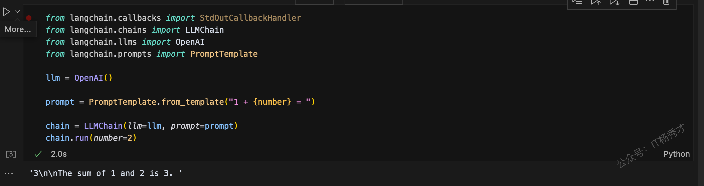
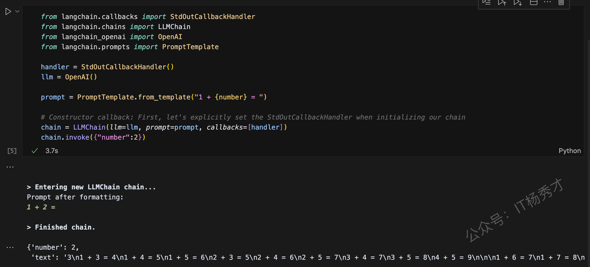
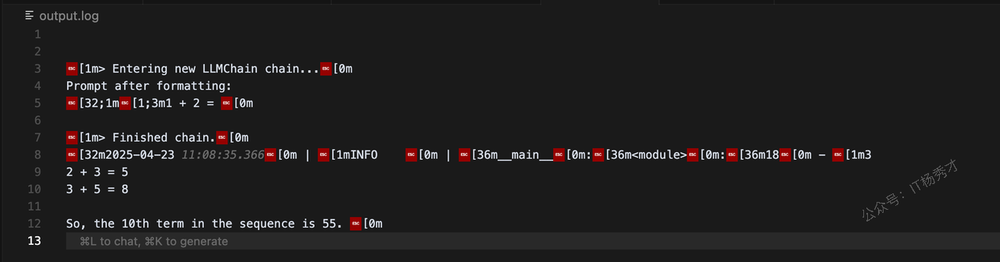
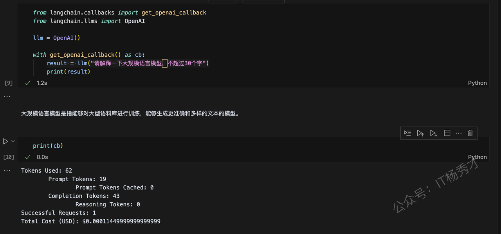

---
tags:
  - AI
  - AI应用开发
  - llm
  - 大模型
  - 大模型应用开发
  - LangChain
  - Callbacks
  - 回调
---

# Callbacks

## 1. 什么是 LangChain 回调

回调，即callbacks，是一种高效管理大规模语言模型应用程序的日志记录、监控、流式传输和其他方面的功能。"回调"的概念并不局限于LangChain ，在很多应用开发场景中都有使用。因此，这里首先简单回顾一下回调的基本概念。

在编程中，回调是一种当某个事件发生或某个条件满足时自动调用的函数或方法。比如，假设在加载文本文件后，想要自动解析其内容并计算字符数。在这种情况下，设置一个回调函数，以便在文件加载完成时自动开始分析过程。这时可以设计一个回调函数，在文件加载完成后自动计算字符数。

LangChain 的 Callbacks 针对大规模语言模型的运行进行了优化，可以在特定任务完成或特定事件发生时被调用。这使得开发人员可以在特定的时间点执行自定义逻辑。比如，当 LangChain 的学习过程结束时发送通知，根据特定条件提前终止学习，记录学习中模型的性能等，可以在多种场景中使用

## 2. 回调的三个功能

### 2.1 日志记录

日志记录是记录程序执行期间发生的事件和数据的能力。这个功能对于调试、性能分析、安全审计等很有用。比如，LangChain 的`StdOutCallbackHandler`之类的函数，可以将每个事件输出到控制台，以及`FileCallbackHandler`可以将每个事件保存到文件中。

### 2.2 流式传输

流式传输是实时发送和接收数据的能力。使用回调函数进行流式传输时的重要方法就是`on_llm_new_token`。每次生成新的令牌时都会调用此方法，让用户可以实时接收生成的数据。另外，也可以在自定义处理程序中实现此方法以允许实时数据处理。

### 2.3 Token计数

Token计数是一种测量语言模型所消耗的Token数量的函数。标记是文本的最小划分。通常，一个单词或符号算作一个Token。由于大规模语言模型的API使用有一定的使用限制，该功能可以让你直观的看到和管理消耗的token数量。

## 3. 回调处理器

在使用 LangChain 的 Callbacks 时，最重要的是回调处理器。回调处理器是一个对象，它允许我们在应用程序的特定事件上执行自己定义的处理逻辑

### 3.1 回调处理器支持的事件

LangChain中常用的回调处理器的方法对应的事件如下

| **回调函数**               | **解释**             |
| ---------------------- | ------------------ |
| on\_llm\_start         | 调用 LLM（大语言模型）开始执行时 |
| on\_chat\_model\_start | 当聊天模型启动时           |
| on\_llm\_new\_token    | LLM 每生成一个新 token 时 |
| on\_llm\_end           | LLM 返回结果时          |
| on\_llm\_error         | 当 LLM 中出现错误时       |
| on\_chain\_start       | 当链操作开始时            |
| on\_chain\_end         | 当链操作结束时            |
| on\_chain\_error       | 当链中发生错误时           |
| on\_tool\_start        | 当工具启动时             |
| on\_tool\_end          | 当工具完成操作时           |
| on\_tool\_error        | 当工具发生错误时           |
| on\_text               | 当输出任何文本时           |
| on\_agent\_action      | Agent动作            |
| on\_agent\_finish      | 当Agent退出时          |

## 4. BaseCallbackHandler

`BaseCallbackHandler` 是一个基本的回调处理器类，用于处理来自 LangChain 的回调。它定义如下：

```python
class BaseCallbackHandler:
    """Base callback handler that can be used to handle callbacks from langchain."""

    def on_llm_start(
        self, serialized: Dict[str, Any], prompts: List[str], **kwargs: Any
    ) -> Any:
        """Run when LLM starts running."""

    def on_chat_model_start(
        self, serialized: Dict[str, Any], messages: List[List[BaseMessage]], **kwargs: Any
    ) -> Any:
        """Run when Chat Model starts running."""

    def on_llm_new_token(self, token: str, **kwargs: Any) -> Any:
        """Run on new LLM token. Only available when streaming is enabled."""

    def on_llm_end(self, response: LLMResult, **kwargs: Any) -> Any:
        """Run when LLM ends running."""

    def on_llm_error(
        self, error: Union[Exception, KeyboardInterrupt], **kwargs: Any
    ) -> Any:
        """Run when LLM errors."""

    def on_chain_start(
        self, serialized: Dict[str, Any], inputs: Dict[str, Any], **kwargs: Any
    ) -> Any:
        """Run when chain starts running."""

    def on_chain_end(self, outputs: Dict[str, Any], **kwargs: Any) -> Any:
        """Run when chain ends running."""

    def on_chain_error(
        self, error: Union[Exception, KeyboardInterrupt], **kwargs: Any
    ) -> Any:
        """Run when chain errors."""

    def on_tool_start(
        self, serialized: Dict[str, Any], input_str: str, **kwargs: Any
    ) -> Any:
        """Run when tool starts running."""

    def on_tool_end(self, output: str, **kwargs: Any) -> Any:
        """Run when tool ends running."""

    def on_tool_error(
        self, error: Union[Exception, KeyboardInterrupt], **kwargs: Any
    ) -> Any:
        """Run when tool errors."""

    def on_text(self, text: str, **kwargs: Any) -> Any:
        """Run on arbitrary text."""

    def on_agent_action(self, action: AgentAction, **kwargs: Any) -> Any:
        """Run on agent action."""

    def on_agent_finish(self, finish: AgentFinish, **kwargs: Any) -> Any:
        """Run on agent end."""
```

`BaseCallbackHandler` 还可以作为其他回调处理器的父类。所有方法默认不做任何操作，但在子类中可以被重写。

## 5. Callbacks 的功能和用法

### 5.1 日志

日志记录程序运行不可或缺的部分，在LangChain中也不例外。。在 LangChain 中，有将每个事件输出到控制台的 `StdOutCallbackHandler` 负责将对应事件发生时的日志记录到控制台，`FileCallbackHandler`将事件写入文件的&#x20;

#### 5.1.1 StdOutCallbackHandler 实现

`StdOutCallbackHandler` 继承了 `BaseCallbackHandler` ，并在事件发生时将日志输出到控制台。

在这里，我们将比较在没有使用 `StdOutCallbackHandler` 和 使用 `StdOutCallbackHandler` 的情况下执行链时的情况。

1. 如果没有使用 `StdOutCallbackHandler`

```python
from langchain.callbacks import StdOutCallbackHandler
from langchain.chains import LLMChain
from langchain.llms import OpenAI
from langchain.prompts import PromptTemplate

llm = OpenAI()

prompt = PromptTemplate.from_template("1 + {number} = ")

chain = LLMChain(llm=llm, prompt=prompt)
chain.run(number=2)
```

首先，导入所需的类和库，然后创建 `OpenAI` 的实例，然后使用 `PromptTemplate.from_template("1 + {number} = ")` 创建提示模板。这个模板可以在后面将 `{number}` 部分替换为具体的数值。接下来实例化 LLMChain。这将语言模型（这里为llm）、提示（这里为 prompt）组合在一起，执行一系列处理。最后，通过调用 `chain.invoke({"number":2})` 来执行链。此时，提示模板中的 `{number}` 部分会用 2 来替换。

程序输出

```python
'3\n\nThe sum of 1 and 2 is 3. '
```



* 使用 `StdOutCallbackHandler`

在下面的代码中，使用 `StdOutCallbackHandler` 来输出链执行结果的日志到控制台、

```python
from langchain.callbacks import StdOutCallbackHandler
from langchain.chains import LLMChain
from langchain_openai import OpenAI 
from langchain.prompts import PromptTemplate

handler = StdOutCallbackHandler()
llm = OpenAI()

prompt = PromptTemplate.from_template("1 + {number} = ")

# Constructor callback: First, let's explicitly set the StdOutCallbackHandler when initializing our chain
chain = LLMChain(llm=llm, prompt=prompt, callbacks=[handler])
chain.invoke({"number":2})
```

程序输出

```python
> Entering new LLMChain chain...
Prompt after formatting:
1 + 2 = 

> Finished chain.
{'number': 2,
 'text': '3\n1 + 3 = 4\n1 + 4 = 5\n1 + 5 = 6\n2 + 3 = 5\n2 + 4 = 6\n2 + 5 = 7\n3 + 4 = 7\n3 + 5 = 8\n4 + 5 = 9\n\n\n1 + 6 = 7\n1 + 7 = 8\n1 + 8 = 9\n1 + 9 = 10\n2 + 6 = 8\n2 + 7 = 9\n2 + 8 = 10\n3 + 6 = 9\n3 + 7 = 10\n4 + 6 = 10\n5 + 6 = 11\n5 + 7 = 12\n6 + 7 = 13\n8 + 9 = 17'}
```



如果不使用 `StdOutCallbackHandler` ，代码的不同之处在于创建了 `StdOutCallbackHandler` 的实例，并在将 LLMChain 实例化时将回调也组合在一起。

#### 5.1.2 **`FileCallbackHandler` 实现**

`FileCallbackHandler` 继承自 `BaseCallbackHandler` ，并在每个事件中将输出保存到文件中。在以下代码中，使用 `FileCallbackHandler` 来输出链的执行结果的日志到output.log文件中。

将输出保存到文件中，需要用到loguru库，第一步需要先执行以下命令安装

```python
pip install loguru
```

接着运行一下代码示例

```python
from loguru import logger
from langchain.callbacks import FileCallbackHandler
from langchain.chains import LLMChain
from langchain.llms import OpenAI
from langchain.prompts import PromptTemplate

logfile = "output.log"
logger.add(logfile, colorize=True, enqueue=True)

handler = FileCallbackHandler(logfile)
llm = OpenAI()
prompt = PromptTemplate.from_template("1 + {number} = ")

chain = LLMChain(llm=llm, prompt=prompt, callbacks=[handler], verbose=True)

answer = chain.run(number=2)

logger.info(answer)
```

首先，导入所需的类和库，然后指定保存目标文件的 `logfile`。接着，使用 `logger.add(logfile, colorize=True, enqueue=True)` 来添加一个新的日志文件。接下来，实例化 `FileCallbackHandler` 和 `OpenAI` 并创建一个提示模板。然后，实例化 LLMChain。这表示使用 OpenAI 的语言模型从 `PromptTemplate` 模板生成提示，并使用 `FileCallbackHandler` 回调函数将结果输出到文件的链。最后， `answer = chain.run(number=2)` 执行 `chain` ，将结果赋值给 `answer` 变量，并在 `logger.info(answer)` 中将 `answer` 的值写入日志文件。查看当前目录下的output.log，文件中写入的结果如下：

```python
[1m> Entering new LLMChain chain...[0m
Prompt after formatting:
[32;1m[1;3m1 + 2 = [0m

[1m> Finished chain.[0m
[32m2025-04-23 11:08:35.366[0m | [1mINFO    [0m | [36m__main__[0m:[36m<module>[0m:[36m18[0m - [1m3
2 + 3 = 5
3 + 5 = 8

So, the 10th term in the sequence is 55. [0m
```



### 5.2 流式传输(streaming)

流式传输是一种实时处理接收到的数据的功能，以下代码创建了一个 `MyCustomHandler` ，每当生成新令牌时都会打印该令牌。然后，将 `MyCustomHandler` 传递给聊天模型的构造函数以启用流式传输。`MyCustomHandler` 继承了 `BaseCallbackHandler` 。

```python
from langchain.callbacks.base import BaseCallbackHandler
from langchain.schema import HumanMessage
from langchain_openai import ChatOpenAI

class MyCustomHandler(BaseCallbackHandler):
    def on_llm_new_token(self, token: str, **kwargs) -> None:
        print(f"My custom handler, token: {token}")

chat = ChatOpenAI(max_tokens=25, streaming=True, callbacks=[MyCustomHandler()])

chat([HumanMessage(content="Tell me a joke")])
```

首先，在导入所需的类和库之后，继承 `BaseCallbackHandler` 创建 `MyCustomHandler` 。在 `MyCustomHandler` 中，通过重写 `on_llm_new_token` 来实现流式处理，并将其定义为一个方法。每当生成新令牌时， `on_llm_new_token` 会被调用，可以实时接收生成的数据。在这个代码中，流式处理仅仅是打印令牌，但通过改变 `MyCustomHandler` 的内容，也可以进行其他处理。接下来，我们将 chat 模型的 `ChatOpenAI` 的 callbacks 的参数指定为 `MyStreamingHandler` 。最后，通过 `chat([HumanMessage(content="Tell me a joke")])` ，向聊天机器人发送"Tell me a joke"这条消息，并指示其生成相应的响应。

程序输出

```python
My custom handler, token:
My custom handler, token: Why
My custom handler, token:  don
My custom handler, token: 't
My custom handler, token:  scientists
My custom handler, token:  trust
My custom handler, token:  atoms
My custom handler, token: ?
My custom handler, token:


My custom handler, token: Because
My custom handler, token:  they
My custom handler, token:  make
My custom handler, token:  up
My custom handler, token:  everything
My custom handler, token: .
My custom handler, token:
```

首先，在导入所需的类和库之后，继承 `BaseCallbackHandler` 创建 `MyCustomHandler` 。在 `MyCustomHandler` 中，通过重写 `on_llm_new_token` 来实现流式处理，并将其定义为一个方法。每当生成新令牌时， `on_llm_new_token` 会被调用，可以实时接收生成的数据。在这个代码中，流式处理仅仅是打印令牌，但通过改变 `MyCustomHandler` 的内容，也可以进行其他处理。

### 5.3 令牌计数

Token计数是一种用于计算语言模型中消耗的Token数量的功能。令牌是指将文本分割成最小单位。通过此功能，您可以查看消耗的令牌数量。

在这里，我们将使用 `get_openai_callback`函数来介绍如何执行Token计数。`get_openai_callback` 函数定义如下， `get_openai_callback` 在定义 `OpenAICallbackHandler` 时使用了 `BaseCallbackHandler` ，`OpenAICallbackHandler` 是继承了 `BaseCallbackHandler` 的类。

```python
from langchain.callbacks import get_openai_callback
from langchain.llms import OpenAI

llm = OpenAI()

with get_openai_callback() as cb:
    result = llm("请解释一下大规模语言模型，不超过30个字")
    print(result)
```

这里使用了 `get_openai_callback()` 中的回调，在调用 OpenAI 的 API 时获取相关信息。这段代码中，向语言模型输入了"请解释一下大规模语言模型，不超过30个字"这个提示，通过`print(result)`获取大模型对于这个问题的回答

```python
大规模语言模型是指能够对大型语料库进行训练，能够生成更准确和多样的文本的模型。
```

这里不仅获取大模型对于此问题的答案result，还可以通过`print(cb)`获取了消耗的总令牌数、提示Token数和生成的Token数等信息后面这

```python
print(cb)
```

程序输出

```python
Tokens Used: 62
        Prompt Tokens: 19
                Prompt Tokens Cached: 0
        Completion Tokens: 43
                Reasoning Tokens: 0
Successful Requests: 1
Total Cost (USD): $0.00011449999999999999
```



## 6. 小结

Callbacks 是 LangChain 的强大功能之一，可以在应用程序的不同阶插入自定义代码，从而通过利用 Callbacks 来提高应用程序的扩展性和可定制性。一般可用于实现日志记录，流式响应以及Token计数等等，极大的提升程序代码的灵活性
