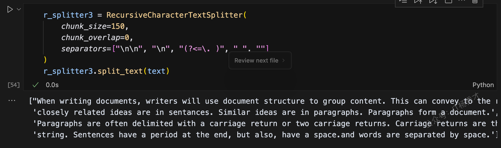

---
tags:
  - AI
  - AI应用开发
  - llm
  - 大模型
  - 大模型应用开发
  - LangChain
  - Data Connection
  - 数据连接
---

# 数据连接

## 1. 什么是数据连接

现在的通用大模型其实是没有处理用户特定数据的能力的，很多场景下，基于这些通用大模型的应用经常需要用到模型中没有的数据，而这些数据并不属于模型的训练集。针对这种情况，LangChaint提供了一些列的工具可以从各种数据源中加载新的数据，转换数据，存储数据以及访问数据。主要有以下几种组件

| 组件                | 用途                          |
| ----------------- | --------------------------- |
| 文档加载器             | 从各种不同的数据源家在文档               |
| 文档转换器             | 拆分文档，将文档转换为问答格式，过滤掉冗余文档     |
| 文本嵌入(embedding)模型 | 将非结构化文本转换为向量形式，也就是浮点数数组表现形式 |
| 向量存储              | 存储、搜索嵌入的向量数据                |
| 检索器               | 提供数据查询的通用接口                 |

## 2. 数据连接的处理流程

数据连接的整体流程如下图所示


主要可以抽象为以下几个步骤：

1. 文档加载

2. 文档转换

3. 文本词嵌入（embedding）

4. 存储向量数据&#x20;

5. 通过检索器查询数据

## 3. 文档加载

文档加载也叫做数据加载，是大模型使用外部数据的第一步，可以简单理解为通过调用LanChain的某个的接口，读取某个文档数据，当然这里的文档并非传统意义上的文档，还包网页的URL，PDF，以及视频等多种形式的数据。Langchain 也提供了多种文档加载器，用于从不同的数据源加载不同类型的数据


在这里我们以`CSVLoader` 为例来加载本地文件系统中的.csv文档。更多的Document Loader使用方式可以参考官网：https://python.langchain.com/docs/how\_to/#document-loaders。

在项目根目录下创建一个data目录，在data目录中创建一个wuxia.csv，在wuxia.csv中编辑如下内容：

```javascript
姓名, 门派, 武器, 成名绝技, 武力值
张无忌, 明教, 太极剑, 九阳神功, 99
谢逊, 明教, 拳法, 七伤拳, 90
周芷若, 峨眉派, 倚天剑, 九阴白骨爪, 90
张三丰, 武当派,  太极拳, 100
玄冥二老, 汝阳王府, 掌法, 玄冥神掌, 96
```

然后在项目根目录下创建一个`hello-data_connection.ipynb`文件，作为本章节LangChain数据连接的代码文件，在文件中编辑如下代码：

```python
from langchain.document_loaders import CSVLoader
loader = CSVLoader(file_path="./data/wuxia.csv")
data = loader.load()
data
```

程序输出：

```sql
[Document(metadata={'source': './data/wuxia.csv', 'row': 0}, page_content='姓名: 张无忌\n门派: 明教\n武器: 太极剑\n成名绝技: 九阳神功\n武力值: 99'),
 Document(metadata={'source': './data/wuxia.csv', 'row': 1}, page_content='姓名: 谢逊\n门派: 明教\n武器: 拳法\n成名绝技: 七伤拳\n武力值: 90'),
 Document(metadata={'source': './data/wuxia.csv', 'row': 2}, page_content='姓名: 周芷若\n门派: 峨眉派\n武器: 倚天剑\n成名绝技: 九阴白骨爪\n武力值: 90'),
 Document(metadata={'source': './data/wuxia.csv', 'row': 3}, page_content='姓名: 张三丰\n门派: 武当派\n武器: 太极拳\n成名绝技: 100\n武力值: None'),
 Document(metadata={'source': './data/wuxia.csv', 'row': 4}, page_content='姓名: 玄冥二老\n门派: 汝阳王府\n武器: 掌法\n成名绝技: 玄冥神掌\n武力值: 96')]
```

其实是打印出了一个Document数组，每个Document对象由两部分内容组成，第一部分是元数据metadata，表示这个数据的来源，第二部分是page\_content。page\_content其实是一个Map的结构，key就是csv文件的最上面一行的标题，value就是每一行中每个标题对应的值

接着打印一下page\_content的内容

```python
data[0].page_content
```

输出如下：

```python
'姓名: 张无忌\n门派: 明教\n武器: 太极剑\n成名绝技: 九阳神功\n武力值: 99'
```

可以看到这就是一个key，value的键值对结构，每个键值对用\n换行符分隔


## 4. 文档转换

在上一步加载好了文档之后，通常还需要对文档进行转换处理，从而更好的适用于应用场景。比如很多大模型对于提示词都有长度的限制，而有时候我们还在的文档会很长，这样就需要对长文档进行拆分，拆分为小的文档块在喂给大模型。另一方面，由于这些文档数据存储采用的是向量数据库，而加载完成之后的数据体积太大， 因此需要对外部数据文档进行分割(Splitting),文档被分割成块(chunks)后才能保存到向量数据库中，这是一种最常见的文档转换方式。


除此之外，还有文档的过滤，合并等等这些都需要文档转换器来完成。LangChain内置了很多的文档转换器，用于处理不同的文档转换需求。这里重点讲解一下最常用的文档分割器

| 分割器                                   | 用途                                                                                          |
| ------------------------------------- | ------------------------------------------------------------------------------------------- |
| CharacterTextSplitter                 | 按字符来分割文本                                                                                    |
| MarkdownHeaderTextSplitter            | 基于指定的标题来分割markdown 文件                                                                       |
| TokenTextSplitter                     | 按token来分割文本                                                                                 |
| SentenceTransformersTokenTextSplitter | 专为 sentence-transformer 模型设计的文本分割器。默认行为是将文本分割成适合所需使用的 sentence-transformer 模型的 token 窗口大小的块 |
| RecursiveCharacterTextSplitter        | 按字符串分割文本，递归地尝试按不同的分隔符进行分割文本                                                                 |
| NLTKTextSplitter                      | 使用 NLTK（自然语言工具包）按句子分割文本                                                                     |
| SpacyTextSplitter                     | 使用 Spacy按句子的切割文本                                                                            |

下面我们以文档分割为例来看一下文档转换器的具体用法

### 4.1 RecursiveCharacterTextSplitter

RecursiveCharacterTextSplitter是Langchain的默认文本分割器，它会递归地利用一组预设的分割符（默认是 `["\n\n", "\n", " ", ""]`）对文档进行分割，既考虑每个片段的最大长度（chunk\_size），也保证相邻片段之间有一定的重叠（chunk\_overlap），以确保语义的连续性。

* **chunk\_size**：指定每个被切割片段的最大字符数，超过这个长度时将被切分为多个子片段。

* **chunk\_overlap**：在相邻片段之间保留一定数量的重叠字符，就像老师在讲课前会简单回顾上节课内容一样，这样可以帮助保持整体语义的连贯性。

例如，假设我们设置 chunk\_size 为 100 字符，chunk\_overlap 为 20 字符，那么每个片段将包含 100 个字符，而相邻两个片段会共享最后 20 个字符，从而保证文本内容在分割后依然保持连贯。

具体代码示例：

```python
from langchain.text_splitter import RecursiveCharacterTextSplitter
r_splitter = RecursiveCharacterTextSplitter(
    chunk_size=26, #块长度
    chunk_overlap=4 #重叠字符串长度
)
 
text1 = 'abcdefghijklmnopqrstuvwxyz'
r_splitter.split_text(text1)
```

在这个例子中，用RecursiveCharacterTextSplitter分割字符串'a-z'，注意这里设置的chunk\_size为26，表示每26个字符会被切块，由于这里'a-z'刚好26哥字符，所以结果没有被切分

程序输出

```python
['abcdefghijklmnopqrstuvwxyz']
```

然后再字符串后面再加上字符串'a-g'，再次测试

```python
text2 = 'abcdefghijklmnopqrstuvwxyzabcdefg'
r_splitter.split_text(text2)
```

程序输出

```python
['abcdefghijklmnopqrstuvwxyz', 'wxyzabcdefg']
```

可以看到这里原字符串text2已经被切割成了两个字符串，第一个字符串刚好26个字符'a-z'，但是出乎意料的是第二个字符串并不是'a-g'，而是在前面多了`wxyz`4个字符，这就是我们设置的*`chunk_overlap`*`=4`发挥作用了，这个设置表示重叠字符串是4，即每次切割字符串后，后一个字符串的开头会叠加切割后前一个字符串的4个字符，所以会在'a-g'之前加上`wxyz`4个字符，这样就会怎强切割完字符串之后，每个子串的语意连贯性

接着往下看，将上述字符串每个字符之间加上空格

```python
text3 = "a b c d e f g h i j k l m n o p q r s t u v w x y z"
r_splitter.split_text(text3)
```

程序输出

```python
['a b c d e f g h i j k l m', 'l m n o p q r s t u v w x', 'w x y z']
```

我们观察到字符串被拆分为三部分，而前两部分各自只有25个字母。原因在于我们设置的 chunk\_size 为 26，但实际上前两段文本中在第26个字符位置出现了空格。当遇到空格时，它不会被计入当前块的内容，因而导致前两个块实际只包含25个字母。然而，在计算重叠字符时，该空格依然被保留，从而使得后一个块的开头包含了前一个块最后四个字符（包括空格在内）。

#### 4.1.1 递归拆分细节

RecursiveCharacterTextSplitter分割器默认是采用`["\n\n", "\n", " ", ""]` 这个列表的优先级来进行分割，它会按照分割符列表中从左到右的顺序，逐步在目标文档中查找匹配的分割符并进行切割。首先，它会查找双换行符 `\n\n`，如果找到，就以此为界拆分文档。接着，它会依次查找单换行符 `\n`、空格等其他分割符，并继续进行分割处理。

假设有以下一段字符串：

```python
text = """When writing documents, writers will use document structure to group content. \
This can convey to the reader, which idea's are related. For example, closely related ideas \
are in sentances. Similar ideas are in paragraphs. Paragraphs form a document. \n\n  \
Paragraphs are often delimited with a carriage return or two carriage returns. \
Carriage returns are the "backslash n" you see embedded in this string. \
Sentences have a period at the end, but also, have a space.\
and words are separated by space."""

```

对他进行切割，每个文档块的大小设置为450，重叠字符设置为0，不需要重叠

```python
r_splitter1 = RecursiveCharacterTextSplitter(
    chunk_size=450,
    chunk_overlap=0, 
)
r_splitter1.split_text(text)
```

程序输出：

```python
["When writing documents, writers will use document structure to group content. This can convey to the reader, which idea's are related. For example, closely related ideas are in sentances. Similar ideas are in paragraphs. Paragraphs form a document.",
 'Paragraphs are often delimited with a carriage return or two carriage returns. Carriage returns are the "backslash n" you see embedded in this string. Sentences have a period at the end, but also, have a space.and words are separated by space.']
```


原始字符串被分割成了两段，但是他是在原字符串中的\n\n这里做的切割，因为在`["\n\n", "\n", " ", ""]` 这个分隔符列表中，"`\n\n`"的优先级最高，所以他会优先找"`\n\n`"符，因此凡是在文本中出现双换行符的位置都会被分割，并且被分割的文本长度不能大于chunk\_size的设定值，假设大于chunk\_size这个值，它会继续在`["\n\n", "\n", " ", ""]`列表中寻找下一个优先级的分隔符对子块在进行分割

接下来我们在RecursiveCharacterTextSplitter的分隔符列表中增加一个句号作为分隔符，并且将chunk\_size设置为150

```python
r_splitter2 = RecursiveCharacterTextSplitter(
    chunk_size=150,
    chunk_overlap=0,
    separators=["\n\n", "\n", ".", " ",""]
)
ds = r_splitter2.split_text(text)
print(ds[0])
print(ds[1])
print(ds[2])
print(ds[3])

print(len(ds[0]))
print(len(ds[1]))
print(len(ds[2]))
print(len(ds[3]))
```

程序输出

```python
When writing documents, writers will use document structure to group content. This can convey to the reader, which idea's are related
. For example, closely related ideas are in sentances. Similar ideas are in paragraphs. Paragraphs form a document.
Paragraphs are often delimited with a carriage return or two carriage returns
. Carriage returns are the "backslash n" you see embedded in this string. Sentences have a period at the end, but also, have a space
133
115
77
132
```

可以看到原文本被切割成了4段，每段的长度都不超过150，其实切割器首先是按照"`\n\n`"将文本分成了2段，然后对这两段，每一段再通过第二优先级的句号作为分隔符分割，最终分割成了4段。


但是这里会有一个问题，在分割后的文档子块中，句号出现在了各段的句首位置，这显然是不合理的，会导致语意混乱，下面可以调整一下分隔符列表中的正则表达式：

```python
r_splitter3 = RecursiveCharacterTextSplitter(
    chunk_size=150,
    chunk_overlap=0,
    separators=["\n\n", "\n", "(?<=\. )", " ", ""]
)
r_splitter3.split_text(text)
```

程序输出

```python
["When writing documents, writers will use document structure to group content. This can convey to the reader, which idea's are related. For example,",
 'closely related ideas are in sentances. Similar ideas are in paragraphs. Paragraphs form a document.',
 'Paragraphs are often delimited with a carriage return or two carriage returns. Carriage returns are the "backslash n" you see embedded in this',
 'string. Sentences have a period at the end, but also, have a space.and words are separated by space.']
```



分隔符列表中增加了正则表达式`(?<=\. )`，它保证句号前面一定会存在字符，这样就避免了句号被保留在句首的情况。

### 4.2 **`CharacterTextSplitter`**

`CharacterTextSplitter`是LangChain中最简单的文档拆分器，它将文档拆分为固定长度的文本块。以下例子,我们仍然设置了`chunk_size`为26和`chunk_overlap`为4这两个参数：

```python
from langchain.text_splitter import CharacterTextSplitter
c_splitter = CharacterTextSplitter(
    chunk_size=26,
    chunk_overlap=4
)
 
text4 = "a b c d e f g h i j k l m n o p q r s t u v w x y z"
c_splitter.split_text(text4)
```

程序输出

```python
['a b c d e f g h i j k l m n o p q r s t u v w x y z']
```

可以看到，在默认情况下，`CharacterTextSplitter`切割字符串的时候会忽略掉空格，并不会把空格当做一个字符，所以切割完之后，原来的字符不变。此时，我们加上一个参数：`separator = ' '`

```python
c_splitter = CharacterTextSplitter(
    chunk_size=26,
    chunk_overlap=4,
    separator = ' '
)
text5 = "a b c d e f g h i j k l m n o p q r s t u v w x y z"
c_splitter.split_text(text5)
```

程序输出

```python
['a b c d e f g h i j k l m', 'l m n o p q r s t u v w x', 'w x y z']
```

可以看到，再加上`separator = ' '`参数后，此时空格将不会被忽略，空格会被当成字符来对待，所以原字符串最后被切割成个3段，功能类似于于RecursiveCharacterTextSplitter。


### 4.3 TokenTextSplitter

除了按字符分割文本外，Langchain 还支持按 token 进行分割。Token 可以理解为最小的语义单位，通常由大约 4 个字符组成。由于大型语言模型（LLM）通常以 token 数量来计费或限制输入，因此采用 token 分割方式不仅能更合理地拆分文本，还能帮助我们在使用 ChatGPT 等 LLM 时更有效地控制成本。具体示例如下：

```python
from langchain.text_splitter import TokenTextSplitter
 
text_splitter = TokenTextSplitter(chunk_size=1, chunk_overlap=0)
 
words = "foo bar pamggyfoo"
 
text_splitter.split_text(words)
```

程序输出

```python
['foo', ' bar', ' p', 'am', 'ggy', 'foo']
```


使用token分割文本时，英文中的一些非常用单词一般会被分割成多个token，比如这里的*pamggyfoo*被分割成4个token，它们分别是p，am,，ggy， foo。

而常用的英文单词，一般每个单词都会被分割成一个token

```python
words1="I have a dream"
text_splitter.split_text(words1)
```

程序输出

```python
['I', ' have', ' a', ' dream']
```


### 4.4 MarkdownHeaderTextSplitter

`MarkdownHeaderTextSplitter` 是 Langchain 提供的一种用于解析 Markdown 文档的文本分割器，它可以根据 Markdown 标题（如 `#`、`##`、`###` 等）对文档进行结构化拆分。这样可以在处理 Markdown 格式的文本时，保留文档的层次结构，方便后续的文本分析、检索或摘要生成

代码示例

```python
from langchain.text_splitter import MarkdownHeaderTextSplitter

md_text = """
# 介绍
Langchain 是一个强大的 LLM 框架。

## 功能
### 文本处理
支持文本拆分、嵌入生成等。

### 代理
提供 AI 代理管理功能。

## 结论
适用于 AI 应用开发。
"""

# 定义分割规则
splitter = MarkdownHeaderTextSplitter(
    headers_to_split_on=[("#", "标题1"), ("##", "标题2"), ("###", "标题3")]
)

# 执行拆分
docs = splitter.split_text(md_text)

# 输出拆分结果
for doc in docs:
    print(doc)
```

程序输出

```sql
page_content='Langchain 是一个强大的 LLM 框架。' metadata={'标题1': '介绍'}
page_content='支持文本拆分、嵌入生成等。' metadata={'标题1': '介绍', '标题2': '功能', '标题3': '文本处理'}
page_content='提供 AI 代理管理功能。' metadata={'标题1': '介绍', '标题2': '功能', '标题3': '代理'}
page_content='适用于 AI 应用开发。' metadata={'标题1': '介绍', '标题2': '结论'}
```

## 5. 文本词嵌入

文本词嵌入（embedding）其实就是将文档块数据向量化，简单点说就是通过嵌入模型将文本作为输入，生成一个固定长度的数字数组，即文本语义的数字指纹。这样做的好处就是可以方便利用向量来计算两个文档块之间的相似，有了相似性度量，就允许搜索系统不仅根据关键字匹配，而且根据语义理解来查找相关文档


这里有两个关键概念：

1. **将文本嵌入为向量** ：嵌入将文本转换为数字向量表示。

2. **测量相似性** ：可以使用简单的数学运算来比较嵌入向量

### 5.1 **将文本嵌入为向量**

将文本嵌入为向量一般需要用到嵌入模型，由嵌入模型提供的方法来完成，有很多嵌入模型提供商（OpenAI、Cohere、Hugging Face等）都提供了这个功能，这里我们选用Hugging Face的Embedding模型来进行示例讲解

#### 5.1.1 安装sentence-transformers包

```sql
pip install sentence-transformers
```

#### 5.1.2 代码示例

```python
from langchain.embeddings import HuggingFaceEmbeddings

# 初始化embedding模型
embeddings_model = HuggingFaceEmbeddings(
    model_name="paraphrase-multilingual-MiniLM-L12-v2"
)

# 生成嵌入向量
texts = [
    "Hi there!",
    "Oh, hello!",
    "What's your name?",
    "My friends call me World",
    "Hello World!"
]

embeddings = embeddings_model.embed_documents(texts)
print(f"嵌入向量数量: {len(embeddings)}")
print(f"每个向量的维度: {len(embeddings[0])}")
```

程序输出

```python
嵌入向量数量: 5
每个向量的维度: 384
```

词嵌入模块将我们输入的文本数组texts转换成了5个384纬度的向量，接着我们打印其中第一个向量看一下

```python
embeddings[0]
```

程序输出

```python
[0.011471360921859741,
 0.05202513933181763,
 0.24307766556739807,
 0.10175035148859024,
 -0.10287368297576904,
 -0.1618831902742386,
 0.38054290413856506,
 0.2023710459470749,
 -0.39871320128440857,
 0.27333900332450867,
 0.27880728244781494,
 ......
```

因为有384个纬度，这里只打印了一部分，代码运行示例


## 6. 向量存储

在完成上一步文本数据的向量化之后，接下来就要进行向量存储，以便后期提供向量检索的能力。Langchain 提供了多种开源或商业向量数据存储解决方案，包括：Chroma,，FAISS，Pinecone等，这里以Chroma为例。

### 6.1 安装Chroma

```python
pip install chromadb
```

### 6.2 向量存储检索

这里为了完整讲解从文档加载文本数据，然后向量化，最后在检索生成答案的整个过程，我们先在项目根目录创建一个embedding\_test.txt文件，文件中写入以下内容

```python
你好，我是AI助手
我可以帮助回答各种问题
请问你需要什么帮助？
自然语言处理是AI的一个分支
大语言模型可以理解和生成人类语言
```

然后将上述文本数据加载到LangChain，做向量化存储与查询

```python
from langchain.document_loaders import TextLoader  # 用于加载文本文件
from langchain.vectorstores import Chroma  # 向量数据库
from langchain.embeddings import HuggingFaceEmbeddings  # Hugging Face嵌入模型

# 步骤1: 加载文本文件
# 这里假设您已经有一个包含文本数据的文件
loader = TextLoader(file_path="./data/embedding_test.txt")
data = loader.load()
print(data)  # 显示加载的文档

# 步骤2: 初始化embedding模型
# 使用多语言模型，支持中文和英文
embeddings_model = HuggingFaceEmbeddings(
    model_name="paraphrase-multilingual-MiniLM-L12-v2"
)

# 步骤3: 创建向量数据库
# 将文档转换为向量并存储在Chroma数据库中
db = Chroma.from_documents(data, embeddings_model)

# 步骤4: 执行相似度查询
# 查找与查询语句语义最相似的文档
query = "自然语言处理和AI是什么关系？"
results = db.similarity_search(query)

# 步骤5: 显示结果
# 输出最相似的文档内容
print(results[0].page_content)
```

程序输出

```python
[Document(metadata={'source': './data/embedding_test.txt'}, page_content='你好，我是AI助手\n我可以帮助回答各种问题\n请问你需要什么帮助？\n自然语言处理是AI的一个分支\n大语言模型可以理解和生成人类语言')]
'自然语言处理是AI的一个分支'
```

可以看到，根据我们提供给大模型的文档内容，然后问了一个相关的问题："自然语言处理和AI是什么关系？"，大模型根据给出了一个符合预期的答案："自然语言处理是AI的一个分支"

注意：在使用向量数据哭的时候，第一个参数是Documents数据类型，第二个参数是embedding模型

## 7. 小结

LangChain中的数据连接主要用于处理外部数据，以弥补训练集中数据缺失的问题。接入外部数据处理的通常需要经过数据加载，数据转换，文本数据向量化，以及最后的向量数据存储与检索这几个阶段。每个阶段，Langchain都提供了丰富的组件和接口来支持。
