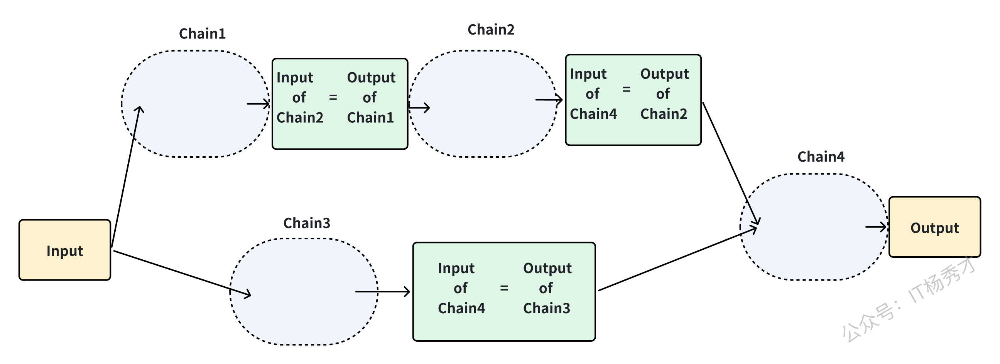

---
tags:
  - AI
  - AI应用开发
  - llm
  - 大模型
  - 大模型应用开发
  - LangChain
  - Data Connection
  - 链
  - chains
---

# 链

## 1. 什么是链？

Chain（链）是LangChain框架中多个执行模块的一种组合。它可以把多个操作（如 LLM 调用、文本处理、工具调用等）连接起来，形成**一个完整的任务处理流水线**，使得整个 AI 应用开发更加**模块化、可复用、易扩展**。而且，多个 Chain 之间还可以组合成更复杂的流程。

所以可以通俗的认为，链是一种将多个LangChain操作组合在一起的机制

## 2. 链结构的分类

LangChain中的基础链主要有以下三种


### 2.1 LLMChain

LLMChain是LangChain中最简单的链结构，是其他链的基础，它在整个 LangChain 中被广泛使用。LLMChain是将提示模板、语言模型（LLM）和输出解析器（OutPut Parser）整合在一起，形成的一个连贯的处理链。


代码示例

1. **invoke方法调用**

```python
from langchain_deepseek import ChatDeepSeek
from langchain.prompts import PromptTemplate
from langchain import LLMChain
from dotenv import load_dotenv

import os

load_dotenv()

# 创建 DeepSeek 模型实例
chat_model = ChatDeepSeek(
    model="deepseek-chat",
    temperature=0,
    api_key=os.getenv("DEEPSEEK_API_KEY")
)

# 创建提示模板实例
template = "在射雕英雄传中{name}是谁"

llm_chain = LLMChain(
    llm=chat_model,
    prompt=PromptTemplate.from_template(template)
)
# 调用LLMChain并获取结果
result = llm_chain.invoke("东邪")
result
```

程序输出

```python
{'name': '东邪',
 'text': '在《射雕英雄传》中，**东邪**是**黄药师**，他是金庸笔下"天下五绝"之一，位居东海桃花岛，武功高强且性情孤傲。以下是关于他的关键信息：\n\n1. **名号与地位**  \n   - 东邪与西毒（欧阳锋）、南帝（段智兴）、北丐（洪七公）、中神通（王重阳）并称"五绝"，代表武林巅峰实力。\n\n2. **性格特点**  \n   - 离经叛道，蔑视礼教，但重情重义，尤其深爱妻子冯蘅（阿衡）。  \n   - 因《九阴真经》被盗导致冯蘅难产而死，迁怒弟子，将其全部逐出师门。\n\n3. **武功绝学**  \n   - **弹指神通**、**落英神剑掌**、**玉箫剑法**等均为其独创。  \n   - 精通奇门遁甲、五行八卦，桃花岛布满机关阵法。\n\n4. **与主角关联**  \n   - 黄蓉之父，郭靖的岳父，虽初期反对二人婚事，后逐渐认可郭靖。\n\n5. **其他细节**  \n   - 擅长琴棋书画，文武全才，是金庸笔下最具魏晋风骨的角色之一。  \n   - 经典台词："我黄药师是何等样人，岂能拘于世俗之见？"\n\n黄药师因其亦正亦邪的复杂形象，成为金庸小说中极具魅力的角色。'}
```


可以看到，在使用LLMChain的时候，跟我们前面的使用方式非常像，也是需要先定义好模型，提示词，然后调用大模型，获取输出，只不过使用LLMChain的时候不是直接由大模型实例去调用，而是由LLMChain去调用invoke方法

2. **apply方法调用**

除了invoke方法外，LLMChain还提供了apply方法，许你对一个输入列表进行调用。

```sql
inputs = [
            {"name": "东邪"},
            {"name": "西毒"},
            {"name": "南帝"},
            {"name": "北丐"},
            {"name": "中神通"}
          ]

# 调用LLMChain并获取结果
result = llm_chain.apply(inputs)
result
```

```python
[{'text': '在《射雕英雄传》中，"东邪"是黄药师，他是金庸笔下"天下五绝"之一，位居东海桃花岛。以下是关于他的关键信息：\n\n1. **名号与地位**  \n   - **东邪**：因行事乖张、不拘礼法，且武功高绝而得名，与西毒、南帝、北丐、中神通并称五绝。\n   - **桃花岛主**：居住于东海桃花岛，精通奇门遁甲、五行八卦，岛上有他布置的复杂阵法。\n\n2. **武功绝学**  \n   - **弹指神通**：以手指弹射暗器或内力，威力惊人。\n   - **落英神剑掌**：掌法飘逸如落英缤纷，招式精妙。\n   - **碧海潮生曲**：以箫声融入内力，可扰乱对手心神甚至致命。\n\n3. **性格特点**  \n   - **离经叛道**：蔑视世俗礼教，性情孤傲，但重情重义。\n   - **才华横溢**：不仅武功盖世，还精通琴棋书画、医药卜算，堪称全才。\n\n4. **人际关系**  \n   - **徒弟与女儿**：徒弟有梅超风、陈玄风等（因《九阴真经》叛逃），女儿黄蓉是女主角，与郭靖相恋。\n   - **五绝纠葛**：与洪七公（北丐）亦敌亦友，与欧阳锋（西毒）多有敌对。\n\n5. **经典桥段**  \n   - 因误会囚禁周伯通于桃花岛十五年。\n   - 在"华山论剑"中与其他四绝争夺武功天下第一的名号。\n\n黄药师以其亦正亦邪的复杂形象，成为金庸武侠世界中极具魅力的角色之一。'},
 {'text': '在《射雕英雄传》中，**西毒**是**欧阳锋**。他是金庸笔下著名的反派角色之一，位列"天下五绝"之一，因擅长用毒且行事狠辣而得名"西毒"。\n\n### 关键信息：\n1. **身份**：西域白驼山之主，武功极高，精通**蛤蟆功**和毒术。\n2. **性格特点**：阴险狡诈，为达目的不择手段，但对武学极度痴迷。\n3. **主要情节**：\n   - 为争夺《九阴真经》不择手段，甚至逼迫郭靖、黄蓉。\n   - 在第二次华山论剑时因逆练《九阴真经》而精神错乱，成为"疯子"高手。\n4. **其他称号**：与东邪黄药师、北丐洪七公、南帝段智兴（一灯大师）、中神通王重阳并称"五绝"。\n\n欧阳锋的复杂性和武学造诣使他成为金庸作品中极具魅力的反派角色。'},
 {'text': '在《射雕英雄传》中，**南帝**指的是**段智兴**，他是大理国的皇帝，同时也是武林中"五绝"之一，称号为"**南帝**"。  \n\n### 关键细节：\n1. **身份背景**：  \n   - 段智兴是大理段氏皇族的传人，精通家传武学"**一阳指**"，武功极高。  \n   - 因大理位于南方，他在华山论剑中被尊为"南帝"，与东邪（黄药师）、西毒（欧阳锋）、北丐（洪七公）、中神通（王重阳）并称"五绝"。\n\n2. **出家为僧**：  \n   - 因感情纠葛（瑛姑与周伯通之事）和未能救活瑛姑孩子的愧疚，段智兴选择退位出家，法号"**一灯大师**"。  \n   - 此后以慈悲为怀，武功更融合了"**先天功**"（得自王重阳），实力更胜从前。\n\n3. **与主角的关系**：  \n   - 在《射雕》中，他救治了黄蓉（被裘千仞打伤），并点化裘千仞皈依佛门。  \n   - 在《神雕侠侣》中仍有出场，成为杨过等人的长辈高人。\n\n**注意**：在部分版本或影视剧中，南帝也被直接称为"一灯大师"，但原著中"南帝"是其华山论剑时的称号，出家后多以法号相称。'},
 {'text': '在《射雕英雄传》中，**"北丐"**指的是**洪七公**。他是金庸笔下著名的武侠人物，位列"天下五绝"之一，因常年行侠仗义、游戏人间，且身为丐帮帮主，故得名"北丐"（北方丐帮之首），与"东邪"黄药师、"西毒"欧阳锋、"南帝"段智兴（一灯大师）、"中神通"王重阳齐名。\n\n**洪七公的特点：**\n1. **身份**：丐帮第十八代帮主，手持打狗棒，精通丐帮绝学"打狗棒法"和"降龙十八掌"。\n2. **性格**：豪爽豁达，贪吃成性（尤其爱吃美食），但正义感极强，嫉恶如仇。\n3. **与主角关系**：他是郭靖和黄蓉的师父，将"降龙十八掌"传授给郭靖，并认可黄蓉接任丐帮帮主。\n\n洪七公的诙谐与侠义形象深入人心，是《射雕英雄传》中极具魅力的角色之一。'},
 {'text': '在《射雕英雄传》中，**"中神通"**是**王重阳**，他是金庸笔下武功绝顶的传奇人物，也是"天下五绝"之首。\n\n### 关键细节：\n1. **五绝称号**：  \n   在第一次华山论剑中，王重阳以绝对实力击败其他四位高手（东邪黄药师、西毒欧阳锋、南帝段智兴、北丐洪七公），夺得"中神通"称号，并赢得《九阴真经》的保管权。\n\n2. **身份背景**：  \n   他是全真教创始人，道号"重阳子"，武功深不可测，尤其擅长《先天功》。门下弟子是全真七子（如丘处机、马钰等）。\n\n3. **书中设定**：  \n   小说开篇时王重阳已逝世，但其影响力贯穿全书。他的师弟周伯通（老顽童）和徒弟们继承了他的武学遗产。\n\n4. **与其他五绝对比**：  \n   其他四绝各有所长（如东邪的奇门遁甲、西毒的毒功等），但王重阳的武功更为全面，被公认为五绝中的最强者。\n\n若提及《神雕侠侣》，后续华山论剑的"中神通"称号由周伯通继承，但《射雕》时期始终是王重阳。'}]
```


### 2.2 Sequential Chain

不同于基本的 LLMChain，Sequential Chain（序列链）是由一系列的链组合而成的，序列链有两种类型，一种是单个输入输出（**SimpleSequentialChain**），另一个则是多个输入输出（**SequentialChain**）

#### 2.2.1 SimpleSequentialChain

SimpleSequentialChain的每个步骤是串联起来的，每个步骤都有单一的输入/输出，并且一个步骤的输入是下一个步骤的输出。


代码示例

```python
# LangChain 相关模块的导入
from langchain import LLMChain
from langchain_deepseek import ChatDeepSeek # 替换为 DeepSeek 模型
from langchain.prompts import ChatPromptTemplate
from langchain.chains import SimpleSequentialChain

from dotenv import load_dotenv

import os

load_dotenv()

# 创建 DeepSeek 模型实例
chat_model = ChatDeepSeek(
    model="deepseek-chat",
    temperature=0,
    api_key=os.getenv("DEEPSEEK_API_KEY")
)

# 第一个 LLM 请求的 Prompt 模板：生成人物名字
first_prompt = ChatPromptTemplate.from_template(
    "请为一部奇幻小说的主角取一个富有个性的名字，性别：{gender}"
)

# 第一个 Chain：获取主角姓名
chain_one = LLMChain(llm=llm, prompt=first_prompt, verbose=True)

# 第二个 LLM 请求的 Prompt 模板：基于名字生成人物设定
second_prompt = ChatPromptTemplate.from_template(
    "请为主角 {character_name} 生成一段详细的设定，包括性格、外貌、背景故事和特殊能力。"
)

# 第二个 Chain：生成人物设定
chain_two = LLMChain(llm=llm, prompt=second_prompt, verbose=True)

# 串联两个 Chain
character_chain = SimpleSequentialChain(
    chains=[chain_one, chain_two],
    verbose=True
)

# 运行 Chain，生成主角设定
gender = "男性"  # 这里可以换成 "女性" 或 "非二元性别"
character_description = character_chain.run(gender)
character_description
```

程序输出内容很多，这里就不展示详细输出了，输出截图如下：


可以看到大模型返回了我们想要的结果，首先根据我们的输入"男性"生成了一个主角名：夜星痕，然后紧接着给出了夜星痕的任务设定。不难发现，我们在使用这个SimpleSequentialChain的守候，里面其实是串了两个基础链LLMChain，`chain_one`和`chain_two`，其中前一个链`chain_one`的输出作为后一个链`chain_two`的输入

#### 2.2.2 SequentialChain

虽然 SimpleSequentialChain 非常适合简单的任务，但有时我们的链需要同时处理多个输入和输出，这时就要用到SequentialChain。对于SimpleSequentialChain来说，需要格外关注的是输入关键字和输出关键字，它们需要十分的精准，才能够保证 Chain 的识别与应用



代码示例

```python
import langchain
from langchain import LLMChain
from langchain_deepseek import ChatDeepSeek # 替换为 DeepSeek 模型
from langchain.prompts import ChatPromptTemplate
from langchain.chains import SequentialChain

from dotenv import load_dotenv

import os

load_dotenv()

# 开启详细模式，打印调用信息
langchain.verbose = True


# 创建 DeepSeek 模型实例
chat_model = ChatDeepSeek(
    model="deepseek-chat",
    temperature=0,
    api_key=os.getenv("DEEPSEEK_API_KEY")
)

# Chain 1: 设定角色类型
prompt1 = ChatPromptTemplate.from_template(
    "在奇幻世界中，生成一个独特的角色类型，例如战士、魔法师、刺客等: {character_name}"
)
chain1 = LLMChain(
    llm=llm,
    prompt=prompt1,
    output_key="character_type",
)

# Chain 2: 生成角色详细背景
prompt2 = ChatPromptTemplate.from_template(
    "基于'{character_type}'类型，描述角色 '{character_name}' 的详细设定，包括："
    "- 外貌特征\n"
    "- 性格特点\n"
    "- 主要技能\n"
    "- 过往经历\n"
)
chain2 = LLMChain(
    llm=llm,
    prompt=prompt2,
    output_key="character_profile"
)

# Chain 3: 扩展角色世界观
prompt3 = ChatPromptTemplate.from_template(
    "为角色 '{character_name}' 设定一个完整的世界观，包括所在国家、种族、社会背景和历史事件。"
)
chain3 = LLMChain(
    llm=llm,
    prompt=prompt3,
    output_key="world_setting"
)

# Chain 4: 生成小说开篇
prompt4 = ChatPromptTemplate.from_template(
    "根据以下角色设定和世界观，创作一段引人入胜的故事开篇。\n\n"
    "角色设定:\n{character_profile}\n\n"
    "世界观设定:\n{world_setting}\n\n"
    "要求:\n"
    "- 以角色 '{character_name}' 为主角\n"
    "- 以第一或第三人称叙述\n"
    "- 语言生动，引人入胜\n"
    "- 至少300字"
)
chain4 = LLMChain(
    llm=llm,
    prompt=prompt4,
    output_key="story_opening"
)

# 创建 SequentialChain，将各个 Chain 串联
overall_chain = SequentialChain(
    chains=[chain1, chain2, chain3, chain4],
    input_variables=["character_name"],
    output_variables=["character_type", "character_profile", "world_setting", "story_opening"],
    verbose=True
)

# 测试输入
character_name = "莱因哈特"
res = overall_chain({"character_name": character_name})

# 输出结果
print(f"角色类型: {res['character_type']}\n")
print(f"角色设定:\n{res['character_profile']}\n")
print(f"世界观设定:\n{res['world_setting']}\n")
print(f"小说开篇:\n{res['story_opening']}\n")

```

同样这里程序输出内容很多，这里就不展示详细输出了，输出截图如下：


可以看到，大模型同样给出了非常nice的回复，再仔细回顾一遍代码，可以发现，SequentialChain其实跟SimpleSequentialChain一样，也是一种序列化串式调用的链结构，也就是后一个链的输入依赖前一个链的输出，只不过这里后一个链可以同时接受前几个链的输入，比如这里的`chain4`其实接受了`chain2`的输出：角色设定和`chain3`的输出：世界观作为输入，然后输出了一段故事开篇

### 2.3 RouterChain

前面讲到SequentialChain是一种串行链，LLMChain也可以看作是一个最简单的SequentialChain，只包含一个子链结构的SequentialChain。他们本质上都是串行链。既然是串行链，其实就只能处理一个类型或者场景的问题，因为根据我们的上下文，给模型的场景设定其实是一致的。如果我们希望让这个 `chain` 具备某个特定领域的专家能力，可以将其连接到外部数据源。例如，通过 `LLMchain` 读取`pdf`文件数据，并结合文档检索器，即可实现这一需求。但在什么情况下，会用到 `RouterChain` 呢？

还设有这样一个场景：如果我们希望打造的专家机器人不仅局限于某个单一领域，而是能够涵盖多个专业领域，那么按照之前的方法，我们就需要创建多个 `chain`，并分别接入不同的 `pdf`文件数据，这样不仅麻烦，而且难以管理。

这时 `RouterChain` 就派上用场了，根据 LangChain 的设计，`RouterChain` 可以与下游的 `destination chain` 结合使用，形成一个 **"网关路由 + 多个子链"** 的架构。它的作用是根据用户输入的内容，**自动路由到最匹配的下游 `chain`**，从而让模型智能地选择合适的知识领域进行回答。


上图就是一个典型的`RouterChain`的使用示意图，RouterChain连接了多个下游的子链，每个链都是一个小应用，而`RouterChain`的作用就相当于是后端开发中的路由组件，当它收到用户输入的时候，先路由到和输入最相关的子链上，由子链产生输出。比如输入是"请帮我写一首咏荷的诗"，RouterChain接收后，会自动路由到"诗人"这个子链上，由它来产生输出结果。明白了`RouterChain`的大致工作原理后，我们就可以通过`Routerchain`创建一个能解决多种复杂问题的AI应用。

从上图就可以看出，一个标准的 RouterChain 由两个关键部分组成：

1. **路由链（RouterChain）**
   RouterChain 本身是一个 Chain 组件，其核心作用是根据用户的输入内容，智能地选择合适的下游子链进行处理。在 Langchain 生态中，主要提供了两种 RouterChain 方案：

   * **LLMRouterChain**：该方案依托于大语言模型（LLM），通过预设的 Prompt，让 LLM 解析用户的输入内容，并据此决定应该路由到哪个子链。

   * **EmbeddingRouterChain**：该方案基于向量搜索技术，将用户的输入转换为向量表示，并通过相似度匹配的方式，找到最适合处理该输入的子链。

2. **目标子链（DestinationChain）**
   目标子链是 RouterChain 最终会路由到的具体执行单元，每个子链专注于处理某个特定领域的任务。按照上图示例，系统包含四个子链，分别是**Lawyer Chain（律师子链），Sales Chain（销售子链），English Teacher Chain（英语教师子链）和Poet Chain（诗人子链）**

#### 2.3.1 MultiPromptChain

当配置好了路由链和下游子链后，我们还需要一个中间链MultiPromptChain，通过它来把路由链和下游子链连接起来。

Langchain提供的MultiPrompt包含以下参数：

| 参数                  | 是否必选 | 意义                                                                                                      |
| ------------------- | ---- | ------------------------------------------------------------------------------------------------------- |
| router\_chain       | 是    | 该参数需要传入一个 **RouterChain 实例**，用于分析用户输入，并决定应该交给哪个子链来处理。                                                   |
| default\_chain      | 是    | 该参数是一个 **LLMChain 实例**，当 **RouterChain** 没办法匹配到合适的子链时，系统会自动将请求转发到这个默认链，确保每个请求都能得到处理                     |
| destination\_chains | 是    | 该参数是一个**Mapping\[str, LLMChain] 字典**，key为可以路由到的destination chain的名称，value为该destination chain的LLMChain实例 |
| memory              | 否    | 该参数是一个BaseMemory实例，可以让**RouterChain** 具备"上下文记忆能力"                                                       |
| verbose             | 否    |  bool值，若为True则会打印该链的调用过程                                                                                |

#### 2.3.2 LLMRouterChain

LLMRouterChain 的核心机制是利用大语言模型LLM来判断用户输入的意图并进行分发。它通过一个特别构造的提示（Prompt）将用户请求提交给模型。要启用这个功能，必须指定两个关键配置：所依赖的大语言模型实例，以及用于指导模型决策的路由提示文本。设计这个路由提示有一定的技巧，因为它既要解析输入内容，又要给出清晰的路由指向，还必须确保其输出结果能被 MultiPromptChain 正确识别和处理。为此，Langchain 提供了一个名为 `MULTI_PROMPT_ROUTER_TEMPLATE` 的标准模板。用户可以通过调用这个模板的 `.format()` 方法，遵循其预设的填充规则，便捷地生成符合 MultiPromptChain 要求的 `router_prompt`。

还是通过上面的例子来看，如何构造出路由提示文本

1. 定义4个子链prompt模板

```python
teacher_template = """ 你是一个数学老师，你需要解答用户提出的数学问题，如果你不知道，请说"我不知道"，。

用户提问：
{input}
"""

doctor_template = """ 你是一个医生，你需要为用户输入的问诊信息就行答复，你需要用户可能感染了哪些疾病，以及如何治疗以及预防。

用户输入的商品：
{input}
"""

english_teacher_template ="""你是一个英语老师，用户输入的中文词汇，你需要提供对应的英文单词，包括单词词性，对应的词组和造句。

用户输入的中文词汇：
{input}
"""

poet_template=""" 你是一个诗人，你需要根据用户输入的主题写一首诗。

用户输入的主题:
{input}
"""
```

2. 创建路由子链，记录子链名称，子链描述和子链prompt template，这样做的好处有两个，一是便于创建子链，二是便于生成路由链用于路由的PromptTemplate

```python
prompt_infos = [
    {
        "name": "teacher",
        "description": "咨询数学教学相关问题时很专业",
        "prompt_template": teacher_template,
    },
    {
        "name": "doctor",
        "description": "对医学问题解答非常专业",
        "prompt_template": doctor_template,
    },
    {
        "name": "english teacher",
        "description": "能够很好地解答英语问题",
        "prompt_template": english_teacher_template,
    },
    {
        "name": "poet",
        "description": "非常擅长写诗",
        "prompt_template": poet_template,
    },
]
```

3. 格式化子链描述

将上述所有子链的名称和描述用一个字符串来描述，每个子链的描述用换行分割

```python
#创建一个list储存对应的子链名称和描述
destinations = [f"{p['name']}: {p['description']}" for p in prompt_infos]


#把描述连接成一个str
destinations_str = "\n".join(destinations)
destinations_str
```

程序输出

```protobuf
'teacher: 咨询数学教学相关问题时很专业\ndoctor: 对医学问题解答非常专业\nenglish teacher: 能够很好地解答英语问题\npoet: 非常擅长写诗'
```

4. 使用 `MULTI\_PROMPT\_ROUTER\_TEMPLATE.format()` 进行格式化，生成`router\_template`

```python
from langchain.chains.router.multi_prompt_prompt import MULTI_PROMPT_ROUTER_TEMPLATE

router_template = MULTI_PROMPT_ROUTER_TEMPLATE.format(destinations=destinations_str)

router_template 
```

程序输出

````python
'Given a raw text input to a language model select the model prompt best suited for the input. You will be given the names of the available prompts and a description of what the prompt is best suited for. You may also revise the original input if you think that revising it will ultimately lead to a better response from the language model.\n\n<< FORMATTING >>\nReturn a markdown code snippet with a JSON object formatted to look like:\n```json\n{{\n    "destination": string \\ name of the prompt to use or "DEFAULT"\n    "next_inputs": string \\ a potentially modified version of the original input\n}}\n```\n\nREMEMBER: "destination" MUST be one of the candidate prompt names specified below OR it can be "DEFAULT" if the input is not well suited for any of the candidate prompts.\nREMEMBER: "next_inputs" can just be the original input if you don\'t think any modifications are needed.\n\n<< CANDIDATE PROMPTS >>\nteacher: 咨询数学教学相关问题时很专业\ndoctor: 对医学问题解答非常专业\nenglish teacher: 能够很好地解答英语问题\npoet: 非常擅长写诗\n\n<< INPUT >>\n{input}\n\n<< OUTPUT (must include ```json at the start of the response) >>\n<< OUTPUT (must end with ```) >>\n'
````

5. 生成一个PromptTemplate实例

有了`router\_template`后，我们需要生成一个`PromptTemplate`实例，作为最后的提示词模板`router\_prompt`

```python
from langchain.chains.router.llm_router import RouterOutputParser

router_prompt = PromptTemplate(
    template=router_template,
    input_variables=["input"],
    output_parser=RouterOutputParser(),
)
router_prompt
```

程序输出

````python
PromptTemplate(input_variables=['input'], input_types={}, output_parser=RouterOutputParser(), partial_variables={}, template='Given a raw text input to a language model select the model prompt best suited for the input. You will be given the names of the available prompts and a description of what the prompt is best suited for. You may also revise the original input if you think that revising it will ultimately lead to a better response from the language model.\n\n<< FORMATTING >>\nReturn a markdown code snippet with a JSON object formatted to look like:\n```json\n{{\n    "destination": string \\ name of the prompt to use or "DEFAULT"\n    "next_inputs": string \\ a potentially modified version of the original input\n}}\n```\n\nREMEMBER: "destination" MUST be one of the candidate prompt names specified below OR it can be "DEFAULT" if the input is not well suited for any of the candidate prompts.\nREMEMBER: "next_inputs" can just be the original input if you don\'t think any modifications are needed.\n\n<< CANDIDATE PROMPTS >>\nteacher: 咨询数学教学相关问题时很专业\ndoctor: 对医学问题解答非常专业\nenglish teacher: 能够很好地解答英语问题\npoet: 非常擅长写诗\n\n<< INPUT >>\n{input}\n\n<< OUTPUT (must include ```json at the start of the response) >>\n<< OUTPUT (must end with ```) >>\n')
````

6. 定义LLMRouterChain

这里我们选用阿里的Tongyi作为基底大模型创建LLMRouterChain。跟前面学习Model IO章节一下，同样要保证在项目的根目录里.env文件里记录了Tongyi的API Key：DASHSCOPE\_API\_KEY。

```python
from langchain_community.llms import Tongyi

from dotenv import load_dotenv
# 导入操作系统相关功能
import os

# 加载 .env 文件中的环境变量
load_dotenv()

#创建一个OpenAI作为大语言模型的基底
#llm = OpenAI()

#os.environ["OPENAI_API_KEY"]="你的key"
dashscope_api_key = os.getenv("DASHSCOPE_API_KEY")

# api key作为参数传入
llm = Tongyi(
    model="qwen-turbo",  # 或其他模型，如"qwen-plus", "qwen-max"
    dashscope_api_key=dashscope_api_key,
    temperature=0
)

router_chain = LLMRouterChain.from_llm(llm, router_prompt)
router_chain
```

7. 生成各子链，生成一个default chain作为兜底chain，用MultiPromptChain将子链和路由链连接

```python
from langchain.chains import ConversationChain, MultiPromptChain

# 首先，创建一个候选链，包含所有的下游子链
candadite_chains = {}

# 遍历路由目录，生成各子链并放入候选链字典
for p_info in prompt_infos:
    name = p_info["name"]
    prompt_template = p_info["prompt_template"]
    prompt = PromptTemplate(template=prompt_template, input_variables=["input"])
    chain = LLMChain(llm=llm, prompt=prompt)
    candadite_chains[name] = chain

# 生成默认链
default_chain = ConversationChain(llm=llm, output_key="text")

chain = MultiPromptChain(
    router_chain=router_chain,
    destination_chains=candadite_chains,
    default_chain=default_chain,
    verbose=True,
)

chain
```

程序输出

````python
MultiPromptChain(verbose=True, router_chain=LLMRouterChain(verbose=False, llm_chain=LLMChain(verbose=False, prompt=PromptTemplate(input_variables=['input'], input_types={}, output_parser=RouterOutputParser(), partial_variables={}, template='Given a raw text input to a language model select the model prompt best suited for the input. You will be given the names of the available prompts and a description of what the prompt is best suited for. You may also revise the original input if you think that revising it will ultimately lead to a better response from the language model.\n\n<< FORMATTING >>\nReturn a markdown code snippet with a JSON object formatted to look like:\n```json\n{{\n    "destination": string \\ name of the prompt to use or "DEFAULT"\n    "next_inputs": string \\ a potentially modified version of the original input\n}}\n```\n\nREMEMBER: "destination" MUST be one of the candidate prompt names specified below OR it can be "DEFAULT" if the input is not well suited for any of the candidate prompts.\nREMEMBER: "next_inputs" can just be the original input if you don\'t think any modifications are needed.\n\n<< CANDIDATE PROMPTS >>\nteacher: 咨询数学教学相关问题时很专业\ndoctor: 对医学问题解答非常专业\nenglish teacher: 能够很好地解答英语问题\npoet: 非常擅长写诗\n\n<< INPUT >>\n{input}\n\n<< OUTPUT (must include ```json at the start of the response) >>\n<< OUTPUT (must end with ```) >>\n'), llm=Tongyi(client=<class 'dashscope.aigc.generation.Generation'>, model_name='qwen-turbo', model_kwargs={}), output_parser=StrOutputParser(), llm_kwargs={})), destination_chains={'teacher': LLMChain(verbose=False, prompt=PromptTemplate(input_variables=['input'], input_types={}, partial_variables={}, template=' 你是一个数学老师，你需要解答用户提出的数学问题，如果你不知道，请说"我不知道"，。\n\n用户提问：\n{input}\n'), llm=Tongyi(client=<class 'dashscope.aigc.generation.Generation'>, model_name='qwen-turbo', model_kwargs={}), output_parser=StrOutputParser(), llm_kwargs={}), 'doctor': LLMChain(verbose=False, prompt=PromptTemplate(input_variables=['input'], input_types={}, partial_variables={}, template=' 你是一个医生，你需要为用户输入的问诊信息就行答复，你需要用户可能感染了哪些疾病，以及如何治疗以及预防。\n\n用户输入的商品：\n{input}\n'), llm=Tongyi(client=<class 'dashscope.aigc.generation.Generation'>, model_name='qwen-turbo', model_kwargs={}), output_parser=StrOutputParser(), llm_kwargs={}), 'english teacher': LLMChain(verbose=False, prompt=PromptTemplate(input_variables=['input'], input_types={}, partial_variables={}, template='你是一个英语老师，用户输入的中文词汇，你需要提供对应的英文单词，包括单词词性，对应的词组和造句。\n\n用户输入的中文词汇：\n{input}\n'), llm=Tongyi(client=<class 'dashscope.aigc.generation.Generation'>, model_name='qwen-turbo', model_kwargs={}), output_parser=StrOutputParser(), llm_kwargs={}), 'poet': LLMChain(verbose=False, prompt=PromptTemplate(input_variables=['input'], input_types={}, partial_variables={}, template=' 你是一个诗人，你需要根据用户输入的主题写一首诗。\n\n用户输入的主题:\n{input}\n'), llm=Tongyi(client=<class 'dashscope.aigc.generation.Generation'>, model_name='qwen-turbo', model_kwargs={}), output_parser=StrOutputParser(), llm_kwargs={})}, default_chain=ConversationChain(memory=ConversationBufferMemory(chat_memory=InMemoryChatMessageHistory(messages=[])), verbose=False, llm=Tongyi(client=<class 'dashscope.aigc.generation.Generation'>, model_name='qwen-turbo', model_kwargs={}), output_key='text', output_parser=StrOutputParser(), llm_kwargs={}))
````

8. 通过MultiPromptChain实例调用大模型

```python
# 禁用代理设置
os.environ["HTTP_PROXY"] = ""
os.environ["HTTPS_PROXY"] = ""
os.environ["http_proxy"] = ""
os.environ["https_proxy"] = ""

# 清除所有可能的代理环境变量
proxy_vars = [
    "HTTP_PROXY", "HTTPS_PROXY", "http_proxy", "https_proxy", 
    "ALL_PROXY", "all_proxy", "NO_PROXY", "no_proxy"
]

for var in proxy_vars:
    if var in os.environ:
        del os.environ[var]

# 使用Tongyi的过程中
# 如果本地装了网络代理的话，需要执行上述三个部分清楚代理
# 如果不是使用Tongyi或者是本地没有走网络代理，则可以不需要上述是那个部分，直接执行以下chain.run即可
response = chain.run("帮我写一首关于春天的诗")
response
```

程序输出

```python
[1m> Entering new MultiPromptChain chain...[0m
poet: {'input': '帮我写一首关于思念家乡的诗'}
[1m> Finished chain.[0m
```

```python
'在远方凝望故乡的月，\n银辉洒落心间，如梦似幻。\n炊烟袅袅升起在记忆里，\n那熟悉的屋檐，承载着岁月的温暖。\n\n稻田里的蛙鸣依旧清晰，\n儿时追逐的身影还在嬉戏。\n村口的老树，见证了成长的秘密，\n风轻轻吹过，带来泥土的香气。\n\n河流蜿蜒穿过我的心房，\n波光粼粼中映出家乡的模样。\n桥上的脚步声，回荡在时光长廊，\n每一步都踏在思念的土壤。\n\n夜空繁星点点，如同家乡的灯火，\n照亮我漂泊的心，指引归途的方向。\n无论身在何处，心灵总被牵绊，\n对家乡的思念，是永恒的歌谣。'
```

通过这个例子就明确了RouterChain的一般用法，首先创建子链和默认链，然后创建路由链，同时路由链的路由模板需要根据子链进行特殊设计，最后再 创建MultiPromptChain，将路由链、默认链和子链组装成一个整体

## 3. 小结

本章详细探讨了 LangChain 框架中的核心概念——链（Chain），链作为一种组合多个执行模块（如 LLM 调用、数据处理等）的机制，它使得构建复杂的 AI 应用更加模块化、灵活和可扩展。LangChain 中的链机制为开发者提供了强大的工具，通过不同类型链的组合与应用，可以有效地组织和管理 AI 应用的逻辑流程，无论是简单的单步任务，还是复杂的多步串联或动态路由任务，都能找到合适的链结构来实现。掌握链的使用是精通 LangChain 开发的关键一步。
