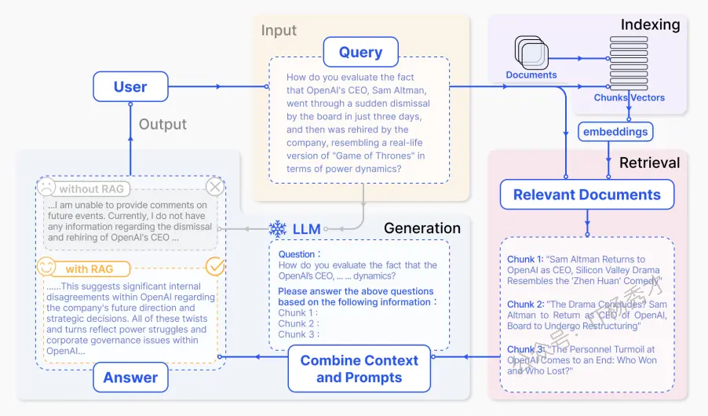
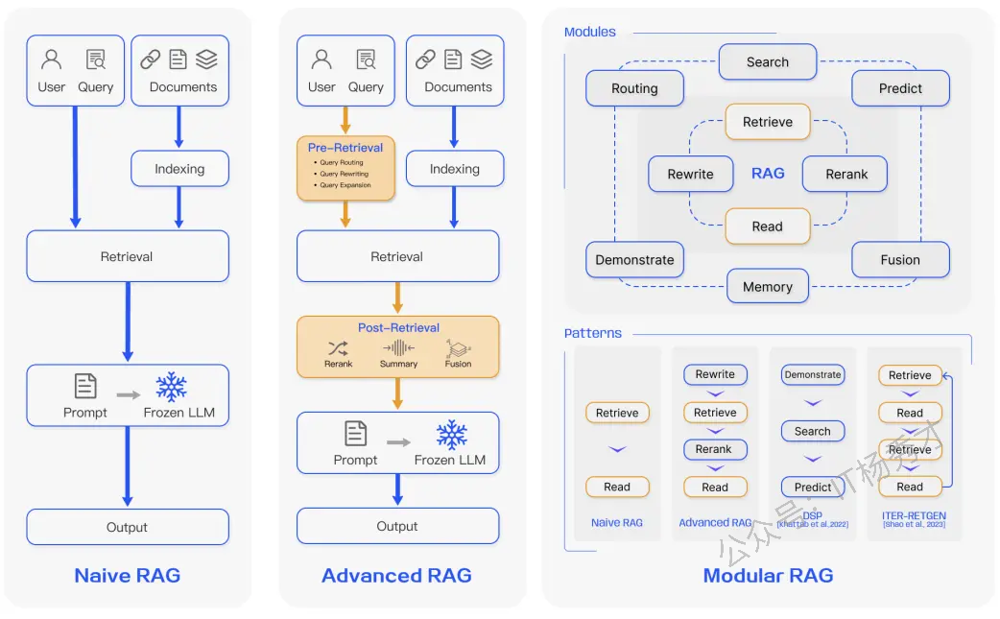
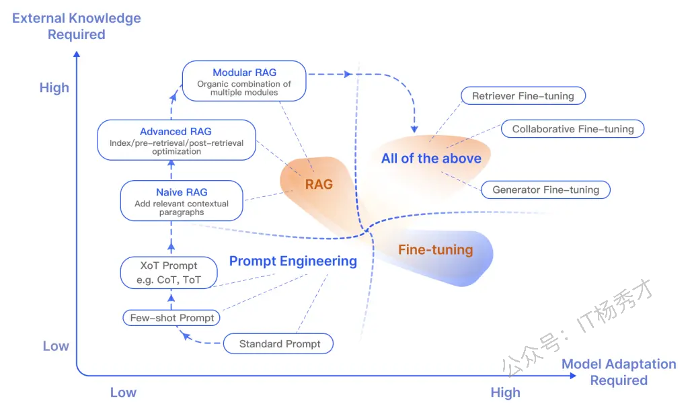

---
tags:
  - AI
  - AI应用开发
  - llm
  - 大模型
  - 大模型应用开发
  - LangChain
  - Callbacks
  - 回调
---

# RAG总体概览

在处理 LLM 时存在着许多挑战，例如领域知识差距、事实问题和幻觉等灯。检索增强生成（RAG）通过为 LLM 添加外部知识（如数据库）来解决一些这些问题。RAG 特别适用于需要不断更新知识的知识密集型场景或特定领域应用。与其它方法相比，RAG 的一个主要优势是 LLM 不需要为特定任务重新训练。RAG也因其在对话代理中的应用而广受欢迎

## 1. RAG 简介

RAG 接受输入并根据来源（例如，维基百科）检索一组相关/支持的文档。这些文档作为上下文与原始输入提示连接，并馈送到文本生成器，生成最终输出。这使得 RAG 能够适应事实随时间变化的情况。这对于绕过 LLMs 的参数化知识静态性，通过基于检索的生成访问最新信息以生成可靠输出非常有用。

简而言之，RAG 检索到的证据可以作为提高 LLM 响应准确度、可控性和相关性的手段。这就是为什么 RAG 可以帮助减少在高度演变环境中解决问题时出现的幻觉或表现问题

尽管 RAG 也涉及预训练方法的优化，但当前的方法主要转向结合 RAG 和强大的微调模型（如 ChatGPT 和 Mixtral）的优势。下图展示了 RAG 相关研究的演变

下面是一个典型的 RAG 应用工作流：

可以按照以下方式解释不同的步骤/组件：

* **输入**：LLM 系统响应的问题称为输入。如果没有使用 RAG，LLM 将直接用于回答问题

* **索引**：如果使用 RAG，则首先通过分块方式对一系列相关文档进行分块，生成分块的嵌入向量，并将这些分块索引到向量存储中。在推理时，查询也以类似的方式生成嵌入向量

* **检索**：相关的文档通过将查询与索引向量进行比较获得，也称为"相关文档"

* **生成**：相关的文档将与原始提示一起作为额外背景信息进行组合。组合后的文本和提示随后传递给模型以生成响应，该响应随后作为系统的最终输出提供给用户

在很多场景中，直接使用模型无法回答关于当前事件的问题，因为模型缺乏相关知识。而使用 RAG 时，系统可以提取模型需要的相关信息，从而使模型能够适当回答问题

## 2. RAG 范式

在过去几年里，RAG 系统从朴素的 RAG 发展到了高级 RAG 和模块化 RAG。这种发展是为了应对性能、成本和效率方面的某些限制

### 2.1 原生 RAG

原生 RAG，即Naive RAG，遵循传统的索引、检索和生成过程。简而言之，用户输入用于查询相关文档，然后将这些文档与提示结合并传递给模型以生成最终响应。如果应用程序涉及多轮对话交互，可以将对话历史集成到提示中

Naive RAG 有一些局限性，例如较低的精度（检索到的片段对齐不准确）和较低的召回率（未能检索到所有相关片段）。此外，LLM 可能会接收到过时的信息，这也是 RAG 系统最初需要解决的主要问题之一。这会导致幻觉问题和不准确的响应

当应用增强时，还可能出现冗余和重复的问题。使用多个检索段落时，排名和协调风格/语气也是关键。另一个挑战是确保生成任务不要过度依赖增强信息，这可能导致模型只是重复检索的内容

### 2.2 高级 RAG

高级 RAG 有助于解决朴素 RAG 存在的问题，如通过优化预检索、检索和后检索过程来提高检索质量。

1. 预检索过程涉及优化数据索引，旨在通过五个阶段提升被索引数据的质量：细化数据粒度、优化索引结构、增加元数据、对齐优化以及混合检索

2. 检索阶段可以通过优化嵌入模型本身来进一步改进，这直接影响了构成上下文的片段的质量。这可以通过微调嵌入以优化检索相关性或采用能够更好地捕捉上下文理解的动态嵌入（例如，OpenAI 的 embeddings-ada-02 模型）来实现

3. 检索后优化侧重于避免上下文窗口限制并处理嘈杂或可能分散注意力的信息。解决这些问题的常见方法是重新排名，这可能包括将相关上下文重新定位到提示的边缘或重新计算查询与相关文本片段之间的语义相似性。提示压缩也可能有助于解决这些问题

### 2.3 模块化 RAG

顾名思义，模块化 RAG 增强了功能模块，例如引入了相似检索的搜索模块，并在检索器中进行了微调。朴素 RAG 和高级 RAG 都是模块化 RAG 的特例，由固定模块组成。扩展 RAG 模块包括搜索、记忆、融合、路由、预测和任务适配器，它们解决了不同的问题。这些模块可以根据特定问题的上下文重新排列。因此，模块化 RAG 得益于更大的多样性和灵活性，你可以根据任务需求添加或替换模块或调整模块之间的流程

* 鉴于 RAG 系统构建的灵活性增加，还提出了其他一些优化技术来优化 RAG 管道，包括：

* 混合搜索探索：这种方法结合了基于关键词的搜索和语义搜索等技术来检索相关且富有上下文的信息；这在处理不同类型的查询和信息需求时非常有用

* 递归检索和查询引擎：涉及一个递归检索过程，可能从较小的语义片段开始，随后检索更大的片段以丰富上下文；这有助于平衡效率和丰富的上下文信息

* StepBack-prompt：一种提示技术，使 LLM 能够进行抽象，产生指导推理的概念和原则；在 RAG 框架中采用时，这会导致更好的基于事实的响应，因为 LLM 可以远离具体实例，并在需要时进行更广泛的推理

* 子查询：有不同的查询策略，如树查询或按顺序查询片段，适用于不同的场景。LlamaIndex 提供了一个子问题查询引擎，允许查询被分解成几个问题，每个问题使用不同的相关数据源

* 假设文档嵌入：HyDE 生成一个假设的答案，将其嵌入，并使用该假设的答案检索与其相似的文档，而不是直接使用查询

## 3. RAG 框架

本文将总结 RAG 系统组件的关键发展，包括检索、生成和增强

### 3.1 检索

检索是 RAG 组件中处理从检索器中获取高度相关上下文的部分。检索器可以通过许多方式得到增强，包括：

#### 3.1.1 **提升语义表示**

这个过程涉及直接改进驱动检索器的语义表示。这里有一些考虑事项：

* **分块**：一个重要的步骤是选择合适的分块策略，这取决于你处理的内容以及你生成响应的应用。不同的模型在不同的块大小上表现出不同的优势。Sentence transformers 在单句上表现更好，但 text-embedding-ada-002 在包含 256 或 512 个标记的块上表现更好。其他需要考虑的因素包括用户问题的长度、应用和标记限制，但通常需要尝试不同的分块策略来帮助优化你的 RAG 系统中的检索

* **细分嵌入模型**：确定有效的分块策略后，如果您的工作涉及特定领域，可能需要对嵌入模型进行微调。否则，用户查询在您的应用程序中可能会被完全误解。您可以根据广泛领域的知识（即领域知识微调）和特定下游任务进行微调。BAAI 开发的 BGE-large-EN 是一个值得注意的嵌入模型，可以对其进行微调以优化检索相关性

#### 3.1.2 **查询和文档对齐**

这个过程涉及将用户的查询与文档在语义空间中对齐。这可能需要在用户的查询缺乏语义信息或包含不精确的措辞时进行。这里有一些方法：

* **查询重写**：专注于使用各种技术（如 Query2Doc、ITER-RETGEN 和 HyDE）重写查询

* **向量嵌入变换**：优化查询嵌入的表示，并将其与更接近任务的潜在空间对齐

#### 3.1.3 **对齐检索器和 LLM**

这个过程涉及将检索器输出与 LLM 的偏好对齐

* **精调检索器**：使用 LLM 的反馈信号来细化检索模型。示例包括适应检索增强器（AAR）、REPLUG 和 UPRISE 等

* **适配器**: 通过引入外部适配器来帮助对齐过程。示例包括 PRCA、RECOMP 和 PKG

### 3.2 生成

在 RAG 系统中，生成器负责将检索到的信息转换成连贯的文本，形成模型的最终输出。这个过程涉及多样化的输入数据，有时需要努力调整语言模型以适应来自查询和文档的输入数据。这可以通过后检索处理和微调来解决：

* **Post-retrieval with Frozen LLM**: Post-retrieval 处理不会影响 LLM，而是通过信息压缩和结果重排序等操作来提升检索结果的质量。信息压缩有助于减少噪声、解决 LLM 的上下文长度限制问题，并增强生成效果。重排序旨在重新排列文档，以使最相关的内容排在前面

* **使用 LLM 进行 RAG 微调**：为了改进 RAG 系统，生成器可以进一步优化或微调，以确保生成的文本自然且有效地利用了检索到的文档

### 3.3 增强

增强涉及将检索段落中的上下文有效整合到当前生成任务中的过程。在讨论增强过程、增强阶段和增强数据之前，这里是对 RAG 核心组件的分类：

RAG 的增强可以在预训练、微调和推理等不同阶段应用

* **augmentation Stages**: RETRO 是一个利用检索增强进行大规模从头预训练的系统示例；它使用了基于外部知识的附加编码器。RAG 还可以与微调结合使用，以帮助开发和提高 RAG 系统的有效性。在推理阶段，应用了许多技术来有效地结合检索内容，以满足特定任务需求，并进一步细化 RAG 过程

* **增强数据源**：RAG 模型的效果受增强数据源的选择影响很大。数据可以分为无结构、结构化和 LLM 生成的数据

* **增强过程**：对于许多问题（例如多步推理），一次检索是不够的，因此已经提出了几种方法：

  * 迭代检索使模型能够进行多次检索循环，以增强信息的深度和相关性。利用这种方法的知名方法包括 RETRO 和 GAR-meets-RAG

  * 递归检索递归地将上一步检索的输出作为下一步检索的输入；这使得对于复杂和多步查询（例如学术研究和法律案例分析）能够更深入地挖掘相关信息。利用这种方法的知名方法包括 IRCoT 和澄清树

  * 适应性检索根据特定需求调整检索过程，确定检索的最佳时机和内容。利用这种方法的知名方法包括 FLARE 和 Self-RAG

下图详细描绘了 RAG 研究的不同增强方面，包括增强阶段、来源和过程

## 4. RAG 与微调

关于 RAG 和微调之间的差异以及在哪些场景下使用哪种方法的讨论有很多开放性问题。在这两个领域的研究表明，RAG 适用于整合新知识，而微调可以通过改进内部知识、输出格式和复杂指令遵循能力来提高模型性能和效率。这些方法并非互斥，可以在迭代过程中相互补充，以提高 LLM 在复杂知识密集型和可扩展应用中的使用，这些应用需要快速获取的知识和符合特定格式、语气和风格的定制响应。此外，通过利用模型的固有能力，提示工程也可以帮助优化结果。

以下是 RAG 与其他模型优化方法的不同特点的图：

这里是从调研论文中提取的表格，比较了 RAG 和微调模型之间的特性：

## 5. RAG 评估

与从不同方面衡量 LLMs 的性能类似，评估在理解并优化跨多种应用场景的 RAG 模型性能中扮演着关键角色。传统上，RAG 系统是基于下游任务的性能并通过特定任务的指标如 F1 和 EM 来评估。RaLLe 是用于评估知识密集型任务中增强检索的大语言模型的一个 notable 例子

RAG 评估目标同时确定了检索和生成的目标，旨在评估检索到的上下文质量和生成的内容质量。为了评估检索质量，使用了其他知识密集型领域如推荐系统和信息检索中使用的指标，如 NDCG 和命中率。为了评估生成质量，可以评估不同的方面，如相关性和有害性（如果是未标记内容）或准确性（如果是标记内容）。总体而言，RAG 评估可以包括手动或自动评估方法

评估 RAG 框架主要关注三个质量评分和四种能力。质量评分包括衡量上下文相关性（即检索上下文的精确性和具体性）、答案忠实度（即答案对检索上下文的忠实性）以及答案相关性（即答案对提出问题的相关性）。此外，还有四种能力有助于衡量 RAG 系统的适应性和效率：噪声鲁棒性、负面拒绝、信息整合和反事实鲁棒性。以下是用于评估 RAG 系统不同方面的指标总结：

使用 RGB 和 RECALL 等基准来评估 RAG 模型。许多工具如 RAGAS、ARES 和 TruLens 已被开发出来，以自动化评估 RAG 系统的流程。一些系统依赖于 LLMs 来确定上述定义的一些质量评分

## 6. RAG 的挑战与未来

本文我们讨论了 RAG 研究的几个研究方面以及增强检索、扩充和生成 RAG 系统的不同方法。正如 Gao 等人在2023 年所强调的，随着我们继续开发和改进 RAG 系统，这里列出了几个挑战：

**上下文长度**：LLMs 继续扩展上下文窗口大小，这给 RAG 如何适应以确保捕获高度相关和重要的上下文带来了挑战

**稳定性**：处理反事实和对抗性信息对于衡量和改进 RAG 非常重要

**混合方法**：正在进行研究努力以更好地理解如何最好地优化 RAG 和微调模型的使用

**扩展 LLM 角色**：增加 LLM 的角色和能力以进一步增强 RAG 系统是非常有 interest 的

**scaling laws**: LLM 的缩放定律及其如何应用于 RAG 系统仍尚未充分理解

**生产就绪的 RAG**：生产级别的 RAG 系统在性能、效率、数据安全、隐私等方面都需要卓越的工程能力

**多模态 RAG**：虽然在 RAG 系统方面已经进行了大量的研究工作，但这些研究主要集中在文本任务上。人们越来越有兴趣扩展 RAG 系统的模态，以支持在更多领域（如图像、音频、视频、代码等）解决问题

**评估**：构建复杂的 RAG 应用程序需要特别关注开发更细致的度量标准和评估工具，以更可靠地评估不同方面，如上下文相关性、创造力、内容多样性、事实性等。此外，还需要更好的可解释性研究和工具

## 7. RAG 工具

构建 RAG 系统的一些流行综合工具包括 LangChain、LlamaIndex 和 DSPy。还有一些专门工具用于不同的目的，例如 Flowise AI 提供了低代码解决方案来构建 RAG 应用程序。其他值得注意的技术包括 HayStack、Meltano、Cohere Coral 等。软件和云服务提供商也包括了 RAG 为中心的服务。例如，Weaviate 的 Verba 适用于构建个人助手应用程序，而 Amazon 的 Kendra 则提供智能企业搜索服务

## 8. 小结

总之，RAG 系统发展迅速，包括开发了更先进的范式，这些范式使 RAG 的定制化和性能在广泛的应用领域中得到了进一步提升。对 RAG 应用的需求非常大，这加速了改进 RAG 系统各个组件的方法的发展。从混合方法到自我检索，这些都是现代 RAG 模型目前探索的研究领域之一。对更好的评估工具和指标的需求也在增加。下图清晰的展示了 RAG 生态系统、增强 RAG 的技术、挑战及其他相关方面的总结

