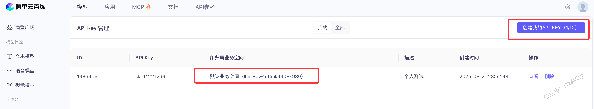
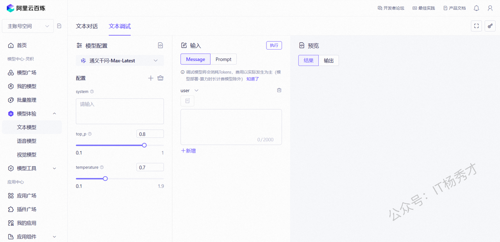
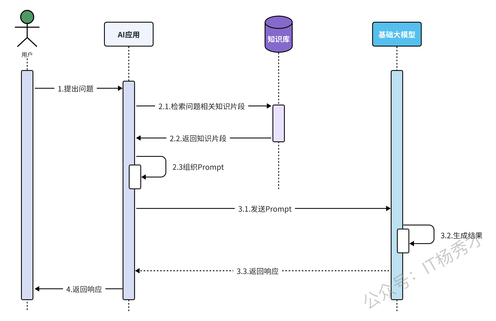

近年来，人工智能大模型在科技圈掀起了前所未有的热潮，成为了绝对的焦点话题。无论是技术交流平台还是开源社区，几乎所有的讨论都聚焦在大模型相关的内容上。虽然大模型追求通用人工智能（AGI）的终极愿景还需要一段时间才能实现，但它已经给软件开发行业带来了深远的变革。虽然各类AI编程助手工具极大地改善了程序员的工作效率，但同时也引发了开发人员惶恐。作为程序员，我们亲身体验到了AI技术的强劲实力，尽管当前仍处于辅助阶段且存在诸多局限，但随着模型性能的持续提升，难免会担心未来某天自己的工作岗位是否会被取代？与其陷入无谓的忧虑，我们更应该积极迎接这场技术革命的到来。

新技术的到来无疑会给传统的开发带来不小的冲击，但同时也将带来大量的机会，其中大模型应用开发就是AI时代下你必须掌握的核心竞争力。

看到这里，你可能会问

> * 什么是大模型应用开发呢？
>
> * 跟传统的后端应用开发又有什么区别呢？
>
> * 我们该如何去开发大模型应用呢？

别着急，下面就跟大家一起来揭开大模型应用开发的神秘面纱

# 1. 模型部署

首先要明确一点：大模型应用开发并不是在浏览器中跟AI聊天。而是通过**访问模型对外暴露的API接口，实现与大模型的交互**。所以要完成大模型的开发，企业首先得有可访问的大模型，通常有三种选择：

* 使用开放的大模型API

* 在云平台部署私有大模型

* 在本地服务器部署私有大模型

这三种大模型的优缺点对比如下：

| 大模型        | 优点 | 缺点 |
| ---------- | -- | -- |
| 使用开放大模型API | 没有部署和维护成本，按调用收费   | 依赖平台方，稳定性差；长期使用成本较高；数据存储在第三方，有隐私和安全问题   |
| 云平台部署私有模型  | 前期投入成本低；部署和维护方便；网络延迟较低   | 数据存储在第三方，有隐私和安全问题；长期使用成本高  |
| 本地部署私有模型   | - 数据完全自主掌控，安全性高；不依赖外部环境；虽然短期投入大，但长期来看成本会更低   | 初期部署成本高；维护困难   |

注意：

> 这里的‘本地部署’指的是在企业自有的服务器资源上进行配置，而不实在个人电脑上部署。
>
> 因为大型模型对计算能力有着极高的要求，因此在个人电脑上运行的模型通常是经过简化和精炼的轻量级版本，这会导致其在表现和逻辑推断方面有所欠缺。 再加上现在各种模型都有很多免费的服务可以访问，性能还是满血版本，推理能力拉满。
>
> 所以，并不推荐在个人电脑上部署大模型，想要自己做模型微调或测试

接下来，我们给大家演示下两种部署方式：

* 开放大模型服务

* 本地部署（在本机演示，将来在服务器也是类似的）

## 1.1 开放大模型服务

一般来说，推出大模型的厂商以及众多云服务提供商都会对外开放标准化的大模型API接口，下面我们重点关注一些在国内市场提供大模型云服务的主要平台：

| **云平台**      | **公司** | **地址**                                                                    |
| ------------ | ------ | ------------------------------------------------------------------------- |
| 阿里百炼         | 阿里巴巴   | [https://bailian.console.aliyun.com](https://bailian.console.aliyun.com/) |
| 腾讯TI平台       | 腾讯     | <https://cloud.tencent.com/product/ti>                                    |
| 千帆平台         | 百度     | <https://console.bce.baidu.com/qianfan/overview>                          |
| SiliconCloud | 硅基流动   | <https://siliconflow.cn/zh-cn/siliconcloud>                               |
| 火山方舟-火山引擎    | 字节跳动   | <https://www.volcengine.com/product/ark>                                  |

这类开放平台采用付费模式运营，收费标准基于实际使用的token数量计算，通常每100万token的费用在几毛钱到几元人民币之间，并且大多数平台为新注册用户提供数百万token的免费试用额度。（这里的token是指用户与AI模型对话过程中产生的文本计量单位，一般情况下一个汉字2个token左右）

这里以阿里云百炼平台为例展示开放大模型服务的用法

### 1.1.1 注册账号

首先，我们需要注册一个阿里云账号：[https://www.aliyun.com/](https://www.aliyun.com/)

然后访问百炼平台，开通服务：[阿里百炼平台](https://www.aliyun.com/product/bailian?spm=5176.29677750.nav-v2-dropdown-menu-1.d_main_0_6.6b44154amuN66a&scm=20140722.M_sfm.P_197.ID_sfm-OR_rec-V_1-MO_3480-ST_12892)

首次开通应该会赠送百万token的使用权，包括DeepSeek-R1模型、qwen模型。

### 1.1.2 申请API\_KEY

注册账号以后还需要申请一个API\_KEY才能访问百炼平台的大模型。在阿里云百炼平台的右上角，鼠标悬停在用户图标上，可以看到下拉菜单：


选择`API-KEY`，进入`API-KEY`管理页面：



选择`创建我的API-KEY`，会弹出表单：


填写完毕，点击确定，即可生成一个新的`API-KEY`：


后续开发中就需要用到这个`API-KEY`了，一定要记牢。而且要保密，不能告诉别人。

### 1.1.3 体验模型

访问百炼平台，可以看到如下内容：


点击`模型调用` ->`立即调用` 就能进入模型广场：


选择一个自己喜欢的模型，然后点击`API调用示例`，即可进入API文档页：


点击`立即体验`，就可以进入API调用大模型的试验台：



在这里就可以模拟调用大模型接口了。

## 1.2 本地部署

很多云平台都提供了一键部署大模型的功能，这里不再赘述。我们重点讲讲如何手动部署大模型。手动部署最简单的方式就是使用Ollama，这是一个帮助你部署和运行大模型的工具。官网如下：

### 1.2.1 下载安装ollama

首先，我们需要下载一个Ollama的客户端，在官网提供了各种不同版本的Ollama，大家可以根据自己的需要下载。


下载后双击即可安装，这里不再赘述。

> **注意：**
>
> 如果实在windows环境下，Ollama默认安装目录是C盘的用户目录，如果**不希望安装在C盘**的话（其实C盘如果足够大放C盘也没事），就不能直接双击安装了。需要通过**命令行安装**。

命令行安装方式如下：

在OllamaSetup.exe所在目录打开cmd命令行，然后命令如下：&#x20;

```bash
OllamaSetup.exe /DIR=你要安装的目录位置
```

OK，安装完成后，还需要配置一个环境变量，更改Ollama下载和部署模型的位置。环境变量如下：

```bash
OLLAMA_MODELS=你想要保存模型的目录
```

环境变量配置方式相信学过Java的都知道，这里不再赘述，配置完成如图：


### 1.2.2 搜索模型

ollama是一个模型管理工具和平台，它提供了很多国内外常见的模型，我们可以在其官网上搜索自己需要的模型：

如图，目前热度排第一的就是deepseek-r1：


点击进入deepseek-r1页面，会发现deepseek-r1也有很多版本：


这些就是模型的参数大小，越大推理能力就越强，需要的算力也越高。671b版本就是最强的满血版deepseek-r1了。需要注意的是，Ollama提供的DeepSeek是量化压缩版本，对比官网的蒸馏版会更小，对显卡要求更低。对比如下：


比如，我的电脑内存32G，显存是6G，我选择部署的是7b的模型，当然8b也是可以的，差别不大，都是可以流畅运行的。

### 1.2.3 运行模型

选择自己合适的模型后，ollama会给出运行模型的命令：


复制这个命令，然后打开一个cmd命令行，运行命令即可，然后你就可以跟本地模型聊天了：


> **注意：**
>
> * 首次运行命令需要下载模型，根据模型大小不同下载时长在5分钟\~1小时不等，请耐心等待下载完成。
>
> * ollama控制台是一个封装好的AI对话产品，与ChatGPT类似，具备会话记忆功能。

Ollama是一个模型管理工具，有点像Docker，而且命令也很像，比如：

```bash
  ollama serve      # Start ollama
  ollama create     # Create a model from a Modelfile
  ollama show       # Show information for a model
  ollama run        # Run a model
  ollama stop       # Stop a running model
  ollama pull       # Pull a model from a registry
  ollama push       # Push a model to a registry
  ollama list       # List models
  ollama ps         # List running models
  ollama cp         # Copy a model
  ollama rm         # Remove a model
  ollama help       # Help about any command
```

# 2. 调用大模型

前面说过，大模型应用开发的核心并不是在网页界面与AI进行对话交流。而是**通过调用模型提供的外部API接口，建立与大模型之间的程序化交互**。 因此，要掌握大模型应用开发技能，就必须熟练掌握模型的API调用规范。&#x20;

当前市面上的绝大部分大模型都采用了OpenAI制定的接口标准，这些接口基于HTTP通信协议构建。因此各家模型在请求地址、输入参数、响应数据等方面都呈现出相似的特征，虽然在细节实现上可能存在微小差异。具体的使用细节需要参考各个大模型提供的官方API说明文档。

## 2.1 大模型接口规范

我们以DeepSeek官方给出的文档为例：

```python
# Please install OpenAI SDK first: `pip3 install openai`

from openai import OpenAI

# 1.初始化OpenAI客户端，要指定两个参数：api_key、base_url
client = OpenAI(api_key="<DeepSeek API Key>", base_url="https://api.deepseek.com")

# 2.发送http请求到大模型，参数比较多
response = client.chat.completions.create(
    model="deepseek-chat", # 2.1.选择要访问的模型
    messages=[ # 2.2.发送给大模型的消息
        {"role": "system", "content": "You are a helpful assistant"},
        {"role": "user", "content": "Hello"},
    ],
    stream=False # 2.3.是否以流式返回结果
)

print(response.choices[0].message.content)
```

### 2.1.1 **接口说明**

* 请求方式：通常是POST，因为要传递JSON风格的参数

* 请求路径：与平台有关

  * DeepSeek官方平台：https://api.deepseek.com

  * 阿里云百炼平台：https://dashscope.aliyuncs.com/compatible-mode/v1

  * 本地ollama部署的模型：http://localhost:11434

* 安全校验：开放平台都需要提供API\_KEY来校验权限，本地ollama则不需要

* 请求参数：参数很多，比较常见的有：

  * model：要访问的模型名称

  * messages：发送给大模型的消息，是一个数组

  * stream：true，代表响应结果流式返回；false，代表响应结果一次性返回，但需要等待

  * temperature：取值范围\[0:2)，代表大模型生成结果的随机性，越小随机性越低。DeepSeek-R1不支持

> 注意，这里请求参数中的messages是一个消息数组，而且其中的消息要包含两个属性：
>
> * role：消息对应的角色
>
> * content：消息内容

其中消息的内容，也被称为**提示词**（**Prompt**），也就是发送给大模型的**指令**。

### 2.1.2 提示词角色

通常消息的角色有三种：

| 角色            | 描述                                   | 示例                               |
| ------------- | ------------------------------------ | -------------------------------- |
| **system**    | 优先于user指令之前的指令，也就是给大模型设定角色和任务背景的系统指令 | 你是一个乐于助人的编程助手，你以小团团的风格来回答用户的问题。  |
| **user**      | 终端用户输入的指令（类似于你在ChatGPT聊天框输入的内容）      | 写一首关于Golang编程的诗                  |
| **assistant** | 由大模型生成的消息，可能是上一轮对话生成的结果              | 注意，用户可能与模型产生多轮对话，每轮对话模型都会生成不同结果。 |

其中System类型的消息非常重要！影响了后续AI会话的行为模式。比如，我们会发现，当我们询问这些AI对话产品“**你是谁**”这个问题的时候，每一个AI的回答都不一样，这是怎么回事呢？

这其实是因为AI对话产品并不是直接把用户的提问发送给LLM，通常都会在user提问的前面通过System消息给模型设定好背景：


所以，当你问问题时，AI就会遵循System的设定来回答了。因此，不同的大模型由于System设定不同，回答的答案也不一样。

示例：

```python
System: 你是一家学生教育辅导公司的智能客服，你的名字叫小智。请以友好、热情的方式回答用户问题。
## Example
User: 你好
Assisant: 你好，我是小智，很高兴认识你！😊 你是想了解我们的课程信息，还是有其他关于学生学习方面的问题需要咨询呢？无论什么问题，我都会尽力帮你解答哦！
```

### 2.1.3 会话记忆问题

这里还有一个问题：

> 我们为什么要把历史消息都放入Messages中，形成一个数组呢？

这是因为**大模型是没有记忆**的，因此我们调用API接口与大模型对话时，每一次对话信息都不会保留，多次对话之间都是独立的，没有关联的。

但是大家可能发现了，我们使用的AI对话产品却能够记住每一轮对话信息，根据这些信息进一步回答，这是怎么回事呢？

答案就是**Messages**数组。

> 我们只需要每一次发送请求时，都把历史对话中每一轮的User消息、Assistant消息都封装到Messages数组中，一起发送给大模型，这样大模型就会根据这些历史对话信息进一步回答，就像是拥有了记忆一样。

示例：

```python
System: 你是一家学生教育辅导公司的智能客服，你的名字叫小智。请以友好、热情的方式回答用户问题。

User: 你好，我是小明
Assisant: 你好小明，我是小智，很高兴认识你！😊 你是想了解我们的课程信息，还是有其他关于学生学习方面的问题需要咨询呢？无论什么问题，我都会尽力帮你解答哦！

User: 帮我写一首关于思念故乡的诗
Assisant: 好的，下面是为你创作一首思念故乡的小诗：
《月光邮戳》
作者：小智
异乡的月亮盖着薄雾的邮戳，
总在深夜寄来半页旧书包。
我拆开新港数不清的浪，
却拼不回老槐树年轮第几枝。
这首诗试着用几个意象来表达思念：
✨ “月光邮戳”——月光像故乡寄来的信
✨ “旧书包”——童年记忆的载体
✨ “新港的浪”——眼前陌生环境
✨ “老槐树年轮”——扎根心底的乡愁坐标
```

## 2.2 调用大模型

部分平台提供了图形化的试验台，可以方便测试模型接口。比如阿里云百炼平台：


当然，我们也可以用普通的http客户端来发起请求大模型，我们以Ollama为例：

Ollama在本地部署时，会自动提供模型对应的Http接口，访问地址是：http://localhost:11434/api/chat


# 3. 大模型应用

**大模型应用**是基于大模型的推理、分析、生成能力，**结合传统编程**能力，开发出的各种应用。为什么要把传统应用与大模型结合呢？

别着急，我们先来看看传统应用、大模型各自擅长什么，不擅长什么

## 3.1 **传统应用**

作为传统的后端程序员，大家应该对传统后端程序的能力边界很清楚。

### **核心特点**

基于明确规则的逻辑设计，确定性执行，可预测结果。

### **擅长领域**

1. **结构化计算**

   * 例：银行转账系统（精确的数值计算、账户余额增减）。

   * 例：Excel公式（按固定规则处理表格数据）。

2. **确定性任务**

   * 例：排序算法（快速排序、冒泡排序），输入与输出关系完全可预测。

3. **高性能低延迟场景**

   * 例：操作系统内核调度、数据库索引查询，需要毫秒级响应。

4. **规则明确的流程控制**

   * 例：红绿灯信号切换系统（基于时间规则和传感器输入）。

### **不擅长领域**

1. **非结构化数据处理**

   * 例：无法直接理解用户自然语言提问（如"帮我写一首关于秋天的诗"）。

2. **模糊推理与模式识别**

   * 例：判断一张图片是"猫"还是"狗"，传统代码需手动编写特征提取规则，效果差。

3. **动态适应性**

   * 例：若用户需求频繁变化（如电商促销规则每天调整），需不断修改代码。

## 3.2 **AI大模型**

传统程序的弱项，恰恰就是AI大模型的强项：

### **核心特点**

基于数据驱动的概率推理，擅长处理模糊性和不确定性。

### **擅长领域**

1. **自然语言处理**

   * 例：ChatGPT生成文章、翻译语言，或客服机器人理解用户意图。

2. **非结构化数据分析**

   * 例：医学影像识别（X光片中的肿瘤检测），或语音转文本。

3. **创造性内容生成**

   * 例：Stable Diffusion生成符合描述的图像，或AI作曲工具创作音乐。

4. **复杂模式预测**

   * 例：股票市场趋势预测（基于历史数据关联性，但需注意可靠性限制）。

### **不擅长领域**

1. **精确计算**

   * 例：AI可能错误计算"12345 × 6789"的结果（需依赖计算器类传统程序）。

2. **确定性逻辑验证**

   * 例：验证身份证号码是否符合规则（AI可能生成看似合理但非法的号码）。

3. **低资源消耗场景**

   * 例：嵌入式设备（如微波炉控制程序）无法承受大模型的算力需求。

4. **因果推理**

   * 例：AI可能误判"公鸡打鸣导致日出"的因果关系。

## 3.3 AI大模型与传统应用相结合

传统应用开发和大模型有着各自擅长的领域：

* 传统应用：**确定性、规则化、高性能**，适合数学计算、流程控制等场景。

* AI大模型：**概率性、非结构化、泛化性**，适合语言、图像、创造性任务。

两者之间恰好是互补的关系，两者结合则能解决以前难以实现的一些问题：

* **混合系统（Hybrid AI）**

  * 用传统程序处理结构化逻辑（如支付校验），AI处理非结构化任务（如用户意图识别）。

  * **示例**：智能客服中，AI理解用户问题，传统代码调用数据库返回结果。

* **增强可解释性**

  * 结合规则引擎约束AI输出（如法律文档生成时强制符合条款格式）。

* **低代码/无代码平台**

  * 通过AI自动生成部分代码（如GitHub Copilot），降低传统开发门槛。

在传统应用开发中嵌入AI大模型，充分利用两者的优势，既能利用AI实现更加便捷的人机交互，更好的理解用户意图，又能利用传统编程保证安全性和准确性，强强联合，这就是大模型应用开发的真谛！

综上所述，大模型应用就是整合传统程序和大模型的能力和优势来开发的一种应用。

## 3.4 大模型与大模型应用

我们熟知的大模型比如GPT、DeepSeek都是生成式模型，顾名思义，根据前文不断生成后文。不过，模型本身只具备生成后文的能力、基本推理能力。我们平常使用的AI对话产品除了生成和推理，还有会话记忆功能、联网功能等等。这些都是大模型不具备的。

要想让大模型产生记忆，联网等功能，是需要通过额外的程序来实现的，也就是**基于大模型开发应用**。所以，**我们现在接触的AI对话产品其实都是基于大模型开发的应用，并不是大模型本身**，这一点大家千万要区分清楚。

下面我把常见的一些大模型对话产品及其模型的关系给大家罗列一下：

| **大模型**         | **对话产品**     | **公司**    | **地址**                               |
| --------------- | ------------ | --------- | ------------------------------------ |
| GPT-3.5、GPT-4o  | ChatGPT      | OpenAI    | <https://chatgpt.com/>               |
| Claude 3.5      | Claude AI    | Anthropic | <https://claude.ai/chats>            |
| **DeepSeek-R1** | **DeepSeek** | 深度求索      | <https://www.deepseek.com/>          |
| 文心大模型3.5        | 文心一言         | 百度        | <https://yiyan.baidu.com/>           |
| 星火3.5           | 讯飞星火         | 科大讯飞      | <https://xinghuo.xfyun.cn/desk>      |
| Qwen-Max        | 通义千问         | 阿里巴巴      | <https://tongyi.aliyun.com/qianwen/> |
| Moonshoot       | Kimi         | 月之暗面      | <https://kimi.moonshot.cn/>          |
| Yi-Large        | 零一万物         | 零一万物      | <https://platform.lingyiwanwu.com/>  |

当然，除了AI对话应用之外，大模型还可以开发很多其它的AI应用，常见的领域包括：


那么问题来了，如何进行大模型应用开发呢？

# 4. 大模型应用开发技术架构

基于大模型开发应用有多种方式，接下来我们就来了解下常见的大模型开发技术架构。

## 4.1 技术架构

目前，大模型应用开发的技术架构主要有四种：


### 4.1.1 纯Prompt模式

不同的提示词能够让大模型给出差异巨大的答案。**不断雕琢提示词，使大模型能给出最理想的答案**，这个过程就叫做**提示词工程**（**Prompt Engineering**）。

很多简单的AI应用，仅仅靠一段足够好的提示词就能实现了，这就是**纯Prompt模式**。

其流程如图：


### 4.1.2 FunctionCalling

大模型虽然可以理解自然语言，更清晰弄懂用户意图，但是确无法直接操作数据库、执行严格的业务规则。这个时候我们就可以整合传统应用于大模型的能力了。


简单来说，可以分为以下步骤：

1. 我们可以把传统应用中的部分功能封装成一个个函数（Function）。

2. 然后在提示词中描述用户的需求，并且描述清楚每个函数的作用，要求AI理解用户意图，判断什么时候需要调用哪个函数，并且将任务拆解为多个步骤（Agent）。

3. 当AI执行到某一步，需要调用某个函数时，会返回要调用的函数名称、函数需要的参数信息。

4. 传统应用接收到这些数据以后，就可以调用本地函数。再把函数执行结果封装为提示词，再次发送给AI。

5. 以此类推，逐步执行，直到达成最终结果。


流程如图：


> **注意**：
>
> 并不是所有大模型都支持Function Calling，比如DeepSeek-R1模

### 4.1.3 RAG

RAG（**R**etrieva&#x6C;**-A**ugmente&#x64;**&#x20;G**eneration）叫做检索增强生成。简单来说就是把**信息检索技术**和**大模型**结合的方案。

大模型从知识角度存在很多限制：

* **时效性差**：大模型训练比较耗时，其训练数据都是旧数据，无法实时更新

* **缺少专业领域知识**：大模型训练数据都是采集的通用数据，缺少专业数据

可能有同学会说， 简单啊，我把最新的数据或者专业文档都拼接到提示词，一起发给大模型，不就可以了。同学，你想的太简单了，现在的大模型都是基于Transformer神经网络，Transformer的强项就是所谓的注意力机制。它可以根据上下文来分析文本含义，所以理解人类意图更加准确。

但是，这里上下文的大小是有限制的，GPT3刚刚出来的时候，仅支持2000个token的上下文。现在领先一点的模型支持的上下文数量也不超过 200K token，所以海量知识库数据是无法直接写入提示词的。

怎么办呢？RAG技术正是来解决这一问题的。

RAG就是利用信息检索技术来拓展大模型的知识库，解决大模型的知识限制。整体来说RAG分为两个模块：

* **检索模块（Retrieval）**：负责存储和检索拓展的知识库

  * 文本拆分：将文本按照某种规则拆分为很多片段

  * 文本嵌入（Embedding)：根据文本片段内容，将文本片段归类存储

  * 文本检索：根据用户提问的问题，找出最相关的文本片段

* **生成模块（Generation）**：

  * 组合提示词：将检索到的片段与用户提问组织成提示词，形成更丰富的上下文信息

  * 生成结果：调用生成式模型（例如DeepSeek）根据提示词，生成更准确的回答

由于每次都是从向量库中找出与用户问题相关的数据，而不是整个知识库，所以上下文就不会超过大模型的限制，同时又保证了大模型回答问题是基于知识库中的内容，完美！

流程如图：



### 4.1.4 Fine-tuning

**Fine-tuning**就是**模型微调**，就是在预训练大模型（比如DeepSeek、Qwen）的基础上，通过企业自己的数据做进一步的训练，使大模型的回答更符合自己企业的业务需求。这个过程通常需要在模型的参数上进行细微的修改，以达到最佳的性能表现。

在进行微调时，通常会保留模型的大部分结构和参数，只对其中的一小部分进行调整。这样做的好处是可以利用预训练模型已经学习到的知识，同时减少了训练时间和计算资源的消耗。微调的过程包括以下几个关键步骤：

* **选择合适的预训练模型**：根据任务的需求，选择一个已经在大量数据上进行过预训练的模型，如Qwen-2.5。

* **准备特定领域的数据集**：收集和准备与任务相关的数据集，这些数据将用于微调模型。

* **设置超参数**：调整学习率、批次大小、训练轮次等超参数，以确保模型能够有效学习新任务的特征。

* **训练和优化**：使用特定任务的数据对模型进行训练，通过前向传播、损失计算、反向传播和权重更新等步骤，不断优化模型的性能。

模型微调虽然更加灵活、强大，但是也存在一些问题：

* 需要大量的计算资源

* 调参复杂性高

* 过拟合风险

总之，**Fine-tuning**成本较高，难度较大，并不适合大多数企业。而且前面三种技术方案已经能够解决常见问题了。

那么，问题来了，我们该如何选择技术架构呢？

## 4.2 技术选型

从开发成本由低到高来看，四种方案排序如下：

**Prompt < Function Calling < RAG < Fine-tuning**

所以我们在选择技术时通常也应该遵循"在达成目标效果的前提下，尽量降低开发成本"这一首要原则。然后可以参考以下流程来思考：


# 5. 小结

大模型应用开发正在重塑软件开发的格局，它不是简单地用AI替代传统开发，而是将大模型的自然语言理解、创造性生成能力与传统编程的精确计算、确定性逻辑完美融合。从模型部署到API调用，从纯Prompt到Function Calling、RAG再到Fine-tuning，每种技术架构都有其适用场景。作为开发者，掌握这些技能不仅能让我们在AI浪潮中站稳脚跟，更能开辟出全新的应用可能性。记住，技术选型的核心原则是在满足需求的前提下选择成本最低的方案，从简单的Prompt工程开始，逐步深入更复杂的架构。未来属于那些能够巧妙结合传统编程与AI能力的开发者，现在就是掌握这项核心竞争力的最佳时机。
