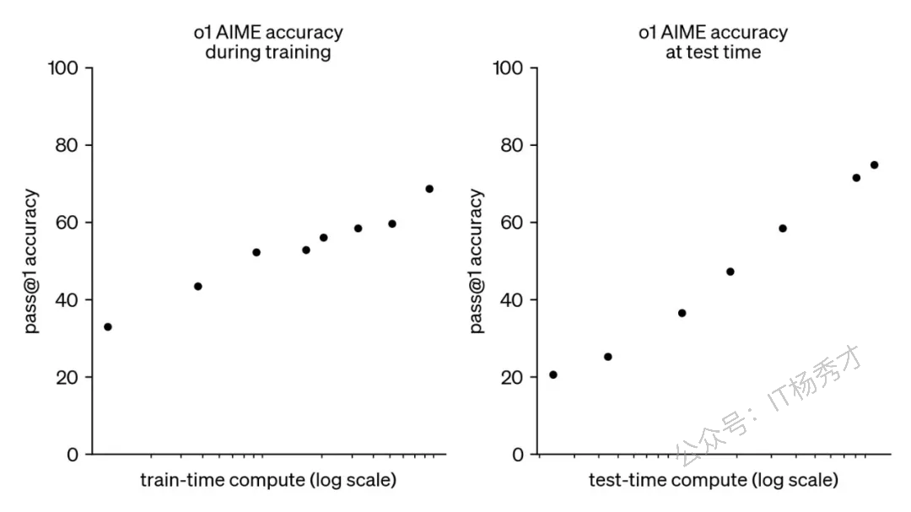
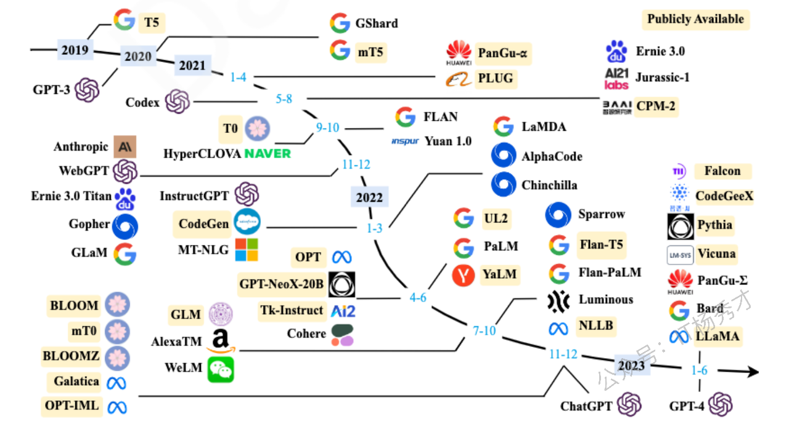
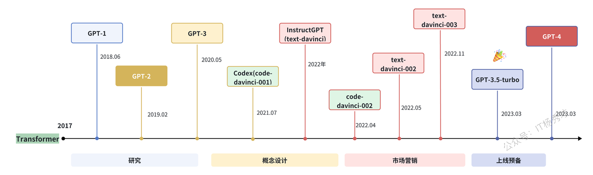
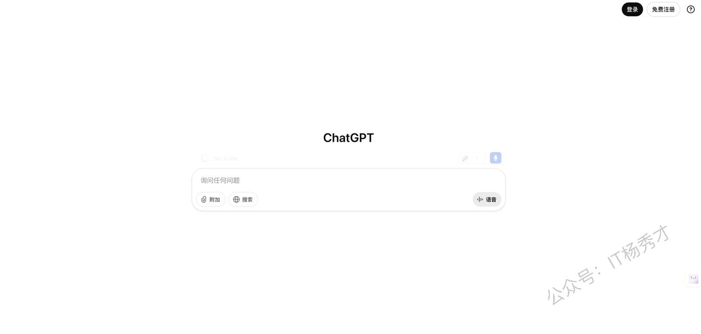
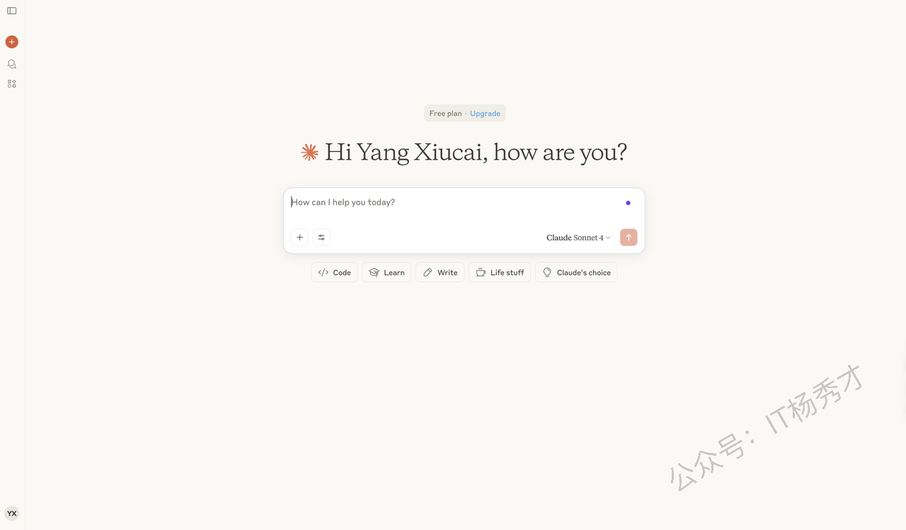
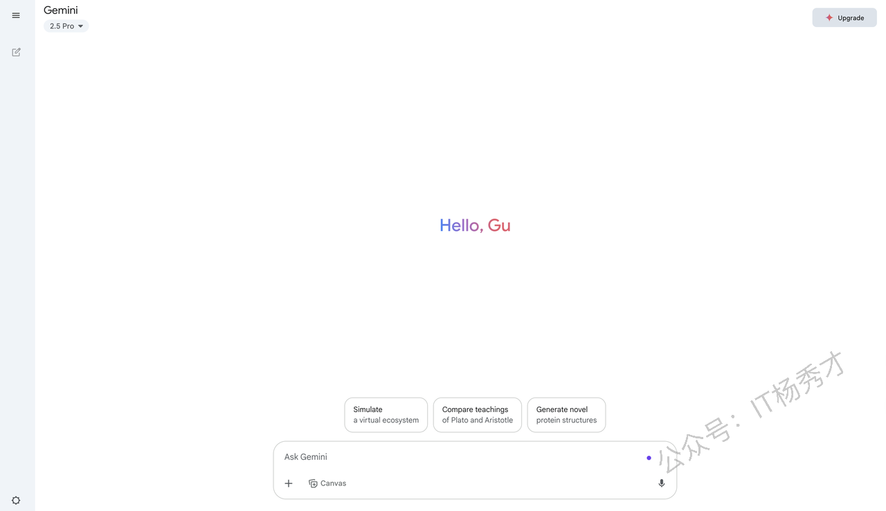
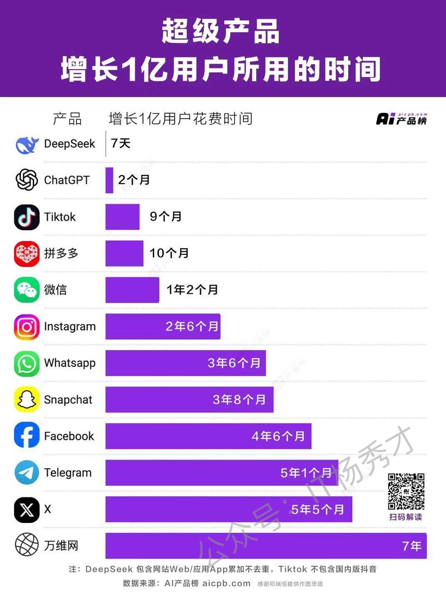
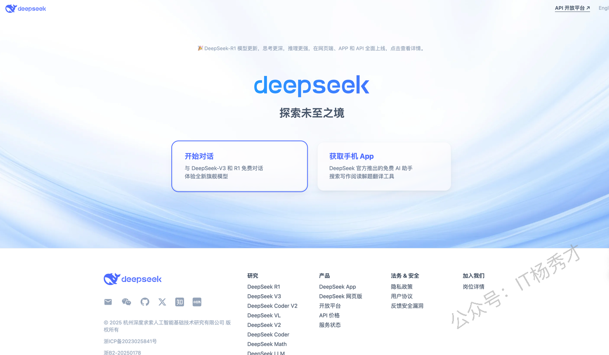
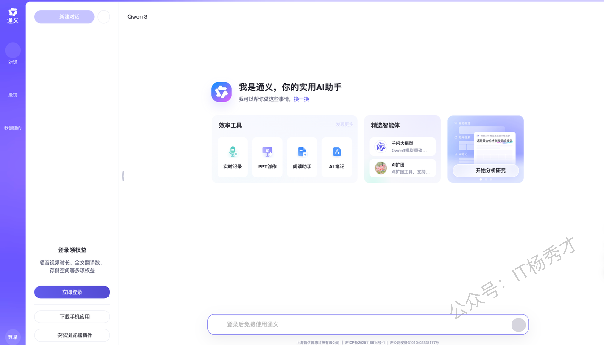

# 大模型简介

## 1. 什么是大语言模型（LLM）

你是否曾好奇，那些能与你对答如流、能帮你挥洒创意、甚至能编写复杂代码的AI，其背后究竟隐藏着怎样的奥秘？答案，就指向一个近年来炙手可热的概念——**大语言模型（Large Language Model, LLM）**。

从本质上讲，LLM是一种旨在深度理解并能灵活生成人类语言的人工智能模型。你可以将它想象成一位博览群书的"超级学霸"，通过学习海量的文本数据，从而掌握了语言的精髓。我们常说的LLM，通常指的是那些参数规模达到数百亿甚至更多的庞然大物。正是这海量数据的"投喂"，赋予了它们对语言前所未有的深刻理解力。

如今，群星璀璨的LLM领域中，国外有声名显赫的GPT、LLaMA、Gemini、Claude，国内则有DeepSeek、通义千问、文心一言、Kimi等一众实力派选手。

### 1.1 **从量变到质变**

为了探寻性能的边界，研究者们踏上了一条"大力出奇迹"的道路，不断构建规模更为庞大的语言模型。例如，拥有1750亿参数的GPT-3和高达5400亿参数的PaLM，都是这条路上的里程碑。

尽管这些巨型模型在架构和预训练任务上与它们的前辈（如3.3亿参数的BERT和15亿参数的GPT-2）并无本质不同，但它们却展现出了截然不同的能力，尤其是在处理复杂任务时，迸发出了令人惊叹的潜力——这，就是所谓的"**涌现能力**"。

以GPT-3和GPT-2为例，前者可以通过上下文学习（in-context learning）来解决小样本任务，而后者在这方面则显得力不从心。正是这种从量变到质变的飞跃，让科研界为这些庞大的模型冠以"大语言模型"之名。而LLM的一个杰出应用，便是我们熟知的ChatGPT，它作为GPT系列模型在对话式应用上的一次大胆尝试，其流畅与自然的交互体验，彻底征服了世界。

### 1.2 **LLM的进化史**

让机器理解语言的探索，可以追溯到上世纪90年代。那时的研究，主要采用统计学习方法，通过分析前文来预测下一个词，但在理解复杂的语言规则方面，始终存在着难以逾越的瓶颈。

转机出现在2003年，深度学习的先驱者Bengio发表了经典论文《A Neural Probabilistic Language Model》，首次将深度学习的思想注入语言模型。强大的神经网络，为计算机装上了一个理解语言的"超级大脑"，使其能更好地捕捉和理解语言中的复杂关系。

2018年，**Transformer**架构的横空出世，成为了LLM发展史上的分水岭。它就像一个高效的"阅读引擎"，让模型能够通过"阅读"海量文本，以前所未有的深度去理解语言的规则和模式。研究者们发现，随着模型规模的扩大（无论是增加模型参数还是使用更多数据），模型的性能都会显著提升，这一规律被称为"**规模法则（Scaling Law）**"。这一发现，正式宣告了大语言模型（LLM）时代的到来。

通常，一个大模型的构建包含三个核心阶段：**预训练、后训练和在线推理**。在2024年9月之前，大模型领域的"规模法则"主要存在于预训练阶段。然而，随着OpenAI o1模型的推出，人们惊喜地发现，后训练阶段的强化学习（RL Scaling Law）和在线推理阶段（Inference Scaling Law）也同样遵循着规模法则。这意味着，随着在各个阶段计算量的持续投入，大模型的性能仍在不断地向上突破。



## 2. 主流LLM模型

大语言模型的发展历程虽短，其演进速度却令人叹为观止。截至2024年6月，全球已有上百种大模型竞相发布。下图梳理了从2019年至2024年6月，那些参数量超过百亿且具有重要影响力的大语言模型。



接下来，让我们重点介绍下国内外几个主流的大模型。

### 2.1 ChatGPT

谈及大模型，OpenAI及其GPT（Generative Pre-Training）系列是绕不开的篇章。GPT模型的核心理念，是利用一个仅包含解码器（decoder-only）的Transformer模型，将浩如烟海的世界知识压缩其中，使其成为一个能够"记忆"并运用这些知识的通用任务求解器。

其成功的关键在于两点：

* 训练一个能够精准预测下一个词的decoder-only Transformer语言模型。

* 在第一点的基础上，持续、大规模地扩展模型的尺寸。

OpenAI在LLM领域的探索历程，大致可以由下图清晰地展现。



目前，GPT系列已经演化出**知识型**与**推理型**两大技术分支。

2022年11月，OpenAI发布了基于GPT-3.5和GPT-4模型的会话应用ChatGPT。它凭借与人类交流时出色的表现，迅速在人工智能社区引发轰动。值得注意的是，ChatGPT本质上是一个LLM应用，它基于基座模型开发，与基座模型本身有着本质区别。ChatGPT上线后，用户增长势如破竹，仅用5天注册用户便突破100万，两个月后月活用户破亿，成为当时史上用户增长最快的消费级应用。



随着不断的迭代，ChatGPT的功能也日益丰富和强大：

* **插件系统**：允许开发者创建工具来扩展ChatGPT的能力，实现了网页浏览、数据分析和第三方服务调用等功能。

* **实时语音和视频对话**：用户可以与AI进行自然的语音和视频交流，模型甚至支持手势识别和情感表达。

* **多模态能力**：能够分析和理解用户上传的图片、音频和视频，实现全面的多模态交互。

* **自定义指令与记忆功能**：能够记住用户此前的交互习惯和偏好，提供更具个性化的体验。

* **GPT构建器平台**：允许用户无需编程即可创建专用的AI助手，并支持自定义知识库和行为模式。

* **数据分析与可视化**：能够直接处理和分析用户上传的数据文件，并生成图表和可视化报告。

* **知识型与推理型双模式**：用户可以在不同模型（如知识型的GPT-4.5和推理型的o1/o3）之间切换，以满足不同场景的需求。

* **思维链展示**：在推理型模型中，用户可以选择性地查看模型的思考过程，从而更好地理解其推理步骤。

2023年3月发布的GPT-4引入了多模态能力，其规模相比GPT-3.5的1750亿参数有了显著扩大（推测约1.8万亿参数），在解决复杂任务和评估任务上展现出巨大的性能飞跃。

2024年5月发布的GPT-4o（"o"代表"omni"，意为全能），具备了对文本、语音、图像三种模态的深度理解能力，其主要特点包括：多模态的无缝融合、快约2倍的响应速度、更富情感的语音表达以及降低约50%的API成本。

2024年7月发布的GPT-4o mini，则是一款面向消费级应用的轻量级模型，价格更亲民，适合日常对话和基础任务。

2025年2月发布的GPT-4.5，在知识广度、推理深度和创意表达方面均有显著提升，特别强化了对客观事实的准确性，并在情商方面表现优异。其上下文长度扩展至512K，是OpenAI最后一个非思维链模型。

**主流知识型模型对比：**

```plain&#x20;text
| 模型名称     | 上下文长度 | 特点                 | 知识截止日期 |
|--------------|------------|----------------------|--------------|
| GPT-4        | 16k        | 经济，专门对话       | 2021年9月    |
| GPT-4o       | 128k       | 多模态，速度快       | 2023年10月   |
| GPT-4.5      | 128k       | 最强知识型，精准度高 | 2023年10月   |
| GPT-4o mini  | 128k       | 轻量知识型，性价比高 | 2023年10月   |
```

2024年9月发布的o1-mini、o1-preview是专为复杂推理而设计的模型。它们在回答前会先生成一段（不公开的）思维链，优先确保推理步骤的正确性和结果的精确性。其特点包括：超强的推理能力、可靠的解题过程、优秀的问题分解能力以及自纠错机制。

2024年12月发布的o1，相较于o1-preview，能在更短的时间内响应。

2025年1月发布的o3-mini，可以显示部分思维链，与o1相比，在保持效果的同时，响应速度更快。

**GPT各版本模型对比：**

```plain&#x20;text
| 模型名称 | 上下文长度 | 特点             | 知识截止日期 |
|----------|------------|------------------|--------------|
| o1       | 128k       | 强推理能力，慢   | 2023年10月   |
| o1 mini  | 200k       | 轻量推理，中速   | 2023年10月   |
| o3 mini  | 200k       | 超轻量推理，最快 | 2023年10月   |
```

至此，OpenAI的模型战略形成了"知识型"和"推理型"两条相辅相成的产品线，让用户可以根据具体需求，选择最适合的模型类型。

### 2.2 Claude

Claude系列模型由从OpenAI离职的核心成员创办的Anthropic公司开发，是闭源大模型领域的另一位重量级玩家。

* 最早的Claude于2023年3月15日发布。

* 2024年3月4日，更新至Claude 3系列，包括能力依次递增的Haiku、Sonnet和Opus，旨在满足不同层级的用户需求。

* 2024年10月，Anthropic发布了在推理和通用任务上显著提升的Claude 3.5 Sonnet。

* 2025年5月，Anthropic进一步发布了Claude 4.0系列，包括Claude 4 Sonnet和Claude 4 Opus。这两款均为混合推理模型，支持标准模式与推理思考模式切换，编码能力异常强大。同时，它们还支持多工具并行调用与精准指令解析，并升级了本地文件访问时的内存管理，强化了复杂任务的处理能力。

**Claude模型特性一览：**

```plain&#x20;text
| 模型名称          | 上下文长度 | 特点                 |
|-------------------|------------|----------------------|
| Claude 3.5 Haiku  | 200k       | 速度最快             |
| Claude 4 Sonnet   | 200k       | 最强性能，领先推理力 |
| Claude 4 Opus     | 200k       | 性能强大，费用最高   |
```



### 2.3 Gemini

Gemini系列语言大模型由科技巨头Google开发。

* 2022年4月，其初始版本（当时名为PaLM，后更名为Gemini）发布。

* 2025年2月，Google发布了在性能和效率上均有显著提升的Gemini 2.0系列，包括Pro、Flash和Flash-Lite三个版本，分别适用于不同场景。同时，也推出了其推理模型Gemini 2.0 Flash Thinking。

* 2025年3月，Google发布了Gemini 2.5 Pro，性能进一步提升，尤其在推理能力和代码能力上进步显著。

**Gemini模型特性一览：**

```plain&#x20;text
| 模型名称                   | 上下文长度 | 特点         |
|----------------------------|------------|--------------|
| Gemini 2.5 Pro             | 2M         | 性能最强     |
| Gemini 2.0 Flash           | 1M         | 低延迟，性能强 |
| Gemini 2.0 Flash-Lite      | 1M         | 性价比最高   |
| Gemini 2.0 Flash Thinking  | 1M         | 思维链展示   |
```



### 2.4 文心一言

文心一言是基于百度"文心大模型"的知识增强语言大模型，于2023年3月在国内率先开启邀测。其基础模型"文心大模型"早在2019年便发布了1.0版，现已更新到4.0版本。更进一步看，文心大模型是一个庞大的家族，包括NLP、CV、跨模态、生物计算和行业大模型等。得益于此，文心一言的中文能力在国内处于领先水平。

文心一言网页版分为免费版（使用文心3.5）和专业版（使用文心4.0），同时也提供API供开发者调用。


### 2.5 DeepSeek

DeepSeek是由国内的深度求索（DeepSeek）团队开发的开源大语言模型系列。它采用decoder-only架构，并融合了FlashAttention-2、RoPE位置编码、SwiGLU等先进技术，在多语言理解和代码生成等方面表现出色。

**模型发展历程：**

* **2023年11月12日**：发布DeepSeek系列基础模型（7B和67B），同时发布专用代码生成模型DeepSeek-Coder。

* **2024年3月15日**：发布DeepSeek-V2系列，提升了多语言、长文本和推理能力，并发布了DeepSeek-MoE混合专家模型。

* **2024年5月31日**：发布DeepSeek-V2.5，性能进一步提升，上下文长度扩展至128K。

* **2024年10月**：发布DeepSeek-V3，在推理、多语言理解和创意生成方面显著提升。

* **2025年2月**：

  * 发布**DeepSeekR1**推理型大模型，是首个开源的推理型大模型，在多项基准测试中超越了o1系列。

  * 发布**DeepSeek-R1-Zero**，直接在大规模强化学习（RL）上训练，无需SFT阶段，推理能力便十分出色。

  * 同时开源了从DeepSeek-R1中蒸馏出的六个dense模型。

DeepSeek采用了一系列创新技术，如**多头潜在注意力（MLA）和DeepSeekMoE**，实现了高效推理和经济的训练成本。

凭借DeepSeekR1的卓越能力，DeepSeek迅速成为现象级爆火应用，仅用7天就完成了1亿用户的增长，打破了ChatGPT两个月的记录，成为史上用户增长最快的AI应用。目前，各大主流平台基本上都已接入DeepSeek。



以下就是DeepSeek的使用界面



### 2.6 通义千问：来自阿里的开源力量

通义千问由阿里巴巴基于"通义"大模型研发，于2023年4月正式发布。

* 2023年9月，阿里云开源了Qwen（通义千问）系列。

* 2024年6月6日，正式开源Qwen2。

* 2025年4月29日，发布了全新升级的Qwen3系列。

Qwen系列均采用decoder-only架构，并结合了SwiGLU、RoPE、GQA等技术，是中文能力非常出色的开源模型系列。目前，已开源了从0.6B到235B的多种模型大小，上下文长度最高支持128k。Qwen3进一步增强了模型性能，覆盖119种语言和方言，并强化了代码、Agent及MCP（多模态内容理解）能力。

此外，阿里还开源了专门的代码模型（Qwen2.5-Coder）和数学模型（Qwen2.5-Math）。在推理大模型方面，于2024年11月发布并开源了QwQ-32B-Preview模型，后续在2025年3月发布的QwQ-32B，其性能可与更大参数的DeepSeek-R1相媲美。

以下是通义千问的使用界面：&#x20;



