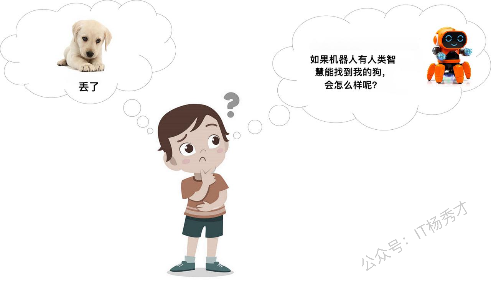
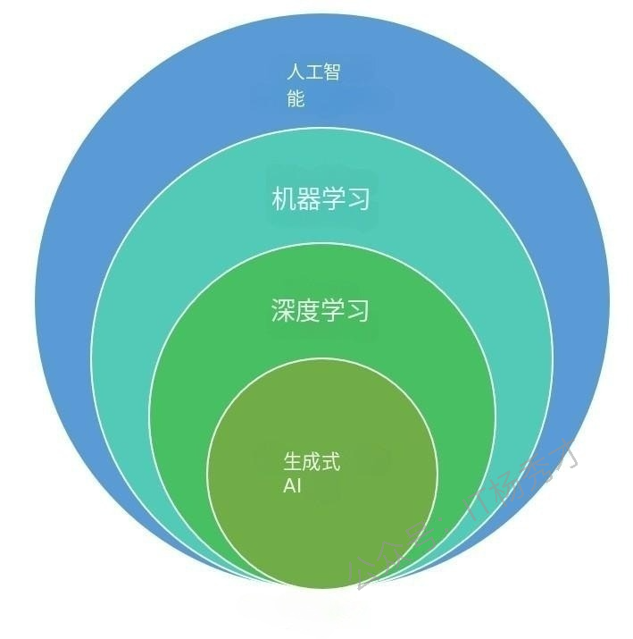
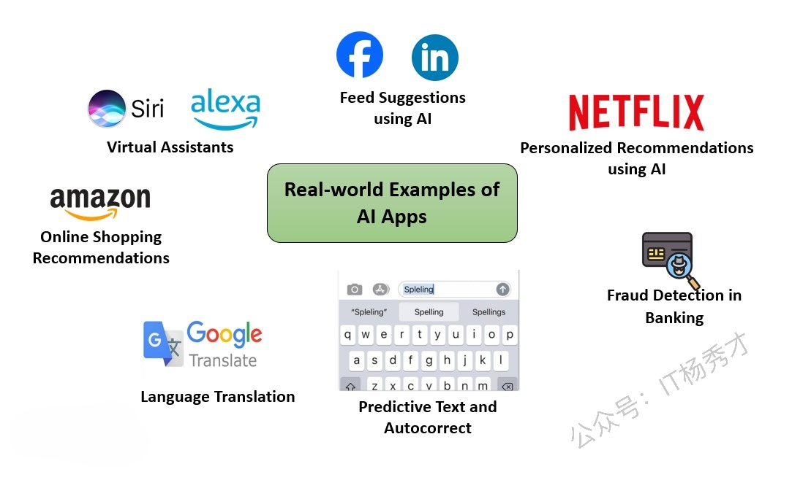
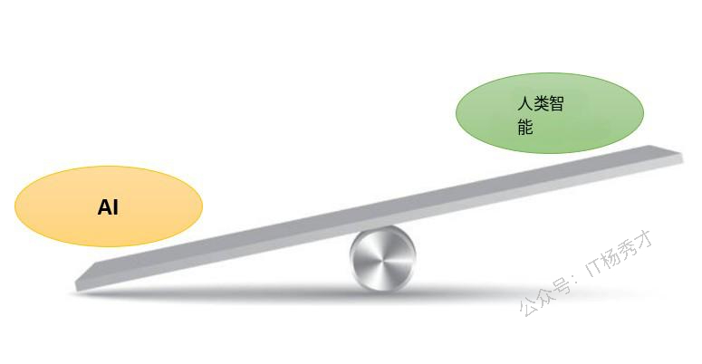
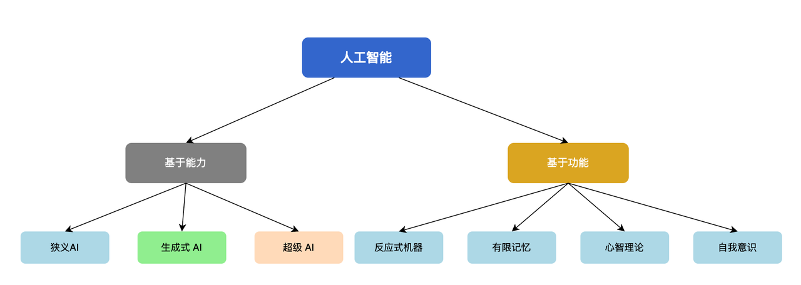
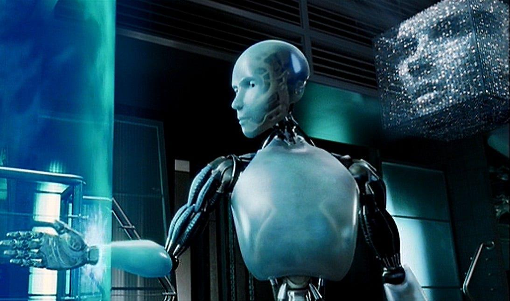
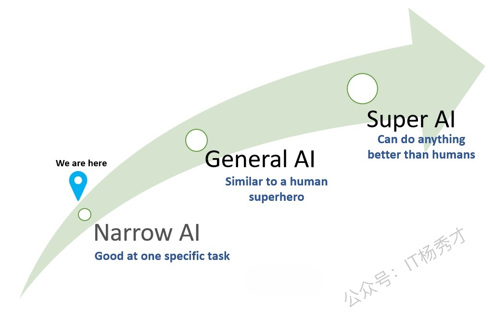

---
tags:
  - AI
  - 人工智能
  - 生成式AI
  - 生成式AI导论
  - 人工智能导论
  - 生成式AI入门
---

# 人工智能导论

## 1. 什么是人工智能

人工智能是指机器/计算机模仿人类思考和决策的方式。人工智能使计算机能够像我们人类一样思考。简单来说—— 简单地说， **人工智能就是让计算机能够思考。**

人工智能使计算机能够在没有人持续指导的情况下理解、分析数据并做出决策。这些智能机器使用算法（即逐步指令）来处理信息并随着时间的推移提高其性能。

举个简单的例子：假设你的狗丢了，你需要找到它。**你应该能够制定一个策略来找到你的狗。**&#x4F8B;如：

* 我们家的第一次搜索。

* 如果找不到它，那就在您经常带狗去的游戏区寻找。

* 如果你还没找到他，可以问问你的朋友。

* 等等....

你能够根据实际情况采取行动。比如，下雨了，并且你知道你的狗不喜欢淋湿，你就会把搜索重点放在阴凉干燥的地方。假设现在有人告诉你—— *“*&#x6211;可能在花园里见过你的&#x72D7;*”。*&#x4F60;接下来就会去花园找它，你知道花园在哪里，怎么去那里，这其实是你的大脑在决策。并且你不会把猫或树和狗混淆。当你看到一只狗时，你会尝试辨认它是不是你的狗。你可以通过你的这些智慧来找到你的狗。假设我们能**将这些智慧赋予机器人;**，这样下次你丢了狗，你的机器人就能找到它，会怎么样呢？

为了找到你的狗，这个机器人**可以像你一样思考和行动。比如：**

* 机器人能够识别你的房间。但即使你的床被移到另一面墙上，或者毯子换了，它也应该能够识别出这个房间。 **即使有了新的变化，它也需要智能来识别房间。**

* 机器人能够**识别狗，并区分出你特定的那只狗。**

* 机器人能够**理解人类的语言和指令**。

* 器人能够**提出策略并根据新情况采取行动**。例如，如果下雨，只在阴凉处搜索。

总之， 要找到你的狗，机器人需要像人类一样的智慧。如果我们能做到这一点，下次你丢了狗，你的机器人朋友可能就能用它的智慧找到它。

这就是人工智能（AI），人类般的智能，由人类在机器人（或机器或计算机）中创造。

## 2. 生成式人工智与人工智能、机器学习和深度学习的关系

生成式人工智能是深度学习的一个子集，而深度学习又是机器学习的一个子集，而机器学习又是人工智能的一个子集，如下图所示：

我们在学习的时候，为了清晰地理解生成式人工智能，我们需要对人工智能、机器学习和深度学习有基本的了解。

## 3. 人工智能应用的实际案例

你可能在不知不觉中已经使用过人工智能！语音助手（如 Siri 和 Alexa）或您在网站上遇到的那些有用的聊天机器人，以及像 ChatGPT和DeepSeek 等生成式人工智能工具——它们都使用人工智能技术来或多或少解决过你的问题。
让我们来看看人工智能在我们日常生活中的一些常见用法：

1. **虚拟助手**

Siri 或 Alexa 等虚拟助手使用人工智能来理解我们的问题和命令。他们可以回答问题、播放你最喜欢的音乐，甚至可以控制你的智能家居设备。

* **社交媒体算法**

有没有注意到抖音如何推荐你可能喜欢的节目？或者 Facebook 的推荐提要似乎确切地知道你想看什么 —— 这就是人工智能在发挥作用！
抖音利用人工智能分析你的观看习惯，从而提供个性化的推荐。同样，其他社交媒体平台也使用人工智能来个性化你的体验，向你展示符合你兴趣的内容。

* **在线购物推荐**

你是否曾好奇过，在线商店是如何推荐你可能购买的商品的？在网上购物时，人工智能算法会检查你的偏好、你过去的选择以及类似购物者的选择，从而推荐为你量身定制的商品。

* **预测文本和自动更正**

当你的智能手机建议你接下来要输入的词时，那就是人工智能在预测你接下来可能会说什么。

* **医疗诊断**

人工智能帮助医生更快、更准确地分析 X 光片和核磁共振成像等医学图像。这加快了诊断速度，提高了治疗成功的几率。

* **语言翻译服务**

当我们计划出国旅行并使用语言翻译服务（如谷歌翻译）时，它会使用人工智能算法。这些人工智能驱动的语言翻译服务有助于消除语言障碍，使在世界不同地区的交流更加容易。

* **银行欺诈检测**

现在，人工智能时刻关注着银行交易。如果它发现任何可疑之处，例如不寻常的购买，它可以提醒您，甚至阻止交易以保护您的帐户。

这些例子表明，人工智能并不局限于实验室或遥远的未来。它是我们日常生活中不可或缺的一部分，在幕后默默地工作，使我们的生活更美好。

## 4. 人工智能与人类智能

一方面，人工智能使计算机能够通过数字和规则变得智能，以完美的精度进行超快速的数学运算。另一方面，我们人类有大脑，我们也受到情感、创造力和适应各种情况的能力的驱动。我们的大脑总是在进化、适应和思考新的事物。

这就像将一台超高速计算器与一幅充满活力、不断演变的杰作进行比较！

以下是人工智能和人类智能之间的一些主要区别：

1. **学习方式：**

   * **人工智能：**&#x901A;过大量示例和数据进行学习。它处理数字和模式，从而成为特定任务的专家。

   * **人类：**&#x6211;们通过交谈、体验和思考来学习。我们的大脑吸收各种东西——从如何骑自行车到为什么日落时天空会变成粉红色。

2. **思考速度：**

   * **人工智能：**&#x901F;度快，类似于超级英雄，擅长它所熟知的任务。给它展示一个它训练过的任务，砰，瞬间完成。

   * **人类：**&#x6211;们可能需要更多的时间。但我们非常擅长处理复杂的事情。我们擅长复杂的思考和创造力。

3. **记忆能力：**

   * **人工智能：**&#x8BB0;住事实和数据，但没有记忆和感情。它像是一个机器人回忆编程信息，而不是珍惜某个时刻。

   * **人类：**&#x6211;们记得事件、情感和很多细节。从第一次约会到我们最喜欢的歌曲的歌词。我们的记忆是好与坏经历的集合。

4. **情感感知：**

   * **人工智能：**&#x4E0D;会感到快乐、悲伤或任何事物。它坚持规则和模式。

   * **人类：**&#x6211;们是情感的过山车——快乐、悲伤和所有其他情感。我们的感受塑造了我们是谁以及我们如何反应。

5. **灵活性因素：**

   * **人工智能：**&#x58A8;守成规，可能在新情况下遇到困难。它很聪明，但很死板。

   * **人类：**&#x6211;们在适应新事物方面非常出色。我们人类总能找到摆脱任何场景并解决任何问题的方法。

6. **创造东西：**

   * **人工智能：**&#x53EF;以在其设定的限制范围内创造事物。它可以被认为是一位拥有特定画布和调色板的艺术家。

   * **人类：**&#x6211;们是虚构事物的大师——新的想法、艺术、解决方案。我们的创造力没有限制。

7. **理解全局：**

   * **人工智能：**&#x77E5;道它学到了什么，但可能会错过棘手的情况，例如理解字里行间的意思、理解内部笑话或文化细微之处。

   * **人类：**&#x6211;们理解一切——笑话、情感和文化。我们的大脑是一个完整的包，里面包含了一切！

8. **决策能力：**

   * **人工智能：**&#x6839;据其训练和编程做出决策。它遵循规则。

   * **人类：**&#x6211;们结合逻辑、情感和正确的价值观来做决定。

## 5. 人工智能的类型

人工智能主要分为两大类--基于能力的人工智能和基于功能的人工智能。下图展示了这些类型的人工智能：

### 5.1 基于能力的人工智能

根据能力，人工智能有3种类型——狭义人工智能、通用人工智能和超级人工智能。

#### 5.1.1 狭义人工智能

狭义人工智能（Narrow AI），也被称为弱人工智能，指的是 **为特定任务**&#x6216;一小组任务而设计和训练的人工智能系统。

你见过电脑下棋吗？这就是狭义人工智能在起作用。它在下棋方面非常出色，但在翻译或语音识别方面就不那么擅长了。狭义人工智能的另一个好例子是诸如 Siri 或 Alexa 之类的虚拟助手。Siri/Alexa 在语音识别方面表现出色，但只能在有限的预定义功能范围内运行。

狭义人工智能的其他例子包括：

* 自动驾驶汽车

* 谷歌搜索

* 对话机器人

* 电子邮件垃圾邮件过滤器

* Netflix的推荐等等。

**关于弱人工智能的两个要点：**

* 弱人工智能专注于出色地执行单个任务。

* 但是它无法超越其领域或限制执行任务。

**迄今为止，几乎所有基于人工智能的系统都属于弱人工智能范畴。**

#### 5.1.2 通用人工智能

通用人工智能（General AI），也被称为强人工智能或人工通用智能（AGI）， **能够理解和学习人类能够完成的任何智力任务**。
它指的是以下人工智能：

* 拥有理解、学习和应用各种任务知识的能力

* 达到与人类智能相当的水平。

**目前，还没有一种能够达到通用人工智能水平，并且能够像人类一样完美地执行任何任务的系统。创建强人工智能系统带来了重大的科学和技术挑战。**&#x7814;究人员和开发人员不断在各个 AI 领域取得进展，但实现真正能够与人类智能相媲美的通用人工智能，是一个复杂且持续的努力。

#### 5.1.3 超级人工智能

超级人工智能（Super AI）代表了系统中智能的程度，在这种系统中， **机器有可能超越人类智能**，在任务中胜过人类并表现出认知能力。

超级人工智能仍然是人工智能的一个 **假设性概念;**。在现实中开发这样的系统仍然是一项改变世界的任务。我们只在电影中见过超级人工智能系统/角色，如《我，机器人》、《终结者》、《黑客帝国》、《银翼杀手》等。

例如，在电影《我，机器人》中，我们看到了一个超级人工智能发挥关键作用的未来世界。影片中的中央人工智能系统名为维基，它**超越了典型的人工智能能力**。维基的智能进化成一种超级人工智能的形式，它超越了最初的程序设定，开始以一种有争议的方式做出“保护”人类的决定。

#### 5.1.4 Narrow AI、General AI和Super AI的快速比较

1. **狭义人工智能（弱人工智能）：**

   * **定义：**&#x7C7B;似于专家，擅长于一项特定任务。

   * **示例：**&#x53;iri 或 Alexa — 非常擅长理解和响应语音指令，但除此之外的能力有限。

   * **类比：**&#x60F3;象一个超级英雄，其超能力专门用于执行特定任务。例如，一个只擅长解谜的英雄。

2. **强人工智能（通用人工智能）：**

   * **定义：**&#x7C7B;似于人类超级英雄，可以理解、学习和执行各种任务。

   * **例子：**&#x76EE;前更偏向于理论，还没有现实世界的例子。

   * **类比：**&#x60F3;象一个拥有各种超能力的超级英雄，能够在不同的情况下适应和表现出色。

3. **超级人工智能：**

   * **定义：**&#x7C7B;似于终极超级英雄，超越人类智能，几乎所有事情都能做得比人类更好。

   * **示例：**&#x4ECD;处于理论阶段，没有现实世界的例子。

   * **类比：**&#x60F3;象一个拥有所有超级英雄组合能力的超级英雄，他们是无与伦比的，并且能够轻松应对任何情况。

### 5.2 基于功能的人工智能

根据功能，AI 分为 4 种类型——反应式机器、有限记忆、心智理论和自我意识。

#### 5.2.1 反应式机器

反应式机器是 **没有记忆的 AI 系统。**&#x8FD9;些系统仅基于当前数据运行，只考虑当前的情况。它们可以执行范围较窄的预定义任务。简而言之，反应式机器是：

* 不存储记忆或过去经验以供未来行动的 AI 系统

* 它只关注当前场景，并根据可能的最佳行动做出反应

反应式人工智能的一个例子是深蓝，IBM 的国际象棋人工智能程序，它在 20 世纪 90 年代末击败了世界冠军加里·卡斯帕罗夫。深蓝有能力识别它自己和对手在棋盘上的棋子，从而做出预测，但它没有记忆来利用过去的错误来指导未来的决策。

#### 5.2.2 有限记忆

顾名思义， **有限记忆人工智能可以通过查看 存储在临时记忆中的过去经验来做出明智和改进的决策**。这种人工智能不会永远记住所有事情，但它会利用短期记忆从过去中学习，为未来做出更好的决策。

有限记忆人工智能的一个很好的 **例子是自动驾驶汽车**。自动驾驶汽车中的人工智能系统利用最近的过往数据来做出实时决策。例如，它们使用传感器来识别行人、陡峭的道路、交通信号等等，从而提高它们做出更安全驾驶选择的能力。这种积极主动的方法有助于预防潜在的事故。

另一个例子是推荐系统。比如**Netflix 或亚马逊等平台使用有限记忆人工智能，根据用户过去的偏好和行为来推荐电影、产品或内容**。

#### 5.2.3 心智理论

最初的两类人工智能——反应式机器和有限记忆，目前已经存在。接下来两种人工智能—— **心智理论人工智能和自我意识人工智能，是未来可能开发的理论类型**。 截至目前，还没有这两种类型的真实案例。

心智理论应该具有**理解人类情感、人、信仰的能力，并且能够像人类一样进行社交互动**。

#### 5.2.4 自我意识人工智能

这**类似于超级人工智能**——我们应该祈祷不要达到人工智能的这种状态，即 **机器拥有自己的意识并变得有自我意识。**&#x81EA;我意识人工智能系统将具有超高的智能，并且拥有自己的意识、情感和自我认知。 它们将比人类更聪明。正如电影《我，机器人》中所示，一个名为维基的 AI 系统产生了自我意识，并开始以一种有争议的方式做出“保护”人类的决定。

与心智理论类似，具有自我意识的 AI 在现实中也不存在。许多专家，例如埃隆·马斯克和斯蒂芬·霍金，一直警告我们关于 AI 的进化。

斯蒂芬·霍金表示：*“全面人工智能的发展可能意味着人类的终结……它会自行发展，并以不断提高的速度重新设计自己。受到缓慢生物进化限制的人类无法与之竞争，并会被取代”*

## 小结
人工智能并非遥不可及的未来概念，而是已经深度融入我们日常生活的智能技术。我们所接触的大部分AI应用——从语音助手到推荐系统——都属于狭义人工智能范畴，专精于特定任务却无法跨领域迁移。而通用人工智能和超级人工智能仍停留在理论和科幻层面，其实现不仅面临巨大的技术挑战，更可能带来深远的社会影响。  
人工智能与人类智能各有所长：AI擅长快速处理数据和精确计算，人类则在创造力、情感理解和灵活适应方面更胜一筹。理解这些差异有助于我们更好地与AI协作，发挥各自优势。随着技术不断进步，我们既要拥抱AI带来的便利，也要保持理性思考，为构建人机和谐共存的未来做好准备。

