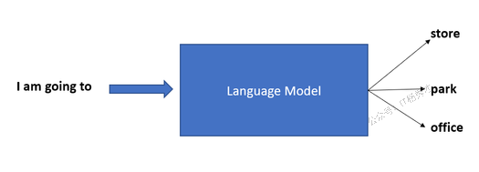
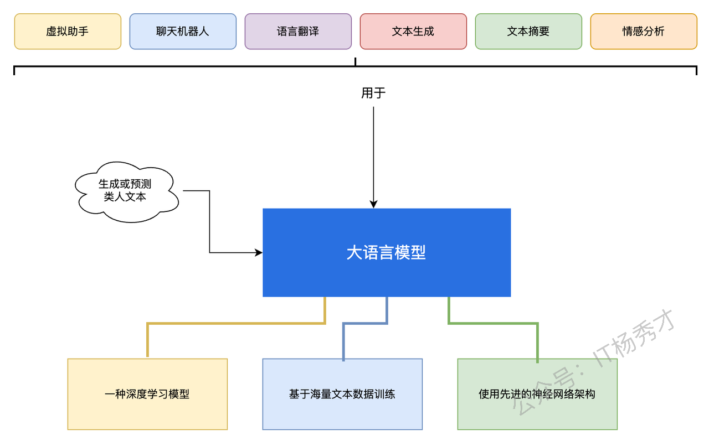

# 1. 大语言模型在生成式 AI 中扮演什么角色？

以 ChatGPT 为例来清晰说明。在 ChatGPT 众多能力中，有一项是理解人类语言（以通俗英语提出的问题），并能生成人类可理解的回答。ChatGPT 这种与人类交流的能力，正是由大语言模型驱动的。

换言之，我们可以说—— **任何需要生成类人文本的生成式 AI 系统，都离不开大语言模型。接下来我们用更通俗的话来进一步拆解！**

# 2. 什么是语言模型？

首先，我们需要理解什么是语言模型。语言模型可以用以下是哪个特点概括：

* 一种机器学习模型

* 运用多种统计和概率技术

* 预测句子或短语中给定词序列出现的概率

简而言之，语言模型旨在根据给定句子/短语的上下文，预测最适合填入句中空白处的下一个词语。

**让我们通过一个例子来更好地理解。**&#x5F53;我们使用手机上的消息应用时，它会在我们输入消息时预测下一个单词。例如，一旦我们输入 *“how（怎么）”，&#x20;*&#x624B;机可能会建议像 *“are（是）”或“is（是）”&#x20;*&#x8FD9;样的单词，因为它知道这些词在句子中经常出现在“how”之后。

类似地，如果我们输入 *“I am going to（我要去）”，&#x20;*&#x624B;机可能会预测像 *“store（商店）”、“park（公园）”、“office（办公室）”&#x20;*&#x6216; *“beach（海滩）”&#x20;*&#x8FD9;样的单词，因为这些是日常语言中“going”之后常见的词汇。

这种预测是基于我们目前输入的内容上下文，以及它通过分析大量文本学习到的模式。

# 3. 大型语言模型（LLM）

大型语言模型（LLM）是一种具备以下特征的语言模型：

* 属于机器学习模型的类别

* 通过海量文本数据集训练而成

* 并采用先进的神经网络架构

* 来生成或预测类人文本。

回到我们之前的例子，正是语言模型帮助 AI 工具预测句子中即将出现的词语。

下图总结了关于大型语言模型的重要知识点。

大型语言模型最独特且强大的特点在于其 **能够基于海量数据生成类人文本、进行内容总结与预测的能力。&#x20;**&#x4C;LMs 可以处理和分析大量文本数据，使其在文本生成、摘要、翻译和情感分析等语言处理任务中表现出色。

# 4. 自然语言处理（NLP）

自然语言处理是与 LLM 密切关联的重要概念。自然语言处理（NLP）是人工智能的一个子集，专注于通过自然语言（如英语）实现计算机与人类之间的交互。

* 自然语言处理（NLP）是指让计算机能够理解人类语言，并用相同语言与我们交流的过程。

* NLP 通过算法来解析、理解并生成人类语言。

* 它还能帮助计算机理解词语和句子背后的语境与情感。

让我们再举一个例子来更好地理解 NLP。比如虚拟助手 Siri，就是运用 NLP 技术来理解并响应我们的指令。假设你对着 Siri 说： *"明天早上 7 点设个闹钟。"*

* Siri 的自然语言处理算法会解析这句话，将其拆解为独立词汇并理解其含义、语法和上下文。

* 这套自然语言处理算法能准确识别用户意图——即设置闹钟的需求。

* 随后，Siri 会执行指令要求的操作，在你的设备上设置好次日早晨 7 点的闹钟。

* 最后，Siri 会用你的语言给出回应。

自然语言处理是支撑诸如响应人类（如 ChatGPT）、语言翻译、搜索引擎等任务的核心技术。

# 5. 自然语言处理（NLP）与大型语言模型（LLM）

**大型语言模型可视为自然语言处理模型的进化形态。&#x20;**&#x6362;言之，我们可以说大型语言模型就是专为自然语言处理任务设计的、专注于理解和生成类人文本的任何模型。尽管自然语言处理（NLP）包含多种处理人类语言的模型和技术，但 LLMs 专注于理解和生成类人文本。LLMs 专门设计用于根据上文预测单词或句子的概率，从而能够生成连贯且符合语境的文本。

从机器学习技术的角度来看，自然语言处理运用了从基于规则的方法到机器学习和深度学习等多种技术手段。另一方面，大语言模型主要运用深度学习技术来理解文本数据中的模式和上下文，从而预测序列中下一个词的概率。LLMs 是基于人工神经网络架构设计的。 **大多数大语言模型都采用基于 Transformer 的模型架构。**

# 6. 大语言模型与生成式人工智能有何关联？

大型语言模型（LLM）是 **生成式人工智能的一个子集&#x20;**。虽然生成式 AI 可以生成多种类型的内容，如文本、图像、视频、代码、音乐等，但 LLM 仅专注于生成文本。

# 7. 大型语言模型的应用场景与方式？

大型语言模型（LLMs）被应用于不同行业的各种人工智能场景中。以下是几个主要示例：

1. **虚拟助手**

LLMs 模型是驱动虚拟助手（如 Siri、Alexa 或 Google Assistant）的核心引擎。正是这些 LLM 模型分析人类指令并解读其含义，帮助虚拟助手代表用户执行多项操作。

* **聊天机器人**

ChatGPT 已不再是新名词。我们大多数人都使用过它或类似的人工智能对话聊天机器人。这些聊天机器人利用大语言模型来理解人类问题，并以模仿人类语言的方式作出回应。

* **语言翻译**

大型语言模型在谷歌翻译等 AI 工具的语言翻译中发挥着重要作用。这些模型通过海量多语言文本数据训练，能够捕捉不同语言的微妙差异、变体、上下文及复杂性。

当我们要求翻译工具翻译句子时，它会运用 LLM 算法分析源语言文本，并生成目标语言中准确且符合语境的翻译。通过双向考虑两种语言间词汇与短语的关系，LLMs 能够产出保留原文含义与语气的翻译。

* **文本生成**

如今大型语言模型已广泛应用于生成类人文本的诸多场景。这些模型高度精密，能根据给定提示或输入生成连贯且语境相关的文本。LLM 模型可用于创作故事、生成产品描述、撰写电子邮件等多种用途。

* **摘要生成**

大型语言模型在文档摘要生成方面非常实用。借助自然语言处理能力，LLM 模型能够将冗长的文档或文章浓缩为简洁的摘要，同时保留关键信息和主要观点。通过注意力机制和上下文理解等技术，LLMs 可以确定需要包含在摘要中的最突出信息，确保其抓住原文的精髓。&#x20;

* **情感分析**

情感分析是确定文本所表达的情绪或情感基调的过程。大型语言模型可用于分析海量文本数据，理解语言背景、细微差别和语气，并识别情感极性（积极、消极或中性）。

如今许多机构都利用大型语言模型来识别来自社交媒体帖子、产品评论、客户反馈、新闻文章等文本数据中的情感倾向。

8. **内容推荐**

Netflix、YouTube、亚马逊等平台正越来越多地采用大型语言模型（LLMs）进行内容推荐，为用户提供更个性化和相关的建议。这些模型能捕捉词语、短语和主题之间的关联，从而理解内容的意义和上下文。在内容推荐场景中，LLMs 会分析用户与内容的互动行为，例如阅读过的文章、购买过的商品或观看过的视频。基于这些数据，LLMs 能预测用户可能感兴趣的其他内容，并推荐相关选项。

# 8. 大型语言模型的一些典型实例

以下是部分使用大型语言模型的热门应用。

## 8.1 GPT（生成式预训练变换器）

生成式预训练变换器可能是目前最知名的大型语言模型，ChatGPT 正是基于该模型构建。2017 年 Transformer 架构问世后，OpenAI 于 2018 年发布了其首个基于 Transformer 的大型语言模型 GPT-1。该模型最初在 BookCorpus 数据集（包含 7000 余本自出版书籍）上进行训练。

此后，OpenAI 陆续推出了更先进的 GPT-2、GPT-3、GPT-3.5 和 GPT-4 版本。这些模型均采用 Transformer 架构。其中 GPT-4 是多模态模型，这意味着它既能处理文本输入，也能接收图像输入。

## 8.2 BERT（基于 Transformer 的双向编码器表示）

BERT 是谷歌于 2018 年推出的基于 Transformer 架构的大语言模型。该模型代表了大语言模型和自然语言处理领域的重大突破。作为双向 Transformer 模型，BERT 能够并行处理词语，相比传统循环神经网络（RNN）等序列模型具有更高效率。

## 8.3 LaMDA（对话应用语言模型）

LaMDA 是谷歌开发的对话式大语言模型，同样基于 Transformer 架构。随着 ChatGPT 的突然崛起，谷歌随后推出了名为"Bard"的对话式 AI 聊天机器人，其核心技术正是由 LaMDA 驱动。

随后，谷歌推出了 PaLM（Pathways 语言模型），作为 LaMDA 的继任者。2024 年，谷歌将 Bard 更名为"Gemini"。Gemini 由同名的大型语言模型（LLM）驱动，这款多模态大型语言模型是 LaMDA 和 PaLM 的继承者。

## 8.4 LLaMA（Meta AI 大型语言模型）

LLaMA（Meta AI 大型语言模型）是由 Meta AI 推出的一系列大型语言模型（LLMs）。LLaMA 基于 Transformer 架构，属于自回归语言模型。

# 9. 小结

大型语言模型已经从概念走向了实际应用，成为当今人工智能领域最重要的技术突破之一。从最初的词汇预测功能，到如今能够进行复杂对话、创作内容和分析情感的强大工具，LLMs正在重塑我们与技术交互的方式。无论是日常使用的虚拟助手，还是专业领域的内容生成和数据分析，大型语言模型都展现出了巨大的潜力和价值。随着技术的不断发展，我们有理由相信，大型语言模型将在未来发挥更加重要的作用，为人类社会带来更多创新和便利

