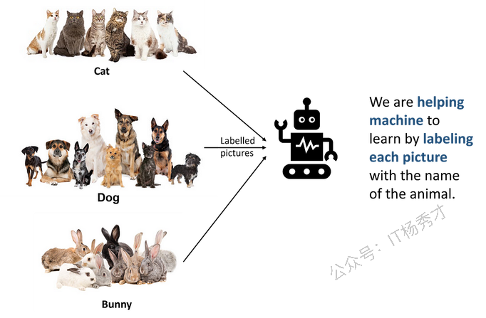

# 理解机器学习

## 1. 从小白视角看机器学习（ML）

在我们之前[小白的生成式AI基础手册(1)：人工智能导论](https://mp.weixin.qq.com/s/Nk0WlcWPryJ68oMRvZPjig) 一文中，在探讨人工智能时，我们曾讨论如何让机器人识别狗。现在设想**要让机器人能识别多种动物**。为此，我们将向它展示各种狗、猫、兔子等动物的图片，并**为每张图片标注对应的动物名称**。通过体型、颜色、体态、叫声等特征来训练机器人识别动物。

训练完成后，机器人就能识别这些我们教它认识的动物了。

并非所有狗都长得一样。但只要机器人看过足够多的狗图片， **它就能识别任何狗——即使这只狗与训练图片中的不完全相同**。我们需要给机器人展示大量狗的图片，它看得越多，识别能力就越强。

这就是**机器学习**—— ***通过提供大量示例图片（或其他信息）来教导机器人（或任何机器）。***&#x603B;结来说，机器学习是：

* **人工智能的一个子集**

* 它使得机器（或计算机）能够**从数据中学习**并**做出决策**。

## 2. 机器学习的类型

机器学习可以大致分为三种主要类型：

1. 监督学习

2. 无监督学习

3. 强化学习

每种类型服务于不同目的，并采用不同的数据学习方法。接下来我们详细看看所有这些类型。

## 3. 监督学习

让我们沿用之前让机器人识别动物的例子。**我们通过展示动物图片来训练机器人时，我们为每张图片标注了**动物名称。因此， **我们扮演了教师的角色**——先告诉它狗或猫长什么样，它才能进行识别。

在机器学习中，这被称为**监督学习。**&#x4E0B;图总结了监督学习的关键要点。

### 3.1 监督学习的现实案例

监督学习广泛应用于各种现实场景中，算法通过标记数据进行训练，从而做出预测或分类。以下是几个典型示例：

1. **电子邮件垃圾邮件过滤**

根据邮件内容特征、发件人信息及其他相关属性，将邮件分类为垃圾邮件或非垃圾邮件。

* **图像分类**

识别图像中的物体或模式，例如对动物进行分类、识别手写数字，或在自动驾驶汽车中检测物体。

* **面部识别**

基于面部特征识别和验证个人身份，应用于安全系统或设备解锁。

* **金融欺诈检测**

通过分析金融数据中的模式和异常，识别潜在的欺诈交易。

* **语音识别**

将口语转换为文本，如 Siri 或 Google 助手等语音助手中的应用。

## 4. 无监督学习

让我们用一个孩子上学的例子来理解这一点。当孩子们第一天走进教室时，会遇到许多同学。起初所有同学在他们眼中都一样。但随着时间的推移，他们会自发地将同学分成不同群体：

* 他们发现某些同学非常友善，想和这些人做朋友。

* 他们觉得有些同学粗鲁或烦人，想要避开这些人。

* 他们注意到有些同学运动能力出色，希望能和这些人分在同一队伍。

* 以此类推……

**当孩子们给同学分类时，没人教他们怎么做。他们完全靠自己完成了这件事**。——这就是无监督学习的工作原理。让我们举个的机器学习例子。想象我们给机器人看了大量狗、猫、兔子等动物的图片 **（没有任何标签）**，然后告诉它—— "我不会告诉你哪个是哪个。自己去探索发现吧"。

机器人开始观察这些动物，注意它们的毛发、体型和动作特征。虽然还不知道这些动物的名称，但它正尝试自主发现规律和差异。经过探索后，机器人可能会注意到：

* 有些动物长着长耳朵（兔子）

* 有些动物拥有柔软的皮毛和尾巴（猫）

* 有些动物会摇尾巴（狗）

**它能在你不直接告知的情况下自行识别出这些类别。**

最终，这个机器人**可能不知道这些动物的名称**，但它能判断出 **"这些动物在某些方面相似，而在其他方面则不同。"——**&#x8FD9;就是**无监督学习。**

下图总结了无监督学习的关键要点。

### 4.1 无监督学习的现实案例

无监督学习被广泛应用于现实场景中，当数据未被标记时，算法需要自行发现数据中的模式、结构或关联关系。以下是几个典型应用场景：

1. **客户分群聚类**

企业运用无监督学习（特别是 k 均值等聚类算法），根据客户的购买行为进行细分。这有助于实现精准营销和个性化服务。

* **网络安全中的异常检测**

无监督学习被用于识别网络流量中的异常模式或行为。任何偏离正常行为的活动都会被标记为潜在安全威胁。

* **推荐系统**

推荐系统采用无监督学习。通过识别用户行为模式，这些系统能够推荐用户可能喜欢的产品、电影或内容。

## 5. 强化学习

想象一下教狗狗新把戏—— **当它做对动作时就奖励零食**，做错时就不给。久而久之，狗狗就**学会通过表演把戏来获得更多零食**。同理，强化学习的原理是：

* 训练计算机做出决策

* 通过奖励正确选择并惩罚错误行为

* 就像用零食训练小狗学习技能那样

在强化学习中，存在一个与环境交互的智能体（例如机器人或计算机程序）。以教计算机程序下棋为例，比如国际象棋。

* 这种情况下，计算机程序是智能体，而象棋游戏则是环境。

* 计算机程序可以在游戏中采取不同的行动，例如移动一枚棋子。

* 每次行动后，程序会根据游戏结果获得反馈（奖励或惩罚）。

* 如果程序赢得比赛，它将获得正向奖励。

* 如果游戏失败，它会收到负面奖励，即"惩罚"。

* 通过反复试错，程序会学习哪些动作能带来最佳奖励，从而找出赢得游戏的最佳动作序列。

强化学习的强大之处在于 **它能让机器从自身经验中学习**，并在复杂多变的环境中做出决策——这类似于我们在现实世界中通过试错进行学习的方式。

下图总结了强化学习的关键要点。

### 5.1 强化学习的现实案例

游戏博弈是强化学习的主要应用场景之一。由 DeepMind 开发的 **AlphaGo**&#x7A0B;序，通过强化学习实现了超人水平的围棋对弈能力。它击败了世界冠军，展现了强化学习在掌握复杂棋类游戏方面的强大潜力。

另一个典型案例是 **自动驾驶汽车**。强化学习被用于自动驾驶系统的开发，智能体通过持续从仿真环境和真实路况中学习，掌握交通导航、路口决策及应对各种驾驶场景的能力。

强化学习还应用于 **算法交易领域进行金融工具的买卖决策**。智能体基于历史市场数据和实时行情，学习最优的交易策略。

## 总结

机器学习是人工智能的一个分支，它让计算机能够通过示例和经验进行学习。我们无需显式编程，而是让机器从数据中自行学习并理解事物。无论是识别我们喜爱的歌曲、理解语音指令，还是协助医生分析医学影像，机器学习早已融入我们的日常生活。

