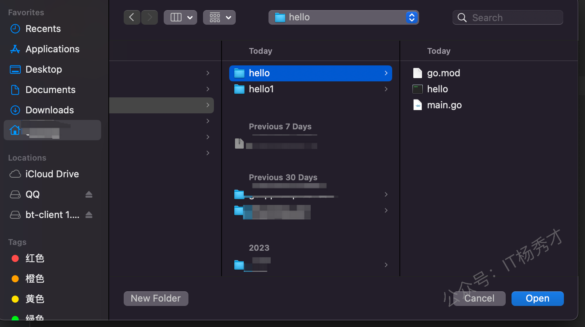
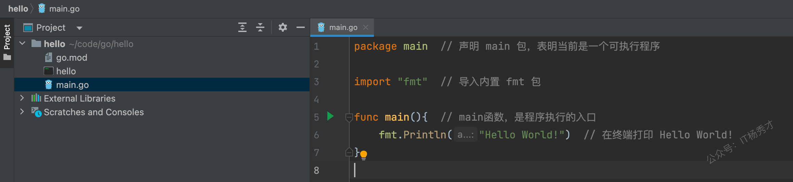

---
tags:
   - Go
   - 环境搭建
---
# 环境搭建
Golang是云原生时代的宠儿，它最大的优点在于简单有效，简单在于上手迅速、代码规范、部署方便；有效在于它能很容易写出高并发的代码，处理能力强。
Golang能适用于web后台、数据库、云原生、区块链等大多数场景，大厂与其相关的招聘岗位也在逐年增加，因此，学习Golang这样相对较新、发展前景很好的语言，我们是可以实现弯道超车的。
本文环境安装部分，每个步骤都贴出了执行命令，希望小伙伴们读完此文，自己动手安装Go环境，实现快速入门，用Golang开启新的旅程。
下面我们就从最基础的环境部署开始，开启我们的Golang之旅吧~

## 1. 安装Golang
Go语言可以运行在Linux，Windows以及Mac系统上，对于开发者而言，一般是在本地Windows或者Mac上开发，然后将Go服务部署到Linux上去运行，所以在安装上来说的话，会这三个平台的安装就可以了。
下面将分别介绍这三个平台的安装方式。Go语言官方安装包地址：[https://golang.org/dl/](https://golang.org/dl/)大家可以上去选择自己需要的版本，通常来说选择次新版本即可，下面的演示选择的是go1.22.10版本


打开[https://go.dev/doc/install](https://go.dev/doc/install)可以看到各个系统下的安装介绍


### 1.1 Linux 安装方式
1. 下载安装包下载安装包到当前目录，这里以go1.22.10为例
```shell
wget https://go.dev/dl/go1.22.10.linux-arm64.tar.gz
```
2. 将go压缩包解压到指定目录,Linux环境下一般解压到/usr/local目录下
```shell
rm -rf /usr/local/go && tar -C /usr/local -xzf go1.16.2.linux-amd64.tar.gz
```
3. 设置环境变量PATH
   Linux下有两个文件可以配置环境变量，/etc/profile文件配置所有用户生效；$HOME/.profile对当前用户生效，为了简单起见，选择/etc/profile配置就可以了。
   当然如果
5. 根据自己的情况自行选择一个文件打开，添加如下两行代码，保存退出。
```shell
export PATH=$PATH:/usr/local/go/bin
```
4. 检查Go版本
```shell
go version
```
检查Go的版本，如果执行上述命令能够成功显示go的版本，则说明Go环境安装成功

### 1.2 Mac安装
Mac系统下的安装就很简单了，直接选择对应版本的安装包，图形界面下直接点击下一步可视化安装就好了


### 1.3 Windows安装
Windows系统的安装和Mac一样简单，也是直接点击安装包进入安装界面，图形话安装即可。


### 1.4 GOPROXY设置
Go1.14版本之后，推荐使用go mod模式来管理依赖，GOPROXY是Go语言官方提供的一种通过中间代理商来为用户提供依赖包下载服务的方式，它的值是一个以英文逗号“,”分割的 Go module proxy 列表。
它的默认值是：https://proxy.golang.org,direct，但是在国内可能会存在下载慢或者无法访问的情况，所以我们需要换一个PROXY，这里推荐使用https://goproxy.cn。执行以下命令更改GOPROXY设置即可
```
 go env -w GOPROXY=https://goproxy.cn,direct
```
注意, 后面有两个选项：direce和off。设置为 “off” 表示禁止Go在后续操作中使用任何Go module proxy，“direct” 为特殊指示符，表示Go模块下载的备选方案或回退选项，这里配置了direct后，
当下载依赖包时，首先从代理站点https://proxy.golang.org处进行下载，如果下载失败，则会回退到direct，直接从代码源下载，所以一般最后逗号后都会加上direct。
设置完GOPROXY之后，通过`go env`命令查看


### 1.5 GOPRIVATE设置
前面的GOPROXY设置后，G程序拉取依赖都会走代理，有时候我们的程序开发需要拉取一些内部的私有依赖，比如公司或者小组内开发的公共组件，这些依赖没有对外公开，在外部的代理站点拉取不到。
我们希望可以不走代理，直接下载。所以就需要配置GOPRIVATE环境变量。比如配置了以下GOPRIVATE
```
go env -w GOPRIVATE="*.gitee.cn"
```
那么Go程序在拉取gitee.cn上的依赖包，就会绕过代理直接下载，不会去GOPROXY中的代理站点下载；而其他的依赖包则会去GOPROXY中的代理站点下载.
设置完GOPROXY之后，通过`go env`命令查看


## 2. Go开发编辑器
### 2.1 Goland安装

Go语言推荐使用GoLand在本地进行开发，Goland是Jetbrains家族出品，有强大的Plugin，代码跳转，自动格式化，错误检测等用起来都十分方便

GoLand下载官网地址: https://www.jetbrains.com/go/download/， 根据操作系统选择对应包下载安装即可


### 2.2 Goland设置
#### 2.2.1 设置GOROOT
在安装完Goland后，首先需要设置GOROOT，用来编译运行Go代码。在Goland的settings配置起来十分方便。打开Settings → Go → GOROOT设置即可


#### 2.2.1 设置Go Modules
Go1.14版本之后，Go项目推荐使用Go Modules来管理依赖，在Goland中要使用Go Modules，同样要把Go Modules设置开启，打开Settings → Go → Go Moudles，勾选打开即可


## 3. 第一个Go程序
按照惯例，环境搭建好之后，我们就来创建第一个Go程序：Hello World
### 3.1 命令行方式
1. 首先创建一个空的文件夹hello
```
mkdir hello
```
2. 进入到hello文件夹，将该文件夹初始化为一个go module项目
```
cd hello
go mod init hello
```
执行完上述命令后，可以看到在hello文件夹下多出了一个go.mod文件，内容如下


可以查看下go.mod的文件内容，第一行表示module名为hello，go的版本为1.20


3. 在hello文件夹创建一个main.go文件，文件内容如下：
```go
package main  // 声明 main 包，表明当前是一个可执行程序

import "fmt"  // 导入内置 fmt 包

func main(){  // main函数，是程序执行的入口
	fmt.Println("Hello World!")  // 在终端打印 Hello World!
}
```

4. 在当前目录下执行以下命令，直接运行程序
```
go run main.go
```
可以看到终端输出hello world。


5. 也可以直接编译工程，然后在执行。在当前hello目录下执行
```
go build
```
执行完会成成一个二进制的可执行文件hello,然后执行以下命令直接运行
```
./hello
```
同样可以看到终端输出hello world。


### 3.1 Goland方式
#### 3.1.1 新建Go项目
打开Goland应用，或者事在已经打开的Goland的最上方选择File → New → Project， 继而弹出New Project设置向导：


点击create创建完成，注意使用Goland创建完项目后，项目下自动就有go.mod文件


接着新建hello1.go文件，代码如下
```go
package main

import "fmt" // 导入内置 fmt 包

func main() { // main函数，是程序执行的入口
	fmt.Println("Hello World!") // 在终端打印 Hello World!
}
```
然后直接点击运行，即可看到运行结果，打印出Hello World。


#### 3.1.2 导入已有Go项目
如果你本地已有Go项目代码，只需在主菜单选择File → Open，打开你的项目目录即可。比如我们打开刚刚命令行方式常见的hello工程



同样可以直接运行，打印出Hello World




