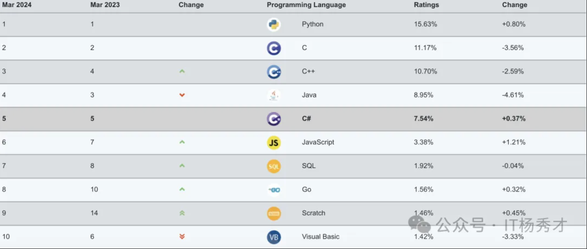
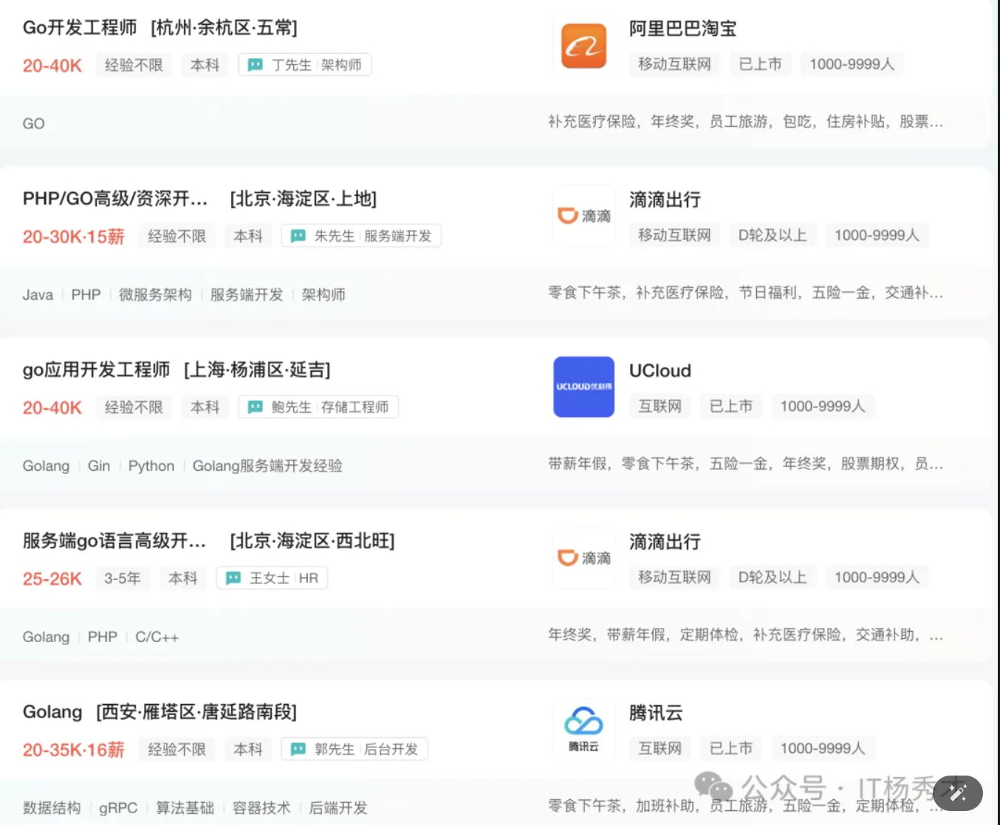
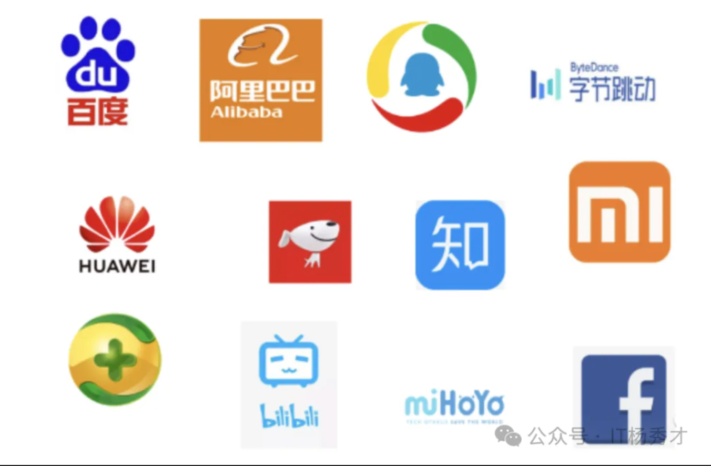
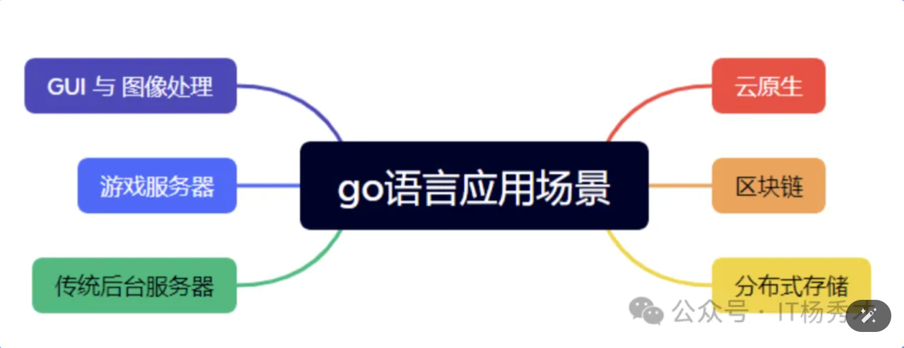

# Go语言前景

当下BAT大厂正在把Go作为新项目开发的首选语言，今天给大家带来一个系统的go语言相关知识梳理，也希望能够在未来和大家一起学习和探讨。

思考再三，为什么是go呢？

其实，选择go语言，也是顺应当下形势了，作为程序员的我们，在选择吃饭的家伙上，当然也要顺势而为嘛。下面就跟大家一起分析go语言到底有啥优势，未来趋势又如何？

## 市场行情

首先来看一下go语言的市场行情，因为谈钱，永不过时。截止到2023年5月Tiobe编程语言排行榜

go语言是排在第12位，从排名上看是远不如传统的几大热门语言比如python，c，c++还有java。那为什么却又说go预言是趋势呢？  
排名上不如上述几大热门语言，这正说明了当前go语言开发者比较少，不像java开发者在后端市场的白热化竞争，现在go语言开发者的竞争没有那么激烈。  
接下来看一下go语言岗位在市场上的需求

可以看到，go语言招聘市场的需求也是很大，大小中厂其实都有一定的岗位需求。  
当然不得不承认，现在整个后端市场可以说还是java的天下，在大中小公司都占据着绝对地位，像阿里， 京东，美团等，而且银行也基本全是java的技术栈。既然行情如此，为什么还说go语言有不错的市场前景呢？

java岗位多归多，但是求职者也多，可以说是人满为患。说java是计算机求职领域最卷的应该没有人会反对，从几年前的了解jvm特性，会点基本的多线程特性以及调优就能取得不错的offer，到如今各种java全家桶框架原理深入掌握，没有最卷，只有更卷。随着求职者的增多，对学历的要求也是逐年攀升，今年拿到java中大厂岗位的一般都得是985/211起步了，而且随着互联网行整体行情的相对固定，往后只会越来越难。

而go作为编程界的新秀，go语言虽说不如java岗位那么多，但是岗位数量其实是比c++多了，像大厂字节跳动所有后端语言都是go，腾讯除了ieg和wxg还用的c++技术栈以外，其他所有bg都转向了go语言，而且这两个bg目前正在往go方向转型。像中厂比如b站也是go语言的技术栈，百度目前也是由phh在向go转型，向新型的互联网公司，比如shopee，其后端技术栈也是go，可见go语言未来的在后端市场上发展趋势。来看看哪些公司正在使用go呢？

对于应届生而言，现阶段拥抱go语言可以说是再合适不过了，为啥这么说呢？go语言作为一门新型的开发语言，在大学里学生接触的可以说很少，除非是自己有这种自驱性。因为大学所教的内容跟社会需求往往是脱节的，大学所学的东西往往很难满足真实岗位的需要，一般大学，即便是计算机专业现在所开的也都还是两门主流语言c++和java。c++其实现在后台岗位很有限了，一般只有做游戏，量化开发或者系统开发需要，岗位相比于后端少了很多。java岗位竞争又大，而此时选择go语言其实是一个不错的选择。

## 应用场景
说完go语言的整体市场行情，紧接着我们来看一下go语言具体的应用场景，这么多大小公司都在go语言上有所应用，那它究竟可以应用在哪些场景中呢？

首先在传统后端这块，go语言是天然支持的，因为go语言的协程机制在处理高并发上有着天然的优势，所以在后端领域go语言必有一席之地。除了后端场景，近年来大火的云原生，容器技术也是go语言的用武之地，现在几乎所有的公司都是在做服务上云的，这里就少不了需要go语言的人才。还有近年来炒得很火爆的web3，区块链，go语言也是再合适不过。

## 语言优势
go作为一门新型语言，能够脱颖而出，有这么多的应用场景，且大小中厂都在积极拥抱go语言，自然少不了它作为语言本身的巨大优势。

### 语法简洁
语法简单可以说是go语言最直接的一个优势了，Go 语言被称为“互联网时代的C语言”，从这个称呼就可以看出其语法是真的简单，相比于c++难度可以说是天壤之别，不像c++，要想真的掌握起码至少得半年甚至几年的学习周期。而go的学习路线就会平滑很多，学习周期也短，最多几个月就能完全掌握

### 代码统一
代码风格的统一可以说是go另一个天然优势，由于其简洁的语法，并且Go 语言提供了一套专门的格式化工具——go fmt，这就使得对于不同的开发者提交的代码风格都是统一的格式，加强了可读性

### 效率高
这里的效率既指开发效率，也指运行效率。go语言不仅有c语言级别的编译，运行效率，容易部署，同时也兼顾了python级别的开发效率，这使得在做业务开发的时候事半功倍，也是成为不少公司首选的主要原因

## 学习路线
整体来说，go语言简单易上手，学习起来路线比较平滑，学习的成本比起c++和java来说也是要低不少的。

首先，了解Golang有哪些知识点，对整理路线有个把握，下面先通过一个golang学习指引图看一下学习go需要掌握哪些知识

根据这个golang学习路线图，从右上角开始顺时针45度走一圈，差不多就对go语言有了一个比较全面的学习，而这整个学习周期也不会太久，即便是0基础，两到三个月也基本能够走完这个学习路线，并且对go也会有一个相对比较深入的了解了

以上只是对go语言本身以及go在传统后台方面的学习，学完这些，下一步就可以接着学习容器相关的知识了，毕竟随着docker，k8s的兴起，现在正处在云时代，万物皆可上云，掌握一些云原生相关的知识，在这个时代也是不可获取的。

## 小结
随着云时代的到来，Golang的地位将会越来越高，越来越成为程序员必会的编程语言之一，在未来，golang成为和java分庭抗礼的大众化编程语言也是大势所趋。所以，选择go语言，学习go语言实在是太有必要了，我也将会在后面和大家一起学习和探索go语言相关知识。

