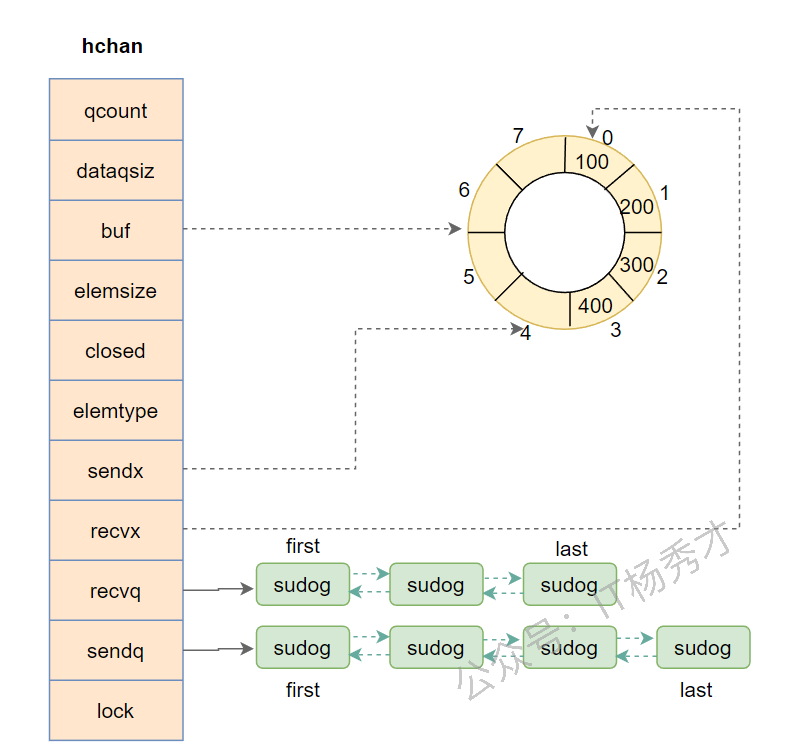
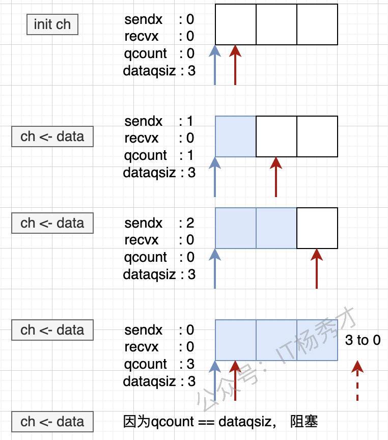
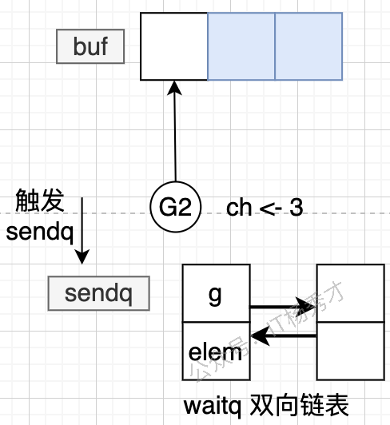

---
tags:
  - Go
  - golang
  - go原理深入
  - context原理
---

# channel原理

## channel是什么

顾名思义，channel就是一个通信管道，作用是用来在goroutine中传递信息，使不同的goroutine能够通信。

go语言遵循CSP并发编程模式，提倡通过通信来实现内存共享，而不提倡通过共享内存来实现通信，而channel就是这种并发编程思想的实现。正是由于channel的存在，才使go语言的并发编程变得简单快捷。并且，在go语言中，通过channel与select的搭配使用以及调度器对goroutine的调度，可以很高效的实现协程的阻塞和唤醒以及多路复用。

### channel的分类

channel 又分为两类：有缓冲 channel 和无缓冲 channel

其创建方式如下：

```go
// 创建一个无缓冲的int类型的channel
ch1 := make(chan int)
// 创建一个缓冲区长度为3的int类型的channel
ch2 := make(chan int, 3)
```

无缓冲 channel在读写的时候是阻塞的，即向channel写入一条数据，如果这条数据还没被消费掉，再写入就会阻塞。读取也是一样，当读取的channel没有消息往里面发送的时候，这时读取这个channel也会阻塞。

有缓冲 channel 在读写的时候是非阻塞的。当然这个非阻塞得满足一定的条件。当向一个channel写入消息之后，即使还没被消费，只要队列没满（条件），就可继续写入，非阻塞。读取也一样，当从一个channel读取数据，即使没有生产者往channel发送消息，只要channel里面有数据，就可以继续读取消息消费，不会阻塞

关于channel的具体操作在golang并发编程实战中已经介绍，这里就不重复讲解了。

## channel的数据结构

channel用make函数创建初始化的时候会在堆上分配一个runtime.hchan类型的数据结构，并返回指针指向堆上这块hchan内存区域，所以channel是一个引用类型

为什么要在堆上创建这个hchan结构而不是栈上？我是这样理解的，channel是用来实现goroutine间通信的，其生命周期和作用域几乎都不太可能仅仅局限于某个具体的函数内，所以在设计的时候就直接在堆上创建。

runtime.hchan的类型定义在源码 src/runtime/chan.go中：

```go
type hchan struct {
   qcount   uint           // 循环队列中的数据总数
   dataqsiz uint           // 循环队列大小
   buf      unsafe.Pointer // 指向循环队列的指针
   elemsize uint16         // 循环队列中的每个元素的大小
   closed   uint32         // 标记位，标记channel是否关闭
   elemtype *_type         // 循环队列中的元素类型
   sendx    uint           // 已发送元素在循环队列中的索引位置
   recvx    uint           // 已接收元素在循环队列中的索引位置
   recvq    waitq          // 等待从channel接收消息的sudog队列
   sendq    waitq          // 等待向channel写入消息的sudog队列
   lock mutex              // 互斥锁，对channel的数据读写操作加锁，保证并发安全
}
```

hchan 中的sendq 和 recvq 字段存储了当前 channel 由于缓冲区空间(buf)不足而阻塞的要读取或者写入当前channel的goroutine 列表，这些等待队列使用双向链表 waitq 表示，waitq是对一个sudog链表进行封装之后的一个结构，其字段为这个sudog队列的首位指针，链表中所有的元素都是 sudog 结构，看一下waitq这个数据类型

```go
type waitq struct {
    first *sudog              // sudog队列的队头指针
    last  *sudog              // sudog队列的队尾指针
}
```

su'do

我们知道channel是用于两个不同的goroutine之间传递消息的，但是这里的recvq和sendq确是sudog列表，sudog和goroutine之间是不是又某种关系呢？goroutine其实是绑定正在sudog这个结构上，所以recvq可以简单理解为读操作阻塞在 channel 的 goroutine 列表，sendq 是写操作阻塞在 channel 的 goroutine 列表

下面看一下sudog结构：

```go
type sudog struct {
   g *g                  // 绑定的goroutine
   next *sudog           // 指向sudog链表中的下一个节点
   prev *sudog           // 指向sudog链表中的下前一个节点
   elem unsafe.Pointer   // 数据对象
   acquiretime int64     
   releasetime int64
   ticket      uint32
   isSelect bool
   success bool
   parent   *sudog // semaRoot binary tree
   waitlink *sudog // g.waiting list or semaRoot
   waittail *sudog // semaRoot
   c        *hchan // channel
}
```

这里着关注下elem字段，当向channel发送数据时，elem代表将要保存进channel的元素，当从channel读取数据时，elem代表从channel接受的元素

channel的底层结构图：



在这个例子中，channel的长度buf为8，元素个数为4，其中有四个元素100，200，300，400。可以发送的索引sendx为4，可以接受的索引为recvq为0

## channel操作

### channel初始化

在程序中我们通过make函数来初始化一个channel，而在运行时其实是调用的makechan函数来完成初始化工作

其源码位于src/runtime/chan.go中：

```go
func makechan(t *chantype, size int) *hchan {
   elem := t.elem
   if elem.size >= 1<<16 {
      throw("makechan: invalid channel element type")
   }
   if hchanSize%maxAlign != 0 || elem.align > maxAlign {
      throw("makechan: bad alignment")
   }

   mem, overflow := math.MulUintptr(elem.size, uintptr(size))
   // 如果内存超了，或者分配的内存大于channel最大分配内存，或者分配的size小于0，直接Panic
   if overflow || mem > maxAlloc-hchanSize || size < 0 {
      panic(plainError("makechan: size out of range"))
   }

   var c *hchan
   switch {
   case mem == 0:
      // 没有缓冲区buf，只分配hchan这个结构的内存，不分配buf的内存
      c = (*hchan)(mallocgc(hchanSize, nil, true))
      // Race detector uses this location for synchronization.
      c.buf = c.raceaddr()
   case elem.ptrdata == 0:    // 有缓冲区buf，元素类型不含指针,为当前的 hchan结构和buf数组分配一块连续的内存空间
      c = (*hchan)(mallocgc(hchanSize+mem, nil, true))
      c.buf = add(unsafe.Pointer(c), hchanSize)
   default:
      // 有缓冲区，且元素包含指针类型，hchan结构和buf数组各自分配内存，分两次分配内存
      c = new(hchan)
      c.buf = mallocgc(mem, elem, true)
   }

   c.elemsize = uint16(elem.size)
   c.elemtype = elem
   c.dataqsiz = uint(size)
   lockInit(&c.lock, lockRankHchan)

   if debugChan {
      print("makechan: chan=", c, "; elemsize=", elem.size, "; dataqsiz=", size, "\n")
   }
   return c
}
```

makechan函数有两个参数`t *chantype, size int`，第一个参数代表要创建的channel的类型，即通道可以传递的消息类型，第二个参数代表通道中元素的大小。

从源码可以看出创建的主要逻辑位于switch逻辑中，可以看出为channel开辟内存分为三种情况：

1. **没有缓冲区buf，即创建无缓冲区的channel，只分配hchan本身结构体大小的内存**

2. **有缓冲区buf， 但元素类型不含指针，一次为当前的 hchan结构和buf数组分配一块连续的内存空间**

3. **有缓冲区，且元素包含指针类型，分两次分配内存，先为hchan结构和分配内存，再为buf数组元素分配内存**

针对channel的不同状态，向channel写入结果如下：

| **操作**        | **channel状态**  | **结果**    |
| ------------- | -------------- | --------- |
| **发送(write)** | **nil**        | **阻塞**    |
| **发送(write)** | **有缓冲区，缓冲区未满** | **成功写入**  |
| **发送(write)** | **无缓冲区或者缓冲区满** | **阻塞**    |
| **发送(write)** | **关闭**         | **panic** |

### channel写入

往channel写入数据在编码上很简单

```go
ch := make(chan, int)
ch <- 1    // 往管道里写入1
```

在运行时其实是调用了`runtime.chansend`函数，源码如下：

```go
func chansend(c *hchan, ep unsafe.Pointer, block bool, callerpc uintptr) bool {
   if c == nil {    // channel=nil，当前goroutine会被挂起
      if !block {
         return false
      }
      gopark(nil, nil, waitReasonChanSendNilChan, traceEvGoStop, 2)
      throw("unreachable")
   }

   if debugChan {
      print("chansend: chan=", c, "\n")
   }

   if raceenabled {
      racereadpc(c.raceaddr(), callerpc, abi.FuncPCABIInternal(chansend))
   }
   // 非阻塞，channel未关闭且channel是非缓冲型，并且等待接收队列为空；或者缓冲型，并且循环数组已经满了
   if !block && c.closed == 0 && full(c) {
      return false
   }

   var t0 int64
   if blockprofilerate > 0 {
      t0 = cputicks()
   }
   // 加锁，控制并发
   lock(&c.lock)
   // 管道已经关闭，向关闭的channel发送数据，直接panic
   if c.closed != 0 {
      unlock(&c.lock)
      panic(plainError("send on closed channel"))
   }
   // 接收队列非空，直接操作两个goroutine
   // 什么意思？ 就是当前 channel 有正在阻塞等待的接收方,就是之将数据由一个goroutine发往另一个goroutine
   // 直接将待发送数据直接copy到接收处
   // 直接从一个用一个goroutine操作另一个goroutine的栈
   if sg := c.recvq.dequeue(); sg != nil {
      // Found a waiting receiver. We pass the value we want to send
      // directly to the receiver, bypassing the channel buffer (if any).
      send(c, sg, ep, func() { unlock(&c.lock) }, 3)
      return true
   }
   // 如果等待队列为空，并且缓冲区未满，channel必然有缓冲区
   if c.qcount < c.dataqsiz {
      // Space is available in the channel buffer. Enqueue the element to send.
      qp := chanbuf(c, c.sendx)    // 将元素放在sendx处
      if raceenabled {
         racenotify(c, c.sendx, nil)
      }
      typedmemmove(c.elemtype, qp, ep)
      c.sendx++                    // sendx加1  
      if c.sendx == c.dataqsiz {
         c.sendx = 0
      }
      c.qcount++                    // channel总量加1
      unlock(&c.lock)
      return true
   }
    // 走到这里，说明上述情况为命中，channel已经满了，如果是非阻塞的直接返回，否则需要调用gopack将这个goroutine挂起，等待被唤醒
   if !block {
      unlock(&c.lock)
      return false
   }

   gp := getg()     // 获取发送数据的goroutine
   mysg := acquireSudog()  // 获取sudog 结构
   mysg.releasetime = 0
   if t0 != 0 {
      mysg.releasetime = -1
   }

   mysg.elem = ep  // 设置待发送数据的内存地址
   mysg.waitlink = nil
   mysg.g = gp   // 绑定发送goroutine
   mysg.isSelect = false
   mysg.c = c
   gp.waiting = mysg  // 设置到发送goroutine的waiting上
   gp.param = nil
   c.sendq.enqueue(mysg) //  将mysg这个sudog加入到当前channel的发送等待队列，等待被唤醒
 
   atomic.Store8(&gp.parkingOnChan, 1)
   gopark(chanparkcommit, unsafe.Pointer(&c.lock), waitReasonChanSend, traceEvGoBlockSend, 2)

   KeepAlive(ep)

   // someone woke us up.
   if mysg != gp.waiting {
      throw("G waiting list is corrupted")
   }
   gp.waiting = nil
   gp.activeStackChans = false
   closed := !mysg.success
   gp.param = nil
   if mysg.releasetime > 0 {
      blockevent(mysg.releasetime-t0, 2)
   }
   mysg.c = nil
   releaseSudog(mysg)
   if closed {
      if c.closed == 0 {
         throw("chansend: spurious wakeup")
      }
      panic(plainError("send on closed channel"))
   }
   return true
}
```

从源码分析可以看出，往channel发送数据分为三种方式：**直接发送，缓冲发送还有阻塞发送**

**直接发送：**&##x5F53;前 channel 有正在阻塞等待接收数据的goroutine，那么直接发送数据，直接从一个goroutine操作另一个goroutine的栈，将待发送数据直接copy到接收处

**缓冲发送：**&##x4F1A;判定缓冲区的剩余空间，如果有剩余空间，则将数据拷贝到channel&##x4E2D;**，**&##x73;endx 索引自行自增 1(若sendx 等于 dataqsiz ，则将sendx 置0，原因是buf是一个环形数组)，自增完成之后，队列总数自增 1

**阻塞发送：**&##x5F53;前 channel 没有正在阻塞等待接收数据的goroutine并且是channel的缓冲区满了之后，发送goroutine就就会阻塞，首先获取`sudog` ，将发松平的goroutine绑定到sudog上，加入到当前channel的发送阻塞队列，调用 `gopark` 方法挂起当前 goroutine，等待被唤醒

直接看释义可能比较抽象，下面我们通过我们结合发送流程图，来看看一下channel底层是怎么运作的：



我们先从发送视角来看，如果阻塞会发生什么？

当 g1 发送一个消息导致阻塞时，g1 会在状态切换前创建一个 sudog 的结构（等待发送的协程信息），然后加入 sendq 对应的这个双向链表。

然后会将 g1 设置为 waiting 状态，然后解除 g1 和 m 的联系，等待被唤醒。

这里m表示内核线程，goroutine只有绑定到内核线程才能被执行，这里解绑m就会让出内核线程。调度模型相关后再后面做详细介绍


那么什么时候再激活呢？需要等到有其它协程消费这个 channel，我们以 g2 为例子，即 g2 通过channel 操作，从 buf 中获得一个元素。



这时候会查看 sendq 的情况，将第一个节点的 elem 数据直接放入 buf。然后将处于等待中的 g1 变为可执行状态，等待下次调度。做完这些之后，会将 g1 的等待信息从 sendq 移除。


这是有缓冲管道的例子，如果是无缓冲管道，elem 会直接写入到 g2 的内存再激活g1，流程是一致的

### channel读取

从channel读取数据的编码形式如下

```go
ch := make(chan, int)
v := <- ch       //  直接读取
v, ok <- ch      //  ok判断读取的v是否有效
```

上述两种读取方式在运行时最后都是调用的`chanrecv`函数做数据接收，下面分析一下`chanrecv`源码：

```go
func chanrecv(c *hchan, ep unsafe.Pointer, block bool) (selected, received bool) {
   if debugChan {
      print("chanrecv: chan=", c, "\n")
   }
   // channel是nil
   if c == nil {
    // 如果是非阻塞模式，直接返回false，false
      if !block {
         return
      }
      // 如果是阻塞模式，调用goprak挂起goroutine，等待被唤醒
      gopark(nil, nil, waitReasonChanReceiveNilChan, traceEvGoStop, 2)
      throw("unreachable")
   }

   // 在非阻塞模式下
   // 如果是非缓冲型channel并且当前channel的等待发送链表为空或者是缓冲型channel并且buf中没有数据
   if !block && empty(c) {
       //  如果chan没有关闭，则返回 false, false
      if atomic.Load(&c.closed) == 0 {
         return
      }
      // 如果channel关闭了，双重检查，看channel是不是无缓冲chan或者是chan中没有数据，如果是则返回 true, false
      if empty(c) {
         if raceenabled {
            raceacquire(c.raceaddr())
         }
         // 清除ep指针中的数据并立刻返回true，false
         if ep != nil {
            typedmemclr(c.elemtype, ep)
         }
         return true, false
      }
   }

   var t0 int64
   if blockprofilerate > 0 {
      t0 = cputicks()
   }

   lock(&c.lock)
   // 如果channel已经关闭，并且chan中没有数据，返回 (true,false)
   if c.closed != 0 && c.qcount == 0 {
      if raceenabled {
         raceacquire(c.raceaddr())
      }
      unlock(&c.lock)
      // // 清除ep指针中的数据并立刻返回true，false
      if ep != nil {
         typedmemclr(c.elemtype, ep)
      }
      return true, false
   }
   // 优先从发送队列中取数据，如果有等待发送数据的groutine,直接从发送数据的goroutine中取出数据
   if sg := c.sendq.dequeue(); sg != nil {   
      // 从当前channel的发送队列对头取出goroutine，说明有等待发送的goroutine
      // 查看recv发现这里有两种情况
      // 1. 如果是非缓冲型channel，那么直接将数据从发送者的栈copy到接收者的栈接收区
      // 2. 如果是缓冲型channel，但是buf已经满了，首先将recvx处的元素拷贝到接收地址，然后将下一个写入元素拷贝到recvx，recvx和sendx都自增1
      // 拷贝完数据以后，唤醒发送队列中的的goroutine，等待调度器调度
      recv(c, sg, ep, func() { unlock(&c.lock) }, 3)
      return true, true
   }
    // 没有等待发送的队列，并且buf中有元素，从channel的缓冲区中接收数据
   if c.qcount > 0 {
      // 直接从缓冲区buf取出数据
      qp := chanbuf(c, c.recvx)
      if raceenabled {
         racenotify(c, c.recvx, nil)
      }
      // 将数据放到目标地址
      if ep != nil {
         typedmemmove(c.elemtype, ep, qp)
      }
      // 清空缓冲队列buf中对应的元素
      typedmemclr(c.elemtype, qp)
      c.recvx++  // 接收索引自增1
      if c.recvx == c.dataqsiz {
         c.recvx = 0
      }
      c.qcount--   // 队列元素数量减1
      unlock(&c.lock)
      return true, true
   }
   // 同步非阻塞模式，直接返回false，false
   if !block {
      unlock(&c.lock)
      return false, false
   }

   // 走到这里说明是阻塞模式
   // 没有任何数据可以获取到，阻塞住当前读goroutine，并加入channel的接收队列中
   gp := getg()
   mysg := acquireSudog()
   mysg.releasetime = 0
   if t0 != 0 {
      mysg.releasetime = -1
   }
   // No stack splits between assigning elem and enqueuing mysg
   // on gp.waiting where copystack can find it.
   mysg.elem = ep
   mysg.waitlink = nil
   gp.waiting = mysg
   mysg.g = gp
   mysg.isSelect = false
   mysg.c = c
   gp.param = nil
   c.recvq.enqueue(mysg)   // 加入到接收者队列

   atomic.Store8(&gp.parkingOnChan, 1)
   gopark(chanparkcommit, unsafe.Pointer(&c.lock), waitReasonChanReceive, traceEvGoBlockRecv, 2)

   if mysg != gp.waiting {
      throw("G waiting list is corrupted")
   }
   gp.waiting = nil
   gp.activeStackChans = false
   if mysg.releasetime > 0 {
      blockevent(mysg.releasetime-t0, 2)
   }
   success := mysg.success
   gp.param = nil
   mysg.c = nil
   releaseSudog(mysg)   // 阻塞的goroutine被唤醒
   return true, success
}
```

通过对源码的分析，总结一下从channel读取数据的流程：

1. **从一个空 Channel 接收数据，goroutine会被挂起，并阻塞等待**

2. **当前channel的发送者队列有goroutine等待发送数据时**

   1. **如果是无缓冲的 channel，当有接收者到来时，会直接从等待发送的goroutine拷贝数据到接收goroutine的接收区**

   2. **如果是有缓冲的 channel，此时缓冲区满，当有接收者到来时，会先从缓冲区把数据拷贝到接收者（注意，此时recvx和sendx相等，拷贝完之后，recvx和sendx都自增1），然后把等待的发送者的数据拷贝到缓冲区**

3. **当 channel 有缓冲区，并且缓冲区为空，且没有发送者时，这时 channel 阻塞，接收的goroutin会被挂起，等待被唤醒。**

4. **当 channel 有缓冲区，并且缓冲区有数据但未满，当有接收者来接收数据时，直接把缓冲区把数据拷贝到接收者**


消费流程如下图所示


针对channel的不同状态，从channel读取数据结果如下：

| **操作**       | **channel状态** | **结果**         |
| ------------ | ------------- | -------------- |
| **接收(read)** | **nil**       | **阻塞**         |
| **接收(read)** | **打开，有元素**    | **读取到正常值**     |
| **接收(read)** | **打开，没有元素**   | **阻塞**         |
| **接收(read)** | **关闭**        | **读取到默认值(空值)** |

### channel关闭

管道的关闭很简单

```go
ch := make(chan int)
close(ch)
```

在运行时，调用`runtime.closechan`函数对channel进行关闭，`closechan`函数源代码如下：

```go
func closechan(c *hchan) {
   // channel为nil，会直接panic
   if c == nil {
      panic(plainError("close of nil channel"))
   }
   // 加锁
   lock(&c.lock)
   // 如果channel已经被关闭，panic
   if c.closed != 0 {
      unlock(&c.lock)
      panic(plainError("close of closed channel"))
   }

   if raceenabled {
      callerpc := getcallerpc()
      racewritepc(c.raceaddr(), callerpc, abi.FuncPCABIInternal(closechan))
      racerelease(c.raceaddr())
   }

   c.closed = 1   // 设置关闭状态closed为1

  // 申明一个存放g的list，用于存放所有的goroutine
  // 目的是尽快释放锁，因为队列中可能还有数据需要处理，可能用到锁
   var glist gList

   // 唤醒所有等待从channel接收数据的goroutine
   for {
      sg := c.recvq.dequeue()
      if sg == nil {  // 接收者队列处理完，退出
         break
      }
      if sg.elem != nil {
         typedmemclr(c.elemtype, sg.elem)
         sg.elem = nil
      }
      if sg.releasetime != 0 {
         sg.releasetime = cputicks()
      }
      gp := sg.g
      gp.param = unsafe.Pointer(sg)
      sg.success = false
      if raceenabled {
         raceacquireg(gp, c.raceaddr())
      }
      glist.push(gp) // 将goroutine加入到临时队列
   }

   // 处理所有向channel中写入数据的goroutine，抛异常，报panic
   for {
      sg := c.sendq.dequeue()
      if sg == nil {  // 发送者队列处理完，退出
         break
      }
      sg.elem = nil
      if sg.releasetime != 0 {
         sg.releasetime = cputicks()
      }
      gp := sg.g
      gp.param = unsafe.Pointer(sg)
      sg.success = false
      if raceenabled {
         raceacquireg(gp, c.raceaddr())
      }
      glist.push(gp)  // 将goroutine加入到临时队列
   }
   unlock(&c.lock)

   // 放入调度队列，等待被调度.
   for !glist.empty() {
      gp := glist.pop()
      gp.schedlink = 0
      goready(gp, 3)
   }
}
```

对channel的关闭很简单，但是也容易造成错误，从源码中分析我们知道，

* **如果channel为nil，对其关闭将会panic**

* **重复关闭一个已经关闭的channel会panic**

所以在关闭channel时，我们要特别小心，除了上述两种情况外，还要保证没有发送者往channel里面发送数据了，否则发送者也会panic
