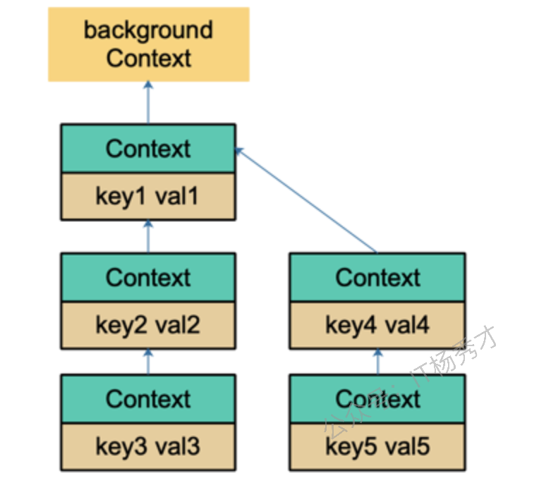

---
tags:
  - Go
  - golang
  - go原理深入
  - channel原理
---

# **context原理**

## **context是什么**

context是go语言在1.7引入的一个用于goroutine之间传递信息的并发安全的包，context可以翻译为上下文，其在项目中主要是用于上下与下层goroutine的取消控制以及数据共享，也是go语言中goroutine之间通信的一种方式，其底层是借助channl与sync.Mutex实现的。

关于context的用法我们在前一章节并发实践里已经做过介绍，本章主要介绍一下context的底层原理

## **context的底层实现**

与context相关的源码基本都在src/context/context.go中，我们通过源码来看一下，context的底层究竟做了些什么

context在底层实现上其实用到了2个接口，对这个接口的4种实现，以及提供了6个方法

**接口：**

| 接口名      | 说明                                   |
| -------- | ------------------------------------ |
| Context  | context的接口定义，规定context的实现必须包含的四个基本方法 |
| canceler | context的取消接口，其中定义了两个方法               |

**实现：**

context接口的四种实现

| 结构名        | 说明                                   |
| ---------- | ------------------------------------ |
| emptyCtx   | 一个空的context，用作根context               |
| cancelCtx  | 可以通过取消函数来取消context                   |
| timerCtx   | 可以通过定时器和deadline来定时取消contextvalueCtx |
| valueCtx   | 类似于map，可以用来存储key/valuez键值对           |

**方法：**

| 函数名           | 说明                      |
| ------------- | ----------------------- |
| Background    | 返回一个根context即emptyCtx   |
| TODO          | 也是返回一个根context即emptyCtx |
| WithCancel    | 派生出一个cancelCtx          |
| WithDeadline  | 派生出一个timerCtx           |
| WithTimeout   | 派生出一个timerCtx           |
| WithValue     | 派生出一个valueCtx           |

下面我们将逐一解读这几个结构及其实现方法

## **接口说明**

### **context接口**

首先还是回顾一下context接口，context的接口定义如下：

```go
type Context interface {
   Deadline() (deadline time.Time, ok bool)
   Done() <-chan struct{}
   Err() error
   Value(key interface{}) interface{}
}
```

接口提供了四个方法

* `Deadline`： 返回 context.Context 被取消的时间，即截止时间；

* `Done`： 返回一个 Channel，当Context被取消或者到达截止时间，这个 Channel 就会被关闭，表示context结束，多次调用 Done 方法返回的channel是同一个

* `Err`： 返回 context.Context 结束的原因

* 4.`Value` ：从 context.Context 中获取键对应的值，类似于map的get方法，对于同一个context，多次调用 Value 并传入相同的 Key 会返回相同的结果，如果没有对应的`key`,则返回`nil`，键值对是通过WithValue方法写入

### **canceler接口**

**canceler接口的源码定义如下**

```go
type canceler interface {
   cancel(removeFromParent bool, err error)  // 创建cancel接口实例的goroutine 调用cancel方法通知被创建的goroutine退出
   Done() <-chan struct{}  // 返回一个channel，后续被创建的goroutine通过监听这个channel的信号来完成退出
}
```

canceler接口主要用于取消方法的实现，如果一个示例既实现了context接口又实现了canceler接口，那么这个context就是可以本取消的，比如cancelCtx 和timerCtx。如果仅仅只是实现了context接口，而没有实现canceler，就是不可取消的，比如emptyCtx 和valueCtx。

## **contex实现**

在context报下对context接口有四种基本的实现，即emptyCtx ，cancelCtx ，timerCtx，valueCtx

### **emptyCtx**

首先看一下emptyCtx 这个最基本的实现，emptyCtx 虽然实现了context接口，但是不具备任何功能，因为实现很简单，基本都是直接返回空值。虽然emptyCtx 没有任何功能，但他还是有作用的，一般用它作为根context来派生出有实际用处的context。要想创建有实际功能的context，要使用后续提供的一系列with方法来派生出新的context，这个在前面讲context用法的时候已经做过介绍，就不再过多赘述。

emptyCtx 的相关源码：

```go
// An emptyCtx is never canceled, has no values, and has no deadline. It is not
// struct{}, since vars of this type must have distinct addresses.
type emptyCtx int

func (*emptyCtx) Deadline() (deadline time.Time, ok bool) {
   return
}

func (*emptyCtx) Done() <-chan struct{} {
   return nil
}

func (*emptyCtx) Err() error {
   return nil
}

func (*emptyCtx) Value(key any) any {
   return nil
}
```

可以看到emptyCtx 的实现没有做任何操作，就是一个整形结构。这个空的emptyCtx 会在两个创建根context得函数被用到

```go
func Background() Context {
   return background
}

func TODO() Context {
   return todo
}
```

而这里background和todo其实就是返回一个emptyCtx&##x20;

```go
var (
   background = new(emptyCtx)
   todo       = new(emptyCtx)
)
```

在写代码的时候，我么你调用这两个函数其实Background()函数或者TODO()函数创建最顶层的context其实就是获取一个emptyCtx。

###**cancelCtx**

cancelCtx结构定义如下:

```go
type cancelCtx struct {
   Context                         // 组合了一个Context ，所以cancelCtx 一定是context接口的一个实现
   mu       sync.Mutex             // 互斥锁，用于保护以下三个字段
  // value是一个chan struct{}类型，原子操作做锁优化
   done     atomic.Value          
   // key是一个取消接口的实现，map其实存储的是当前canceler接口的子节点，当前context被取消时，会遍历子节点发送取消信号
   children map[canceler]struct{}  
   err      error                  // context被取消的原因
}
```

下面看一下其各个方法的具体实现，首先看一下`Done()`方法：

```go
func (c *cancelCtx) Done() <-chan struct{} {
   d := c.done.Load()
   if d != nil {
      return d.(chan struct{})
   }
   c.mu.Lock()
   defer c.mu.Unlock()
   d = c.done.Load()
   if d == nil {
      d = make(chan struct{})
      c.done.Store(d)
   }
   return d.(chan struct{})
}
```

代码很简单，其实就是采用"懒汉模式"创建一个struct{}类型的管道返回，从类型可以看出这个channel是只读的，不能往里面写数据，所以应该避免直接读取这个channel，会发生阻塞。所以在使用上要配合select来非阻塞读取，由于是只读的，所以只有在一种情况下会读到值，那就是关闭这个channel的时候会读到零值。利用这个而特性就可以实现关闭的消息通知。

再看一下其 cancel() 方法的实现：

```go
// cancel closes c.done, cancels each of c's children, and, if
// removeFromParent is true, removes c from its parent's children.
func (c *cancelCtx) cancel(removeFromParent bool, err error) {
   if err == nil {   // context被取消的原因，必传，否则panic
      panic("context: internal error: missing cancel error")
   }
   c.mu.Lock()
   if c.err != nil {  // 在赋值这个err之前，c.err已经有值了，说明已经被调用过cancel函数了，c这个context已经被取消
      c.mu.Unlock()
      return // already canceled
   }
   c.err = err       // 赋值err信息
   d, _ := c.done.Load().(chan struct{})  // 获取通知管道
   if d == nil {                        
      c.done.Store(closedchan)
   } else {
      close(d)                           // 关闭管道          
   }
   // 遍历当前context的所有子节点，调用取消函数
   for child := range c.children {
      // NOTE: acquiring the child's lock while holding parent's lock.
      child.cancel(false, err)  // 递归取消子context
   }
   c.children = nil  // 取消动作完成之后，孩子节点置空
   c.mu.Unlock()

   if removeFromParent {
      removeChild(c.Context, c)  // 将自身从父节点children map种移除
}
```

cancel不仅取消当前context，还会遍历当前context的所有子context，递归取消，递归取消玩当前context的所有子context后，会将自身从父节点children map种移除，移除函数removeChild源码如下：

```go
// removeChild removes a context from its parent.
func removeChild(parent Context, child canceler) {
   p, ok := parentCancelCtx(parent)
   if !ok {
      return
   }
   p.mu.Lock()
   if p.children != nil {
      delete(p.children, child)   // 从父context的children中移除
   }
   p.mu.Unlock()
}
```

移除前后效果如下图所示：


在用户层面，创建cancelCtx的方法其实我们你之前也接触过，就是withCancel方法，在平常代码中，我们一般用这个方法来派生一个可以用cancel取消函数取消的context，常规用法如下：

```go
ctx,cancel := context.WithCancel(context.Background())
```

下面继续跟一下这个WithCancel函数的源码：

```go
func WithCancel(parent Context) (ctx Context, cancel CancelFunc) {
   if parent == nil { // 传入的父context不能为空，否则报panic
      panic("cannot create context from nil parent")
   }
   c := newCancelCtx(parent)   // 这里就会创建一个cancelCtx
   propagateCancel(parent, &c)   // 这里主要是关联父context ctx和子congtxt c的逻辑
   return &c, func() { c.cancel(true, Canceled) }  // 具体的取消函数cancel的实现
}
```

前面说了调用cancelFunc函数可以级联取消子context，那么为什么可以级联取消呢？propagateCancel函数就是用来做这个工作的，他将父context和子context关联起来，具体的关联逻辑，我们通过源码来分析：

```go
// propagateCancel arranges for child to be canceled when parent is.
func propagateCancel(parent Context, child canceler) {
   done := parent.Done()  // 获取父context的通信管道 chan struct{}
   if done == nil {     // done为空，说明父context不会被取消
      return // parent is never canceled
   }

   select {
   case <-done:     // 通信管道收到了消息，说明父context已经被取消，不用重复取消了
      // parent is already canceled
      child.cancel(false, parent.Err())  // 但是父context已经取消，这里子context也应该要取消，由于还没有关联上，所以主动调用cancel取消关联
      return
   default:
   }

   if p, ok := parentCancelCtx(parent); ok {   // 从父context中提取出cancelCtx结构
      p.mu.Lock()
      if p.err != nil {   // 加锁后双重检查，再次检查父context有没有被取消
         // parent has already been canceled
         child.cancel(false, p.err)  // 父context被取消，主动取消子context
      } else {                       // 父context没有被取消
         if p.children == nil {     
            p.children = make(map[canceler]struct{})   // 创建父context的children map
         }
         p.children[child] = struct{}{}               // 把当前子context加入到children map里面
      }
      p.mu.Unlock()
   } else {                             //   从父context中没有提取出cancelCtx结构
      atomic.AddInt32(&goroutines, +1)
      go func() {                       // 新起一个goroutine监控父子context的通信管道有没有取消信号       
         select {
         case <-parent.Done():
            child.cancel(false, parent.Err())
         case <-child.Done():
         }
      }()
   }
}
```

看一下这个提取父context的cancelCtx结构的parentCancelCtx方法：

```go
func parentCancelCtx(parent Context) (*cancelCtx, bool) {
   done := parent.Done()  
    // 从父context的取消信息管道为空，说明父context不会被取消
    // closedchan is a reusable closed channel.
    // var closedchan = make(chan struct{})
    // done == closedchan,表明ctx不是标准的 cancelCtx，可能是自定义的结构实现了 context.Context 接口
   if done == closedchan || done == nil {  // 
      return nil, false
   }
   p, ok := parent.Value(&cancelCtxKey).(*cancelCtx)  // 通过context的value方法从父context中提取出cancelCtx
   if !ok {
      return nil, false
   }
   pdone, _ := p.done.Load().(chan struct{}) // 判断父context里的通信管道和cancelCtx里的管道是否一致
   if pdone != done {  // 不一致，表明parent不是标准的cancelCtx
      return nil, false
   }
   return p, true   // 返回cancelCtx
}
```

总结一下通过WithCancel函数在派生可取消的子context的过程中，通过propagateCancel函数关联父子context可能遇到的几种情形：

1. 父context的通信管道done为空或者已经被取消，就不用关联了，直接取消当前子context即可''

2. 父context可以被取消，但是还未被取消，并且父context可以提取出标准的cancelCtx结构，则创建父context的children map，将当前子context加入到这个map中

3. 父context可以被取消，但是还未被取消，父context不能提取出标准的cancelCtx结构，新起一个goroutine监控父子context的通信管道有没有取消信号

### **timerCtx**

timerCtx在cancelCtx 的基础上，又提供了截止时间的功能，不仅拥有像cancelCtx 一样，可以通过调用取消函数cancelFun来取消子context的方式，还可以设置一个截止时间deadline ，在 deadline 到来时，自动取消 context。

首先看一下timerCtx的结构定义：

```go
type timerCtx struct {
   cancelCtx
   timer *time.Timer // Under cancelCtx.mu.
   deadline time.Time
}
```

看到它内置了cancelCtx，所以cancelCtx拥有的功方法，他可以调用cancelCtx的方法，能够主动取消context，再看一下timerCtx自身的cancel方法实现：

```go
func (c *timerCtx) cancel(removeFromParent bool, err error) {
   c.cancelCtx.cancel(false, err)    // 直接调用cancelCtx的cancel方
   if removeFromParent {
      // Remove this timerCtx from its parent cancelCtx's children.
      removeChild(c.cancelCtx.Context, c)  // 将当前子context从父context中删除
   }
   c.mu.Lock()
   if c.timer != nil {   // 要关闭掉定时器，因为手动取消过一次了，如果不关闭，在deadline 到来时，不会再次取消，造成错误
      c.timer.Stop()
      c.timer = nil
   }
   c.mu.Unlock()
}
```

同样在用户层面，我们一般通过WithTimeout或者WithDeadline来创建一个timerCtx

```go
 ctx, cancel := context.WithDeadline(context.Background(),time.Now().Add(4*time.Second))  // 截止时间当前时间4s后
 ctx, cancel := context.WithTimeout(context.Background(), 4*time.Second)   // 超时时间为4s后
```

在WithTimeout内部其实也是调用了WithDeadline，所以只用分析WithDeadline方法即可：

```go
func WithDeadline(parent Context, d time.Time) (Context, CancelFunc) {
   if parent == nil {  // 父context为空，直接报panic
      panic("cannot create context from nil parent")
   }
   // 如果父context的deadline早于这里要设置的子context的截止时间
   if cur, ok := parent.Deadline(); ok && cur.Before(d) {
      // 直接取消父context即可，不需要再管子context的取消时间，直接构建一个可以取消的子context
      // 因为父context的到期时间早于子context，当父context被取消的时候，这个子context肯定会被级联取消
      return WithCancel(parent)
   }
   // 创建timerCtx对象
   c := &timerCtx{
      cancelCtx: newCancelCtx(parent),
      deadline:  d,
   }
   propagateCancel(parent, c)  // 关联父子context
   dur := time.Until(d)        // 获取距离设置的子context过期时间的时间差
   if dur <= 0 {               // 时间差小于0，表示已经过期了，直接取消
      c.cancel(true, DeadlineExceeded) // deadline has already passed
      return c, func() { c.cancel(false, Canceled) }
   }
   c.mu.Lock()
   defer c.mu.Unlock()
   if c.err == nil {
     // 根据时间差，创建一个定时器，到deadline的时候定时触发取消
      c.timer = time.AfterFunc(dur, func() {
         c.cancel(true, DeadlineExceeded)
      })
   }
   return c, func() { c.cancel(true, Canceled) }
}
```

所以，父context未取消的情况下，在创建timerCtx的时候有两种情况：

设置的截止时间晚于父context的截止时间，则不会创建timerCtx，会直接创建一个可取消的context，因为父context的截止时间更早，会先被取消，父context被取消的时候会级联取消这个子context

设置的截止时间早于父context的截止时间，会创建一个正常的timerCtx

### **valueCtx**

valueCtx的作用与上述三个context有点不同，他不是用于父子context之间的取消的，而是用于数据共享。作用类似于一个map，不过数据的存储和读取是在两个context，用于goroutine之间的数据传递。

valueCtx的结构定义如下：

```go
type valueCtx struct {
    Context
    key, val interface{}
}
```

valueCtx内置了Context，所以他也是一个context接口的实现，但是其没有实现canceler接口，所以他不能用作context的取消，valueCtx实现了`String()`方法和`Value`方法，`String()`比较简单，就不细看了，下面看一下

`Value`方法

```go
func (c *valueCtx) Value(key interface{}) interface{} {
   if c.key == key {
      return c.val
   }
   return c.Context.Value(key)
}
```

方法很简单，就是向上递归的查找key所对应的value，如果找到则直接返回 value，否则查找该context的父context，一直顺着 context 向上，最终找到根节点（一般是 emptyCtx），直接返回一个 nil。查找过程如下图：



从定义可以出valueCtx中存储着一对键值对，具体是怎么用的呢？同样我们一般使用withValue方法派生出一个valueCtx

```go
ctx := context.WithValue(context.Background(),"key1","value1")
```

withValue函数源码如下：

```go
func WithValue(parent Context, key, val interface{}) Context {
   if parent == nil {
      panic("cannot create context from nil parent")
   }
   if key == nil {
      panic("nil key")
   }
   if !reflectlite.TypeOf(key).Comparable() {
      panic("key is not comparable")
   }
   return &valueCtx{parent, key, val}
}
```

withValue的方法实现很简单，就是创建一个valueCtx，将key和value设置到valueCtx返回。

