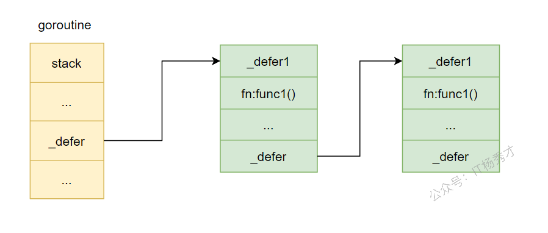
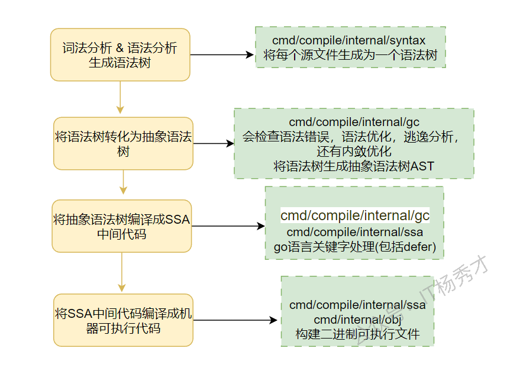

---
tags:
  - Go
  - golang
  - go原理深入
  - defer原理
---

# defer原理

## defer是什么

defer是go语言的一个关键字，用来修饰函数，其作用是让defer后面跟的函数或者方法调用能够延迟到当前所在函数return或者panic的时候再执行。

## defer的使用形式

```go
defer func(args)
```

defer在使用的时候，只需要在其后面加上具体的函数调用即可，这样就会注册一个延迟执行的函数func，并且会把函数名和参数都确定，等到从当前函数退出的时候在执行

## defer的底层结构

进行defer 函数调用的时候其实会生成一个\_defer结构，一个函数中可能有多次defer调用，所以会生成多个这样的\_defer结构，这些\_defer结构链式存储构成一个\_defer链表，当前goroutine的\_defer指向这个链表的头节点，

\_defer 的结构定义在src/src/runtime/runtime2.go中，源码如下：

```go
type _defer struct {
   started bool   // 标志位，标识defer函数是否已经开始执行,默认为false
   heap    bool   // 标记位，标志当前defer结构是否是分配在堆上
   openDefer bool  // 标记位，标识当前defer是否以开放编码的方式实现
   sp        uintptr // 调用方的sp寄存器指针，即栈指针
   pc        uintptr // 调用方的程序计数器指针
   fn        func()  // defer注册的延迟执行的函数
   _panic    *_panic // 标识是否panic时触发，非panic触发时，为nil
   link      *_defer // defer链表
   fd   unsafe.Pointer // defer调用的相关参数
   varp uintptr        // value of varp for the stack frame
   framepc uintptr
}
```

底层存储如下图：



defer函数在注册的时候，创建的\_defer结构会依次插入到\_defer链表的表头，在当前函数return的时候，依次从\_defer链表的表头取出\_defer结构执行里面的fn函数

## defer的执行过程

在探究defer的执行过程之前，先简单看一下go语言程序的编译过程，go语言程序由.go文件编译成最终的二进制机器码主要有以下结果步骤



defer关键字的处理在生成SSA中间代码阶段，编译器遇到 defer 语句的时候，会插入两种函数：

1. defer内存分配函数：`deferproc`(堆分配) 或 `deferprocStack`(栈分配)&#x20;

2. 执行函数：`deferreturn`&#x20;

下面分别看一下这两种函数的执行过程

defer的处理逻辑在cmd/compile/internal/ssagen/ssa.go文件中的state.stmt()方法中，由于源码过长，这里只贴部分重要代码：

```go
case ir.ODEFER:     // 如果节点时defer节点
   n := n.(*ir.GoDeferStmt)
   if base.Debug.Defer > 0 {
      var defertype string
      if s.hasOpenDefers {
         defertype = "open-coded"  // 开放编码
      } else if n.Esc() == ir.EscNever {
         defertype = "stack-allocated"   // 栈分配
      } else {
         defertype = "heap-allocated"   // 堆分配
      }
      base.WarnfAt(n.Pos(), "%s defer", defertype)
   }
   if s.hasOpenDefers {  //  如果可以开放编码，即内联实现
      s.openDeferRecord(n.Call.(*ir.CallExpr))  // 就使用开放编码这种方式
   } else {
      d := callDefer       // 否则先默认使用堆分配的模式
      if n.Esc() == ir.EscNever {   // 没有内存逃逸，使用栈分配的方式实现
         d = callDeferStack
      }
      s.callResult(n.Call.(*ir.CallExpr), d)
   }
```

从上述代码可以看出，defer的是现有三种实现方式，在栈上分配内存，在堆上分配内存以及使用开放编码的方式。会优先使用内联方式，当内联不满足，且没有发生内存逃逸的情况下，使用栈分配的方式，这两种情况都不符合的情况下在使用堆分配，这样做的好处是提升性能。

### \_defer内存分配

在上面的分析中我们可以看出在不同的情况下，\_defer结构分配在不同的地方，可能分配在堆上也可能分配在栈上，这两种分配方式调用的函数是不同的，堆上分配实际调用的是`runtime.deferproc`函数，栈上分配内存调用的是`runtime.deferprocStack`函数，下面分别来看看这两个函数都做了些什么工作？

#### 堆上分配

`先看deferproc`函数，在堆上分配内存，go 1.13 之前只有这个函数，说明go 1.13 之前，\_defer只能在堆上分配。

src/runtime/panic.go

```go
func deferproc(fn func()) {
   gp := getg()      // 获取goroutine，defer在哪个goroutine中执行
   if gp.m.curg != gp {
      // go code on the system stack can't defer
      throw("defer on system stack")
   }

   d := newdefer()   // 在堆中新建一个_defer对象
   if d._panic != nil {
      throw("deferproc: d.panic != nil after newdefer")
   }
   d.link = gp._defer   // 将这个新建的defer对象加入到goroutine的defer链表头部
   gp._defer = d
   d.fn = fn
   d.pc = getcallerpc()
   d.sp = getcallersp()
   return0()
  
}
```

重点看一下newdefer()这个函数

```go
func newdefer() *_defer {
   var d *_defer
   mp := acquirem()
   pp := mp.p.ptr()    // 获取逻辑处理器p
   // p的本地defer缓存池为空且全局defer缓存池不为空，从全局defer缓存池取出一个defer结构加入到p的本地defer缓存池
   if len(pp.deferpool) == 0 && sched.deferpool != nil {  
      lock(&sched.deferlock)
      for len(pp.deferpool) < cap(pp.deferpool)/2 && sched.deferpool != nil {
         d := sched.deferpool
         sched.deferpool = d.link
         d.link = nil
         pp.deferpool = append(pp.deferpool, d)
      }
      unlock(&sched.deferlock)
   }
   // p的本地defer缓存池取出一个defer结构
   if n := len(pp.deferpool); n > 0 {
      d = pp.deferpool[n-1]
      pp.deferpool[n-1] = nil
      pp.deferpool = pp.deferpool[:n-1]
   }
   releasem(mp)
   mp, pp = nil, nil
    // p的本地defer缓存池和全局defer缓存池都没有可用的defer结构，在堆上创建一个
   if d == nil {
      // Allocate new defer.
      d = new(_defer)
   }
   d.heap = true
   return d
}
```

可以看出堆上defer的创建思想借助了内存复用，用到了内存池的思想，创建defer的过程是：优先在p的本地和全局的defer缓存池里找到一个可用的defer结构返回，找不到在去堆上创建

#### 栈上分配

下面看一下`runtime.deferprocStack`函数，在栈上分配\_defer，这个函数是go 1.13 之后引入的，优化defer性能的，显然在栈上分配的效率更高。`runtime.deferprocStack`源码如下：

```go
// 在调用这个函数之前，defer结构已经站在栈上创建好，这里只是作为参数传进来赋值
func deferprocStack(d *_defer) {
   gp := getg()  // // 获取goroutine，defer在哪个goroutine中执行
   if gp.m.curg != gp {
      // go code on the system stack can't defer
      throw("defer on system stack")
   }
   d.started = false
   d.heap = false  // 堆上分配置为false
   d.openDefer = false
   d.sp = getcallersp()
   d.pc = getcallerpc()
   d.framepc = 0
   d.varp = 0
   *(*uintptr)(unsafe.Pointer(&d._panic)) = 0
   *(*uintptr)(unsafe.Pointer(&d.fd)) = 0
   *(*uintptr)(unsafe.Pointer(&d.link)) = uintptr(unsafe.Pointer(gp._defer))
   *(*uintptr)(unsafe.Pointer(&gp._defer)) = uintptr(unsafe.Pointer(d))
   return0()

}
```

Go 在编译的时候在 SSA中间代码阶段，如果判断出\_defer需要在站上分配，则编译器会直接在函数调用栈上初始化 \_defer 记录，并作为参数传递给 deferprocStack函数。

#### 开放编码

再看一下defer的第三种实现方式，开放编码。这种方式是在go1.14 引入的继续优化defer实现性能的方式。在go1.14 中通过代码内联优化，使得函数末尾直接对`defer`函数进行调用，减少了函数调用开销。其主要逻辑位于 cmd/compile/internal/walk/stmt.go文件的 walkStmt()函数和 cmd/compile/internal/ssagen/ssa.go 的 buildssa()函数，函数较长，这里看下关键代码。

walkStmt()函数：

```go
case ir.ODEFER:
   n := n.(*ir.GoDeferStmt)
   ir.CurFunc.SetHasDefer(true)
   ir.CurFunc.NumDefers++
   if ir.CurFunc.NumDefers > maxOpenDefers {  // maxOpenDefers = 8
      // defer函数的个数多余8个时，不能用开放编码模式
      ir.CurFunc.SetOpenCodedDeferDisallowed(true)
   }
   if n.Esc() != ir.EscNever {
      // If n.Esc is not EscNever, then this defer occurs in a loop,
      // so open-coded defers cannot be used in this function.
      ir.CurFunc.SetOpenCodedDeferDisallowed(true)
   }
   fallthrough
```

&#x20;这里分析一下`n.Esc() != ir.EscNever`这个条件：

通过源码注释可以看到，这里其实就是判断defer是否在循环体内，因为 defer 在 for 循环中调用，编译器不确定会执行多少次，会逃逸到堆上，这样defer就只能分配在堆中了。所以在使用defer 延迟调用的时候，尽量不要在循环中使用，否则可能导致性能问题。

buildssa()函数：

```go
// build时候的没有设置-N，允许内联
s.hasOpenDefers = base.Flag.N == 0 && s.hasdefer && !s.curfn.OpenCodedDeferDisallowed()
switch {
case base.Debug.NoOpenDefer != 0:
   s.hasOpenDefers = false
case s.hasOpenDefers && (base.Ctxt.Flag_shared || base.Ctxt.Flag_dynlink) && base.Ctxt.Arch.Name == "386":
   // Don't support open-coded defers for 386 ONLY when using shared
   // libraries, because there is extra code (added by rewriteToUseGot())
   // preceding the deferreturn/ret code that we don't track correctly.
   s.hasOpenDefers = false
}
if s.hasOpenDefers && len(s.curfn.Exit) > 0 {
   // Skip doing open defers if there is any extra exit code (likely
   // race detection), since we will not generate that code in the
   // case of the extra deferreturn/ret segment.
   s.hasOpenDefers = false
}
if s.hasOpenDefers {
   // Similarly, skip if there are any heap-allocated result
   // parameters that need to be copied back to their stack slots.
   for _, f := range s.curfn.Type().Results().FieldSlice() {
      if !f.Nname.(*ir.Name).OnStack() {
         s.hasOpenDefers = false
         break
      }
   }
}
if s.hasOpenDefers &&
   //  defer所在函数返回值个数和defer函数个数乘积不能大于15
   s.curfn.NumReturns*s.curfn.NumDefers > 15 {
   // Since we are generating defer calls at every exit for
   // open-coded defers, skip doing open-coded defers if there are
   // too many returns (especially if there are multiple defers).
   // Open-coded defers are most important for improving performance
   // for smaller functions (which don't have many returns).
   s
```

总结一下：在g1.14之后，go会优先采用内联的方式处理defer函数调用，但是需要满足以下几个条件：

* build编译的时候没有设置-N

* defer 函数个数没有超过 8 个

* defer所在函数返回值个数和defer函数个数乘积不超过15

* defer没有出现在循环语句中时

### defer函数执行

在给defer分配好内存之后，剩下的就是执行了。在函数退出的时候，`deferreturn` 来执行defer链表上的各个defer函数。函数源码如下：

```go
func deferreturn() {
   gp := getg()
   // 遍历goroutine的defer链表
   for {
      d := gp._defer
      if d == nil {
         return
      }
      sp := getcallersp()   // 获取调用栈的栈顶指针
      if d.sp != sp {
         return
      }
      // 开放编码模式，内联处理
      if d.openDefer {
         done := runOpenDeferFrame(gp, d)
         if !done {
            throw("unfinished open-coded defers in deferreturn")
         }
         gp._defer = d.link
         freedefer(d)
         // If this frame uses open defers, then this
         // must be the only defer record for the
         // frame, so we can just return.
         return
      }
       // 非内联模式
      fn := d.fn    // 获取defer的执行函数
      d.fn = nil    // defer上的函数指针置空
      gp._defer = d.link  // 遍历下一个defer结构
      freedefer(d)    // 释放defer结构，优先归还到defer缓冲池中
      fn()   // 执行函数调用
   }
}
```

当 go函数 的 `return` 关键字执行的时候，触发 `call` 调用 `deferreturn`函数，deferreturn函数的执行逻辑也很简单，就是遍历goroutine上的defer链表，从表头开始遍历，依次取出defer结构执行defer结构中的函数执行。

总结：

1. 遇到defer关键字，编译器会在编译阶段注册defer函数的时候插入`deferproc()`函数或者`deferprocStack`函数，在return之前插入deferreturn()函数

2. defer函数的执行顺序是LIFO的，因为每次创建的defer结构都是插入到goroutine的defer链表表头

3. defer结构的有三种实现方式，堆上分配，栈上分配还有内联实现

