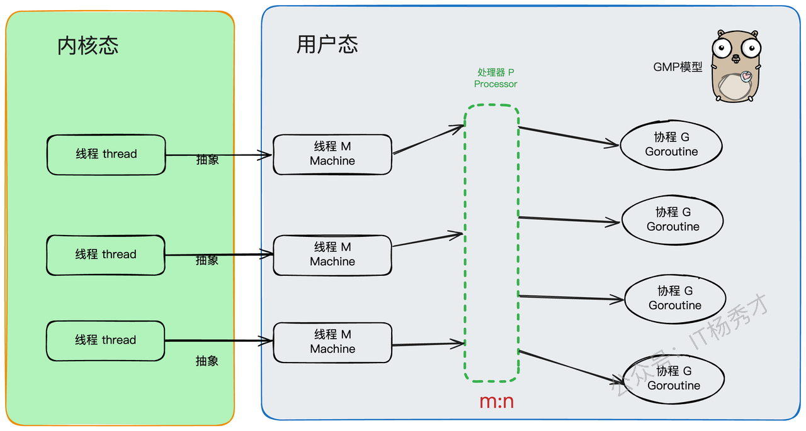
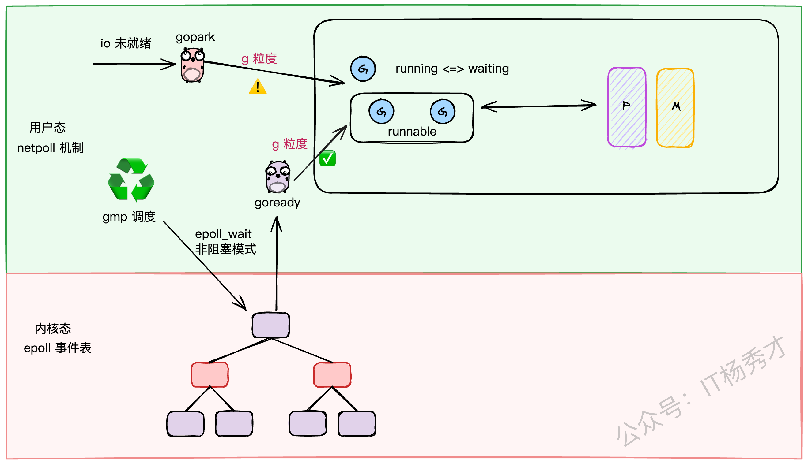
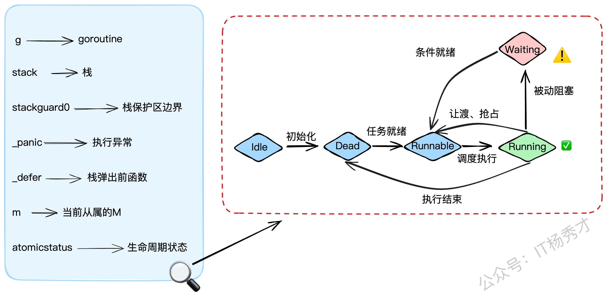
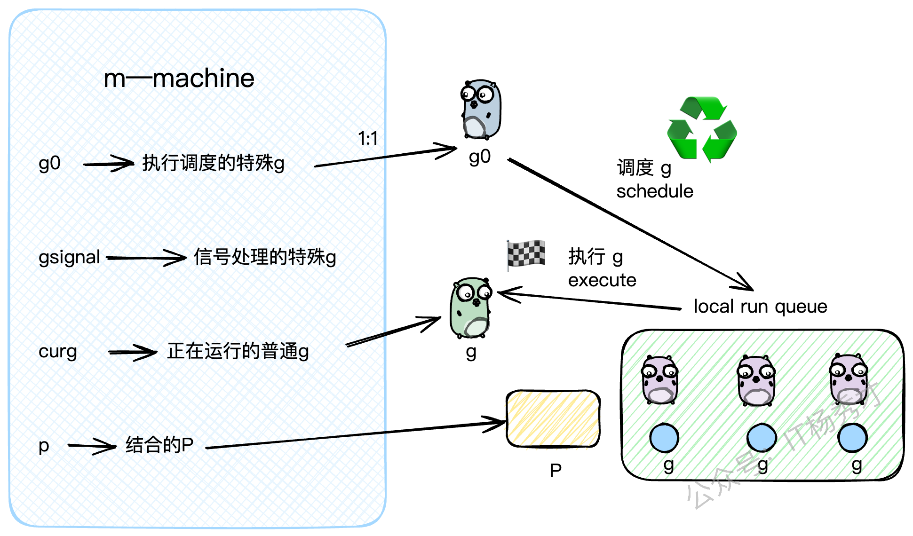
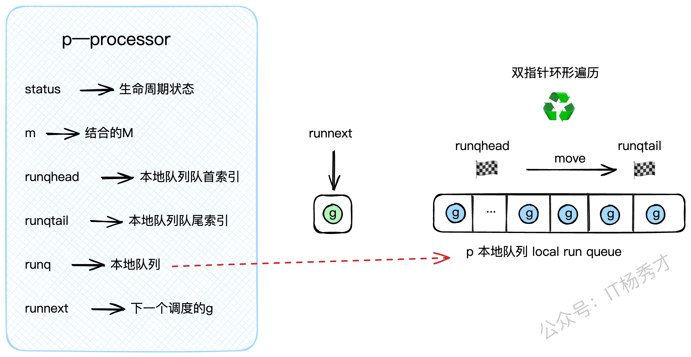
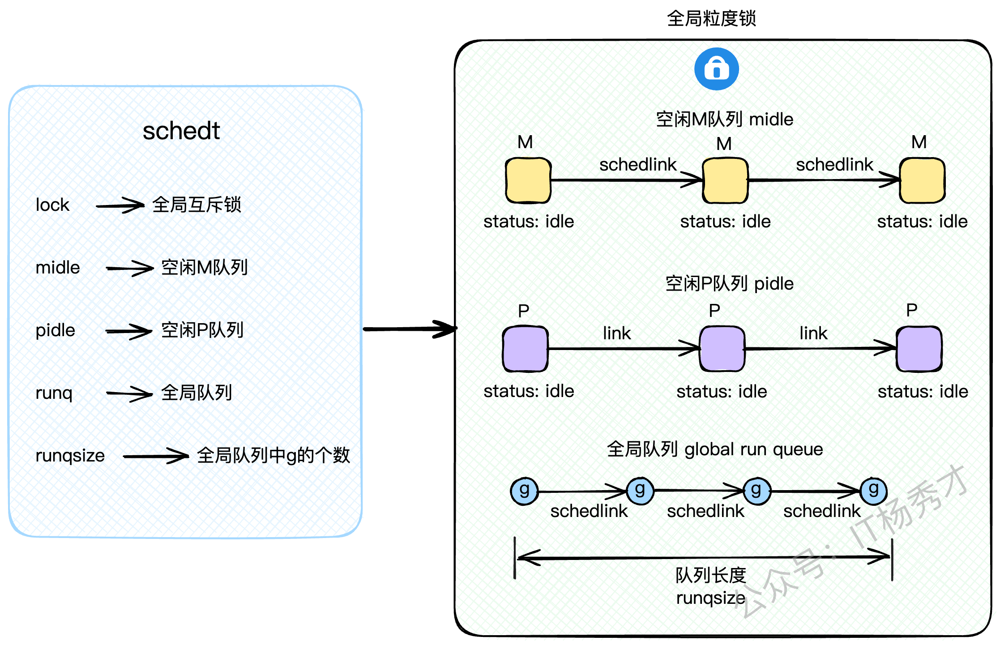
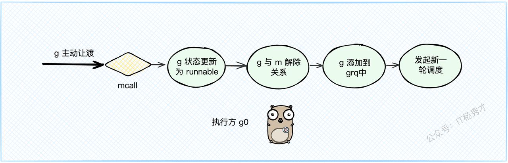
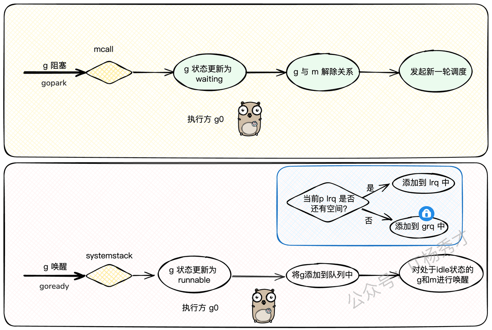
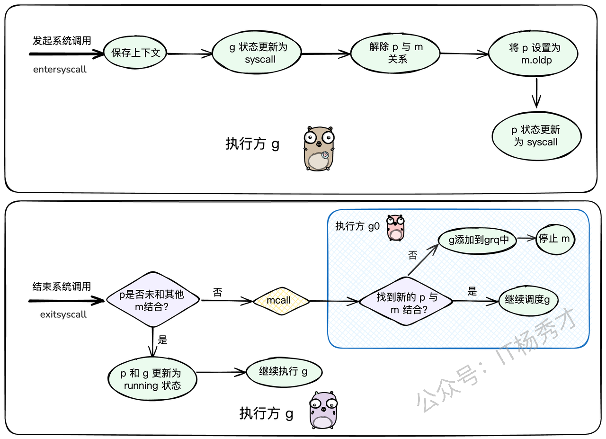

---
tags:
  - Go
  - golang
  - go原理深入
  - GMP调度
  - 协程调度
---

# **GMP调度原理**


聊到Go语言，大家最津津乐道的可能就是它那"天生强大"的并发能力了。一个简单的 `go` 关键字，就能开启一个并发执行单元，这酸爽，谁用谁知道。但是，你有没有想过，这背后到底藏着什么样的魔法？为什么Go的并发可以如此轻盈、如此高效？

答案，就藏在它核心的 **GMP调度模型**里。

很多Gopher对GMP可能只是略知一二，知道有G、M、P这三个角色，但它们之间是如何协作的，一个goroutine又是如何被创建、调度、甚至是被"抢占"的，可能就有点模糊了。

不怕！今天，就带着大家把GMP这块硬骨头彻底啃下来。咱们不光要搞懂理论，还要深入`v1.19`的源码，把它的底层设计看个底朝天。这篇文章会分成两大部分，从宏观到微观，带你彻底搞懂Go语言的设计精髓，GMP调度。

* **第一部分：宏观视角**

  * **第一小节：从基础聊起**：咱们先热个身，聊聊线程、协程这些基本概念，看看Go的goroutine是如何站在巨人肩膀上的。

  * **第二小节：GMP设计图纸**：直接上源码，看看G、M、P这三个核心组件在底层到底长啥样。

* **第二部分：微观之旅**

  * **第三小节：一个G的诞生与执行**：跟着一个goroutine的视角，看它是如何被创建并被调度器翻牌子执行的。

  * **第四小节：G的主动让贤**：看看一个正在运行的goroutine是如何主动让出CPU，把机会留给其他G的。

  * **第五小节：霸道的调度器**：当一个G"占着茅坑不拉屎"，长期占用CPU时，我们的监控者是如何强制把它"请"下来的。

## **1. 故事的开始：了解基础概念**

### **1.1 从线程到协程**

在聊GMP之前，我们得先搞明白两个老朋友：**线程（Thread）** 和 **协程（Coroutine）**。


* **线程（Thread）**：这家伙是操作系统的大内总管——内核（Kernel）眼里的最小执行单元。它的生老病死、工作调度，全得听内核的号令。你可以把它想象成一个正式工，有编制，但每次调度（切换）都得走一套复杂的流程，成本比较高。

* **协程（Coroutine）**：这家伙更像是用户自己请的临时工。它活在用户态，比线程更轻量，可以理解为用户态线程。多个协程可以在一个线程上跑，它们的调度切换由用户程序自己说了算，不用去麻烦内核这个大忙人。所以，协程的切换开销极小，非常灵活。

简单总结一下：线程是内核级的，重而稳；协程是用户级的，轻而快。

### **1.2 Go的答案：goroutine**

Go语言选择的并发实现，就是我们所熟知的 **goroutine**。你可以把它看作是Go对协程的"超级魔改版"。它并不是一个孤立的概念，而是整个 **GMP调度体系** 的核心产物。



正是因为有了GMP这套精妙的架构，goroutine才拥有了超越原生协程的两大核心优势：

1. **灵活的调度**：G（goroutine）、M（Machine，内核线程）、P（Processor，处理器）三者之间可以动态地绑定和解绑，整个调度过程充满了弹性。

2. **动态的栈空间**：每个goroutine的栈空间可以根据需要自动伸缩，既方便使用，又极大地节约了内存资源。

更牛的是，Go语言在顶层完全屏蔽了线程这个概念，所有的并发操作都是围绕着goroutine来的，就像秦始皇统一了度量衡，Go也用goroutine统一了并发江湖的秩序。

### **1.3 GMP架构全景图**

好了，主角登场！GMP，顾名思义，就是 **G**oroutine + **M**achine + **P**rocessor。

* **G（Goroutine）**：就是我们的"任务单元"。它有自己的执行栈、生命状态，以及要完成的具体工作（就是你 `go` 后面跟的那个函数）。G需要绑定到M上才能运行，你可以把M想象成G的CPU。

* **M（Machine）**：你可以把它看作Go对系统线程的封装，是真正干活的"工人"。M需要和P"绑定"后，才能进入GMP的调度循环。M的工作很简单，就是在`g0`（一个特殊的goroutine，负责调度）和普通的G之间反复横跳：执行`g0`时，它在找任务；执行普通G时，它在处理任务。

* **P（Processor）**：P是调度器，是GMP模型中的"中枢大脑"。M必须获取到一个P，才能开始调度和执行G。P的数量决定了同一时间最多有多少个M可以处于运行状态，这个数量通常由 `GOMAXPROCS` 环境变量决定。P还有一个非常重要的职责：它自带一个本地的goroutine队列，我们称之为 **LRQ (Local Run Queue)**。


现在，我们把目光聚焦到存放G的"容器"上。Go的设计非常巧妙，它有两种队列：

1. **P的本地队列（LRQ - Local Run Queue）**：这是每个P私有的G队列。当一个M想执行G时，会优先从自己绑定的P的LRQ里找。因为是私有的，所以大部分时间不需要加锁，通过高效的CAS（Compare-And-Swap）操作就能完成存取，大大减少了并发冲突。当然，也并非完全没有冲突，因为当一个P的LRQ空了的时候，它可能会从其他P的LRQ里"偷"一些G过来，这就是著名的 **work-stealing** 机制。

2. **全局队列（GRQ - Global Run Queue）**：这是一个全局共享的G队列。当一个P的LRQ满了，新创建的G就会被放到GRQ里。因为是全局共享的，所以所有M都可能来访问，竞争激烈，因此访问它需要加一把全局大锁。

**G的存放与获取逻辑**：

* **放G（put g）**：当你在一个goroutine里通过 `go func(){...}` 创建一个新的goroutine时，它会优先被放到当前P的LRQ里。如果LRQ满了，没办法，只能加个全局锁，把它扔到GRQ里去。这遵循的是"就近原则"。

* **取G（get g）**：当M上的`g0`开始找活干时，它会遵循一个"负载均衡"的策略，按以下顺序来寻找G：

  1. 先从当前P的LRQ里找（无锁，速度最快）。

  2. 如果LRQ没有，就去全局GRQ里看看（需要加锁）。

  3. 如果GRQ也没有，就去网络轮询器（netpoll）里找找有没有因为IO操作而就绪的G。

  4. 如果还是没有，就只能去"偷"了，从别的P的LRQ里偷一半过来（work-stealing，无锁）。

这里有个小细节：为了防止GRQ里的G被"饿死"（因为M上的`g0`总是优先从LRQ取），调度器规定，每进行61次调度循环，就必须强制去下一次去`grq`取 。这样做是为了避免`lrq`过于繁忙，而导致`grq`中的`g`"饿死"。

### **1.4 GMP生态圈**

在Go的世界里，GMP是绝对的基石。所有上层的建筑，比如内存管理、并发工具等，都是围绕着GMP模型来精心设计的。

#### **1.4.1 内存管理**


Go的内存管理借鉴了Google自家的TCMalloc思想，并为GMP模型量身定做了优化。它为每个P都配备了一个私有的内存缓存——`mcache`。当一个P上的G需要分配小对象时，可以直接从这个私有的`mcache`里拿，完全无锁，速度飞快。

#### **1.4.2 并发工具（Mutex, Channel）**


你有没有想过，为什么在Go里一个channel的读写阻塞了，或者一个Mutex锁住了，并不会把整个线程都卡死？

这就是因为Go的并发工具都是"G级别"的。当一个G因为这些操作需要阻塞时，它会被挂起，让出M的执行权。M会立刻去寻找并执行其他的G，整个过程都在用户态完成，无需内核介入。这极大地提升了并发性能。

我最近在用C++尝试模拟GMP时，就深有感触。C++标准库里的锁，一旦锁住，阻塞的是整个线程，这会导致线程上所有其他的协程都得干等着。想要实现Go这种效果，就得重写所有并发工具，成本巨大。这也反向证明了Go在并发设计上的优越性。

#### **1.4.3 IO多路复用（netpoll）**



对于网络IO，Go采用了Linux下性能强悍的epoll技术。但为了避免epoll的等待操作阻塞整个M，Go设计了一套巧妙的`netpoll`机制。它将IO阻塞操作转换成了G级别的阻塞（`gopark`），当IO就绪时，再通过`goready`唤醒对应的G。这样，IO操作也被完美地融入了GMP的调度体系中。

可以说，不理解GMP，就无法真正理解Go语言的精髓。

## **2. 深入源码：GMP的底层结构**

理论说了一大堆，我们现在就潜入源码，看看G、M、P在 `runtime/runtime2.go` 文件里到底长什么样。

### **2.1 G的结构（goroutine）**



`g`结构体是goroutine的实体，我们来看看它的关键字段：

* `stack`: 描述了goroutine的栈空间信息（起始和结束地址）。

* `stackguard0`: 栈的警戒线。当goroutine的栈使用量将要越过这条线时，就会触发栈扩容。同时，它也被用来标记"抢占请求"。

* `_panic`: 用来记录goroutine中发生的panic。

* `_defer`: 用链表的形式存储了goroutine中的defer操作（后进先出）。

* `m`: 指向当前正在执行它的M。如果G没在运行，这个字段就是`nil`。

* `atomicstatus`: G的生命周期状态，比如 `_Gidle`、`_Grunnable`、`_Grunning`、`_Gwaiting` 等。

```go
// g represents a goroutine.
type g struct {
        // stack describes the goroutine's stack. The bounds are
        // [stack.lo, stack.hi).
        stack       stack   // goroutine的执行栈空间
        // stackguard0 is the stack pointer compared in the Go stack growth prologue.
        // It is stack.lo + _StackGuard.
        // It is also used to signal a request to preempt the goroutine.
        stackguard0 uintptr // 栈空间保护区边界，也用于传递抢占标识

        // ...

        _panic       *_panic // 记录g执行过程中遇到的异常
        _defer       *_defer // g中挂载的defer函数，是一个LIFO的链表结构
        m            *m      // 当前执行本g的m
        
        // atomicstatus is the status of the goroutine.
        // It is changed atomically with casgstatus.
        // This field is read and written atomically, and the values are not in the
        // GStatus enum.
        atomicstatus uint32 // g的状态

        // ...
        
        // schedlink is a link in the global run queue, idle g list, or gfree list.
        schedlink guintptr // 进入全局队列grq时指向相邻g的next指针
}
```

### **2.2 M的结构（Machine）**



`m`结构体是内核线程的抽象，核心字段如下：

* `g0`: 一个非常特殊的G。每个M都有一个自己的`g0`，这个`g0`不执行用户代码，它的任务就是执行调度逻辑，为M寻找下一个要运行的普通G。

* `gsignal`: 另一个特殊的G，专门用来处理分配给这个M的信号。

* `curg`: 指向当前M上正在运行的那个普通的用户G。

* `p`: 指向当前与M绑定的P。

```go
// m represents an OS thread.
type m struct {
        g0      *g     // 专门用于调度的g，每个M都有一个
        // ...
        procid  uint64 // M的唯一ID
        gsignal *g     // 用于处理信号的g
        
        curg    *g     // M上正在运行的普通g
        p       puintptr // M关联的p
        
        // ...
        
        schedlink muintptr // M在空闲链表中的下一个M
}
```

你可以把M的运行过程想象成两个状态的切换：当它在执行 `g0` 时，它在扮演"调度者"的角色；当它在执行 `curg` 时，它在扮演"执行者"的角色。

### **2.3 P的结构（Processor）**



`p`结构体是调度器，是连接G和M的桥梁，核心字段如下：

* `status`: P的生命周期状态，如 `_Pidle`、`_Prunning` 等。

* `m`: 指向当前与它绑定的M。

* `runq`: P的私有G队列，也就是我们前面说的LRQ，它是一个定长的数组，可以存放256个G。

* `runqhead`, `runqtail`: LRQ的头尾索引，用来实现一个环形队列。

* `runnext`: LRQ里的一个"VIP通道"。通过 `runqput` 放入的下一个G会优先放在这里，调度器会首先检查 `runnext` 是否有G，有的话直接拿来执行，可以省去操作`runq`队列的开销。

```go
// p represents a processor.
type p struct {
        id          int32  // P的ID
        status      uint32 // P的状态 (pidle, prunning, etc.)
        link        puintptr
        schedtick   uint32   // 每执行一次schedule，该值+1
        syscalltick uint32   // 每进行一次系统调用，该值+1
        m           muintptr // 回指到关联的M (如果idle则为nil)
        
        // Queue of runnable goroutines. Accessed without lock.
        runqhead uint32
        runqtail uint32
        runq     [256]guintptr // 本地G队列，即LRQ
        // runnext, if non-nil, is a runnable G that was ready'd by
        // the current G and should be run next instead of what's in
        // runq.
        runnext guintptr // 下一个要调度的G，可以看作是LRQ中的一个特权位置
        
        // ...
}
```

### **2.4 全局调度器（schedt）**



除了G、M、P这三大组件，还有一个全局的 `schedt` 结构体，它掌管着全局资源，访问它需要加锁。

* `lock`: 全局互斥锁。

* `midle`: 空闲的M队列，没活干的M会在这里排队。

* `pidle`: 空闲的P队列，没活干的P也在这里排队。

* `runq`: 全局G队列，也就是GRQ。

* `runqsize`: GRQ里G的数量。

```go
// 全局调度模块
type schedt struct{
    // ...
    // 互斥锁
    lock mutex

    // 空闲 m 队列
    midle        muintptr // idle m's waiting for work
    // ...
    // 空闲 p 队列
    pidle      puintptr // idle p's
    // ...

    // 全局 g 队列——grq
    runq     gQueue
    // grq 中存量 g 的个数
    runqsize int32
    // ...
}
```

> `midle`和 `pidle`\`的设计是为了资源的复用和节能。当系统不忙时，空闲的M和P会被放进这两个队列里"休眠"，避免CPU空转，等到有新任务时再被唤醒。

## **3. 正向追踪：一个G的诞生与调度**

好了，基础结构我们都看完了。现在，让我们切换到第一人称视角，看看一个我们用 `go func(){...}` 创建的goroutine，是如何一步步被调度并执行的。这个过程，可以看作是从 `g0`到 `g`的转换。

### **3.1 main函数的特殊性**

`main`函数是所有Go程序的入口，它比较特殊。它是由一个全局唯一的 m0（主线程）来执行的。源码位于 runtime.proc.go

```go
// The main goroutine.
func main() {
        // ...
        // 获取用户定义的 main.main 函数
        fn := main_main
        // 执行用户的 main 函数
        fn()
        // ...
}
```

### **3.2 普通G的创建之旅**


除了`main`这个特例，我们自己启动的goroutine都会经历一个标准的创建流程。比如这段代码：

```go
func handle() {
        // 异步启动一个goroutine
        go func() {
                // do something ...
        }()
}
```

编译器会把 `go func()` 转换成对 `runtime.newproc` 函数的调用。这个函数的核心逻辑如下（我们跟着代码走一遍）：

1. **切换到**`g0`**栈**：`newproc`会先通过`systemstack`把自己从当前的用户G栈切换到M的`g0`调度栈上。因为创建G是调度层面的工作，得由专业的`g0`来干。

2. **创建G实例**：在`g0`栈上，调用`newproc1`来创建一个新的`g`结构体实例，并做好初始化工作，比如设置好要执行的函数入口地址、程序计数器等。

3. **放入就绪队列**：新创建的G需要被放到一个就绪队列里，等待被调度。这里会调用`runqput`函数。

4. `runqput`**的逻辑**：

   * 它会优先尝试把新的G放到当前P的`runnext`这个VIP位置。

   * 如果`runnext`被占了，它会尝试把G放到当前P的LRQ的队尾。

   * 如果LRQ也满了，那没办法，只能加个全局锁，把这个G和LRQ里的一半G都转移到全局队列GRQ里去（这个操作叫`runqputslow`）。

5. **唤醒休眠的P**：如果此时有P因为没事干而处于休眠状态，`wakep`函数会负责唤醒一个P来处理这个新任务。

6. **切回用户G栈**：`systemstack`执行完毕，切回到原来的用户G，继续执行它自己的代码。

```go
// 创建一个新的g，并将其投递到就绪队列中。fn是用户指定的函数。
// 当前的执行者还是某个普通的g。
func newproc(fn *funcval) {
        // 获取当前正在执行的普通g和程序计数器
        gp := getg()
        pc := getcallerpc()
        
        // systemstack会临时切换到g0栈，执行完闭包函数后，再切回原来的普通g
        systemstack(func() {
                // 此时执行方为g0
                // 构造一个新的g实例
                newg := newproc1(fn, gp, pc)

                // 获取当前P
                _p_ := getg().m.p.ptr()
                
                // 将newg添加到队列中:
                // 1) 优先添加到P的本地队列LRQ
                // 2) 如果LRQ满了，则添加到全局队列GRQ
                runqput(_p_, newg, true)

                // 如果有因为空闲而被阻塞的P和M，需要唤醒它们
                if mainStarted {
                        wakep()
                }
        })
        // 切回到原来的普通g继续执行
}
```

### **3.3 从 `g0` 到 `g` 的切换**


每个M都有一个自己的`g0`，`g0`的工作就是不断地调用`schedule`函数来寻找可执行的G。所以，一个M的生命周期，就是在执行`g0`（找任务）和执行普通`g`（做任务）之间循环往复。

这个切换过程有两个关键的"桩函数"：

* `mcall`, `systemstack`: 实现从 `g` 切换到 `g0`。

* `gogo`: 实现从 `g0` 切换到 `g`。

我们从`g0`的视角来看，它主要做两件事：

1. `schedule()`: 调用`findrunnable()`方法，从各个队列里找到一个可执行的G。

2. `execute()`: 找到G之后，更新上下文信息（比如把`m.curg`指向找到的G），然后调用`gogo`，把M的CPU执行权从`g0`交到这个G手上。

上述方法均实现于 runtime/proc.go 文件中：

```go
// 执行方为g0
func schedule() {
        _g_ := getg() // 获取当前g0

top:
        pp := _g_.m.p.ptr() // 获取当前P
        
        // ...

        // 核心方法: 获取一个可调度的g
        // - 按照优先级，依次从本地队列LRQ、全局队列GRQ、netpoll、其他P的LRQ中寻找
        // - 如果都找不到，就把P和M都休眠掉
        gp, inheritTime, tryWakeP := findRunnable() // 这个函数会阻塞直到找到任务

        // ...

        // 执行g，这个方法会把执行权从g0切换到gp
        execute(gp, inheritTime)
}

// 执行指定的g。当前执行方还是g0，但会通过gogo方法切换到gp
func execute(gp *g, inheritTime bool) {
        _g_ := getg() // 获取g0

        // 建立g0和gp的关系
        _g_.m.curg = gp
        gp.m = _g_.m

        // 更新gp的状态：runnable -> running
        casgstatus(gp, _Grunnable, _Grunning)
        
        // 设置gp的栈保护区边界
        gp.stackguard0 = gp.stack.lo + _StackGuard

        // 执行gogo方法，M的执行权会切换到gp
        gogo(&gp.sched)
}
```

### **3.4 寻找G的漫漫长路：`findrunnable`**

`findrunnable`是调度循环中最核心的函数，它寻找G的策略体现了Go调度器的智慧。


我们来梳理一下它的寻找步骤：

1. **检查全局队列（GRQ）**：还记得吗？每61次调度循环，必须先从全局队列`globrunqget`拿一个G，防止GRQ饥饿。（需要加锁）

2. **检查本地队列（LRQ）**：从当前P的LRQ里`runqget`一个G。（无锁CAS）

3. **再次检查全局队列（GRQ）**：如果本地没有，再去全局队列里`globrunqget`找。（需要加锁）

4. **检查网络轮询器（netpoll）**：如果还没有，就去`netpoll`里看看有没有因为网络IO就绪的G。（非阻塞模式）

5. **从别的P偷（steal work）**：如果还找不到，就只能启动`stealwork`机制，随机找一个别的P，从它的LRQ里偷一半的G过来。

6. **再次double check全局队列**：偷完之后，再最后看一眼全局队列。

7. **进入休眠**：如果以上所有努力都失败了，说明系统现在真的很闲，`findrunnable`会：

   * 把当前的P设置为`_Pidle`状态，并把它放到全局的`pidle`队列里。

   * 在把当前M也休眠之前，会做最后一次挣扎：以**阻塞模式**调用`netpoll`，看看能不能等到一个IO事件。

   * 如果连阻塞等待IO都没用，那就彻底死心了，把当前M也放到全局的`midle`队列里，然后调用`stopm`让M休眠，交出线程控制权。

这个过程设计得非常精妙，既保证了任务获取的高效性（优先无锁操作），又实现了负载均衡（work-stealing），还能在系统空闲时自动缩容，节省资源。

### **3.5 findRunnable函数详解**

Go调度器的核心在于`findRunnable`函数，这个函数负责为当前的处理器P找到一个可执行的goroutine。整个过程遵循着严格的优先级顺序，确保系统的公平性和效率。

```go
// 寻找可执行的goroutine，返回时必定已经找到目标g
func findRunnable()(gp *g, inheritTime, tryWakeP bool){
    // 获取当前P下的g0（调度协程）
    _g_ := getg()
    // ...
top:
    // 获取当前的处理器P
    _p_ := _g_.m.p.ptr()
    // ...
    
    // 防饥饿机制：每61次调度检查一次全局队列
    if _p_.schedtick%61==0 && sched.runqsize > 0{
        lock(&sched.lock)
        gp = globrunqget(_p_, 1)
        unlock(&sched.lock)
        if gp != nil{
            return gp, false, false
        }
    }
    // ...
    
    // 第一优先级：从本地运行队列获取goroutine
    if gp, inheritTime := runqget(_p_); gp != nil{
        return gp, inheritTime, false
    }
    
    // 第二优先级：从全局队列获取goroutine
    if sched.runqsize != 0{
        lock(&sched.lock)
        gp := globrunqget(_p_, 0)
        unlock(&sched.lock)
        if gp != nil{
            return gp, false, false
        }
    }
    
    // 第三优先级：处理网络I/O就绪的goroutine
    if netpollinited() && atomic.Load(&netpollWaiters) > 0 &&
       atomic.Load64(&sched.lastpoll) != 0{
        if list := netpoll(0); !list.empty(){ // 非阻塞调用
            gp := list.pop()
            injectglist(&list)
            casgstatus(gp, _Gwaiting, _Grunnable)
            // ...
            return gp, false, false
        }
    }
    // ...
    
    // 第四优先级：从其他P的本地队列偷取goroutine
    gp, inheritTime, tnow, w, newWork := stealWork(now)
    if gp != nil{
        return gp, inheritTime, false
    }
    
    // 若有GC标记任务，参与协作而非直接回收P
    // ...
    
    // 最后检查：再次确认全局队列
    lock(&sched.lock)
    // ...
    if sched.runqsize != 0{
        gp := globrunqget(_p_, 0)
        unlock(&sched.lock)
        return gp, false, false
    }
    // ...
    
    // 无事可做时：解绑P和M，将P放入空闲队列
    releasep()
    now = pidleput(_p_, now)
    unlock(&sched.lock)
    // ...
    
    // 网络轮询保障机制：确保有M专门处理I/O事件
    if netpollinited() && (atomic.Load(&netpollWaiters) > 0 || pollUntil != 0) &&
       atomic.Xchg64(&sched.lastpoll, 0) != 0{
        atomic.Store64(&sched.pollUntil, uint64(pollUntil))
        // ...
        
        // 阻塞模式执行网络轮询
        delay := int64(-1)
        // ...
        list := netpoll(delay) // 阻塞直到有新任务
        
        // 恢复轮询标识
        atomic.Store64(&sched.lastpoll, uint64(now))
        // ...
        
        lock(&sched.lock)
        // 尝试获取空闲的P
        _p_, _ = pidleget(now)
        unlock(&sched.lock)
        
        // 如果没有可用的P，将就绪的goroutine放入全局队列
        if _p_ == nil{
            injectglist(&list)
        } else {
            // 重新绑定P和M
            acquirep(_p_)
            // 取第一个goroutine用于调度，其余放入全局队列
            if !list.empty(){
                gp := list.pop()
                injectglist(&list)
                casgstatus(gp, _Gwaiting, _Grunnable)
                // ...
                return gp, false, false
            }
            // ...
            goto top
        }
    }
    // ...
    
    // 最终手段：阻塞当前M，加入空闲队列
    stopm()
    goto top
}
```

#### **3.5.1 本地队列获取策略**

从本地队列获取goroutine是最高效的方式，因为不需要加锁。`runqget`函数采用了巧妙的双重策略：

```go
// 无锁方式从P的本地队列获取goroutine
func runqget(_p_ *p)(gp *g, inheritTime bool){
    // 优先获取runnext位置的goroutine（高优先级位置）
    next := _p_.runnext
    if next != 0 && _p_.runnext.cas(next, 0){
        return next.ptr(), true
    }
    
    // 从队列头部获取普通goroutine
    for{
        // 原子操作获取头部索引
        h := atomic.LoadAcq(&_p_.runqhead) // load-acquire语义，与其他消费者同步
        // 获取尾部索引
        t := _p_.runqtail
        
        // 队列为空的情况
        if t == h {
            return nil, false
        }
        
        // 根据索引取出对应的goroutine
        gp := _p_.runq[h%uint32(len(_p_.runq))].ptr()
        
        // CAS操作更新头部索引
        if atomic.CasRel(&_p_.runqhead, h, h+1){ // cas-release语义，提交消费操作
            return gp, false
        }
    }
}
```

这里有个有趣的设计：`runnext`是一个特殊位置，专门存放高优先级的goroutine，比如刚刚创建的新goroutine。这样设计可以提高响应性。

#### **3.5.2 全局队列的公平调度**

当本地队列为空时，调度器会转向全局队列。但这里有个重要的防饥饿机制：

```go
// 从全局队列获取goroutine，调用前必须持有全局锁
func globrunqget(_p_ *p, max int32)*g {
    // 确保持有锁的断言检查
    assertLockHeld(&sched.lock)
    
    // 队列空检查
    if sched.runqsize == 0{
        return nil
    }
    // ...
    
    // 根据max参数可能会批量转移goroutine到本地队列
    // 这里简化显示核心逻辑
    // ...
    
    // 从全局队列头部弹出一个goroutine
    gp := sched.runq.pop()
    // ...
    return gp
}
```

#### **3.5.3 网络I/O事件处理机制**

在 gmp 调度流程中，如果 lrq 和 grq 都为空，则会执行 netpoll 流程，尝试以非阻塞模式下的 epoll\_wait 操作获取 io 就绪的 g。该方法位于 runtime/netpoll\_epoll.go：

```go
func netpoll(delay int64) gList {
    // ...
    // 调用系统的epoll_wait获取就绪事件
    var events [128]epollevent
    n := epollwait(epfd, &events[0], int32(len(events)), waitms)
    // ...
    
    var toRun gList
    for i := int32(0); i < n; i++{
        ev := &events[i]
        // 将就绪事件对应的goroutine加入待运行列表
        netpollready(...)
    }
    return toRun
}
```

这个机制让Go程序能够高效处理大量并发连接，而不需要为每个连接分配单独的线程。

#### **3.5.4 从其他的P队列窃取g**

当本地队列和全局队列都为空时，并且执行完 netpoll 流程后仍未获得 g，则会尝试从其他 p 的 lrq 中窃取半数 g 补充到当前 p 的 lrq 中。工作窃取算法是负载均衡的关键，它确保了系统中的处理器都能保持忙碌状态。

```go
func stealWork(now int64) (gp *g, inheritTime bool, rnow, pollUntil int64, newWork bool){
    // 获取当前P
    pp := getg().m.p.ptr()
    // ...
    
    // 最多尝试4轮窃取
    const stealTries = 4
    for i := 0; i < stealTries; i++{
        // ...
        
        // 随机选择窃取目标，避免热点竞争
        for enum := stealOrder.start(fastrand()); !enum.done(); enum.next(){
            // ...
            
            // 获取目标P
            p2 := allp[enum.position()]
            
            // 不能从自己这里偷
            if pp == p2 {
                continue
            }
            // ...
            
            // 只要目标P不是空闲状态就尝试窃取
            if !idlepMask.read(enum.position()){
                // 窃取目标P本地队列中的一半goroutine
                if gp := runqsteal(pp, p2, stealTimersOrRunNextG); gp != nil{
                    return gp, false, now, pollUntil, ranTimer
                }
            }
        }
    }
    
    // 窃取失败
    return nil, false, now, pollUntil, ranTimer
}
```

#### **3.5.5 回收空闲p和m**

再执行完上述逻辑之后，如果还是未能获取到可运行的g，系统需要妥善处理空闲的P和M，此时会将 p 和 m 添加到 schedt 的 pidle 和 midle 队列中并停止 m 的运行，避免产生资源浪费

```go
// 将P加入空闲队列
func pidleput(_p_ *p, now int64)int64{
    assertLockHeld(&sched.lock)
    // ...
    
    // 将P插入空闲队列头部
    _p_.link = sched.pidle
    sched.pidle.set(_p_)
    atomic.Xadd(&sched.npidle, 1)
    // ...
}

// 停止当前M的运行
func stopm(){
    _g_ := getg()
    // ...
    
    lock(&sched.lock)
    // 将M加入空闲队列
    mput(_g_.m)
    unlock(&sched.lock)
    
    // 让M进入休眠状态
    mPark()
    // ...
}
```

## **4. 逆向追踪：G的让渡艺术**

有借有还，再借不难。G拿到了M的执行权，也得在适当的时候还回去。这个"还"的过程，我们称之为**让渡（yield）**。让渡是一个主动的行为，由G自己发起，目的是把执行权交还给`g0`，让`g0`可以去调度其他的G。这是一个从 `g` 到 `g0` 的转换。

### **4.1 功成身退：执行结束**


当一个G的任务执行完毕，它会调用`goexit1`，这是一个主动的"退休"申请。

1. 在`goexit1`里，它会调用`mcall(goexit0)`，这个`mcall`指令会把执行权从当前的G切换到M的`g0`上，并让`g0`去执行`goexit0`函数。

2. `goexit0`函数（此时由`g0`执行）会负责给这个退休的G办"后事"：

   * 把G的状态从`_Grunning`更新为`_Gdead`。

   * 清理G内部的数据。

   * 解除G和M的绑定关系（`dropg`）。

   * 把这个G的结构体放到P的`gfree`队列里，方便下次创建新G时复用，避免了内存的反复申请和释放。

   * 最后，调用`schedule()`，开始新一轮的调度。

```go
// goroutine运行结束，此时执行方是普通g
func goexit1() {
        // 通过mcall，将执行方转为g0，调用goexit0方法
        mcall(goexit0)
}

// 此时执行方为g0，入参gp为已经运行结束的g
func goexit0(gp *g) {
        _g_ := getg() // 获取g0
        _p_ := _g_.m.p.ptr()

        // 将gp的状态由running更新为dead
        casgstatus(gp, _Grunning, _Gdead)
        // ... 清理工作 ...
        
        // 将g和p解除关系
        dropg()

        // 将g添加到p的gfree队列中以供复用
        gfput(_p_, gp)
        
        // 发起新一轮调度流程
        schedule()
}
```

### **4.2 高风亮节：主动让渡**



我们可以通过在代码里调用 `runtime.Gosched()` 来手动让一个G让出CPU。这个函数会做和`goexit1`类似的事情：

1. 调用`mcall(gosched_m)`，把执行权从当前G切换到`g0`。

2. `g0`执行`gosched_m`函数，它的逻辑是：

   * 把G的状态从`_Grunning`改回`_Grunnable`。

   * 解除G和M的绑定。

   * 把这个G直接扔到**全局队列GRQ**中，等待下一次被调度。

   * 调用`schedule()`，开始新一轮调度。

```go
// 主动让渡出执行权，此时执行方还是普通g
func Gosched() {
        // 通过mcall，将执行方转为g0，调用gosched_m方法
        mcall(gosched_m)
}

// 此时执行方为g0
func gosched_m(gp *g) {
        // ...
        goschedImpl(gp)
}

func goschedImpl(gp *g) {
        // 将g状态由running改为runnable就绪态
        casgstatus(gp, _Grunning, _Grunnable)
        // 解除g和m的关系
        dropg()
        // 将g添加到全局队列grq
        lock(&sched.lock)
        globrunqput(gp)
        unlock(&sched.lock)
        // 发起新一轮调度
        schedule()
}
```

### **4.3 情非得已：阻塞让渡**



这是最常见的一种让渡方式。当G执行到需要等待某个外部条件的地方（比如读一个空的channel，或者等待一个锁），它就会被阻塞。

这个过程的核心是`gopark`函数：

1. 当G需要阻塞时，上层函数（比如channel的读写逻辑）会调用`gopark`。

2. `gopark`同样会调用`mcall(park_m)`，把执行权交给`g0`。

3. `g0`执行`park_m`，它会：

   * 把G的状态从`_Grunning`改为`_Gwaiting`。

   * 解除G和M的绑定。

   * **注意**：`_Gwaiting`状态的G不会被放到任何就绪队列里！它会被上层调用者（比如channel）自己保管。

   * `g0`调用`schedule()`，寻找下一个G来执行。

当外部条件满足时（比如channel里有了数据），另一个G会调用`goready`函数来唤醒这个处于`_Gwaiting`状态的G。

`goready`会：

1. 把目标G的状态从`_Gwaiting`改回`_Grunnable`。

2. 调用`runqput`，把这个G重新放回到就绪队列（LRQ或GRQ）中。

3. 调用`wakep`，尝试唤醒一个空闲的P来处理这个刚被唤醒的G。

这一`park`一`ready`，完美地实现了G级别的阻塞和唤醒，整个过程高效且对用户透明。

以下是具体的代码分析：

```go
// 此时执行方为普通 g
func gopark(unlockf func(*g, unsafe.Pointer)bool,lockunsafe.Pointer, reason waitReason, traceEv byte, traceskip int){
    // 获取 m 正在执行的 g，也就是要阻塞让渡的 g
    gp := mp.curg
    // ...
    // 通过 mcall，将执行方由普通 g -> g0
    mcall(park_m)
}

// 此时执行方为 g0. 入参 gp 为需要执行 park 的普通 g
func park_m(gp *g){
    // 获取 g0 
    _g_ := getg()

    // 将 gp 状态由 running 变更为 waiting
    casgstatus(gp,_Grunning,_Gwaiting)
    // 解绑 g 与 m 的关系
    dropg()

    // g0 发起新一轮调度流程
    schedule()
}
```

与 gopark 相对的，是用于唤醒 g 的 goready 方法，其中会通过 systemstack 压栈切换至 g0 执行 ready 方法——将目标 g 状态由 waiting 改为 runnable，然后添加到就绪队列中.

```go
// 此时执行方为普通 g. 入参 gp 为需要唤醒的另一个普通 g
func goready(gp *g, traceskip int) {
    // 调用 systemstack 后，会切换至 g0 亚展调用传入的 ready 方法. 调用结束后则会直接切换回到当前普通 g 继续执行. 
    systemstack(func() {
        ready(gp, traceskip, true)
    })

    // 恢复成普通 g 继续执行 ...
}
```

```go
// 此时执行方为 g0. 入参 gp 为拟唤醒的普通 g
func ready(gp *g, traceskip int, next bool){
    // ...

    // 获取当前 g0
    _g_ := getg()
    // ...
    // 将目标 g 状态由 waiting 更新为 runnable
    casgstatus(gp,_Gwaiting,_Grunnable)
    /*
        1) 优先将目标 g 添加到当前 p 的本地队列 lrq
        2）若 lrq 满了，则将 g 追加到全局队列 grq
    */
    runqput(_g_.m.p.ptr(), gp,next)
    // 如果有 m 或 p 处于 idle 状态，将其唤醒
    wakep()
    // ...
}
```

## **5. 第三方视角：抢占式调度**

前面说的"让渡"都是G的主动行为。但如果一个G是个"老赖"，执行一个超长的计算任务，一直不主动让出CPU怎么办？难道要让整个系统都等它一个吗？

当然不行！Go调度器还有一个"霸道总裁"的角色来强制干预，就是**抢占（Preemption）**。一个由外部力量发起的、为了维护整个系统公平和效率的"强制让位"过程。


### **5.1 幕后英雄：无处不在的sysmon**

在我们的Go程序启动时，除了我们熟知的主线程外，runtime还会悄悄启动一个非常关键的后台线程——`sysmon`（System Monitor，系统监控）。

你可以把它想象成一个永不休息的"巡逻兵"，它独立于普通的G-P-M调度模型，持续地在后台循环执行。这个线程在整个程序生命周期里是全局唯一的，就像一个大管家，不知疲倦地监视着整个Go程序的运行状态。


`sysmon` 的工作是一个永不停歇的循环，它主要关心三件大事儿：

* **网络轮询（netpoll）**：检查有没有已经完成IO操作的网络连接，唤醒那些等待IO的Goroutine。

* **抢占（retake）**：找出那些运行时间太长的Goroutine，毫不留情地把它"踹"下CPU。

* **GC触发检查**：看看是不是时候该进行垃圾回收（GC）了。

这个 `sysmon` 线程是在哪里创建的呢？答案就在 `main` 函数启动的深处。Go运行时会通过 `newm` 创建一个新的系统线程（M）专门来跑 `sysmon` 这个函数。

它的核心工作逻辑大致如下：

```go
// The main goroutine.
// main goroutine的入口
func main(){
        systemstack(func() {
                // 创建一个新的M（系统线程）来执行sysmon函数
                // 这个M不关联任何P，是一个专门用于系统监控的线程
                newm(sysmon, nil, -1)
        })
        // ...
}

// sysmon是系统监控函数，它在一个独立的M上无限循环运行
func sysmon() {
        //..
        for {
                // 根据程序的繁忙程度，动态调整休眠时间
                // 如果程序比较空闲，会休眠长一点，最长10毫秒
                usleep(delay)
                // ...

                // 记录上次网络轮询的时间
                lastpoll := int64(atomic.Load64(&sched.lastpoll))
                // 如果网络轮询器已初始化，并且距离上次轮询超过10ms
                if netpollinited() && lastpoll != 0 && lastpoll+10*1000*1000 < now {
                        //...
                        // 执行非阻塞的网络轮询，返回一个就绪的goroutine列表
                        list := netpoll(0) 
                        // ...
                }

                // 执行抢占工作，这是我们的重点
                retake(now)
                //...

                // 检查是否需要触发GC
                if t := (gcTrigger{kind: gcTriggerTime, now: now}); t.test() && atomic.Load(&forcegc.idle) != 0 {
                        // ...
                }
                // ...
        }
}
```

可以看到，`sysmon` 的核心就是一个 `for` 死循环，每次循环都会执行一遍它的"三板斧"。而我们的抢占逻辑，就藏在 `retake` 这个函数里。`retake` 会根据Goroutine的不同状态，采取不同的抢占策略，主要分为两种：**系统调用抢占**和**运行超时抢占**。

### **5.2 系统调用抢占**

我们知道，系统调用（syscall）是连接用户态程序和操作系统内核的桥梁。但当一个M（系统线程）陷入系统调用时，它就会被操作系统挂起，暂时无法执行任何用户态代码。这对Go的调度器来说是个大问题，因为如果M上还绑定着一个P（处理器），那这个P也就跟着被闲置了，它所管理的本地Goroutine队列就得不到执行，造成了资源浪费。

Go的策略非常聪明：**人走可以，但办公桌得留下！**

当一个Goroutine即将发起系统调用时，调度器会做几件事：

1. **解除P与M的绑定**：把当前线程M和处理器P分离开。

2. **状态更新**：把Goroutine和P的状态都更新为 `_Gsyscall` 和 `_Psyscall`。

3. **保留弱联系**：虽然P和M分开了，但M会记住这个P（存放在`m.oldp`），方便回来的时候能"再续前缘"。

4. **寻找新机会**：脱离了M的P，可以去和其他空闲的M结合，继续执行其他Goroutine，一点都不耽误事儿。



这个过程主要发生在 `reentersyscall` 函数中：

```go
// reentersyscall 在goroutine进入系统调用时被调用
func reentersyscall(pc, sp uintptr) {
        _g_ := getg() // 获取当前的goroutine

        // ...
        // 保存当前的程序计数器(PC)和栈指针(SP)等上下文信息
        save(pc, sp)
        // ...

        // 1. 将goroutine的状态从 _Grunning 更新为 _Gsyscall
        casgstatus(_g_, _Grunning, _Gsyscall)

        // ...
        // 2. 解除 P 和 M 的绑定关系
        pp := _g_.m.p.ptr()
        pp.m = 0          // P的m指针置空
        _g_.m.p = 0       // M的p指针置空

        // 3. 将P设置为M的oldp，建立一个弱引用关系
        _g_.m.oldp.set(pp)
        
        // 4. 将P的状态更新为 _Psyscall
        atomic.Store(&pp.status, _Psyscall)

        // ...
}
```

等系统调用结束，Goroutine从内核态返回时，会执行 `exitsyscall` 函数。这时它会尝试"复位归来"：

* **快速路径**：先看看之前那个P（`oldp`）是不是还单身（没有和其他M结合）。如果是，太好了，直接拿回来用，光速恢复执行。

* **慢速路径**：如果P已经被别的M"拐走"了，那就没办法了。当前Goroutine会被切换到`g0`栈，执行`exitsyscall0`，尝试为自己所在的M寻找一个新的空闲P。如果找到了，就继续执行；如果找不到，说明现在很忙，M就会被挂起，这个Goroutine则被放到全局队列中，等待下一次被调度

```go
// exitsyscall 在goroutine退出系统调用时执行
func exitsyscall() {
        _g_ := getg() // 获取当前goroutine

        // ...
        // 尝试快速路径：如果oldp没有被其他M绑定，就直接复用
        oldp := _g_.m.oldp.ptr()
        _g_.m.oldp = 0
        if exitsyscallfast(oldp) {
                // ...
                // 快速恢复成功，将g的状态改回_Grunning
                casgstatus(_g_, _Gsyscall, _Grunning)
                // ...
                return // 直接返回，继续执行g
        }

        // 快速路径失败，切换到g0栈，执行慢速路径逻辑
        mcall(exitsyscall0)
        // ...
}

// exitsyscall0 在g0栈上为当前M寻找一个新的P
func exitsyscall0(gp *g) {
        // 将goroutine的状态从 _Gsyscall 改为 _Grunnable 就绪态
        casgstatus(gp, _Gsyscall, _Grunnable)
        // 解除g和当前M的绑定
        dropg()
        lock(&sched.lock)
        
        // 尝试从空闲列表获取一个P
        var _p_ *p
        _p_, _ = pidleget(0)
        // ...
        
        // 如果没有找到空闲的P
        if _p_ == nil {
                // 将g放入全局运行队列
                globrunqput(gp)
                // ...
        }
        // ...
        unlock(&sched.lock)

        // 如果找到了P
        if _p_ != nil {
                // 绑定P，然后立即执行这个goroutine
                acquirep(_p_)
                execute(gp, false) // 不会返回
        }

        // 如果没找到P，M只能进入休眠
        stopm()
        // 当M被唤醒后，重新开始调度循环
        schedule() // 不会返回
}
```


你可能会问，这和 `sysmon` 有什么关系？关系大了！`sysmon` 会在它的 `retake` 检查中，遍历所有的P。如果发现某个P长时间处于 `_Psyscall` 状态（默认超过10ms），或者这个P虽然在syscall，但它的本地队列里还有其他Goroutine在排队，`sysmon` 就会认为不能再等了，必须执行抢占。 它会调用 `handoffp`，强制把这个P从syscall的M那里"抢"过来，分配给一个新的或者空闲的M，去执行P本地队列里的其他任务。

```go
// retake 函数由 sysmon 线程周期性调用
func retake(now int64) uint32{
    n :=0
    // 加锁
    lock(&allpLock)
    // 遍历所有 p
    for i :=0; i <len(allp); i++{
        _p_ := allp[i]
        // ...
        s := _p_.status
        // ...
        // 对于正在执行 syscall 的 p
        if s ==_Psyscall{
            // 如果 p 本地队列为空且发起系统调用时间 < 10ms，则不进行抢占
            if runqempty(_p_)&& atomic.Load(&sched.nmspinning)+atomic.Load(&sched.npidle)>0&& pd.syscallwhen+10*1000*1000> now {
                continue
            }
            unlock(&allpLock)
            // 将 p 的状态由 syscall 更新为 idle
            if atomic.Cas(&_p_.status, s,_Pidle){
                // ...
                // 让 p 拥有和其他 m 结合的机会
                handoffp(_p_)
            }
            // ...
            lock(&allpLock)
        }
    }
    unlock(&allpLock)
    return uint32(n)
}
```

```javascript
func handoffp(_p_ *p) {
    // 如果 p lrq 中还有 g 或者全局队列 grq 中还有 g，则立即分配一个新 m 与该 p 结合
    if!runqempty(_p_)|| sched.runqsize !=0{
        // 分配一个 m 与 p 结合
        startm(_p_,false)
        return
    }
    // ...
    // 若系统空闲没有 g 需要调度，则将 p 添加到 schedt 中的空闲 p 队列 pidle 中
    pidleput(_p_,0)
    // ...
}
```

### **5.3 运行超时抢占**

除了系统调用，另一种需要抢占的场景就是Goroutine运行时间过长。比如一个纯计算的循环，没有任何IO或channel操作，它就会像个"钉子户"一样霸占着CPU。


`sysmon` 在 `retake` 函数中同样会检查每个处于 `_Prunning` 状态的P。它会看当前P上的Goroutine从何时开始执行（`schedwhen`），如果执行时间超过了一个阈值（`forcePreemptNS`，通常是10ms），`sysmon` 就会认为需要抢占了。

```go
// retake 函数的一部分
func retake(now int64) uint32 {
        // ...
        for i := 0; i < len(allp); i++ {
                _p_ := allp[i]
                // ...
                // 如果P正在运行
                if s == _Prunning {
                        // ...
                        // 检查当前goroutine的执行时间是否超过了10ms
                        if _p_.schedwhen+forcePreemptNS <= now {
                                // 发起抢占
                                preemptone(_p_)
                        }
                }
        }
        // ...
}
```

这里的抢占又分为两种方式：一种是"好言相劝"，一种是"强行执法"。

#### **5.3.1 协作式抢占**

这是Go早期版本就有的抢占方式，比较"温柔"。`sysmon` 在决定抢占后，会调用 `preemptone` 函数。这个函数首先会给目标Goroutine打上一个"抢占标记"。具体来说，就是把 `gp.preempt` 设置为 `true`，同时把 `gp.stackguard0` 设置为一个特殊值 `stackPreempt`。

```go
// preemptone 抢占指定P上正在运行的g
func preemptone(_p_ *p) bool {
        // 获取P上绑定的M
        mp := _p_.m.ptr()
        // 获取M上正在运行的g，也就是我们的抢占目标
        gp := mp.curg

        // ...
        // 1. 设置协作式抢占标志
        gp.preempt = true
        
        // 2. 修改栈保护标志，这是协作式抢占的关键
        // 当g进行函数调用（特别是涉及栈检查）时，会检查这个值
        gp.stackguard0 = stackPreempt

        // ...
}
```

这个 `stackguard0` 标志位非常关键。Goroutine在执行函数调用时，尤其是可能导致栈扩容的场景下，会检查这个标志位。当它发现 `stackguard0` 变成了 `stackPreempt`，就知道："哦，调度器想让我让位了"。于是，它就会很"自觉"地停止当前工作，调用 `gopreempt_m`，将自己重新放回全局队列，让出CPU。这个过程就叫做**协作式抢占**。


这个检查点通常在 `newstack` 函数中，也就是栈扩容的逻辑里：

```go
// newstack 在g0栈上为goroutine扩展栈空间时执行
func newstack() {
        // 获取当前需要扩容栈的goroutine
        gp := thisg.m.curg
        
        // 读取g的栈保护标志
        stackguard0 := atomic.Loaduintptr(&gp.stackguard0)

        // 如果标志被设置为stackPreempt，说明被标记为需要抢占
        if stackguard0 == stackPreempt {
                // 检查当前g是否满足被抢占的条件（比如没有持有锁等）
                if canPreemptM(thisg.m) {
                        // 条件满足，响应抢占，执行让渡操作
                        gopreempt_m(gp) // 这个函数不会返回
                }
        }
        // ...
}

// gopreempt_m 会走到 goschedImpl，后续流程和主动让渡(gosched)一样
func gopreempt_m(gp *g) {
        // ...
        goschedImpl(gp)
}

func goschedImpl(gp *g) {
        // g状态从_Grunning变为_Grunnable
        casgstatus(gp, _Grunning, _Grunnable)
        // 解绑M
        dropg()
        // 加锁后放入全局队列
        lock(&sched.lock)
        globrunqput(gp)
        unlock(&sched.lock)
        // 触发新一轮调度
        schedule()
}
```

但协作式抢占有个明显的缺点：如果一个Goroutine是个铁憨憨，一直在执行纯计算的死循环，没有任何函数调用，那它就永远没有机会去检查 `stackguard0`，也就无法响应抢占意图。这可怎么办？

#### **5.3.2 非协作式抢占**

为了解决协作式抢占的短板，Go 1.14 版本引入了基于信号的抢占机制，也就是**非协作式抢占**。这种方式就非常"硬核"了。

在 `preemptone` 函数中，除了设置协作标记，还会做一件事：向目标Goroutine所在的M（线程）发送一个信号 `sigPreempt`。

```go
// preemptone 函数的另一部分
func preemptone(_p_ *p) bool {
    // ... （前面设置协作标记的代码）

        // 3. 基于信号实现非协作式抢占
        if preemptMSupported && debug.asyncpreemptoff == 0 {
                _p_.preempt = true
                // 向目标M发送抢占信号
                preemptM(mp)
        }
        return true
}

func preemptM(mp *m) {
    // ...
    // 向指定的线程（由mp.procid标识）发送sigPreempt信号
    signalM(mp, sigPreempt)
    // ...
}

func signalM(mp *m, sig int) {
        // 底层通过pthread_kill实现向线程发送信号
        pthread_kill(pthread(mp.procid), uint32(sig))
}
```

Go程序启动时，会注册一个信号处理器 `sighandler` 来处理各种信号，其中就包括了我们的 `sigPreempt`


当M接收到 `sigPreempt` 信号后，操作系统会中断M的当前执行，转而去执行`sighandler`。 信号处理函数会发现这是一个抢占信号，然后检查当前的Goroutine是否满足被抢占的条件（例如，没有在执行一些敏感的运行时代码）。

如果条件满足，最关键的一步来了：`sighandler`会像一个黑客一样，直接修改G的寄存器信息，主要是程序计数器（PC）和栈顶指针（SP）。它会强行在G的执行流中"注入"一段代码，这段代码就是 `asyncPreempt` 函数。

```go
// sighandler 是go的信号处理总入口
// 它在gsignal这个特殊的goroutine上执行
func sighandler(sig uint32, info *siginfo, ctxt unsafe.Pointer, gp *g) {
        // ...
        // 如果收到了抢占信号
        if sig == sigPreempt {
                // 执行抢占处理
                doSigPreempt(gp, ctxt)
        }
        // ...
}

// doSigPreempt 执行具体的信号抢占逻辑
func doSigPreempt(gp *g, ctxt *sigctxt) {
        // 判断g是否满足抢占条件
        if wantAsyncPreempt(gp) {
                if ok, newpc := isAsyncSafePoint(gp, ctxt.sigpc(), ctxt.sigsp(), ctxt.siglr()); ok {
                        // 通过修改g的寄存器，强行让它下一条指令去执行asyncPreempt
                        ctxt.pushCall(abi.FuncPCABI0(asyncPreempt), newpc)
                }
        }
        // ...
}

// pushCall 修改栈指针和程序计数器，实现"指令注入"
func (c *sigctxt) pushCall(targetPC, resumePC uintptr) {
        // 获取当前栈顶指针 sp (rsp寄存器)
        sp := uintptr(c.rsp())
        // 栈向下移动一个指针大小，为返回地址腾出空间
        sp -= goarch.PtrSize
        // 将原始的下一条指令地址（resumePC）存入新的栈顶
        *(*uintptr)(unsafe.Pointer(sp)) = resumePC
        // 更新栈顶指针
        c.set_rsp(uint64(sp))
        // 将程序计数器（rip寄存器）设置为我们要注入的函数的地址 (targetPC)
        c.set_rip(uint64(targetPC))
}
```

这样一来，当信号处理结束，G恢复执行时，它下一条要执行的指令不再是原来被打断的地方，而是被篡改为了 `asyncPreempt` 函数。这个函数会立即调用 `mcall` 切换到 `g0` 栈，执行 `gopreempt_m`，最终完成让渡操作，和协作式抢占殊途同归。

```go
// asyncPreempt2 是被强行注入的代码逻辑
// 此时的执行方是被抢占的g自己
func asyncPreempt2() {
        gp := getg()
        // ...
        // 切换到g0栈，调用gopreempt_m完成让渡
        mcall(gopreempt_m)
        // ...
}
```

至此，哪怕是最顽固的"钉子户"Goroutine，也会被这种强制手段给请下CPU，保证了调度器的公平性。

**抢占**是Go调度器为了公平和效率，由`sysmon`线程发起的强制性调度行为。

1. **系统调用抢占**：通过解绑P和M，让P可以继续服务其他Goroutine，避免因单个M阻塞导致整个P被浪费。

2. **运行超时抢占**：针对长时间运行的Goroutine，Go提供了两手准备：&#x20;

   * **协作式抢占**：温柔地打个标记，让Goroutine在函数调用时"自觉"让出CPU。

   * **非协作式抢占**：对于不自觉的Goroutine，直接发送信号，通过修改PC和SP寄存器的方式，强行中断其执行，注入让渡逻辑。

正是有了这套精密的、软硬兼施的抢占机制，Go的并发调度才能如此健壮和高效，让我们能够放心地创建和使用海量的Goroutine。

## **6. 小结**

本文从宏观的架构，到微观的源码实现，再到正向、逆向、第三方三种视角，全方位地把GMP给解剖了一遍。

希望通过这篇文章，你能对Go的并发调度有一个更深刻、更系统的理解。GMP模型无疑是Go语言设计的精髓所在，它优雅、高效地解决了并发调度中的种种难题，是我们每个Gopher都应该掌握的核心知识。


