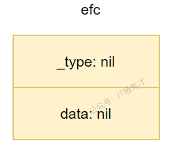
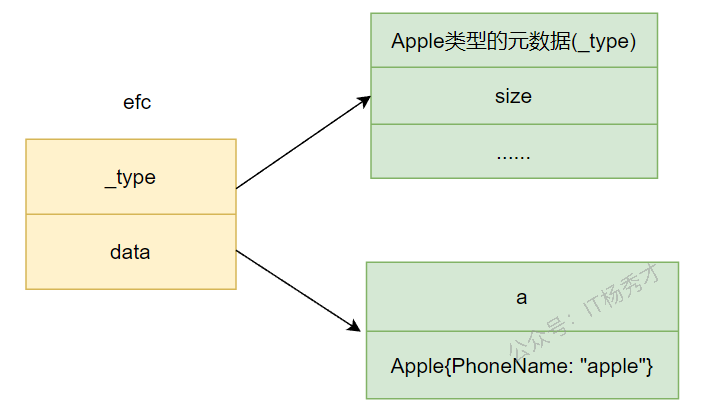
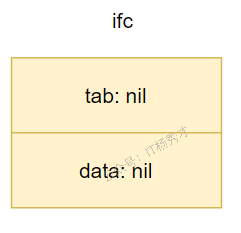
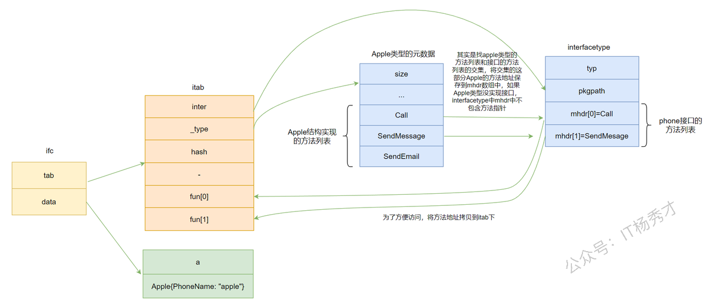
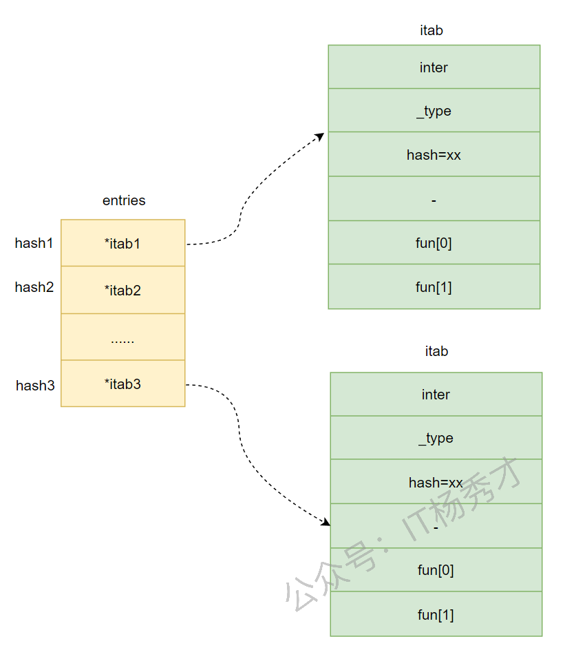

# **interface原理**

go语言并非传统意义上的面向对象的语言，他不像Java或者c++一样有类，继承等一些特性，但是我们也可以借助go语言中的struct和interface来实现这种面向对象的编程。在前面的基础章节我们了解到go语言中interface其实就是一组方法的声明，任何类型的对象实现了接口的全部方法就是这个接口的一个实现。这一章节我们主要分析一下interface的底层实现。

## **interface的底层原理**

### **空接口interface{}**

没有定义任何方法的接口为空接口，空接口可以接收任意数据类型，就是说可以将任意类型的数据赋值给一个空接口，空接口的结构定义位于`src/runtime/runtime2.go`,定义如下:

```go
type eface struct {
   _type *_type
   data  unsafe.Pointer
}
```

\_type：指向接口的动态类型元数据，即接口变量的类型

data：指向接口的动态值，data是一个指向变量本身的指针

#### **\_type是什么**

\_type 是 go 里面所有类型的一个抽象，里面包含了类型的大小，哈希，对齐以及k类型编号等信息，决定了data如何解释和操作，Go语言中几乎所有的数据结构都可以抽象成`_type`。关于\_type的定义在源文件`src/runtime/type.go`,具体定义如下：

```go
type _type struct {
   size       uintptr // 数据类型占用的空间大小
   ptrdata    uintptr // 前缀持有所有指针的内存大小
   hash       uint32  // 类型的hash值
   tflag      tflag   // 信息标志
   align      uint8   // 这种类型在内存中的对齐方式
   fieldAlign uint8
   kind       uint8   // 类型编号
   equal func(unsafe.Pointer, unsafe.Pointer) bool  // 类型的比较函数
   gcdata    *byte
   str       nameOff
   ptrToThis typeOff
}
```

什么是动态类型和动态值呢，举个例子

```go
package main

import "fmt"

type Apple struct {
   PhoneName string
}

func main() {

   a := Apple{PhoneName: "apple"}
   var efc interface{} 
   efc = a
   fmt.Println(efc) 
}
```

这里在第12行定义了一个接口类型实例efc，此时还未对efc赋值，它的结构如下图所示：



在第13行，对efc赋值了一个Apple类型的变量之后，其底层结构表现如下图所示：



其中\_type指针指向a变量的类型元数据，data指针指向a变量的值

### **非空接口**

包含方法列表的接口就是非空接口，例如下面定义的接口Phone就是一个非空接口：

```go
type Phone interface {
   Call()
}
```

非空接口的底层实现按与空接口有所不同，因为其多了方法列表，在底层实现中显然我们需要有地方来存储方法列表，非空接口的结构定义位于`src/runtime/runtime2.go`,定义如下:

```go
type iface struct {
   tab  *itab
   data unsafe.Pointer
}
```

data：指向接口的动态值，这里跟空接口一样

tab：指向一个itab的结构，itab结构里面存储值接口要求的方法列表和 data对应动态类型信息

下面看一下itab的结构定义，itab结构定义在`src/runtime/runtime2.go`，定义如下：

```go
type itab struct {
   inter *interfacetype
   _type *_type
   hash  uint32 // copy of _type.hash. Used for type switches.
   _     [4]byte
   fun   [1]uintptr // variable sized. fun[0]==0 means _type does not implement inter.
}
```

inter ：指向interfacetype结构的指针，interfacetype结构记录了这个接口类型的描述信息，主要是接口的方法列表

\_type：实际类型的指针，指向\_type结构，\_type结构保存了接口的动态类型信息，跟空接口的\_type一样，即赋值给这个接口的具体类型信息的元数据

hash：该类型的hash值，itab中的hash和itab.\_type中的hash相等，其实是从itab.\_type中拷贝出来的，目的是用于快速判断类型是否相等

fun：fun是一个指针数组，里面保存了实现了该接口的实际类型的方法(只包含接口中的方法)地址，这些方法地址实际上是从interfacetype结构中的mhdr拷贝出来的，为了在调用的时候快速定位到方法。如果该接口对应的动态类型没有实现接口的所有方法，那么itab.fun\[0]=0，表示断言失败，该类型不能赋值给该接口

interfacetype 保存了接口自身的元信息，下面看一下interfacetype结构

```go
type interfacetype struct {
   typ     _type   // 类型信息
   pkgpath name    // 包路径
   mhdr    []imethod  // 接口的方法列表
}
```

这里主要关注的是mhdr这个字段，定义的接口的方法里表就保存在mhdr数组里

下面还是通过例子看一下，赋值一个非空接口对应的底层结构变化

```go
package main

import "fmt"

type Apple struct {
   PhoneName string
}

func (a Apple) Call() {
   fmt.Printf("%s有打电话功能\n", a.PhoneName)
}

func (a Apple) SendMessage() {
   fmt.Printf("%s有发短信功能\n", a.PhoneName)
}

func (a Apple) SendEmail() {
   fmt.Printf("%s有发邮件功能\n", a.PhoneName)
}

type Phone interface {
   Call()
   SendMessage()
}

func main() {
   a := Apple{PhoneName: "apple"}
   var ifc Phone
   ifc = a          
   fmt.Println(ifc)
```

在程序第28行，赋值之前，ifc的机构如下图所：



在第29行，给ifc赋值一个包含方法的结构体a之后，ifc的结构如下图：



赋值过程中，data指针其实还是和空接口一样指向具体类型值，这里指向变量a。tab指针则是指向itab这个结构体，itab结构创建的创建主要就分为3部分：

1. \_type字段保存接口的动态类型信息，本例中，\_type指针指向Apple类型的元数据

2. inter保存接口本身的一些信息，这里重要处理方法列表，本质上其实是求接口类型(Phone)和具体类型(Apple)的方法列表的交集，将具体类型(Apple)这部分交集的方法地址保存到interfacetype的mhdr数组中，假设具体类型(Apple)没有实现接口(Phone)，那么这里mhdr数组将不包含任何方法的指针

3. 最后再将mhdr数组中的方法地址拷贝到itab的fun数组中，方便调用方法的时候快速找到方法地址，如果具体类型(Apple)没有实现接口(Phone)，那么这里itab.fun\[0]=0

#### **itab缓存**

通过前面的分析我们知道，在给一个非空接口赋值的时候，itab里面主要是保存具体类型的类型元数据和方法列表，但是我们在给接口赋值的时候，我们可以赋值多个类型相同的动态类型，比如我们可以由如下代码：

```go
 var ifc Phone
 a := Apple{PhoneName: "apple1"}
 b := Apple{PhoneName: "apple2"}
 C := Apple{PhoneName: "apple3"}
 ifc = a
 ifc = b
 ifc = c
```

同类型的接口多次赋值，虽然具体类型的值不同，但是他们的类型相同，方法列表也相同，显然这个itab结构体是可以被复用的，如果我们每次都创建一个新的itab的话，性能无疑会大大下降。所以可以把用到的itab结构体缓存起来，每个非空的interface的接口类型和具体类型就可以唯一确定一个类型的itab。

##### **itabTable**

go语言采用itabTable这个结构来缓存所有的itab结构，itabTable的结构定义在`src/runtime/iface.go`，定义如下：

```go
type itabTableType struct {
   size    uintptr              // entries数组的长度
   count   uintptr             // 当前数组中实际itab的数量
   entries [itabInitSize]*itab // 哈希表
}
```

itabTable实际用来存储itab结构的其实是这个entries 结构，entries 是一个hash表，key为接口类型与实际类型分别哈希后的异或值

```go
func itabHashFunc(inter *interfacetype, typ *_type) uintptr {    
    return uintptr(inter.typ.hash ^ typ.hash)
}
```

所以key为整形，所以在实现的时候，go语言采用了空间换时间的思想，通过一个数组来实现，数组的每个元素为itab指针，其结构如下：



我们在查找一个itab是否存在的时候，

1. 先计算接口类型的哈希值hash1和实际类型的哈希值hash2

2. hash1与hash2做异或运算得到最终哈希值hash

3. 在entries数组中找到下标为hash的位置

4. 如果能查询到对应的itab指针(这里需要比较接口类型和实际类型，因为可能出现产生hash冲突，槽位被占用的情况)，就直接拿来使用。若没有就要再创建，然后添加到itabTable中。

对于hash冲突问题，采用的是开放地址法，根据计算的空位发现槽位被占用，则采用**二次寻址法**在数组后面寻找空位插入


