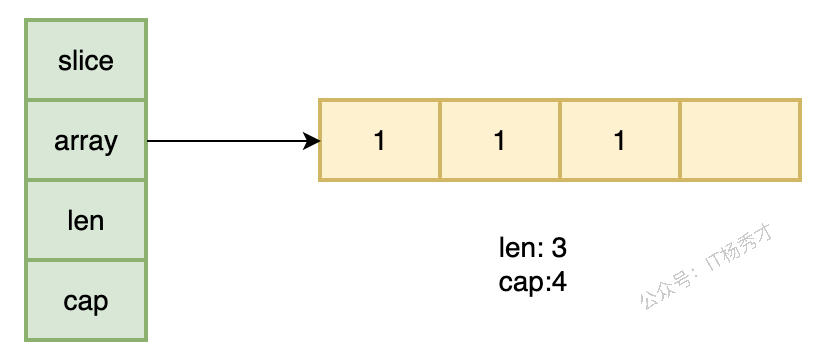
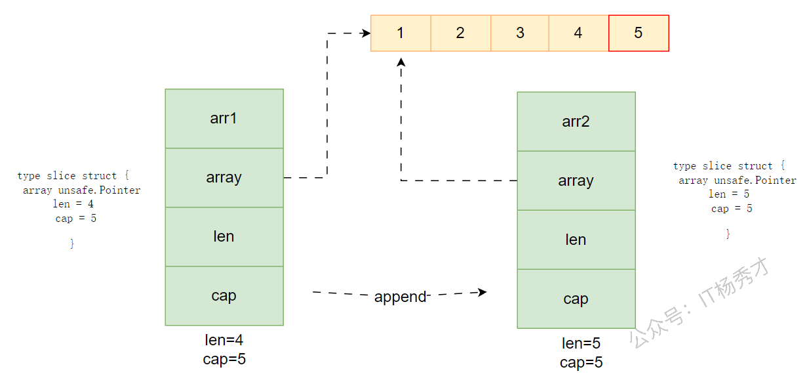
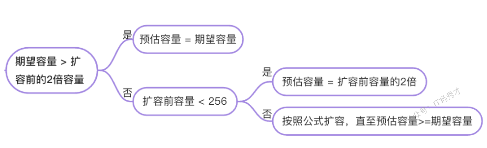

---
tags:
  - Go
  - golang
  - go原理深入
  - slice原理
---

# **slice原理**

## **slice是什么**

go语言中slice可以理解为动态数组，区别于数组，其长度不是固定的，在使用时，我们不必担心其容量大小不够。当需要往切片追加元素时，如果切片容量大小不足，会自动扩容。基于其这个特性，我们在真正编程过程中，更多的会使用切片，而不是数组。

在使用过程中，区别于数组，声明切片时，也只需要制定声明数据类型，而不需要指定大小

```go
var arrs []int
```

## **slice的数据结构**

切片的底层数据结构定义如下：

```go
type slice struct {
   array unsafe.Pointer
   len   int
   cap   int
}
```



slice结构 包含三个字段，array 类型为unsafe.Pointer，还有两个int类型的字段len和cap。

* **array：是一个指针变量，指向一块连续的内存空间，即底层数组结构**

* **len：当前切片中数据长度**

* **cap：切片的容量**

**注意：cap是大于等于len的，当cap大于len的时候，说明切片未满，它们之间的元素并不属于当前切片。**

## **slice初始化**

切片的初始化有三种方式：

1. 通过已有切片初始化（通过 : 操作进行截取）

2. 通过字面量初始化

3. 通过make关键字初始化

```go
slice := slice1[1:5]          // 从切片slice1初始化一个新的切片slice，slice的元素为slice1中的下标为1到下标为4的元素
slice := []int{1,1,1}
slice := make([]int, 3)     // 第一个参数为类型，第二个参数为len
slice := make([]int, 3, 4)  // 第一个参数为类型，第二个参数为len，第三个参数为cap
```

注意这里两种make创建的方式，当传递了容量参数时，若传递的参数比前面len的参数值大，那么实际创建的切片大小时是多余元素个数的，说明预留了空间。如果不指定cap，则默认创建cap和len大小相同的切片。

示例：

```go
package main

import (
   "fmt"
)

func main(){
   arr1 := make([]int,3,5)
   arr2 := make([]int,3)
   fmt.Printf("arr1,len=%d, cap=%d\n",len(arr1),cap(arr1))
   fmt.Printf("arr2,len=%d, cap=%d\n",len(arr2),cap(arr2))

   arr3 := []int{1,2,3,4,5}
   arr4 := arr3[1:3]
   fmt.Printf("arr3=%v\n",arr3)
   fmt.Printf("arr4=%v\n",arr4)
}
```

运行结果：

```go
arr1,len=3, cap=5
arr2,len=3, cap=3
arr3=[1 2 3 4 5]
arr4=[2 3]
```


## **Slice操作**

#### **slice截取**

从前面切片的数据结构分析我们可以知道切片在内存底层其实是一块连续的内存空间，跟数组一样，所以也可以通过下标的方式对切片进行截取。

```go
package main

import (
   "fmt"
)

func main(){
   arr1 := []int{1,2,3,4,5,6,7,8}
   arr2 := arr1[2:4]   // 前闭后开，不包括下标为4的元素
   fmt.Printf("arr1=%v, cap=%d\n",arr1,cap(arr1))
   fmt.Printf("arr2=%v, cap=%d\n",arr2,cap(arr2))
   arr2[0] = 100
   fmt.Printf("arr1=%v, cap=%d\n",arr1,cap(arr1))
   fmt.Printf("arr2=%v, cap=%d\n",arr2,cap(arr2))
}
```

运行结果：

```go
arr1=[1 2 3 4 5 6 7 8], cap=8
arr2=[3 4], cap=6
arr1=[1 2 100 4 5 6 7 8], cap=8
arr2=[100 4], cap=6
```

可以看到，在切片截取的时候遵循的原则是前闭后开的，且截取之后的切片，容量大小为从新切片的第一个元素开始算，到原切片的容量末尾。

注意：被截取出来的新切片底层仍然指向原切片的底层数据

这一点尤其需要注意，在我们更改新切片的值的时候，可能会改变原切片。


如上图所示，比如通过截取的方式由slice派生出一个新额的切片slice1，其实底层他们都是指向的同一块数据区域，只是两个切片的下表对应的底层数组的数据不同，`slice[1]=`2，而`slice1[0]=`2，他们指向同一个元素，所以当修改`slice1[0]`的值，势必会影响原始数组。

#### **slice复制**

下面来看一下slice的复制操作，在前面分析中我们知道，通过截取创建的新的切片其底层指向的是同一块内存区域，那么通过复制创建的切片是否也是这样呢？

看个具体示例：

```go
package main

import "fmt"

func main() {
   arr1 := []int{1, 2, 3, 4, 5}
   arr2 := arr1
   arr2[0] = 100
   fmt.Printf("arr1=%v\n", arr1)
   fmt.Printf("arr2=%v\n", arr2)
   
   arr3 := [3]int{1, 2, 3}
   arr4 := arr3
   arr4[0] = 100
   fmt.Printf("arr3=%v\n", arr3)
   fmt.Printf("arr4=%v\n", arr4)
}
```

运行结果：

```go
arr1=[100 2 3 4 5]
arr2=[100 2 3 4 5]
arr3=[1 2 3]      
arr4=[100 2 3]    
```

从程序结果可以看到，修改arr2影响了arr1，复制后的切片也和原切片指向同一块内存区域，会互相影响。但是数组的复制却不会出现这种情况，说明数组的复制会在底层会连同复制一块内存区域，与原数组互不影响

切片的赋值可以这样理解，如下如


复制操作原理其实很好理解，复制其实是复制了前面所说的slice 这个结构体，而在slice结构中真正与数据相关的其实是一个只想指向底层数组的一个array指针，所以这里其实是复制了一个指针而已，但是两个不同的指针还是指向同一块区域，所以对一个切片的修改会影响到另一个。

但是两个不同的指针还是指向同一块区域，所以对一个切片的修改会影响到另一个。

#### **slice追加扩容**

slice是动态数组，大小不固定，可以往后追加元素，追加的方法是通过append函数来实现，看一个有意思的例子：

```go
package main

import "fmt"

func main() {
   arr1 := make([]int, 0, 4)
   arr1 = append(arr1, 1)
   arr2 := append(arr1, 2)
   arr3 := append(arr1, 3)
   fmt.Printf("arr1=%v, addr1=%p\n", arr1, &arr1)
   fmt.Printf("arr2=%v, addr2=%p\n", arr2, &arr2)
   fmt.Printf("arr3=%v, addr3=%p\n", arr3, &arr3)
}
```

运行结果：

```go
arr1=[1], addr1=0xc000098060
arr2=[1 3], addr2=0xc000098078
arr3=[1 3], addr3=0xc000098090
```

这里为什么arr2和arr3的结果是一样都是`[1,3]`呢，为什么arr2不是`[1,2]`？


原理是这样的，在前面的分析中我们知道了切片的结构定义，`type slice struct {...}`, Go 语言内置函数 append 参数是值传递，所以 append 函数在追加新元素到切片时，append 会生成一个新切片，并且将原切片的值拷贝到新切片。注意这里的新切片并不是指底层的数据结构，而是指`slice `这个结构体。所以我们每调用一次append函数，都会产生一个新的slice结构体，但是他们底层都指向同一块连续的内存区域，即共享底层数组，所以执行`arr3 := append(arr1, 3)`将`arr2`底层的数据`1，2`给覆盖了。

原理是这样的，在前面的分析中我们知道了切片的结构定义，`type slice struct {...}`, Go 语言内置函数 append 参数是值传递，所以 append 函数在追加新元素到切片时，append 会生成一个新切片，并且将原切片的值拷贝到新切片。注意这里的新切片并不是指底层的数据结构，而是指`slice `这个结构体。所以我们每调用一次append函数，都会产生一个新的slice结构体，但是他们底层都指向同一块连续的内存区域，即共享底层数组，所以执行`arr3 := append(arr1, 3)`将`arr2`底层的数据`1，2`给覆盖了。

假设原切片`arr1`中由4个元素`1，2，3，4`，我们执行语句`arr2=append(arr1,5)`，其过程如下图：



最终会有两个slice结构体，但是他们都指向同一块内存区域。

###### **在追加元素时，slice容量不足怎么办？**

当往切片追加元素时，如果切片容量不足，会自动扩容，具体的扩容策略如下：

1.17之前

1. 首先看新的容量是否超过原容量的两倍，若超过原容量两倍，则扩容后的容量是用新容量大小

2. 新容量未超过原容量两倍，则看原切片容量是否小于1024，若小于1024，则新切片容量为原切片容量的两倍，若大于等于1024，则会反复地再原切片容量上增加1/4，直到新容量大于等于需要的容量

1.18及以后



扩容公式：
```
newcap = oldcap+(oldcap+3*256)/4
```


简单看个样例：

```go
package main

import "fmt"

func main() {
   arr := make([]int, 4, 4)
   fmt.Printf("cap = %d\n", cap(arr))
   arr = append(arr, 1)
   fmt.Printf("cap = %d\n", cap(arr))
}
```

运行结果：

```go
cap = 4
cap = 8
```

容量做了翻倍

#### **slice完全复制**

在前面我们分析了slice的复制其底层仍然执行同一块内存区域，这样在使用中可能会带来问题，比如有时候我们想要完全复制出一个新的切片，二者用不同的底层数组，这样使用起来互不干扰，我们可以使用copy函数实现这个功能。

```go
package main

import "fmt"

func main() {
   arr := []int{1, 2, 3, 4}
   arr1 := make([]int, 3)
   cnt := copy(arr1, arr)
   fmt.Printf("cnt=%d\n", cnt)
   fmt.Printf("arr1=%v\n", arr1)
}
```

运行结果：

```go
cnt=3
arr1=[1 2 3]
```

copy函数将第二个参数切片中的元素拷贝到第一个参数切片中，如果第一个参数切片容量不够，则返回的cnt的值为第一个切片容量大小，只会成功复制cnt个元素。


