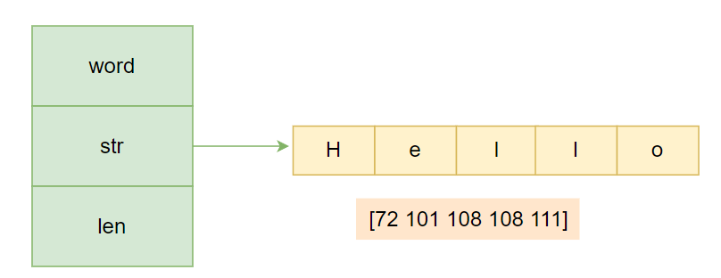

---
tags:
  - Go
  - golang
  - go进阶语法
  - string原理
---

# string原理

## string是什么

在我们编程过程中，字符串可以说是我们使用的最多的一个数据结构了，凡是涉及到文本处理的地方，我们都会用到字符串。在go语言中，字符串其实就是一串由UTF-8编码的字符序列。

接下来我们看一下官方库对`string`的一个描述。
```go
var text string
```
在IDE里面定义一个 `text` 的 `string` 变量，点击 `string` 跳转到其类型定义的地方，可从源代码看到对 `string` 的描述，源代码的位置在 `src/builtin/builtin.go`，描述如下：

```go
// string is the set of all strings of 8-bit bytes, conventionally but not
// necessarily representing UTF-8-encoded text. A string may be empty, but
// not nil. Values of string type are immutable.
type string string
```
翻译一下，可以这样理解：
- 字符串是所有`8bit`字节的集合，但不一定是 `UTF-8` 编码的文本
- 字符串可以为`empty`，但不能为 `nil` ，`empty`字符串就是一个没有任何字符的空串`""`
- 字符串不可以被修改，所以字符串类型的值是不可变的

所以字符串的本质是一串字符数组，每个字符在存储时都对应一个整数，也有可能对应多个整数，具体要看字符串的编码方式。可以看个例子：

```go
package main

import (
   "fmt"
   "time"
)

func main() {
   ss := "Hello"
   for _, v := range ss {
      fmt.Printf("%d\n", v)
   }
} 
```

运行结果：

```go
s[0]: 72
s[1]: 101
s[2]: 108
s[3]: 108
s[4]: 111
```
可以看到，字符串的位置每个字符对应这个1个整数，这个整数就是字符的`UTF-8`编码值。

## string数据结构

在Go语言中，`string`类型在底层是一个结构体，这个结构体在`src/runtime/string.go`文件中定义，如下：

```go
type stringStruct struct {
    str unsafe.Pointer
    len int
}
```

`stringStruct` 包含两个字段，`str`类型为`unsafe.Pointer`，还有一个`int`类型的`len`字段。

- `str` 指向字符串的首地址
- `len` 表示字符串的长度

定义一个 `word` 字符串，并打印其数据结构：

```go
word := "Hello"
}
```
其底层结构如下图：



在本例中，`len` 的长度为5，表示 `word` 这个字符串占用的字节数，每个字节的值如图中所示。这里需要注意，`len` 字段存储的是实际的字节数，而不是字符数，所以对于非单字节编码的字符，其结果可能多于字符个数。

我们知道了在 `runtime` 里 `string` 的定义，但是我们平常写代码似乎并没有用到 `stringStruct` 结构，它是在什么地方被用到呢？

其实 `stringStruct`是字符串在运行时状态下的表现，当我们创建一个 `string` 的时候，可以理解为有两步：

1. 根据给定的字符创建出 `stringStruct` 结构
2. 将 `stringStruct` 结构转化为 `string` 类型

通过观察字符串的结构定义我们可以发现，其定义中并没有一个表示容量(Cap)的字段，所以意味着字符串类型并不能被扩容，字符换上的写操作包括拼接，追加等等都是通过拷贝来实现的。

## string与[]byte的互相转换

前面我们说了，`string`是只读的，不可以被改变，但是我们在编码过程中，进行重新赋值也是很正常的，既然可以重新赋值，为什么说不能被修改呢，这不是互相矛盾吗？

这里要弄弄清楚一个概念，字符串修改并不等于重新赋值。我们在开发中所使用的，其实是对字符串的重新赋值，而不是修改。

```go
str := "Hello"
str = "Golang"   // 重新赋值
str[0] = "I"     // 修改，不允许
```

示例：

```go
package main

import "fmt"

func main() {
   var ss string
   ss = "Hello"
   ss[1] = "A"
   fmt.Println(ss)
}
```

运行结果：

```go
./main.go:10:12: cannot assign to ss[1]
```
程序会报错，提示 `string`是不可修改的。这样一分析，那么可不可以将字符串转化为字节数组，然后通过下标修改字节数组，再转化回字符串呢，答案是可行的。

相互转化的语法如下例所示：

```go
package main

import "fmt"

func main() {
   var ss string
   ss = "Hello"
   strByte := []byte(ss)
   strByte[1] = 65
   fmt.Println(string(strByte))
}
```

运行结果：

```go
HAllo
```

`Hello`变成了`HAllo`，好像达到了我们的目的。这里需要注意，虽然这种方式看似可行，修改了字符串`Hello`，但其实并不是我们所见的这样。最终得到的只是`ss`字符串的一个拷贝，源字符串并没有变化。

### string与[]byte的转化原理

`string`与`[]byte`的转化其实会发生一次内存拷贝，并申请一块新的切片内存空间

`byte`切片转化为`string`，大致过程分为两步：

1. 新申请切片内存空间，构建内存地址为`addr`，长度为`len`
2. 构建 `string`对象，指针地址为`addr`，`len`字段赋值为`len`（`string.str = addr；string.len = len；`）
3. 将原切片中数据拷贝到新申请的`string`中指针指向的内存空间

![string与[]byte的转化](../../assets/img/go语言系列/string原理/string原理2.png)

`string`转化为`byte`数组同样简单，大致分为两步：

1. 新申请切片内存空间
2. 将`string`中指针执行内存区域的内容拷贝到新切片

![string与[]byte的转化](../../assets/img/go语言系列/string原理/string原理3.png)

## []byte转化为string是否一定会发生内存拷贝

很多场景中会用到[]byte转化为string，但是并不是每一次转化，都会像上述过程一样，发生一次内存拷贝。在什么情况下不会发生拷贝呢？

转化为的字符串被用于临时场景，举几个例子：

1. 字符串比较：`string(ss) == "Hello"`
2. 字符串拼接：`"Hello" + string(ss) + "world"`
3. 用作查找，比如`map`的`key`，`val := map[string(ss)]`

这几种情况下，`[]byte`转化成的字符串并不会被后面程序用到，只是在当前场景下被临时用到，所以并不会拷贝内存，而是直接返回一个 `string`，这个 `string` 的指针 (`string.str`) 指向切片的内存。

## 字符串声明

Go语言中以字面量来声明字符串有两种方式，双引号和反引号:

```go
str1 := "Hello World"
str2 := `Hello
Golang`
```

使用双引号声明的字符串和其他语言中的字符串没有太多的区别，但是这种使用双引号的字符串只能用于单行字符串的初始化，当字符串里使用到一些特殊字符，比如双引号，换行符等等需要用`\`进行转义。但是，反引号声明的字符串没有这些限制，字符内容即为字符串里的原始内容，所以一般用反引号来声明的比较复杂的字符串，比如`json串`。


```go
json := `{"hello": "golang", "name": ["zhangsan"]}`
```

## 为什么这么设计

可能大家都会考虑到，为什么一个普通的字符串要设计这么复杂，还需要使用指针。暂时没找到官方文档的说明。

个人猜想，当遇到一个非常长的字符时，这样做使得`string`变得非常轻量，可以很方便的进行传递而不用担心内存拷贝。虽然在Go 中，不管是引用类型还是值类型参数传递都是值传递。但指针明显比值传递更节省内存。

## 字符串拼接

Go语言中字符串是不可改变的，所以我们在对字符串进行拼接的时候会有内存的拷贝，存在性能损耗。常见的你字符串拼接有以下几种方式：

- +操作符
- fmt.Sprintf
- bytes.Buffer
- strings.Builder
- append
- string.Join

### 性能测试

采用`testing`包下`benchmark`测试其性能

```go
package main

import (
    "bytes"
    "fmt"
    "strings"
    "testing"
)

var loremIpsum = `
Lorem ipsum dolor sit amet, consectetur adipiscing elit. Maecenas non odio eget quam gravida laoreet vitae id est. Cras sit amet porta dui. Pellentesque at pulvinar ante. Pellentesque leo dolor, tristique a diam vel, posuere rhoncus ex. Mauris gravida, orci eu molestie pharetra, mi nibh bibendum arcu, in bibendum augue neque ac nulla. Phasellus consectetur turpis et neque tincidunt molestie. Vestibulum diam quam, sodales quis nulla eget, volutpat euismod mauris.
`

var strSLice = make([]string, LIMIT)

const LIMIT = 1000

func init() {
    for i := 0; i < LIMIT; i++ {
       strSLice[i] = loremIpsum
    }
}

func BenchmarkConcatenationOperator(b *testing.B) {
    for i := 0; i < b.N; i++ {
       var q string
       for _, v := range strSLice {
          q = q + v
       }
    }
    b.ReportAllocs()
}

func BenchmarkFmtSprint(b *testing.B) {
    for i := 0; i < b.N; i++ {
       var q string
       for _, v := range strSLice {
          q = fmt.Sprint(q, v)
       }
    }
    b.ReportAllocs()
}

func BenchmarkBytesBuffer(b *testing.B) {
    for i := 0; i < b.N; i++ {
       var q bytes.Buffer

       q.Grow(len(loremIpsum) * len(strSLice))

       for _, v := range strSLice {
          q.WriteString(v)
       }
       _ = q.String()
    }
    b.ReportAllocs()
}

func BenchmarkStringBuilder(b *testing.B) {
    for i := 0; i < b.N; i++ {
       var q strings.Builder

       q.Grow(len(loremIpsum) * len(strSLice))

       for _, v := range strSLice {
          q.WriteString(v)
       }
       _ = q.String()
    }
    b.ReportAllocs()
}

func BenchmarkAppend(b *testing.B) {
    for i := 0; i < b.N; i++ {
       // var q = make([]byte, 0, len(loremIpsum)*len(strSLice))
       var q []byte
       for _, v := range strSLice {
          q = append(q, v...)
       }
       _ = string(q)
    }
    b.ReportAllocs()
}

func BenchmarkJoin(b *testing.B) {
    for i := 0; i < b.N; i++ {
       var q string
       q = strings.Join(strSLice, "")
       _ = q
    }
    b.ReportAllocs()
}
```

运行结果：

```go
goos: windows
goarch: amd64
pkg: gostudy/test
cpu: AMD Ryzen 7 7745HX with Radeon Graphics
BenchmarkConcatenationOperator
BenchmarkConcatenationOperator-16             54          18706593 ns/op
        238063081 B/op      1010 allocs/op
BenchmarkFmtSprint
BenchmarkFmtSprint-16                         24          63046967 ns/op
        488318771 B/op      4275 allocs/op
BenchmarkBytesBuffer
BenchmarkBytesBuffer-16                    15199             74857 ns/op
          950280 B/op          2 allocs/op
BenchmarkStringBuilder
BenchmarkStringBuilder-16                  30217             37815 ns/op
          475140 B/op          1 allocs/op
BenchmarkAppend
BenchmarkAppend-16                          5632            307936 ns/op
         3011173 B/op         24 allocs/op
BenchmarkJoin
BenchmarkJoin-16                           32806             42271 ns/op
          475140 B/op          1 allocs/op
PASS
```

可以看到，采用`sprintf`拼接字符串性能是最差的，性能最好的方式是`string.Builder`和`string.Join`。

所以平时代码中，我们在拼接字符串的时候，最好采用后面几种方式，不要直接采用`+`或者`sprintf`，`sprintf`一般用于字符串的格式化而不用于拼接。

### 性能原理分析

| 方法 | 说明 |
| --- | --- |
| + | + 拼接 2 个字符串时，会生成一个新的字符串，开辟一段新的内存空间，新空间的大小是原来两个字符串的大小之和，所以没拼接一次买就要开辟一段空间，性能很差 |
| Sprintf | Sprintf 会从临时对象池中获取一个 对象，然后格式化操作，最后转化为string，释放对象，实现很复杂，性能也很差 |
| strings.Bulider | 底层存储使用[] byte，转化为字符串时可复用，每次分配内存的时候，支持预分配内存并且自动扩容，所以总体来说，开辟内存的次数就少，性能最好 |
| bytes.Buffer | 底层存储使用[] byte，转化为字符串时不可复用，底层实现和strings.Builder差不多，性能比strings.Builder略差一点，区别是bytes.Buffer 转化为字符串时重新申请了一块空间，存放生成的字符串变量，而 strings.Builder 直接将底层的 []byte 转换成了字符串类型返回了回来，性能仅次于strings.Builder |
| append | 直接使用[]byte扩容机制，可复用，支持预分配内存和自动扩容，性能只比+和Sprintf好，但是如果能提前分配好内存的话，性能将会仅次于strings.Bulider |
| string.Join | strings.join的性能约等于strings.builder，在已经字符串slice的时候可以使用，未知时不建议使用，构造切片也是会有性能损耗的 |

**最终做一下总结：**
> 性能对比：`strings.builder` ≈ `strings.join` > `bytes.buffer` > `append` > `+` > `fmt.sprintf`
 - 如果进行少量的字符串拼接时，直接使用`+`操作符是最方便也算是性能最高的，就无需使用`strings.builder`。
 - 如果进行大量的字符串拼接时，使用`strings.builder`是最佳选择。

