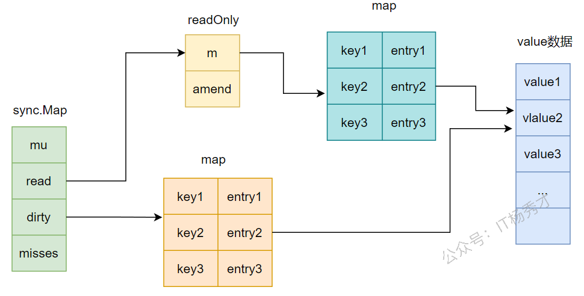
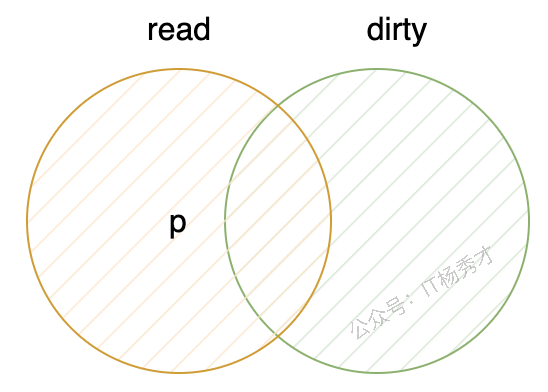
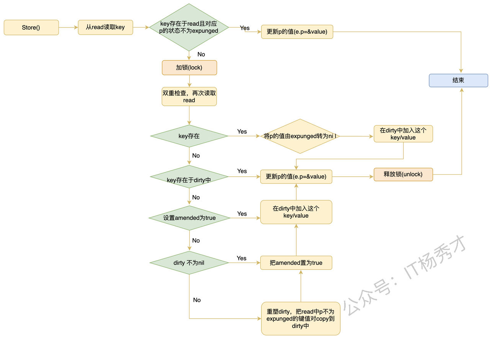
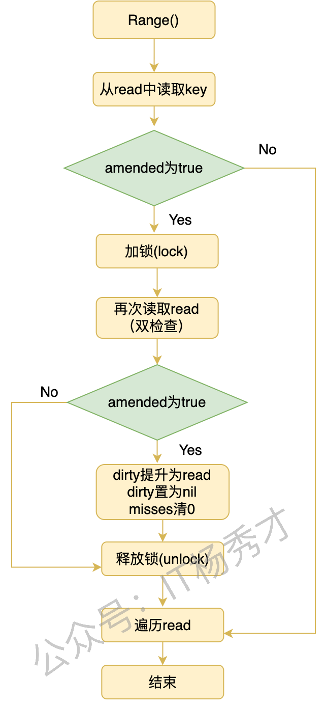
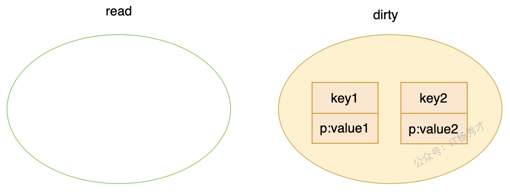

---
tags:
  - Go
  - golang
  - go原理深入
  - sync.map原理
---

# sync.map原理

## sync.map是什么

sync.map是go语言在sync包下提供的一个可以提供并发访问的map。我们知道go语言的map是非线程安全的，对map的操作不是原子操作，所以在对原生的map进行并发读写的时候，很容易造成panic。


这里我们可能会想到，我们可以对map加一个锁来让其的每一次操作都受到保护，这样就实现了并发安全。但是这样对一整个map都加锁，无疑在性能上会大打折扣。所以，go语言在其1.9的版本中提供了一个并发安全的字段类型sync.Map。

从功能上看，sync.map是一个读写分离的map，采用了空间换时间的策略来提高数据的读写性能，其内部其实用了两个map来实现，一个read map和一个dirty map。在并发处理上，相比于我们前面提到的普通map的无脑加锁操作，sync.map将读和写分开，读数据优先从read中读取，对read的操作是不会加锁的，当read读取不到才会去dirty读，而写数据只会在dirty写，只有对dirty操作时需要加锁的，这样区分加锁时机，就提升了并发性能。

## sync.map的数据结构

先来看一下sync.Map的结构定义，sync.Map定义在源文件src/sync/map.go里面，我这里去掉了注释

```go
type Map struct {
   mu Mutex             //  用于保护dirty字段的锁
   read atomic.Value    // 只读字段，其实际的数据类型是一个readOnly结构
   dirty map[interface{}]*entry  //需要加锁才能访问的map，其中包含在read中除了被expunged(删除)以外的所有元素以及新加入的元素
   misses int // 计数器，记录在从read中读取数据的时候，没有命中的次数，当misses值等于dirty长度时，dirty提升为read
}
```

这里主要看一下read这个字段，read字段的类型是atomic.Value，但是在使用中里面其实存储的是readOnly结构，readOnly结构定义如下：

```go
// readOnly is an immutable struct stored atomically in the Map.read field.
type readOnly struct {
   m       map[interface{}]*entry   // key为任意可比较类型，value位为entry指针的一个map
   amended bool // amended为true，表明dirty中包含read中没有的数据，为false表明dirty中的数据在read中都存在
```

下面看一下entry这个结构

```go
type entry struct {
    p unsafe.Pointer  // p指向真正的value所在的地址
}
```

这个p有三种取值：

* p为nil，标记删除状态，代表这个key被删除了，此时dirty要么为nil，要么也存在这个key

* p为expunged：标记删除状态，此时dirty非空，p存在于read，但不存在于dirty

* p为正常值：entry表示正常的value

entry这个字段在sync.map里被频繁的用到，他作为dirty这个map的value类型以及readOnly结构体中m这个字段对应的map的value类型


这里其实很巧妙，在dirty和readOnly里面的两个map的value并不是一个对象，而是一个指向任意类型的对象的指针，所以，在这两个map都非空的情况下，map的read字段和dirty字段会包含相同的数据项，如果通过read字段更改了这个项的值，dirty字段会读取到这个项的新值，因为它们指向的是同一个地址

sync.Map的底层结构如下图：



在map的结构定义中介绍dirty字段的时候说到，dirty这个map包含在read中除了被expunged(删除)以外的所有元素，下面重点说一下**expunged**这个字段

**expunged**这个字段的作用是用来标识map中的某个key是否被删除，注意，这里知识标记删除，并没有真正的删除，所以**expunged**是map中用来对某个key做假删除动作的，当从sync.Map删除某个key的时候，将这个key对应的value标记为nil或者**expunged，**&##x540E;面在对这个key进行删除

## sync.map方法

sync.map跟map一样，提供了数据的增删改查功能，这里我们对照map从源代码来分析一下sync.map各个功能的具体实现

* `Store()`：更新/插入一个键值对

* `Load()`：返回一个key对应的value

* `Delete()`：删除一个键值对

* `Range()`：对sync.Map进行遍历

### **`Store`**

sync.map.Store()方法既可以用来新增键值对，也可用用来更新键值对。

* 更新键值对：

  * key存在于read中，那么这时key对应的p有三种情况

    * p==expunged，当前key存在于read，但是key不存在于dirty，dirty也不为空，read包含dirty中不存在的key，dirty也包含read中不存在的key，这种情况下p的值为expunged，形式如下图。在这种情况下，不能单单只操作read，还要加锁同步更新dirty，将这个key加入到dirty中，将e.p的保存新传入的value



    * p==nil，key存在于read，此时被标记删除，此时还没有完成dirty的重塑

    * p==\&value，p指向的是一个正常值，没有被标记删除

* 新增键值对（只操作dirty）

  * dirty为nil，由于read的misses次数达到了dirty的长度，dirty刚刚提升为read，还没有被插入过新的key，此时为nil，此时要插入新的key，则要根据read重建dirty，在重建的时候，原来被标记删除未nil的键值对过滤掉，不复制到dirty，剩余的键值对都copy到dirty。并且还要改一下read里被标记删除的key的状态，由原来的nil改为expunged。

  * dirty不为nil，直接在dirty中插入新的键值对

其源码如下：

```go
// Store 用于保存或者事更新一个键值对
func (m *Map) Store(key, value any) {
   read, _ := m.read.Load().(readOnly)  // 判断key是否存在于read中
   /*****
   假设key存在于read中，此时p有三种情况，这里先记住，后面会图解分析这三种情况
   1. p == nil, key被标记删除了，此时dirty为空:dirty==nil，这个dirty中没有任何数据元素
   2. p == expunged, key被标记删除，但此时dirty不为空，且dirty中存在一些key，这些key不再read中
   3. p == &value，p指针指向一个正常的value，
   ******/
   // key存在与read中，且此时read中m这个map的key对应的entry的p指针不满足p == expunged，这里走tryStore逻辑，直接使用cas原子操作修改value
   if e, ok := read.m[key]; ok && e.tryStore(&value) {  
      return
   }
   m.mu.Lock()   // 加锁
   read, _ = m.read.Load().(readOnly)     //双重检查，怕执行后续逻辑的时候，read已被其他goroutine修改
   if e, ok := read.m[key]; ok {
      if e.unexpungeLocked() {
         // key被标记删除，p处于expunged状态，表明这个key在read中，但不再dirty中
         // 并且此时dirty非空，所以要保证dirty中包含map所有的key，就要把这个key加入到dirty中，并且修改e.p指向新的value
         m.dirty[key] = e    // 把这个key加入到dirty中
      }
      e.storeLocked(&value)    // 修改e.p指向新的value
   } else if e, ok := m.dirty[key]; ok {  // key不再read中，但存在于dirty中
      e.storeLocked(&value)    // 直接修改e.p指向新的value
   } else {                    // key既不在read中，也不再dirty中，是一个新的key，
      if !read.amended {  // amended为false，表明dirty中的keu在read中都存在
         // 先判断dirty是否为空，因为有一种情况，当read的未命中次数几misses达到dirty长度的时候，会拷贝整个dirty到read，即重塑过程
         // 发生重塑的时候，dirty中的所有key都会存在于read中，但是dirty在重塑完之后，会被立马置为nil，所以这里要做一个判断
         m.dirtyLocked() // 根据read重建dirty对象，将read中的key/value全部复制到dirty中，保证dirty中包含map中所有的key
         m.read.Store(readOnly{m: read.m, amended: true}) // 更改read的amended为true，因为接下来要在dirty中插入一个新的keu，这个keu存在与dirty，但不存在于read
      }
      m.dirty[key] = newEntry(value)   // 在dirty中加入新key/value
   }
   m.mu.Unlock() // 解锁
}
```

`tryStore()`方法

```go
// 将entry中的p指针，e.p指向value，即尝试将value的值存在e的p指针中
func (e *entry) tryStore(i *interface{}) bool {
   for {
      p := atomic.LoadPointer(&e.p)
      // 上面解释过，出现这种情况，说明dirty不为空，且dirty中存在一些key，这些key不再read中，不能仅仅只更新read，还要加锁更新dirty，所以直接返回false
      if p == expunged {   
         return false
      }
      // 原子操作更新value的值
      if atomic.CompareAndSwapPointer(&e.p, p, unsafe.Pointer(i)) {
         return true
      }
   }
}
```

`unexpungeLocked() `方法

```go
func (e *entry) unexpungeLocked() (wasExpunged bool) {
   // e.p从expunged修改为nil，操作成功返回true
   // 这里为什么要改为nil，通过上面的调用逻辑可以知道，后续会将这个key加入到dirty中，这样这个key就既存在与read，又存在与dirty，所以状态要改一下
   return atomic.CompareAndSwapPointer(&e.p, expunged, nil)
}
```

`storeLocked()`方法

```go
// 原子操作，将i存储到e.p中
func (e *entry) storeLocked(i *interface{}) {
   atomic.StorePointer(&e.p, unsafe.Pointer(i))
}
```

`dirtyLocked()`方法

```go
func (m *Map) dirtyLocked() {
   if m.dirty != nil { // 如果dirty对象已经存在，则不需要再创建了，直接返回
      return
   }
   // 根据read重新创建一个dirty对象
   read, _ := m.read.Load().(readOnly) 
   m.dirty = make(map[interface{}]*entry, len(read.m)) // 新建一个dirty对象
   // 遍历read中的key/value，复制到dirty中
   for k, e := range read.m {
      if !e.tryExpungeLocked() {
         m.dirty[k] = e
      }
   }
}
```

`tryExpungeLocked()`方法

```go
func (e *entry) tryExpungeLocked() (isExpunged bool) {
   p := atomic.LoadPointer(&e.p)
   for p == nil {
      // 如果p被标记删除为nil，在进行重塑的时候，即copy read到dirty的时候
      // 将nil的值改为expunged，这样做是为了表明在对dirty重新构建之前，这个key只存在于read，不存在于dirty
      // 后续访问这个key的时候就不用加锁，加快了访问速度
      if atomic.CompareAndSwapPointer(&e.p, nil, expunged) {
         return true
      }
      p = atomic.LoadPointer(&e.p)
   }
   return p == expunged
}
```

store的流程如下图：



### **`Load`**

Load()方法很简单，就是返回一个key对应的value，value不存在就返回nil。读取的时候，先从read中读取，读到了key，就直接返回结果，没有读取到，就加锁从dirty中读取，所以读取不在read中的key会因为加锁而导致性能下降。

在读取的过程中，可能发生read被重构的过程，即将dirty提升为read的过程，比如当读取某个key的时候，这个key存在与dirty中，但不存在与read中，所以，misses会加1，当misses刚好达到dirty的长度时，就会重塑read，拷贝dirty的数据到read中，将dirty提升为read，并将dirty只为nil。

load()方法源码如下：

```go
// load返回keu对应的value值，ok表示key是否存在与map中
func (m *Map) Load(key interface{}) (value interface{}, ok bool) {
   read, _ := m.read.Load().(readOnly) 
   e, ok := read.m[key]    // 先从read中读取
   if !ok && read.amended {   // read中不存在，并且dirty中存在read中不存在可key
      m.mu.Lock()     // 加锁到dirty中读取
      // 双重检查，原理跟store的时候相同
      // 可能存在一个 goroutine 在执行完 if !ok && read.amended 但还没有加锁完成时，另一个 goroutine 将 dirty 提升成了 read 的情况，
      // 修改了read这种的key集合，导致keu发生变化，所以在加锁之后还需要再从 read 中检查一遍
      read, _ = m.read.Load().(readOnly)
      e, ok = read.m[key]
      if !ok && read.amended { // key不存在与read中，且dirty中存在read中不存在可key
         e, ok = m.dirty[key]  // 直接从dirty读取
         // 不管key在不在dirty中，命中记录数misses都会加1
         // 当misses大于等于dirty的长度时，发生重塑，将dirty提升为read
         // 将misses清0
         m.missLocked()        
      }
      m.mu.Unlock()            // 解锁
   }
   if !ok {                    // 没有读取到，key既不存在于read，也不存在与dirty                
      return nil, false
   }
   // 读取到了，返回value
   // 走到这里，因为ok会在dirty中再做一次赋值，既可能是直接从read读取到，也可能是从dirty读取到
   return e.load()              
}
```

`missLocked()`方法

```go
func (m *Map) missLocked() {
   m.misses++ // read未命中次数加1
   if m.misses < len(m.dirty) {   // misses未达到dirty长度，直接返回
      return
   }
   // misses达到dirty长度
   m.read.Store(readOnly{m: m.dirty})  // 将dirty的内容存储到read中，提升dirty未read
   m.dirty = nil     // 将dirty置为nil，因未dirty为一个map类型，置为nil后，会被垃圾回收
   m.misses = 0      // misses清0
}
```

load流程如图：


### **`Delete`**

`Delete`方法是从sync.Map中删除一个元素，delete方法也很简单，还是优先检查read，若key在read中存在，则只会操作read。若在read中不存在，回去dirty中删除这个键值对`delete(m.dirty, key)`。所以分两种情况讨论：

1. key存在于read中

   1. key只存在read，不存在于dirty。直接将key对应的e的e.p设置为nil，这种情况dirty中根本就没有这个key，所以不用管

   2. key既存在于read，也存在于dirt。也是直接将key对应的e的e.p设置为nil，这种情况下read中m的e和dirty中的e指向同一个，将read中e的e.p设置为nil，其实dirty中的p也指向了nil

但是这两种方式删除键值对的时候其实都没有像从dirty中删除那样调用delete函数从map中删除这个key/value，所以这里并没有真的删除，只是标记删除了，真正删除要等到read中的misses大于等于dirty的时候，dirty提升为read的时候，这些key才回被垃圾回收掉。

* key不存在于read

这种情况很简单，直接去dirty中这个map删除这个键值对就行了，这里是直接删除

所以：从read中删除是延迟删除，从dirty中删除是直接删除

其源代码如下：

```go
// Delete 删除一个key
func (m *Map) Delete(key interface{}) {
   read, _ := m.read.Load().(readOnly)  // 检查key是否存在于read
   e, ok := read.m[key]
   if !ok && read.amended {
      m.mu.Lock()
      read, _ = m.read.Load().(readOnly)  // 双重检查
      e, ok = read.m[key]
      // 如果key不在read中，并且此时dirty中存在read中不存在的keu，则继续检查dirty，从dirty中删除这个键值对
      if !ok && read.amended {    
         delete(m.dirty, key)
      }
      m.mu.Unlock()
   }
   // ok为true，表示read中有这个key，而dirty有两种情况
   // 1. dirty中没有这个key，直接将e.p设置为nil
   // 2. dirty中有这个key，也是将e.p设置为nil，因为read中m的e和dirty中的e指向同一个，所以将read里的p只为nil后，dirty中其实也指向了nil 
   if ok {
      e.delete()
   }
}

// Delete内部调用LoadAndDelete完成delete
func (m *Map) LoadAndDelete(key interface{}) (value interface{}, loaded bool) {
        read, _ := m.read.Load().(readOnly)  // 检查key是否存在于read
        e, ok := read.m[key]
        if !ok && read.amended {
                m.mu.Lock()
                // 双重检测:若加锁前Map.dirty被替换为readonly，则前面m.read.Load().(readOnly)无 
                // 效，需要再次检查
                read, _ = m.read.Load().(readOnly)
                e, ok = read.m[key]
                // 如果key不在read中，并且此时dirty中存在read中不存在的keu，则继续检查dirty，从dirty中删除这个键值对
                if !ok && read.amended {
                        e, ok = m.dirty[key]
                        delete(m.dirty, key)
                        m.missLocked()
                }
                m.mu.Unlock()
        }
        // ok为true，表示read中有这个key，而dirty有两种情况
        // 1. dirty中没有这个key，直接将e.p设置为nil
        // 2. dirty中有这个key，也是将e.p设置为nil，因为read中m的e和dirty中的e指向同一个，所以将read里的p只为nil后，dirty中其实也指向了nil 
        if ok {
                // 如果e.p不为nil或者expunged，软删除，把e.p置为nil
                return e.delete()
        }
        return nil, false
}
```

delete流程如图：


`e.delete()`方法

```go
func (e *entry) delete() (value interface{}, ok bool) {
   for {
      p := atomic.LoadPointer(&e.p)
      if p == nil || p == expunged {  // p已经被标记删除过了，返回false,表示未实际删除
         return nil, false
      }
      // 进行标记删除，但是key并未从map中移除，若key位于read中，key没有被移除，若key在dirty中，key也没有被移除
      if atomic.CompareAndSwapPointer(&e.p, p, nil) {
         return *(*interface{})(p), true
      }
   }
}
```

### `Range`

Range方法是对sync.Map进行遍历，其参数是一个`func(key, value interface{}) bool`类型的函数f，f的作用是对sync.Map中遍历到的每一个key/value键值对进行处理，当f返回false的时候，遍历停止。

在sync.Map中当dirty不为nil时，dirty会包含map中所有非删除的key。在遍历的时候会先看read的amended字段，当amended为true时，表示dirty中有read中没有的字段，将dirty提升为read，在遍历read即可，这样就避免了访问dirty会加锁导致性能低下，如果amended为false时，表示read和dirty中的key一致，这时直接遍历read即可。

其源代码如下：

```go
func (m *Map) Range(f func(key, value interface{}) bool) {
   read, _ := m.read.Load().(readOnly)
   if read.amended {
      m.mu.Lock()
      // 跟前面方法的原理一样，同样是对read进行双检查
      read, _ = m.read.Load().(readOnly)
      if read.amended {  // dirty中包含read中不存在的key
         // 将dirty提升为read，因为dirty中包含map中的所有key，所以直接便利dirty即可，
         // 将ready提升了read之后，就不用加锁访问了，提升了效率
         read = readOnly{m: m.dirty} 
         m.read.Store(read)
         m.dirty = nil  // dirty置为nil
         m.misses = 0   // read的未命中数置为0
      }
      m.mu.Unlock()
   }

   for k, e := range read.m {
      v, ok := e.load()
      if !ok {
         continue
      }
      if !f(k, v) {
         break
      }
   }
}
```

range流程如下图：



## p的状态变化

在sync.Map中，不论是read中还是dirty中，其底层的存储都是一个map，回顾一下这个map的结构：

```go
m       map[interface{}]*entry   // read中的m字段
dirty   map[interface{}]*entry
```

再回顾一下这个entry的结构：

```go
type entry struct {
    p unsafe.Pointer // p指向真正的value所在的地址，value可以是任意类型interface{}
}
```

通过前面的方法分析，我们知道了这个p可能存在三种状态，nil，expunged，或者是指向一个正常value。那么他在这三种状态下是怎么切换的呢？还有为什么要有expunged这个字段呢？下面就通过简单的map图解操作来看一下p的状态是怎么变化的

1. 在一个空的map中加入两个元素假设为key1/value1和key2/value2，由于新加入元素，只会去dirty里面加入，所以加入完了以后，read还是空，dirty含有两个key，key1和key2



* 此时，在读取连续读取两次，读取调用`load`方法，因为read中没有，所以回去dirty中读取，read未命中次数misses变为2，等于了dirty的长度，这个时候要将dirty提升为read，read中就包含了key1和key2，dirty置为nil，misses清0


* 然后执行一次删除操作，删除key1，因为key1在read中存在，所以直接操作read即可，把key1标记删除，所以key1的p对应的状态就变为了nil，此时read.amended为false，并且此时dirty为空，并不包含任何key，所以不需要操作


* 此时再插入一个新的键值对key3，由于是插入操作，要在dirty中插入，此时发现dirty为nil，所以要重塑dirty，重塑过程是这样，首先创建一个新的空dirty map，然后将read中标记删除为nil的key对应的p标记为expunged，最后将不是expunged状态的键值对都copy到dirty，然后将read.amended置为true，此时可以看到expunged状态出现了


* 修改key1的值为value0，发现key1存在于read中，此时key1对应的p的状态是expunged，表明key1不存在与dirty，所以不能单单指操作read，还要加锁操作dirty，首先将key1对应p的状态由expunged改为nil，然后将key1加入到dirty中，将p的值修改为新的value，即e.p=\&value0,，此时read中只包含key1和key2，而dirty中包含map的全量key，key1，key2和key3


通过上面的流程分析，走了一遍map的增删改查，分析了read到dirty中key集合的变化过程，以及key1对应的p的状态变化，可以看到key1的nil和expunged都表示标记删除，二者只有一个区别，就是当p为nil时，此时dirty对应的状态是nil或者dirty不为空且包含这个key，而当p的状态时expunged时，dirty不为nil，且dirty中包含read中没有的key。这里就可以知道，当p的状态为expunged时，对key1的操作不能只操作read，还要加锁操作dirty，而p的状态为nil时，只用操作read即可，不用加锁，性能更高。所以可以看出，虽然二者都表示标记删除，但分为两个状态之后，可以更细粒度的区分操作复杂度，在p的状态为nil时不加锁，尽量保证在能不加锁的时候就不加锁，提升程序性能。从这里分析也可以得知，没有expunged这个状态行不行呢，其实也可以，不过那样就不能根据区分度来判断是不是不用加锁直接操作read就可以了，还要加锁去read中检查一次，这样就降低了程序的性能。

## sync.Map总结

* **sync.Map是一个线程安全的map，可以多线程并发安全执行**

* **sync.Map的核心思想是采用空间换时间，内置了两个map来存储数据，read和dirty，其中read支持原子操作，read的操作不加锁，dirty操作需要加锁**

* **sync.Map将增删改查四个操作都做了细分，只有新增操作直接加锁操作dirty，其余的改，查，还有删除都是优先不加锁操作read，在发现read中没有对应key或者需要同步数据到dirty的时候才会加锁操作dirty，这样尽可能减少加锁次数，提升程序性能**

* **在删除一个key的时候，如果key存在于read中则是延迟删除，key存在于dirty，不存在于read会立即删除**

* **dirty和read都会依靠另一个进行重建，在dirty不为空的时候，dirty包含map中的所有有效key，在dirty为空的时候，read包含map中的所有有效key**

* **read中的key在dirty中可能存在，也可能不存在；dirty中的key在read中也可能存在，可能不存在**

* **sync.Map中的entry里的p指针有三种状态，nil，正常值还有expunged**


