---
tags:
  - Go
  - golang
  - go原理深入
  - 内存管理
---

# 垃圾回收

## 1. 什么是GC

GC的全称是 Garbage Collection，字面意思是垃圾回收，其实可以理解为垃圾内存回收。GC是编程语言实现的一种自动内存管理机制，用来找到程序中不再使用的那些“垃圾”内存，然后把它们清理掉，让这些内存重新可用。这里所说的“垃圾”内存更确切一点说其实是堆上的不再使用的内存，因为栈上的内存是由编译器自动分配和释放的，不需要GC参与

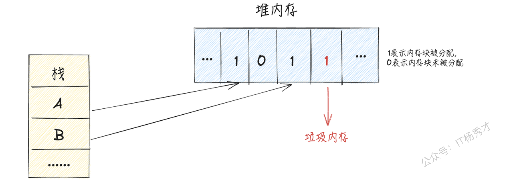

如上图所示，红色1标示的堆内存块就是垃圾内存，需要被回收清理，因为这块内存已经被分配，但是并没被使用，而剩下的两个黑色1标示的堆内存块不能被gc回收，因为还有两个栈上对象指向他们，它们还处于被引用状态中，处于使用阶段，不是垃圾内存

## 2. 为什么需要GC

先来看个经典的c代码示例

```c
int * func(void) {
 int a = 100;
 /* 
 ... 
 */
 return &a;
}
```

`return &a;`会出错，这就是经典的悬挂指针问题，c语言是不允许返回一般局部变量地址的，其原因是一般局部变量的作用域只在函数内，其存储位置在栈区中，当程序调用完函数后，局部变量会随此函数一起被释放。 其地址指向的内容不明，就会成为一个悬挂指针，可能会引起严重的段错误

在上述例子中，代码比较简单，我们在写代码的时候可以轻松的发现悬挂指针问题，但是真实业务场景下的代码往往很复杂，比如下图


我们在手动free对象的时候，根据当前程序链路A-->C-->D-->E，依次free对象，当free掉D,E对象之后，只剩下C对象，貌似没有问题，但是其实还有其他的对象B引用了D对象，这样就造成了悬挂指针问题


所以在真实业务写代码场景中，程序员要free对象的时候必须要非常小心，对于当前对象的所有引用关系要很清楚，否则一旦误删，就会导致严重错误。但是真实业务代码中的对象有太多了，引用关系又极其复杂，所以这就导致很难避免这种悬挂指针错误，而且由于程序员写代码的时候要特别注意这些问题，导致开发效率又很低。

所以一门可以自动识别并且回收垃圾内存的语言会大大的提升程序的开发效率，同时也会减少很多不必要的错误，这就是程序语言的GC机制。现代语言中，包括java，go，python都有集成了自己的gc机制，用他们进行开发的时候，效率都比c，c++要高的多

## 3. **常见的GC算法**

### 3.1 **引用计数法**

引用计数法会为程序中的每个对象在对象头中分配一个空间来保存该对象被引用的次数，如果有其他对象引用了该对象，那么它的引用计数加1。如果其他对象删除了对该对象的引用，则它的引用计数减1，当该对象的引用计数为0时，此时他已经没有任何对象引用了，该对象就可以被回收

注意：当创建一个新对象时，引用计数器从 1 开始，表示有一个地方正在使用这个对象

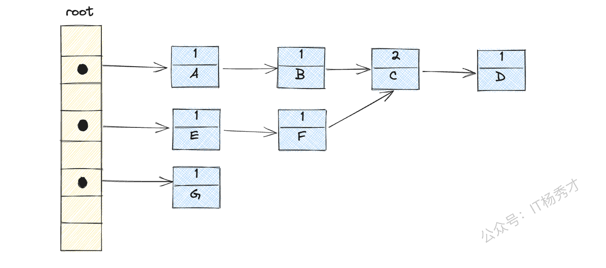

如上图所示，对象c由于有两个对象B，F引用，所以计数为2，其余节点计数都是1

#### 3.1.1 优点

简单直接，回收速度快，不会出现内存耗尽或达到某个阀值时才回收

#### 3.1.2 缺点

不能很好的处理循环引用，而且需要有额外的空间实时维护引用计数，有也一定的代价


比如上图，再删除了对象A和D之后，由于对象B和E之间存在循环引用，所以上下B,C,E,F四个对象都存再引用关系，计数都不为0，所以都不能被回收，如果大量存在这种循环对象的话，就会造成一定的内存泄漏

### 3.2 **标记清除法**

标记清除算法主要分为两个阶段来完成对垃圾内存的回收

**标记阶段**：遍历所有活动对象，并标记那些还在使用的对象标签

**清除阶段**：遍历内存中所有对象，清除那些没有被标记的对象

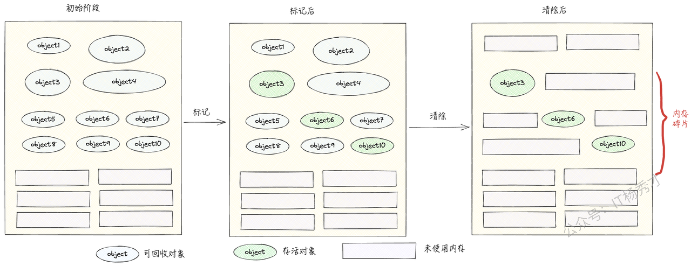

#### 3.2.1 优点

简单易实现，不需要额外的数据结构，只需遍历一次对象图即可完成标记和清除操作，适合可回收对象不多的场景

#### 3.2.2 缺点

主要是会造成内存碎片，导致后续需要创建大对象的时候，由于没有连续的足够大的内存空间而创建不了，降低了内存的使用率

### 3.3 **复制法**

复制算法将内存分成两个相等的区域，并且一次只使用其中一个。当这个区域被用完时，程序会把所有还在使用的对象复制到另一个空区域（保留区域），然后将已使用的区域全部清除。

这样，每次只需对一个区域进行垃圾回收，分配内存时也无需处理碎片问题，只需按顺序移动指针进行分配

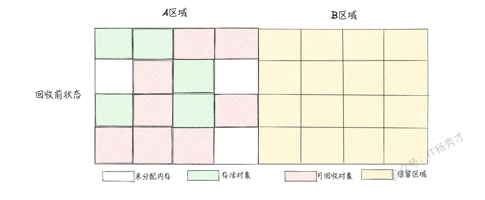


#### 3.3.1 优点

主要是避免了内存碎片问题，每次清除针对的都是整块内存

#### 3.3.2 缺点

内存利用率降低，使用的内存会缩小为了原来的一半

如果存活的对象很多，将这些对象都复制一遍，并且更新它们的应用地址，这一过程耗时可能较长，回收效率不够高

### 3.4 **标记整理**

标记整理算法与标记清除算法非常相似，只是做了一点稍稍的改进，其过程可以分为以下两步：

标记：这一步骤和标记清除算法一样，都是从GC 根节点开始扫描，并标记存活对象

整理：接下来，所有存活对象会被移动到一端的空闲空间，按照内存地址进行排序，并更新相应的引用指针。然后，清理掉末端内存地址之外的所有内存空间。

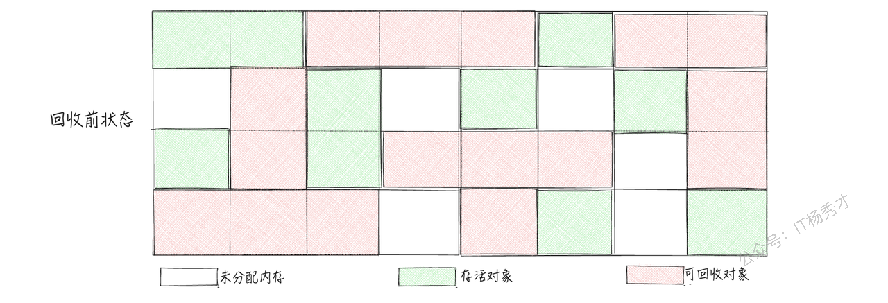

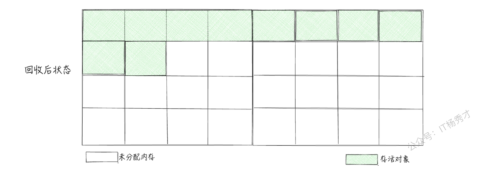

### 3.5 **分代法**

分代收集算法可以被视为上述内容的扩展。它的实现思路是根据对象生命周期的差异，将内存划分为多个区域，例如将堆空间划分为新生代和老年代，然后根据每个区域的特点选择最合适的收集算法。

在新生代中，由于存在大量对象很快被销毁、少量对象存活的特点，通常使用“复制算法”。这种算法只需付出少量存活对象的复制成本就可以完成垃圾对象的收集，效率非常高。而在老年代中，由于对象的存活率高，且没有额外空间进行分配担保，通常使用“标记-清理”或“标记-整理”算法来进行回收。

## 4. **Go语言GC算法**

目前go语言GC在实现上采用的是一种并发三色标记法（GC程序与用户代码并发执行）加上屏障技术来实现的。并发三色标记法本质上也是一种标记清理算法，并且这种并发三色标记没有前面垃圾回收算法中提到的分代与整理过程，仅仅就是标记和清理过程。三色标记只是对其标记过程的一种简单描述，下面将详细介绍这种算法。

### 4.1 **为什么go语言gc不选择分代与标记整理**

通过前面的gc算法分析知道基于整理的 GC 算法和基于复制的 GC 算法能够降低内存碎片，提高内存的使用率，但是go语言为什么不采用这种方式呢？主要有以下几点原因：

1. **go为什么没有选用标记整理或者复制？**

标记整理算法或者是复制算法主要是为了减少内存碎片，然而，Go 运行时使用的内存分配算法是基于 TCMalloc，虽然不能像复制算法那样消除掉内存碎片化的问题，但也极大地降低了碎片率，所以标记整理显得有时并不是那么明显，并且Thread Cache 的分配机制使得 Go 在大多数分配场景下可以避免使用锁，从而在高并发情况下展现出强大的性能优势。

* **go为什么没有选择分代？**

go语言的struct类型创建是可以分配到栈上的，而不是像java一样new出来的对象在堆上。go会在编译期做静态逃逸分析，可以将生命周期很短的对象直接安排在栈上分配（比如函数内未发生逃逸的struc类型变量），分代GC最大的优势就是可以区分长生命周期和短生命周期对象，从而快速回收生命周期短的对象，但是由于go语言在编译期会做逃逸分析，所以Go 语言中的短生命周期对象并没有那么多，使得分代 GC 在 Go 语言中收益并不明显。此外，分代GC 还需要额外的写屏障来维护老年代对新生代的引用关系，这也增加了 GC 的开销

## 5. **GO语言GC的主要发展过程**

go语言也不是一开始就是使用的并发三色标记法（GC程序与用户代码并发执行）加上屏障技术来实现，其主要经历以下三个过程：

* **V1.3及之前：标记清除算法**

* **V1.5：三色并发标记法**

* **V1.8：混合写屏障机制**

下面将逐一介绍这三个过程的GC算法

### 5.1 **什么样的内存GC不能回收？**

在开始正式讲GO语言GC之前，我们先来看看GC是否够可以回收掉堆上的任意的垃圾内存呢？

先来看一个简单的例子

```go
package main

import "fmt"

type Student struct {
    ID    int64
    Name  string
    Age   int
    Score float64
}

func main() {
    slice := make([]Student, 6)
    slice = slice[:3]
    fmt.Println(slice)
}
```

程序创建了一个Student类型的切片slice，包含6个元素


当slice发生缩小，大小缩为原来的一半，只有三个元素的时候，底层数组的3两个元素已经无法再访问了


但是堆上的slice3，slice4，slice5的内存是不会被gc的，因为根据标记清理方法从根结点开始标记的话，这块内存还是属于可达的，所以不会被gc掉。同样的情况还存在于Map中，当创建一个Map之后，delete掉Map中的某个key之后，对应部分的内存也是不会被gc的

### 5.2 **标记清除算法**

从前面标记清除算法可知，标记清除算法（Mark Sweep Algorithm），包括标记（Mark）和清除（Sweep）两个阶段：

**标记阶段：**&#x4ECE;根对象开始，查找并标记堆中所有存活的对象

**清除阶段**：遍历堆中所有对象，回收未被标记的对象

假设程序开始阶段对象分布如下图所示，下面用图示的方式展示标记清除的过程

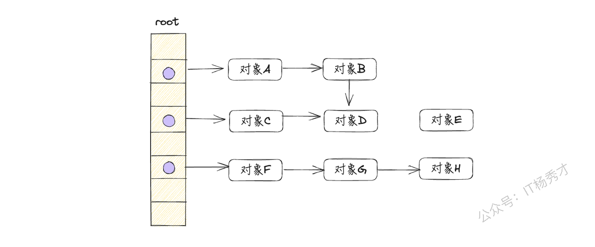

1. 从根对象开始，逐一遍历每个对象及其子对象，并标记它们的可达状态，如下图所示：

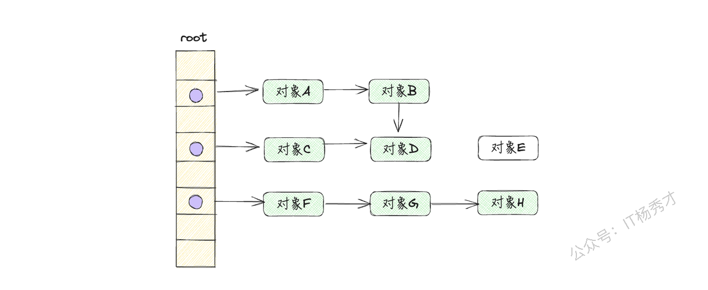

* 可达对象：对象A、对象B、对象C、对象D、对象F、对象G、对H

* 不可达对象：对象E

- 遍历堆上的所有对象，回收没有被标记的不可达对象，如下图所示：

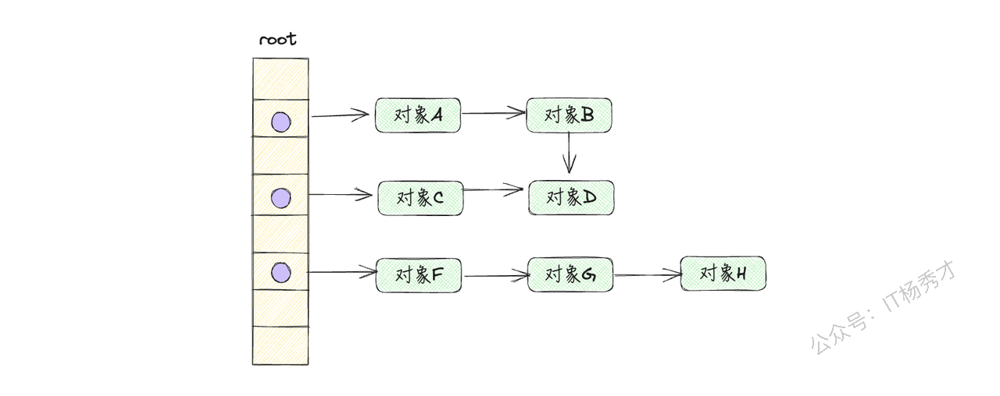

清除完成之后，剩下可达对象A，B，C，D，F，G，H，不可达对象E被清除，内存释放

注意：以上只是回收器（GC程序）的工作过程，还没有考虑赋值器（用户程序），其实在回收器在进行标记和清扫的过程中是要暂停整个用户程序的，暂停整个用户程序也称作STW。

如果不STW，会出现什么情况呢？

假设现在标记阶段已经完成，对象A，B，C，D，F，G，H被打上标记，而对象E是未被标记的准备回收的对象，就在此时，清除之前对象H又指向了对象E

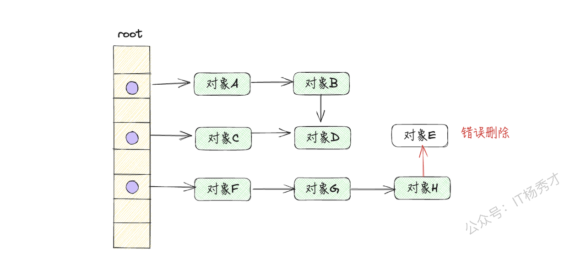

那么接下来回收器就会将对象E错误删除，其实对象E此时已经是可达对象了，是存在引用关系，再被使用的，是不能被GC的，所以完整的标记清除算法需要在进行GC前进行STW，即暂停整个用户程序。这样的话，性能必然很低，很难有人可以接受这种性能损耗

### 5.3 **三色标记法**

简单的标记清除算法会带来长时间的STW，为了解决这个问题，Go语言在V1.5版本，使用三色并发标记法来优化这个问题

三色标记法将程序中的对象分为三类：白色、灰色和黑色

* 白色：未被垃圾收集器访问到的对象，也就是潜在的垃圾对象。在回收开始阶段 ，所有对象都标记为白色；在回收结束后，所有白色对象均不可达，其内存将被释放

* 灰色：已被垃圾收集器访问到的对象，但是垃圾收集器需要继续扫描它们的子对象，因为其可能存在指向白色对象的外部指针

* 黑色：已被垃圾收集器访问到的对象，且其引用都已被扫描到，黑色对象中任何一个指针都不可能直接指向白色对象

标记过程如下：

1. **初始状态**：所有对象都是白色的

2. **扫描根对象**：从根对象开始扫描，将所有可达对象标记为灰色，并放入待处理集合中

3. **处理灰色对象**：从待处理集合中取出灰色对象，将它们引用的对象标记为灰色，并将这些新标记的对象加入待处理集合中，同时将自身标记为黑色。

4. **重复扫描**：重复第3步，直到待处理集合为空。此时，所有白色对象都是不可达的垃圾对象，可以进行回收

假设应用程序中的对象关系如下图所示，下面用图示的方式展示三色标记的过程

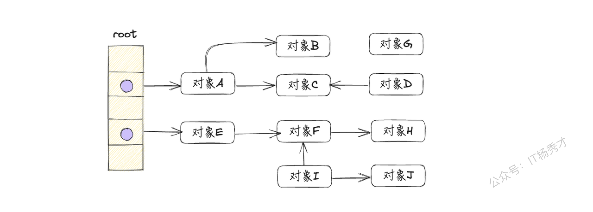

1. 应用程序开始运行时，所有对象默认标记为白色，如下图所示：

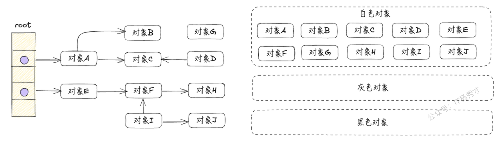

用3个集合来存储被标记为3种颜色的对象，程序开始运行时，所有对象都存放在白色标记集合中

* 从根节点开始遍历，把遍历到的对象标记为灰色，放到灰色标记集合中，如下图所示：


* 对象A、对象E，被标记为灰色

- 遍历灰色标记集合，将灰色对象本身标记为黑色，并将它们移动到黑色标记集合中；将黑色对象引用的白色对象标记为灰色，放到灰色标记集合中，如稀土所示：

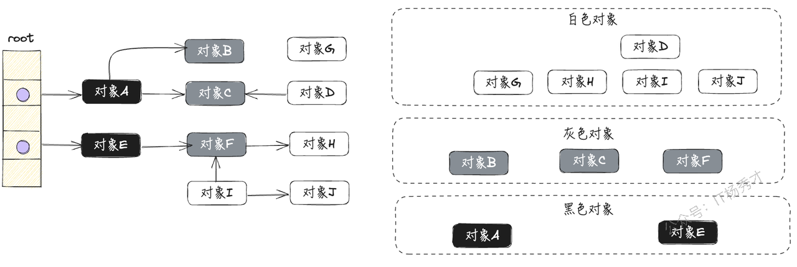

* 对象A、对象E，被标记为黑色

* 对象B、对象C、对象F，被标记为灰色

- 重复第三步，直到灰色标记表为空，如下图所示


* 清除所有的白色对象，完成垃圾回收，如下图所示：


明白了三色标记的过程，还需要搞清楚垃圾回收最开始扫描的根集合究竟包含哪些对象，通常情况下根节点包含以下几个部分：

1. 全局变量：程序在编译期就能确定的那些存在于程序整个生命周期的变量

2. 执行栈上的对象或指针：每个 goroutine 都包含自己的执行栈，这些执行栈上的对象包含栈上的变量及指向分配的堆内存区块的指针。

3. 寄存器中的变量：寄存器的值可能表示一个指针，参与计算的这些指针可能指向某些赋值器分配的堆内存区块

### 5.4 **没有STW的三色标记法**

从前面的分析了解到，STW会大大的降低用户程序的执行效率，甚至达到用户难以接受的地步。那么go经过优化后的并行三色标记法需要STW吗？先看一下假设不进行STW会不会有什么问题？

以下图的程序对象关系进行分析，假设当前已经完成第一轮扫描，如下图所示。此时灰色对象F通过p指针指向白色对象H：

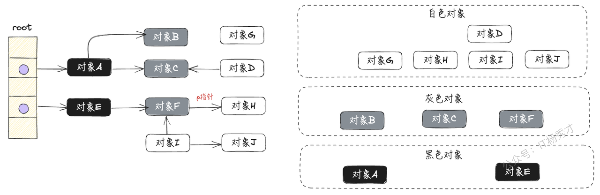

由于没有进行STW，所以对象都有可能发生读写操作。假设还没扫描到对象F时，已经标记为黑色的对象E，创建q指针指向白色对象H，如下图所示：


在新增q指针的同时，灰色对象F移除p指针，此时白色对象H只挂在已经完成扫描的黑色对象E下，如下图所示：

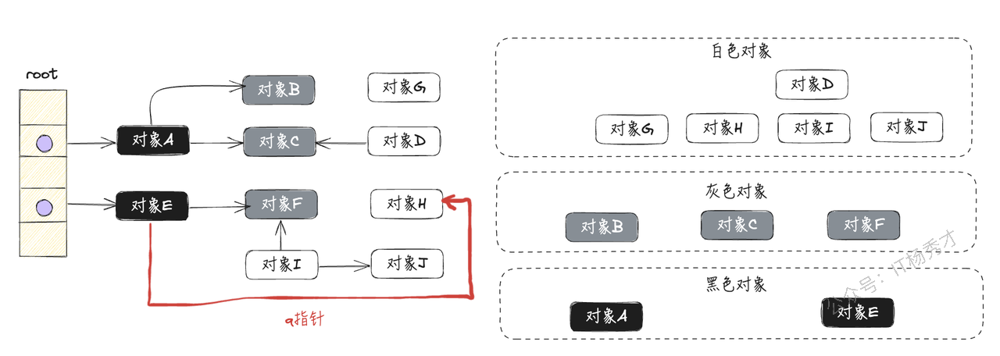

然后，按照三色标记的规则继续执行，最终会得到如下图所示的结果：


对象H其实是被对象E正确引用的，但却被垃圾收集器“错误”回收了，这将会导致程序严重错误，是不允许的。

从上面的分析来看，在不进行STW时，如果同时满足下面两个条件将会破坏垃圾收集器的正确性

* &#x20;一个白色对象被黑色对象引用(白色对象被挂在黑色对象下)

* 灰色对象与它之间的可达关系的白色对象遭到破坏(灰色对象同时丢失了该白色对象的引用)

### **5.5 屏障技术**

#### **5.5.1 强弱三色不变性**

根据前面分析垃圾回收器会出现错误回收的两个条件，很容易可以总结出：只要破坏这两个必要条件，就可以保证对象不会被错误回收。也就是接下来讲到的两种三色不变性：强三色不变性和弱三色不变性

* **强三色不变性**：不存在黑色对象引用到白色对象的指针，即黑色对象不会指向白色对象，只会指向灰色对象或黑色对象


* **弱三色不变性**：所有被黑色对象引用的白色对象都处于灰色对象的保护状态，黑色对象可以指向的白色对象，但是必须包含一条从灰色对象到这个白色对象的可达路径


只要满足了这两种三色不变性其一，其实就破坏了垃圾收集器“错误回收”两个条件同时存在，这样就能保证垃圾回收的正确性了，go语言其实是引入内存写屏障技术来实现这两个三色不变性的，接下来将详细讨论什么是内存屏障以及go语言中涉及的3种屏障技术：

1. 插入写屏障

2. 删除写屏障

3. 混合写屏障

#### **5.5.2 什么是内存屏障**

内存屏障其实是一种赋值器技术，对应于在编译期生成的一段特殊代码，用于在程序运行时拦截内存写操作，相当于一个 hook 调用。其作用是通过 hook 内存的写操作时机, 做一些标记工作, 从而保证垃圾回收的正确性

下面通过一个具体的例子来看在屏障技术在汇编时期是怎么做的

```go
package main

type Student struct {
    Name string
    Age  *int
}

func fun1(s *Student) {
    s.Age = new(int)
}

func fun2(s *Student) {
    var st = new(Student)
    st.Name = "google"
}

func main() {
    st1 := new(Student)
    st2 := new(Student)

    go fun1(st1)
    go fun2(st2)
}
```

对于上述代码，我们先看一下他的内存逃逸情况

回顾一下内存逃逸的原则：

1. **尽可能分配到栈上**：在确保程序正确性的前提下，如果可以，将对象分配到栈上。栈上的对象生命周期与 goroutine 紧密相关，当 goroutine 结束时，这些对象会自动释放，避免了垃圾回收的负担，从而提高性能。

2. **堆分配的必要性**：当对象需要在函数调用返回后继续存在，或者对象的大小和结构无法在编译期确定时，就必须将其分配到堆上。这些对象的生命周期由程序的业务逻辑决定，最终由垃圾回收器管理和回收。

3. **不确定性时选择堆分配**：如果无法明确判断对象是否可以分配到栈上，为了保证程序的正确性和稳定性，通常会选择将其分配到堆上。堆上的对象在业务程序的创建时分配，最终由垃圾回收器负责回收

执行以下命令，查看其内存逃逸情况

```go
go build -gcflags "-N -l -m" ./main.go 
```

输出

```go
# command-line-arguments
./main.go:8:11: s does not escape
./main.go:9:13: new(int) escapes to heap
./main.go:12:11: s does not escape
./main.go:13:14: new(Student) does not escape
./main.go:18:12: new(Student) escapes to heap
./main.go:19:12: new(Student) escapes to heap
```

程序当中一共 执行了4次new操作， 但只有 3 次逃逸到了堆

```go
's.Age = new(int)' 逃逸到堆上, 因为其生命周期需要超越该 goroutine
'var st = new(Student)' 分配到栈上, st对象就只是在栈上使用
'st1 := new(Student)', 逃逸到堆上, 因为其他的goroutine要使用该参数
'st2 := new(Student)', 逃逸到堆上, 同st1
```

接着来看下这段代码的汇编代码，执行以下命令

```go
go tool compile -S ./main.go
```

选取`s.Age = new(int)`这个int变量的创建汇编代码来看一下

```go
main.fun1 STEXT size=112 args=0x8 locals=0x28 funcid=0x0 align=0x0                                                                                                               
        0x0000 00000 (～/go_tourist/gcdemo/main.go:8)       TEXT    main.fun1(SB), ABIInternal, $48-8                                                        
        0x0000 00000 (main.go:8)       MOVD    16(g), R16  //将全局变量 g 的偏移量 16 处的数据移动到寄存器 R16 中                                                                              
        0x0004 00004 (main.go:8)       PCDATA  $0, $-2  //记录调试信息和垃圾收集信息。PCDATA 是跟踪垃圾回收和调试信息的数据指令                                                                                
        0x0004 00004 (main.go:8)       CMP     R16, RSP  //将寄存器 R16 的值与栈指针 RSP 的值进行比较                                                                               
        0x0008 00008 (main.go:8)       BLS     92        //如果 RSP 小于等于 R16，跳转到地址 0x005c，即指令地址 92                                                                              
        0x000c 00012 (main.go:8)       PCDATA  $0, $-1   //更新调试和垃圾回收信息                                                                                
        0x000c 00012 (main.go:8)       MOVD.W  R30, -48(RSP)  //将寄存器 R30 的值移动到栈指针 RSP 的偏移量 -48 的位置                                                                          
        0x0010 00016 (main.go:8)       MOVD    R29, -8(RSP) //将寄存器 R29 的值保存到栈指针 RSP 的偏移量 -8 的位置                                                                           
        0x0014 00020 (main.go:8)       SUB     $8, RSP, R29  //将 RSP 减去 8，结果存储到 R29 中                                                                           
        0x0018 00024 (main.go:8)       FUNCDATA        $0, gclocals·wgcWObbY2HYnK2SU/U22lA==(SB)  //提供函数的局部变量的垃圾收集信息                                      
        0x0018 00024 (main.go:8)       FUNCDATA        $1, gclocals·J5F+7Qw7O7ve2QcWC7DpeQ==(SB)  //提供函数的参数的垃圾收集信息                                     
        0x0018 00024 (main.go:8)       FUNCDATA        $5, main.fun1.arginfo1(SB)    //提供函数参数的其它信息                                                   
        0x0018 00024 (main.go:8)       FUNCDATA        $6, main.fun1.argliveinfo(SB)  //提供函数参数的生命周期信息                                                  
        0x0018 00024 (main.go:8)       PCDATA  $3, $1             //调试和垃圾回收相关的指令                                                                      
        0x0018 00024 (main.go:8)       MOVD    R0, main.s(FP)    //将寄存器 R0 的值存储到帧指针 FP 的 main.s 中                                                                        
        0x001c 00028 (main.go:8)       PCDATA  $3, $-1    //更新调试和垃圾回收信息                                                                              
        0x001c 00028 (main.go:9)       MOVD    $type:int(SB), R0   //将 int 类型的全局变量地址移动到 R0 中                                                                     
        0x0024 00036 (main.go:9)       PCDATA  $1, $0       #更新调试和垃圾回收信息                                                                            
        0x0024 00036 (main.go:9)       CALL    runtime.newobject(SB)  //调用 runtime.newobject 函数，为新对象分配内存                                                                  
        0x0028 00040 (main.go:9)       MOVD    main.s(FP), R1   //将 main.s 的值从 FP 中移动到寄存器 R1                                                                        
        0x002c 00044 (main.go:9)       PCDATA  $0, $-2    //更新调试和垃圾回收信息                                                                              
        0x002c 00044 (main.go:9)       MOVB    (R1), R27   // 将 R1 地址中的字节数据移动到 R27 中                                                                             
        0x0030 00048 (main.go:9)       PCDATA  $0, $-1      //更新调试和垃圾回收信息                                                                            
        0x0030 00048 (main.go:9)       PCDATA  $0, $-2      //更新调试和垃圾回收信息                                                                            
        0x0030 00048 (main.go:9)       MOVWU   runtime.writeBarrier(SB), R2  //将 runtime.writeBarrier 地址的数据移动到 R2 中                                                           
        0x0038 00056 (main.go:9)       CBNZW   R2, 68       //如果 R2 不为零，则跳转到地址 0x0044                                                                             
        0x003c 00060 (main.go:9)       MOVD    R0, 16(R1)    //将 R0 的值存储到 R1 偏移 16 处                                                                           
        0x0040 00064 (main.go:9)       JMP     80            //跳转到地址 0x0050。                                                                                 
        0x0044 00068 (main.go:9)       ADD     $16, R1, R2   //将 R1 加 16 的结果存储到 R2 中                                                                           
        0x0048 00072 (main.go:9)       MOVD    R0, R3        //将寄存器 R0 的值移动到寄存器 R3                                                                          
        0x004c 00076 (main.go:9)       CALL    runtime.gcWriteBarrier(SB)  //调用 runtime.gcWriteBarrier 函数。这个函数处理写屏障，确保在垃圾回收时正确处理写入                                                             
        0x0050 00080 (main.go:10)      PCDATA  $0, $-1     //更新调试和垃圾回收信息                                                                             
        0x0050 00080 (main.go:10)      PCDATA  $1, $-1     //更新调试和垃圾回收信息                                                                             
        0x0050 00080 (main.go:10)      LDP     -8(RSP), (R29, R30)  //从 RSP 偏移量 -8 处加载两个寄存器的值到 R29 和 R30 中。LDP 表示加载双字                                                                    
        0x0054 00084 (main.go:10)      ADD     $48, RSP      //将栈指针 RSP 加 48                                                                           
        0x0058 00088 (main.go:10)      RET     (R30)     //从 R30 寄存器中返回，结束函数 main.fun1 的执行                                                                               
        0x005c 00092 (main.go:10)      NOP            //无操作指令（No Operation），通常用于对齐或占位                                                                                  
        0x005c 00092 (main.go:8)       PCDATA  $1, $-1    //更新调试和垃圾回收信息                                                                              
        0x005c 00092 (main.go:8)       PCDATA  $0, $-2    //更新调试和垃圾回收信息                                                                              
        0x005c 00092 (main.go:8)       MOVD    R0, 8(RSP)   //将 R0 寄存器的值移动到 RSP 偏移量 8 处                                                                            
        0x0060 00096 (main.go:8)       MOVD    R30, R3      //将寄存器 R30 的值移动到寄存器 R3                                                                            
        0x0064 00100 (main.go:8)       CALL    runtime.morestack_noctxt(SB)  //调用 runtime.morestack_noctxt 函数。此函数用于检查是否需要更多的栈空间                                                         
        0x0068 00104 (main.go:8)       MOVD    8(RSP), R0   //将 RSP 偏移量 8 处的值移动到寄存器 R0                                                                            
        0x006c 00108 (main.go:8)       PCDATA  $0, $-1      //更新调试和垃圾回收信息                                                                            
        0x006c 00108 (main.go:8)       JMP     0            // 跳转到地址 0x0000，即函数的开始位置。这个跳转通常在栈空间不足的情况下发生
```

汇编代码中红色背景的语句注释主要就是关于`s.Age = new(int)`这条语句的对象创建以及过程中开启的写屏障机制。

可以看到在写对象（这里是创建一个新对象）在编译期有写屏障的hook操作，写屏障是一段编译器在编译期插入的特殊代码，代码函数名字叫做 `gcWriteBarrier`

屏障代码的运行，而是需要条件判断的，并不是只要是堆上内存赋值就会运行 `gcWriteBarrier`代码。在回收器开始扫描前，STW程序会设置这个判断语句，只有当判断条件符合的时候`gcWriteBarrier`代码才会运行

可以简单用伪代码描述一下上述屏障功能

```go
if runtime.writeBarrier.enabled {
    runtime.gcWriteBarrier(ptr, val)
} else {
    *ptr = val
}
```

下面简单看一下在 `amd64` 架构下，`gcWriteBarrier`的汇编代码，具体文件可以在src/runtime/asm\_amd64.s查看，看看`gcWriteBarrier`函数具体做了些什么工作

```go
// gcWriteBarrier 执行堆指针的写操作并通知垃圾回收器（GC）。
    //
    // gcWriteBarrier 不遵循 Go ABI（应用二进制接口）。它接收两个参数:
    // - DI 是写入操作的目标地址
    // - AX 是要写入 DI 地址的值
    // 它会修改 FLAGS（标志寄存器）。它不会修改任何通用寄存器
    // 但可能会修改其他寄存器（例如，SSE 寄存器）.
    // 定义为 ABIInternal，因为它不使用基于堆栈的 Go ABI.
    TEXT runtime·gcWriteBarrier<ABIInternal>(SB),NOSPLIT,$112
            // Save the registers clobbered by the fast path. This is slightly
            // faster than having the caller spill these.
            MOVQ        R12, 96(SP)     //将寄存器 R12 的值保存到栈中偏移 96 的位置
            MOVQ        R13, 104(SP)    //将寄存器 R13 的值保存到栈中偏移 104 的位置
            // TODO: Consider passing g.m.p in as an argument so they can be shared
            // across a sequence of write barriers.
            MOVQ        g_m(R14), R13   //从寄存器 R14 指向的位置加载 g_m 的值（全局变量），并存储到寄存器 R13
            MOVQ        m_p(R13), R13   //从寄存器 R13 指向的位置加载 m_p（当前线程的堆指针）
            MOVQ        (p_wbBuf+wbBuf_next)(R13), R12 //从 R13 指向的 p_wbBuf 结构中的 wbBuf_next 偏移处加载数据到寄存器 R12，这是获取写屏障缓冲区的位置
            // Increment wbBuf.next position.
            LEAQ        16(R12), R12    //计算 R12 + 16 的地址，并将其存储回 R12，这一步更新了写屏障缓冲区的写入位置
            MOVQ        R12, (p_wbBuf+wbBuf_next)(R13) //将更新后的缓冲区写位置存储回 p_wbBuf 结构中的 wbBuf_next
            CMPQ        R12, (p_wbBuf+wbBuf_end)(R13)  //比较写屏障缓冲区的当前位置 R12 与缓冲区的结束位置。用于检查缓冲区是否已满
            // Record the write.
            MOVQ        AX, -16(R12)    //将寄存器 AX（要写入的值）存储到缓冲区当前位置的偏移 -16 处。    // Record value
            // Note: This turns bad pointer writes into bad
            // pointer reads, which could be confusing. We could avoid
            // reading from obviously bad pointers, which would
            // take care of the vast majority of these. We could
            // patch this up in the signal handler, or use XCHG to
            // combine the read and the write.
            MOVQ        (DI), R13   //将 DI 寄存器中的地址内容加载到 R13。DI 指向要写入的地址
            MOVQ        R13, -8(R12)   // 将 R13 的值（即要写入的地址）存储到缓冲区中的偏移 -8 处     // Record *slot
            // Is the buffer full? (flags set in CMPQ above)
            JEQ        flush      //如果上面比较结果表明缓冲区已满（R12 等于 wbBuf_end），则跳转到 flush 标签，意思就是 wbBuffer 队列满了，那么就下刷处理，比如置灰，置黑等操作
    ret:                          // 其实就是执行赋值：*slot = val，直接置灰色，置黑色
            MOVQ        96(SP), R12  // 从栈中恢复寄存器 R12 的值
            MOVQ        104(SP), R13  // 从栈中恢复寄存器 R13 的值
            // Do the write.
            MOVQ        AX, (DI)      // 将 AX 寄存器中的值写入到 DI 指定的地址
            RET                       // 从函数中返回
    flush:
            ...
            // This takes arguments DI and AX
            CALL    runtime·wbBufFlush(SB)        // 批量刷新操作, 最终调用 wbBufFlush1, 将 mspan.gcmarkBits 进行标记
            ...
            JMP    ret
```

按照上面汇编代码以及写屏障的作用来看，写屏障最后不就是简单执&#x884C;**`*slot = value`这个赋值操作，给对象加颜色吗，wbBuf队列的作用是什么呢？**

写屏障函数`gcWriteBarrier`的**wbBuf队列其实是go1.10 左右为了性能优化而引入的，每个 P 都有一个 wbBuf 队列，**&#x4E3B;要是将赋值的前后两个值记录下来，攒满一个 buffer ，然后批量处理，来提升效率

总结一下写屏障函数`gcWriteBarrier`功能：

1. 首先写屏障会拦截写操作

2. 拦截完写操作之后，会记录下赋值前后的旧值与新值，存储在 p.wbBuf 队列

3. 当 p.wbBuf 满了之后, 批量刷入到扫描队列(置灰)

#### **5.5.3 go语言中的屏障技术**

在 GC 领域中，常见的写屏障（write barrier ）有两种：

1. **插入写屏障（Dijistra Insertion Barrier）**

2. **删除写屏障（Yuasa Deletion Barrier）**

##### 5.5.3.1 **插入写屏障（Dijistra Insertion Barrier）**

插入写屏障的原理可以用如下伪代码表示

```go
 // ptr 赋值给 slot
func DijkstraWritePointer(slot *unsafe.Pointer, ptr unsafe.Pointer) {
     shade(ptr) //  shade(ptr) 会将新的下游对象ptr 标记为灰色。通过保守的假设 *slot 可能会变为黑色， 并确保 ptr 不会在将赋值为 *slot 前变为白色，进而确保了强三色不变性。
     *slot = ptr // 将新的下游对象ptr赋值给当前下游对象slot
 }
```

上述伪代码可以翻译如下：

```go
添加下游对象(当前下游对象slot, 新下游对象ptr) {   
  //step 1
  将新的下游对象ptr标记为灰色   
  
  //step 2
  当前下游对象slot = 新下游对象ptr                    
}
```

插入写屏障一般有两种适用场景：

* A添加新下游对象，比如A 之前没有下游， 新添加一个下游对象B， B被标记为灰色

* A变更下游对象，比如A 将下游对象C 更换为B，  B被标记为灰色

由于**指针修改时，指向的新对象要被强制标灰，**&#x6240;以插入写屏障满足强三色不变式，不存在黑色对象引用白色对象的情况了， 因为白色会强制变成灰色

> 注意：虽然插入写屏障实现非常的简单，并且也能保证强三色不变性，但却没有在栈上使用，因为栈空间的特点是容量小，但要求响应速度快，在栈上的对象增加写屏障，会大幅度增加写入指针的额外开销，所以栈空间的对象操作中不使用. 而仅仅使用在堆空间对象的操作中

go语言在Go 1.7 之前其实就使用的是 插入写屏障（Dijkstra Write barrier）

假设应用程序中的对象关系如下图所示，下面用图示的方式展示插入写屏障的过程

1. 程序初始阶段，所有对象均标记为白色，将所有对象放入到白色集合


注意：对象E的箭头是由堆指过来，并不是表示是从堆上开始扫描，其实也是从栈上扫描的， 只不过是栈上根节点直接引用的它，它位于堆上，这里方便画图，就用堆上箭头指向它

* 从根节点开始遍历，把遍历到的对象标记为灰色（只遍历一次），放到灰色标记集合中，如下图所示：


* 遍历灰色集合，将可达对象从白色标记为灰色， 放入灰色集合，并将自身标记为黑色放入黑色集合


* 由于是并发进行标记，此时对象E指向一个新的对H，对象A指向一个新的对象I，对象E在堆区，出发插入写屏障，对象A在栈区，不触发


* 插入写屏障的作用（黑色对象添加白色对象，将白色对象标记为灰色），对象H被标记为灰色，由于栈上没有开启写屏障，所以对象I仍然为白色

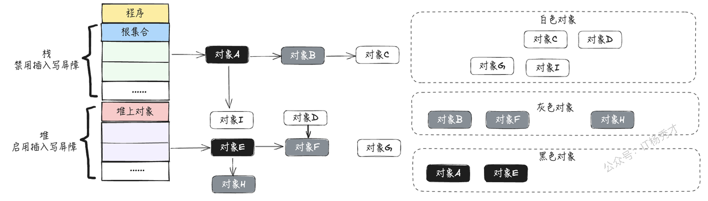

* 循环执行上述流程，直到灰色集合没有节点


可以看到出现了黑色对象A指向白色对象I的情况，会出现错误回收，这是由于在栈上没有开启写屏障导致的，所以在全部三色标记扫描之后，要对栈重新进行三色标记扫描, 但这次为了对象不丢失, 要对本次标记扫描启动STW. 直到栈空间的三色标记结束

* 在正式开始回收工作之前，此时开启STW，开始重新扫描一次栈上对象


* 对栈上的对象进行三色标记，直至没有灰色对象


* 停止STW，这次STW大约的时间在10\~100ms之间


* 将剩余的白色节点全部清除


##### 5.5.3.2 **删除写屏障（Yuasa Deletion Barrier）**

删除写屏障的原理可以用如下伪代码表示

```go
 func YuasaWB(slot *unsafe.Pointer, ptr unsafe.Pointer){
     shade(*slot) // 将*slot标记为灰色，即指针修改时，修改前指向的对象要标灰
     *slot = ptr  // 将新的下游对象ptr赋值给当前下游对象slot
 }
```

上述伪代码可以翻译如下：

```go
添加下游对象(当前下游对象slot， 新下游对象ptr) {
  //step 1
  if (当前下游对象slot是灰色 || 当前下游对象slot是白色){
      标记灰色(当前下游对象slot)     //slot为当前下游对象，即将被删除， 标记为灰色
  }
  
  }  
  //step 2
  当前下游对象slot = 新下游对象ptr
}
```

删除写屏障一般有两种适用场景：

* A删除下游对象，比如A 之前的下游对象B被删除， B被标记为灰色

* A变更下游对象，比如A 将下游对象C 更换为B，  C被标记为灰色

由于**指针修改时，修改前指向的对象要标灰，即被删除的对象，如果自身为灰色或者白色，那么被标记为灰色；**&#x6240;以满足弱三色不变性，因为保护灰色对象到白色对象的路径不会断

注意，虽然删除写屏障也是GC领域常见的屏障技术，但是go语言 在GC中从来没有直接使用删除写屏障

假设应用程序中的对象关系如下图所示，下面用图示的方式展示删除写屏障的过程

1. 程序初始阶段，所有对象均标记为白色，将所有对象放入到白色集合


* 从根节点开始按照三色标记遍历，标记到如下图所示的状态：


* 此时用户程序将原本对象E指向对象F的指针指向对象G，即对象E删除对象F，添加对象；触发删除写屏障，由于对象F已经被标记为灰色，所以不做改变，如下图所示


* 用户程序将对象F指向对象G的指针删除，触发删除写屏障，对象G被标记为灰色，如下图所示：


* 按照三色标记法和删除写屏障的的步骤继续往下执行，最终得到的结果如下图所示：


可以看到由于有删除写屏障的存在，可以准确回收掉不需要的内存，不会出现错误回收的情况，但是却会出现回收精度低的问题。同时注意看上图，对象F其实是一个孤立的对象，不会再使用了，却最终被标记为了黑色，没有被回收掉，只能通过下一轮GC的时候将其回收，所以，删除写屏障虽然不需要在标记结束后开启STW，但却存在回收精度低的问题

###### 5.5.3.2.1 **删除写屏障是否真的不需要STW**

前面分析了，删除写屏障虽然不需要在标记结束后开启STW，是否意味着单独使用删除写屏障进行GC就不需要STW了呢？

其实并非如此，删除写屏障又叫做基于其实快照的解决方案（snapshot-at-the-begining）。删除写屏障（基于起始快照的写屏障）在使用的时候有一个前提条件，就是必须起始的时候，把整个根部扫描一遍，做一次快照，让所有的可达对象全都在灰色保护下（根对象全为黑，下一级在堆上的对象全灰），之后利用删除写屏障拦截内存写操作，确保弱三色不变式不被破坏，这样就绝对不会有被误回收的对象，就可以保证垃圾回收的正确性。而在起始阶段，扫描整个根节点，做快照的时候是要进行STW的，所以从整体上看删除写屏障同样要进行STW

下面通过一个简单的图示看一下，经过了STW快照之后的，删除写屏障过程


1. 起始阶段，根节点全黑，堆上一级节点全灰

2. 开始三色标记

3. 新增黑色对象A指向白色对象C

4. 对象B删除对象C，触发删除写屏障，对象C置灰，避免黑色对象引用白色对象

**总结**：

1. 删除写屏障必须在起始阶段，开启STW来 扫描整个栈（注意所有的 goroutine 栈，所以整个用户程序所有的goroutine都要扫描，所以是STW，STW是让用户所有的goroutine全部停止），来确保堆上的一级对象全灰，保证**所有堆上在用的对象**都处于灰色保护下，才能保证弱三色不变性

2. 删除写屏障需要在起始阶段执开启STW 扫描，因此不适合具有大栈内存的场景，栈越大，扫描时间越久，比如现代服务器程序栈内存都相对较大，所以都不太适合删除写屏障。相反，它更适合栈内存较小的环境，如嵌入式系统和物联网设备，因为它们的栈空间有限，STW 时间较短

3. 删除写屏障的可能会有遗漏对象需要在下一轮GC才可能被回收，所以税收精度相对较低，不如插入写屏障

**思考题：前面分析在使用删除写屏障之前需要STW来扫描整个栈空间，获取快照？那是否可以不一次性暂停所有的goroutine，而是一个栈一个栈的暂停获取快照呢？这样就不用STW了**

先看个具体例子：

1. 对象A 是 goroutine1 里栈上的一个对象，goroutine1里的栈空间已经扫描完了，并且 对象C 也扫描完标记为黑色的对象；

2. 对象B 是 goroutine2里 栈上的对象，指向了goroutine1里的对象 C 和goroutine2里的对象 D，由于goroutine2 还没有完全扫描，对象B 是一个灰色对象，对象D 是白色对象


此时假设执行以下步骤：

第一步：goroutine2 进行赋值变更，把 对象C 指向 D 对象，此时黑色对象 C 就指向了白色的 D（这里是删除屏障，而不是插入写屏障，所以新增引用不会触发任何操作）

第二步：删除对象 B 到对象D的引用，由于是栈对象操作，不会触发删除写屏障

执行完上述两个，结果如下图：


由于对象C 已经是黑色对象了，所以不会再扫描，所以对象 D 就会被错误的清理掉

**所以**，**一个栈一个栈的暂停获取快照是不可行的，必须STW，暂停用户程序的所有goroutine的栈空间，来打快照，把所有的堆对象都处于灰色保护中才行**

##### 5.5.3.3 **混合写屏障**

仔细思考下删除写平展的弊端和流程，发现它最大的问题就是起始阶段的栈空间扫描，要进行STW暂停整个的用户程序，而一个一个的栈暂停又会出现问题，那有没有什么办法可以解决这个问题呢？

回顾上面删除写屏障的例子的第一步，在把对象C 指向 D 对象的时候，正是由于此时是删除写屏障，所以导致黑色对象 C 就指向了白色的 D而没有任何操作，那如果在这里加入插入写屏障的逻辑，此时对象D就会被置灰，尽管后面对象C已经是黑色不会再被扫描，也不会出现黑色对象指向白色对象的情况了

仔细想想，这里引入的插入写屏障还是在一个一个的栈暂停的情况下的，是不需要进行STW的。这里既用到了删除写屏障，又用到了插入写屏障，这不就是混合写屏障吗？

**混合写屏障 = 删除写屏障 + 插入写屏障**

**混合写屏障模式下，利用删除写屏障避免了插入写屏障的STW问题（全部三色标记扫描之后，要STW对栈重新进行三色标记扫描），又利用插入写屏障避免了删除写屏障的STW问题（使用删除写屏障之前需要STW垃圾扫描整个栈空间，获取快照，把所有的堆对象都处于灰色保护中），这样就完美解决了屏障技术带来的STW问题**

上面只是从感官上分析了插入写屏障和删除写屏障的结合，解决了STW的问题，但其实混合写屏障不仅仅是做了这两点

Go 在Go V1.8版本时候为了简化 GC 的流程，同时减少标记终止阶段的重扫成本，将 Dijkstra 插入屏障和 Yuasa 删除屏障进行混合，引入了混合写屏障机制（hybrid write barrier）。

混合写屏障的基本思想是：**对正在被覆盖的对象进行着色，且如果当前栈未扫描完成，则同样对指针进行着色。**

混合写屏障的原理可以用如下伪代码表示

```go
func HybridWritePointerSimple(slot *unsafe.Pointer, ptr unsafe.Pointer) {
    shade(*slot)
    shade(ptr)
    *slot = ptr
}
```

可以做如下翻译

```go
添加下游对象(当前下游对象slot, 新下游对象ptr) {
//step1 
标记灰色(当前下游对象slot)    //只要当前下游对象被移走，就标记灰色

//step2 
标记灰色(新下游对象ptr)      //新下游对象标记为灰色

//3step
当前下游对象slot = 新下游对象ptr
}
```

意思就是在垃圾回收阶段，只要是堆上的一个赋值 `*slot = ptr` 那么都会被拦截住，然后把旧值（`*slot`）指向的对象，和新值（ptr）指向的对象都置灰（投到扫描队列）

所以混合写屏障的流程可以总结为：

* **GC 开始将栈上的对象全部扫描并标记为黑色（注意是一个一个栈标记，不是所有栈全部暂停标记）**

* **GC 期间，任何在栈上创建的新对象，均标记为黑色**

* **被删除的堆对象标记为灰色**

* **被添加的堆对象标记为灰色**

假设应用程序中的对象关系如下图所示，下面用图示的方式展示混合写屏障的过程


1. GC开始扫描站对象，将所有栈上可达对象A,B,C标记为黑色


* GC期间栈上新创建的对象K被标记为黑色


* 进行三色标记到如下阶段，对象E被标记为黑色，对象F被标记为灰色


* 此时，对象E新增指针指向对象I，对象F删除对对象H的指针引用，触发混合写屏障，对象I标记为灰色，对象H标记为灰色


* 按照三色标记法和混合写屏障的的步骤继续往下执行，最终得到的结果如下图所示：


最终垃圾对象为白色对象D,G，将会被垃圾回收器清理掉

**总结：**

1. 混合写屏障结合了插入和删除写屏障的优势。它不需要在开始时进行全局的STW操作来创建快照，也不需要在三色标记扫描之后，进行STW对栈重新进行三色标记扫描

2. 混合写屏障保留了删除写屏障的功能，所以其扫描精度比插入写屏障低，但它实现了整个GC过程中无STW

3. 虽然混合写屏障整个GC过程中无STW，然而在扫描某个特定的栈时，还是需要暂时停止该goroutine的赋值器操作，以确保状态的原子切换

### **5.6 三色标记对应的程序本质**

其实在go语言的GC程序里面是没有所谓的黑色，白色，灰色属性的，这三个颜色属性认为抽象出来的概念，帮助我们理解三色标记的过程

在go语言GC程序内部，对这三种颜色的对象状态的描述，是通过一个队列 + 掩码位图 来实现的：

* 白色对象：对象所在 span 的 gcmarkBits 中对应的 bit 为 0，并且该对象不在扫描队列中

* 灰色对象：对象所在 span 的 gcmarkBits 中对应的 bit 为 1，并且该对象在扫描队列中

* 黑色对象：对象所在 span 的 gcmarkBits 中对应的 bit 为 1，并且该对象已经从扫描队列中处理并剔除掉

### **5.7 GC的完整流程**

GO语言GC 相关的代码在`runtime/mgc.go`文件中，一共分为分为`清除终止`（SweepTermination）, `标记`（Mark）, `标记终止`（MarkTermination）, 和 `清除`（Sweep） 四个不同阶段, 它们分别完成了不同的工作:

1. **清除终止（SweepTermination）**

这个阶段的主要任务是结束上一个GC周期的清除工作，并为新的GC周期做准备。

* **标记（Mark）**

  * 将GC状态&#x4ECE;**\``` _GCoff` ``**`更改为`**`` `_GCmark ``\`**，并且开启写屏障（Write Barrier）和协助线程（mutator assists），紧接着将根对象入队

  * 恢复用户程序的正常执行，标记进程（mark workers）和协助线程（mutator assists）开始发地标记内存中的对象，写屏障会将被覆盖的指针和新指针都标记成灰色, 而所有新创建的对象都会直接标记成黑色

  * 遍历灰色对象集合，将灰色对象标记为黑色，并将该对象指向的对象标记为灰色

  * 使用分布式终止算法（distributed termination algorithm）来检测剩余工作，即何时不再有根标记作业或灰色对象，如果没有了则转为标记终止（MarkTermination）阶段

* **标记终止（MarkTermination）**

  * 执行STW

  * 将GC状态切换&#x81F3;**&#x20;\``_GCmarktermination`\`**，关闭 GC 工作线程以及 mutator assists（协助线程）

  * 清理处理器P上的缓存（mcache）

* **清除（Sweep）**

  * 将 GC 状态切换至 **\``` _GCoff` ``**，初始化清理状态并关闭写屏障（Write Barrier）

  * 恢复用户程序的正常执行，从此时开始所有新创建的对象会标记成白色

  * 后台并发清理所有的内存管理单元，当应用程序goroutine尝试在堆内存中分配新内存时，会触发该操作

### **5.8 GC的触发时机**

GO语言中GC的触发分为手动触发和被动触发两种

1. **手动触发**，通过调用 runtime.GC() 来触发 GC，此调用阻塞式地等待当前 GC 运行完毕

2. **被动触发**，分为两种方式：

   * go后台有一系统监控线程，当超过两分钟没有产生任何 GC 时，强制触发 GC。

   * 使用步调算法，通过内存增长的比例来触发GC，每次内存分配时检查当前内存分配量是否已达到阈值（环境变量GOGC）：默认100%，即当内存扩大一倍时启用GC

     * 我们可以通过debug.SetGCPercent(500)来修改步调，这里表示，如果当前堆大小超过了上次标记的堆大小的500%，就会触发

     * 而第一次GC的触发的堆内存临界值是4MB

总结：

1、监控线程 runtime.sysmon 定时调用

2、手动调用 runtime.GC 函数进行垃圾收集

3、申请内存时 runtime.mallocgc 会根据堆大小判断是否调用

### **5.9 小结**

GO语言GC总体上来说是采用的并行三色标记法+混合写屏障机制来实现的，内存写屏障是由插入写屏障向混合写屏障过渡的，go语言在Go 1.7 之前其实就使用的是插入写屏障（Dijkstra Write barrier），在Go V1.8版本引入了混合写屏障。

1. 插入写屏障没有完全保证完整的强三色不变式，由于性能影响，栈上对象没有开启写屏障，所以三色标记完成之后，最后必须 STW 重新扫描栈

2. 混合写屏障消除了屏障过程中所有的 STW，不用 STW 扫描栈，但由于引入了删除想屏障，所以损失了一定的回收精度，其回收精度和删除写屏障的一致，比插入写屏障要低

3. 混合写屏障扫描栈的方式是逐个暂停扫描的，不需要STW


