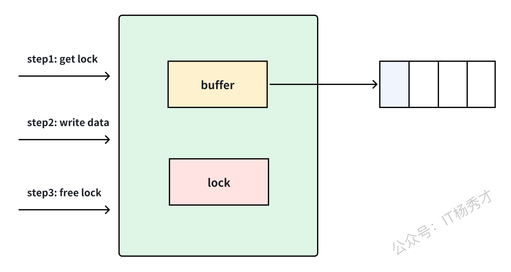
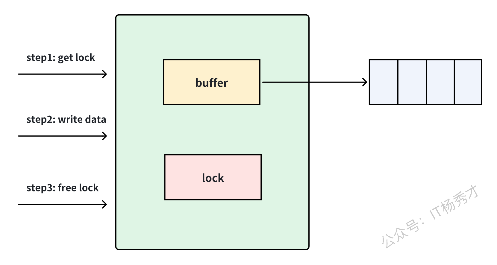

---
tags:
  - Go
  - golang
  - go进阶语法
  - Channel
---

# Channel
我们知道可以通过`go`关键字来开启一个`goroutine`，我们的样例代码逻辑很简单，都是在各个`goroutine`各自处理自己的逻辑，但有时候我们需要不同的`goroutine`之间能够通信，这里就要用到`channel`。

## channel是什么
官方定义：
Channels are a typed conduit through which you can send and receive values with the channel operator
Channel是一个可以收发数据的管道

## channel初始化
channel的声明方式如下：
```go
var channel_name chan channel_type
var channel_name [size]chan channel_type  // 声明一个channel，其容量大小为size
``` 
声明之后的管道，并没有进行初始化为其分配空间，其值是`nil`，我们要使用还要配合`make`函数来对其初始化，之后才可以在程序中使用该管道。
```go
channel_name := make(chan channel_type)
channel_name := make(chan channel_type, size)
```
或者我们可以直接一步完成声明和初始化，如下：
```go
channel_name := make(chan channel_type)
channel_name := make(chan channel_type, size) //创建带有缓存的管道，size为缓存大小
```

## channel操作
channel的操作主要有以下几种
```go
ch := make(chan int)         // 创建一个管道ch
ch <- v                      // 向管道ch中发送数据v.
v := <-ch                    // 从管道中读取数据存储到变量v
close(ch)                    // 关闭管道ch
```
在这里需要注意`close(ch)`这个操作，管道用完了，需要对其进行关闭，避免程序一直在等待以及资源的浪费。但是关闭的管道，仍然可以从中接收数据，只是接收到的的数据永远是零值。
看下面例子：
```go
package main

import (
   "fmt"
   "time"
)

func main() {
   ch := make(chan int, 5)
   ch <- 1
   close(ch)
   go func() {
      for i := 0; i < 5; i++ {
         v := <-ch
         fmt.Printf("v=%d\n", v)
      }
   }()
   time.Sleep(2 * time.Second)
}
```
运行结果：
```
v=1
v=0
v=0
v=0
v=0
``` 
创建一个缓存为`5`的`int`类型的管道，向管道里写入一个`1`之后，将管道关闭，然后开启一个`gortoutine`从管道读取数据，读取`5`次，可以看到即便管道关闭之后，他仍然可以读取数据，在读完数据之后，将一直读取零值。
但是，上述读取方式还有一个问题？比如我们创建一个`int`类型的`channel`，我们需要往里面写入零值，用另一个`goroutine`读取，此时我们就无法区两种常用的读取方式

### 判定读取
还是以上面的例子来看，稍作修改
```go
package main

import (
    "fmt"
    "time"
)

func main() {
    ch := make(chan int, 5)
    ch <- 1
    close(ch)
    go func() {
       for i := 0; i < 5; i++ {
          v, ok := <-ch // 判断句式读取
          if ok {
             fmt.Printf("v=%d\n", v)
          } else {
             fmt.Printf("channel数据已读完，v=%d\n", v)
          }
       }
    }()
    time.Sleep(2 * time.Second)
}
```
运行结果：
```
v=1 
channel数据已读完，v=0
channel数据已读完，v=0
channel数据已读完，v=0
channel数据已读完，v=0
```
在读取`channel`数据的时候，用`ok`做了判断，当管道内还有数据能读取的时候，`ok`为`true`，当管道关闭后，`ok`为`false`。

### for range读取
在上面例子中，我们明确了读取的次数是5次，但是我们往往在更多的时候，是不明确读取次数的，只是在`channel`的一端读取数据，有数据我们就读，直到另一端关闭了这个`channel`，这样就可以用`for range`这种优雅的方式来读取`channel`中的数据了
```go
package main

import (
   "fmt"
   "time"
)

func main() {
   ch := make(chan int, 5)
   ch <- 1
   ch <- 2
   close(ch)
   go func() {
      for v := range ch {
         fmt.Printf("v=%d\n", v)
      }
   }()
   time.Sleep(2 * time.Second)
}
```
运行结果：
```
v=1
v=2
```
主`goroutine`往`channel`里写了两个数据`1`和`2`，然后关闭，子`goroutine`也只能读取到`1`和`2`。这里在主`goroutine`关闭了`channel`之后，子`goroutine`里的`for range`循环才会结束。 

## 双向channel和单向channel
channel根据其功能又可以分为双向`channel`和单向`channel`，双向`channel`即可发送数据又可接收数据，单向`channel`要么只能发送数据，要么只能接收数据。
定义单向读`channel`
```go
var ch = make(chan int)
type RChannel= <-chan int    // 定义类型
var rec RChannel = ch
```
定义单向写`channel`
```go
var ch = make(chan int)
type SChannel = chan<- int  // 定义类型
var send SChannel = ch
```
注意写`channel`与读`channel`在定义的时候只是`<-`的位置不同，前者在`chan`关键字后面，后者在`chan`关键字前面。
代码示例：
```go
import (
    "fmt"
    "time"
)

type SChannel = chan<- int
type RChannel = <-chan int

func main() {
    var ch = make(chan int)  //  创建channel

    go func() {
        var send SChannel = ch
        fmt.Println("send: 100")
        send <- 100
    }()

    go func() {
        var rec RChannel = ch
        num := <- rec 
        fmt.Printf("receive: %d", num)
    }()
    time.Sleep(2*time.Second)
}
```
运行结果：
```
send: 100
receive: 100
``` 
创建一个`channel ch`，分别定义两个单向`channel`类型`SChannel`和`RChannel` ，根据别名类型给`ch`定义两个别名`send`和`rec`，一个只用于发送，一个只用于读取。

## 扩展
`channel`非常重要，Go语言中有个重要思想：不以共享内存来通信，而以通信来共享内存。
说得更直接点，协程之间可以利用`channel`来传递数据，如下的例子，可以看出父子协程如何通信的，父协程通过`channel`拿到了子协程执行的结果。
```go
package main

import (
        "fmt"
        "time"
)

func sum(s []int, c chan int) {
        sum := 0
        for _, v := range s {
                sum += v
        }
        c <- sum // send sum to c
}

func main() {
        s := []int{7, 2, 8, -9, 4, 0}

        c := make(chan int)
        go func() {
                sum(s[:len(s)/2], c)
                //time.Sleep(1 * time.Second)
        }()
        go sum(s[len(s)/2:], c)
        x, y := <-c, <-c // receive from c

        fmt.Println(x, y, x+y)
}
```
运行结果：
```
-5 17 12
```
`channel`又分为两类：有缓冲`channel` 和无缓冲`channel`，这个在前面的代码示例中也有简单的描述了。为了协程安全，无论是有无缓冲的`channel`，内部都会有一把锁来控制并发访问。同时`channel`底层一定有一个队列，来存储数据。
无缓冲`channel`可以理解为同步模式，即写入一个，如果没有消费者在消费，写入就会阻塞。
有缓冲`channel`可以理解为异步模式。即写入消息之后，即使还没被消费，只要队列没满，就可继续写入。如图所示：



这里可能会问，如果有缓冲`channel`队列满了，那不就退化到同步了么？是的，如果队列满了，发送还是会阻塞。



但是我们来反向思考下，如果有缓冲`channel`长期都处于满队列情况，那何必用有缓冲。所以预期在正常情况下，有缓冲`channel`都是异步交互的。

## channel实现锁操作
前面分析了当缓冲队列满了以后，继续往`channel`里面写数据，就会阻塞，那么利用这个特性，我们可以实现一个`goroutine`之间的锁。（对并发安全比较模糊的可以把后面`sync`小节看完再来看这里）
直接看示例
```go
package main

import (
   "fmt"
   "time"
)

func add(ch chan bool, num *int) {
   ch <- true
   *num = *num + 1
   <-ch
}

func main() {
   // 创建一个size为1的channel
   ch := make(chan bool, 1)

   var num int
   for i := 0; i < 100; i++ {
      go add(ch, &num)
   }

   time.Sleep(2)
   fmt.Println("num 的值：", num)
}
```
运行结果：
```
num 的值： 100
``` 
`ch <- true`和`<- ch`就相当于一个锁，将 `*num = *num + 1`这个操作锁住了。因为`ch`管道的容量是1，在每个`add`函数里都会往`channel`放置一个`true`，直到执行完+1操作之后才将`channel`里的`true`取出。由于`channel`的`size`是1，所以当一个`goroutine`在执行`add`函数的时候，其他`goroutine`执行`add`函数，执行到`ch <- true`的时候就会阻塞，`*num = *num + 1`不会成功，直到前一个+1操作完成，`<-ch`，读出了管道的元素，这样就实现了并发安全


## 小结
- 关闭一个未初始化的`channel` 会产生`panic`
- `channel`只能被关闭一次，对同一个`channel`重复关闭会产生`panic`
- 向一个已关闭的 `channel` 发送消息会产生 `panic`
- 从一个已关闭的`channel`读取消息不会发生`panic`，会一直读取所有数据，直到零值
- `channel`可以读端和写端都可有多个`goroutine`操作，在一端关闭`channel`的时候，该`channel`读端的所有`goroutine` 都会收到`channel`已关闭的消息
- `channel`是并发安全的，多个`goroutine`同时读取`channel`中的数据，不会产生并发安全问题

`channel`在我们的并发编程中发挥着巨大作用，使用起来也很方便，关于`channel`的具体实现原理可以到后面的Go语言原理篇学习。本章只介绍`channel`的具体用法