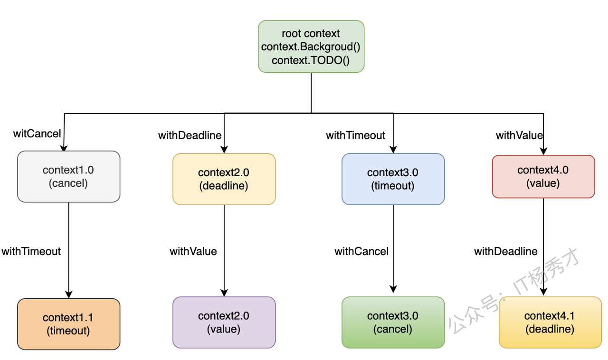
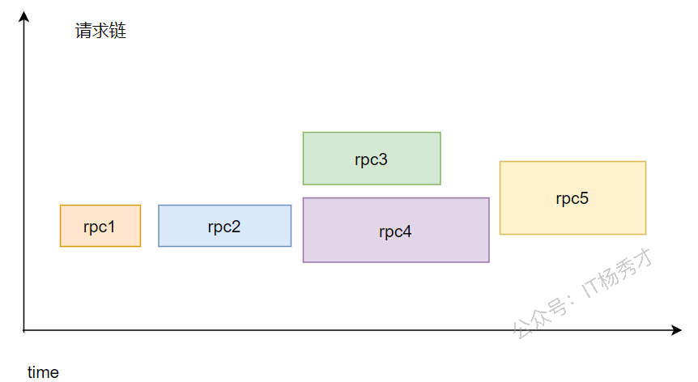

---
tags:
  - Go
  - golang
  - go进阶
  - context
  - 并发
---

# Context

## Context是什么
`context`是Go语言在1.7版本中引入的一个标准库接口，其定义如下:
```go
type Context interface {
   Deadline() (deadline time.Time, ok bool)
   Done() <-chan struct{}
   Err() error
   Value(key interface{}) interface{}
}
```
这个接口定义了四个方法:
- `Deadline`: 设置 `context.Context` 被取消的时间，即截止时间
- `Done`: 返回一个只读`Channel`，当Context被取消或者到达截止时间，这个`Channel`就会被关闭，表示Context的链路结束，多次调用`Done`方法会返回同一个`Channel`
- `Err`: 返回`context.Context`结束的原因，它只会在`Done`返回的`Channel`被关闭时才会返回非空的值，返回值有以下两种情况:
  - 如果是`context.Context`被取消，返回`Canceled`
  - 如果是`context.Context`超时，返回`DeadlineExceeded`
- `Value`: 从`context.Context`中获取键对应的值，类似于map的get方法，对于同一个context，多次调用`Value`并传入相同的Key会返回相同的结果，如果没有对应的key,则返回nil，键值对是通过`WithValue`方法写入的

## Context创建
### 根Context创建
主要有以下两种方式创建根context:
```go
context.Background()
context.TODO()
```

从源代码分析`context.Background`和`context.TODO`并没有太多的区别，都是用于创建根context，根context是一个空的context，不具备任何功能。但是一般情况下，如果当前函数没有上下文作为入参，我们都会使用`context.Background`创建一个根context作为起始的上下文向下传递。

### Context派生
根`context`在创建之后，不具备任何的功能，为了让`context`在我们的程序中发挥作用，我们要依靠`context`包提供的`With`系列函数来进行派生。
主要有以下几个派生函数：
```go
func WithCancel(parent Context) (ctx Context, cancel CancelFunc)
func WithDeadline(parent Context, deadline time.Time) (Context, CancelFunc)
func WithTimeout(parent Context, timeout time.Duration) (Context, CancelFunc)
func WithValue(parent Context, key, val interface{}) Context
```
基于当前`context`，每个`with`函数都会创建出一个新的`context`，这样类似于我们熟悉的树结构，当前`context`称为父`context`，派生出的新`context`称为子`context`。就像下面的`context`树结构：



通过根`context`，通过四个`with`系列方法可以派生出四种类型的`context`，每种`context`又可以通过同样的方式调用`with`系列方法继续向下派生新的`context`，整个结构像一棵树。

## Context有什么用
`context`主要有两个用途，也是在项目中经常使用的:
1. 用于并发控制，控制协程的优雅退出
2. 上下文的信息传递
总的来说，`context`就是用来在父子`goroutine`间进行值传递以及发送`cancel`信号的一种机制。

### 并发控制
对于一般的服务器而言，都是一致运行着的，等待接收来自客户端或者浏览器的请求做出响应，思考这样一种场景，后台微服务架构中，一般服务器在收到一个请求之后，如果逻辑复杂，不会在一个`goroutine`中完成，而是会创建出很多的`goroutine`共同完成这个请求，就像下面这种情况:



有一个请求过来之后，先经过第一次`rpc`调用，然后再到`rpc2`，后面创建执行两个`rpc`，`rpc4`里又有一次`rpc`调用`rpc5`，等所有`rpc`调用成功后，返回结果。假如在整个调用过程中，`rpc1`发生了错误，如果没有`context`存在的话，我们还是得等所有的`rpc`都执行完才能返回结果，这样其实浪费了不少时间，因为一旦出错，我们完全可以直接在`rpc1`这里就返回结果了，不用等到后续的`rpc`都执行完。
假设我们在`rpc1`直接返回失败，不等后续的`rpc`继续执行，那么其实后续的`rpc`执行就是没有意义的，浪费计算和IO资源而已。引入`context`之后，就可以很好的处理这个问题，在不需要子`goroutine`执行的时候，可以通过`context`通知子`goroutine`优雅的关闭。

#### context.WithCancel
方法定义如下:
```go
func WithCancel(parent Context) (ctx Context, cancel CancelFunc)
```
`context.WithCancel`函数是一个取消控制函数，只需要一个`context`作为参数，能够从`context.Context`中衍生出一个新的子`context`和取消函数`CancelFunc`，通过将这个子`context`传递到新的`goroutine`中来控制这些`goroutine`的关闭，一旦我们执行返回的取消函数`CancelFunc`，当前上下文以及它的子上下文都会被取消，所有的`Goroutine`都会同步收到取消信号。
使用示例：
```go
package main

import (
   "context"
   "fmt"
   "time"
)

func main() {
   ctx, cancel := context.WithCancel(context.Background())
   go Watch(ctx, "goroutine1")
   go Watch(ctx, "goroutine2")

   time.Sleep(6 * time.Second)   // 让goroutine1和goroutine2执行6s
   fmt.Println("end watching!!!")
   cancel()  // 通知goroutine1和goroutine2关闭
   time.Sleep(1 * time.Second)
}

func Watch(ctx context.Context, name string) {
   for {
      select {
      case <-ctx.Done():
         fmt.Printf("%s exit!\n", name) // 主goroutine调用cancel后，会发送一个信号到ctx.Done()这个channel，这里就会收到信息
         return
      default:
         fmt.Printf("%s watching...\n", name)
         time.Sleep(time.Second)
      }
   }
}
```
运行结果：
```
goroutine2 watching...
goroutine1 watching...
goroutine1 watching...
goroutine2 watching...
goroutine2 watching...
goroutine1 watching...
goroutine1 watching...
goroutine2 watching...
goroutine2 watching...
goroutine1 watching...
goroutine1 watching...
goroutine2 watching...
end watching!!!
goroutine1 exit!
goroutine2 exit!
```
`ctx, cancel := context.WithCancel(context.Background())`派生出了一个带有返回函数`cancel`的`ctx`，并把它传入到子`goroutine`中，接下来在6s时间内，由于没有执行`cancel`函数，子`goroutine`将一直执行`default`语句，打印监控。6s之后，调用`cancel`，此时子`goroutine`会从`ctx.Done()`这个`channel`中收到消息，执行`return`结束。

#### context.WithDeadline
方法定义如下:
```go
func WithDeadline(parent Context, d time.Time) (Context, CancelFunc)
```
`context.WithDeadline`也是一个取消控制函数，方法有两个参数，第一个参数是一个`context`，第二个参数是截止时间，同样会返回一个子`context`和一个取消函数`CancelFunc`。在使用的时候，没有到截止时间，我们可以通过手动调用`CancelFunc`来取消子`context`，控制子`goroutine`的退出，如果到了截止时间，我们都没有调用`CancelFunc`，子`context`的`Done()`管道也会收到一个取消信号，用来控制子`goroutine`退出。
使用示例：
```go
package main

import (
   "context"
   "fmt"
   "time"
)

func main() {
   ctx, cancel := context.WithDeadline(context.Background(),time.Now().Add(4*time.Second)) // 设置超时时间4当前时间4s之后
   defer cancel()
   go Watch(ctx, "goroutine1")
   go Watch(ctx, "goroutine2")

   time.Sleep(6 * time.Second)   // 让goroutine1和goroutine2执行6s
   fmt.Println("end watching!!!")
}

func Watch(ctx context.Context, name string) {
   for {
      select {
      case <-ctx.Done():
         fmt.Printf("%s exit!\n", name) // 4s之后收到信号
         return
      default:
         fmt.Printf("%s watching...\n", name)
         time.Sleep(time.Second)
      }
   }
}
```
运行结果：
```
goroutine1 watching...
goroutine2 watching...
goroutine2 watching...
goroutine1 watching...
goroutine1 watching...
goroutine2 watching...
goroutine1 exit!
goroutine2 exit!
end watching!!!
```
我们并没有调用`cancel`函数，但是在过了4s之后，子`groutine`里`ctx.Done()`收到了信号，打印出`exit`，子`goroutine`退出，这就是`WithDeadline`派生子`context`的用法。

#### context.WithTimeout
方法定义：
```go
func WithTimeout(parent Context, timeout time.Duration) (Context, CancelFunc)
```
`context.WithTimeout`和`context.WithDeadline`的作用类似，都是用于超时取消子`context`，只是传递的第二个参数有所不同，`context.WithTimeout`传递的第二个参数不是具体时间，而是时间长度。
使用示例：
```go
package main

import (
   "context"
   "fmt"
   "time"
)

func main() {
   ctx, cancel := context.WithTimeout(context.Background(), 4*time.Second)
   defer cancel()
   go Watch(ctx, "goroutine1")
   go Watch(ctx, "goroutine2")

   time.Sleep(6 * time.Second)   // 让goroutine1和goroutine2执行6s
   fmt.Println("end watching!!!")
}

func Watch(ctx context.Context, name string) {
   for {
      select {
      case <-ctx.Done():
         fmt.Printf("%s exit!\n", name) // 主goroutine调用cancel后，会发送一个信号到ctx.Done()这个channel，这里就会收到信息
         return
      default:
         fmt.Printf("%s watching...\n", name)
         time.Sleep(time.Second)
      }
   }
}
```
运行结果：
```
goroutine2 watching...
goroutine1 watching...
goroutine1 watching...
goroutine2 watching...
goroutine2 watching...
goroutine1 watching...
goroutine1 watching...
goroutine2 watching...
goroutine1 exit!
goroutine2 exit!
end watching!!!
```
程序很简单，与上个`context.WithDeadline`的样例代码基本一样，只是改变了下派生`context`的方法为`context.WithTimeout`，具体体现在第二个参数不再是具体时间，而是变为了4s这个具体的时间长度，执行结果也是一样。

#### context.WithValue
方法定义：
```go
func WithValue(parent Context, key, val interface{}) Context
```
`context.WithValue`函数从父`context`中创建一个子`context`用于传值，函数参数是父`context`，`key`，`val`键值对。返回一个`context`。
项目中这个方法一般用于上下文信息的传递，比如请求唯一`id`，以及`trace_id`等，用于链路追踪以及配置透传。
使用示例：
```go
package main

import (
   "context"
   "fmt"
   "time"
)

func func1(ctx context.Context) {
   fmt.Printf("name is: %s", ctx.Value("name").(string))
}

func main() {
   ctx := context.WithValue(context.Background(), "name", "zhangsan")
   go func1(ctx)
   time.Sleep(time.Second)
}
```     
运行结果：
```
name is: zhangsan
```
