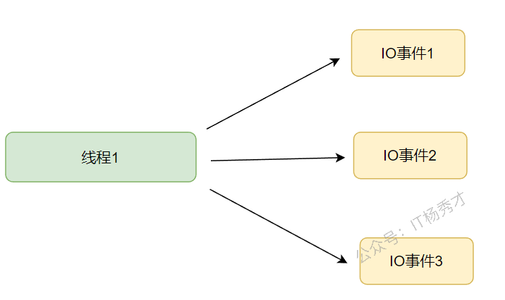

---
tags:
  - Go
  - golang
  - go进阶
  - select
  - 并发
---

# Select

## select是什么
`select`是Go语言层面提供的一种多路复用机制，用于检测当前`goroutine`连接的多个`channel`是否有数据准备完毕，可用于读或写。

## IO多路复用
看到`select`，很自然的会联想到Linux提供的IO多路复用模型：`select`、`poll`、`epoll`，IO复用主要用于提升程序处理IO事件的性能。Go语言中的`select`与Linux中的`select`有一定的区别。操作系统中的IO多路复用简单理解就是用一个或者是少量线程处理多个IO事件。

### 传统阻塞IO vs IO多路复用

#### 传统阻塞IO
对于每一个网络IO事件，操作系统都会起一个线程去处理，在IO事件没准备好的时候，当前线程就会一直阻塞。


优缺点：
- 优点：逻辑简单，在阻塞等待期间线程会挂起，不会占用 CPU 资源
- 缺点：每个连接需要独立的线程单独处理，当并发请求量大时为了维护程序，内存、线程切换开销较大

#### IO多路复用
IO多路复用的基本原理如下图所示：



优缺点：
- 优点：通过复用一个线程处理了多个IO事件，无需对额外过多的线程维护管理，资源和效率上都获得了提升
- 缺点：当连接数较少时效率相比多线程+阻塞 I/O 模型效率较低

Go语言的`select`语句，是用来起一个`goroutine`监听多个`Channel`的读写事件，提高从多个`Channel`获取信息的效率，相当于也是单线程处理多个IO事件，其思想基本相同。

## select用法
`select`的基本使用模式如下：
```go
select {
    case <- channel1:     // 如果从channel1读取数据成功，执行case语句 
        do ...   
    case channel2 <- 1:   // 如果向channel2写入数据成功，执行case语句 
        do ...          
    default:              // 如果上面都没有成功，进入default处理流程
        do ...
}
```
可以看到，`select`的用法形式类似于`switch`，但是区别于`switch`的是，`select`各个`case`的表达式必须都是`channel`的读写操作。`select`通过多个`case`语句监听多个`channel`的读写操作是否准备好可以执行，其中任何一个`case`可以执行了则选择该`case`语句执行，如果没有可以执行的`case`，则执行`default`语句，如果没有`default`，则当前`goroutine`会阻塞。

### 空select永久阻塞
当一个`select`中什么语句都没有，没有任何`case`，将会永久阻塞：
```go
package main

func main() {
    select {
    }
}
```
运行结果：
```
fatal error: all goroutines are asleep - deadlock!
```
程序因为`select`语句导致永久阻塞，当前`goroutine`阻塞之后，由于Go语言自带死锁检测机制，发现当前`goroutine`永远不会被唤醒，会报上述死锁错误。

### 没有default且case无法执行的select永久阻塞
看下面示例：
```go
package main

import (
   "fmt"
)

func main() {
   ch1 := make(chan int, 1)
   ch2 := make(chan int, 1)
   select {
   case <-ch1:
      fmt.Printf("received from ch1")
   case num := <-ch2:
      fmt.Printf("num is: %d", num)
   }
}
```
运行结果：
```
fatal error: all goroutines are asleep - deadlock!
```
程序中 `select`从两个`channel`，`ch1`和`ch2`中读取数据，但是两个`channel`都没有数据，且没有`goroutine`往里面写数据，所以不可能读到数据，这两个`case`永远无法执行到，`select`也没有`default`，所以会出现永久阻塞，报死锁。

### 有单一case和default的select
```go
package main

import (
   "fmt"
)

func main() {
   ch := make(chan int, 1)
   select {
   case <-ch:
      fmt.Println("received from ch")
   default:
      fmt.Println("default!!!")
   }
}
```
运行结果：
```
default!!!
```
执行到`select`语句的时候，由于`ch`中没有数据，且没有`goroutine`往`channel`中写数据，所以`case`不可能执行到，就会执行`default`语句，打印出`default!!!`。

### 有多个case和default的select
```go
package main

import (
   "fmt"
   "time"
)

func main() {
   ch1 := make(chan int, 1)
   ch2 := make(chan int, 1)
   go func() {
      time.Sleep(time.Second)
      for i := 0; i < 3; i++ {
         select {
         case v := <-ch1:
            fmt.Printf("Received from ch1, val = %d\n", v)
         case v := <-ch2:
            fmt.Printf("Received from ch2, val = %d\n", v)
         default:
            fmt.Println("default!!!")
         }
         time.Sleep(time.Second)
      }
   }()
   ch1 <- 1
   time.Sleep(time.Second)
   ch2 <- 2
   time.Sleep(4 * time.Second)
}
```
运行结果：
```
Received from ch1, val = 1
Received from ch2, val = 2
default!!!
```
主`goroutine`中向后往管道`ch1`和`ch2`中发送数据，在子`goroutine`中执行两个`select`，可以看到，在执行`select`的时候，那个`case`准备好了就会执行当下`case`的语句，最后没有数据可接受了，没有`case`可以执行，则执行`default`语句。

> 注意：当多个case都准备好了的时候，会随机选择一个执行

```go
package main

import (
    "fmt"
)

func main() {
    ch1 := make(chan int, 1)
    ch2 := make(chan int, 1)
    ch1 <- 5
    ch2 <- 6
    select {
    case v := <-ch1:
       fmt.Printf("Received from ch1, val = %d\n", v)
    case v := <-ch2:
       fmt.Printf("Received from ch2, val = %d\n", v)
    default:
       fmt.Println("default!!!")
    }
}
```
运行结果：
```
Received from ch2, val = 6
```
多次执行，2个`case`都有可能打印，这就是`select`选择的随机性。


