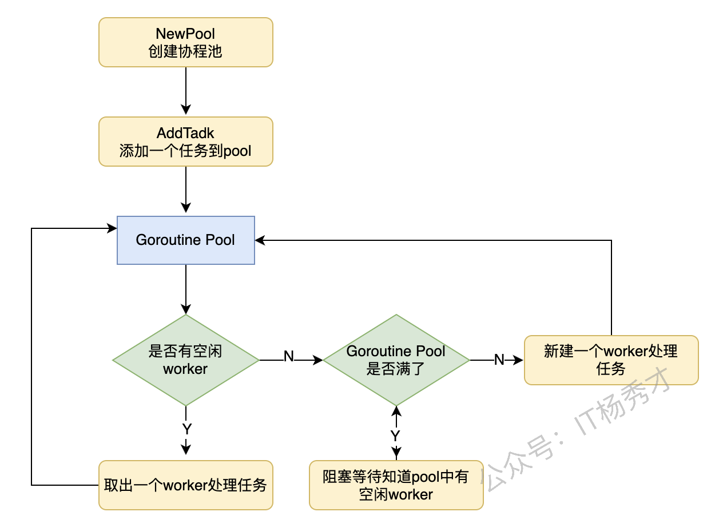

---
tags:
  - Go
  - golang
  - go进阶
  - 协程池
  - 并发
---

# **协程池**
Go语言虽然有着高效的GMP调度模型，理论上支持成千上万的`goroutine`，但是`goroutine`过多，对调度，gc以及系统内存都会造成压力，这样会使我们的服务性能不升反降。常用做法可以用池化技术，构造一个协程池，把进程中的协程控制在一定的数量，防止系统中`goroutine`过多，影响服务性能。

## **协程池模型**
协程池简单理解就是有一个池子一样的东西，里面装这个固定数量的`goroutine`，当有一个任务到来的时候，会将这个任务交给池子里的一个空闲的`goroutine`去处理，如果池子里没有空闲的`goroutine`了，任务就会阻塞等待。所以协程池有三个角色`Worker`，`Task`，`Pool`。

### **属性定义**
- `Worker`：用于执行任务的`goroutine`
- `Task`: 具体的任务
- `Pool`: 池子

下面看一下各个角色的定义：

#### **Task定义**
`Task`有一个函数成员，表示这个task具体的执行逻辑：

```go
type Task struct {
    f func() error  // 具体的执行逻辑
}
```

#### **Pool定义**
`Pool`有两个成员，`Capacity`表示池子里的worker的数量，即工作的`goroutine`的数量，`JobCh`表示任务队列用于存放任务，`goroutine`从这个`JobCh`获取任务执行任务逻辑：
```go
type Pool struct {
    RunningWorkers int64
    Capacity       int64     // goroutine数量
    JobCh          chan *Task // 用于worker取任务
    sync.Mutex
}
```

#### **Worker定义**
```go
// p为Pool对象指针
for task := range p.JobCh {
    do ...      
}
```
执行任务单元，简单理解就是干活的`goroutine`，这个worker其实只做一件事情，就是不断的从任务队列里面取任务执行，而worker的数量就是协程池里协程的数量，由`Pool`的参数`WorkerNum`指定。

### **方法定义**
```go
func NewTask(funcArg func() error) *Task
```
`NewTask`用于创建一个任务，参数是一个函数，返回值是一个`Task`类型。

```go
func NewPool(Capacity int, taskNum int) *Pool
```
`NewPool`返回一个协程数量固定为`workerNum`协程池对象指针，其任务队列的长度为`taskNum`。

接下来主要介绍协程池的各个方法：
```go
func (p *Pool) AddTask(task *Task) 
```
`AddTask`方法是往协程池添加任务，如果当前运行着的worker数量小于协程池worker容量，则立即启动一个协程worker来处理任务，否则将任务添加到任务队列。

```go
func (p *Pool) Run()
```
将协程池跑起来，启动一个worker来处理任务。

协程池处理任务流程图：



### **协程池实现**
```go
package main

import (
    "fmt"
    "sync"
    "sync/atomic"
    "time"
)

type Task struct {
    f func() error // 具体的任务逻辑
}

func NewTask(funcArg func() error) *Task {
    return &Task{
       f: funcArg,
    }
}

type Pool struct {
    RunningWorkers int64      // 运行着的worker数量
    Capacity       int64      // 协程池worker容量
    JobCh          chan *Task // 用于worker取任务
    sync.Mutex
}

func NewPool(capacity int64, taskNum int) *Pool {
    return &Pool{
       Capacity: capacity,
       JobCh:    make(chan *Task, taskNum),
    }
}

func (p *Pool) GetCap() int64 {
    return p.Capacity
}

func (p *Pool) incRunning() { // runningWorkers + 1
    atomic.AddInt64(&p.RunningWorkers, 1)
}

func (p *Pool) decRunning() { // runningWorkers - 1
    atomic.AddInt64(&p.RunningWorkers, -1)
}

func (p *Pool) GetRunningWorkers() int64 {
    return atomic.LoadInt64(&p.RunningWorkers)
}

func (p *Pool) run() {
    p.incRunning()
    go func() {
       defer func() {
          p.decRunning()
       }()
       for task := range p.JobCh {
          task.f()
       }
    }()
}

// AddTask 往协程池添加任务
func (p *Pool) AddTask(task *Task) {
    // 加锁防止启动多个 worker
    p.Lock()
    defer p.Unlock()

    if p.GetRunningWorkers() < p.GetCap() { // 如果任务池满, 则不再创建 worker
       // 创建启动一个 worker
       p.run()
    }

    // 将任务推入队列, 等待消费
    p.JobCh <- task
}

func main() {
    // 创建任务池
    pool := NewPool(3, 10)

    for i := 0; i < 20; i++ {
       // 任务放入池中
       pool.AddTask(NewTask(func() error {
          fmt.Printf("I am Task\n")
          return nil
       }))
    }

    time.Sleep(1e9) // 等待执行
}
```
运行结果：
```
I am Task
I am Task
I am Task
I am Task
I am Task
I am Task
I am Task
I am Task
I am Task
I am Task
I am Task
I am Task
I am Task
I am Task
I am Task
I am Task
I am Task
I am Task
I am Task
I am Task
```
程序创建了一个`WorkerNum`为3，任务队列长度为10的协程池，往里面添加了20个任务，可以看到输出，一直只有3个`worker`在做任务，起到了控制`goroutine`数量的作用。
