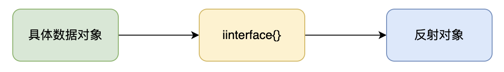
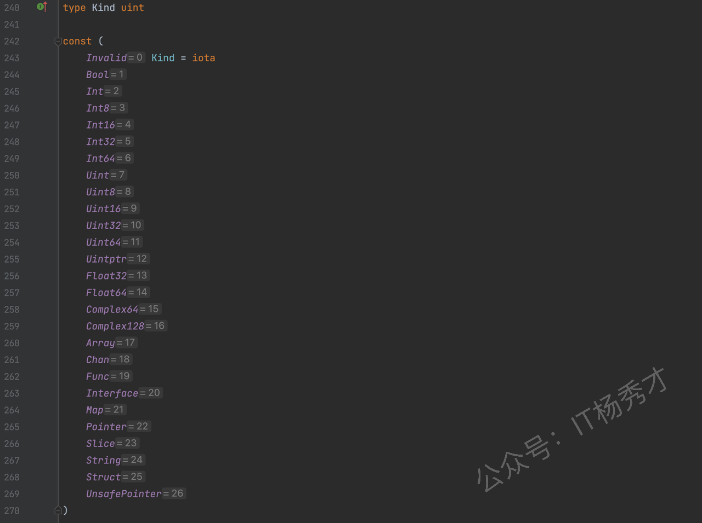

---
tags:
  - Go
  - golang
  - go进阶
  - 反射
---

# 反射

## 什么是反射
反射可以认为是程序在运行时的一种能力，反射可以在程序运行时访问、检测和修改它本身状态，比如在程序运行时可以检查变量的类型和值，调用它们的方法，甚至修改它们的值。使用反射可以增加程序的灵活性，简单来说，反射就是程序在运行时能够检测自身和修改自身的一种能力。

## Go语言反射
对于很多的高级语言都实现了反射，像Java，Python。在Go语言中，反射在Go语言内置的`reflect`包下实现。Go语言中的反射建立在Go的类型系统之上，并且与接口密切相关。通过前面的学习我们知道Go语言的空接口包含类型(`Type`)和值(`Value`)两个部分，在反射里，也要用到类型(`Type`)和值(`Value`)。
`reflect`包中定义了`reflect.Type`和`reflect.Value`，正好对应我们前面所说的`Type`和`Value`。要注意的是`reflect.Type`是一个接口而`reflect.Value`是一个具体的结构体。在`reflect.Type`接口中定义了很多跟类型相关的方法，而`reflect.Value`则是绑定了很多跟值相关的方法。

### reflect.TypeOf()
由于`reflect.Type`是一个接口，所以只有当某个类型实现了这个接口，我们才能获取到它的类型，同时，在`reflect`包内，类型描述符是未导出类型，所以我们只能通过`reflect.TypeOf()`方法获取`reflect.Type`类型的值。
我们首先看一个例子，看下`reflect.TypeOf()`的常用用法：
```go
package main

import (
    "fmt"
    "reflect"
)

type Student struct {
    Name string
    Age  int
}

func main() {
    var num int64 = 100
    t1 := reflect.TypeOf(num)
    fmt.Println(t1.String())

    st := Student{
       Name: "zhangsan",
       Age:  18,
    }
    t2 := reflect.TypeOf(st)
    fmt.Println(t2.String())
}
```
运行结果：
```
int64
main.Student
```
可以看到对于基础类型和`struct`类型通过调用`reflect.TypeOf()`都打印出了对应的类型信息。注意`reflect.TypeOf`返回的是一个`reflect.Type`接口类型，我们通过调用这个接口的`String()`方法，得到最终的字符串信息。

在前面学习`interface`的章节中，我们知道一个具体的数据类型是可以赋值给一个`interface`类型的，反过来则不行，要用到`interface`的断言。在一个`interface`赋值之后，其实是对应了两个类型，一个是静态类型，就是在程序编译期就确定的类型，`interface`的静态类型就是接口`interface`，同时当`interface`赋值之后，他还有一个动态类型，就是被赋值的那个数据的具体类型，假设在上例中，我们将`st`赋值给一个空`interface`，那么这个`interface`的动态类型就是`Student`。

对一个数据对象进行反射操作，其实是首先将具体对象类型转化为一个`interface`类型，然后再将`interface`类型转化为`reflect`包下的反射类型，反射类型里的类型信息和值信息其实就是对应着这个中间类型`interface`的类型和值。



`reflect.TypeOf()`方法获取的就是这个`interface{}`中的类型部分。

### reflect.ValueOf()
同理，`reflect.ValueOf()`方法自然就是获取接口中的值部分，`reflect.ValueOf()`的返回值其实就是一个`reflect.Value`结构。
```go
import (
    "fmt"
    "reflect"
)

type Student struct {
    Name string
    Age  int
}

func main() {
    var num int64 = 100
    v1 := reflect.ValueOf(num)
    fmt.Println(v1)
    fmt.Println(v1.String())

    st := Student{
       Name: "zhangsan",
       Age:  18,
    }
    v2 := reflect.ValueOf(st)
    fmt.Println(v2)
    fmt.Println(v2.String())
}
```
运行结果：
```
100
<int64 Value>
{zhangsan 18}
<main.Student Value>
```
注意到这里`fmt.Println(v1)`和`fmt.Println(v1.String())`打印的不一样，上面说了`reflect.ValueOf()`的返回值就是一个`reflect.Value`结构，但是`fmt.Println(v1)`却打印出了具体的值，这是因为`fmt.Println`的参数是一个接口类型，在执行过程中有一些类型转换，对`reflect.Value`结构做了特殊处理。

### Go语言数据种类
在Go语言中常用的数据类型有26种，以枚举的方式定义在`src/reflect/type.go`文件中：



这些类型中包含`int`，`bool`之类的基础数据类型，也包含`Struct`，`Array`，`Map`等复合类型，有了这些类型，我们用`type struct`自定义的任何类型都可以由他们组合完成。
看个`type struct`定义的数据类型使用反射的例子：
```go
package main

import (
    "fmt"
    "reflect"
)

type WrapInt int

func main() {
    var num1 int = 100
    var num2 WrapInt = 1000

    num1 = int(num2) // 不同类型的type赋值，这里要强转

    typeNum1 := reflect.TypeOf(num1)
    fmt.Printf("type of num1 is %s\n", typeNum1.String())

    typeNum2 := reflect.TypeOf(num2)
    fmt.Printf("type of num2 is %s\n", typeNum2.String())

    fmt.Printf("kind of num1 is %v\n", typeNum1.Kind())
    fmt.Printf("kind of num2 is %v\n", typeNum2.Kind())
}
```
运行结果：
```
type of num1 is int
type of num2 is main.WrapInt
kind of num1 is int
kind of num2 is int
```
通过`WrapInt`的定义可以看到，`WrapInt`其实就是用`type`给`int`去了个别名，二者底层其实都是`int`类型，但是通过`reflect.TypeOf`获取到各自的`type`其实是不一样的，不同`type`之间的变量赋值是需要类型强制转换的，但是深层次的去分析`type`的种类，即`Kind`确是一样的。

## 反射使用

### 值对象
`reflect`包下跟值对象相关的常用函数或方法：

| 函数/方法 | 说明 |
|----------|------|
| `reflect.TypeOf()` | 获取某个对象的反射类型实现(`reflect.Type`) |
| `reflect.ValueOf()` | 获取某个对象的反射值对象(`reflect.Value`) |
| `reflect.Value.NumField()` | 获取结构体的反射值对象中的字段个数，只对结构体类型有效 |
| `reflect.Value.Field(i)` | 获取结构体的反射值对象中的第i个字段，只对结构体类型有效 |
| `reflect.Kind()` | 从反射值对象中获取该值的种类 |
| `reflect.Value.MapKeys()` | 对map的每个键的`reflect.Value`对象组成的一个切片 |
| `reflect.Value.MapIndex(i)` | 根据map的某个键的`reflect.Value`对象，返回值的`reflect.Value`对象 |
| `reflect.Value.Len()` | 对切片或数组的反射对象求切片或数组的长度 |
| `reflect.Value.Index(i)` | 返回切片或数组第i个元素的`reflect.Value`值 |
| `reflect.Int()/reflect.Uint()/reflect.String()/reflect.Bool()` | 从反射的值对象中取出对应值，注意`reflect.Int()/reflect.Uint()`方法对种类做了合并处理，它们只返回相应的最大范围的类型，`Int()`返回`Int64`类型，`Uint()`返回`Uint64`类型 |

#### 获取struct反射值
```go
package main

import (
    "fmt"
    "reflect"
)

type Student struct {
    Name  string
    Age   int
    Score float64
}

func main() {

    st := Student{
       Name:  "zhangsan",
       Age:   18,
       Score: 95.5,
    }
    v := reflect.ValueOf(st)
    fmt.Printf("the field num of Student is %d\n", v.NumField())
    fmt.Printf("field1 type is %v, value is %s\n", v.Field(0).Type().Name(), v.Field(0).String())
    fmt.Printf("field2 type is %v, value is %d\n", v.Field(1).Type().Name(), v.Field(1).Int())
    fmt.Printf("field2 type is %v, value is %f\n", v.Field(2).Type().Name(), v.Field(2).Float())
}
```
运行结果：
```
the field num of Student is 3
field1 type is string, value is zhangsan
field2 type is int, value is 18
field2 type is float64, value is 95.500000
```
`v := reflect.ValueOf(st)`，`v`是一个`Student`类型的反射值对象，通过`v.NumField()`可以得出`Student`类型的字段个数，然后`v.Field(i).Type().Name()`打印出各个字段值的类型，`v.Field(i)`打印出各个字段值
注意：`NumField()`和`Field()`方法只有原对象是结构体时才能调用，否则会panic

#### 获取map反射值
```go
package main

import (
    "fmt"
    "reflect"
)

func main() {
    m := map[int]uint32{
       1: 100,
       2: 200,
    }
    v := reflect.ValueOf(m)
    for _, k := range v.MapKeys() {
       field := v.MapIndex(k)
       fmt.Printf("key type is %v, key = %d; value type is %v, value = %d\n", k.Type().Name(), k.Int(), field.Type().Name(), field.Uint())
    }
}
```
运行结果：
```
key type is int, key = 1; value type is uint32, value = 100
key type is int, key = 2; value type is uint32, value = 200
```
`v := reflect.ValueOf(m)`对map类型的对象m进行反射，通过`v.MapKeys()`的到m中所有key的`reflect.Value`对象k，然后通过`v.MapIndex(k)`的到对应key反射值对象的value反射值对象，然后通过`reflect.Value`的`Type().Name()`方法获取map中key，value的类型，然后打印出对应值

#### 获取slice反射值
```go

import (
    "fmt"
    "reflect"
)

func main() {
    slice := []int{1, 2, 3}
    v1 := reflect.ValueOf(slice)
    for i := 0; i < v1.Len(); i++ {
       elem := v1.Index(i)
       fmt.Printf("%v ", elem.Interface())
    }

    fmt.Println()

    nums := [3]int{4, 5, 6}
    v2 := reflect.ValueOf(nums)
    for i := 0; i < v2.Len(); i++ {
       elem := v2.Index(i)
       fmt.Printf("%v ", elem.Interface())
    }
}
```
运行结果：
```
1 2 3
4 5 6
```
`v1`，`v2`分别是切片和数组的反射值对象，通过`Len()`获取到数组或切片中的元素个数，然后通过`v.Index(i)`获取对应元素的`reflect.value`对象，打印出其值
> **注意：`Len()`和`Index(i)`方法只能在原对象是切片，数组或字符串时才能调用，其他类型会panic**。

### 类型对象
reflect包下跟类型相关的常用函数或方法

| 函数/方法 | 说明 |
|----------|------|
| `reflect.Value.NumField()` | 获取结构体的反射值对象中的字段个数，只对结构体类型有效 |
| `reflect.Value.Field(i)` | 获取结构体的反射值对象中的第i个字段，只对结构体类型有效 |
| `reflect.Value.Elem()` | 根据指针获取对应的具体类型 |
| `reflect.Value.NumIn()` | 获取函数反射类型的参数个数 |
| `reflect.Value.In(i)` | 获取函数反射类型的第i个参数 |
| `reflect.Value.NumOut()` | 获取函数反射类型的返回值个数 |
| `reflect.Value.Out(i)` | 获取函数反射类型的第i个返回值 |
| `reflect.Value.NumMethod()` | 获取struct上绑定的方法个数 |
| `reflect.Value.Method(i)` | 获取struct上绑定的第i个方法 |

#### struct反射类型
```go
package main

import (
    "fmt"
    "reflect"
)

type Student struct {
    Name  string
    Age   int
    Score float64
}

func main() {
    st := Student{
       Name:  "zhangsan",
       Age:   18,
       Score: 90.5,
    }
    t := reflect.TypeOf(st)
    fmt.Println(t.Name())
    fmt.Println(t.Kind())
    fmt.Println(t.NumField())
    for i := 0; i < t.NumField(); i++ {
       fmt.Printf("field1 name is %s, field1 type is %s\n", t.Field(i).Name, t.Field(i).Type.String())
    }
}
```
运行结果：  
```
Student
struct
3
field1 name is Name, field1 type is string
```
通过`reflect.Type`的`Name()`方法可以获取对应的`Type`类型，`Kind()`方法获取底层的数据种类，即`kind`，跟`reflect.Value`一样，`reflect.Type`也提供了`NumField()`方法用于获取结构体对象中的字段个数，通过`t.Field(i).Name`可以获取对应字段的名字。同样，`Field(i)`和`NumField()`也只能对结构体反射使用

#### 指针反射类型
```go
package main

import (
    "fmt"
    "reflect"
)

type Student struct {
    Name  string
    Age   int
    Score float64
}

func main() {
    st := &Student{
       Name:  "zhangsan",
       Age:   18,
       Score: 90.5,
    }
    t := reflect.TypeOf(st)

    fmt.Println(t.Kind())
    fmt.Println(t.Elem().Name())     // 这里一定要加Elem()，根据指针获取到具体类型后，才能或者具体的type名
    fmt.Println(t.Elem().NumField()) // 这里一定要加Elem()，根据指针获取到具体类型后，才能字段个数
    for i := 0; i < t.Elem().NumField(); i++ {
       fmt.Printf("field1 name is %s, field1 type is %s\n", t.Elem().Field(i).Name, t.Elem().Field(i).Type.String())
    }

}
```
运行结果：
```
ptr
Student
3
field1 name is Name, field1 type is string
field2 name is Age, field2 type is int
field3 name is Score, field3 type is float64
```
可以看到，跟上面直接获取`struct`有一点点小小的区别，那就是`fmt.Println(t.Kind())`打印出的是一个`ptr`指针类型，而不再是`struct`类型，正是因为这里是一个`ptr`，所以我们不能直接在这个`ptr`上调用.Name()以及其他的.NumField()之类的方法，要根据`ptr`的.Elem()获取到具体类型之后，才能用这些方法，否则程序就回报`panic`，这点一定要注意

#### 函数反射类型
```go
package main

import (
    "fmt"
    "reflect"
)

func Add(num1, num2 int) (int, error) {
    return num1 + num2, nil
}

func main() {

    fmt.Println("input:")
    t := reflect.TypeOf(Add)
    for i := 0; i < t.NumIn(); i++ {
       tIn := t.In(i)
       fmt.Print(tIn.Name())
       fmt.Printf(" ")
    }
    fmt.Printf("\n--------------------------------")

    fmt.Println("output:")
    for i := 0; i < t.NumOut(); i++ {
       tOut := t.Out(i)
       fmt.Print(tOut.Name())
       fmt.Print(" ")
    }

}
```
运行结果：
```
input:
int int 
--------------------------------
output:
int error 
```
`t := reflect.TypeOf(Add)`获取到Add函数的`type`类型，然后通过`NumIn()`方法获得Add函数的参数个数，依次打印出参数的类型。通过`NumOut()`方法获得Add函数的返回值个数，依次打印出返回值的类型

#### 3.2.4 反射获取struct方法
```go
package main

import (
    "fmt"
    "reflect"
)

type Student struct {
    Name  string
    Age   int
    Score float64
}

func (s *Student) GetName() string {
    return s.Name
}

func (s *Student) SetName(name string) {
    s.Name = name
}

func (s *Student) GetAge() int {
    return s.Age
}

func (s *Student) SetAge(age int) {
    s.Age = age
}

func (s *Student) GetScore() float64 {
    return s.Score
}

func (s *Student) SetScore(score float64) {
    s.Score = score
}

func main() {
    st := &Student{
       Name:  "zhangsan",
       Age:   18,
       Score: 90.5,
    }
    t := reflect.TypeOf(st)

    for i := 0; i < t.NumMethod(); i++ {
       m := t.Method(i)
       fmt.Printf("%+v\n", m)
    }
}
```
运行结果：
```
{GetName func(*main.Student) string}
{SetName func(*main.Student, string)}
{GetAge func(*main.Student) int}
{SetAge func(*main.Student, int)}
{GetScore func(*main.Student) float64}
{SetScore func(*main.Student, float64)}
```
- `reflect.Type.NumMethod()`：返回struct所绑定的的方法个数
- `reflect.Type.Method(i)`：返回第i个方法的`reflect.Method`对象

`reflect.Method`定义在`src/reflect/type.go`文件：
```go
type Method struct {  
  Name    string // 方法名
  PkgPath string
  Type  Type  // 方法类型（
  Func  Value // 方法值（方法的接收器作为第一个参数）
  Index int   // 是结构体中的第几个方法
}
```
所以，通过`reflect.Method`对象，我们可以获取到`struct`所绑定的对应方法的方法名，方法类型等信息

### 通过反射调用方法
在上一小节我们知道了`reflect.Type.Method(i)`可以获取到`struct`所绑定的具体的方法对象`reflect.Method`，通过这个对象，我们不仅可以获取方法的详细信息，还可以动态的调用方法。
其实在`reflect.Value`里我们也可以使用`NumMethod()`/`Method(i)`方法获取到对应的方法信息，不同的是`reflect.Value.Method(i)`返回的使一个`reflect.Value`对象，但是同样可以根据这个对象来动态调用方法，只是两者调用方法的方式有所区别
请看具体例子：
```go
package main

import (
    "fmt"
    "reflect"
)

type Student struct {
    Name  string
    Age   int
    Score float64
}

func (s *Student) GetName() string {
    return s.Name
}

func (s *Student) SetName(name string) {
    s.Name = name
}

func (s *Student) GetAge() int {
    return s.Age
}

func (s *Student) SetAge(age int) {
    s.Age = age
}

func (s *Student) GetScore() float64 {
    return s.Score
}

func (s *Student) SetScore(score float64) {
    s.Score = score
}

func main() {
    st := &Student{
       Name:  "zhangsan",
       Age:   18,
       Score: 90.5,
    }
    fmt.Printf("st === %+v\n", st)

    t := reflect.TypeOf(st)
    v := reflect.ValueOf(st)

    m1, ok := t.MethodByName("SetName")  // 获取SetName方法
    fmt.Printf("t get func by name:%t\n", ok)

    argsV1 := make([]reflect.Value, 0)
    argsV1 = append(argsV1, v)
    argsV1 = append(argsV1, reflect.ValueOf("lisi"))
    m1.Func.Call(argsV1)       // 
    fmt.Printf("st === %+v\n", st)

    m2 := v.MethodByName("SetName")    // 获取SetName方法
    argsV2 := make([]reflect.Value, 0)
    argsV2 = append(argsV2, reflect.ValueOf("wangwu"))
    m2.Call(argsV2)
    fmt.Printf("st === %+v\n", st)
}
```
运行结果：
```
st === &{Name:zhangsan Age:18 Score:90.5}
t get func by name:true
st === &{Name:lisi Age:18 Score:90.5}
st === &{Name:wangwu Age:18 Score:90.5}
```
可以看到通过`reflect.Type.MethodByName()`方法获取到的`reflect.Method`对象和`reflect.Value.MethodByName()`方法获取到的`reflect.Method`获取到的`reflect.Value`对象都可以在程序运行时动态的调用方法修改结构本身，`student`的`name`由`zhangsan`------>`lisi`------>`wangwu`。
但是二者的调用存在一个区别：通过`reflect.Method`调用方法，必须使用`Func`字段，而且要传入接收器的`reflect.Value`作为第一个参数
```go
m1.Func.Call(argsV1) 
```
`reflect.Value.MethodByName()`返回一个`reflect.Value`对象，它不需要接收器的`reflect.Value`作为第一个参数，而且直接使用`Call()`发起方法调用：
```go
m2.Call(argsV2)
```

### 通过反射设置值
在介绍通过反射设置或者说是修改值的方法之前，首先介绍一个概念，反射寻址。简单的说，可寻址就是可以根据地址找到值，在反射里面，`reflect.Value`由`reflect.ValueOf()`方法得到，根据命名就可以知道`reflect.ValueOf()`是得到一个值对象，显然他不能得到这个值的地址。所以通过`reflect.ValueOf()`方法得到的`reflect.Value`都是不可寻址的。在`reflect`包下有一个`CanAddr()`方法可以用于验证一个对象是否可寻址
```go
package main

import (
    "fmt"
    "reflect"
)

type Student struct {
    Name  string
    Age   int
    Score float64
}

func main() {
    st := &Student{
       Name:  "zhangsan",
       Age:   18,
       Score: 90.5,
    }
    v := reflect.ValueOf(st)
    fmt.Println(v.CanAddr())
}   
```
运行结果：
```
false
```
尽管这里`st`是一个`Student`类型的指针，但是经过`reflect.ValueOf()`之后得到的对象`v`，仍然是不能寻址的，他只能反映出当前指针指向的具体元素的地址，而当前指针自身所在的内存地址是无从得知的
经过前面学习指针反射类型的学习，我们知道了假设`reflect.ValueOf()`返回的是一个指针的`reflect.Value`对象，那么我们可以调用`reflect.Value.Elem()`方法得到具体的类型，而此时得到的这个反射具体类型就是可寻址的，我们可以知道他的地址，道理很简单，因为`reflect.Value.Elem()`获取到的值，记录了根据指针获取到值这个获取路径，显然我们可以根据值追溯到地址

1. reflect.Value.Elem()方法得到具体的类型可寻址
```go
package main

import (
    "fmt"
    "reflect"
)

type Student struct {
    Name  string
    Age   int
    Score float64
}

func main() {
    st := &Student{
       Name:  "zhangsan",
       Age:   18,
       Score: 90.5,
    }
    v := reflect.ValueOf(st)
    fmt.Println(v.Elem().CanAddr())
}
```
运行结果：
```
true
```
可以看到，通过`reflect.Value.Elem()`方法得到具体的类型之后，这个具体的类型就是可寻址的，所以`CanAddr()`方法返回`true`

2. 对切片进行反射时，通过reflect.Value.Index(i)获取到的reflect.Value对象是可以寻址的
```go
package main

import (
    "fmt"
    "reflect"
)

type Student struct {
    Name  string
    Age   int
    Score float64
}

func main() {
    slice := []int{1, 2, 3, 4, 5}
    v := reflect.ValueOf(slice)
    fmt.Println(v.Index(0).CanAddr())
    fmt.Println(v.Index(1).CanAddr())
}
```
运行结果：
```
true
true
```
可以看到，通过`reflect.Value.Index(i)`获取到的`reflect.Value`对象是可以寻址的，所以`CanAddr()`方法返回`true`。但是对数组`reflect.Value.Index(i)`获取到的`reflect.Value`对象是不可寻址的
```go
package main

import (
    "fmt"
    "reflect"
)

type Student struct {
    Name  string
    Age   int
    Score float64
}

func main() {
    nums := [3]int{1, 2, 3}
    v1 := reflect.ValueOf(nums)
    fmt.Println(v1.Index(0).CanAddr())
}
```
运行结果：
```
false
```
可以看到，对数组`reflect.Value.Index(i)`获取到的`reflect.Value`对象是不可寻址的 
通过`reflect.ValueOf`的到的其实是原始数据的一份拷贝，切片底层实现其实是一个`stuct`类型，`struct`里包含一个执行具体数组的指针，对切片拷贝，虽然拷贝了这个`struct`，自然`struct`里的指针也拷贝了一份，但是两个指针执行同一个内存区域，所以修改拷贝的切片，也会影响原值

3. 通过结构体的指针获取到的字段也是可寻址的
```go
package main

import (
    "fmt"
    "reflect"
)

type Student struct {
    Name  string
    Age   int
    Score float64
}

func main() {
    st := &Student{
       Name:  "zhangsan",
       Age:   18,
       Score: 90.5,
    }
    v := reflect.ValueOf(st)
    f := v.Elem().Field(0)
    fmt.Println(f.CanAddr())
}
```
运行结果：
```
true
```
可以看到，通过结构体的指针获取到的字段也是可寻址的。通过上面分析，可寻址就是可以找到数据本身，而不是找到数据的副本，既然我们找到了数据本身，那么就可以对原数据修改，即设置值了吗？
大体上是这样，但是条件可能还要更严格一些，刚是可寻址还不够，比如当`struct`里含有未导出字段时，这个未导出字段时不可设置的。所以，在`reflect`包下有一个专门的方法用于判断这个值是否可修改：`CanSet()`
假设我们将`Student`的`score`字段改为未导出的，然后运行以下代码：
```go
package main

import (
    "fmt"
    "reflect"
)

type Student struct {
    Name  string
    Age   int
    score float64
}

func main() {
    st := &Student{
       Name:  "zhangsan",
       Age:   18,
       score: 90.5,
    }
    v := reflect.ValueOf(st)
    f := v.Elem().Field(0)
    fmt.Println(f.CanSet())
    f2 := v.Elem().Field(2)
    fmt.Println(f2.CanSet())
}
```
运行结果：
```
true
false
```
可以看到，可导出字段`Name`是可设置的，而不可导出字段`score`是不可设置的。当我们判定一个值是可设置之后，接下来要怎么修改这个值呢？
`reflect.Value`为基础类型提供了一系列特殊的`Set`方法：`SetInt`、`SetUint`、`SetFloat`等在反射的时候修改对应类型值。
下面看个具体例子：
```go
package main

import (
    "fmt"
    "reflect"
)

type Student struct {
    Name  string
    Age   int
    Score float64
}

func main() {
    st := &Student{
       Name:  "zhangsan",
       Age:   18,
       Score: 90.5,
    }
    v := reflect.ValueOf(st)
    f := v.Elem().Field(0)
    f.SetString("lisi")
    fmt.Printf("st = %+v\n", st)
}
```
运行结果：  
```
st = &{Name:lisi Age:18 Score:90.5}
```
可以看到，通过调用第一个字段`reflect.value`的`SetString`方法，将`st`对象的`Name`改为了`lisi`。

## 结构体标签


当我们判定一个值是可设置之后，接下来要怎么修改这个值呢？

`reflect.Value`为基础类型提供了一系列特殊的`Set`方法：`SetInt`、`SetUint`、`SetFloat`等在反射的时候修改对应类型值。

下面看个具体例子：

```go
package main

import (
    "fmt"
    "reflect"
)

type Student struct {
    Name  string
    Age   int
    Score float64
}

func main() {
    st := &Student{
       Name:  "zhangsan",
       Age:   18,
       Score: 90.5,
    }
    v := reflect.ValueOf(st)
    f := v.Elem().Field(0)
    f.SetString("lisi")
    fmt.Printf("st = %+v\n", st)
}
```

运行结果：
```
st = &{Name:lisi Age:18 Score:90.5}
```

可以看到，通过调用第一个字段`reflect.value`的`SetString`方法，将`st`对象的`Name`改为了`lisi`。

### 结构体标签
我们在定义结构体的时候，可以为每个字段后面加一个标签，即`StructTag`，标签其实就是一组键值对，每个键值对用空格分开，这些标签信息可以通过反射获取：
```go
package main

import (
    "fmt"
    "reflect"
)

type Student struct {
    Name  string  `json:"name"`
    Age   int     `json:"age"`
    Score float64 `json:"score"`
}

func main() {
    st := &Student{
       Name:  "zhangsan",
       Age:   18,
       Score: 90.5,
    }
    t := reflect.TypeOf(st).Elem()
    for i := 0; i < t.NumField(); i++ {
       f := t.Field(i)
       fmt.Println(f.Tag)
    }
}
```
运行结果：
```
json:"name"
json:"age"
json:"score"
```

## 反射的优缺点
优点：
- 可以提升程序代码的灵活性，根据条件在程序运行时灵活的调用函数，并且修改源代码结构

缺点：
- 主要是性能影响，反射过程中会有大量的内存开辟和gc过程，导致程序的性能降低
