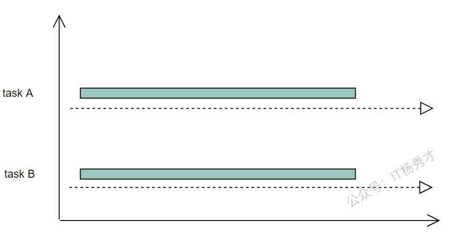
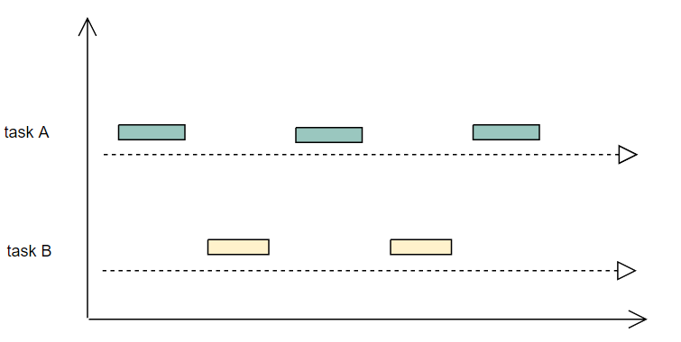

---
tags:
  - Go
  - golang
  - go基础语法
  - 并发概述
---

# **并发概述**

## **进程与线程**
谈到并发或者并行一个绕不开的话题就是进程和线程，弄清楚进程与线程的本质是并发编程的前提，那么究竟什么是进程，什么是线程呢？
可以这样理解：
- 进程就是运行着的程序，它是程序在操作系统的一次执行过程，是一个程序的动态概念，进程是操作系统分配资源的基本单位
- 线程可以理解为一个进程的执行实体，它是比进程粒度更小的执行单元，也是真正运行在cpu上的执行单元，线程是CPU调度资源的基本单位
进程中可以包含多个线程，需要记住进程和线程一个是操作系统分配资源的基本单位(进程)，一个是操作系统调度资源的基本单位(线程)

## **协程**
协程可以理解为用户态线程，是更微量级的线程。区别于线程，协程的调度在用户态进行，不需要切换到内核态，所以不由操作系统参与，由用户自己控制。在一些支持协程高级语言中，往往这些语言都实现了自己的协程调度器，比如go语言就有自己的协程调度器，这个会在后面专门讲协程调度原理的时候讲。
- 协程有独立的栈空间，但是共享堆空间。
- 一个进程上可以跑多个线程，一个线程上可以跑多个协程

## **并发与并行**
很多时候大家对于并行和并发的概念还比较模糊，其实只需要根据一点来判断即可，能不能同时运行。两个任务能同时运行就是并行，不能同时运行，而是每个任务执行一小段，交叉执行，这种模式就是并发。

如图（并行）所示，两个任务一直运行，切实同时运行着，这就是并行模式，要注意并行的话一定要有多个核的支持，因为只有一个cpu的话，同一时间只能跑一个任务，如图（并发）所示，两个任务，每次只执行一小段，这样交叉的执行，就是并发模式，并发模式在单核cpu上是可以完成的

