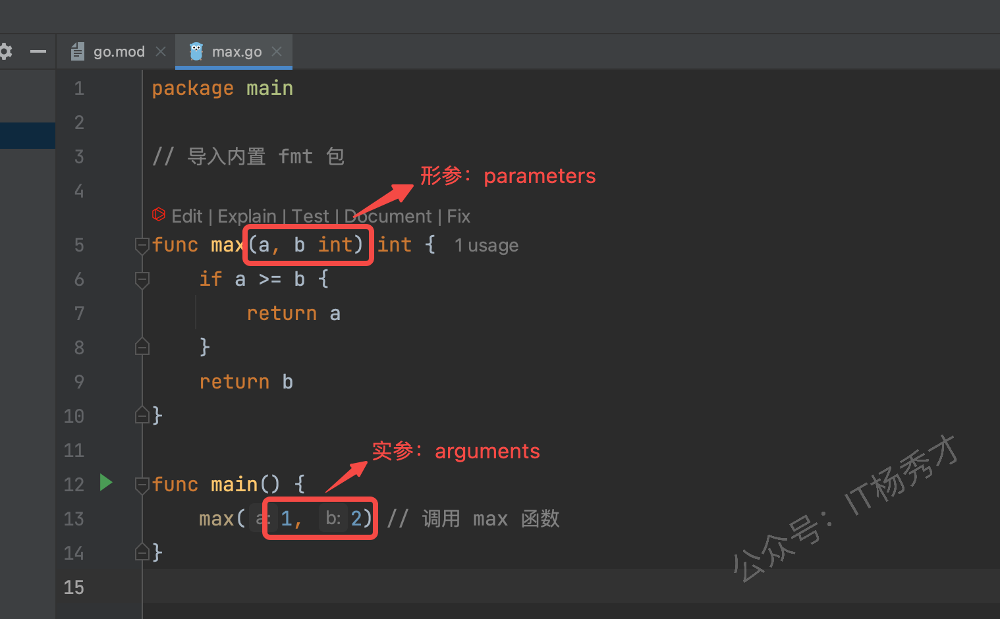
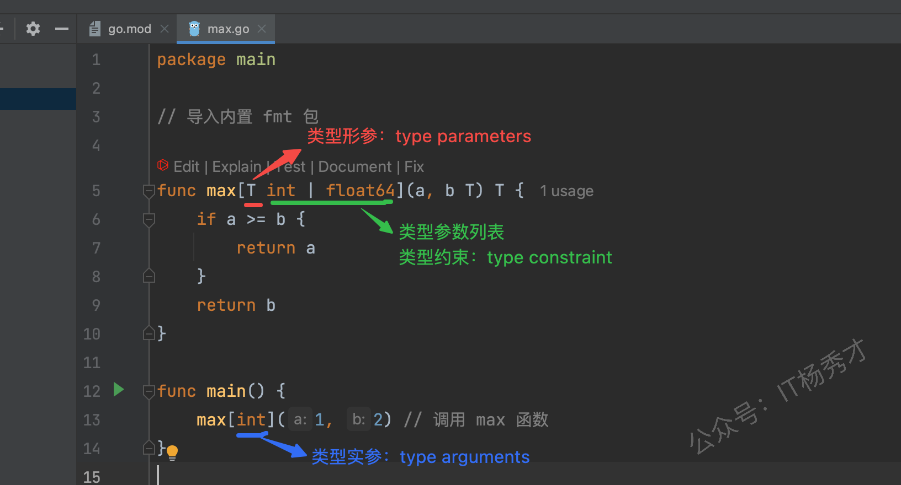
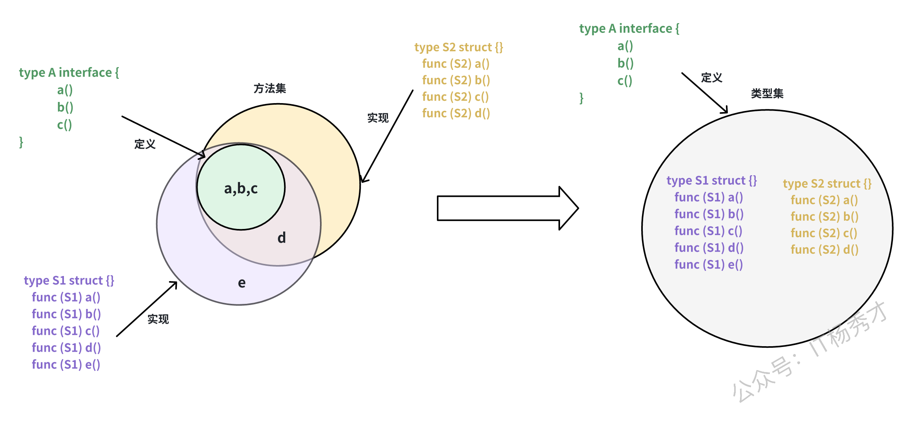
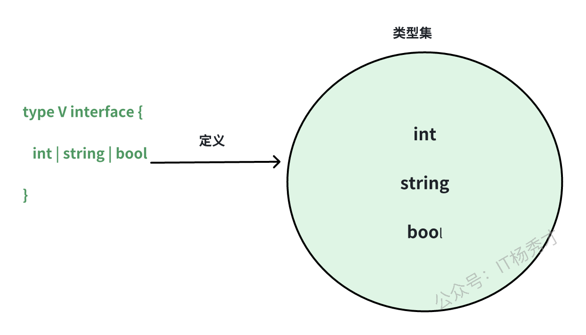

---
tags:
  - Go
  - golang
  - go进阶
  - 泛型
---

# **泛型**
在Go 1.18版本中，泛型特性被引入，这是Go语言自发布以来最重要的更新之一。

## **什么是泛型**
泛型允许开发者在编写代码时不必立即指定具体的数据类型，而是在使用时再确定。换句话说，泛型使得我们可以编写适用于多种数据类型的通用代码。
泛型是一种编写与具体类型无关的代码的方法，它使得我们可以创建适用于多种类型的函数和数据结构。

## **为什么需要泛型**
假设我们需要实现一个函数来计算切片中元素的总和：
```go
func sumInts(numbers []int) int {
    total := 0
    for _, num := range numbers {
        total += num
    }
    return total
}

fmt.Println(sumInts([]int{1, 2, 3, 4}))  // 10
```
然而，这个函数只能处理`[]int`类型的切片。如果我们想支持`[]float64`类型的切片，就需要再定义一个类似的函数：
```go
func sumFloats(numbers []float64) float64 {
    total := 0.0
    for _, num := range numbers {
        total += num
    }
    return total
}
```
如果我们还需要支持其他类型的切片，就需要再定义相应的函数。这种重复的代码显然是低效的，因为计算总和的逻辑并不依赖于具体的元素类型。

在Go 1.18之前，我们可以通过反射来解决这个问题，但反射会降低代码的执行效率，并且失去了编译期的类型检查，同时大量的反射代码也会让程序变得难以理解。

类似这样的场景非常适合使用泛型。从Go 1.18开始，我们可以使用泛型来编写一个适用于所有元素类型的通用`sum`函数：

```go
func sumGeneric[T int | float64](numbers []T) T {
    var total T
    for _, num := range numbers {
        total += num
    }
    return total
}
```

## **泛型语法**
泛型为Go语言引入了三个重要的新特性：

1. 支持在函数和类型定义中使用类型参数,使其更加通用。
2. 扩展了接口的概念,使其可以表示一组类型的集合,不再局限于方法集。
3. 引入智能类型推导机制,在很多场景下可以省略显式的类型参数。

### **类型参数**

#### **类型形参和类型实参**

函数在使用上需要在函数定义时指定形参，函数调用时需要传入实参。



在引入范型后，Go语言的函数和类型现在可以包含类型参数。类型参数列表的语法类似于普通参数列表，但使用方括号（`[]`）而不是圆括号（`()`）。



借助泛型，我们可以声明一个适用于**一组类型**的`max`函数。

```go
func max[T int | float64](a, b T) T {
    if a > b {
        return a
    }
    return b
}
```

#### **类型实例化**

这次定义的`max`函数同时支持`int`和`float64`两种类型，也就是说当调用`max`函数时，我们既可以传入`int`类型的参数。

```go
m1 := max[int](3, 5)  // 5
```

也可以传入`float64`类型的参数。

```go
m2 := max[float64](2.5, 3.5)  // 3.5
```

向 `max` 函数提供类型参数（在本例中为`int`和`float64`）称为实例化（ _instantiation_ ）。

类型实例化分两步进行：

1. 首先，编译器在整个泛型函数或类型中将所有类型形参（type parameters）替换为它们各自的类型实参（type arguments）。
2. 其次，编译器验证每个类型参数是否满足相应的约束。

在成功实例化之后，我们将得到一个非泛型函数，它可以像任何其他函数一样被调用。例如：

```go
fmax := max[float64] // 类型实例化，编译器生成T=float64的max函数
m2 = fmax(1.2, 2.3)  // 2.3
```

`max[float64]`得到的是类似我们之前定义的`maxFloat64`函数——`fmax`，我们可以在函数调用中使用它。

#### **类型参数的使用**

除了函数中支持使用类型参数列表外，类型也可以使用类型参数列表。

```go
type List[T any] []T

type Pair[K comparable, V any] struct {
    Key   K
    Value V
}

type Node[T any] struct {
    next  *Node[T]
    value T
}
```

在上述泛型类型中，`T`、`K`、`V`都属于类型形参，类型形参后面是类型约束，类型实参需要满足对应的类型约束。

泛型类型可以有方法，例如为上面的`Node`实现一个添加元素的`Add`方法。

```go
func (n *Node[T]) Add(value T) {
    newNode := &Node[T]{value: value}
    n.next = newNode
}
```

要使用泛型类型，必须进行实例化。`Node[string]`是使用类型实参`string`实例化 `Node` 的示例。

```go
var stringNode Node[string]
```

#### **类型约束**

普通函数中的每个参数都有一个类型；该类型定义一系列值的集合。例如，我们上面定义的非泛型函数`maxFloat64`那样，声明了参数的类型为`float64`，那么在函数调用时允许传入的实际参数就必须是可以用`float64`类型表示的浮点数值。

类似于参数列表中每个参数都有对应的参数类型，类型参数列表中每个类型参数都有一个**类型约束**。类型约束定义了一个类型集——只有在这个类型集中的类型才能用作类型实参。

Go语言中的类型约束是接口类型。

就以上面提到的`max`函数为例，我们来看一下类型约束常见的两种方式。

类型约束接口可以直接在类型参数列表中使用。

```go
// 类型约束字面量，通常外层interface{}可省略
func max[T interface{ int | float64 }](a, b T) T {
    if a > b {
        return a
    }
    return b
}
```

作为类型约束使用的接口类型可以事先定义并支持复用。

```go
// 事先定义好的类型约束类型
type Number interface {
    int | float64
}
func max[T Number](a, b T) T {
    if a > b {
        return a
    }
    return b
}
```

在使用类型约束时，如果省略了外层的`interface{}`会引起歧义，那么就不能省略。例如：

```go
type PtrSlice[T *int] []T  // T*int ?

type PtrSlice[T *int,] []T  // 只有一个类型约束时可以添加`,`
type PtrSlice[T interface{ *int }] []T // 使用interface{}包裹
```

### **类型集**

**从Go1.18版本开始，接口类型的定义发生了变化，不再仅仅定义方法集（method set），而是定义类型集（type set）。** 这意味着接口类型不仅可以作为值的类型，还可以作为类型约束使用。



将接口类型视为类型集而不是方法集的一个好处是：我们可以显式地向类型集中添加类型，从而以新的方式控制类型集。

事实上，Go语言扩展了接口类型的语法，使我们能够在接口中添加类型。例如

```go
type Value interface {
    int | string | bool
}
```
上述的代码定义了一个包含 `int`、 `string` 和 `bool` 类型的类型集。



自 Go 1.18 起，接口不仅可以嵌入其他接口，还可以嵌入任意类型、类型的联合或具有相同底层类型的无限类型集合。当接口用作类型约束时，其定义的类型集会精确地指定允许作为相应类型参数的类型。

1.  `|`符号  
使用`|`运算符可以将多个类型组合成一个类型集合,例如`T1 | T2`表示一个包含类型T1和T2的类型集。下面的`Numeric`接口就定义了一个由`Integer`和`Float`类型组成的类型集。
```go  
type Numeric interface {  
    Integer | Float  
}  
```

2.  `~`符号  
`~T`运算符用于匹配所有以T为底层类型的类型集合。比如`~string`不仅匹配string类型本身,还会匹配所有以string为底层类型的自定义类型。
```go  
type CustomString string  // CustomString的底层类型是string  
```  
**注意：**`~`符号后面只能是基本类型。
接口作为类型集合的新机制为Go语言带来了强大的类型约束能力。需要注意的是,目前这种使用新语法定义的接口类型仅限于作为类型约束使用,不能作为普通的接口类型使用。

#### **any接口**
Go 1.18版本中引入了一个新的预声明标识符`any`，它是空接口类型`interface{}`的别名。这个别名的引入可以在类型参数列表中使用时提供更简洁的语法。
```go
// src/builtin/builtin.go
type any = interface{}
```

由此，我们可以使用如下代码：

```go
func process[S ~[]E, E any](data S) {
    // 处理数据
}
```

### **类型推断**

类型推断可以让编译器自动推导出类型参数的具体类型,从而简化泛型函数的调用语法。虽然类型推断的实现机制比较复杂,但它极大地提升了泛型代码的使用体验,让开发者可以更自然地编写和调用泛型函数。

#### **函数参数类型推断**

在使用泛型函数时,如果每次都需要显式指定类型参数会比较麻烦。以我们以之前的 `max` 函数为例:
```go
func max[T int | float64](a, b T) T {
    if a > b {
        return a
    }
    return b
}
```
在这个函数中,`T`是一个类型形参,它定义了`a`和`b`参数的类型。调用这个函数时,我们可以明确指定类型实参:
```go
var x, y, result float64
result = max[float64](x, y) // 显式指定类型实参
```

在大多数情况下，编译器能够根据传入的参数自动推导出类型参数 `T` 的具体类型。这种类型推导机制让我们可以省略显式的类型参数声明，使代码更加简洁优雅。

```go
var x, y, result float64
result = max(x, y) // 无需指定类型实参
```
这种类型推断机制被称为函数实参类型推断,它可以根据传入的实参自动推导出函数的类型参数。但需要注意的是,这种推断只对函数参数中使用的类型参数有效,对于那些仅在返回值或函数体内部使用的类型参数则无法推断。比如对于 `CreateT[T any]() T` 这样的函数,由于类型参数 `T` 只用在返回值中,编译器就无法进行类型推断。

#### **约束类型推断**

Go 语言还提供了一种称为_约束类型推断_的机制。为了更好地理解这个概念，让我们通过一个处理整数缩放的示例来说明：

```go
// MultiplyEach 返回切片中每个元素都乘以factor的副本切片
func MultiplyEach[E constraints.Integer](s []E, factor E) []E {
    result := make([]E, len(s))
    for i, v := range s {
        result[i] = v * factor
    }
    return result
}
```

上面的泛型函数可以处理任何整数类型的切片数据。

让我们来看一个具体的应用场景。假设我们需要处理一个表示多维坐标的 `Vector` 类型。从本质上说，`Vector` 就是一个存储坐标值的整数切片。为了方便使用，我们为这个类型添加了一些额外的功能，比如一个用于格式化输出的 `String` 方法。

```go
type Vector []int32

func (v Vector) String() string {
    b, _ := json.Marshal(v)
    return string(b)
}
```

因为`Vector`类型本质上是一个整数切片,所以我们可以尝试直接使用之前定义的`MultiplyEach`函数来处理它:

```go
func MultiplyAndDisplay(v Vector) {
    result := MultiplyEach(v, 3)
    fmt.Println(result.String()) // 编译失败
}
```

这段代码在编译时会失败,错误信息为`result.String undefined (type []int32 has no field or method String`。

这个问题的根源在于泛型函数`MultiplyEach`的返回值类型。该函数返回一个`[]E`类型的切片,其中`E`是切片元素的类型。当我们传入`Vector`类型(底层是`[]int32`)时,函数返回的是一个普通的`[]int32`切片,而不是我们期望的`Vector`类型。这导致返回值无法调用`Vector`类型特有的`String`方法。

要修复这个问题,我们需要修改`MultiplyEach`函数的定义,让它能够保持输入切片的具体类型。我们需要为切片本身引入一个新的类型参数。

```go
func MultiplyEach[S ~[]E, E constraints.Integer](s S, factor E) S {
    result := make(S, len(s))
    for i, v := range s {
        result[i] = v * factor
    }
    return result
}
```

我们添加了一个新的类型参数`S`，它代表切片的具体类型。通过约束`~[]E`，我们指定了`S`必须是一个元素类型为`E`的切片类型。函数返回值类型也改为`S`，这样就能保持输入切片的原始类型。在函数实现中，唯一的变化是使用`S`而不是`[]E`来创建结果切片。

这样修改后的`MultiplyEach`函数既可以处理普通的整数切片，也可以处理`Vector`这样的自定义切片类型。

这里有一个有趣的问题：为什么我们可以直接调用`MultiplyEach(v, 3)`而不需要显式指定类型参数，即不需要写成`MultiplyEach[Vector, int32](v, 3)`？

`MultiplyEach`函数定义了两个类型参数：`S`和`E`。当我们调用`MultiplyEach(v, 3)`时，编译器通过函数参数类型推断可以确定`S`的类型是`Vector`。但对于类型参数`E`，由于`3`是一个无类型常量，仅通过参数类型推断无法确定其具体类型（它可能被推断为默认的`int`类型，这与`Vector`的底层类型`[]int32`不匹配）。这时，编译器会使用一种叫做**约束类型推断**的机制。

约束类型推断是指编译器根据类型参数的约束关系来推导类型参数。当一个类型参数的约束是基于另一个类型参数定义的，并且其中一个类型参数已知时，就可以通过约束关系推断出另一个类型参数。

在我们的例子中，`S`的约束是`~[]E`，这表明`S`必须是一个元素类型为`E`的切片类型。当编译器知道`S`是`Vector`（即`[]int32`）时，就可以通过这个约束关系推断出`E`必须是`int32`。这就是为什么我们可以省略显式的类型参数。

## **小结**
泛型的引入为Go语言带来了更强大的抽象能力。当我们在项目中遇到需要为不同类型编写相似逻辑的场景时,泛型可以帮助我们优雅地解决这个问题。它不仅可以减少代码重复,还能保持类型安全。

泛型和接口各有其适用场景。接口更适合定义对象的行为规范,而泛型则更适合处理与具体类型无关的通用算法和数据结构。两者结合使用,可以让我们的代码更加简洁、安全和可维护。