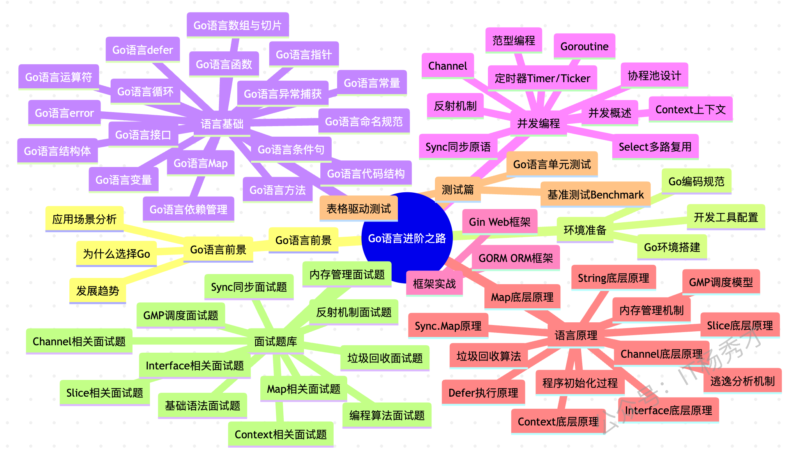
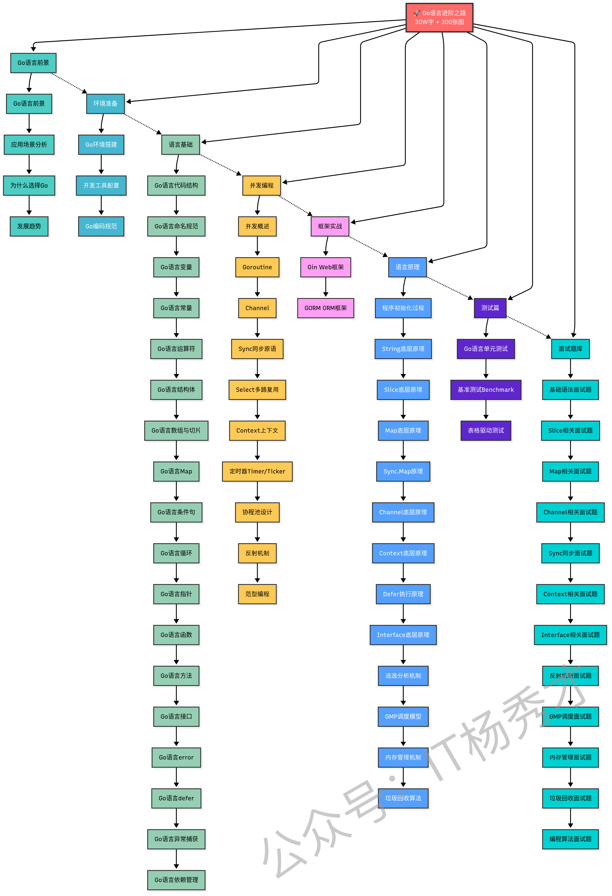

# **Go前言**

大家好，我是秀才，是这个《Go语言进阶之路》系列的作者，这是一份**专注Go语言学习与面试的开源资料**，内容都是整理于我在实际开发和面试过程中的经验总结。

简单介绍下《Go语言进阶之路》，整个内容共有 **`30W` 字 + `300` 张图**，涵盖从基础语法到高并发编程的完整学习路径，目的也很简单，想通过「实战+图解」的方式，帮助大家系统掌握Go语言开发技能。



## **适合什么群体？**

《Go语言进阶之路》主要是**面向后端开发者**的，特别适合以下群体：

- 🌱 **编程小白**：零基础或刚接触编程不久，想要选择Go作为第一门编程语言的新手同学
- 🔰 **Go语言初学者**：有一定编程基础，想要系统学习Go语言的同学
- 🚀 **后端开发工程师**：希望掌握Go高并发编程和性能优化技巧的开发者  
- 📚 **求职面试者**：准备Go语言相关技术面试的求职者
- 💡 **技术转型者**：从其他语言转向Go语言开发的程序员

非常适合小白学编程，或者有一点编程基础，但是又想系统学习Go语言，或者知识点比较零散需要串联起来的同学。说白了，<span style="color:rgb(74, 99, 255); font-weight: bold;">**这个《Go语言进阶之路》就是为了帮助大家从入门到精通再到面试而准备的**</span>。

因为秀才写的Go语言教程有两大特色：**实战为王**，注重动手实践；**深入底层**，剖析运行原理。让你既能写出代码，更能理解代码背后的运行机制。

相信你在学习的过程中，你心里的感受会是：

- 「原来Go语言可以这样理解，比书上讲的清楚多了」
- 「这些实战案例太有用了，直接就能用到项目中」
- 「Go的并发编程原来是这么回事，豁然开朗」
- 「面试题讲解太到位了，感觉面试稳了」

当然，也适合面试突击时拿来看。Go语言进阶之路里的内容基本覆盖了面试常见的知识点，比如：

- Goroutine 和 Channel 的底层原理是什么？
- GMP 调度模型是如何工作的？
- Go 的内存管理和垃圾回收机制？
- Interface 的底层实现原理？
- Map 和 Slice 的扩容机制？
- Context 的使用场景和注意事项？
- ...

不敢说 100% 涵盖了面试的Go语言问题，但是至少 95% 是有的，而且内容的深度应对大厂面试也是绰绰有余。

## **要怎么阅读？**

这份《Go语言进阶之路》不是教科书，而是基于实战经验的技术分享，所以更加注重实用性和可操作性，都是直击重点，不绕弯，而且有很多书上看不到的实战技巧。

阅读的顺序建议按照左侧的学习目录顺序来，但你也可以根据自己的需要，通过搜索功能快速定位到感兴趣的章节。

《Go语言进阶之路》内容结构如下：



### **Go语言前景分析** 👇
- [**Go语言前景**](./Go语言前景/Go语言前景.md)：为什么选择Go？Go的应用场景分析

### **环境准备篇** 👇
- [**Go环境搭建**](./Go环境搭建/Go环境搭建.md)：从安装到配置的完整指南

### **语言基础篇** 👇
- [**Go语言代码结构**](./Go语言基础/Go语言代码结构.md)：理解Go程序的组织方式  
- [**Go语言命名规范**](./Go语言基础/Go语言命名规范.md)：Go语言的命名约定和规范
- [**Go语言变量**](./Go语言基础/Go语言变量.md)：数据类型和变量声明
- [**Go语言常量**](./Go语言基础/Go语言常量.md)：常量的定义和使用
- [**Go语言运算符**](./Go语言基础/Go语言运算符.md)：各种运算符的使用和优先级
- [**Go语言结构体**](./Go语言基础/Go语言结构体.md)：自定义类型和方法定义
- [**Go语言数组与切片**](./Go语言基础/Go语言数组与切片.md)：数组和切片的区别与使用
- [**Go语言Map**](./Go语言基础/Go语言Map.md)：映射类型的操作和应用场景
- [**Go语言条件句**](./Go语言基础/Go语言条件句.md)：条件控制语句的使用
- [**Go语言循环**](./Go语言基础/Go语言循环.md)：循环语句和迭代控制
- [**Go语言指针**](./Go语言基础/Go语言指针.md)：指针的概念和内存地址操作
- [**Go语言函数**](./Go语言基础/Go语言函数.md)：函数定义、参数传递、返回值
- [**Go语言方法**](./Go语言基础/Go语言方法.md)：方法接收者和方法集
- [**Go语言接口**](./Go语言基础/Go语言接口.md)：接口的定义和多态实现
- [**Go语言error**](./Go语言基础/Go语言error.md)：错误处理的Go语言方式
- [**Go语言defer**](./Go语言基础/Go语言defer.md)：延迟执行和资源清理
- [**Go语言异常捕获**](./Go语言基础/Go语言异常捕获.md)：panic和recover机制
- [**Go语言依赖管理**](./Go语言基础/Go语言依赖管理.md)：使用go module管理项目依赖
- [**Go语言命名规范**](./Go语言基础/Go语言命名规范.md)：Go语言的命名约定和规范
- [**Go编码规范**](./Go编码规范/Go编码规范.md)：写出优雅Go代码的最佳实践

### **并发编程篇** 👇
- [**并发概述**](./Go语言进阶/并发概述.md)：并发与并行的区别
- [**Goroutine**](./Go语言进阶/Goroutine.md)：轻量级线程的使用和管理
- [**Channel**](./Go语言进阶/Channel.md)：通道的各种使用模式
- [**Sync**](./Go语言进阶/Sync.md)：互斥锁、读写锁、条件变量等同步原语
- [**Select**](./Go语言进阶/Select.md)：多路复用的通道操作
- [**Context**](./Go语言进阶/Context.md)：优雅的并发控制和超时处理
- [**定时器**](./Go语言进阶/定时器.md)：Timer和Ticker的使用场景
- [**协程池**](./Go语言进阶/协程池.md)：Goroutine池的设计和实现
- [**反射**](./Go语言进阶/反射.md)：运行时类型检查和动态调用
- [**范型**](./Go语言进阶/范型.md)：Go 1.18+ 泛型编程

### **框架实战篇** 👇
- [**Gin**](./Go语言框架/gin.md)：高性能HTTP Web框架实战
- [**GORM**](./Go语言框架/gorm.md)：优雅的ORM框架使用指南

### **语言原理篇** 👇  
- [**程序初始化**](./Go语言原理/程序初始化.md)：Go程序的启动过程解析
- [**String原理**](./Go语言原理/string原理.md)：字符串的不可变性和内存优化
- [**Slice原理**](./Go语言原理/slice原理.md)：切片的底层数组和扩容策略
- [**Map原理**](./Go语言原理/map原理.md)：哈希表的实现和扩容机制  
- [**Sync.Map原理**](./Go语言原理/sync.map原理.md)：并发安全的映射实现
- [**Channel原理**](./Go语言原理/channel原理.md)：通道的底层实现和同步机制
- [**Context原理**](./Go语言原理/context原理.md)：上下文传递和取消机制
- [**Defer原理**](./Go语言原理/defer原理.md)：延迟调用的执行时机和性能
- [**Interface原理**](./Go语言原理/interface原理.md)：接口的底层数据结构
- [**逃逸分析**](./Go语言原理/逃逸分析.md)：变量分配在栈还是堆的判断
- [**GMP调度原理**](./Go语言原理/gmp调度原理.md)：Goroutine调度模型深度解析
- [**内存管理**](./Go语言原理/内存管理.md)：Go的内存分配和管理机制
- [**垃圾回收**](./Go语言原理/垃圾回收.md)：三色标记算法和GC优化

### **测试篇** 👇  
- [**Go语言单测**](./Go语言单测/Go语言单测.md)：单元测试、基准测试、表格驱动测试

### **面试题库** 👇
- [**基础面试题**](./Go面试题库/基础面试题.md)：Go语言基础语法相关面试题
- [**Slice面试题**](./Go面试题库/Slice面试题.md)：切片相关面试题
- [**Map面试题**](./Go面试题库/Map面试题.md)：映射相关面试题
- [**Channel面试题**](./Go面试题库/Channel面试题.md)：通道使用和原理相关面试题
- [**Sync面试题**](./Go面试题库/Sync面试题.md)：同步原语相关面试题
- [**Context面试题**](./Go面试题库/Context面试题.md)：上下文相关面试题
- [**Interface面试题**](./Go面试题库/Interface面试题.md)：接口相关面试题
- [**反射面试题**](./Go面试题库/反射面试题.md)：反射机制相关面试题
- [**GMP面试题**](./Go面试题库/GMP面试题.md)：Goroutine调度相关面试题  
- [**内存管理面试题**](./Go面试题库/内存管理面试题.md)：内存分配和管理相关面试题
- [**垃圾回收面试题**](./Go面试题库/垃圾回收面试题.md)：GC机制相关面试题
- [**代码面试题**](./Go面试题库/代码面试题.md)：编程实现题和算法题

## **学习建议**

### 🎯 新手入门路径
```
环境准备 → 语言基础 → 简单实战 → 并发编程基础 → 框架实战
```

### 🚀 进阶提升路径  
```
语言原理 → 高级并发编程 → 性能优化 → 架构设计
```

### 📚 面试准备路径
```
基础面试题 → 原理深入 → 高频面试题 → 项目实战经验
```

## **质量如何？**

这份《Go语言进阶之路》自发布以来，已经帮助了数千名开发者：
- 🎯 成功转型Go开发工程师
- 💼 顺利通过大厂技术面试  
- 🚀 在项目中应用Go高并发编程
- 📈 提升了代码质量和开发效率

很多读者反馈说，看了秀才的Go语言教程后，对Go的理解更加深入，在面试和实际工作中都得心应手。

## **有错误怎么办？**

如果你在学习的过程中，**发现有任何错误或者疑惑的地方，欢迎通过以下方式给我反馈**：

- 到对应文章底部评论留言
- 到GitHub提交issue或PR
- 微信群内直接交流，下面有学习交流群的加入方式

秀才会及时修正和完善内容，让这份学习资料越来越好！

## **关于作者**

秀才，资深Go开发工程师，有多年互联网后端开发经验，专注于Go语言生态和高并发系统设计

**一个人的学习是孤独的，但是一群人的学习是快乐的。欢迎加入我们的学习交流群，一起学习，一起进步！扫描下方二维码，回复<span style="color:rgb(71, 99, 255);">「加群」</span>，拉你进入百人学习交流群。回复<span style="color:rgb(74, 71, 255);">「Go面试」</span>，领取Go面试题库PDF。**


相信通过《Go语言进阶之路》的学习，你一定能够：
- ✅ 系统掌握Go语言核心特性
- ✅ 深入理解Go并发编程模型  
- ✅ 具备Go项目实战开发能力
- ✅ 顺利通过Go相关技术面试

让我们一起在Go语言的世界里不断进步！🚀

---

*最新内容会持续更新，建议收藏本页面随时查看最新进展* 