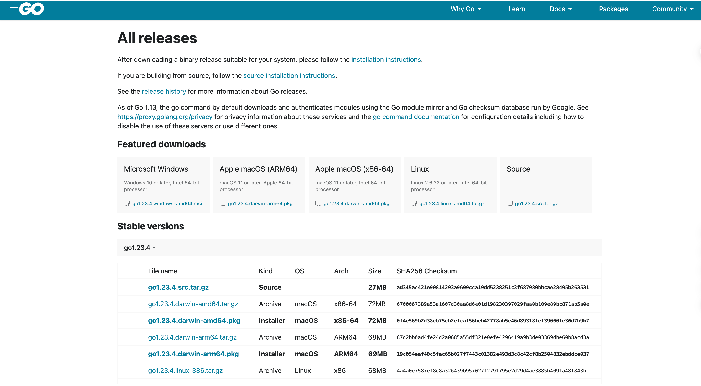
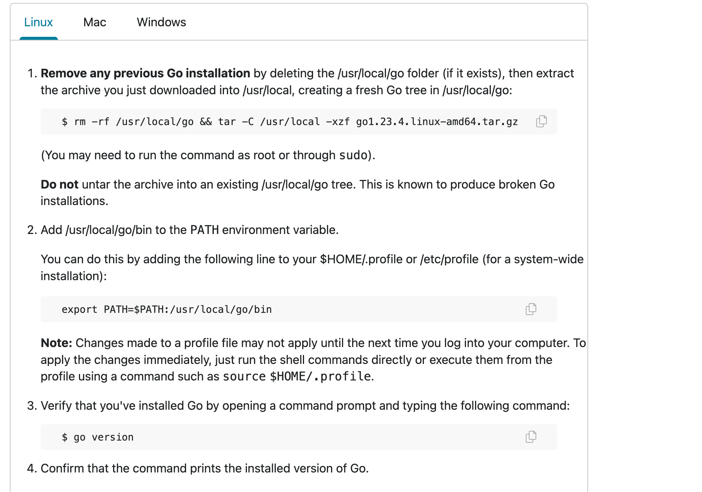
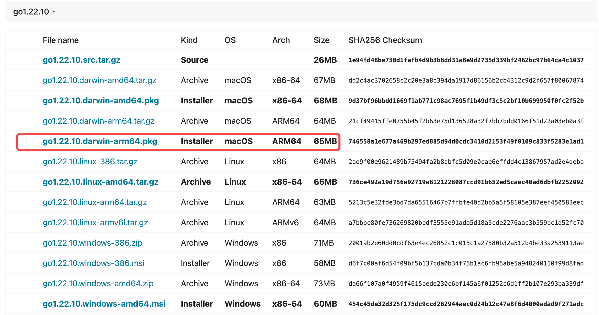
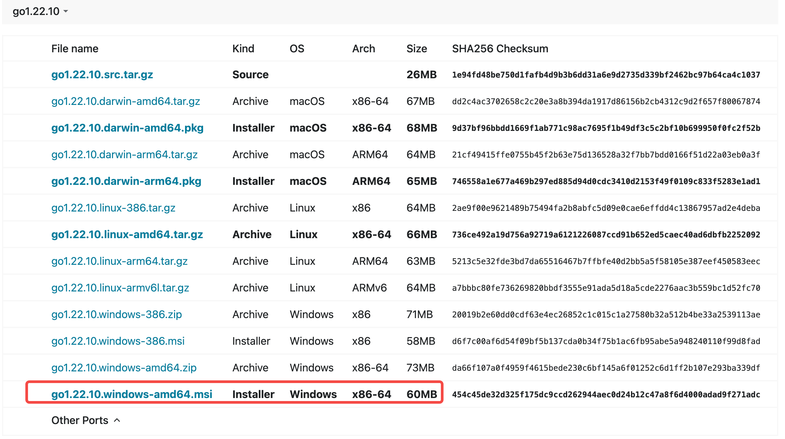

---
tags:
  - Go
  - 环境搭建
---

Golang是云原生时代的宠儿，它最大的优点在于简单有效，简单在于上手迅速、代码规范、部署方便；有效在于它能很容易写出高并发的代码，处理能力强。
Golang能适用于web后台、数据库、云原生、区块链等大多数场景，大厂与其相关的招聘岗位也在逐年增加，因此，学习Golang这样相对较新、发展前景很好的语言，我们是可以实现弯道超车的。
本文环境安装部分，每个步骤都贴出了执行命令，希望小伙伴们读完此文，自己动手安装Go环境，实现快速入门，用Golang开启新的旅程。
下面我们就从最基础的环境部署开始，开启我们的Golang之旅吧~

# 1. 安装Golang

Go语言可以运行在Linux，Windows以及Mac系统上，对于开发者而言，一般是在本地Windows或者Mac上开发，然后将Go服务部署到Linux上去运行，所以在安装上来说的话，会这三个平台的安装就可以了。
下面将分别介绍这三个平台的安装方式。Go语言官方安装包地址：[https://golang.org/dl/](https://golang.org/dl/)大家可以上去选择自己需要的版本，通常来说选择次新版本即可，下面的演示选择的是go1.22.10版本




打开[https://go.dev/doc/install](https://go.dev/doc/install)可以看到各个系统下的安装介绍



## 1.1 Linux 安装方式
1. 下载安装包下载安装包到当前目录，这里以go1.22.10为例
```shell
wget https://go.dev/dl/go1.22.10.linux-arm64.tar.gz
```
2. 将go压缩包解压到指定目录,Linux环境下一般解压到/usr/local目录下
```shell
rm -rf /usr/local/Go语言系列 && tar -C /usr/local -xzf go1.16.2.linux-amd64.tar.gz
```
3. 设置环境变量PATH
   Linux下有两个文件可以配置环境变量，/etc/profile文件配置所有用户生效；$HOME/.profile对当前用户生效，为了简单起见，选择/etc/profile配置就可以了。
   当然如果
5. 根据自己的情况自行选择一个文件打开，添加如下两行代码，保存退出。
```shell
export PATH=$PATH:/usr/local/Go语言系列/bin
```
4. 检查Go版本
```shell
Go语言系列 version
```
检查Go的版本，如果执行上述命令能够成功显示go的版本，则说明Go环境安装成功

## 1.2 Mac安装
Mac系统下的安装就很简单了，直接选择对应版本的安装包，图形界面下直接点击下一步可视化安装就好了



## 1.3 Windows安装
Windows系统的安装和Mac一样简单，也是直接点击安装包进入安装界面，图形话安装即可。




