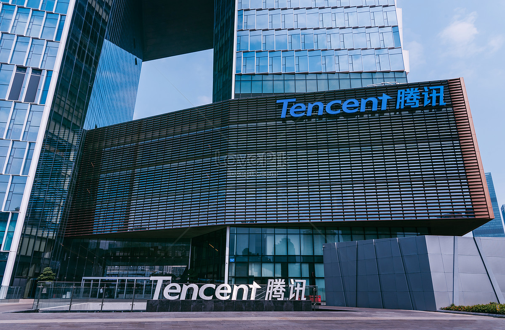

# **关于作者 Q&A**

## **我是什么时候毕业的？**

我是2017年毕业的，本硕就读于武汉一个普通的211大学，武汉理工大学。

说起来有点不好意思，本科期间的我并不是一个爱学习的好学生，可以说是一个十足的学渣。那时候游戏就是我的全部，加上我本身又是调剂到计算机专业，当时对编程没有一丝兴趣。所以整天沉迷于DOTA，沉迷于天梯，整个大学四年都是浑浑噩噩，过的那是相当的轻松惬意。所以到了大四根本就没有去找工作，也没打算找工作，仅仅是因为不想毕业这么快上班，又上了三年研究生，想的就是再续三年大学。

现在回想起来，那段时光虽然"荒废"，但也让我明白了一个道理：**人生没有白走的路，每一步都算数**。正是因为经历过迷茫和堕落，才更加珍惜后来的觉醒和成长。

## **我是什么时候开始认真学习的？**

这里我要特别感谢我的研究生导师了，她是个治学严谨，一丝不苟的人。读研初期，其实我还是一如既往的游戏人生。后来由于有论文必须要发表，我的导师是一定要看到实验数据，才会让我们动笔写论文的，我记得当时把我跟另一个同门哥们一直留到过年前一天，直到实验有了一定的结果，才让我们回家过年。这件事后，我也才开始意识觉醒，开始意识到大学的意义仍旧是学习。
之后那段时间真的很拼，平常有课就上课，没课在实验室刷题、看书、做项目，把本科拉下的东西一一捡起来，把本科的专业课，java，数据库，操作系统，数据结构这些都从头系统学习了一遍。周围的同学都说我像变了一个人，从一个游戏少年变成了学习狂人。**人生最怕的不是起点低，而是永远不开始改变。** 虽然起步晚了，但只要开始，什么时候都不算晚。

## **我的职业经历是怎样的？**

### **实习阶段：滴滴 & 华为**
研究生期间，我先后去了滴滴和华为实习，这两段经历让我对开发岗位的工作有了初步的认识，更让我认识到，学习它真的有用！！！我们所学的技能，就是说我们工作场景所必须的，也至此，养成了持续学习的习惯，会一直关注一些新的技术和趋势。

### **毕业初期：武汉华为**
毕业后我选择了武汉华为，主要是因为离家近一些。同时二线城市，武汉压力也没有那么大。但工作一段时间后，我发现这并不是自己想要的生活。华为自然是一家很伟大的公司，但是它偏军队化的管理模式以及相对传统的企业文化，让我不是很适应，也不太喜欢，我更想融入的是一种相对年轻和open的文化，或许互联网更适合我

### **转折点：南下深圳**
于是我做了一个重要决定：裸辞，**南下深圳，进入互联网**。这个决定改变了我的人生轨迹。说来也是很佩服我自己，当年我真就是啥工作没找，对深圳也不了解，入职半年后就在年底直接提了辞职，年后就直接到深圳开始找工作了。可能是年轻吧，无所畏惧，毕竟年轻就是资本，哈哈

### **外企经历：Shopee**
当年的互联网环境还尚在顶峰，来到深圳，来到深圳后，也是很快拿到了腾讯和一家外企Shopee的offer。我选择去了Shopee，这里的工作环境和技术氛围让我眼前一亮，当然开的薪资也是不可抗拒的因素，哈哈。非常年轻的团队、先进的技术栈、开放的工作文化，这些都让我快速成长，也是在这里，让我开始接触到Go语言。尤其是我所在的团队，大家都是同龄人，感觉这里就像是大学的一个班级，大家有共同的语言。在这里的一年多时间也让我交到了很多非常好的朋友，就如同自己的同学一样，至今还时常联系

### **现在：腾讯高级后台工程师**
积累了一些技术和经验后，最后我还是选择去了大厂。后来我进入腾讯担任高级后台工程师，一开始去PC做技术中台，后来又去了IEG做游戏，一步一个脚印走到今天。在这里，我接触到了更大规模的系统架构，更复杂的技术挑战，也遇到了更多优秀的同事。

## **为什么要做技术分享？**

**一路走来，我踩过不少坑，走过不少弯路，曾经淋过雨，现在想给你们撑把伞**。这就是我做技术分享的初心。我深知作为一个小镇做题家从小城市出来、学校背景一般、起步较晚的程序员，成长路上会遇到多少困难和迷茫。

### **我想分享的不仅仅是技术**
- **技术经验**：Go语言、微服务架构、AI应用等实战经验
- **面试攻略**：从华为到腾讯，我总结了一套完整的面试方法论
- **职业规划**：如何从迷茫走向清晰，如何在职场中快速成长
- **心路历程**：那些年我走过的弯路，希望你们能够避免

### **我的技术栈**
- **后端开发**：Golang
- **架构设计**：微服务、分布式系统、高并发处理
- **AI应用**：LangChain、RAG、Agent、MCP、AI编程

## **我为什么选择Go语言？**

在我的职业生涯中，我接触过很多编程语言，但最终选择深耕Go语言，主要有几个原因：

1. **简洁高效**：Go的语法简洁，学习曲线平缓，但功能强大
2. **并发优势**：天生支持高并发，goroutine和channel让并发编程变得简单
3. **云原生**：在微服务和云原生时代，Go是首选语言之一
4. **大厂青睐**：腾讯、字节跳动、滴滴等大厂都在大量使用Go
5. **竞争小**: 现在Go语言的使用者还没有那么多，一般大学也都是C++和Java的教学为主，所以Go的竞争压力不大

更多关于Go语言的优势，可以看：[**Go语言前景**](./go_prospect/go_prospect.md)：

## **我对AI的看法**

作为一个后端工程师，我深深感受到了AI时代的到来。AI会重塑很多行业，这已是不争的事实。我们程序员行业同样不例外，他一定会提升编程效率，这就意味着企业会进一步压缩人力成本，程序员求职会越来越严峻。但是**AI并不是要取代程序员，他只会让专业的人，更高效的做专业的事，所以我们要积极拥抱AI，让自身变得更强大**。我现在专注于AI应用开发，特别是：
- **LangChain应用开发**
- **RAG系统构建**
- **AI Agent设计**
- **AI编程的探索**

## **给年轻程序员的建议**

### **1. 不要害怕起步晚**
我研究生才开始认真学习，工作后才找到方向，但这并不妨碍我走到今天。**流水不争先,争的是滔滔不绝，重要的不是什么时候开始，而是开始后能坚持多久。**

### **2. 技术要深度，也要广度**
- **深度**：至少要有一门语言能够精通
- **广度**：要了解整个技术栈，知道如何选择合适的技术

### **3. 多写多分享**
- 写技术博客，整理自己的知识体系
- 参与开源项目，提升代码质量
- 分享经验，帮助他人也是帮助自己

### **4. 保持学习的心态**
技术更新很快，特别是现在AI时代，**终身学习**不是口号，而是生存必需。

## **联系我**

如果你在学习或工作中遇到问题，欢迎与我交流：

- **网站**：[秀才的进阶之路](https://golangstar.cn)
- **GitHub**：[GolangGuide](https://github.com/Percygu/GolangGuide)
- **微信**：**IT杨秀才**

## **后记**

::: tip 追风赶月莫停留，平芜尽处是春山。

从一个沉迷游戏的少年，到现在的腾讯高级工程师，这条路走得并不容易。但正如我常说的：**每个人都有自己的时区，不要因为别人跑得快就焦虑，也不要因为自己起步晚就放弃。重要的是，一旦开始，就要全力以赴。**

生活本就是有苦有甜，技术路上更是如此。但只要我们保持初心，持续学习，总会找到属于自己的那片天空。愿我们都能在各自的道路上，成为更好的自己。共勉！
:::

---

*最后更新时间：2025年7月*
