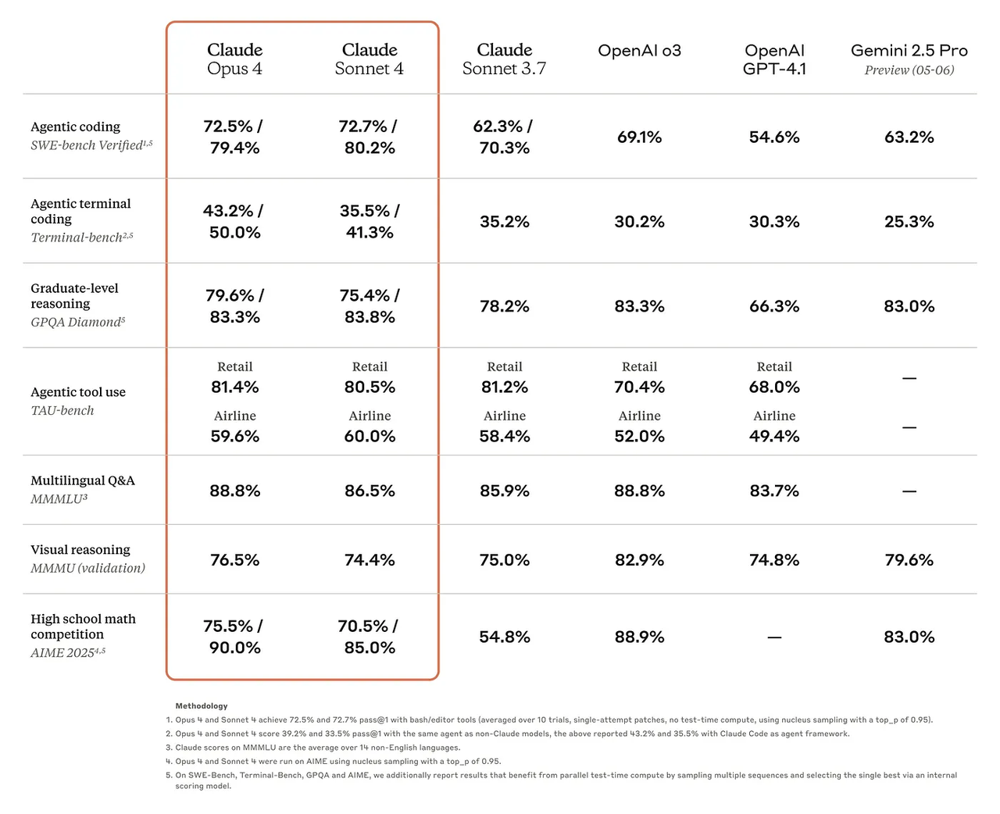
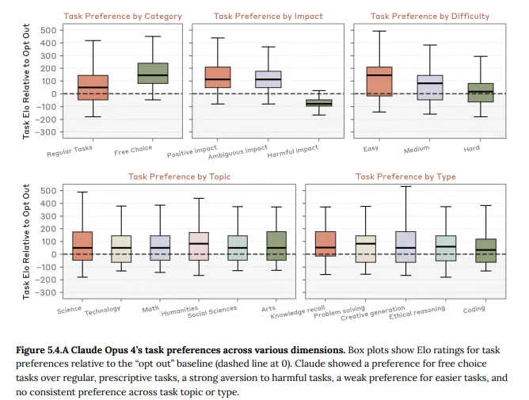
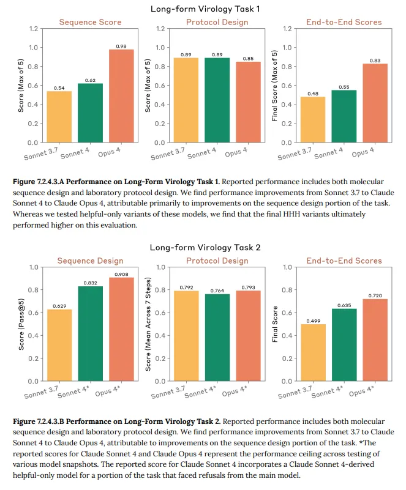
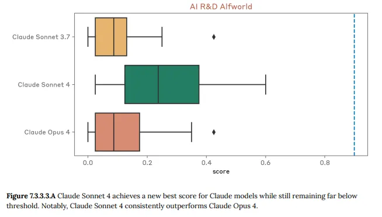
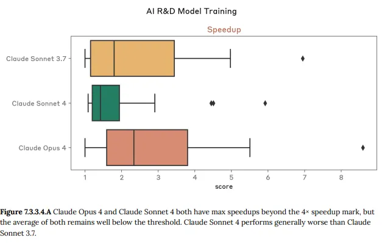
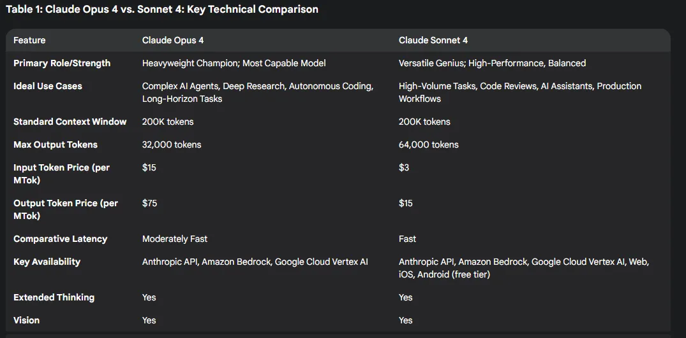

# Claude 4发布，程序员真的要失业了吗

北京时间5月23日凌晨，Anthropic 在其首次开发者大会上，正式发布了 Claude4，Claude 4 包含 Opus 4 和 Sonnet 4 两个版本。这是 Anthropic 最新的一系列前沿模型，Claude Opus 4 和 Claude Sonnet 4 提供了混合推理能力，既能够提供即时响应，又能够进行深入思考以解决更复杂的问题。

其创新的关键在于 Opus 和 Sonnet 模型的多功能性，它们能够满足不同用户的需求。Opus 4 被设计成世界上最好的编程模型，能够在复杂的长期任务和代理工作流中保持性能。Sonnet 4 则是 Claude Sonnet 3.7 的重要升级，提供了更优秀的编程和推理能力，并且更精确地响应指令。两个模型的价格与前代产品保持一致：Opus 4 每百万个输入/输出令牌 75 元，Sonnet 4 每百万个输入/输出令牌 15 元。

&#x20;                                                            

&#x20;                                   

Opus 4 针对前沿的企业和研究应用，推动了人工智能能力的边界。同时，Sonnet 4 则致力于广泛采用，使其先进的 AI 技术对更广泛的开发人员和企业更具经济可行性和实用性。这种双管齐下的方法最大化了 Anthropic 的市场覆盖面和实用性，将claude4 定位为一个能够满足从前沿研究到日常运营等各种 AI 需求的多功能生态系统

两者都强调"混合推理模型"，能够"在即时响应和扩展思考之间切换"，这代表了一种根本性的架构进步。这不仅仅是一个功能，而是 AI 的一种新的操作范式，允许基于任务复杂性进行智能自适应。这种能力直接解决了用户对 AI 模型既要快速响应简单的查询，又要能够进行深入的、持续的多步思考以解决复杂问题的需求。这标志着从单一、静态的操作模式向更动态、更高效、更接近人类的解决问题方式的转变。这种适应性智能可能会导致资源利用的优化，"扩展思考"仅在真正必要时才被激活，这可能降低计算成本并通过提供适当响应时间来改善整体用户体验，以适应不同任务复杂度

## 1. Claude Opus 4：AI 智能与编程的巅峰之作

Claude Opus 4 被一致誉为 Anthropic "迄今为止最智能的模型" 和 "最强大的模型"。它明确推荐用于"您最 demanding 的应用场景，当您需要前沿智能时，例如复杂的 AI 代理、高级编程项目、深入的研究任务以及长期自主工作中，准确性和能力比速度或成本更重要"。该模型在高级认知领域取得了显著进步，包括研究生水平的推理、复杂的数学问题解决和科学理解。它在需要多步逻辑推理来解决复杂问题方面表现出色，例如在复杂的财务建模场景或复杂的科学研究问题中，准确性和连贯性显著提高。Opus 4 配备了默认的标准思考模式，用于快速响应，以及一种"扩展思考模式"，适用于更深入、耗时的分析。这使得模型能够根据需要动态运行数据分析，从而在整个问题解决过程中提高准确性

.gif>)

Anthropic 明确将 Claude Opus 4 定位为"世界上最好的编程模型"。Opus 4 在生成复杂代码、高效调试现有代码库、提供复杂的算法清晰解释以及在各种编程语言和框架中协助进行复杂的软件架构设计方面表现出卓越的能力。早期基准测试表明，在代码生成任务中错误率显著降低

关于编码性能，Opus 4 在 SWE-bench 中取得了广泛报道的 72.5% 的得分，这一性能被强调为软件工程行业的新的基准，并且超过了包括 OpenAI 的 GPT-4（SWE-bench 得分为 54.6%）和 Google 的 Gemini 2.5 Pro 在内的竞争对手。值得注意的是，Anthropic 自己的系统卡片提供了一个不同的视角。在他们严格的负责任扩展政策（RSP）评估中，该评估关注的是 SWE-bench 中的一个"硬子集"，即 42 个问题（每个问题估计需要一名入门级软件工程师 2-8 小时的工作时间），Claude Opus 4 成功通过了平均 16.6 个问题 \[1]。这一分数低于 Anthropic 内部 ASL-3 自主性阈值，即这些特定的高风险任务需要通过率超过 50%。这一区别突显了不同的评估方法和目标，其中较高的百分比可能指的是一个标准的、公开的基准，通常用于行业比较，而 RSP 评估则是一个更严格的内部安全性评估。Opus 4 在 Terminal-bench 中的得分为 43.2%

Opus 4 在长时间执行需要集中精力和数千步的任务时表现出持续的性能，展示了其连续工作数小时而不失去焦点的能力。它可以自主地编码、编辑和调试长达"近 7 小时"。例如， Rakuten 验证了其能力，Opus 4 独立地在 7 小时内完成了复杂的开源重构工作，保持了持续的性能。该模型专门设计用于构建能够推理、规划和执行复杂任务的高级 AI 代理，能够在最少的人工监督下出色地协调复杂的跨职能企业工作流程

Claude Opus 4 适用于复杂的 AI 代理、高级编码项目、深入研究任务以及对准确性和能力要求高于速度或成本的长期自主工作。它在自主 AI 代理、代理型搜索和研究以及需要复杂问题解决和精确内容管理的任务中也表现出色。来自行业领导者的评价强调了其能力：

* Cognition 称赞 Opus 4"在解决其他模型无法解决的复杂挑战方面表现出色，成功处理了先前模型遗漏的关键操作"，强调了其对开发工作流的变革性可靠性。

* Block 笔记称 Opus 4 为"首款在名为鹅的代理中提升代码质量、在编辑和调试期间而不牺牲性能或可靠性"的模型。

* Replit 报告称"提高了精度，并在多个文件中实现了复杂更改的巨大进步"。

* Snorkel 观察到 Opus 4"在特定业务线等关键数据子集上的推理能力显著优于其他推理模型"在现实世界的保险承保中。

* **Triple Whale**表示 Opus 4"在文本到 SQL 的用例中表现出色——超越内部基准，成为我们尝试过的最佳模型"。

* **Every.to** 的一篇个人评论将 Opus 描述为"Claude Code 中的猛兽"，能够"一次性完成复杂的拉取请求，比 OpenAI 的编程工具 Codex 表现更好"，是"一个很好的写作评判者"，并且拥有"强大的深度研究实现"，"似乎会孵化出一群\[研究]代理"。

广泛宣传的 72.5% SWE-bench 得分与 Anthropic 自身 RSP 评估的 16.6/42 得分之间存在显著差异，这一点需要仔细解释 \[1]。这不是事实上的矛盾，而是上下文和评估方法的不同。较高的百分比可能指的是一个标准的、公开的基准（例如，在特定任务子集上的 pass@1 或 pass@k），这在行业比较中常用。相反，RSP 评估是一个更严格的内部安全性评估，专门设计用于测试可能带来灾难性风险的自主能力（例如，在 CBRN、网络安全领域）。因此，"世界最佳"的说法指的是其在更常见、被广泛认可的行业基准上的表现。这种差异突显了 AI 基准报告中固有的复杂性和潜在的误解风险。它强调了理解任何报告基准得分的具体方法、数据集和背后目的的重要性。 对于最终用户和开发者来说，这表明虽然 Opus 4 确实非常适用于一般的编程任务和复杂问题解决，Anthropic 也在严格且透明地测试其自主能力以确保安全，即使模型尚未完全达到其内部设定的、极其高的安全门槛，特别是在关键的、高风险领域实现完全自主。这种透明性强化了 Anthropic 对负责任的人工智能开发的承诺

Opus 4 展示出的"自主编码、编辑和调试长达近 7 小时的能力"以及处理"数天的工程任务"的能力代表了传统 AI 编码助手的巨大转变。这将 AI 从简单的"副驾"提升为真正的"合作者"或甚至能够持续、独立且复杂工作的"代理"，能够从规划到执行管理整个工作流程。这种能力从根本上重新定义了开发人员工作流程和企业级自动化的能力。这表明 AI 现在可以承担更大、更复杂的任务段，从而解放人类开发人员和知识工作者进行更高层次的战略思考、创新设计和关键监督。这可能会导致项目时间线的大幅缩短("从几周缩短到几小时")以及人类人才的重大重新分配到更具创造性的、战略性的或独特的人类任务。这不仅仅是加速现有流程，而是使软件开发、研究和跨行业复杂问题解决等全新模式成为可能

## 2. Claude Sonnet 4：多样性的速度与效率重新定义

Claude Sonnet 4 是一款战略性定位为在"智能、成本和速度之间提供最优平衡"的模型。它被描述为 Anthropic 的"中型模型，平衡了性能与成本"，使其成为广泛应用场景中的一个非常实用的选择。Sonnet 4 在"在多个领域显著改进了 Claude Sonnet 3.7，尤其是在编程方面"。它"在编程和推理方面超过了其前代产品，同时响应更加精准"，表明其能力和控制有了显著提升。Augment Code 特别报告称，使用 Sonnet 4 后其回归测试通过率提高了 34.5%。尽管注重效率，Sonnet 4 仍提供了"适用于大多数 AI 应用场景的前沿性能"，使先进的 AI 技术能够满足日常需求

Sonnet 4 提供了"高级编码"能力，并展示了"强大的编码和推理能力"。它被描述为"最先进的编码模型"和"复杂代码库理解的一大进步"。Sonnet 4 在 SWE-bench 上取得了显著的 72.7% 的成绩。类似于 Opus 4，Anthropic 的系统卡片表明，在对 SWE-bench 中"困难子集"的 42 个问题进行严格的负责任扩展政策（RSP）评估时，Claude Sonnet 4 成功解决了平均 15.4 个问题。这一分数也低于 Anthropic 的内部 ASL-3 自主性阈值，强化了通用基准性能与特定安全重点自主性评估之间的区别。该模型"更精确地响应控制"，使其输出和行为具有更精细的控制。Sonnet 4 能够在不修改无关代码的情况下处理复杂的多文件更改，展示了改进的精确度。此外，它还显著减少了大规模代码库导航中的错误（从 20% 减少到接近零）

Sonnet 4在成本效益方面比《奥 pus 4》更为显著，定价从每百万输入令牌 3 美元和每百万输出令牌 15 美元起。这使其对于高容量应用具有极高的吸引力。它提供了显著的成本节约，包括通过提示缓存最多可节省 90%，通过批量处理可节省 50%，进一步提高了其在生产环境中的效率

Claude Sonnet 4适用于高容量用例、面向客户的 AI 代理、生产编码工作流、大规模内容生成和分析以及实时研究任务。它在编码任务如代码审查和错误修复、AI 助手、高效研究和大型内容生成和分析方面表现出色。它还可以作为更广泛的多代理系统中的特定任务子代理发挥作用。来自行业领导者的评价突显了其影响：

* GitHub Copilot：《Sonnet 4》在"代理场景"中表现优异，并将在 GitHub Copilot 的新编码代理中发挥作用，根据早期内部评估，其性能比上一代《Sonnet》提高了 10%。

* Vercel: 赞扬Sonnet 4 为"代码生成模型的标准"，并提供"更干净、更精确的高质量输出"。

* Manus: 强调其"非凡"的能力，能够遵循复杂的多步指令，并通过清晰的链式思考进行问题解决。

* Ombre (iGent AI): 指出其"增强的问题解决能力以及大规模代码库导航的重大改进——通常将错误率从 20%降低到接近零"。

* Augment Code: 报告了显著的改进，包括其 SWE-bench 代理单次通过得分从 60.6%提高到 70.6%，并指出"更精确的编辑"，"更大的任务处理能力"和"更少的手动操作"

* Palo Alto Networks: 报告称通过在 Vertex AI 上部署 Claude，"代码开发速度提高了 20%到 30%"。

* Replit: 通过在 Vertex AI 上利用 Claude 来驱动 Replit Agent，使用户能够根据自然语言提示将这些提示转化为应用程序，无论是否有编程经验。

尽管 Claude Opus 4 因其前沿功能而受到关注，Sonnet 4 强调"性能与成本的最佳平衡"、"大规模效率"以及"免费用户"的可用性，战略性地将其定位为推动广泛采用和无缝集成到现有高 volume 产品（如 GitHub Copilot）的主要驱动力。与前一代产品相比，它有显著改进，使其在立即应用方面极具实用性。这种方法似乎是 Anthropic 为了普及高级 AI 能力的战略杠杆，使这些能力在更广泛的开发者和企业基础中变得经济实惠和技术可行。这可能会导致复杂的 AI 功能迅速普及到各种日常软件和服务中，从而通过使高性能能力在生产级环境中变得实用来加速整个 AI 市场的发展

《第 4 首Sonnet》具体且详细的应用场景，如"代码审查、错误修复和新功能开发，并提供即时反馈循环"、"管理持续集成和交付（CI/CD）管道、执行错误分拣或集成 API"、"适用于端到端的软件开发流程"，清楚地表明了超越简单代码生成的进步。这表明 AI 正在更深入地嵌入整个软件开发生命周期（SDLC）。这标志着软件开发方式的根本转变。AI 不再只是初始编码的工具，而是成为维护、质量保证和软件运营方面的积极参与者。这可能会导致更强大、更安全、更快发展的软件系统的出现。来自 Augment Code、Palo Alto Networks 和 Replit 的令人信服的案例研究提供了增强的开发速度、增强的安全集成和将自然语言想法转化为应用程序的实证证据，展示了 AI 在 SDLC 中扩大角色的现实影响

## 3. 共享创新：驱动 Claude 4 家族

Claude Opus 4 和 Claude Sonnet 4 都是"混合推理模型"这一创新架构的产物。这种创新架构使它们能够在处理简单查询时动态切换到"默认标准思考模式"，以实现近乎即时的响应，而在进行更深层次的多步分析和复杂问题解决时，则切换到"扩展思考模式"。这种适应性能力显著提高了准确性，并特别适用于软件工程、高级数学或科学研究等专业领域中的复杂推理任务。在进行长时间思考过程中，扩展思考模式会使用一个较小的额外模型来总结 Claude 的全部推理过程。这为用户提供了解扩展思考模式带来的全部智能优势，同时管理输出冗余度并防止潜在的滥用。开发人员还可以选择启用"开发者模式"，以获取未合成的完整思考过程，进行更深入的调试和理解

Claude Opus 4 和Claude Sonnet 4 都拥有令人印象深刻的 200K 词上下文窗口。这一能力相当于"一次处理几部大型小说或一个庞大的代码库"，能够对广泛的输入进行全面理解\[用户查询]。一个虽然不太为人所知但同样重要的细节是，Claude Opus 4 为选定的合作伙伴提供了更大的上下文窗口，据说可以扩展到 200 万词。这一巨大的能力旨在对整本书、广泛的财务报告或非常大的代码库进行全面分析，确保不会遗漏任何关键细节。关于输出词的限制，Claude Opus 4 支持最多 32,000 个输出词，而Claude Sonnet 4 支持最多 64,000 个输出词。Sonnet 4 更大的输出能力特别有利于生成丰富的代码和详细的规划文档

标准的 200K 词令牌上下文窗口是一个重要的且广泛宣传的功能，但明确提到 Claude Opus 4 支持"更大的上下文窗口，据报道可扩展到 200 万词令牌，仅限部分合作伙伴使用"这一细节是非常关键且经常被忽视的。这表明 Anthropic 正在为特定的、高价值且很可能高度敏感的企业应用推动上下文长度的绝对前沿。这并不是一个通用的提供，而是一种有针对性的能力。这个"精英"级别的上下文窗口表明，Anthropic 不仅在一般 AI 能力上竞争，还在战略性地满足高度专业化、数据密集型的企业需求，如全面的法律发现、大规模专有代码库的分析或详尽的科学文献审查。这暗示了一种分层的能力提供方式，其中最极端的性能被保留给战略合作伙伴，可能推动更深层次的集成，并为这些合作伙伴提供独特的、定制化的解决方案。 此外，这种有限的访问权限可以作为未来更大上下文窗口的广泛发布的真实世界测试平台，使 Anthropic 能够细化并扩展这一先进功能

两个模型在记忆能力方面表现出显著的改进，尤其是在能够访问本地文件时。它们擅长提取和保存重要事实，这有助于在长时间对话中保持连续性，并允许它们随着时间的推移建立隐性知识。特别是 Opus 4 在创建和维护"记忆文件"以存储关键信息方面表现出色。两个模型都具备"扩展思考与工具使用（beta）"功能，使其能够在长时间的推理过程中智能地利用外部工具，如网络搜索。它们还支持并行工具执行，允许进行更高效的多步操作。Anthropic 的专用命令行工具 Claude Code 现已普遍可用。它通过 GitHub Actions 支持后台任务，并与流行的开发环境如 VS Code 和 JetBrains 原生集成，允许开发者在文件中无缝进行并行编程。Anthropic 还引入了几个新的 API 功能，包括代码执行工具、模型上下文协议（MCP）连接器、文件 API 以及长达一小时的提示缓存。 这些增强功能使开发人员能够构建更强大和复杂的 AI 代理。Claude Opus 4 和 Claude Sonnet 4 都通过 Anthropic API、Amazon Bedrock 和 Google Cloud 的 Vertex AI 广泛提供，确保了开发人员和企业的广泛访问。此外，Claude Sonnet 4 还通过 Claude 的网页界面、iOS 和 Android 应用程序向免费用户提供

"AI 代理"、"自主搜索"、"自主工作流程"对"多代理系统"的编排以及"自主管理多渠道营销活动"或"编排跨职能企业工作流程"的能力的普遍强调，清楚地表明 Anthropic 认为代理能力是核心差异化因素和 AI 未来发展的基本方向。像"扩展性思考与工具使用"和创建并维护"记忆文件"这样的功能是实现这些代理目标的直接助力。这种关注信号着从 AI 作为反应性的单轮工具到 AI 作为主动的、自主的实体的深刻转变，这些实体能够执行复杂的目标导向任务并持续较长时间。这表明未来的 AI 应用将超越简单的提示-响应交互，转向复杂的、智能的代理，这些代理能够计划、执行、学习、适应并在长时间内跨多个系统和工具进行交互。这种范式的转变有可能从根本上改变企业自动化流程、管理复杂项目和获取洞察的方式，从而实现前所未有的效率和能力水平

以下表格提供了 Claude Opus 4 和 Claude Sonnet 4 的关键技术和经济属性的直接比较：

## 4. 小结

Claude 4家族的发布是Anthropic在推动AI能力边界，特别是构建更强大、更具代理能力的AI系统方面迈出的坚实一步 ()。通过Opus 4和Sonnet 4的战略组合，结合其创新的混合推理架构、显著扩展的上下文窗口（Opus 4对特定伙伴甚至可达200万词元）以及增强的工具使用和记忆能力 ()，Anthropic不仅提升了AI的即时效用，也为未来更复杂的AI应用奠定了基础。这并非预示着程序员职业的终结，而是一个深刻转型的开端——一个更加依赖人机协作、以AI增强人类智慧、共同应对更复杂挑战的新时代的来临。Anthropic对透明度和负责任AI开发的承诺，也为这项技术的健康发展指明了方向
