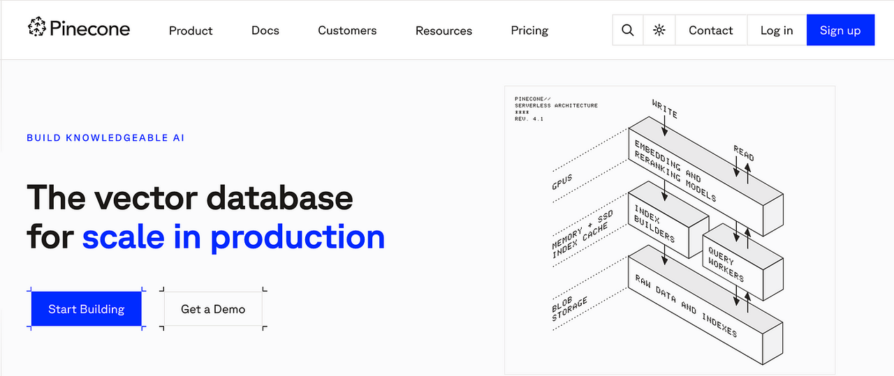
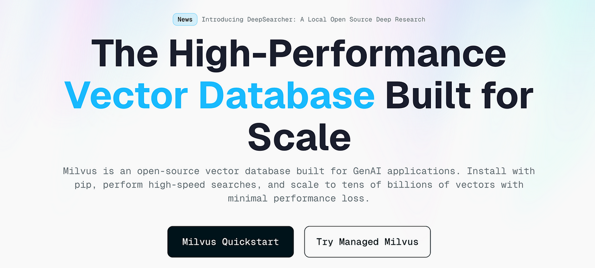
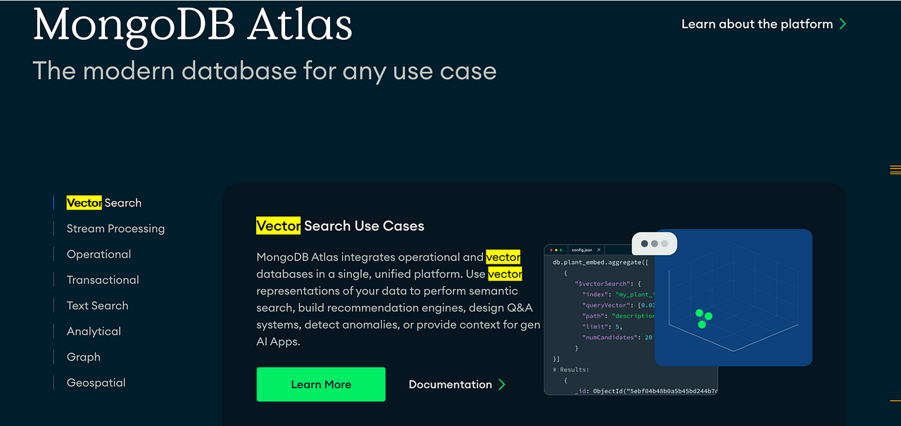
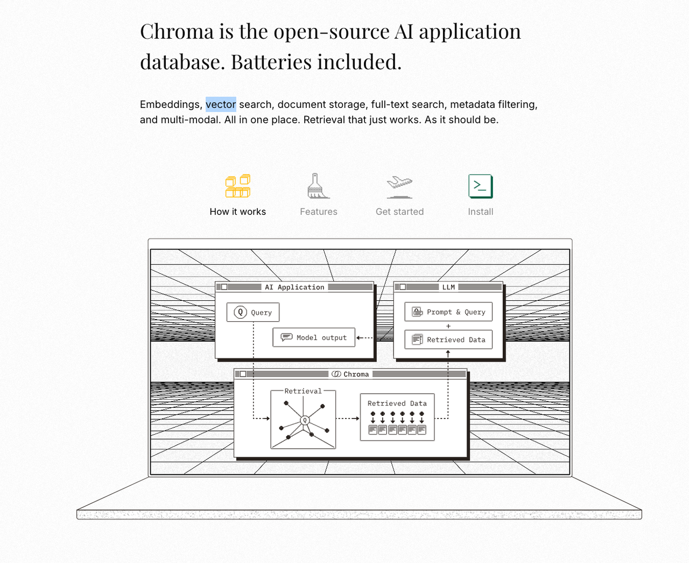
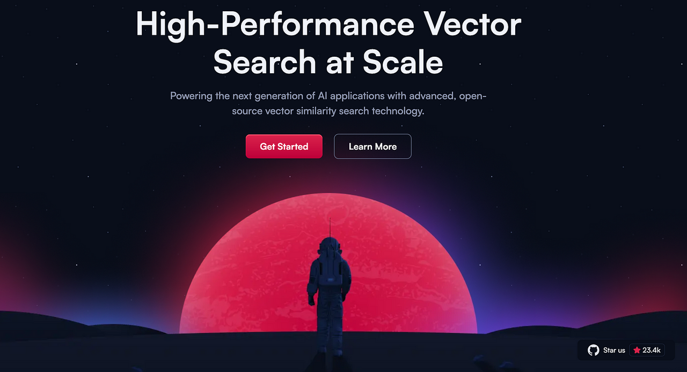
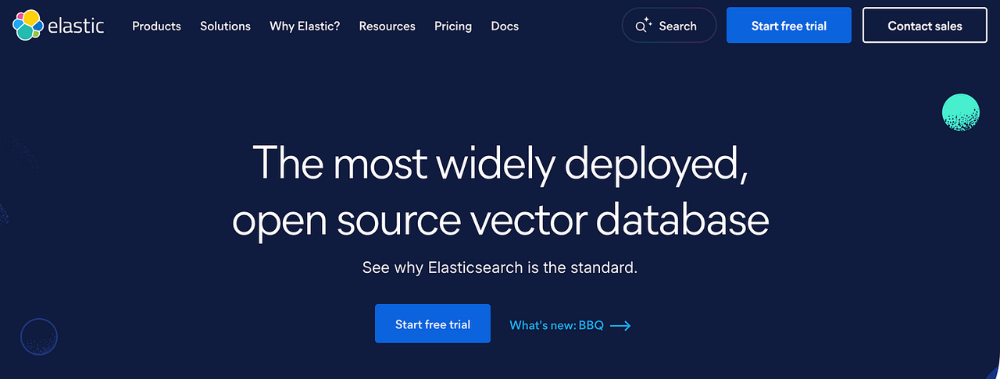
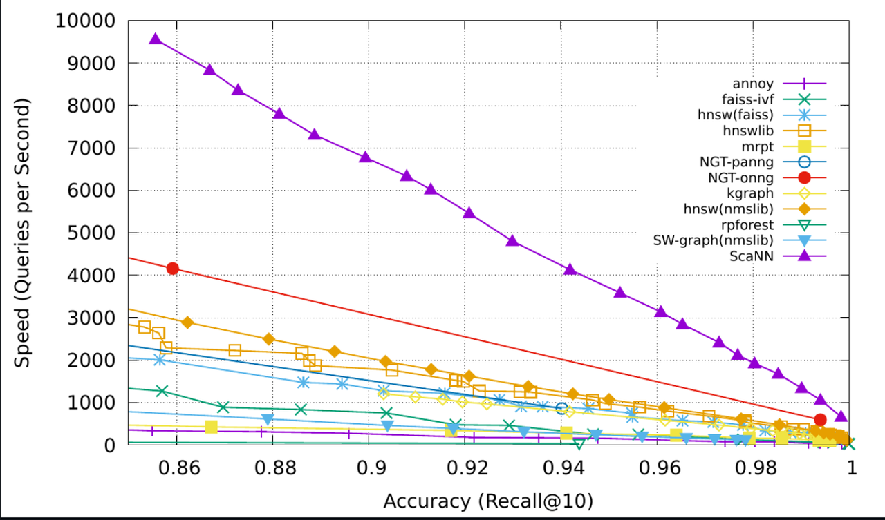
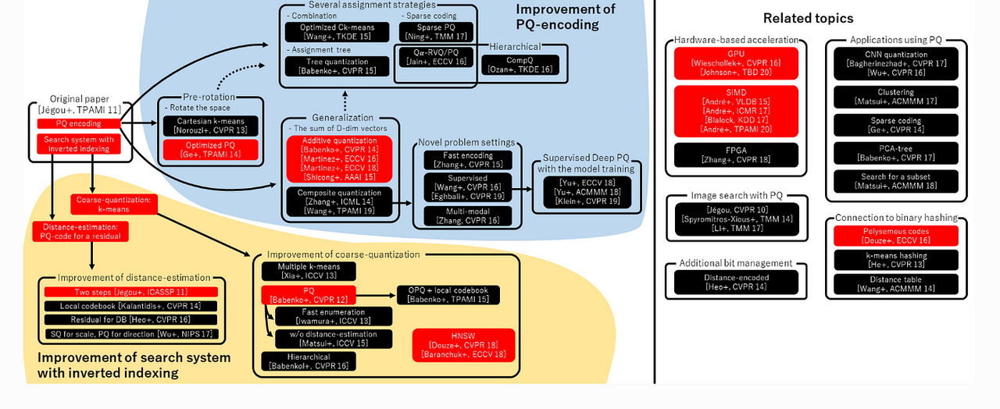
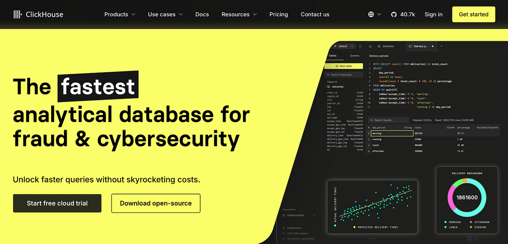
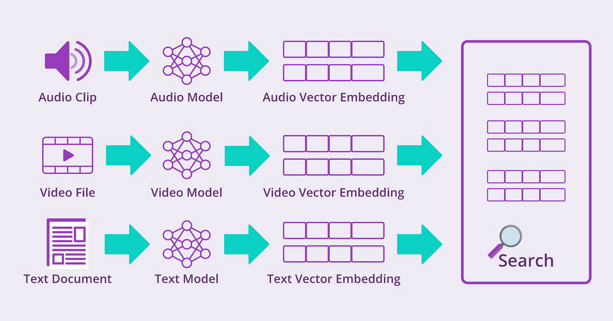

---
tags:
  - AI
  - AI资讯
  - 向量数据库
  - 生成式AI
  - AI数据库
---

# 2025 年你必须知道的10个向量数据库

在现实世界中，数据并不总是整齐划一或结构化的。如果你曾经处理过图像、视频文件、录音或原始文本，你就会明白这一点。这正是向量数据库要解决的难题。

随着人工智能和 GPT-4 等大型语言模型的兴起，存储和搜索复杂数据的需求激增。而这正是向量数据库的用武之地--它们专为处理传统数据库无法处理的高维数据而设计。

但是，面对如此多的新选择，你究竟应该选择哪个向量数据库呢？本文，我们将介绍目前市场上最流行的 10 种向量数据库，以便你决定哪种最适合你的项目。

## 1. 什么是向量数据库？

要了解向量数据库的重要性，我们先退一步。传统数据库（如 PostgreSQL）善于存储结构化信息：行、列、干净的条目。MongoDB 等 NoSQL 数据库在此基础上进行了扩展，让我们可以处理半结构化的 JSON 文档。

但人工智能的思维方式不是行列式的。机器学习模型将复杂的数据分解为 *向量嵌入&#x20;*--从本质上讲，就是捕捉数据意义或特征的数字表示。一句话、一张产品图片、一个用户配置文件，所有这些都可以转化为一个高维向量。

向量数据库专门用于高效地存储和搜索这些向量。它们使用 ***相似性搜索&#x20;***&#x4EE3;替关键字匹配，根据意义而不仅仅是文本来查找最接近的匹配。

## 2. 向量数据库与其他数据库的区别

向量数据库面向未来。与严重依赖标签和标记的传统系统不同，这些平台可以利用原始内容本身理解非结构化数据--图像、视频和文档。以下是强大的向量数据库与其他数据库的区别：

### 2.1 无缝可扩展性

向量数据库必须具有很强的可扩展性。当你的应用程序扩展到数十亿时会发生什么呢？向量数据库必须毫不费力地跨节点增长，并保持响应速度。无论你是加速插入还是增加查询负载，它都应能适应不同的工作负载和硬件，而不会出现任何闪失。

### 2.2 为多租户和隐私而建

现代向量数据库不仅服务于一个用户，还能同时安全地支持多个用户。好的系统设计用于隔离收集，这意味着除非明确共享，否则一个用户的数据将保持私有。这既能保护敏感信息，又能保持高效的多用户操作，是任何企业解决方案的必备条件。

### 2.3 开发人员友好的应用程序接口和 SDK

最好的数据库工具能与技术堆栈的其他部分完美配合。这就是 Pinecone 等领先的向量数据库平台提供流行语言 SDK（Python、JavaScript、Go 等）的原因。通过一套全面的应用程序接口，开发人员可以在现有工作流程中轻松集成、管理和查询数据。

### 2.4 简介的使用界面

强大的技术并不一定要感觉复杂。一个好的向量数据库应该提供一个直观的用户界面--它能帮助你可视化、探索和管理你的数据，而无需翻阅繁杂的文档。简洁绝不能以牺牲控制为代价。

既然我们已经介绍了基础知识，那么就让我们深入了解一下目前最好的向量数据库有哪些。这里并没有对它们进行排名，每一种都能带来一些有价值的东西。

## 3. 主流向量数据库

### 3.1 Pinecone

🌐 [Pinecone 网站 ](https://www.pinecone.io)| 🔗 [Pinecone GitHub ](https://github.com/pinecone-io)2.9k ⭐

Pinecone 是一个完全托管的向量数据库，其设计初衷就是为了处理复杂的高维数据。它是机器学习工程师和数据团队的最爱，因为他们需要快速、可靠的基础架构来构建大规模的人工智能应用。
Pinecone 的与众不同之处在于它注重速度和简便性。无论你是要处理数以百万计的嵌入式数据，还是需要快如闪电的相似性搜索，Pinecone 都能提供出色的性能，而无需通常的运营开销。

**它的与众不同之处**

* 完全托管，无需担心基础设施问题

* 随着数据的增长，可轻松扩展

* 支持动态工作负载的实时数据摄取

* 针对高维向量优化的低延迟搜索

* 与 LangChain 等现代工具配合使用，实现 LLM 集成

如果你正在构建生产就绪的人工智能应用程序，并且需要一个 "能正常工作 "的向量存储空间，那么 Pinecone 值得你认真考虑。

### 3.2 Milvus

🌐 [Milvus 网站 ](https://milvus.io)| 🔗 [Milvus GitHub ](https://github.com/milvus-io/milvus)32.5k ⭐

Milvus 是一个功能强大的开源向量数据库，用于在海量数据集中进行快速、可扩展的相似性搜索。无论你是处理图像、自然语言还是科学数据，Milvus 都能让你更轻松地大规模搜索和管理非结构化数据。
Milvus 尤为吸引人的地方在于它的灵活性--它可以在不同环境中无缝运行，支持从人工智能图像搜索到分子结构匹配等各种用例。

**开发人员为何喜欢它**

* 只需几毫秒就能搜索数以万亿计的向量

* 简化对非结构化数据的处理

* 轻松扩展企业级工作负载

* 支持混合搜索（结合向量和标量查询）

* 以充满活力、不断发展壮大的开源社区为后盾

如果你要构建任何依赖于大规模向量搜索的系统，Milvus 是经过实践检验和社区支持最多的选择之一。

### 3.3 MongoDB Atlas

🌐 [MongoDB Atlas 网站 ](https://www.mongodb.com/atlas)| 🔗 [GitHub ](https://github.com/mongodb/mongo)27.1k ⭐

MongoDB Atlas 是面向开发人员的最广泛使用的托管数据平台之一，现在它正通过 Atlas Vector Search 涉足向量搜索领域。Atlas Vector Search 建立在核心 MongoDB 引擎之上，提供了一种在一个地方同时运行事务和向量搜索工作负载的无缝方式。向量索引与你的现有数据紧密集成，但可以独立扩展--为你提供两全其美的解决方案：集成性和灵活性。
**为什么说它是明智的选择？**

* 将传统数据库功能与内置向量搜索相结合

* 可分别扩展数据库和向量索引，以提高性能

* 支持每份最大 16 MB 的文档--非常适合丰富的数据结构

* 提供高可用性、交易完整性和强大的数据备份功能

* 多层加密和耐用性确保数据安全

* 支持混合搜索，融合关键词和语义相关性

对于已经使用 MongoDB 的团队来说，Atlas Vector Search 提供了一种强大的方式，可以在不改变数据堆栈的情况下扩展到人工智能和语义搜索领域。

### 3.4 Chroma DB

🌐 [Chroma网站](https://www.trychroma.com/|) 🔗 [GitHub ](https://github.com/mongodb/mongo)19.9k ⭐

Chroma DB 是一个开源向量数据库，专为人工智能应用而设计，尤其是那些由大型语言模型（LLM）驱动的应用。它旨在让你的模型能够轻松访问事实、文档和知识，帮助减少幻觉，使检索增强生成（RAG）更加有效。

当许多开发人员说 "我想要 ChatGPT，但要用在我的数据上 "时，Chroma 就是他们梦寐以求的核心。它充当了基于嵌入的文档检索的支柱，使得将现实世界的数据插入人工智能工作流变得更加容易。此外，它还 "附带电池"，这意味着开箱即可获得嵌入、存储和搜索数据所需的一切。

**开发人员为何对此感到兴奋？**

* 功能丰富：高级查询、过滤器、密度估算等

* 与 LangChain（Python 和 JavaScript）、LlamaIndex 和其他框架轻松集成

* 相同的基于 Python 的应用程序接口可从本地笔记本扩展到完整的生产集群

* 专为现代人工智能/LLM 管道设计

如果你正在构建由 LLM 驱动的应用程序，并希望快速、可靠地访问嵌入式知识，Chroma DB 是该领域对开发人员最友好的工具之一。

### 3.5 Qdrant

🌐 [Qdrant 网站](https://qdrant.tech)🔗 [GitHub ](https://github.com/mongodb/mongo)23.6k ⭐

Qdrant 是一款开源向量数据库和搜索引擎，具有速度快、灵活性强和生产级可靠性等特点。Qdrant 具有开发人员友好的 API 和强大的过滤功能，非常适合语义搜索、分面导航和人工智能驱动的推荐系统等用例。

Qdrant 的与众不同之处在于其基于有效载荷的架构，它允许你在存储和过滤向量数据的同时存储和过滤附加元数据，从而使你的搜索更符合上下文并更加准确。它还可以独立运行，无需依赖外部数据库或协调工具，从而使部署更简单、更高效。

**为何脱颖而出？**

* 基于有效载荷的存储，可提供丰富的元数据和细粒度过滤功能

* 处理各种数据类型和复杂的查询标准

* 智能缓存可加快重复查询的速度

* 超前写入日志可确保意外关机时的数据安全

* 完全独立 - 无需额外的数据库层或协调器

如果你正在寻找一个易于集成、功能强大、可满足高级搜索需求的生产就绪型向量引擎，那么 Qdrant 值得你列入候选名单。

### 3.6 Elasticsearch

🌐 [Elasticsearch](https://www.elastic.co/elasticsearch/)🔗 [GitHub ](https://github.com/mongodb/mongo)72.7k ⭐

Elasticsearch 是一个功能强大的开源搜索和分析引擎，深受世界各地开发人员的信赖，可处理从全文搜索到日志分析等各种事务。它专为速度、规模和灵活性而设计，能够处理结构化、半结构化和非结构化数据类型。

凭借分布式架构和高可用性功能，Elasticsearch 可以轻松部署弹性的大规模系统。无论你是要构建实时搜索功能、运行复杂的分析还是管理海量数据流，它都能以最少的麻烦提供快速的结果。

**团队为何选择 Elasticsearch？**

* 内置群集和自动故障切换功能，实现高可用性

* 可横向扩展，轻松处理不断增长的数据量

* 支持跨集群复制和多数据中心设置

* 分布式设计，即使在压力下也能确保正常运行时间和可靠性

如果你的项目需要快速、灵活的大规模搜索和分析，Elasticsearch 是一个成熟且经过实战检验的解决方案，值得一试。

### 3.7 ScaNN

🌐 [ScaNN 网站](https://github.com/google-research/google-research/tree/master/scann)🔗 [GitHub](https://github.com/mongodb/mongo)**&#x20;**&#x33;5.6k ⭐

ScaNN（可扩展近邻）是谷歌为高性能向量相似性搜索提供的开源解决方案。ScaNN 在设计时充分考虑了速度和精度，引入了先进的压缩技术，在不牺牲性能的前提下提高了准确性，使其成为大规模搜索系统的首选。

它特别适用于最大内积搜索（MIPS），还支持欧氏距离等其他距离度量，因此非常灵活，适用于广泛的人工智能和 ML 应用。

**ScaNN 为何脱颖而出？**

* 针对快速、准确的相似性搜索进行了优化

* 先进的压缩方法提高了规模精度

* 非常适合最大内部产品搜索使用案例

* 支持多种距离函数，包括欧氏距离函数

* 由 Google Research 开发和维护

如果你正在开发大型推荐引擎或基于相似性的人工智能系统，ScaNN 将为你提供一个以研究为基础、可投入生产的系统。

### 3.8 Faiss

🌐 [Faiss网站](https://github.com/facebookresearch/faiss)🔗 [GitHub](https://github.com/mongodb/mongo) 34.9k ⭐

Faiss 由 Facebook 人工智能研究部门开发，是一个高性能库，用于对密集向量进行高效的相似性搜索和聚类。它被广泛应用于速度和规模都很重要的机器学习管道中，尤其是在推荐引擎、图像识别或自然语言处理等场景中。

Faiss 的多功能性在于它支持多种距离度量、基于磁盘的索引和批处理。无论是处理几千个向量还是几百万个向量，Faiss 都能以最佳的速度和精度进行处理。

**Faiss 为何受到研究人员和工程师的青睐？**

* 在一次查询中高效返回多个近邻

* 支持批量处理大型向量集

* 提供不同距离计算（如 L2、内积）的灵活性

* 索引可存储在磁盘上，以实现持久性和可扩展性

如果你正在寻找一个轻量级的、经过实战检验的快速向量搜索库，Faiss 是该领域最值得信赖和广泛采用的选择之一。

### 3.9 ClickHouse&#x20;

🌐 [ClickHouse 网站](https://clickhouse.com)🔗 [GitHub](https://github.com/mongodb/mongo) 40.7k ⭐

ClickHouse 是一款高性能、面向列的数据库，专为大规模实时分析而构建。ClickHouse 以其迅雷不及掩耳之势的查询执行而著称，通过利用强大的数据压缩和充分利用多核处理，它可以高效地处理海量数据集。

无论你是运行复杂的分析查询，还是不断获取新数据，ClickHouse 都能提供低延迟性能，并支持丰富的基于 SQL 的操作--这使它成为需要速度而不妥协的数据团队的最爱。

**是什么让 ClickHouse 脱颖而出？**

* 先进的数据压缩技术可减少存储量并加快读取速度

* 超快查询性能，低延迟

* 针对多核 CPU 和分布式服务器环境进行了优化

* 完全支持强大的 SQL 查询

* 通过高效索引处理连续数据输入

如果你的项目需要对大量数据进行实时洞察，ClickHouse 就是最可靠、最适合生产的工具之一。

### 3.10 OpenSearch

🌐 [OpenSearch 网站](https://opensearch.org)🔗 [GitHub](https://github.com/mongodb/mongo) 7.9k ⭐

OpenSearch 是一款灵活的开源搜索和分析套件，现在除了传统的全文和日志搜索功能外，还包括强大的向量搜索功能。它旨在将搜索、分析和人工智能驱动的智能整合到一个统一的平台中，非常适合需要同时理解词法和语义的现代应用。

它的向量功能支持从多模态和语义搜索到人工智能代理和生成应用的所有功能。利用 OpenSearch，你可以为产品、用户或任何特定领域的数据创建有意义的嵌入，并使用相似性搜索来提高性能和数据质量。

**为什么 OpenSearch 是一个不错的选择？**

* 内置向量搜索，适用于语义、混合和人工智能驱动的使用案例

* 支持多模态、视觉和生成式人工智能集成

* 可为用户、内容或产品创建自定义嵌入内容

* 适用于相似性匹配和数据验证任务

* 根据 Apache 2.0 许可证完全开源

如果你正在寻找一个成熟、可扩展的平台，将传统搜索与人工智能增强搜索相结合，OpenSearch 将为你提供坚实的基础。

## 4. 小结

向量数据库正迅速成为现代数据科学和人工智能工作流程的基础。随着管理和搜索高维数据的需求不断增长，这些工具也在不断发展，以快速、灵活和精确的方式应对新的挑战。
在本文中，我们探讨了 2025 年最有前途的几种向量数据库--每种数据库都有自己的优势。无论你是要构建由 LLM 驱动的应用程序、实时推荐系统还是高级分析平台，这里都有一种解决方案可以帮助你放心地进行扩展。

随着该领域的不断进步，密切关注这些技术以及它们如何被广泛应用，将是保持领先地位的关键。

##
