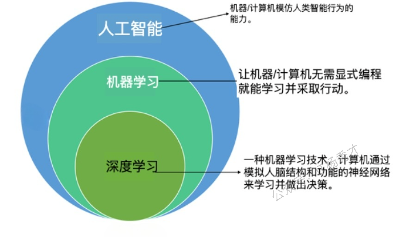
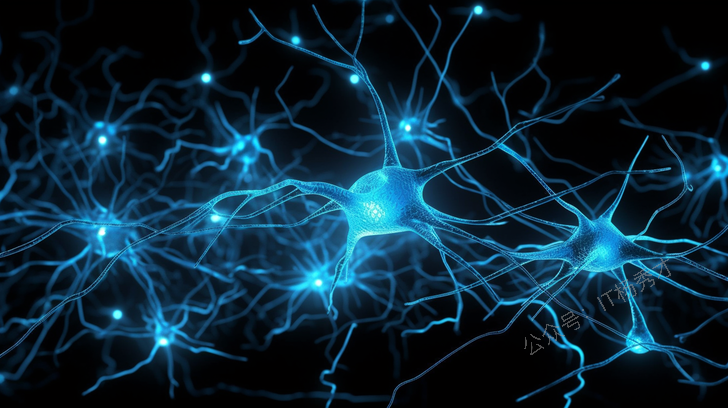
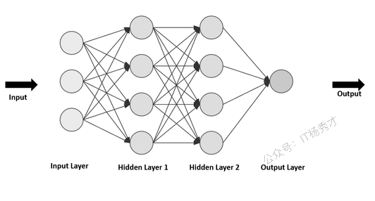
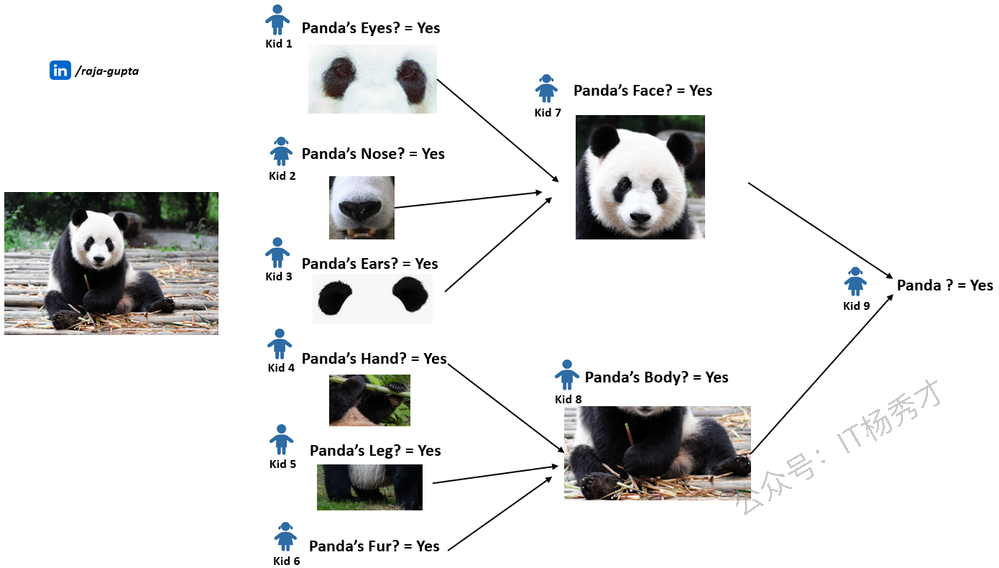
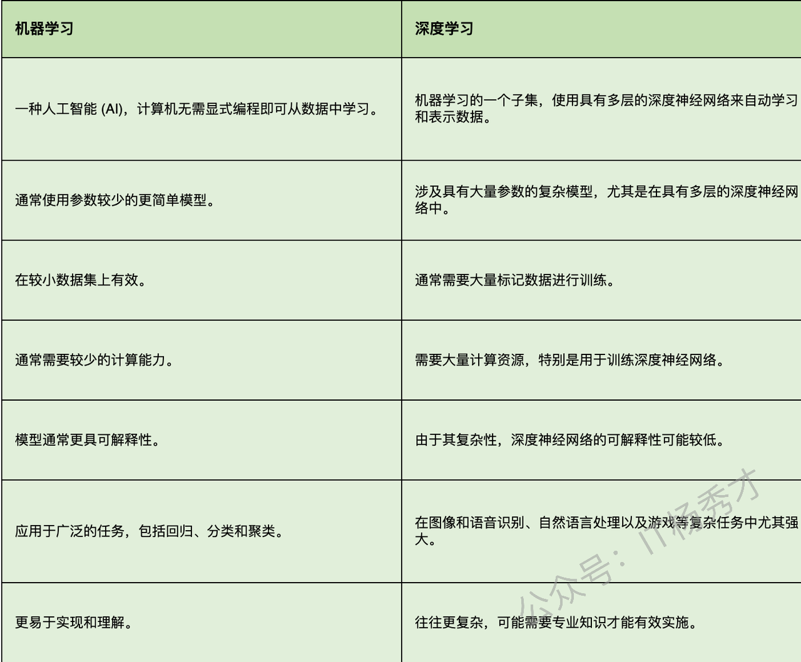

# 理解深度学习

## 1. 什么是深度学习？

机器能否像我们人类（人脑）一样学习事物？——这是推动深度学习创新的核心理念。深度学习是**机器学习的一个子集**（而机器学习又是人工智能的子集）。其核心基于**人工神经网络（ANN）**，这是一种受人类大脑结构和功能启发的计算模型。

下面我们用更通俗语言来解释！首先，我们需要理解几个重要概念。

## 2. 人脑中的生物神经网络

神经元是**人类大脑**最基本的细胞。 **人脑**拥有**数百亿个相互连接并传递信息的神经元**，这些神经元构成了**神经网络**。

这些神经元接收来自视觉、听觉、触觉等各类感官输入，通过彼此传递信息产生连锁反应。正是这种神经网络的工作机制，使人类具备了思考能力，更重要的是——学习能力

## 3. 人工神经网络(ANN)

人工神经网络是一种**模仿人脑生物神经网络结构**构建的计算网络。人类大脑的神经元彼此相互连接。类似地，人工神经网络也拥有相互连接的神经元，这些神经元被称为节点。下面以一个形象的例子来看

假设用不同形状和大小的管道搭建一个大型3D结构。每根管道可以连接多根其他管道，并配有可开合的开关。这会产生无数种管道连接方式，看起来有点复杂。现在让我们把这个管道系统连接到水龙头上。不同尺寸的管道会让水流以不同速度通过。如果关闭开关，水就无法流动。

**这里其实水流象征着流经大脑的数据**，而**管道则代表大脑中被称为神经元的组成部分**。

## 4. 人工神经网络架构

Artificial Neural Network primarily consists of three layers — Input Layer, Output Layer and Hidden Layers.

人工神经网络主要由三层组成——Input Layer（输入层）、Output Layer （输出层）、Hidden Layers（隐藏层）。
可以把**人工神经网络类比成一个三层的三明治**。

1. 第一层称为 **输入层**，相当于三明治的底层面包片。它负责接收信息。

2. 第二层称为 **隐藏层**，相当于中间美味的夹心馅料。它进行思考并解决问题。

3. 第三层称为 **输出层**，相当于顶层的面包片。它给出最终结果。

简单来说就是：

1. **输入层**

   * 这是信息进入人工神经网络的入口。

   * 作为起始点，网络在此接收需要处理的数据。

2. **输出层**

   * 这就是网络给出最终结果或答案的地方。

   * 这是终点站，网络在这里告诉我们它学到了什么或做出了什么决定。

3. **隐藏层**

   * 这些层位于输入层和输出层之间。

   * 这些层中的神经元处理信息，帮助网络学习模式并做出决策。

## 5. 人工神经网络如何工作？

假设一群孩子通过分享他们的观察来识别一只熊猫。每个孩子专注于特定特征，比如黑白相间的毛发、圆脸和独特的眼睛。单独来看，他们可能无法完全理解熊猫的模样。但通过综合各自的见解，他们形成了集体认知。在人工神经网络的世界里， 这些孩子就相当于神经元。

* 人工神经网络中，单个"神经元"（类似例子中的孩子们）专门负责识别特定特征。

* 它们共同作用，帮助识别整体概念（熊猫）。

* 通过反复接触，网络会不断完善其理解，就像孩子们会随着时间的推移不断完善识别熊猫的能力一样。

**输入层（观察）：**每个孩子观察一个方面，比如毛色或脸型，这就构成了我们网络的输入层。
**隐藏层（处理过程）：**孩子们互相传递观察结果，模拟神经网络中的隐藏层。通过信息共享，他们共同构建起对熊猫特征的更全面理解。
**输出层（识别结果）：**最终，他们通过整合所有细节得出结论。如果多数人认为观察到的特征与熊猫相符，就会输出"熊猫"。这个输出层对应着神经网络的最终决策。

**评分方法：**

为了提高识别能力，孩子们会记录自己的准确率。

* 如果他们正确识别出熊猫，就能获得分数；

* 反之则从错误中学习。

* 同样地，在神经网络中，评分机制有助于调整网络参数，从而逐步提高准确性。

这种协作过程展示了人工神经网络如何逐层处理信息，通过不同特征进行学习，并借助评分机制不断优化理解能力。

## 6. 深度神经网络

深度神经网络（DNN）是一种 **在输入层和输出层之间包含多个层级的人工神经网络（ANN）**。这里的 ***"深度"***指的是在输入和输出之间存在多个层级，使其能够学习复杂模式。

## 7. 关于深度学习的重要要点

现在，让我们总结一些关于深度学习的重要要点！

1. **机器学习的子集**

深度学习是机器学习的子集，而机器学习又是人工智能的子集。

* **灵感源自大脑**

深度学习基于人工神经网络，其设计灵感来源于人类大脑的工作机制。

* **人工神经网络（ANN）**

人工神经网络（ANN）是一种模拟人脑生物神经网络的计算网络。

* **深度神经网络**

"深度"这一形容词指的是网络中使用了多个层级。它采用具有多个隐藏层的深度神经网络结构。这些层级通过信息处理，使系统能够学习复杂模式。

* **从数据中学习**

系统通过展示大量示例并根据预测与正确答案之间的差异调整神经元之间的连接来进行学习。

* **处理复杂问题**

深度学习特别擅长解决传统方法难以应对的复杂问题。

## 8. 机器学习与深度学习

下面我们来对比一下机器学习与深度学习之间的主要区别：

## 9. 小结

通过这篇我们理解了深度学习的本质及其运作原理。深度学习因其多层神经网络而得名，这种网络结构类似于人脑的多层次思维神经网络，每一层都对其处理的信息产生更深层次的理解。从图像识别和语音理解到驱动语音助手和自动驾驶汽车，深度学习在解决众多复杂任务方面都大有裨益。

