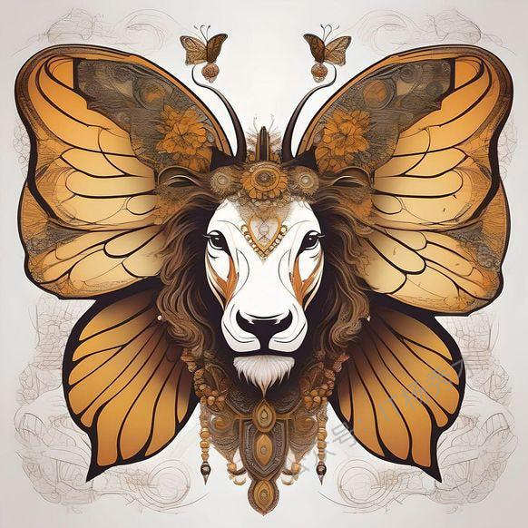
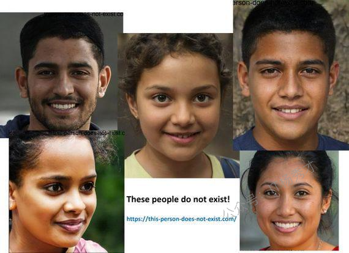

# 生成式AI简介

## 1. 什么是生成式AI？

生成式 AI 的定义可以归结为以下三个方面：

* 一种人工智能

* 能够创造新事物，例如艺术作品、音乐，甚至逼真的图像。

* 无需被明确告知应该创造什么

传统 AI 专注于特定任务或解决问题，而生成式 AI 的独特之处在于它能展现出 **类似人类的创造力**。就像我们人类一样，生成式 AI 能够产生新颖、独特的内容、想法或解决方案。下面让我们通过一个例子来更好地理解它！
假设，我让你画一种你从未见过的动物。你需要运用想象力，画出世界上从未出现过的新动物。由于人类具有想象力和创造力，你能够做到这一点。也许你会画出一只拥有狮子身体、牛头和蝴蝶翅膀的动物。现在， **如果一个计算机程序能够自己创造新事物会怎样！**&#x5B83;可以创造新事物，比如艺术品、音乐，甚至是逼真的图像，而无需明确被告知要创造什么。

这个计算机程序已经学习了大量狮子、奶牛和蝴蝶的图片。现在凭借这些知识，它能够绘制出一种全新的动物，比如"狮子-奶牛-蝴蝶"的组合体。 **它并非复制任何现有图像**，而是基于对狮子、奶牛和蝴蝶独特特征的理解， **创造出完全新颖的事物**，就像下图这样。

这就是生成式 AI—— **一种具备想象力和创造力的机器（或计算机），它能无人指导地绘画、讲故事，甚至发明新游戏。**

## 2. 生成式 AI 在人工智能体系中的位置？

生成式 AI 是深度学习的一个分支。下图展示了人工智能、机器学习、深度学习与生成式 AI 之间的关系。

生成式人工智能会利用机器学习技术，特别是深度学习和神经网络。**生成式人工智能区别于普通人工智能的主要区别在于其生成新内容的能力**。

人工智能、机器学习乃至深度学习大多局限于预测模型。这些技术主要用于观察和分类内容中的模式，或预测新的模式或内容。例如，一个经典的机器学习用例是从多张给定图片中识别出猫的图像，或根据各种属性将动物分类到不同的群组中。

生成式人工智能是一项突破，因为它具备了一项本应只有人类才能完成的能力——凭借创造力绘制出一只猫的图像，或是创造出一个全新动物的形象。

下图展示了 **人工智能随时间的演进历程**。从传统基于规则的系统发展到生成式AI，这一演进是由学习算法进步、计算能力提升以及海量数据获取所共同推动的。

## 3. 生成模型

生成式 AI 使用不同类型的机器学习模型，称为生成模型。

生成模型主要有以下几个特点：

* 通过学习底层数据集的特征，生成与原始数据高度相似的新数据

* 主要用于创造新内容，如图像、文本甚至音乐，这些生成物与人类创作的作品几乎难以区分

* 采用无监督学习方法

最常见的生成模型包括：

* 变分自编码器（VAEs）

* 生成对抗网络（GANs）

* 受限玻尔兹曼机（RBMs）

* 基于 Transformer 的语言模型

下一篇文章节我们将深入探讨生成模型。

## 4. 生成式 AI 在现实生活中的应用

以下是生成式 AI 在现实应用中的一些实例：

### 4.1 文本生成

我们大多数人都使用过基于生成式 AI 的 ChatGPT。与 ChatGPT 类似，基于生成式 AI 的工具可用于生成新内容，如文章、报告、诗歌、故事或其他任何文本内容。

生成式 AI 最常见的用途之一是构建虚拟助手和聊天机器人。生成模型被用于构建高级聊天机器人，这些机器人能够模仿人类互动与用户交流。

### 4.2 图像生成

生成式 AI 工具利用各种生成模型来生成新图片，甚至是具有创意的作品。这些模型能够从大量图像数据中学习，并基于训练数据生成独特的新图像。它们甚至能根据输入提示，像人类创作内容一样富有创意地生成图像。这类技术在现实中有多种应用方式，如图像到图像的转换、文本到图像的转换、照片编辑、人脸生成、图像质量增强等。

由 OpenAI 开发的 DALL-E 是最常见的利用生成式 AI 创作逼真图像与艺术品的工具之一。这款文本转图像模型通过深度学习技术，将自然语言描述转化为数字图像。

### 4.3 视频生成

生成式模型能够从零开始创作完整视频。它能将场景、角色和动作无缝衔接，构建出完整故事线。这类视频可应用于娱乐产业、广告宣传，甚至培训模拟场景。电子游戏开发正是深度运用生成式 AI 的领域之一。

某些生成式模型能通过分析现有视频来创作新视频。当现存视频（如监控片段）出现损坏时，该技术可用于视频修复预测。

### 4.4 语音生成

生成式 AI 还能模仿人声或创造全新音色！通过分析音频数据学习人类说话方式后，它既能复刻特定语音风格，也能合成完全原创的声线。这有助于让虚拟助手或有声读物听起来更加自然。

### 4.5 医疗健康应用

生成式 AI 模型可用于生成与真实数据相似的合成数据样本。这在医疗领域尤为实用，因为有时收集真实世界的数据成本高昂或数量有限。例如，生成式 AI 可用于生成供研究使用的合成患者数据。

### 4.6 药物研发

生成式 AI 正被用于药物发现领域，通过生成具有特定属性的新分子结构来加速药物研发进程。它能探索广阔的化学空间并识别有潜力的候选药物，从而显著提升开发效率。

### 4.7 游戏

生成式 AI 彻底改变了游戏产业的面貌。游戏行业正越来越多地利用这项技术来加速游戏制作流程，打造独特的游戏体验。这项技术能帮助游戏开发者构建完整的虚拟世界、角色和故事情节，使游戏更具吸引力和沉浸感。

生成式 AI 还能增强虚拟世界的真实感。它可以创造独特的生物和角色，精细调整每个角色的个性和特征，让游戏世界充满生机与惊喜。

### 4.8 艺术生成

这正是生成式 AI 区别于常规 AI 的一大核心应用。生成式 AI 具备类似人类的创造性思维能力，各类生成模型被广泛应用于绘画、诗歌、故事等多媒体艺术创作领域。

### 4.9 软件开发

生成式 AI 彻底改变了我们编写代码和开发软件的方式。借助 GitHub Copilot、ChatGPT、AlphaCode 等工具，开发者能以更快的速度完成包含精细细节的代码编写。

生成式 AI 工具能通过生成代码片段来辅助开发，通过识别更多缺陷提升软件测试效率，并为编程难题提供最优解决方案。这显著缩短了开发周期，提高了代码质量，最终打造出更优质的软件产品和更卓越的用户体验。

### 4.10 金融

金融机构正运用生成式 AI 分析市场趋势，高精度预测股票走势，并优化交易策略。该技术还能提升风险评估、欺诈检测和投资组合优化能力，从而实现效率提升、成本降低、盈利增长和更明智的投资决策。

## 5. 热门生成式 AI 工具示例

在上一节中，我们讨论了生成式 AI 的各种应用场景。现在，让我们来看看当前可用的一些热门生成式 AI 工具。

### 5.1 ChatGPT

ChatGPT 是由 OpenAI 开发的对话式 AI。它旨在与用户进行自然语言对话，提供上下文相关且连贯的响应。ChatGPT 的工作原理是处理输入文本，并根据从海量训练数据中学到的模式和关系生成响应。它采用深度学习技术，特别是 Transformer 架构，使其能够理解并生成类人文本。

### 5.2 GPT（生成式预训练变换模型）

GPT 是由 OpenAI 开发的基于 Transformer 架构的大型语言模型，它是 ChatGPT 背后的核心技术引擎。ChatGPT 免费版本基于 GPT-3.5，而更先进的 GPT-4 版本则以商业名称"ChatGPT Plus"向付费订阅用户提供。

### 5.3 AlphaCode

AlphaCode 是 DeepMind 开发的基于 Transformer 架构的语言模型，作为 AI 驱动的编程引擎可自动生成计算机程序。这个拥有 414 亿参数的模型比现有许多语言模型更为复杂。该工具运用深度学习算法分析海量代码并从中学习规律，从而生成优化代码方案。它支持包括 C#、Ruby、Python、Java、C++等多种编程语言。

### 5.4 GitHub Copilot

GitHub Copilot 是由 GitHub 与 OpenAI 联合开发的人工智能代码补全工具。它直接集成在 Visual Studio Code 等代码编辑器中，能在开发者编写代码时提供实时建议和补全功能。

该工具旨在通过生成代码片段、推荐整行或整块代码以及提供上下文文档来辅助开发者。GitHub Copilot 支持 Python、JavaScript、Java、C++等多种编程语言。

### 5.5 Bard

Bard 是谷歌开发的对话式生成式 AI 聊天机器人，作为对 OpenAI 的 ChatGPT 迅速崛起的直接回应。Bard 最初基于 Transformer 架构的 LaMDA 模型，后续升级为 PaLM 和 Gemini 等其他模型。

### 5.6 Microsoft Copilot

微软 Copilot 最初由微软于 2023 年推出，是一款能辅助网页浏览的 AI 助手，后更名为 Microsoft Copilot。微软 Copilot 可用于请求文章、书籍、新闻等的摘要，生成通用文本和图像，重新格式化文本，更新图像等。

### 5.7 DALL-E

由 OpenAI 开发的 DALL-E（其他版本包括 DALL-E2 和 DALL-E3）是最优秀的生成式 AI 图像工具之一。它利用深度学习算法根据文本生成图像。

### 5.8 StyleGAN

由英伟达开发的 StyleGAN 是一种生成对抗网络（GAN）类生成模型，用于生成高质量的合成图像。StyleGAN 在创建逼真人脸及其他视觉内容方面表现极为出色。它能生成高度可控的人脸图像，精准调节面部特征、姿态和背景等特定视觉元素。

以下是 StyleGAN 生成的一些看起来像真人的图像。有一个有趣的网站 [https://this-person-does-not-exist.com ](https://this-person-does-not-exist.com/)展示了如何利用 StyleGAN 生成实际上并不存在的人脸。

## 6. 小结

生成式AI代表了人工智能发展的重要里程碑，它突破了传统AI仅能识别和分类的局限，首次赋予了机器类似人类的创造能力。从文本生成到图像创作，从视频制作到代码编写，生成式AI正在重塑我们工作和生活的方方面面。

通过VAEs、GANs、Transformer等多样化的生成模型，这项技术能够从海量数据中学习模式，进而创造出全新的、具有创意的内容。无论是ChatGPT的智能对话、DALL-E的艺术创作，还是GitHub Copilot的代码助手，这些工具都展现了生成式AI将想象变为现实的强大能力。

生成式AI的应用前景广阔，从医疗健康到游戏娱乐，从金融分析到艺术创作，它正在各行各业中发挥越来越重要的作用。随着技术的不断成熟和工具的日益完善，生成式AI将继续推动创新边界，为人类创造力插上科技的翅膀，开启一个人机协同创作的新时代
