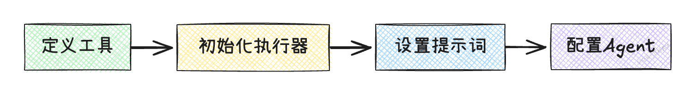
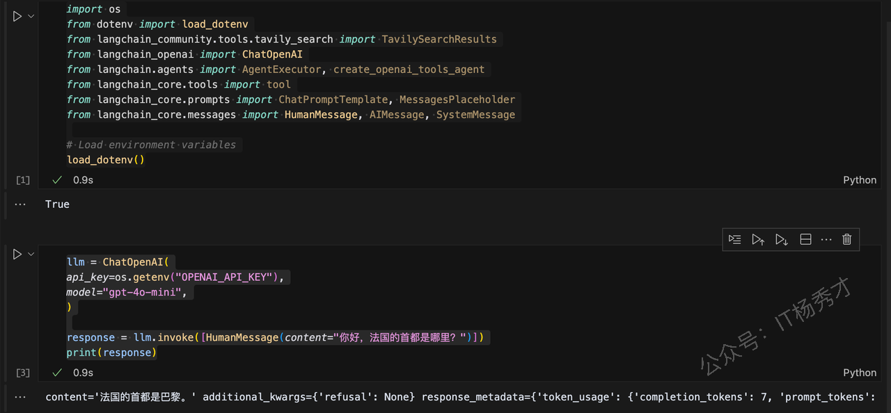
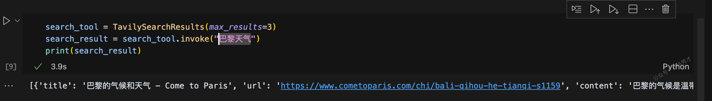

# Agent

## 1. 什么是Agent

Agent即代理，本质上是一种智能决策机制。它的核心理念是**让大语言模型根据需求主动决定要做什么，以及怎么做**。

LangChain 的链将一系列的动作硬编码在代码中。比如先调用一个 Prompt，再调用一个 LLM，最后输出结果。就像是一条固定流程的生产线，所有步骤都写死在代码里。而 Agent 的不同之处在于——它不按固定流程来，而是**把思考过程交给大语言模型**。它会根据用户的输入自行进行"推理"，判断，和执行。比如

> * 该调用哪个工具？
>
> * 当前信息够吗？是否还需要查资料？
>
> * 接下来该执行哪一步？
>
> * 是否已经完成任务？

大语言模型在这里就像"大脑"，而各种工具（API、数据库、搜索引擎等）则像是"手脚"，agent会根据推理结果，自己安排调用顺序和执行方式。总结一句话就是：**Chain 是预设流程，Agent 是动态决策。**&#x43;hain 执行固定套路，而 Agent 则是"会思考的工作流调度员"。所以，可以认为Agents 是能够利用语言模型（LLM）和其他工具来执行复杂任务的系统

## 2. Agent的工作流程

一个agent的工作流程大致分为以下几个步骤：

1. **输入理解**
   &#x20;Agent 接收到用户输入后，理解用户的真实意图和任务目标。

2. **任务规划**
   &#x20;基于上一步对输入的理解，明确需要完成哪些子任务，并决定所需工具及其调用顺序。

3. **工具调用**
   &#x20;按照任务规划，A 依次调用适配的工具或API，执行相关操作，获取阶段性结果。

4. **结果处理**
   &#x20;对各个工具返回的数据进行分析与整合，确保信息完整、逻辑清晰，并构建最终输出内容。

5. **动态迭代**
   &#x20;若最终结果不完整、信息不足，或用户提出新需求，Agent 会自动重新评估任务状态，调整计划，循环以上步骤，直至任务完成。

## 3. Agent的组成部分

一个完整的agent主要有以下三个组件组成

| 组件                     | 功能说明                                                    |
| ---------------------- | ------------------------------------------------------- |
| 工具集（Tools）             | Agent可以调用或者访问的工具集合，每个工具通常完成特有的功能                        |
| 执行器（executor）          | 具体执行Agent的任务                                            |
| 提示模板（Prompt Templates） | 提供给 Agent 的"任务指令模板"，帮助其理解用户输入、明确任务目标，并按不同场景调整语言风格与行为策略。 |

## 4. 创建Agent的步骤

1. **定义工具**：选择或构建适用于当前任务的工具

2. **初始化执行器**：配置用于执行 Agent 计划的执行器，通常是选择并加载一个大语言模型（如 GPT、Claude 等）

3. **设置提示词**：编写合适的提示模板，帮助大语言模型准确理解用户需求

4. **配置Agent**：将工具、执行器和提示模板整合为一个可运行的 Agent 实例



## 5. LangChain Agent的基本使用

### 5.1 导入相关包

```python
import os
from dotenv import load_dotenv
from langchain_community.tools.tavily_search import TavilySearchResults
from langchain_openai import ChatOpenAI
from langchain.agents import AgentExecutor, create_openai_tools_agent
from langchain_core.tools import tool
from langchain_core.prompts import ChatPromptTemplate, MessagesPlaceholder
from langchain_core.messages import HumanMessage, AIMessage, SystemMessage

# Load environment variables
load_dotenv()
```

1. `ChatOpenAI` 用于连接到 OpenAI 聊天模型

2. `TavilySearchResults` 用于创建一个搜索网络的工具（稍后会详细介绍）

3. `Tool` 定义一个自定义函数

4. `AgentExecutor` 创建一个代理运行时

5. `ChatPromptTemplate` 创建一个提示模板，我们可以在运行时通过传递输入来更改它

6. `HumanMessage` , `AIMessage` , 和 `SystemMessage` 类来创建适当的消息类型

注意在导入这些包，测试LLM之前，请确保醒目根目录的.env文件中配置了可用的OpenAPI Key

```python
OPENAI_API_KEY=sk-proj-Tw6SpLe6EKoIlpm5sftZ7FcH0inqAhiCi2zQIJ7kccW_nU0Kn****
```

在真正创建代理之前，首先连接到一个LLM并测试一下是否一切正常：

```python
llm = ChatOpenAI(
api_key=os.getenv("OPENAI_API_KEY"),
model="gpt-4o-mini",
)

response = llm.invoke([HumanMessage(content="Hello, what is the capital of France?")])
print(response)
```

程序输出

```python
content='法国的首都是巴黎。' additional_kwargs={'refusal': None} response_metadata={'token_usage': {'completion_tokens': 7, 'prompt_tokens': 15, 'total_tokens': 22, 'completion_tokens_details': {'accepted_prediction_tokens': 0, 'audio_tokens': 0, 'reasoning_tokens': 0, 'rejected_prediction_tokens': 0}, 'prompt_tokens_details': {'audio_tokens': 0, 'cached_tokens': 0}}, 'model_name': 'gpt-4o-mini-2024-07-18', 'system_fingerprint': 'fp_dbaca60df0', 'id': 'chatcmpl-BOhBBxMb8SQDDcBOMvbNmexAjdhE2', 'finish_reason': 'stop', 'logprobs': None} id='run-3e99e25e-bf6b-45d5-803f-42a0fd7fd333-0' usage_metadata={'input_tokens': 15, 'output_tokens': 7, 'total_tokens': 22, 'input_token_details': {'audio': 0, 'cache_read': 0}, 'output_token_details': {'audio': 0, 'reasoning': 0}}
```



就这样，就已经连接到了 OpenAI 模型。程序输出会看到一个类型为 `AIMessage` 的响应，其中包含一个"content"键，内容显示"法国的首都是巴黎。"响应中还附带了更多信息，但目前可以忽略它。

目前大语言模型无法执行操作；他们只能够输出文本信息。这就是Agent发挥作用的地方。从根本上说，Agent是系统，它们接受一个高层级的任务，使用一个LLM作为推理引擎，并决定采取的行动序列。

### 5.2 定义工具

工具可以大模型获得处理具体事情的能力。比如想要让它上网搜索，解决数学问题等，在这个例子中，让我们添加两个工具：

1. 网络搜索工具

2. 一个自定义工具，用于添加两个数字

#### 5.2.1 搜索工具

搜索工具这里选择使用Tavily来实现，Tavily搜索是一个旨在为AI代理提供实时准确和真实结果的搜索引擎。要使用Tavily搜索进行搜索，首先需要创建`TavilySearchResults`类的一个实例。这个实例将作为您访问Tavily搜索功能的入口点。创建完成后，可以使用此实例的`invoke()`方法来执行搜索，这个方法接受一个具有"query"键的字典作为输入，并返回一个搜索结果列表

注意，在使用Tavily之前，需要在.env文件中配置Tavily的API key，API key可以在https://app.tavily.com/home查看，如果是执行到这一步才配置TAVILY\_API\_KEY的话，需要重新运行下最前面的代码，重新加载一下配置文件

```python
TAVILY_API_KEY=your-tavily-api-key
```

```python
search_tool = TavilySearchResults(max_results=3)
search_result = search_tool.invoke("巴黎天气")
print(search_result)
```

在这个例子中，我们想要搜索下巴黎的天气情况，程序输出

```sql
[{'title': '巴黎的气候和天气 - Come to Paris', 'url': 'https://www.cometoparis.com/chi/bali-qihou-he-tianqi-s1159', 'content': '巴黎的气候是温带气候。 它以相对温和的冬季和温和的夏季为特点。 巴黎全年都可以参观，每个季节都有不同的魅力。', 'score': 0.84858394}, {'title': '巴黎, 巴黎, 法國当前天气 - AccuWeather', 'url': 'https://www.accuweather.com/zh/fr/paris/623/current-weather/623?lang=zh-cn&partner=1000001071_hfaw', 'content': '大部分多云，有几场阵雨. RealFeel®60°. RealFeel Shade™58°. 最高紫外线指数2 良好. 风西北7英里/小时. 大风18英里/小时. 降水概率84%. 雷雨概率17%. 降水0.05英寸.', 'score': 0.7555112}, {'title': '【巴黎天气】巴黎天气预报,天气预报一周,天气预报15天查询', 'url': 'https://www.weather.com.cn/weather/202010100.shtml', 'content': '20日（今天）. 小雨. 9℃. 4-5级 · 21日（明天）. 小雨. 17℃/9℃. <3级 · 22日（后天）. 小雨转阴. 17℃/7℃. <3级 · 23日（周三）. 小雨. 14℃/7℃. 3-4级转<3级 · 24日（周四）. 小雨. 15', 'score': 0.7173491}]
```



#### 5.2.2 自定义工具

```python
@tool
def add_numbers(a: int, b: int) -> int:
    """两数相加"""
    return a + b
    print(add_numbers.invoke({"a": 1, "b": 2}))
    
"""在定义并测试完这两个工具之后，我们可以继续将它们连接到我们的语言模型。"""
tools = [search_tool, add_numbers]

llm_with_tools = llm.bind_tools(tools)

response_with_tools = llm_with_tools.invoke(
input=[HumanMessage(content="人类第一次登上月球是什么时候? 40 + 24等于多少?")]
)

print(response_with_tools)
```

这里使用 `bind_tools` 方法将工具绑定到我们的大模型上，然后用两个问题调用它。

程序输出

```python
content='' additional_kwargs={'tool_calls': [{'id': 'call_M6Kt0pDZJHX5sR9Zj84a9TCN', 'function': {'arguments': '{"query": "人类第一次登上月球时间"}', 'name': 'tavily_search_results_json'}, 'type': 'function'}, {'id': 'call_41Is335qyZlGL3rkER5MGrZF', 'function': {'arguments': '{"a": 40, "b": 24}', 'name': 'add_numbers'}, 'type': 'function'}], 'refusal': None} response_metadata={'token_usage': {'completion_tokens': 60, 'prompt_tokens': 121, 'total_tokens': 181, 'completion_tokens_details': {'accepted_prediction_tokens': 0, 'audio_tokens': 0, 'reasoning_tokens': 0, 'rejected_prediction_tokens': 0}, 'prompt_tokens_details': {'audio_tokens': 0, 'cached_tokens': 0}}, 'model_name': 'gpt-4o-mini-2024-07-18', 'system_fingerprint': 'fp_dbaca60df0', 'id': 'chatcmpl-BOm0OUH7QitSmd7YdlB862PGmQ5C7', 'finish_reason': 'tool_calls', 'logprobs': None} id='run-f103ed21-a37c-47a9-b1d2-49783adc749f-0' tool_calls=[{'name': 'tavily_search_results_json', 'args': {'query': '人类第一次登上月球时间'}, 'id': 'call_M6Kt0pDZJHX5sR9Zj84a9TCN', 'type': 'tool_call'}, {'name': 'add_numbers', 'args': {'a': 40, 'b': 24}, 'id': 'call_41Is335qyZlGL3rkER5MGrZF', 'type': 'tool_call'}] usage_metadata={'input_tokens': 121, 'output_tokens': 60, 'total_tokens': 181, 'input_token_details': {'audio': 0, 'cache_read': 0}, 'output_token_details': {'audio': 0, 'reasoning': 0}}
```

输出中包含一个空的 `content` 键，`tool_calls` 里包含我们上面描述的工具。注意，此时我们只是将这些工具绑定到了大模型上，而大模型还不具备调用这些工具的能力

#### 5.2.3 构建&配置代理

根据上面的步骤，接下来我们就需要为Agent设置提示词了，然后初始化执行器，配置Agent了。这几个步骤其实很简单

```c++
prompt = ChatPromptTemplate.from_messages(
[
(
"system",
"Y你是一个高效的助手。请使用可用的工具来回答用户的问题。",
),
("human", "{input}"),
MessagesPlaceholder(variable_name="agent_scratchpad", optional=True),
]
)

prompt.invoke({"input": "人类第一次登上月球是什么时候? 40 + 24等于多少?"})
```

通过上述代码就可以创建一个提示词对象，现在可以将`input`传递给它，它会自动附加系统提示。我们还有一个占位符消息（类似于草稿纸），供代理思考和撰写其推理过程。有了LLM、工具和提示词之后，就可以初始化执行器，和创建Agent了

```python
agent = create_openai_tools_agent(llm, tools, prompt)
agent_executor = AgentExecutor(agent=agent, tools=tools)
```

#### 5.2.4 测试Agent

接下来，给我们刚刚定义的Ageng分配一些任务，看它是否能正确执行

```python
questions = [
"今天巴黎天气怎么样",
"400 + 234等于多少",
]

for question in questions:
    response = agent_executor.invoke({"input": question})
    print(f"\nQuestion: {question}")
    print(f"Answer: {response['output']}")
```

程序输出

```markdown
Question: 今天巴黎天气怎么样
Answer: 今天巴黎的天气如下：

- **温度**: 14.2°C
- **天气状况**: 中等降雨
- **湿度**: 72%
- **风速**: 约 6.0 mph (9.7 kph)
- **能见度**: 10 km

整体来说，今天的天气较为阴雨，适合带伞出门。

Question: 400 + 234等于多少
Answer: 400 + 234 等于 634。
```

可以看到，对于两个不同的问题，Agent都给出了正确的答案，这个答案并不是我们之前设置好的，每个答案需要走什么流程去得出，而是Agent自行判断，选择合适的工具去完成的

## 6. 小结

Agent目前正在飞速发展，上述示例只是介绍了Agent的基本概念以及如何使用 LangChain 创建一个简单的工具调用Agent，而真正能够出列实际问题的Agent往往比这要复杂得多，可能会涉及到诸如检索、记忆、人工在环以及动态断点等这些高级功能，当然这些高级功能也是构建高级Agent不可或缺的。比如一个常见的场景是将Agent连接到向量数据库，如 Astra DB，以通过定义检索工具来启用检索增强生成（RAG）。这些高级的Agent构建也需要我们随着业务场景的复杂而不断的去学习和优化

