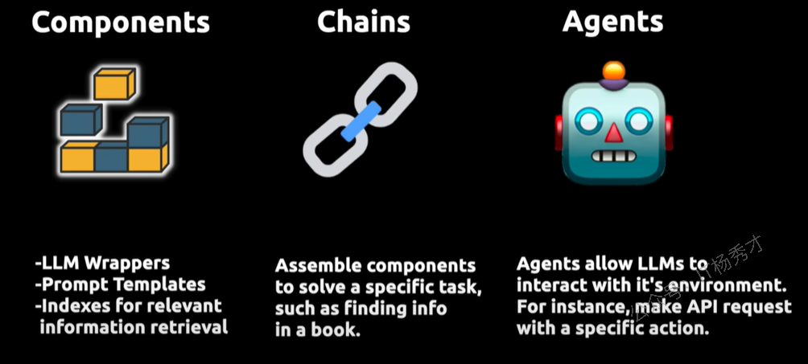
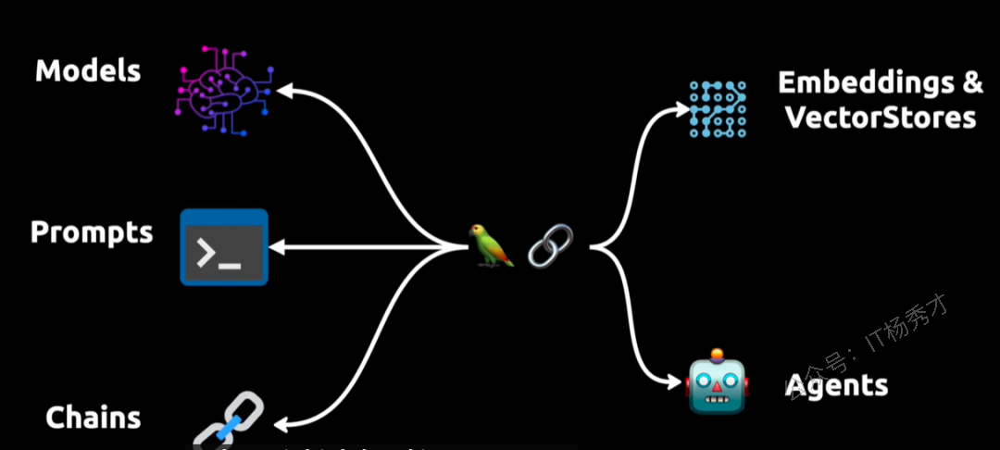
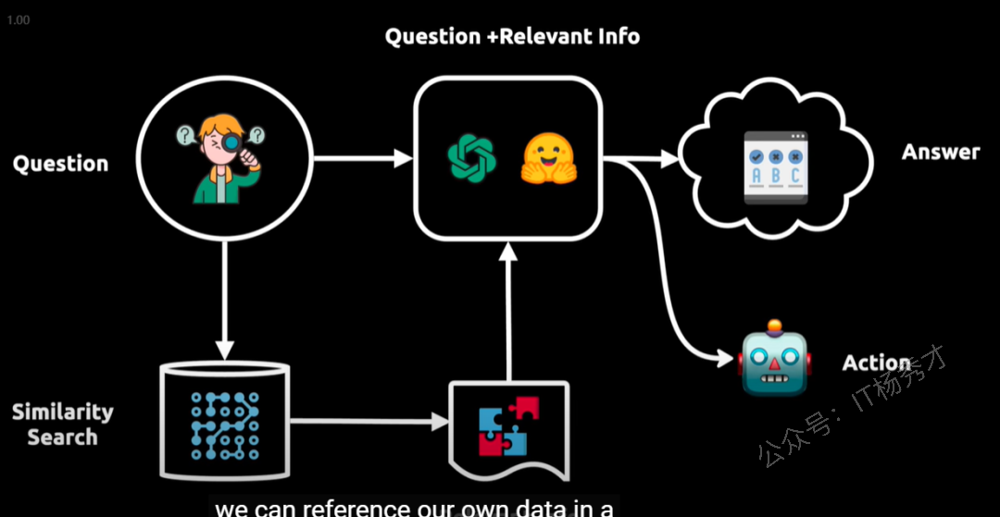

# LangChain基础概念

## 1. 什么是LangChain

**LangChain** 是一个用于开发由大型语言模型提供支持的应用程序的框架 （LLMs）。旨在帮助开发人员使用语言模型构建端到端的应用程序。它提供了一套工具、组件和接口，可简化创建由大型语言模型 (LLM) 和聊天模型提供支持的应用程序的过程。LangChain 可以轻松管理与语言模型的交互，将多个组件链接在一起，并集成额外的资源，比如API，数据库等等

目前**LangChain**提供了 Python 和TypeScript的软件包

## 2. **为什么要用 LangChain**

**智能数据整合**：Langchain框架支持将大规模语言模型与多样化数据存储系统进行深度对接，包括结构化数据库、非结构化PDF文档及其他文件格式。该特性使得企业能够充分挖掘私有知识库中的潜在价值，通过语义解析实现精准信息抽取。

**操作自动化扩展**：Langchain不仅可以提取信息，还可以根据这些信息执行特定的操作，比如可以自动化发送邮件。其核心优势在于采用动态参数化编程范式，避免硬编码，显著提升系统可维护性和扩展性。

## 3. **LangChain的核心组件**

Langchain主要由3个核心组件构成：

1. **Compents："组件"**

   * 为LLMs提供接口封装、模板提示和信息检索索引

1) **Chains："链"**

   * 将不同的组件组合起来解决特定的任务，比如在大量文本中查找某些具体信息

2) **Agent："代理"**

   * 使得大模型能够与外部环境进行交互，例如通过API请求执行某些具体操作

LangChain 的这种架构设计，使得大语言模型（LLMs）不仅能处理文本，还能在更广泛的应用场景中执行操作和做出响应，大幅提升了它们的应用范围和实用性。我的理解是，LangChain 在 AI 领域的作用类似于数据库中的 JDBC。JDBC是连接数据库和应用程序，LangChain是连接大模型和应用程序

## 4. **Langchain 核心概念**

关于LangChain主要有以下几个核心概念，如下图所示：

**LLM Wrappers**：包装器，允许应用程序连接到大型语言模型，如 GPT-4 等大模型

**Prompt Templates：**&#x63D0;示词模板，让用户避免硬编码文本输入，用户输入可以动态插入到模板中，并发送给语言模型

**Indexes：**&#x7D22;引，用户需要借助索引从大模型中提取信息

**Models**：负责理解和生成语言，提示用于引导模型输出

**Chains：**&#x94FE;，将不同的组件组合起来解决特定的任务，比如在大量文本中查找某些具体信息

**Agent：**&#x4F7F;得大模型能够与外部环境进行交互，例如通过API请求执行某些具体操作

**Embedding**： 嵌入与向量存储 VectorStore 是数据表示和检索的手段，为模型提供必要的语言理解基础

上图中的鹦鹉其实表示系统具备强大的自然语言处理能力，说明大语言模型能够像鹦鹉一样"复述"或"回应"用户的输入。右上图克制，整个系统构建了一个高度集成的架构，不仅能够处理复杂的语言任务，还能处理高级语言任务并在多种环境下进行动态交互。

更多关于LangChain的概念可以查看[这个页面](https://langchain-ai.github.io/langgraph/concepts/)

## 5. **LangChain的工作原理**

Langchain 的整体流程可以分为以下几个阶段，如下图所示：

**用户提问**：用户提交一个问题或请求。

**向语言模型发起查询**：系统将用户的问题转化为向量表示，并在向量数据库中进行相似度匹配。

**检索相关内容**：从向量数据库中找出与问题相关的内容片段，并传递给语言模型。

**生成回答或执行任务**：语言模型结合问题和补充信息，生成对应的回答或执行相应的操作。
