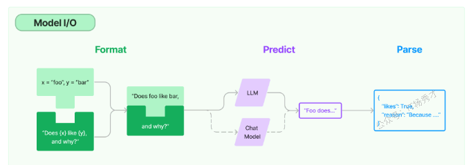
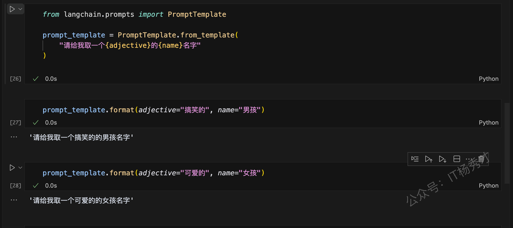
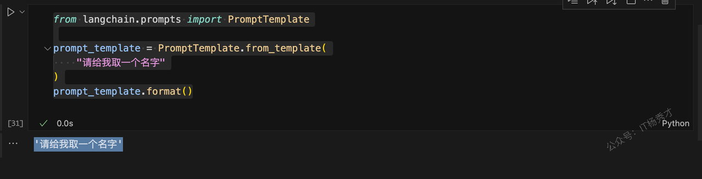
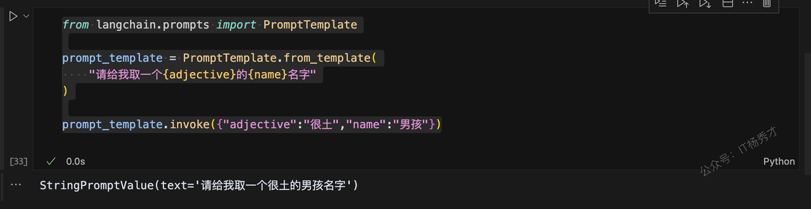
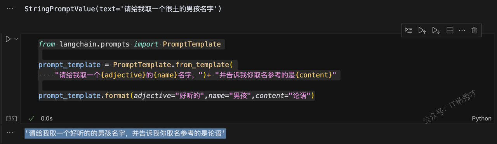
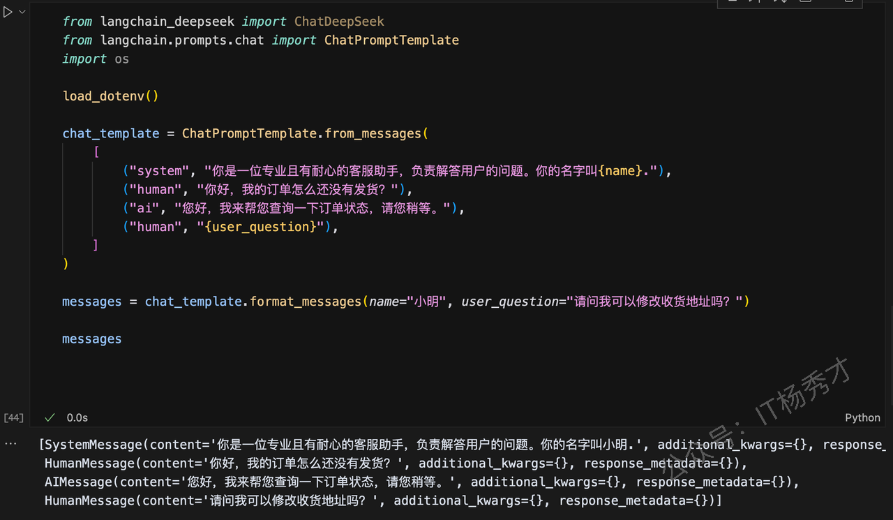
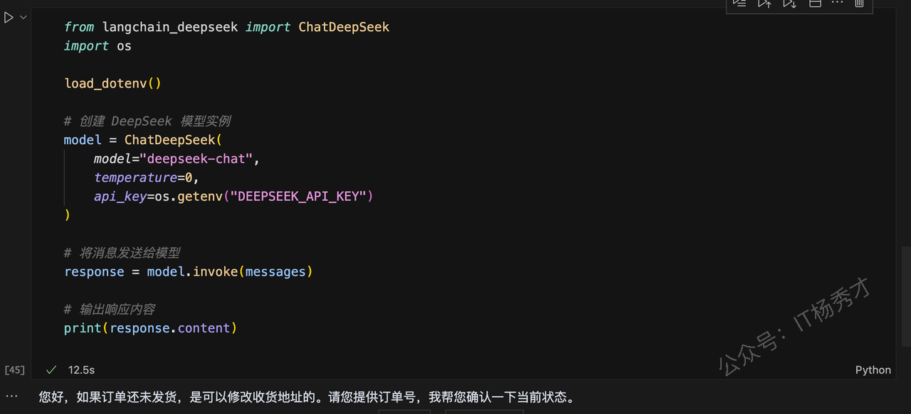
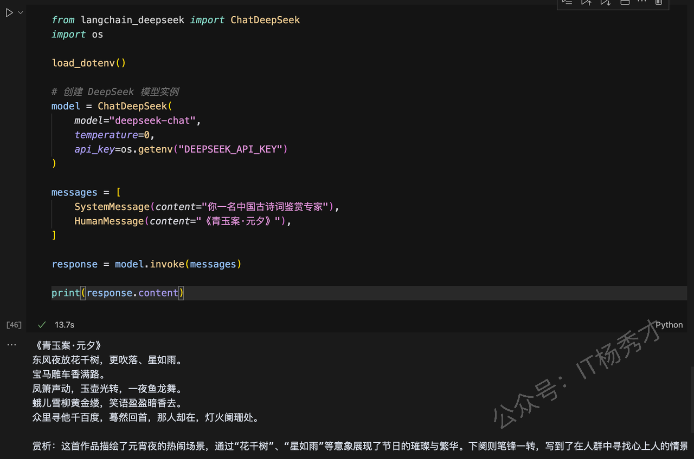
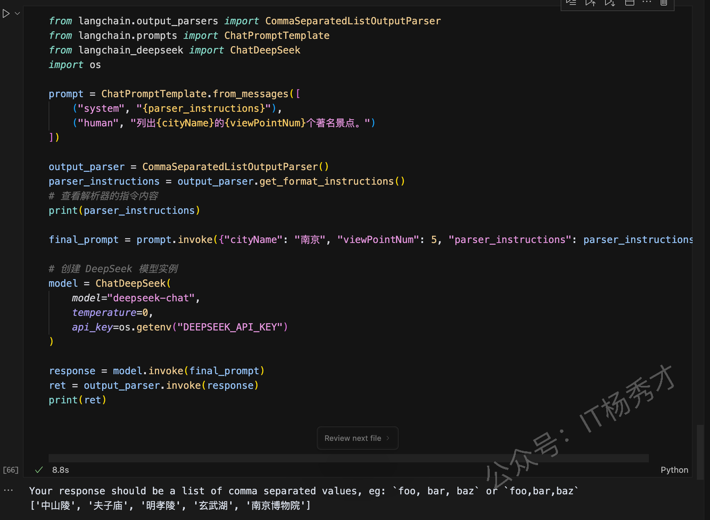

# Model I/O

LangChain框架是用于开发大模型应用的，对于任何大模型应用而言，Model（模型）都是最核心的部分。 LangChain 提供了与任何 Model 进行交互的的构建模块， 即 Model I/O。LangChain 的 Model I/O 模块是与这些语言模型（LLMs）进行交互的核心组件，它包括模型输入（Prompts）、模型输出（Output Parsers）和模型本身（Language Models）

## 1. Model I/O的核心概念

在 LangChain 的 Model I/O 模块设计中，主要由三个关键组件构成：Prompt Template（对应图中的 Format）、Language Models（对应 Predict）、以及 Output Parser（对应 Parse）。

* **Format**：对应 Prompt Template，通过预设模板对大模型输入进行结构化组织和管理

* **Predict**：代表 Model 部分，负责通过统一接口接入和调用不同的大语言模型

* **Parse**：即 Output Parser，用于从模型输出中提取所需信息，并根据既定格式进行规范化处理后输出



接下来我们会讲两种模型类型，一种是基础的Language Model（LLM），另一种是专注对话的 Chat LLM。之后还会介绍怎么用 Prompt Templates 来整理模型的输入内容，以及怎么用 Output Parser 来处理模型的输出结果，让它们更易读、更符合预期格式。

> **基础 LLM（Base LLM）**
>
> 在 LangChain 中，LLM 通常指的是传统的文本补全模型（Text Completion）。这类模型通过封装的 API 接收一个字符串类型的提示词作为输入，并返回对应的文本补全结果，输出同样是一个字符串。
>
> **对话式 LLM（Chat LLM）**
>
> Chat LLM 虽然通常构建在 Base LLM 之上，但针对多轮对话场景做了专门优化。它们采用不同于基础模型的接口形式，以聊天消息的列表作为输入，并返回结构化的响应（Response 类型），而不仅仅是简单的字符串文本。

## 2. PromptTemplate

### 2.1 Prompt

Prompt 是用户输入给大语言模型的一系列指令或提示，用于限定任务范围、提供上下文信息，并引导模型生成符合预期的语言输出，如问答、对话、文本生成等

### 2.2 prompt templates

Prompt 模板是一种预定义的结构，用于构建（格式化）发送给大语言模型的 prompt。它通常包含指令说明、few-shot 示例、任务相关的上下文和具体问题等内容。简单理解Prompt 模板就像一个事先设定好的“问题格式”，可以帮我们快速生成标准化的模型指令。LangChain 提供了一些与具体模型无关的通用 prompt 模板，这些模板可以在不同的 LLM 上复用，提高开发效率和适配灵活性。

### 2.3 PromptTemplate（字符串提示模板）

PromptTemplate主要用于创建一个字符串prompt，其实它就是相当于的Python str.format ，用来格式化我们的输入。它支持任意数量的变量，也可以没有没有变量

#### 2.3.1 指定参数

```python
from langchain.prompts import PromptTemplate

prompt_template = PromptTemplate.from_template(
    "请给我取一个{adjective}的{name}名字"
)
```

然后接下来在两个jupyter的cell中分别填入不同的模板参数

```python
prompt_template.format(adjective="搞笑的", name="男孩")
```

程序输出：

```python
'请给我取一个搞笑的的男孩名字'
```

```python
prompt_template.format(adjective="可爱的", name="女孩")
```

程序输出：

```python
'请给我取一个可爱的的女孩名字'
```



#### 2.3.2 不带参数

同样，这个模板可以包含任意多个变量，也可以不包含任何变量

```python
from langchain.prompts import PromptTemplate

prompt_template = PromptTemplate.from_template(
    "请给我取一个名字"
)
prompt_template.format()
```

程序输出：

```python
'请给我取一个名字'
```



#### 2.3.3 通过invoke方法填入提示词参数

```python
from langchain.prompts import PromptTemplate

prompt_template = PromptTemplate.from_template(
    "请给我取一个{adjective}的{name}名字"
)

prompt_template.invoke({"adjective":"很土","name":"男孩"})
```

程序输出

```python
StringPromptValue(text='请给我取一个很土的男孩名字')
```



#### 2.3.4 通过加号增加临时内容

如果需要在既有的模板下增加临时内容，也可以使用+來增加提示内容。

```python
from langchain.prompts import PromptTemplate

prompt_template = PromptTemplate.from_template(
    "请给我取一个{adjective}的{name}名字，")+ "并告诉我你取名参考的是{content}"

prompt_template.format(adjective="好听的",name="男孩",content="论语")
```

程序输出

```python
'请给我取一个好听的的男孩名字，并告诉我你取名参考的是论语'
```



可以看到，PromptTemplate其实就是起到一个格式化输入的作用，每次会把模板中的参数变量替换为我们的真实输入Language Models（语言模型）

### 2.4 ChatPromptTemplate（对话提示模板）

ChatPromptTemplate 是专为多轮对话设计的提示模板，它允许开发者分别定义不同对话角色的内容，从而帮助 AI 模型更自然地进行交流。它的核心功能是模拟对话中的多个角色，包括用户输入（HumanMessage）、AI 回复（AIMessage），以及系统提示或背景信息（SystemMessage）。通过这种结构化的方式，可以提升对话的连贯性和真实感。

代码示例：

```python
from langchain_deepseek import ChatDeepSeek
from langchain.prompts.chat import ChatPromptTemplate
import os

load_dotenv()

chat_template = ChatPromptTemplate.from_messages(
    [
        ("system", "你是一位专业且有耐心的客服助手，负责解答用户的问题。你的名字叫{name}."),
        ("human", "你好，我的订单怎么还没有发货？"),
        ("ai", "您好，我来帮您查询一下订单状态，请您稍等。"),
        ("human", "{user_question}"),
    ]
)

messages = chat_template.format_messages(name="小明", user_question="请问我可以修改收货地址吗？")

messages

```

程序输出：

```python
[SystemMessage(content='你是一位专业且有耐心的客服助手，负责解答用户的问题。你的名字叫小明.', additional_kwargs={}, response_metadata={}),
 HumanMessage(content='你好，我的订单怎么还没有发货？', additional_kwargs={}, response_metadata={}),
 AIMessage(content='您好，我来帮您查询一下订单状态，请您稍等。', additional_kwargs={}, response_metadata={}),
 HumanMessage(content='请问我可以修改收货地址吗？', additional_kwargs={}, response_metadata={})]
```



可以看到经过`format_messages`函数格式化处理后，最终的提示词messages中这组对话已经将我们的最终要传入的变量"小明"替换到原来的"name"参数处，将原来模板中的user\_question替换为"请问我可以修改收货地址吗？"这个字符串。接下来再下一个cell中调用DeepDeek大模型接口，把这个messages传给DeepDeek，然后看下DeepDeek给我们返回什么？

```python
from langchain_deepseek import ChatDeepSeek
import os

load_dotenv()

# 创建 DeepSeek 模型实例
model = ChatDeepSeek(
    model="deepseek-chat",
    temperature=0,
    api_key=os.getenv("DEEPSEEK_API_KEY")
)

# 将消息发送给模型
response = model.invoke(messages)

# 输出响应内容
print(response.content)
```

程序输出

```python
您好，如果订单还未发货，是可以修改收货地址的。请您提供订单号，我帮您确认一下当前状态。
```



尽管上述传给大模型的是一组对话，但是用户最终的问题&#x662F;**“请问我可以修改收货地址吗？”，而这里DeepDeek给出的回答正好是这个问题的回答，而且回答的非常完美**

这里有一个疑问，既然是要大模型回答用户的具体问题，按照上面的例子，我们直接给大模型最后的这个问题“**请问我可以修改收货地址吗？**”丢给大模型不就完了吗？为什么还要这么包装一组对话给它呢？

仔细思考一下，当你突然问一个人，“**我可以修改收货地址吗？”，**&#x5BF9;方估计会一脸懵逼，啥玩意，突然来这么个问题，是不是搞错提问对象了？

大模型同样如此，我们完全可以把大模型想象成这个人，当你什么上下文都没提供给他的时候，就问这么个问题，他也很懵逼，最后只会给你乱说一通。所以这里再次回到ChatPromptTemplate本身，他其实是通过SystemMessage给大模型安置了一个背景或者事角色，然后通过前面的几组对话，告诉大模型现在处在一个什么场景下，所以接下来用户提的问题，大模型才会根据它的角色，基于当前场景来回答， 这样的回答才可能最终是我们想要的答案。

简单总结就是，**ChatPromptTemplate可以给大模型的回答提供必要的上下文，使得大模型的回答准确性更高了**

当然，LangChain框架不知提供了这两种提示词模板，还有MessagePrompt，PipelinePrompt等一些列的prompt模板，这里就不一一介绍了，后续有用到的时候可以去官方的API文档查看具体用法：https://python.langchain.com/v0.1/docs/modules/model\_io/prompts/quick\_start/

## 3. **Language Model**

在 LangChain 中，**Language Model 模块**是用于直接与语言模型进行交互的核心构建单元（Building Block）。

目前，LangChain 主要支持并集成了两类语言模型：

* **LLMs**：接受文本字符串作为输入，返回文本字符串作为输出的模型（即 *text in → text out*）。

* **Chat Models**：以一组对话消息作为输入，返回新的对话消息作为输出的模型（即 *chat messages in → chat messages out*）。这些消息通常包含文本内容（content）和角色（role）信息（如 *system、human、ai*）。

简单理解就是，LM可以认为是一个文本生成式模型，即大模型会根据用户输入的指示，生成一段相关的文本；

而Chat Model则是一个聊天驱动的模型，即可以进行多轮对话。

### 3.1 **LLMs**

LLM 是 LangChain 架构中的关键组成部分，也叫Base LLM。典型的交互模式是：**文本输入 → 文本输出（ text in → text out）**。LangChain 提供了统一的标准接口，用于对接多种 LLM 类型。你可以在其文档中查看当前支持的各类模型。

所有 LLM 实现都遵循 LangChain 的 **Runnable 接口规范**，该接口提供了如 `invoke`、`ainvoke`、`batch`、`abatch`、`stream`、`astream` 等方法的默认实现，方便开发者灵活调用模型。

> 这里的LLM  Model我们使用的大模型是国内阿里的通义千问，因为DeepSeek并没有在LangChain中即成基础Model LLM，而是要通过Ollama去调用，这里我们后续再做介绍。
>
> 同样我们首先需要到通义千问创建一个API Key，https://bailian.console.aliyun.com/?apiKey=1#/api-key

同理，在创建完API Key之后，需要把它些入到项目根目录下的.env文件中，方便后续在项目中加载

```plain&#x20;text
DASHSCOPE_API_KEY=sk-45e155e83f524602b19b7c67e45932  // 这里替换为自己的API Key
```

代码示例：

```python
from langchain_community.llms import Tongyi
from dotenv import load_dotenv
# 导入操作系统相关功能
import os

# 加载 .env 文件中的环境变量
load_dotenv()

dashscope_api_key = os.getenv("DASHSCOPE_API_KEY")

# api key作为参数传入
llm = Tongyi(
    model="qwen-turbo",  # 或其他模型，如"qwen-plus", "qwen-max"
    dashscope_api_key=dashscope_api_key,
    temperature=0
)

response = llm.invoke("四大名著指的是什么?")

print(response)
```

程序输出

```markdown
四大名著是中国古代文学的瑰宝，通常指以下四部经典著作：

1. **《红楼梦》**：作者曹雪芹，被誉为中国古典小说的巅峰之作。小说以贾宝玉和林黛玉的爱情悲剧为主线，描绘了封建贵族家庭的兴衰和社会的复杂人际关系。

2. **《西游记》**：作者吴承恩，是一部神魔小说。讲述了唐僧师徒四人取经的历险故事，充满了奇幻色彩和深刻的哲理思考。

3. **《三国演义》**：作者罗贯中，是一部历史演义小说。以东汉末年到三国时期的历史为背景，描写了魏、蜀、吴三国之间的政治斗争和军事冲突。

4. **《水浒传》**：作者施耐庵，是一部描写农民起义的小说。讲述了梁山好汉反抗腐败官府的故事，展现了江湖豪情和英雄气概。

这四部作品不仅在中国文学史上占有重要地位，也对后世的文化和艺术产生了深远的影响。
```

### 3.2 Chat Model

Chat Model可以认为是LLM 的变体，其底层通常还是由Base LLM支撑，但专门针对对话进行了调整。并且它提供的 Interface 有了比较大的差异，提供基于"聊天消息"的接口，而不单单是一个字符串。他的输入和输出可以简单理解如下：

| 输入     | 输出     |
| ------ | ------ |
| 一组聊天消息 | 一条聊天消息 |

#### 3.2.1 Messages类型

Chat models使用chat message作为输入和输出，LangChain目前支持的`chat message`类型有：

| Messages类型      | 用途                                                                                                    |
| --------------- | ----------------------------------------------------------------------------------------------------- |
| SystemMessage   | 设定大模型的身份，人设                                                                                           |
| HumanMessage    | 用户输入                                                                                                  |
| AIMessage       | 模型输出                                                                                                  |
| FunctionMessage | 函数调用的返回结果，用于标识某个函数执行的内容返回，除了对应的`role`和`content`参数外，还有一个`name`参数，表示对应名称的函数的执行结果，与 `function_call` 搭配使用 |
| ToolMessage     | 工具调用的返回结果，用于标识某个工具执行的内容返回，`tool_call_id`：表示对应哪一次工具调用的返回结果，与 `tool_calls` 搭配                           |

这里主要讲解前面三种Messages类型，函数和工具的调用就不在这里演示了，后续章节会专门讲解

代码示例：

```python
from langchain_deepseek import ChatDeepSeek
import os

load_dotenv()

# 创建 DeepSeek 模型实例
model = ChatDeepSeek(
    model="deepseek-chat",
    temperature=0,
    api_key=os.getenv("DEEPSEEK_API_KEY")
)

messages = [
    SystemMessage(content="你一名中国古诗词鉴赏专家"),
    HumanMessage(content="《青玉案·元夕》"),
]

response = model.invoke(messages)

print(response.content)

```

程序输出

```python
《青玉案·元夕》
东风夜放花千树，更吹落、星如雨。
宝马雕车香满路。
凤箫声动，玉壶光转，一夜鱼龙舞。
蛾儿雪柳黄金缕，笑语盈盈暗香去。
众里寻他千百度，蓦然回首，那人却在，灯火阑珊处。

赏析：这首作品描绘了元宵夜的热闹场景，通过“花千树”、“星如雨”等意象展现了节日的璀璨与繁华。下阕则笔锋一转，写到了在人群中寻找心上人的情景，最终在“灯火阑珊处”找到了她，表达了在喧嚣中寻找内心宁静与真爱的情感。整首词语言优美，意境深远，情感真挚动人。
```



上述例子知识用SystemMessage给了AI一个身份，并且让其回答HumanMessage中用户的问题，很简单。既然学习了前面的提示词模板，这里同样可以用模板来给这几个message进行格式化，请看下面的例子

```python
from langchain_deepseek import ChatDeepSeek
import os

from langchain.chat_models import ChatOpenAI
from langchain.prompts.chat import (
    ChatPromptTemplate,
    SystemMessagePromptTemplate,
    HumanMessagePromptTemplate
)

load_dotenv()

# 创建 DeepSeek 模型实例
model = ChatDeepSeek(
    model="deepseek-chat",
    temperature=0,
    api_key=os.getenv("DEEPSEEK_API_KEY")
)

# ✅ 构建 Prompt 模板（带变量）
system_template = "你是一个专业的 {role}，回答问题要简洁清晰。"
human_template = "请用 {language} 写一个 {task} 的程序。"

# ✅ 使用模板封装 message
system_message_prompt = SystemMessagePromptTemplate.from_template(system_template)
human_message_prompt = HumanMessagePromptTemplate.from_template(human_template)

# ✅ 构建最终 ChatPromptTemplate
chat_prompt = ChatPromptTemplate.from_messages([
    system_message_prompt,
    human_message_prompt
])

# ✅ 模板填充变量
formatted_messages = chat_prompt.format_messages(
    role="后端开发专家",
    language="Go语言",
    task="快速排序"
)

response = model.invoke(formatted_messages)

print(response.content)
```

程序输出

```python
[SystemMessage(content='你是一个专业的 后端开发专家，回答问题要简洁清晰。', additional_kwargs={}, response_metadata={}),
 HumanMessage(content='请用 Go语言 写一个 快速排序 的程序。', additional_kwargs={}, response_metadata={})]
```

可以看到最终将`chat_prompt`变成了`list`的形式，并且讲原来message里的模板参数替换成了真正的变量。

然后我们把`chat_prompt`作为输入，调用DeepSeek接口，看一下返回结果：

````sql
以下是一个使用 Go 语言实现的快速排序程序：

```go
package main

import "fmt"

func quickSort(arr []int) []int {
    if len(arr) <= 1 {
        return arr
    }

    pivot := arr[0]
    var left, right []int

    for _, v := range arr[1:] {
        if v <= pivot {
            left = append(left, v)
        } else {
            right = append(right, v)
        }
    }

    left = quickSort(left)
    right = quickSort(right)

    return append(append(left, pivot), right...)
}

func main() {
    arr := []int{3, 6, 8, 10, 1, 2, 1}
    fmt.Println("Original array:", arr)
    sortedArr := quickSort(arr)
    fmt.Println("Sorted array:", sortedArr)
}
```

### 代码说明：
1. **quickSort 函数**：递归地对数组进行排序。
   - 如果数组长度小于等于 1，直接返回数组。
   - 选择数组的第一个元素作为基准（pivot）。
   - 将数组分为两部分：小于等于基准的部分和大于基准的部分。
   - 递归地对左右两部分进行排序，最后合并结果。

2. **main 函数**：测试快速排序算法。
   - 定义一个未排序的数组。
   - 调用 `quickSort` 函数进行排序，并输出结果。

### 输出示例：
```
Original array: [3 6 8 10 1 2 1]
Sorted array: [1 1 2 3 6 8 10]
```

这个程序实现了快速排序的基本逻辑，适用于大多数情况。
````

DeepSeek不仅帮我们写好了程序，还给出来代码水名和测试用例，非常完美

## 4. **Output Parsers**

Output Parsers 即输出解析器，从前面示例可以看到，`LLM`和`ChatModel`的输出都是自然语言文本，也就是字符串 。但很多时候，我们希望它能以特定的格式输出，以便解析成结构化的数据。LangChain也提供的Output Parsers就是完成这个功能的

Output Parsers 在使用的时候通常需要实现两个关键方法：

1. **`get_format_instructions()`**：返回一段文本，用于告诉语言模型如何组织和格式化它的输出内容。

2. **`parse()`**：用于接收语言模型返回的字符串结果，并将其解析为结构化的数据形式（如字典、对象等），便于后续程序处理。

目前LangChain提供了一些列预定义的类，以下是一些常用的预定义的 Output Parsers

这里以**CommaSeparatedListOutputParser**为代码示例看一下Output Parsers的具体用法 ：

```python
# 导入逗号分隔输出解析器
from langchain.output_parsers import CommaSeparatedListOutputParser
# 导入聊天提示模板  
from langchain.prompts import ChatPromptTemplate  
# 导入 DeepSeek 模型调用模块                  
from langchain_deepseek import ChatDeepSeek 
# 导入 os，用于读取 API Key 环境变量                         
import os                                                            

# 1️⃣ 创建提示词模板，包含 system 和 human 两种消息角色
prompt = ChatPromptTemplate.from_messages([
    ("system", "{parser_instructions}"),  # system role：这里的系统背景要素模型，要设置模型输出格式规范，
    ("human", "列出{cityName}的{viewPointNum}个著名景点。")  # human role：实际任务指令（用户问题）
])

# 2️⃣ 使用 CommaSeparatedListOutputParser 作为
output_parser = CommaSeparatedListOutputParser()

# 3️⃣ 获取输出解析器提供的格式指导说明文本
parser_instructions = output_parser.get_format_instructions()
# 👉 打印查看格式说明：告诉模型“请以逗号分隔的形式输出结果”
print(parser_instructions)

# 4️⃣ 构造最终的 prompt，将模板变量填充完整
final_prompt = prompt.invoke({
    "cityName": "南京",                       # 设置城市名变量
    "viewPointNum": 5,                        # 设置景点数量
    "parser_instructions": parser_instructions  # 填充格式指令，系统角色的内容
})

# 5️⃣ 创建 DeepSeek 模型实例
model = ChatDeepSeek(
    model="deepseek-chat",                    # 模型名称
    temperature=0,                            # 控制输出稳定性（0 表示确定性更强）
    api_key=os.getenv("DEEPSEEK_API_KEY")     # 从环境变量读取 API Key
)

# 6️⃣ 调用模型，获取模型响应内容
response = model.invoke(final_prompt)

# 7️⃣ 使用解析器将模型输出内容转换成 Python 列表
ret = output_parser.invoke(response)

# 8️⃣ 输出最终解析结果
print(ret)  # 示例输出：['中山陵', '夫子庙', '南京长江大桥', '玄武湖', '总统府']

```

程序输出：

```javascript
Your response should be a list of comma separated values, eg: `foo, bar, baz` or `foo,bar,baz`
['中山陵', '夫子庙', '明孝陵', '玄武湖', '南京博物院']
```



## 5. 小结

Model I/O模块是LangChain 框架的核心模块，它主要由 Prompt Template 模块、语言模型（LLM 与 Chat Model）、输出解析器（Output Parsers）三大核心组件构成。Prompt 作为与模型交互的“桥梁”，在提高指令清晰度和任务表达力方面发挥着重要作用；LLM 和 Chat Model 则构成了整个模型调用链的执行核心；而 Output Parsers 则帮助我们提升模型结果的可控性和可解析性。

