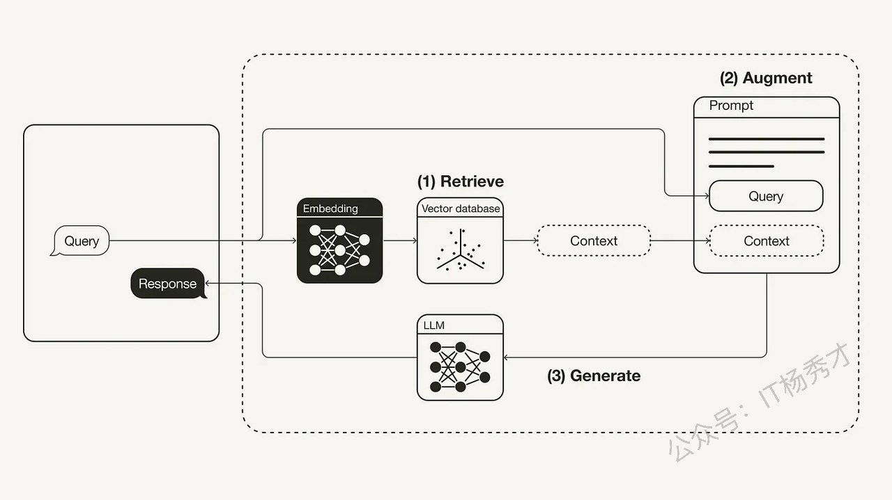
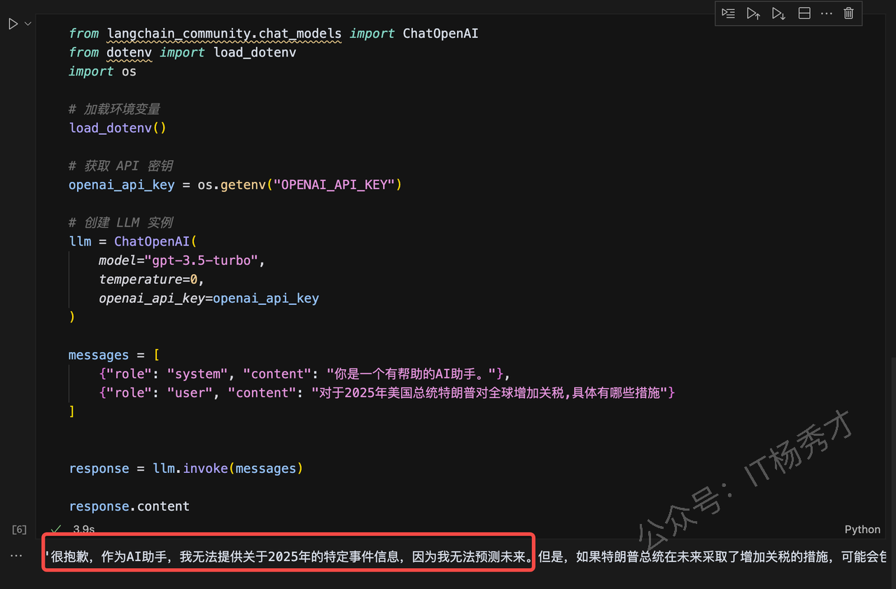
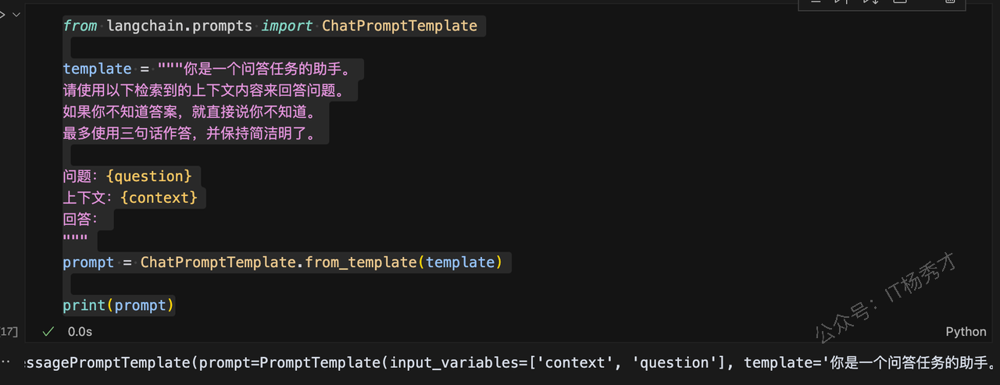

# RAG(检索增强)

## 1. 什么是RAG

**RAG，Retrieval-Augmented Generation**，即信息检索增强。RAG就是大模型在生成回答之前，通过信息检索从外部知识库查找与问题相关的知识，增强生成过程中的信息来源，从而提升生成回答的质量和准确性。通俗来讲，就是既然大模型的训练数据里面不包含相应数据，那就从外部知识库把对应的数据提供给我们的大模型，然后让大模型结合已有的能力给出更准确的输出。



如上图所示，RAG的主要流程分为三个步骤

**检索 (Retrieve)**：用户查询被用来从外部知识源检索相关上下文。为此，用户查询通过一个嵌入模型（embedding model）被嵌入到与向量数据库中附加上下文相同的向量空间中。这使得可以执行相似性搜索，并返回向量数据库中最接近的前 k 个数据对象。

**增强 (Augment)**：用户查询和检索到的附加上下文被填充（stuffed into）到一个提示模板（prompt template）中。

**生成 (Generate)**：最后，这个经过检索增强的提示（retrieval-augmented prompt）被输入到大型语言模型（LLM）中。

通过上述流程我们可以知道外部知识库其实是我们了解LLM训练数据之外世界的"窗口"，要做好RAG工程，外部知识库的搭建极为重要。RAG是一项很复杂的技术工程，要让模型根据已有知识库提供精准的答复，其中还涉及到很多细节，这里只接单介绍一下RAG的一些概念，然后讨论怎么通过LangChain 实现LLMs的RAG。关于RAG的优化细节我们将在后面用一个专门的系列来讲解

## 2. 为什么要有RAG

大型语言模型（LLMs）都存在数据新鲜度问题，即使是像 ChatGPT这样最强大的模型，对近期事件也是一无所知。因为大模型只知道通过训练数据呈现的世界，而训练数据集是不可能包含特定数据和最新数据的，这就给任何依赖最新信息或特定数据集的应用场景带来了问题。下图就是一个典型案例：



我们想让ChatGPT告诉我们美国总统特朗普在2025年对全球增加关税的具体措施，ChatGPT其实是不知道的，因为它在训练的时候不包含这些很新的信息。因此，弥补大型语言模型的通用知识与任何附加上下文之间的差距非常重要，这有助于大型语言模型生成更准确、更符合上下文的补全内容，同时减少幻觉的产生。

传统上，神经网络可以通过微调模型来适应特定领域或专有信息。虽然这种技术很有效，但它也计算密集、成本高昂，并且需要专业技术知识，这使得它在适应不断变化的信息方面不够敏捷。

2020年，Lewis 等人在《面向知识密集型自然语言处理任务的检索增强生成》（Retrieval-Augmented Generation for Knowledge-Intensive NLP Tasks）\[1] 这篇论文中提出了一种更灵活的技术，称为检索增强生成（RAG）。在这篇论文中，研究人员将一个生成模型与一个检索模块相结合，以便从一个可以更容易更新的外部知识源提供额外信息。

简单来说，RAG 之于大型语言模型（LLMs），就好比开卷考试之于人类。在开卷考试中，学生被允许携带参考资料，如教科书或笔记，他们可以用这些资料来查找相关信息以回答问题。开卷考试背后的理念是，测试侧重于学生的推理能力，而不是他们记忆特定信息的能力。

类似地，在RAG中，事实性知识从大型语言模型的推理能力中分离出来，并存储在一个可以轻松访问和更新的外部知识源中：

* **参数化知识 (Parametric knowledge)**：在训练期间学习到的知识，隐式地存储在神经网络的权重中。

* **非参数化知识 (Non-parametric knowledge)**：存储在外部知识源中，例如向量数据库。

而我们所说的RAG相关的知识就是这部分**非参数化知识**

## 3. 基于 LangChain 实现RAG

接下来，我们将展示如何利用 Python 结合 **OpenAI**&#x7684;大语言模型 (LLM)、[Weaviate](https://weaviate.io/) 的向量数据库以及  **OpenAI**&#x7684;嵌入模型来实现一个检索增强生成（RAG）流程。在这个过程中，我们将使用 LangChain 来进行整体编排。

如果你对向量数据库**Weaviate** 还不是很了解，可以先去https://weaviate.io/了解一下

### 3.1 软件包安装

&#x20;在开始之前，需要先安装相关软件包

```python
pip install langchain openai weaviate-client
```

这里langchain就LanChain框架，如果是学习过前面的LanChain系列章节，这个包就已经安装过了，这里就没必要安装了。openai包主要是提供嵌入模型和大语言模型 (LLM)，weaviate-client主要是用于操作向量数据库

### 3.2 环境变量设置

此外，还需要在项目根目录下的 `.env` 文件来定义相关的环境变量，这里主要是设置一下OPENAI\_API\_KEY。如果项目根目录下没有`.env`文件，可以创建一个。同时，如果还没有OpenAI API 密钥，可以在https://platform.openai.com/api-keys创建一个。

```plain&#x20;text
OPENAI_API_KEY="<你的OPENAI_API密钥>"
```

然后，运行以下命令来加载相关的环境变量。

```plain&#x20;text
import dotenv
dotenv.load_dotenv()
```

### 3.3 数据准备

在数据准备阶段，主要是要建立一个向量数据库，这个数据库就是作为大模型的外部数据源来给它提供大模型不知道的额外信息

#### 3.3.1 数据加载

这里我们选用2022 年拜登总统的国情咨文 作为外部数据源，数据位于：[ LangChain 的 GitHub 仓库 的docs目录下](https://github.com/langchain-ai/langchain/blob/master/docs/docs/how_to/state_of_the_union.txt)，它是一个txt文件。我们将其下载下来翻译成中文，保存到项目的根目录的下的data目录下的一个rag.txt文件来做测试。为了加载这些数据，可以使用 LangChain 内置的`TextLoader`加载器来进行加载，这个部分在前面学习LangChain的Mode I/O组件的时候也有介绍过，下面是具体代码：

```python
from langchain.document_loaders import TextLoader

# 直接使用 TextLoader 加载本地文件
loader = TextLoader("./data/rag.txt")
documents = loader.load()
```

执行成功之后，可以打印一下documents，查看一下是否加载成功

```python
documents
```

由于内容很多，这里就不打印输出了，程序运行截图如下：


#### 3.3.2 文档切割

接下来，需要的文档进行分块 (chunk) – 因为原始状态下的文档 (Document) 太长，无法放入大型语言模型 (LLM) 的上下文窗口中，需要将其切割成更小的片段。LangChain 提供了许多内置的文本分割器 (text splitters)。在这个简单的示例中，可以使用 `CharacterTextSplitter`，设定大约 500 的块大小 (chunk\_size) 以及 50 的块重叠 (chunk\_overlap)，以保持块与块之间文本的连续性。

```python
from langchain.text_splitter import RecursiveCharacterTextSplitter
# 创建更智能的文本分割器，减小块大小
text_splitter = RecursiveCharacterTextSplitter(
    chunk_size=200,  # 块大小
    chunk_overlap=20,
    length_function=len,
    separators=["\n\n", "\n", " ", ""]  # 添加更多的分隔符
)
chunks = text_splitter.split_documents(documents)
```


#### 3.3.3 词嵌入

最后一步是**嵌入并存储上一步切割后的这些文本块 。** 为了能够在文本块之间进行语义搜索，需要将每个文本块向量化，然后存储到向量数据库中。这里使用 OpenAI 的嵌入模型，而要存储它们，这里我们可以使用前面安装的 Chroma 向量数据库。通过调用 `.from_documents()` 方法，向量数据库会自动将这些块填充进向量数据库中

```python
from langchain_community.embeddings import OpenAIEmbeddings
from langchain_community.vectorstores import Chroma

# 创建向量存储
vectorstore = Chroma.from_documents(
    documents=chunks,
    embedding=OpenAIEmbeddings(),
)

```

#### 3.3.4 检索

向量数据库被填充完毕之后，接着就可以将其定义为检索器 (retriever) 组件，这个组件能够根据用户查询输入与已嵌入的文本块之间的语义相似度，检索出相关的补充上下文。

```python
# 创建检索器，限制返回的文档数量和长度
retriever = vectorstore.as_retriever(
    search_type="similarity",
    search_kwargs={
        "k": 2,  # 只返回最相关的2个文档
    }
)
```


#### 3.3.5 增强

下一步，就可以定义一个提示词模板，在这个提示词模板中，包含我们前面定义的检索器 (retriever) 组件，这样根据这个提示词输入的问题，大模型就可以利用检索器，去查找相关联的上下文信息，起到一个增强回答的效果

```python
from langchain.prompts import ChatPromptTemplate

template = """你是一个问答任务的助手。
请使用以下检索到的上下文内容来回答问题。
如果你不知道答案，就直接说你不知道。
最多使用三句话作答，并保持简洁明了。

问题：{question}
上下文：{context}
回答：
"""
prompt = ChatPromptTemplate.from_template(template)

print(prompt)
```



#### 3.3.6 生成

最后，再为 RAG 流水线构建一个 chain（链式结构），将检索器（retriever）、提示模板（prompt template）和大语言模型（LLM）串联起来。当这个 RAG 链条定义完成后，就可以直接调用它来完成问答或生成任务。

```python
from langchain.chat_models import ChatOpenAI
from langchain.schema.runnable import RunnablePassthrough
from langchain.schema.output_parser import StrOutputParser

llm = ChatOpenAI(model_name="gpt-3.5-turbo", temperature=0)

rag_chain = (
    {"context": retriever,  "question": RunnablePassthrough()}
    | prompt
    | llm
    | StrOutputParser()
)

query = "总统是如何评价布雷耶大法官的？"
rag_chain.invoke(query)
```

程序输出

```python
'总统对布雷耶大法官表示致敬，称其为一位毕生致力于服务国家的人。'
```


大模型很好的根据给定的外部数据，回答了我们提出的问题

## 4. 总结

检索增强生成 (RAG) 是一种使用来自私有或专有数据源的信息来补充文本生成的技术，它将检索技术和LLM提示结合在一起，提高了 LLM 响应的准确性和相关性。RAG的主要有三个步骤，首先根据用户查询从外部知识库检索相关信息，然后将然后将这些信息与原始查询组合成提示，最后由大型语言模型基于增强的提示生成答案。RAG目前正成为解决大模型知识局限的一种常见的解决方案
