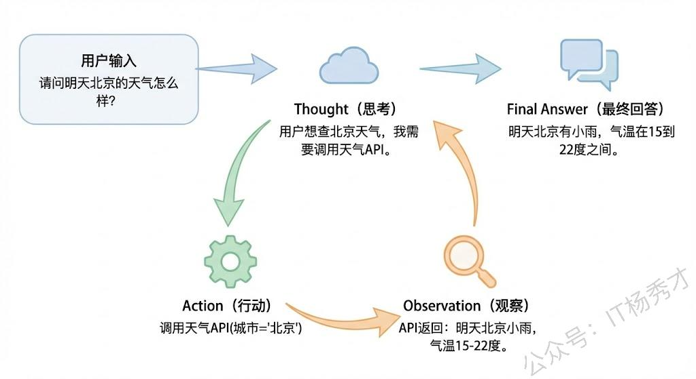
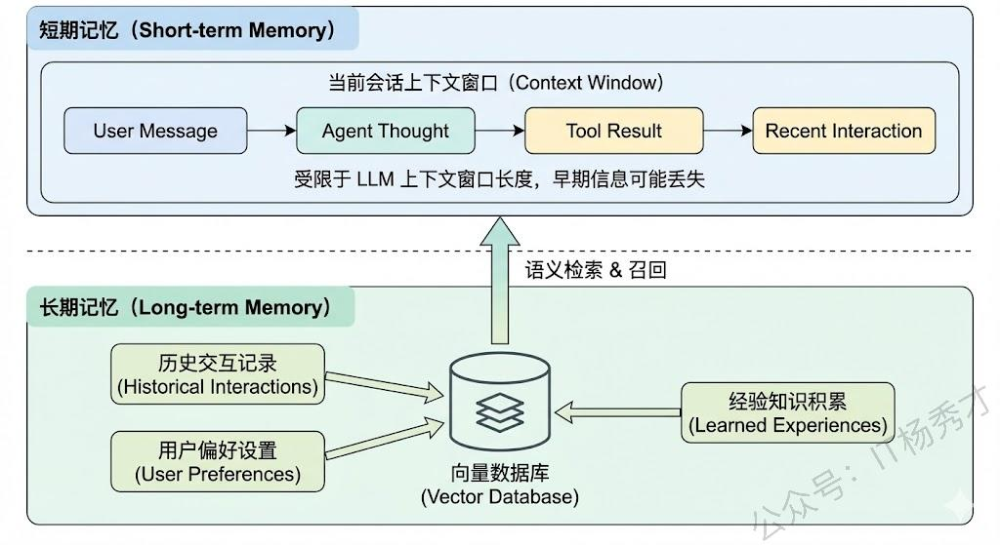

## **1. 题目分析**

这道题是大模型应用开发面试中的高频题，几乎是必问的。它考察的不是你能不能背出 Agent 的定义，而是你对 Agent 这个概念有没有真正理解透——它跟普通的 LLM 调用到底有什么本质区别，以及你在实际项目中有没有真正设计和落地过 Agent 系统。下面我们从"是什么"和"由什么组成"两个维度来把这道题讲透。

### **1.1 Agent 到底是什么，跟普通 LLM 调用有什么区别**

要理解 Agent，我们先想一个最直觉的对比。当你用 ChatGPT 问一个问题，它给你一段回答，这个过程本质上就是一次 LLM 的输入输出——你给一个 prompt，它返回一个 completion，交互就结束了。这种方式是"一问一答"的，LLM 本身是被动的，它不会主动去做任何事情，也不会根据结果来决定下一步该干什么。

而 Agent 则完全不同。Agent 的核心特征是**自主性（Autonomy）**——它能够自主地感知环境、制定计划、使用工具、执行行动，并且根据执行结果来动态调整后续策略。换句话说，LLM 在 Agent 架构中不再只是一个"回答问题的机器"，而是充当了整个系统的"大脑"，负责理解任务、推理决策、协调各种外部能力来完成复杂的目标。

举一个具体的例子来感受这个区别。假设用户说"帮我查一下明天北京的天气，如果下雨就把我后天的户外会议改成线上"。如果是普通的 LLM 调用，它最多只能告诉你"你可以去查天气然后改会议"。但如果是一个 Agent，它会这样做：首先调用天气 API 查询明天北京的天气，然后判断结果是否包含下雨，如果是，就接着调用日历 API 找到后天的户外会议，再调用会议修改接口把它改成线上，最后把整个执行结果汇报给用户。整个过程中，LLM 在每一步都在做推理和决策，决定接下来要调用什么工具、传什么参数、怎么处理返回结果。

所以，**Agent 本质上是以 LLM 为核心推理引擎，结合规划能力、工具使用能力和记忆能力，能够自主完成复杂任务的智能系统**。学术上比较经典的定义来自 Lilian Weng 的那篇博客，她把 Agent 定义为 LLM + Planning + Memory + Tools 的组合体，这个框架至今仍然是业界最广泛认可的 Agent 架构抽象。

### **1.2 Agent 的核心组件**

理解了 Agent 的本质之后，我们来拆解它的核心组件。一个完整的 Agent 系统通常由四个核心模块构成：LLM（大脑）、规划模块（Planning）、记忆模块（Memory）、工具使用（Tools）。这四个模块各司其职又紧密协作，共同支撑了 Agent 的自主决策和任务执行能力。

**第一个核心组件是 LLM，也就是 Agent 的"大脑"。** 它是整个系统的中枢，负责理解用户意图、进行逻辑推理、生成行动计划、解读工具返回结果。可以说 Agent 的智能水平上限就取决于底层 LLM 的能力。这也是为什么在实际项目中，选择一个推理能力足够强的基座模型非常重要——如果 LLM 的推理能力不够，它就无法正确地分解任务、选择合适的工具，整个 Agent 系统的表现就会大打折扣。在工程实践中，我们通常还会通过精心设计的 System Prompt 来给 LLM 设定角色、约束行为边界、规定输出格式，这相当于给"大脑"装上了一套操作手册。

**第二个核心组件是规划模块（Planning）。** 规划能力是 Agent 区别于简单 LLM 应用的关键标志。当 Agent 接收到一个复杂任务时，它不会试图一步到位地解决，而是会把任务分解成多个可执行的子步骤，然后按照逻辑顺序逐步执行。

目前主流的规划策略主要有两类。

1. 第一类是**无反馈的规划**，比如 ReAct（Reasoning + Acting）框架，它让 LLM 在每一步先进行推理思考（Thought），然后决定执行一个动作（Action），接着观察动作的结果（Observation），再进入下一轮的思考-行动循环。ReAct 的优点是实现简单、思路清晰，是目前最广泛使用的 Agent 推理框架。还有一种是先一次性生成完整的执行计划，然后逐步执行，类似于 Plan-and-Execute 模式。

2. 第二类是**带反馈的规划**，也就是 Agent 在执行过程中会根据中间结果进行反思和调整。比如 Reflexion 框架，Agent 在执行失败后会对失败原因进行自我反思，然后修正策略重新执行。这种方式更接近人类解决问题的真实过程——我们不会一条路走到黑，而是会根据反馈不断调整方案。

**第三个核心组件是记忆模块（Memory）。** 人类之所以能处理复杂任务，很大程度上依赖记忆——我们能记住之前做过什么、学到了什么、对方说过什么。Agent 同样需要记忆能力来维持上下文连贯性和积累经验。

Agent 的记忆通常分为两种：

1. **短期记忆（Short-term Memory）**，本质上就是当前对话的上下文（Context），包括用户的历史消息、Agent 之前的推理过程和工具调用结果等。它存在于 LLM 的上下文窗口中，让 Agent 在一次任务执行过程中能够保持连贯性。但短期记忆受限于 LLM 的上下文窗口长度，当对话太长或推理步骤太多时，早期的信息就会被截断丢失。工程上常见的解决方案包括对话摘要（Summarization）、滑动窗口、以及基于关键信息提取的压缩策略。

2. **长期记忆（Long-term Memory），**&#x5219;是持久化存储的外部知识，通常通过向量数据库来实现。Agent 可以把重要的历史交互、学到的经验、用户偏好等信息存入向量数据库，在需要时通过语义检索（也就是 RAG 的方式）来调取相关记忆。这使得 Agent 能够跨会话地积累和利用知识，表现出"越用越聪明"的特性。

**第四个核心组件是工具使用（Tools / Function Calling）。** 工具使用能力是 Agent 能够真正"做事"的关键。LLM 本身只能生成文本，它不能查数据库、不能调 API、不能操作文件系统。但通过工具使用机制，Agent 可以将 LLM 的推理能力与外部世界的执行能力连接起来。

在技术实现上，工具使用主要依赖 LLM 的 **Function Calling** 能力。我们预先定义好一组工具的描述（包括工具名称、功能说明、参数 schema），放在 System Prompt 或者通过 Function Calling 接口传给 LLM。当 LLM 在推理过程中判断需要使用某个工具时，它会生成一个结构化的函数调用请求（包含工具名和参数），Agent 框架负责解析这个请求并实际执行对应的函数，然后把执行结果返回给 LLM 继续推理。

工具的类型可以非常丰富，常见的包括：搜索引擎（联网检索信息）、数据库查询、API 调用（天气、日历、邮件等）、代码执行器（让 Agent 能写代码并运行）、文件读写操作等。工具的丰富程度直接决定了 Agent 能做的事情的边界——工具越多越强，Agent 的能力就越强。

### **1.3 工程补充**

在真实的 Agent 项目落地过程中，除了上述四个核心组件，还有一些工程层面的关键设计需要考虑。

一个是**安全与边界控制**。Agent 拥有工具调用能力意味着它能对外部系统产生真实影响（比如发邮件、改数据库），所以必须设计好权限控制和人工确认机制（Human-in-the-Loop），防止 Agent 在推理出错的情况下执行了不可逆的危险操作。

另一个是**多 Agent 协作**。当任务非常复杂时，单个 Agent 可能难以胜任，这时候可以设计多个专业化的 Agent 各负责一个子领域，通过一个编排层（Orchestrator）来协调它们的分工合作。比如 AutoGen、CrewAI 等框架就是这个思路，本质上是把"一个全能 Agent"拆成了"多个专家 Agent 的团队"。

还有一个是**可观测性和调试**。Agent 的多步推理过程是非确定性的，每次运行可能走不同的路径，这给调试带来了很大挑战。所以工程上需要完善的日志记录、Trace 追踪和中间状态可视化能力，才能在出问题时快速定位是哪一步推理出了错、哪个工具调用返回了异常结果。

## **2. 参考回答**

我理解的 Agent，本质上是以 LLM 为核心推理引擎，具备自主规划、工具调用和记忆能力，能够自主完成复杂任务的智能系统。它跟普通的 LLM 调用最大的区别在于自主性——普通 LLM 调用是一问一答的被动模式，而 Agent 能够自主地把一个复杂任务拆解成多个步骤，在每一步进行推理决策，选择合适的工具去执行，观察结果后再动态调整下一步策略，形成一个"思考-行动-观察"的闭环循环，直到任务完成。

核心组件通常有四个。第一个是 LLM 本身，它充当 Agent 的大脑，负责意图理解、逻辑推理和决策生成，Agent 的智能上限取决于底层模型的能力。第二个是规划模块，让 Agent 能够进行任务分解和多步推理，主流的实现方式是 ReAct 框架，通过 Thought-Action-Observation 的循环来逐步推进任务，更高级的还有带反思机制的规划，能在执行失败时自我修正。第三个是记忆模块，分为短期记忆和长期记忆，短期记忆就是当前的对话上下文，保证一次任务内的连贯性，长期记忆通常借助向量数据库存储历史经验和知识，通过 RAG 的方式在需要时检索召回。第四个是工具使用能力，通过 Function Calling 机制让 Agent 能够调用外部 API、查数据库、执行代码等，这是 Agent 能真正与外部世界交互并产生实际影响的关键。在实际落地中，还需要特别关注安全边界控制、Human-in-the-Loop 机制以及整个推理链路的可观测性，这些工程层面的设计直接决定了 Agent 系统是否能稳定可靠地上线运行。

## **学习交流**

> 如果您觉得文章有帮助，可以关注下秀才的<strong style="color: red;">公众号：IT杨秀才</strong>，后续更多优质的文章都会在公众号第一时间发布，不一定会及时同步到网站。点个关注👇，优质内容不错过

