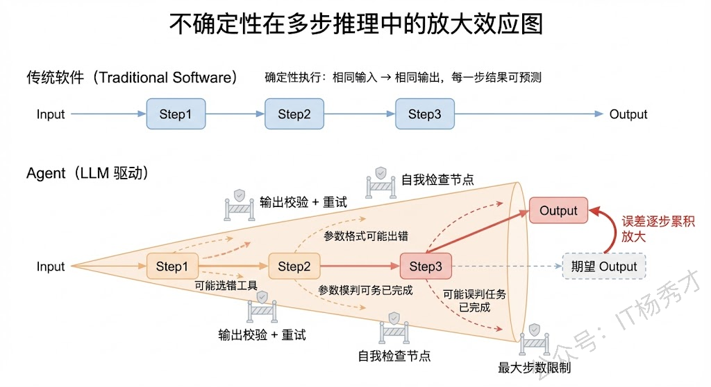
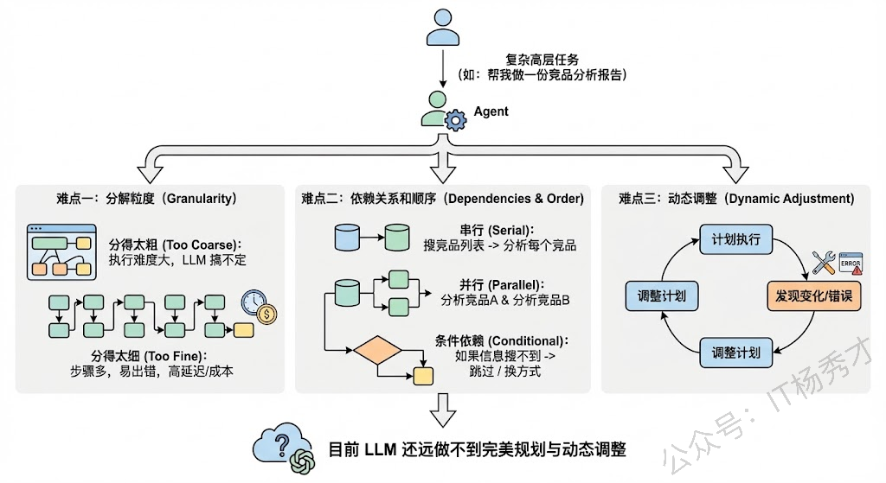
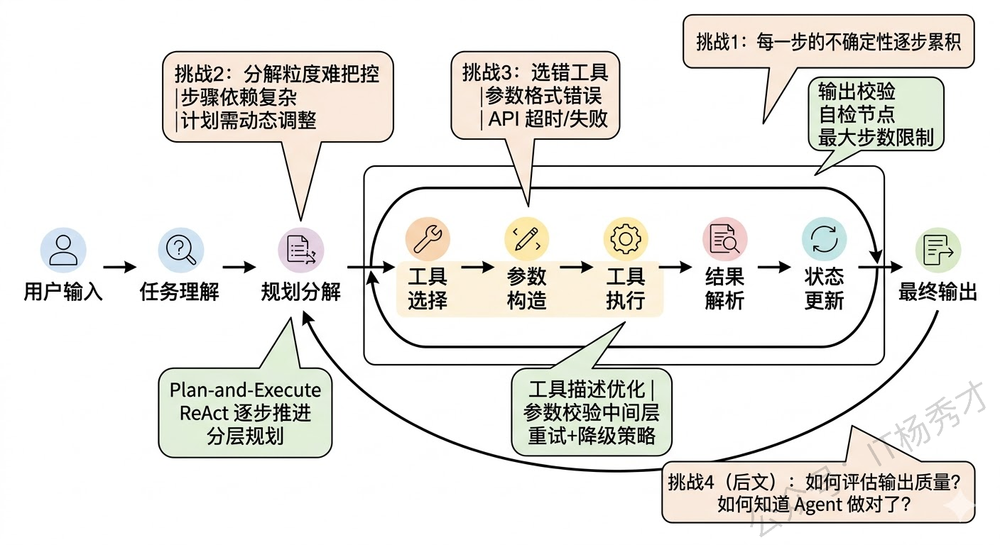
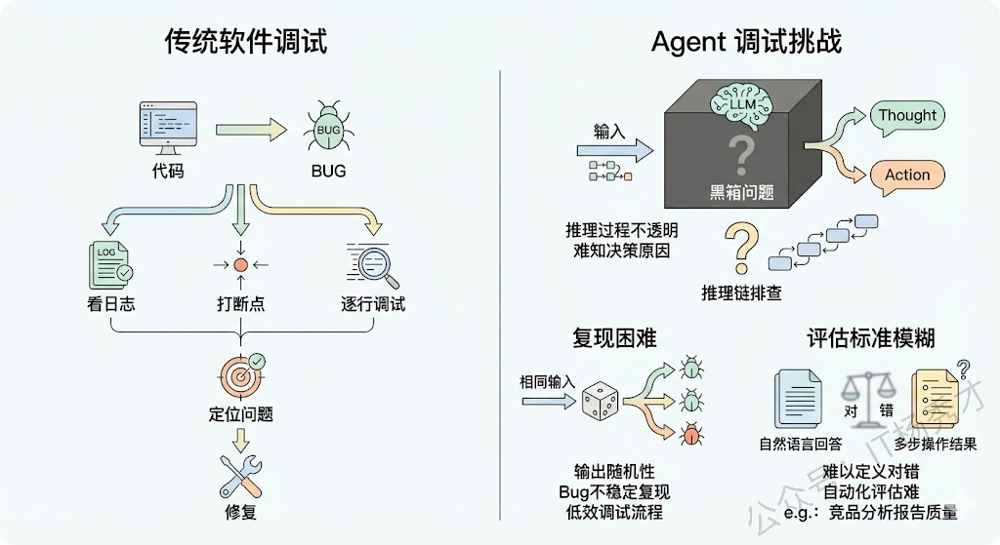
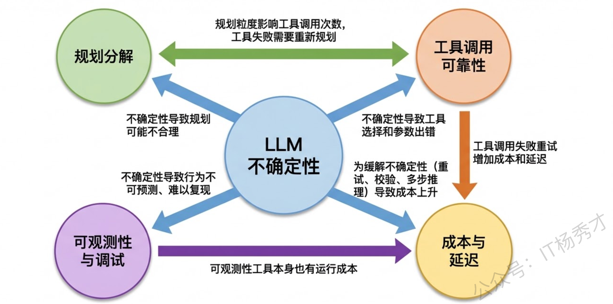

## **1. 题目分析**

这是一道开放性很强的面试题，没有标准答案，但恰恰因为开放，才最能拉开候选人之间的差距。面试官问这个问题，不是想听你背教科书式的"Agent 有感知、规划、记忆、行动四大模块"，而是想听到**你在实际项目中真正踩过的坑、遇到过的痛点、以及你是怎么解决的**。换句话说，这道题的本质是一道"经验题"，它考察的是你对 Agent 工程化落地的深度理解。

一个好的回答策略是：**挑 3-4 个你认为最核心的挑战，每个挑战不仅要说"是什么"，更要说"为什么难"和"怎么缓解"**。这样既展示了问题认知的深度，又展示了解决问题的能力。下面我把实际项目中最常遇到的几大核心挑战逐一拆解。

### **1.1 挑战一：LLM 推理的不确定性**

这是构建复杂 Agent 时最根本、最深层的挑战，所有其他挑战几乎都由它衍生而来。

传统软件是确定性的——给定相同的输入，永远得到相同的输出。你写一个 `if-else` 分支，它每次都会走你预期的那条路。但 Agent 的核心驱动引擎是 LLM，而 LLM 本质上是一个概率模型，它的输出带有随机性。这意味着：**同样的用户输入，同样的工具列表，Agent 这次可能选对了工具，下次可能选错了；这次的参数格式正确，下次可能多了个逗号导致 JSON 解析失败；这次推理了 3 步就完成了任务，下次可能推理了 10 步还在兜圈子。**

这种不确定性在简单的单轮对话场景中可能还能容忍，但在复杂 Agent 中就会被急剧放大。因为 Agent 的执行过程是**多步串联**的——每一步的输出是下一步的输入，如果某一步出了偏差，后面所有步骤都可能在错误的基础上越走越偏。这就像多米诺骨牌效应，一个小错误在多步传播后可能变成完全跑偏的结果。

实际项目中应对这个挑战的手段包括：通过精心设计 Prompt 和 few-shot 示例来约束模型输出的格式和范围；对关键步骤设置**输出校验**，格式不对就重试；在推理链中加入**自我检查**节点，让模型回顾之前的步骤是否合理；设置**最大步数限制**和**超时机制**，防止无限循环。但说实话，这些都只能缓解而不能根治，这就是为什么 Agent 的可靠性始终是整个行业的核心难题。

### **1.2 挑战二：复杂任务的规划与分解**

当用户给 Agent 一个复杂的高层任务时（比如"帮我做一份竞品分析报告"），Agent 需要自己把这个大任务分解成可执行的子步骤，然后按照合理的顺序执行。这个"规划"的能力看起来理所当然，但实际上极其困难。

难点在哪里？首先，**分解粒度很难把控**。分得太粗，每一步的执行难度还是太大，LLM 搞不定；分得太细，步骤太多，一方面增加了出错概率（回到挑战一的多步累积问题），另一方面也增加了延迟和成本。其次，**步骤之间的依赖关系和顺序很复杂**。有些步骤必须串行（先搜索竞品列表，才能分析每个竞品），有些可以并行（同时分析多个竞品），有些还有条件依赖（如果搜不到某个竞品的信息，就跳过或换一种方式获取）。让 LLM 在规划阶段就考虑清楚这些依赖关系，目前的模型还远做不到完美。

最后一个大难点是**动态调整**。现实中计划赶不上变化——Agent 在执行过程中可能发现某个工具不可用了、某个 API 返回了异常结果、或者中间步骤获得了新信息导致原来的计划不再合理。好的 Agent 需要具备"边执行边调整计划"的能力，而不是僵化地按原计划走到底。

实践中常见的策略包括：**Plan-and-Execute 分离**（先让一个 Planner LLM 做全局规划，再让 Executor LLM 逐步执行，执行中可以触发重新规划）；**ReAct 式的逐步推进**（不做全局规划，每一步都根据当前状态决定下一步）；以及**分层规划**（先做粗粒度规划，每个粗步骤再做细粒度规划）。不同策略适合不同类型的任务，没有银弹。

### **1.3 挑战三：工具调用的可靠性与错误处理**

Agent 的能力边界由它能调用的工具决定，但工具调用在实际工程中远比想象中脆弱。

第一个问题是**工具选择错误**。当 Agent 面前有十几个工具时，它可能选错——比如该用精确查询数据库的工具，它却去调了搜索引擎；或者该用计算器算个精确值，它却自己让 LLM 心算。工具描述（Tool Description）的质量直接影响选择准确率，但即使描述写得再好，在工具数量多或场景边界模糊时，误选还是经常发生。

第二个问题是**参数构造错误**。LLM 生成的工具调用参数不一定符合工具的实际要求——日期格式不对、枚举值拼错、必填参数缺失、数值超出范围等等。这些在传统开发中靠类型系统和编译器就能避免的错误，在 LLM 生成的世界里需要额外的**参数校验层**来兜底。

第三个问题是**工具执行失败**。外部 API 可能超时、返回错误码、返回空结果，或者返回了和预期完全不同的数据格式。Agent 需要能够理解这些失败，并做出合理的应对——是重试、换一个工具、还是向用户报告无法完成。

在工程上，通常的做法是建立一个**工具调用中间层**：对 LLM 输出的调用指令做参数校验和类型转换；对工具执行结果做异常捕获和格式规范化；设置单次调用的超时和重试策略；对失败情况生成友好的错误描述反馈给 LLM，让它基于错误信息调整策略。

### **1.4 挑战四：可观测性与调试**

在传统软件中，程序出了 bug，你可以看日志、打断点、逐行调试，定位问题通常不难。但 Agent 的调试是一个完全不同量级的难题。

首先是**黑箱问题**。LLM 的推理过程是不透明的——你能看到它输出了什么 Thought 和 Action，但你很难知道"它为什么做出这个决策"。同样的输入，换一个措辞可能就走了完全不同的路径。这种不可解释性让定位问题变得非常困难：当 Agent 给出了一个错误的结果时，你需要在可能有十几步的推理链中，逐步排查到底是哪一步出了问题、为什么出了问题。

其次是**复现困难**。由于 LLM 输出的随机性，你在调试时遇到的 bug 可能无法稳定复现——同样的输入跑 10 次，可能只有 2 次会触发这个问题。这让传统的"复现 → 定位 → 修复 → 验证"的调试流程变得非常低效。

最后是**评估标准模糊**。传统软件的正确性可以用单元测试精确验证，但 Agent 的输出往往是自然语言的回答或多步操作的结果，怎么定义"对"和"错"本身就是一个难题。比如 Agent 帮你写了一份竞品分析报告，怎么自动化地评估这份报告的质量？内容是否准确？分析是否有深度？结论是否合理？这些都很难用确定性的测试用例来覆盖。

工程上的应对方案包括：使用 **LangSmith、LangFuse** 等可观测性平台来记录 Agent 每一步的详细链路（Trace）——包括每次 LLM 的输入输出、工具调用的参数和结果、耗时和 token 消耗等；建立**基于 LLM 的评估体系**（LLM-as-Judge），用另一个 LLM 来评估 Agent 输出的质量；构建**回归测试集**，积累典型的 case 定期跑评估，确保改动不会导致整体效果下降。

### **1.5 挑战五：成本与延迟的平衡**

前面的挑战偏技术，这个挑战偏工程和商业。在生产环境中，Agent 的每一次 LLM 调用都有真金白银的 token 成本和实实在在的延迟。

一个复杂 Agent 完成一次任务可能需要 5-15 次 LLM 调用，每次调用还可能带上大量的上下文历史和工具定义，token 消耗动辄上万。如果再加上 RAG 检索、重试机制等，一次任务的总成本可能远超预期。在 B2C 场景中（比如面向大量终端用户的 AI 助手），这个成本乘以请求量就是一笔不可忽视的开支。

延迟同样是痛点。用户问一个问题，Agent 可能需要十几秒才能给出最终结果（多步推理 + 多次工具调用），这在很多对响应速度有要求的场景中是不可接受的。

应对这个挑战的策略包括：**按任务复杂度分级路由**——简单任务直接用小模型一步回答，复杂任务才走完整 Agent 流程；**缓存**——对相同或相似的子任务结果做缓存，避免重复调用；**并行化**——把可以并行的工具调用同时执行（Function Calling 的 parallel tool calls）；以及**流式输出（Streaming）**——在 Agent 推理过程中就逐步将中间结果流式返回给用户，降低用户的感知等待时间。

## **2. 参考回答**

我在实际构建复杂 Agent 的过程中，感受最深的挑战可以归纳为五个层面，它们都围绕一个核心根源展开。

**最根本的挑战是 LLM 推理的不确定性**，传统软件是确定性执行，但 Agent 的每一步都由概率模型驱动，同样的输入可能产生不同的输出。这在复杂 Agent 中会被急剧放大——因为是多步串联执行，某一步的小偏差会在后续步骤中累积放大，像多米诺骨牌一样导致最终结果完全跑偏。基于这个根源，衍生出四大实战挑战。

**第一是任务规划与分解**，让 Agent 把一个高层任务合理拆解成可执行的子步骤非常困难，分解粒度、步骤间的依赖关系、以及执行中的动态调整都是难点，实践中我们常用 Plan-and-Execute 分离或 ReAct 逐步推进来应对。

**第二是工具调用的可靠性**，包括选错工具、参数格式错误、API 超时等问题，工程上需要建一个工具调用中间层来做参数校验、异常捕获和重试降级。

**第三是可观测性和调试**，Agent 的推理链路长且不可复现，传统的日志打断点根本不够用，必须建设系统化的 Trace 链路追踪体系，配合 LLM-as-Judge 自动化评估和回归测试集来保障质量，LangSmith、LangFuse 这些工具在这方面帮助很大。

**第四是成本和延迟**，一次复杂任务可能涉及十几次 LLM 调用，在生产环境中 token 成本和响应延迟是硬约束，需要通过任务分级路由、子任务缓存、并行工具调用和流式输出来优化。

这五个挑战互相关联，核心思路就是**在 LLM 不确定性的基础上，通过工程手段构建尽可能确定和可控的系统行为**。

## **学习交流**

> 如果您觉得文章有帮助，可以关注下秀才的<strong style="color: red;">公众号：IT杨秀才</strong>，后续更多优质的文章都会在公众号第一时间发布，不一定会及时同步到网站。点个关注👇，优质内容不错过

