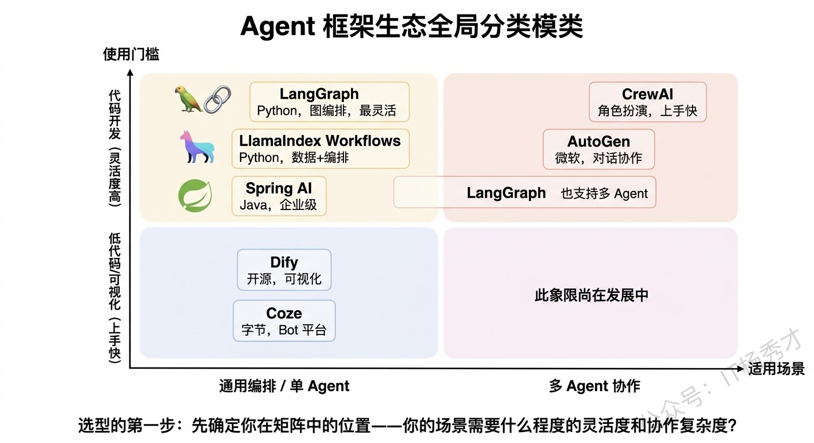
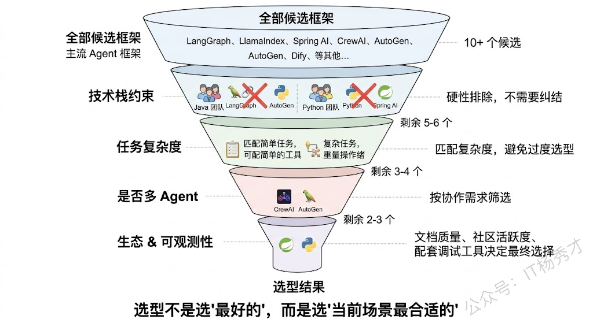
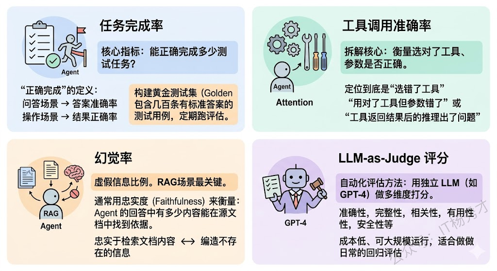
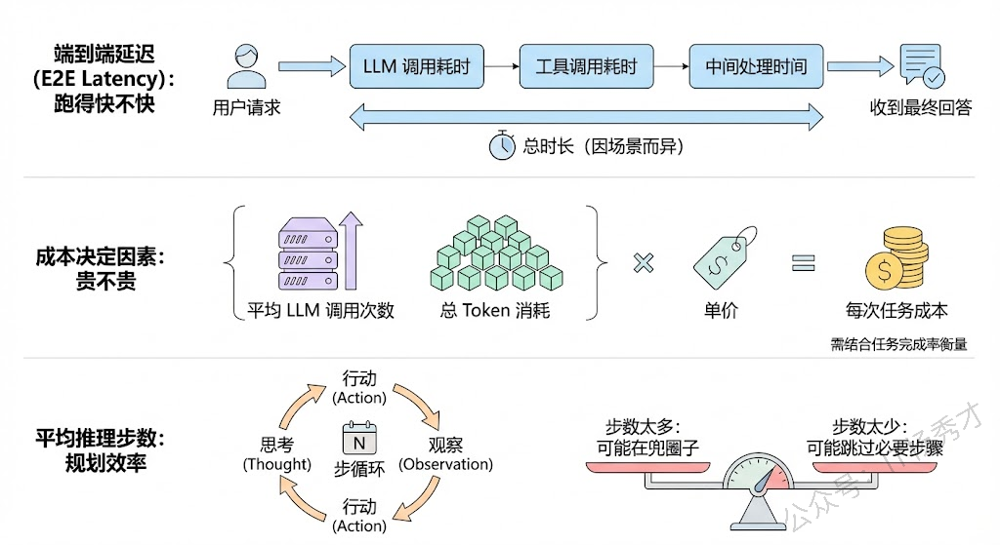
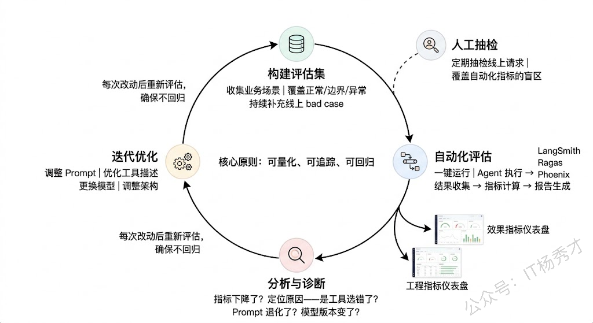

## **1. 题目分析**

这是一道典型的"经验拷打问题"，三个子问题层层递进：用过什么→怎么选的→怎么评判好坏。面试官不是在考你能列出多少框架名字，而是在判断你有没有**真正在生产项目中经历过从选型到落地到评估的完整闭环**。很多候选人能把框架功能背得滚瓜烂熟，但一问"为什么在你的场景中选了这个而不是那个"就卡壳了——因为他没真选过。所以这道题的核心是：**用真实的项目经验把选型决策过程和评估体系讲通**，展示出你做过、踩过坑、有自己的判断标准。

### **1.1 主流 Agent 框架速览**

在回答"用过什么"之前，先建立一个全局视角——当前 Agent 框架生态长什么样，每个框架的核心定位是什么。只有知道全局，才能说清楚"我为什么选了这几个"。

当前主流的 Agent 框架大致可以分为三个阵营：

1. **通用编排类**是最大的一个阵营。LangChain 是这个领域的先行者，通过 Chain 和 Agent 的概念把 LLM 应用的构建流程化了；但它真正推荐用于生产的是 **LangGraph**，把线性的 Chain 升级为有向图编排，支持条件分支、循环、人机审批等复杂流程控制。**LlamaIndex** 虽然以数据索引起家，但它的 Workflows 也在做通用编排的事。**Spring AI**（以及 Spring AI Alibaba）是 Java 生态的选择，它把 Agent 能力整合进了 Spring 框架，对企业级 Java 项目非常友好。

2. **多 Agent 协作类**是第二个阵营营。**CrewAI** 用角色扮演的方式定义 Agent 团队，Sequential 和 Hierarchical 两种协作模式开箱即用，上手极快。**AutoGen**（微软）侧重多 Agent 对话和群聊模式。这类框架的核心价值是让多个 Agent 分工协作变得简单。

3. **低代码/平台类**是第三个阵营。**Dify** 和 **Coze** 提供了可视化的 Agent 搭建界面，拖拽式编排，适合快速原型验证或非开发人员使用。

### **1.2 框架选型方法论**

框架选型不是比谁功能多、谁 Star 数高，而是要基于**你的具体场景需求**来做匹配。我在实际项目中形成了一套选型决策方法，核心是沿着几个关键维度逐一排除，最终收敛到 1-2 个候选。

**第一个维度：技术栈约束。** 这往往是最先排除一大批框架的硬性条件。如果你的团队和项目是 Java 技术栈，LangChain、CrewAI 这些纯 Python 框架基本就排除了，Spring AI 成了首选。如果是 Python 技术栈，选择面就宽得多。这一步不需要做技术对比，纯粹是工程现实决定的。

**第二个维度：任务复杂度。** 你的 Agent 需要处理的是简单的"问答+工具调用"任务，还是涉及多步推理、条件分支、人工审批的复杂流程？如果是前者，一个简单的 ReAct Agent 就够了，LangChain 的基础 Agent 甚至直接用模型的 Function Calling 就能搞定，不需要上 LangGraph 这种重量级编排框架。如果是后者，LangGraph 的图编排能力就非常必要了。**过度选型和选型不足一样有害**——用 LangGraph 来做一个简单的问答 Agent，是杀鸡用牛刀，增加了不必要的复杂度。

**第三个维度：是否需要多 Agent 协作。** 如果任务确实复杂到需要多个角色分工协作，那就要考虑 CrewAI、AutoGen 或 LangGraph 的多 Agent 能力。如果角色分工明确、协作模式固定（流水线或层级），CrewAI 是最快的选择；如果协作流程高度定制、有复杂的条件路由，LangGraph 更灵活。

**第四个维度：生态成熟度和社区活跃度。** 这在实际项目中非常重要但容易被忽视。框架的文档质量、社区活跃度、Issue 响应速度、版本迭代频率，直接影响你遇到问题时能不能快速解决。LangChain/LangGraph 在这方面有绝对优势——文档最全、社区最大、第三方集成最多。而一些较新的框架虽然设计理念很好，但文档缺失、社区小众，踩坑时可能得靠自己读源码。

**第五个维度：可观测性和调试支持。** Agent 的调试是出了名的难，框架有没有配套的 Trace 和调试工具直接影响开发效率。LangChain 有 LangSmith，LlamaIndex 有 Phoenix（Arize），这些配套工具能大幅降低调试成本。没有配套可观测性工具的框架，意味着你要自己建设这部分能力。

### **1.3 Agent 场景的评价指标**

这是这道题中最体现深度的部分。很多人做 Agent 做到"能跑了"就觉得完事了，但真正生产级的 Agent 必须有一套明确的**量化评价指标**来衡量"跑得好不好"。Agent 的评价指标可以分为**效果指标**和**工程指标**两大类。

1. **效果指标**衡量的是 Agent "做得对不对、好不好"：

**任务完成率（Task Completion Rate）** 是最核心的效果指标。给定一批测试任务，Agent 能正确完成多少？这里"正确完成"的定义需要结合具体场景——对于问答场景是答案准确率，对于操作场景是操作结果的正确率。实际项目中我们通常会构建一个**黄金测试集**（Golden Test Set），包含几百条有标准答案的测试用例，定期跑评估。

**工具调用准确率（Tool Selection Accuracy）** 衡量 Agent 是否选对了工具、参数是否正确。这个指标拆得比任务完成率更细——即使最终结果是错的，通过分析工具调用准确率可以定位到底是"选错了工具"还是"用对了工具但参数错了"还是"工具返回结果后的推理出了问题"。

**幻觉率（Hallucination Rate）** 衡量 Agent 输出中包含虚假信息的比例。特别是在 RAG 场景中，这个指标非常关键——Agent 是忠实于检索到的文档内容，还是自己编造了不存在的信息？通常用**忠实度（Faithfulness）** 来衡量：Agent 的回答中有多少内容能在源文档中找到依据。

**LLM-as-Judge 评分** 是一种越来越流行的自动化评估方法。用一个独立的 LLM（通常用最强的模型如 GPT-4）来对 Agent 的输出做多维度打分——准确性、完整性、相关性、有用性、安全性等。虽然不如人工评估精确，但成本低、可大规模运行，适合做日常的回归评估。

* **工程指标**衡量的是 Agent "跑得快不快、贵不贵"：

**端到端延迟（E2E Latency）** 是从用户发出请求到收到最终回答的总时长。这包括了所有 LLM 调用耗时、工具调用耗时、以及中间的处理时间。用户能接受的延迟因场景而异——客服场景可能 10 秒以内，后台分析任务可能几分钟都行。

**平均 LLM 调用次数和总 Token 消耗** 直接决定了成本。一个 Agent 完成一次任务平均调用几次 LLM？总共消耗多少 token？乘以单价就是每次任务的成本。这个指标需要和任务完成率一起看——如果降低调用次数会导致任务完成率大幅下降，那就说明当前的调用次数是必要的。

**平均推理步数** 衡量 Agent 完成任务需要多少步 Thought-Action-Observation 循环。步数太多说明 Agent 的规划效率不高，可能在兜圈子；步数太少可能说明 Agent 跳过了必要的推理步骤。

### **1.4 评估实践**

有了指标定义还不够，还需要知道**怎么落地评估**。实际项目中的评估流程通常是这样的：

首先是**构建评估数据集**。根据业务场景收集或构造一批有代表性的测试用例，每条用例包含输入（用户问题/任务描述）和期望输出（标准答案或期望的操作序列）。数据集需要覆盖正常场景、边界场景和异常场景。这个数据集需要持续维护和扩展——每次发现线上的 bad case 都应该加入数据集。

然后是**自动化评估流水线**。把评估数据集、Agent 执行、结果收集、指标计算、报告生成串成一条自动化流水线，可以一键运行。每次改动 Prompt、工具定义、框架版本后，都跑一遍评估，确保没有回归。LangSmith、Ragas、Phoenix 等工具都支持这种自动化评估流水线。

最后是**人工抽检**作为兜底。自动化指标覆盖不到的质量维度（比如回答的语气是否合适、建议是否具有可操作性），需要定期做人工抽检。通常按比例抽取线上真实请求做人工评估，形成一个"人工评估报告"，和自动化指标一起作为 Agent 质量的全面评判。

## **2. 参考回答**

我在实际项目中主要用过 **LangGraph** 和 **Spring AI Alibaba** 这两个框架，另外对 CrewAI 和 LlamaIndex 做过技术调研和 POC 验证。

选型的过程。**第一步是看技术栈约束**，我们的核心系统是 Java 微服务架构，所以 Spring AI Alibaba 是企业级场景的首选，它把 Agent、Function Calling、RAG 等能力整合进了 Spring 生态，和现有系统集成成本最低。但部分 AI 密集型的子模块我们用 Python 实现，这里选了 LangGraph——因为我们的 Agent 流程涉及多步推理、条件分支和人工审批节点，LangGraph 的有向图编排能力可以精确控制每一步的流转逻辑，这是 CrewAI 这种固定模式框架做不到的。**第二步看生态成熟度**，LangGraph 配套的 LangSmith 在链路追踪和评估方面帮助很大，省了我们自建可观测性平台的工作。

至于**评价指标**，我们分效果和工程两个维度来建。效果维度最核心的是**任务完成率**，我们构建了一个包含 500+ 条用例的黄金测试集，覆盖正常、边界和异常场景，每次改动都跑回归。更细粒度的指标包括工具调用准确率——拆开看是选错了工具还是参数错了还是后续推理出了问题，这对定位瓶颈非常有帮助。在 RAG 场景下我们重点关注忠实度和幻觉率，用 Ragas 做自动化评估。同时用 LLM-as-Judge 做多维度打分（准确性、完整性、安全性）作为日常回归评估。工程维度主要看端到端延迟、平均 LLM 调用次数和总 Token 消耗，这些直接决定用户体验和成本。最终选型和优化都是在**效果和成本之间找平衡**——不是追求指标越高越好，而是在业务可接受的成本范围内把效果做到最优。

## **学习交流**

> 如果您觉得文章有帮助，可以关注下秀才的<strong style="color: red;">公众号：IT杨秀才</strong>，后续更多优质的文章都会在公众号第一时间发布，不一定会及时同步到网站。点个关注👇，优质内容不错过

