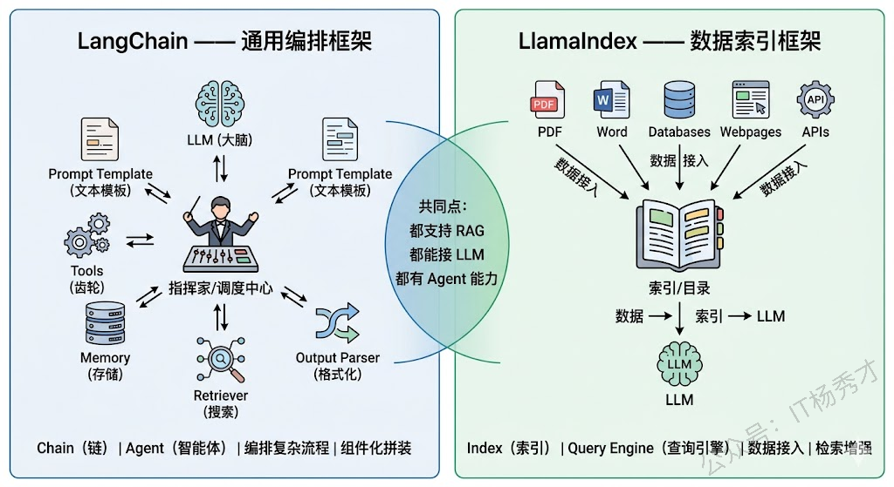
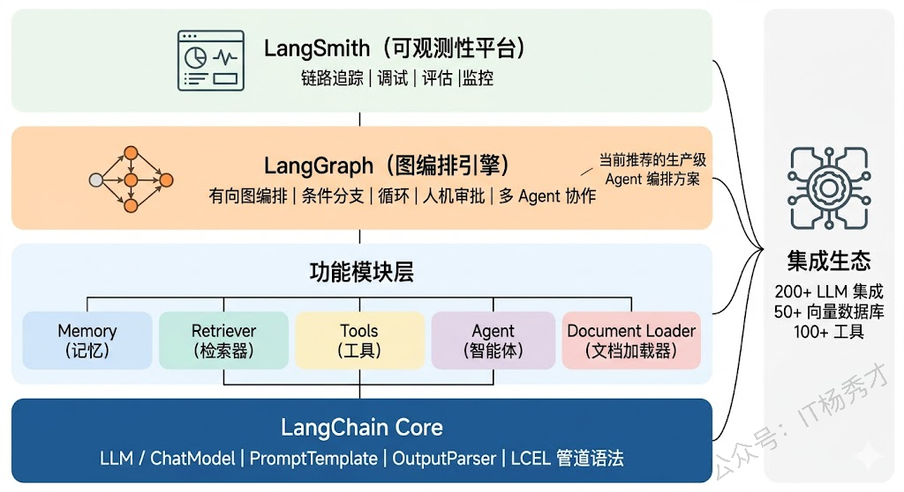
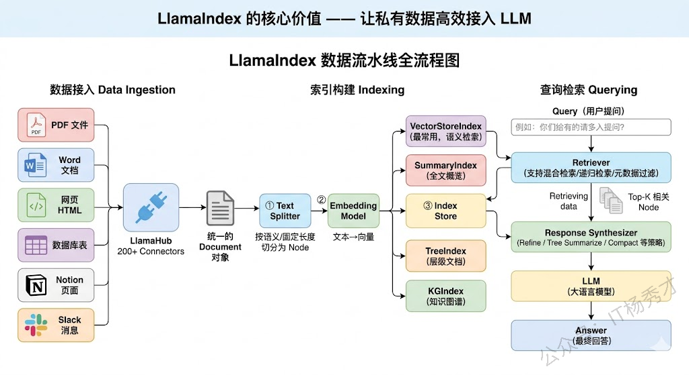
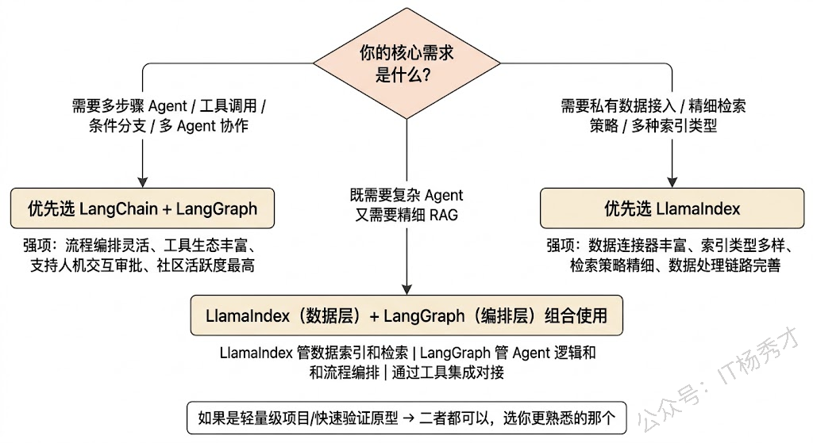
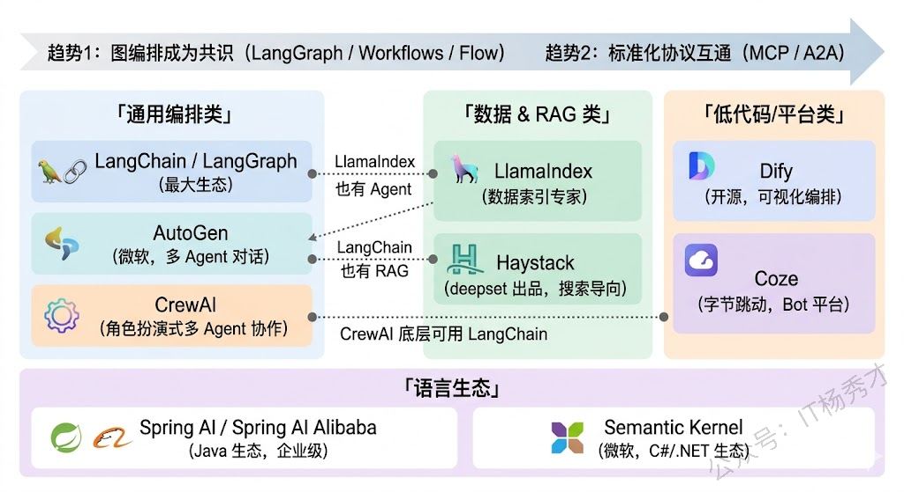

## **1. 题目分析**

这道题从表面上看是在问两个框架的区别，但其实你要搞清楚的是两个问题：**你在实际项目中做过技术选型吗？你知道什么场景该用什么框架吗？** 如果你只是把两个框架的功能列表背一遍，那只能证明你看过文档。而你真正要体现出来的是："我用过、我踩过坑、我知道各自擅长什么不擅长什么"的实战感。

所以答题的核心策略是：先讲清楚两个框架的**设计思想和核心定位**差异，然后通过具体场景来说明什么时候选谁，最后提一下它们各自的演进方向和当前生态中的一些其他的框架

### **1.1 通用编排 vs 数据索引**

在深入对比之前，先用一句话给两个框架定位，建立最核心的直觉：

**LangChain 是一个通用的 LLM 应用编排框架**，它的核心能力是把 LLM、Prompt、工具、记忆、外部数据源等各种组件像"乐高积木"一样组合在一起，构建复杂的 LLM 应用流程。它的关键词是**编排**和**链**。

**LlamaIndex 是一个专注于数据索引和检索的框架**，它的核心能力是帮你把各种格式的私有数据（文档、数据库、API 等）高效地接入 LLM，让 LLM 能基于你的私有数据来回答问题。它的关键词是**索引**和**检索**。

> 举个例子：如果你要开一家餐厅，LangChain 就像一个全能的厨房管理系统——它帮你设计菜品的制作流程（调用链）、协调不同厨师（工具）、管理食材储备（记忆），整个烹饪流程由它来编排。而 LlamaIndex 更像一个专业的食材供应链系统——它专注于帮你把各种原材料（数据）清洗、分类、存储，并在需要时快速精准地找到你要的食材（检索）。

这个核心定位差异，决定了后面几乎所有具体功能和场景上的不同。

### **1.2 LangChain 解析**

LangChain 最初（2022 年底）以 "Chain"（链）的概念出名——把多个 LLM 调用或操作串成一条链来执行。比如一个简单的 Chain 可能是：用户输入 → Prompt 模板填充 → LLM 调用 → 输出解析。后来随着 Agent 概念的火爆，LangChain 又加入了 Agent、Tool、Memory 等模块，逐渐演变成了一个大而全的 LLM 应用开发工具箱。

LangChain 的核心组件包括几个层次：

最底层是 **LangChain Core**，定义了 LLM、ChatModel、Prompt、OutputParser 等基础抽象，以及 LCEL（LangChain Expression Language）这种声明式的链编排语法。LCEL 允许你用类似 `prompt | llm | parser` 这样的管道语法来定义处理流程，写起来很简洁。

中间层是各种**功能模块**——Memory（对话记忆管理）、Retriever（检索器，对接各种向量数据库）、Tool（工具定义和调用）、Agent（自主决策和执行）等。这些模块可以灵活组合，构建出各种复杂的应用。

最上层是 **LangGraph**，这是 LangChain 团队在 2024 年重点推出的新一代编排框架。LangGraph 把 LangChain 早期线性的 Chain 模式升级为**有向图（Graph）** 模式，允许你定义节点（Node）和边（Edge），支持条件分支、循环、并行执行等复杂的控制流。这对于需要多步推理、人机交互审批、多 Agent 协作等复杂场景来说非常有用。可以说 LangGraph 才是 LangChain 生态中当前真正推荐用于生产环境的 Agent 编排方案。

LangChain 的优势在于**生态极其丰富**。它通过 `langchain-community` 和各种集成包，支持了几乎所有主流的 LLM（OpenAI、Anthropic、通义千问、智谱等）、向量数据库（Milvus、Chroma、Pinecone 等）、工具和 API。对于开发者来说，想对接什么基本都能找到现成的集成。

但 LangChain 的劣势也很明显：**抽象层次多，学习曲线陡**。它的概念太多了——Chain、Agent、AgentExecutor、Tool、ToolKit、Memory、Retriever、LCEL、LangGraph……新手很容易在这些概念中迷失。而且早期版本 API 变动频繁，社区中"LangChain 过度抽象"的批评声也不少。不过到了 LangGraph 时期，架构已经清晰很多。

### **1.3 LlamaIndex 解析**

LlamaIndex（最初叫 GPT Index）从诞生之日起就有一个非常清晰的使命：**让 LLM 能用上你的私有数据**。它的整个设计都围绕"数据接入 → 索引构建 → 查询检索"这条主线展开。

LlamaIndex 的核心流程可以分为三个阶段：

> 第一阶段是**数据接入（Data Ingestion）**。LlamaIndex 提供了极其丰富的数据连接器（Data Connector），也叫 Reader，能从各种数据源加载数据——PDF、Word、HTML、Markdown、数据库、Notion、Slack、GitHub 等等。通过 **LlamaHub**（类似于一个数据连接器的应用商店），社区贡献了数百个开箱即用的 Reader。加载进来的数据会被统一抽象为 **Document** 对象。

> 第二阶段是**索引构建（Indexing）**。Document 对象会经过文本分割（Chunking）、Embedding 向量化等处理，然后存入索引结构中。LlamaIndex 支持多种索引类型，最常用的是 **VectorStoreIndex**（向量索引），此外还有 **SummaryIndex**（摘要索引，适合需要全文概览的场景）、**TreeIndex**（树状索引，适合层级结构的文档）、**KnowledgeGraphIndex**（知识图谱索引）等。不同的索引类型对应不同的检索策略，这是 LlamaIndex 区别于其他框架的核心特色。

> 第三阶段是**查询检索（Querying）**。这是用户实际使用的环节。LlamaIndex 提供了 **QueryEngine**（查询引擎）来处理用户的问题——它先用 Retriever 从索引中检索出最相关的文档片段，然后把这些片段连同用户的问题一起发给 LLM，让 LLM 基于检索到的真实数据来生成回答。这就是完整的 RAG 流程。

LlamaIndex 在数据处理和检索方面的深度是 LangChain 难以匹敌的。举几个例子：它支持**多种高级检索策略**，如混合检索（向量 + 关键词）、递归检索（先检索摘要再钻取细节）、基于元数据的过滤检索等；它的 **Node** 概念（文档被分割后的基本单元）比 LangChain 的 Document 更精细，支持 Node 之间的父子关系和引用关系；它还提供了 **Response Synthesizer**（响应合成器），支持多种将检索结果组合成回答的策略，如逐块精炼（Refine）、树状摘要（Tree Summarize）等。

但 LlamaIndex 在通用编排方面就相对弱一些了。虽然它后来也加入了 Agent 能力，甚至推出了 **LlamaIndex Workflows**（工作流编排）来对标 LangGraph，但整体的编排灵活性和工具生态丰富度还是不如 LangChain。

### **1.4 核心场景差异**

理解了两个框架的设计思想后，场景选型就变得清晰了：

**优先选 LangChain / LangGraph 的场景**——当你的核心需求是构建一个**复杂的多步骤 Agent**，需要编排多个工具调用、处理复杂的条件分支和循环逻辑、或者需要多个 Agent 协作完成任务时。比如：一个客服 Agent 需要先判断用户意图，然后根据意图路由到不同的处理子流程（查订单、退货、投诉），每个子流程又涉及不同的工具调用和人工审批节点——这种复杂编排场景是 LangGraph 的强项。

**优先选 LlamaIndex 的场景**——当你的核心需求是**基于私有知识库做问答**，也就是 RAG 场景。特别是当你的数据量大、数据格式多样、对检索精度和策略有精细控制需求时。比如：你要给企业内部搭建一个知识库问答系统，需要从上千份 PDF 报告、Wiki 文档、数据库表中检索信息来回答专业问题——LlamaIndex 在数据加载、切片策略、索引类型选择、检索策略调优方面提供了远比 LangChain 更丰富的选项。

**两者结合使用**也是实际项目中非常常见的模式。用 LlamaIndex 来构建和管理数据索引层（负责"数据怎么存、怎么检索"），用 LangChain/LangGraph 来编排上层的 Agent 逻辑（负责"检索到数据后怎么用、怎么和其他工具配合"）。LangChain 本身就提供了对 LlamaIndex QueryEngine 的集成，可以把 LlamaIndex 的查询引擎作为 LangChain Agent 的一个工具来调用。

### **1.5 Agent框架生态**

面试中如果能顺带提一下当前生态的全貌和趋势，会是一个很好的加分项。

除了 LangChain 和 LlamaIndex 这两个老牌框架，近两年还涌现了一些值得关注的新框架：**CrewAI** 专注于多 Agent 协作场景，提供了 Role-Based 的 Agent 定义方式，让多个 Agent 像团队成员一样分工合作；**AutoGen**（微软出品）同样聚焦多 Agent 对话和协作；**Dify** 和 **Coze** 则走了低代码/可视化的路线，让非开发者也能通过拖拽的方式搭建 Agent 应用。

在 Java 生态中，**Spring AI** 是一个重要的选手，它把 LLM 调用、Prompt 管理、Function Calling、RAG 等能力整合进了 Spring 框架体系，对 Java 开发者来说上手门槛更低。**Spring AI Alibaba** 进一步集成了通义千问等国内模型，在国内企业级 Java 项目中很有竞争力。

从趋势上看，这些框架都在往两个方向收敛：一是**图编排**（LangGraph、LlamaIndex Workflows、CrewAI 的 Flow），用有向图来定义复杂的 Agent 流程成为共识；二是**标准化协议**（MCP、A2A 等），让不同框架的组件能够互通互用，降低绑定效应。

***

## **2. 参考回答**

LangChain 和 LlamaIndex 虽然功能有重叠，但**核心定位有本质区别**。

LangChain 是一个通用的 LLM 应用编排框架，核心能力是把 LLM、工具、记忆、数据等组件灵活组合起来构建复杂的应用流程，关键词是"编排"——特别是它后来推出的 LangGraph，用有向图来定义 Agent 的执行流程，支持条件分支、循环、并行和人机审批，是目前做复杂多步骤 Agent 的首选方案。

而 LlamaIndex 的核心定位是数据索引和检索，它的整个设计围绕"数据接入 → 索引构建 → 查询检索"这条主线展开，在数据连接器的丰富度、索引类型的多样性（向量索引、摘要索引、树索引、知识图谱索引等）、以及检索策略的精细度（混合检索、递归检索、元数据过滤等）方面比 LangChain 深入得多。

所以在**实际选型**中，如果核心需求是构建复杂 Agent 流程——比如一个客服系统需要意图识别、多分支路由、多工具调用和审批节点——优先用 LangChain + LangGraph；如果核心需求是基于私有知识库做 RAG 问答，数据量大格式多样、对检索精度有精细要求——优先用 LlamaIndex。

实际项目中两者经常**组合使用**，LlamaIndex 负责底层的数据索引和检索，LangGraph 负责上层的 Agent 编排逻辑，LlamaIndex 的 QueryEngine 直接作为 LangChain Agent 的一个工具来调用。另外值得一提的是，当前 LLM 框架生态还在快速发展，除了这两个框架之外，Java 生态有 Spring AI，多 Agent 协作有 CrewAI，低代码方向有 Dify，整体趋势是向图编排和标准化协议（MCP）方向收敛。
