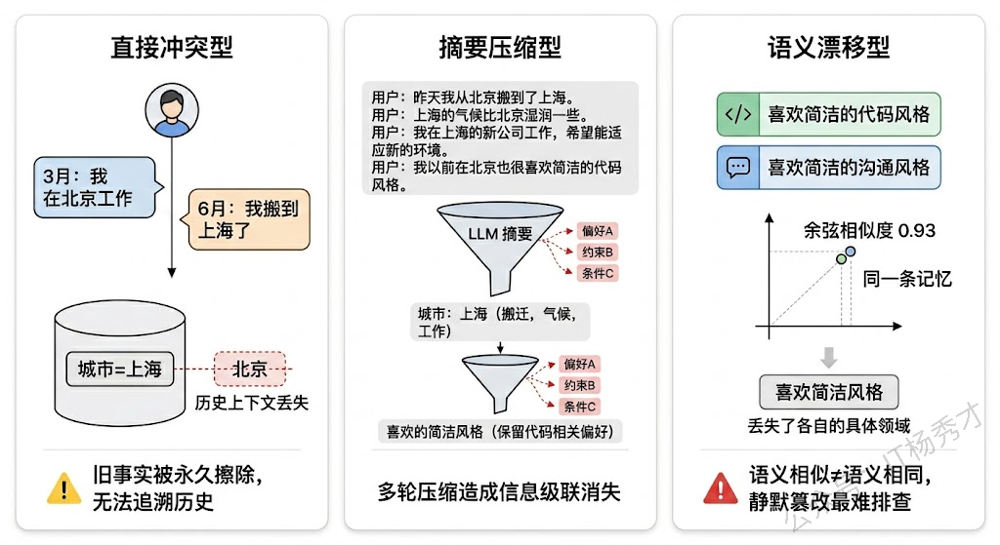
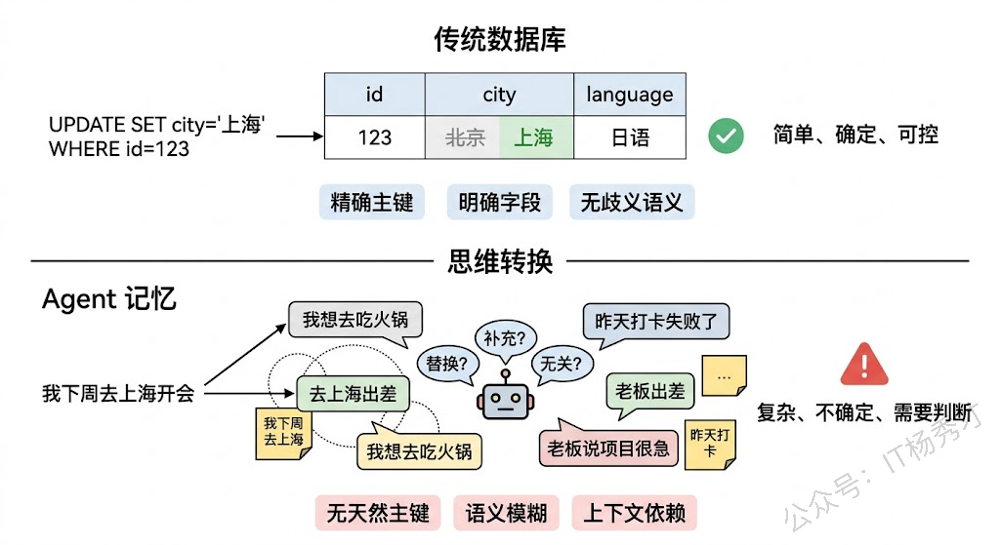
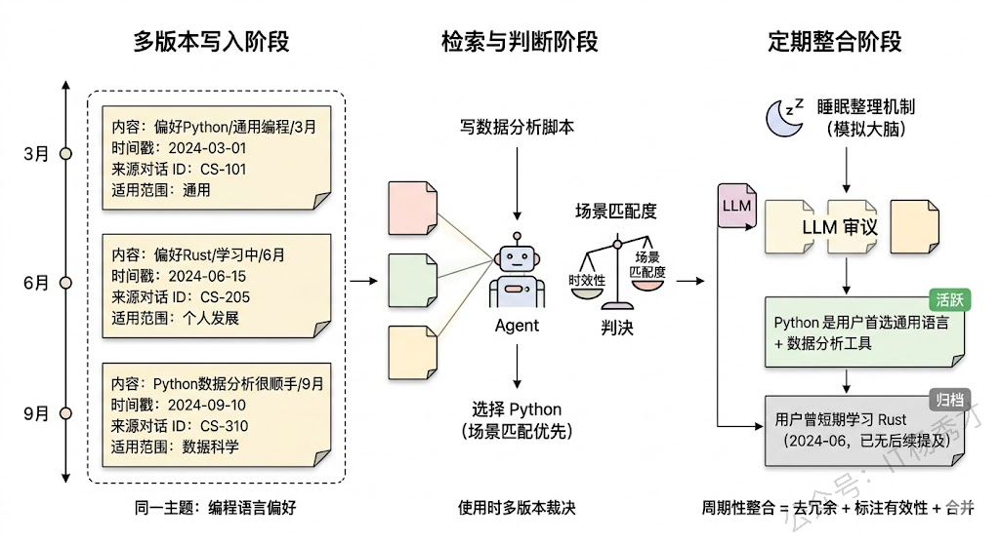
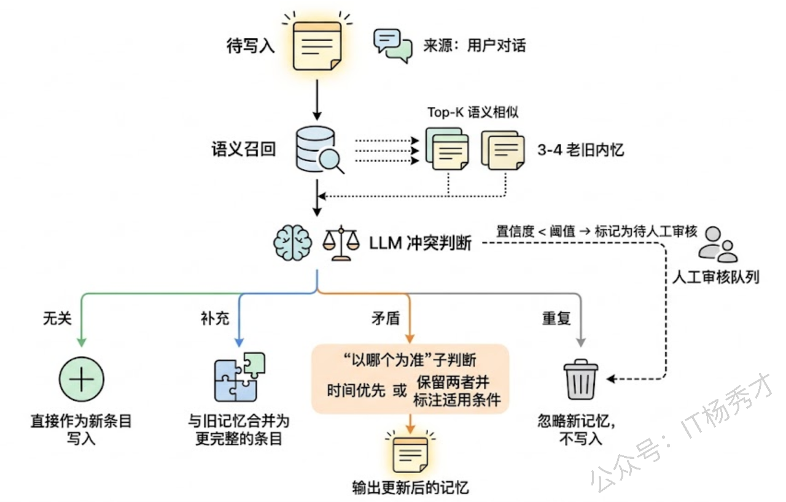
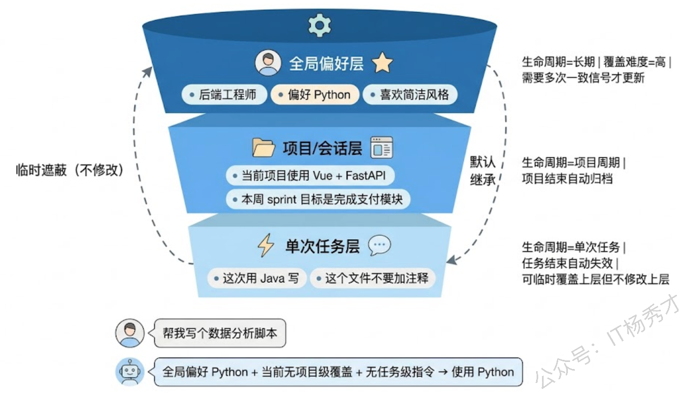
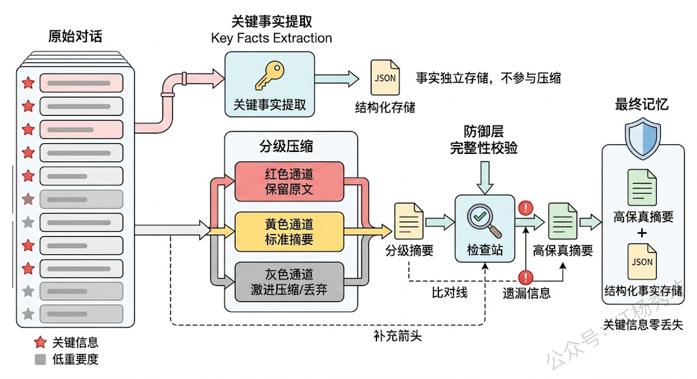

## **1. 题目分析**

比如你今天说"以后帮我写代码都用 Python"，三个月后说"我最近在学 Rust，代码用 Rust 写吧"。如果 Agent 的长期记忆里只存了一条"用户偏好的编程语言"，新记忆直接把旧的盖掉了——这看起来没什么问题，对吧？但如果你下次说"帮我写个数据分析脚本"，那么Agent 又会用 Rust 去写，但是数据分析明明 Python 更合适，Agent为什么不记得我之前说过用 Python呢？

这就是记忆覆盖问题的典型问题：**新信息和旧信息之间不是简单的替换关系，而是一种需要理解语境、判断适用范围的选择。** 传统数据库的 UPDATE 操作是精确的——你明确知道要改哪个字段、改成什么值。但 Agent 的记忆是自然语言描述的、充满歧义的、依赖上下文的，你很难用一条简单的规则来决定"该覆盖还是该保留"。

这道题考察的就是你对 Agent 记忆系统的理解深度。能把记忆覆盖的根因、场景和解决方案讲清楚的人，一定是真正在生产环境中和记忆系统搏斗过的。

### **1.1 记忆覆盖到底覆盖了什么**

要解决问题先得看清问题。记忆覆盖并不是一个单一的故障模式，它至少包含三种不同的场景，每种场景背后的机制和应对策略都不一样。

> **第一种是"直接冲突型覆盖"。** 这是最容易理解的情况：用户在不同时间点给出了互相矛盾的信息。比如先说"我在北京工作"，后来又说"我搬到上海了"。这里的旧记忆确实应该被更新，但问题是——完全丢弃旧信息合理吗？也许 Agent 将来需要知道"用户曾在北京工作过"这个历史事实来做更好的推荐。直接覆盖意味着永久丢失了历史上下文。

> **第二种是"摘要压缩型覆盖"。** 当对话历史太长、需要通过 LLM 压缩成摘要时，压缩本身就是一种有损操作。一段十轮的对话里可能藏着三四个重要细节，但摘要只保留了最显眼的一两个，其余的被"压"没了。更隐蔽的是，多次压缩会产生级联丢失——第一次摘要丢了细节 A，第二次摘要在第一次的基础上又丢了细节 B，几轮下来，原始对话中的关键信息可能被彻底抹平。

> **第三种是"语义漂移型覆盖"。** 这是最难察觉也最危险的一种。Agent 在写入新记忆时，用 Embedding 做语义匹配发现已有一条相似的旧记忆，系统判定它们是"同一条"，于是用新的替换旧的。但"语义相似"不等于"语义相同"——"用户喜欢简洁的代码风格"和"用户喜欢简洁的沟通风格"语义很接近，向量距离可能很短，但它们说的完全不是同一件事。一旦被错误合并，后果就是 Agent 的行为开始出现莫名其妙的偏差，而且极难排查，因为出问题的不是代码逻辑，而是记忆内容本身被悄悄篡改了。

### **1.2 为什么传统数据库思维在这里失效**

理解了覆盖的类型，我们需要搞清楚一个更根本的问题：为什么 Agent 的记忆更新不能像传统数据库那样做个 UPDATE 就完事？

传统数据库的更新依赖于两个前提：**明确的主键**和**确定的语义**。当你执行 `UPDATE users SET city='上海' WHERE id=123` 时，你精确地知道要更新哪条记录（主键 id=123）、更新什么字段（city）、新值是什么（上海），整个操作的语义毫无歧义。

但 Agent 的记忆不具备这两个前提。首先，自然语言记忆没有天然的"主键"。"用户喜欢 Python"这条记忆，它的 key 是什么？是"编程语言偏好"？还是"技术栈偏好"？还是"工具偏好"？不同的抽象层级会导致完全不同的更新行为。其次，自然语言的语义天然是模糊的、依赖上下文的。"我不想用 Java 了"——这是说"永远不用"还是"这个项目不用"？是"讨厌 Java"还是"这个场景不合适"？这种语义模糊性让系统很难自动判断新旧记忆之间的关系到底是"替换"、"补充"还是"完全无关"。

这就是记忆覆盖问题的深层根因：**我们试图用确定性的存储系统来管理本质上不确定的语义信息，而连接这两个世界的桥梁——语义理解——本身就不完美。**

### **1.3 记忆版本化**

既然直接覆盖会丢信息，那最直觉的思路就是：**干脆不覆盖**。每次写入新记忆时，不管它和已有记忆是否冲突，都作为一条新记录追加存储，同时标注时间戳和来源上下文。这就是记忆版本化（Memory Versioning）的核心思路。

具体实现上，每条记忆除了内容本身，还需要附带丰富的元数据：创建时间、最近访问时间、来源对话 ID、置信度评分、适用范围标签等。当 Agent 需要使用记忆时，不是简单地取"最新的一条"，而是把同一主题下的所有版本都检索出来，结合时间顺序和当前上下文来综合判断应该采信哪个版本。

回到前面的例子：记忆库中保留了"2024-03 用户偏好 Python（场景：通用编程）"和"2024-06 用户偏好 Rust（场景：最近在学）"两个版本。当用户要求写数据分析脚本时，Agent 检索到两个版本，结合当前任务的特征（数据分析更适合 Python 生态），就能做出更合理的选择，而不是一刀切地用最新的 Rust。

版本化的代价是存储膨胀和检索复杂度上升。记忆条目会越来越多，检索时需要在多个版本中做判断，这增加了延迟和 token 消耗。因此实践中通常会搭配一个**记忆整合（Memory Consolidation）** 流程：定期用 LLM 对同一主题下的多个记忆版本做审查和合并，将确认过时的版本标记为归档状态（不删除但不参与检索），将仍然有效的版本合并成一条更精确的记忆条目。这有点像人脑在睡眠时对白天记忆的"整理归档"。

### **1.4 语义冲突检测**

版本化解决了"丢信息"的问题，但并没有解决"写入质量"的问题。如果每条记忆都无脑追加，记忆库会迅速膨胀成一堆互相矛盾、冗余重叠的信息垃圾场。更好的做法是在写入环节就做主动的冲突检测。

语义冲突检测的流程大致是这样的：当一条新记忆准备写入时，先用向量检索从记忆库中召回 Top-K 条语义最相近的旧记忆。然后把新记忆和这些旧记忆一起丢给 LLM，让它判断三件事——第一，新旧记忆之间是什么关系（矛盾/补充/重复/无关）；第二，如果矛盾，应该以哪个为准（时间优先？还是需要保留两者？）；第三，建议的处理动作是什么（更新旧条目 / 新增独立条目 / 合并为一条更完整的条目 / 忽略新记忆）。

这里最关键的技术细节是**冲突判断的 Prompt 设计**。一个好的冲突检测 Prompt 需要包含：旧记忆的完整内容和元数据、新记忆的内容和来源上下文、以及明确的判断标准（什么算"矛盾"、什么算"补充"、什么算"同一件事的不同表述"）。在实践中，还需要对 LLM 的判断结果做结构化输出约束（比如要求输出 JSON 格式的决策结果），并设置人工审核的兜底机制——对于高置信度的决策自动执行，低置信度的标记为待审核。

Mem0 这个开源项目在这方面做得比较系统。它在记忆写入时会自动做冲突检测和去重，对于检测到的冲突会尝试用 LLM 做智能合并，而不是简单地覆盖或追加。如果你在工程中需要快速搭建一个带冲突检测的记忆系统，Mem0 是一个很好的起点。

### **1.5 作用域隔离**

前面两种解法处理的是记忆条目之间的冲突关系，但还有一类覆盖问题需要从记忆的结构设计层面来解决——那就是不同粒度、不同领域的记忆被混在一起导致的误覆盖。

核心思路是**给每条记忆标注明确的作用域**，让记忆之间有清晰的边界。作用域可以从多个维度来定义：

**时间维度**——区分"永久性事实"和"临时性状态"。"用户是后端工程师"是一个相对稳定的事实，不应该被一次临时的前端调试需求覆盖。"用户当前在用 Vue 做一个管理后台"是一个项目级别的临时状态，项目结束后应该自动降权或归档。给记忆打上"事实/偏好/项目状态/临时指令"这样的类型标签，不同类型有不同的生命周期策略和覆盖规则。

**领域维度**——把记忆按主题域隔离存储。编程偏好、沟通风格、业务知识、个人信息这些不同领域的记忆应该存在不同的"命名空间"里，互不干扰。这样"喜欢简洁的代码风格"和"喜欢简洁的沟通风格"天然就不会被混为一谈，因为它们属于不同的命名空间，根本不会进入同一个冲突检测流程。

**层级维度**——建立从"全局偏好"到"项目级别配置"再到"单次任务指令"的记忆层级体系。低层级的记忆可以临时覆盖高层级（比如单次任务中用户说"这次用 Java"可以覆盖全局的 Python 偏好），但不应该永久修改高层级的记忆。这类似于编程中变量的作用域规则——局部变量遮蔽全局变量，但不修改全局变量的值。

### **1.6 摘要防失真**

前面三种方案都在处理"记忆条目之间"的覆盖问题，但还有一种覆盖发生在摘要压缩环节——信息在被压缩的过程中悄悄丢失，这同样需要专门应对。

最直接的办法是**关键信息提取前置**。在做对话摘要之前，先用 LLM 从原始对话中提取出关键实体和事实（Key Facts Extraction），把它们以结构化的形式（如 JSON 键值对）单独存储，不参与摘要压缩流程。摘要只负责保留对话的整体脉络和语境，具体的事实数据由结构化存储来兜底。这样即使摘要中丢了某个细节，结构化存储里还有完整的记录。

另一个工程技巧是**分级压缩策略**。不是对所有历史消息做统一的摘要，而是根据消息的重要度分级处理。高重要度的消息（包含用户偏好、关键决策、明确指令的消息）保留原文或只做轻度压缩；中等重要度的消息做标准摘要；低重要度的消息（闲聊、确认性回复）可以激进压缩甚至直接丢弃。LangChain 的 ConversationSummaryBufferMemory 就是这个思路的简化版——近期消息保留原文，远期消息做摘要。更精细的实现会在这个基础上加入重要度评估，而不是简单按时间远近来区分。

还有一种方法借鉴了信息论中的思想：**压缩后做信息完整性校验**。摘要生成后，再用 LLM 检查原始文本中的关键信息是否在摘要中都有体现。如果发现有遗漏，就针对性地补充到摘要中，或者将遗漏的信息单独存为独立记忆条目。这增加了一轮 LLM 调用的成本，但对于记忆质量要求高的场景是值得的。

### **1.7 工程落地**

真实项目中，上述四种方案不是互斥的选择题，而是需要组合使用的工具箱。一个生产级的 Agent 记忆系统，通常会在写入链路上串联"关键事实提取 → 冲突检测 → 作用域标注 → 版本化写入"这几个环节，在读取链路上做"多版本召回 → 作用域过滤 → 时效性排序 → 上下文裁决"，在后台定期运行"记忆整合 → 过期归档 → 冲突审计"的维护任务。

工具选型上，Mem0 提供了比较完整的冲突检测和记忆管理能力，适合快速启动；如果需要更精细的控制，可以基于 LangGraph 自己搭建记忆管理的工作流，用向量数据库（Milvus/Chroma）做语义检索，PostgreSQL 做结构化元数据存储，再配合定制的 Prompt 来实现冲突检测和摘要校验。记忆系统的质量最终取决于你对业务场景的理解深度——哪些信息是绝对不能丢的，哪些冲突必须精准处理，哪些记忆可以容忍一定的模糊性，这些都需要结合具体场景来设计。

***

## **2. 参考回答**

Agent 的记忆覆盖问题其实包含好几种不同的情况：直接冲突型——用户在不同时间给出矛盾信息导致旧事实被擦除；摘要压缩型——对话历史压缩时关键细节被有损丢弃；以及语义漂移型——向量相似度误判导致不同含义的记忆被错误合并。这三种情况的根因不同，解决方案也不同。

工程上我主要用四个手段组合来应对。第一是记忆版本化，新记忆写入时不直接覆盖旧的，而是带着时间戳、来源和适用范围作为新版本追加存储，使用时结合当前上下文在多个版本中裁决。定期再跑一个记忆整合流程，用 LLM 审查同主题下的多个版本，归档确认过时的、合并仍然有效的。第二是写入时做语义冲突检测，新记忆进来先召回 Top-K 相似旧记忆，用 LLM 判断新旧关系是矛盾、补充、重复还是无关，再根据判断结果决定是更新、合并、新增还是忽略，Mem0 在这方面做得比较成熟可以直接用。第三是给记忆做作用域隔离，从领域维度把编程偏好、沟通风格等记忆放在不同命名空间避免误匹配，从层级维度建立全局偏好、项目配置、单次指令的分层体系，低层级临时遮蔽高层级但不修改，类似编程里变量作用域的概念。第四是在摘要压缩环节做防失真处理，压缩前先把关键事实结构化提取出来单独存储，压缩时按重要度分级处理，压缩后做信息完整性校验补漏。

实际项目中这几个方案是串联组合使用的，写入链路上做冲突检测加版本化写入，后台定期做记忆整合和过期归档。

## **学习交流**

> 如果您觉得文章有帮助，可以关注下秀才的<strong style="color: red;">公众号：IT杨秀才</strong>，后续更多优质的文章都会在公众号第一时间发布，不一定会及时同步到网站。点个关注👇，优质内容不错过

