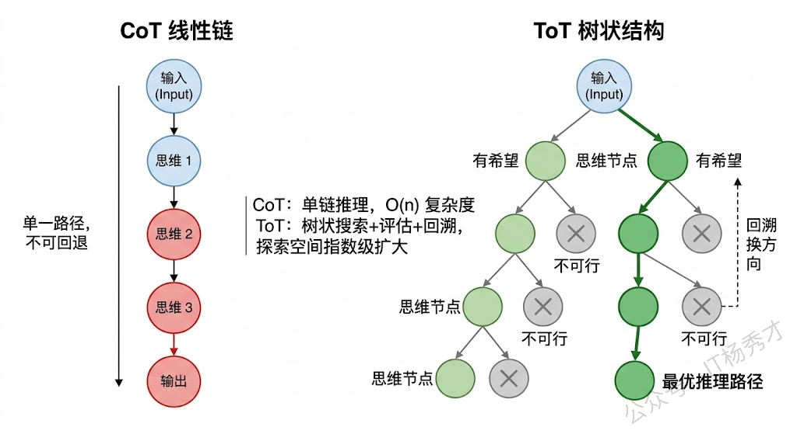
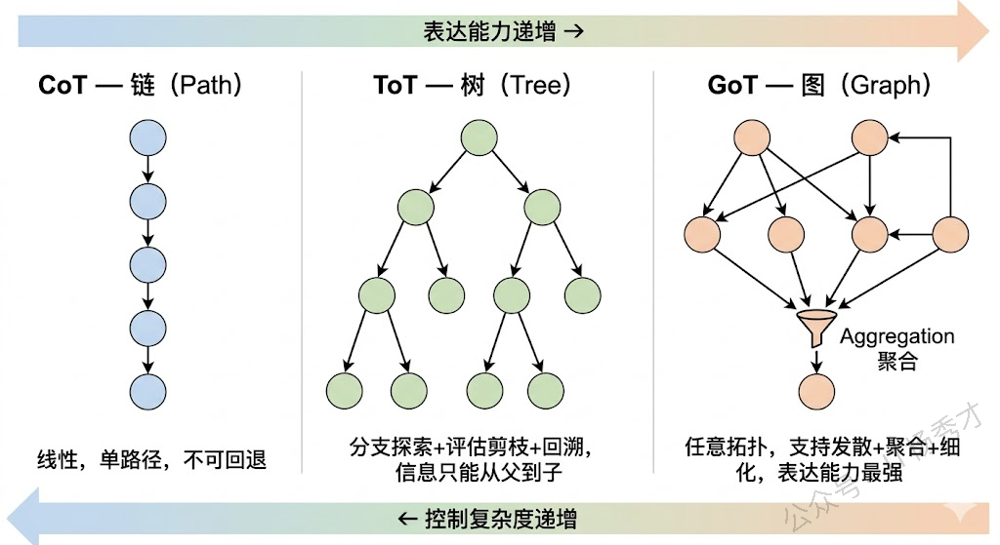

## **1. 题目分析**

这道题考察的是你对 Agent 核心能力之一——规划（Planning）的系统性理解。面试官提到了 CoT、ToT、GoT 这些关键词，但他真正想听的不是你把这几个缩写展开然后各背一段定义，而是你能不能把这些方法放到一条演进脉络上，讲清楚它们各自解决了什么问题、彼此之间是什么关系、在实际 Agent 工程中怎么选型。换句话说，这道题的答题层次是：先讲清楚"为什么规划能力重要"，再沿着"思维结构从简单到复杂"这条线把各种方法串起来，最后落到工程实践中的选型考量。

### **1.1 为什么规划能力是 Agent 的核心**

在聊具体方法之前，我们先要理解"规划"在 Agent 体系中扮演的角色。一个完整的 Agent 通常包含四大能力模块：感知（Perception）、规划（Planning）、记忆（Memory）和行动（Action）。其中规划是真正的"大脑"，它决定了 Agent 面对一个复杂任务时，应该把任务拆解成哪些子步骤、以什么顺序执行、遇到问题时怎么调整策略。

如果没有规划能力，Agent 就只能做简单的"一问一答"——用户说什么它就做什么，完全不具备处理多步骤复杂任务的能力。你可以把规划能力理解为 Agent 和普通 Chatbot 之间的分水岭：Chatbot 是被动应答，Agent 是主动规划并执行。

而赋予 LLM 规划能力的核心方法，本质上都是在回答同一个问题：**如何组织 LLM 的推理过程，使它能够系统地分解和解决复杂问题？** 不同方法的区别在于，它们对"推理过程"的结构化程度不同——从最简单的线性链条，到树状分支，再到任意图结构，复杂度逐步递增，适用场景也各不相同。

### **1.2 Chain-of-Thought（CoT）：线性链式推理**

CoT 是一切的起点，由 Google 在 2022 年的论文中正式提出。在 CoT 出现之前，我们让大模型回答问题的方式是"直接给答案"，也就是所谓的 Standard Prompting。比如问"Roger 有 5 个网球，又买了 2 罐，每罐 3 个，他现在有多少个？"，模型直接输出"11"。这种方式对于简单问题没问题，但遇到需要多步推理的问题就经常出错，因为模型被迫在一次前向传播中完成所有计算。

CoT 的核心洞察非常简单但深刻：**让模型把中间推理步骤显式地写出来**。还是刚才那个问题，加上 CoT 之后模型会输出"Roger 一开始有 5 个球，2 罐每罐 3 个就是 6 个，5 + 6 = 11"。看起来只是多输出了几句话，但效果提升非常显著，因为每一步中间结果都变成了下一步推理的"垫脚石"，大幅降低了推理难度。

CoT 有两种主要的触发方式。一种是 **Few-shot CoT**，在 prompt 中给几个带推理过程的示例，模型就会"模仿"这种推理风格。另一种是 **Zero-shot CoT**，更简单粗暴，只需要在问题后面加一句"Let's think step by step"，模型就会自动展开推理链。这说明大模型内部其实已经具备了逐步推理的能力，CoT 只是通过 prompt 把这个能力"激活"了。

但是 CoT 有一个本质局限：**它的推理过程是单条链路的，线性的，不可回退的**。模型从第一步开始，一步接一步地往下推，如果中间某一步推错了，后面所有步骤都会跟着错下去，没有任何"纠错"或"换条路试试"的机制。这对于只有一条正确推理路径的简单任务来说够用了，但对于有多种可能解法的复杂任务，就显得力不从心了。

### **1.3 Self-Consistency（自洽性采样）：多条链路投票**

在 CoT 的基础上，一个很自然的改进思路是：**既然一条链可能走错，那我多生成几条链，最后投票选最靠谱的不就行了？** 这就是 Self-Consistency 方法。

Self-Consistency 的做法是：对同一个问题，让模型用 CoT 的方式生成多条不同的推理链（通过调高 temperature 来引入随机性），每条链都会得出一个最终答案，然后对所有答案进行**多数投票**，票数最多的答案作为最终输出。

这个方法的直觉来自于人类解题的经验——如果你用三种不同的方法解一道数学题，三种方法都得到了同一个答案，那这个答案大概率是对的。Self-Consistency 用统计的方式提高了推理的鲁棒性，在数学推理和常识推理任务上效果很好。

但它的局限也很明显：**多条链之间是完全独立的，不会互相交流信息**。也就是说，如果第一条链在某一步发现了一个关键线索，第二条链在推理过程中完全用不到这个线索。每条链都是闷头自己推，最后只是在结果层面做投票聚合。这显然是一种浪费——理想情况下，我们希望不同推理路径之间能够共享中间信息、互相启发。

### **1.4 Tree-of-Thought（ToT）：树状分支探索**

ToT 就是为了解决 CoT "一条路走到黑"和 Self-Consistency "多条路互不相干"这两个问题而提出的。它由 Yao 等人在 2023 年的论文中正式提出，核心思想是：**把推理过程从一条链变成一棵树，在每一步都可以产生多个分支候选，然后通过评估来选择最有希望的分支继续探索，必要时还可以回溯**。

具体来说，ToT 的工作流程是这样的：在推理的每一步，模型会生成多个可能的"思维节点"（Thought），每个节点代表一种可能的推理方向。然后，模型会对这些候选节点进行**自我评估**（Self-evaluation），判断每个方向的前景如何——是"很有希望"、"还行"还是"肯定不对"。基于评估结果，系统选择最优的一个或几个节点继续往下展开，形成新的分支。如果某个分支推着推着发现走不通了，还可以**回溯**到之前的节点，换一个方向继续探索。

这个过程本质上就是经典算法中的**搜索**——你可以用 BFS（广度优先搜索）来逐层展开所有可能性，也可以用 DFS（深度优先搜索）来沿着一个方向深入探索、走不通再回头。ToT 把 LLM 的推理过程变成了一个可控的搜索问题。

用一个例子来说明 ToT 的威力。假设我们让模型做一个"24 点游戏"——给定 4 个数字，用加减乘除组合成 24。CoT 可能一条路算下去，发现算不出来就卡住了。但 ToT 会在每一步尝试多种运算组合，评估哪些中间结果更有可能通向 24，优先探索那些有希望的分支，走不通就回退换路，直到找到答案。

### **1.5 Graph-of-Thought（GoT）：图结构的自由推理**

如果说 CoT 是一条线、ToT 是一棵树，那 GoT 就是一张**任意有向图**。GoT 由 Besta 等人在 2023 年提出，它进一步打破了树结构的层级限制，允许推理节点之间形成更自由、更复杂的连接关系。

GoT 相比 ToT 最关键的新增能力是**思维的聚合（Aggregation）**。在树结构中，信息只能从父节点流向子节点，不同分支之间是隔离的。但在很多实际推理场景中，我们需要把多个分支的中间结论汇总合并成一个新的结论——这就要求不同分支之间能够"连线"。GoT 通过引入聚合操作，允许多个思维节点的输出合并成一个新节点的输入，形成类似 DAG（有向无环图）甚至包含环路的图结构。

举个例子：假设你要分析一篇长文档的核心观点。你可以先用不同的分支分别提取各段落的关键信息（这是 ToT 也能做的"发散"），然后把各段落的关键信息**聚合**成一个全局摘要（这是 GoT 独有的"收敛"），最后基于全局摘要再进一步推理。这种"先发散再收敛"的模式在树结构中是做不到的。

从图论的角度来看，CoT 是一条路径（Path），ToT 是一棵树（Tree），GoT 是一张图（Graph）。路径是树的特例，树是图的特例，所以 GoT 在理论上的表达能力是最强的。但表达能力强也意味着搜索空间更大、控制更复杂，实际工程中需要更精细的调度策略。

### **1.6 其他重要的规划方法**

除了上面这条"链→树→图"的主线之外，还有几种重要的规划方法需要了解：

**Plan-and-Execute（规划-执行分离）** 是一种偏工程实践的策略。它的思路是把规划和执行拆成两个独立阶段：先让一个"Planner LLM"对任务做全局规划，输出一个完整的步骤清单，然后让一个"Executor LLM"逐步执行每个步骤。这种方法的好处是规划阶段可以纵览全局，不会被执行过程中的细节干扰，适合那些步骤较多但逻辑相对确定的任务，比如"帮我写一篇行业分析报告"这种。LangChain 和 LangGraph 中都有对应的 Plan-and-Execute Agent 实现。

**Reflexion（反思机制）** 则是在规划执行的基础上加入了"复盘"环节。当 Agent 执行一个任务失败后，它不会简单地重试，而是先回顾整个推理和执行过程，总结出"哪里做错了、下次应该怎么改进"的经验教训，然后把这些反思存入记忆，在下一次尝试中参考。Reflexion 本质上赋予了 Agent 从失败中学习的能力，类似于人类的"吃一堑长一智"。

**LLM+P（LLM + 经典规划器）** 是一种混合方法，它把 LLM 的自然语言理解能力和经典 AI 规划算法（如 PDDL 规划器）的严格推理能力结合在一起。LLM 负责把用户的自然语言需求转化为结构化的规划问题描述（PDDL 格式），然后交给经典规划器去求解最优行动序列，最后 LLM 再把结果翻译成自然语言返回给用户。这种方法在需要严格逻辑保证的场景（比如机器人路径规划）中有独特优势。

### **1.7 工程选型的思考**

在实际 Agent 开发中，选择哪种规划方法取决于具体场景。对于大多数常规任务，CoT 配合 ReAct 框架就足够了，它简单高效、延迟低。当任务涉及复杂的多步推理，且存在多种可能的解题路径时，ToT 可以通过搜索和评估找到更优解。GoT 目前在工程中的应用还相对较少，更多停留在研究阶段，但它的聚合思想在需要"先分后合"的任务中（如多文档摘要、多源数据分析）很有启发意义。

Plan-and-Execute 在企业级应用中非常实用，因为它将规划和执行解耦，便于分别优化和调试。Reflexion 适合那些需要 Agent 持续改进、从错误中学习的长期运行场景。而 LLM+P 则在机器人、自动化流程等需要严格逻辑保证的领域有独特价值。

一个经验性的选型原则是：**先用最简单的方法跑通，再根据效果瓶颈针对性地升级**。不要一上来就用最复杂的方法，因为复杂度本身就是成本——不仅是计算成本，还有工程维护成本和调试难度。

## **2. 参考回答**

Agent 的规划能力本质上是解决"如何让 LLM 系统性地分解和执行复杂任务"这个问题，目前主流方法可以沿着一条**推理结构从简单到复杂的演进线**来理解。

最基础的是 **CoT（Chain-of-Thought）**，它通过让模型显式输出中间推理步骤来激活逐步推理能力，但本质上是单条链路的线性推理，中间一步出错后续就全废了。在此基础上，**Self-Consistency** 通过多次采样生成多条独立推理链然后多数投票来提高鲁棒性，但不同链之间不共享中间信息。**ToT（Tree-of-Thought）** 是一个关键跃升，它把推理过程从链变成了树——每一步都生成多个候选方向，通过 LLM 自我评估来选择最有希望的分支继续展开，走不通还能回溯，本质上是把 LLM 推理变成了一个可控的搜索问题，用 BFS 或 DFS 策略来探索推理空间。**GoT（Graph-of-Thought）** 进一步打破了树的层级限制，允许不同分支的思维节点进行聚合，形成任意有向图结构，核心突破在于支持了"先发散再收敛"的推理模式，表达能力最强但控制复杂度也最高。

除了这条"链→树→图"的主线，工程实践中还有几种非常重要的方法：**Plan-and-Execute** 把规划和执行分成两个阶段，先全局规划再分步执行，适合步骤多但逻辑相对确定的场景；**Reflexion** 加入了自我反思机制，Agent 失败后会总结经验教训存入记忆，下次避免同样的错误。在实际选型上，我的经验是先用最简单的方法跑通——大部分场景下 CoT 配合 ReAct 就够用了，然后再根据效果瓶颈针对性升级，因为复杂度本身就是成本，不仅是计算成本，还有工程维护和调试的代价。

## **学习交流**

> 如果您觉得文章有帮助，可以关注下秀才的<strong style="color: red;">公众号：IT杨秀才</strong>，后续更多优质的文章都会在公众号第一时间发布，不一定会及时同步到网站。点个关注👇，优质内容不错过

