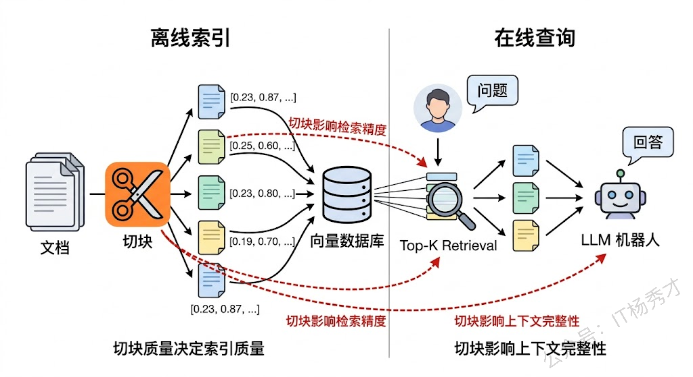
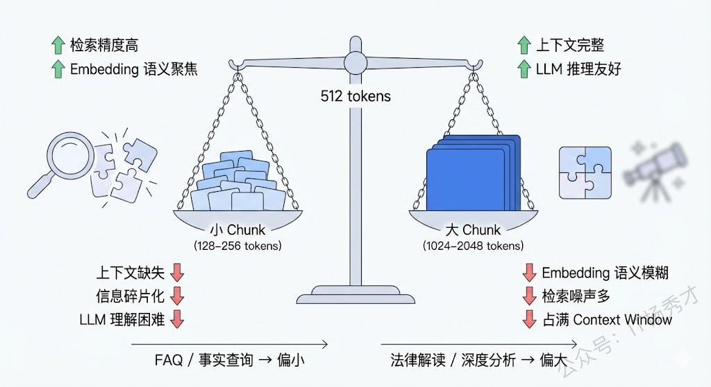
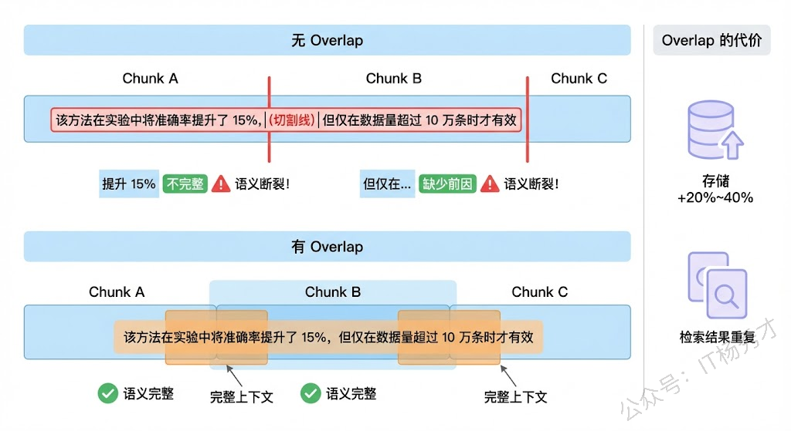
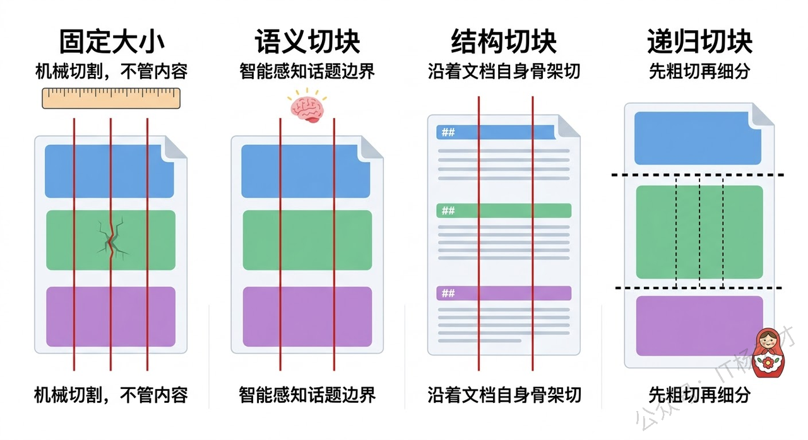
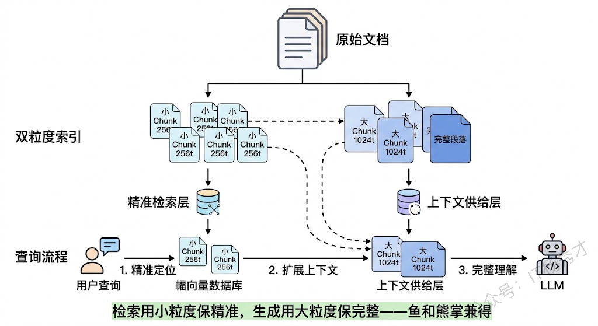

## **1. 题目分析**

这道题看起来问的是两个参数——chunk size 和 overlap，但面试官真正想考察的不只是"选多大合适"这种经验值，而是你对 RAG 系统中检索质量和生成质量之间关系的理解深度。一个只知道"chunk size 一般选 512 token"的人和一个能讲清楚"为什么选 512、什么时候不该选 512、选错了会导致什么后果"的人，在面试官心目中是完全不同的段位。这道题的本质是一道工程权衡题，它考察的是你在 RAG 系统调优中的实战经验和系统性思考能力。

### **1.1 文本切块在 RAG 中的角色**

在深入讨论参数选择之前，我们先搞清楚切块这件事在整个 RAG 流程中处于什么位置、为什么重要。

RAG 的基本流程是：用户提问 → 检索相关文档片段 → 将片段拼入 Prompt → LLM 基于这些片段生成回答。而"切块"发生在更早的离线阶段——把原始文档切分成小片段，每个片段生成一个 Embedding 向量存入向量数据库。用户查询时，查询向量和这些片段向量做相似度匹配，找出最相关的 Top-K 片段。

这意味着切块质量直接决定了两件事：**检索能不能找到对的片段**，以及**找到的片段能不能让 LLM 生成好的回答**。切得不好，要么检索阶段就漏掉了关键信息，要么检索到了但片段内容残缺不全导致 LLM 无法正确理解。可以说，切块是 RAG 系统中"最不起眼但影响最深远"的环节——很多人花大量精力调 Prompt、换 Embedding 模型、调 Top-K，最后发现问题根源其实出在切块策略上。

### **1.2 Chunk Size权衡**

Chunk size 是切块策略中最核心的参数，它的选择本质上是在**语义粒度**和**上下文完整性**之间做平衡。

**切小了（比如 128-256 token）会怎样？** 每个 chunk 的内容非常聚焦，大概率只包含一个知识点。这带来的好处是 Embedding 向量更精准地代表那个知识点，检索时更容易被"命中"——也就是检索精度（Precision）高。但问题也很明显：一个太小的 chunk 很可能缺少必要的上下文。比如原文是"该方法在实验中将准确率提升了 15%，但仅在数据量超过 10 万条时才有效"，如果从"但"字处切开，前半段 chunk 只说了"提升 15%"而丢失了限制条件，LLM 读到这个片段就可能给出一个过于乐观的回答。此外，小 chunk 意味着数量多，检索到的 Top-K 片段可能来自文档的不同角落，LLM 需要整合多个碎片化的信息，增加了理解难度和幻觉风险。

**切大了（比如 1024-2048 token）会怎样？** 每个 chunk 包含更丰富的上下文，语义完整性好，LLM 拿到后更容易理解和推理。但大 chunk 的 Embedding 向量不可避免地变成了多个知识点的"混合体"，一个向量要同时代表好几层含义，检索时就容易"模糊匹配"——用户问的是 A，但因为某个 chunk 里 A 和 B 混在一起，B 的部分也被捎带检索出来了，稀释了相关性。更实际的问题是，大 chunk 意味着每个片段占用更多的 Prompt 空间（即 Context Window），能放进去的片段数量就更少，可能导致召回率（Recall）不够。

所以 chunk size 的选择不是一个固定的"最优值"，而是根据具体场景在这两极之间找平衡点。工程实践中的经验是：**对于事实性问答（FAQ 类）**，小一点的 chunk（256-512 token）通常效果更好，因为答案往往在某一段话里，精准检索更重要；**对于需要深度理解和推理的场景**（如法律条款解读、技术文档分析），大一点的 chunk（512-1024 token）更合适，因为上下文完整性更关键。

### **1.3 Overlap 的作用**

理解了 chunk size 的权衡之后，overlap 就很好理解了——它就是用来**缓解切块边界处信息断裂**问题的补偿机制。

想象一下，一段连贯的论述横跨了两个 chunk 的边界：前一个 chunk 的结尾讲了原因，后一个 chunk 的开头讲了结论。如果没有重叠，这两个 chunk 各自都是"半截话"——前一个有原因没结论，后一个有结论没原因。Embedding 分别编码后，两个向量都无法完整代表这段论述的含义，检索时就可能漏掉这条关键信息。

加入 overlap 后，相邻两个 chunk 在边界处有一段共享内容。这段重叠区域确保了即使切割发生在一段连贯论述的中间，至少有一个 chunk 能保留足够的上下文，使语义不至于断裂。这就像屋顶的瓦片——每片瓦不是严丝合缝，而是前后重叠一部分，才能确保雨水不会从缝隙漏进去。

**Overlap 多大合适？** 常见的经验值是 chunk size 的 10%-25%。比如 chunk size 是 512 token，overlap 可以设 50-128 token。太小了（比如只有 10-20 token）起不到缝合语义的作用，因为一两句话不足以提供有意义的上下文衔接。太大了（比如超过 50%）就会带来明显的副作用：首先是**存储膨胀**，同一段内容被重复编码多次，向量数据库的体积和索引成本显著增加；其次是**检索去重问题**，多个 chunk 包含大量相同内容，检索时可能返回一堆"长得差不多"的片段，浪费了宝贵的 Top-K 配额，等于你明明可以看到 5 条不同信息，结果其中 3 条都在重复同一段话。

### **1.4 常用切块策略**

上面讨论的 chunk size 和 overlap 都是基于**固定大小切块**（Fixed-size Chunking）这个最基础的策略。但在实际工程中，仅靠调整这两个数字往往是不够的，因为文本内容本身是不均匀的——有些段落三句话就讲完一个概念，有些段落十句话都在论述同一个论点。用固定尺寸去切变长内容，就像用同一把尺子裁剪不同大小的布料，难免裁到不该裁的地方。

**基于语义的切块（Semantic Chunking）** 是更精细的做法。它的核心思想是：不按固定 token 数切，而是按语义边界切。具体怎么做呢？一种常见的实现方式是：先把文本按句子分割，然后计算相邻句子之间的 Embedding 相似度，当相似度出现明显下降时（说明话题发生了转换），就在那里切一刀。这样每个 chunk 自然地对应一个完整的语义单元，不需要 overlap 来"缝合"了，因为根本就没有在语义中间切开过。

**基于文档结构的切块** 则利用文档自身的结构信息。Markdown 文档有标题层级，HTML 有标签结构，PDF 有段落和章节。按这些天然边界来切块，既简单又有效。比如按 Markdown 的二级标题（##）切，每个 chunk 就是一个完整的章节，语义自然完整。这种方法特别适合结构化程度高的文档，���如技术文档、产品手册、法律合同等。

**递归切块（Recursive Chunking）** 是 LangChain 中广泛使用的策略，思路是设定一组分隔符优先级（比如先按段落 \n\n 切，太大了再按句子 \n 切，还太大了再按固定长度切），逐级递归直到每个 chunk 都在目标大小范围内。它兼顾了结构化和大小控制，是实践中最常用的默认策略。

### **1.5 实战中的调优思路**

理论说了一大堆，回到工程现实，怎么为一个具体项目选定切块参数？分享几条实战经验。

**第一步永远是看数据**。在动手切之前，先抽样看看你的原始文档长什么样——平均段落长度、内容结构化程度、信息密度。技术文档和闲聊记录显然需要完全不同的策略。

**第二步是建立评估闭环**。切块策略没有"一设永逸"的参数，必须通过评估来迭代。准备一组有标准答案的测试问题，跑一轮 RAG 看效果，调整参数后再跑一轮对比。核心指标有两个：**检索召回率**（相关片段有没有被检索到）和**生成准确率**（最终回答对不对）。很多时候你会发现检索层面已经召回了正确片段，但因为 chunk 太碎导致 LLM 无法正确理解，这就是切块的锅。

**第三步是考虑多级索引**。在实际产品中，一种越来越流行的做法是不只存一种粒度的 chunk，而是**同时维护多个层级**：比如用小 chunk（256 token）做精准检索，命中后把对应的大 chunk（1024 token）或原始段落送给 LLM。这样检索阶段享受小粒度的精准性，生成阶段享受大粒度的上下文完整性。LlamaIndex 中的 `SentenceWindowNodeParser` 和 `HierarchicalNodeParser` 就是这个思路的实现。

最后还有一条容易被忽略的经验：**切块策略应该随 Embedding 模型的能力匹配**。不同 Embedding 模型的最佳输入长度不同——有些模型在短文本上表现更好（如早期的 `text-embedding-ada-002`），有些模型专门针对长文本优化（如 `jina-embeddings-v2` 支持 8192 token）。如果你用的是一个短文本模型却切了很大的 chunk，Embedding 质量会明显下降。所以 chunk size 不应该孤立地选择，而应该和 Embedding 模型的特性联合考虑。

## **2. 参考回答**

在 RAG 系统中选择切块参数，核心是在检索精度和上下文完整性之间找平衡。chunk size 越小，每个片段的语义越聚焦，Embedding 越精准，检索准确率越高，但代价是上下文容易断裂，LLM 拿到碎片化的信息可能理解不全甚至产生幻觉。chunk size 越大，上下文越完整，LLM 推理更友好，但 Embedding 向量变成了多个话题的"混合表示"，检索时噪声增多，而且每个 chunk 占 Context Window 更大，能放进去的片段就更少。工程上一般以 512 token 作为起点，FAQ 类场景偏小到 256，需要深度理解的场景偏大到 1024，然后通过评估来迭代。

overlap 是为了缓解边界处的语义断裂问题，通常设置为 chunk size 的 10% 到 25%。太小起不到衔接作用，太大会导致存储膨胀和检索结果重复。但 overlap 说到底只是固定大小切块的补丁，更好的做法是根据文档特点选择更智能的切块策略——比如按语义相似度变化来切，或者利用文档自身的标题和段落结构来切。在实际项目中我还会用多级索引的思路：用小 chunk 做精准检索，命中后把对应的大 chunk 送给 LLM，这样检索和生成两端都能拿到最合适粒度的内容。最后强调一点，切块参数不能拍脑袋定，必须结合 Embedding 模型的最佳输入长度、通过检索召回率和生成准确率的评估来迭代调优。

## **学习交流**

> 如果您觉得文章有帮助，可以关注下秀才的<strong style="color: red;">公众号：IT杨秀才</strong>，后续更多优质的文章都会在公众号第一时间发布，不一定会及时同步到网站。点个关注👇，优质内容不错过

