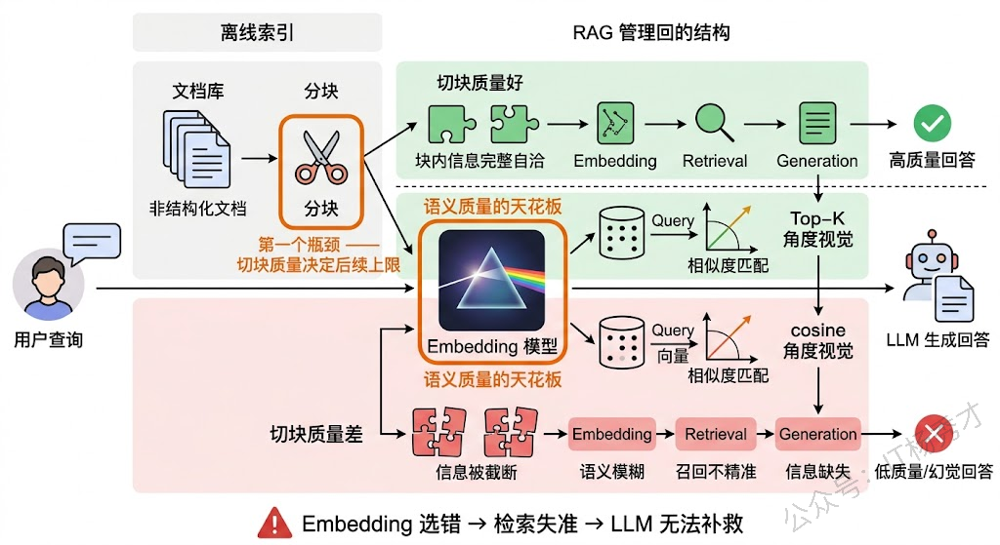
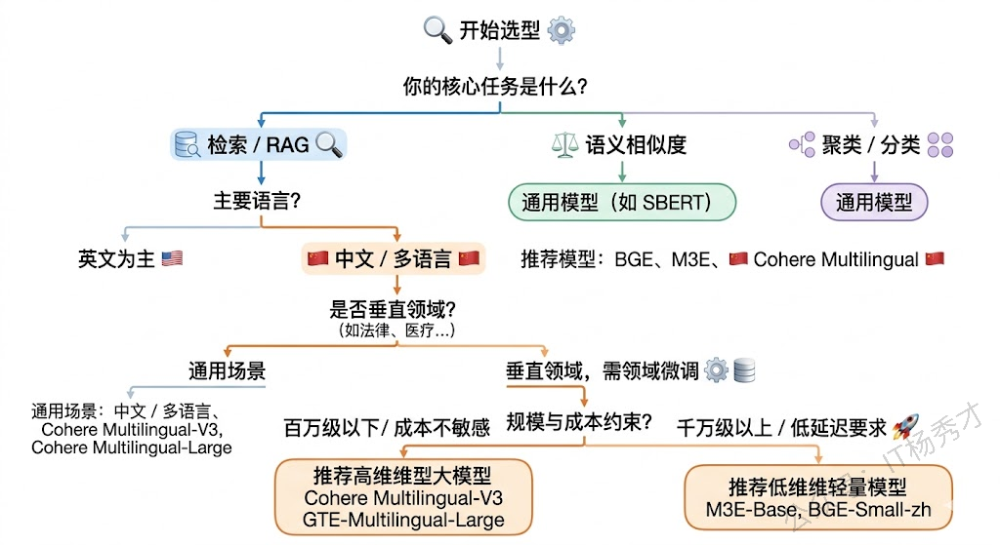
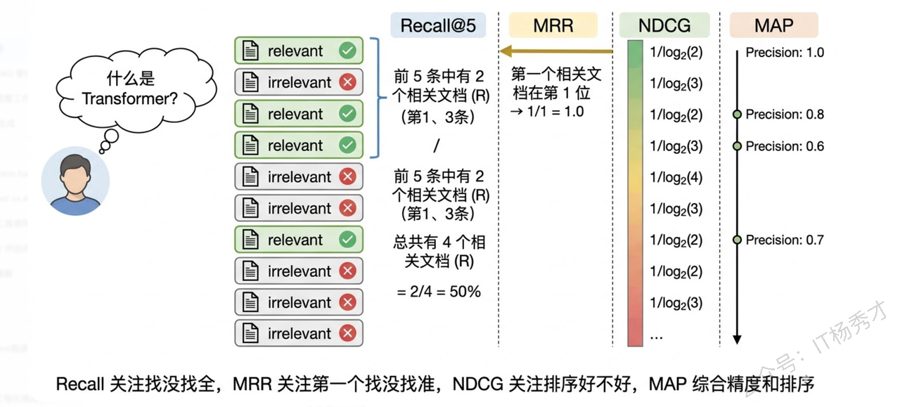
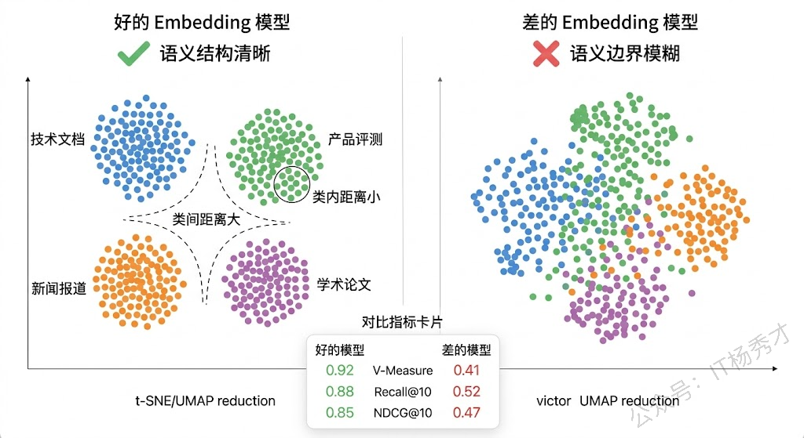
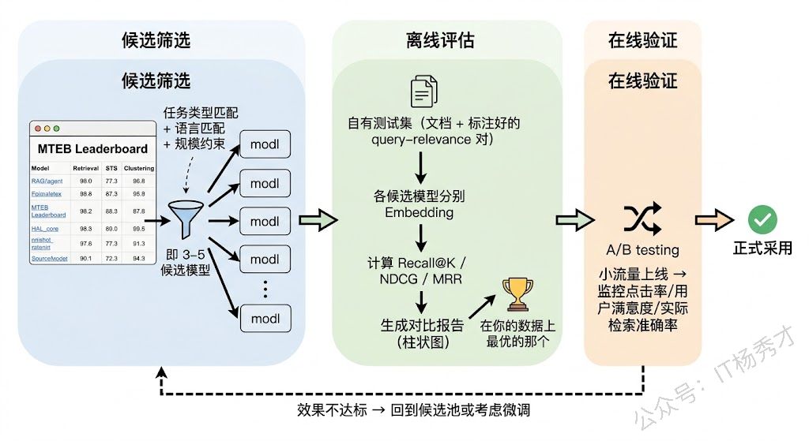
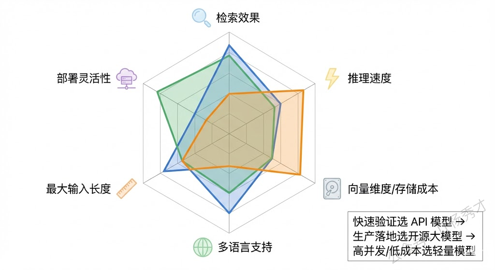

## **1. 题目分析**

这道题考察面其实很广，面试官是想知道你对 Embedding 这个大模型应用中最基础却最容易被忽视的组件有没有体系化的理解。很多人在面试的时候能聊 RAG、聊 Agent，但一问到"你的 Embedding 模型是怎么选的"，就只能说出用过哪些Embedding模型，至于为什么选它、评估过没有、换一个会怎样，完全说不清楚。能把这道题答好的人，通常是真正在生产环境中调优过检索效果的人。

### **1.1 Embedding 模型在大模型应用中的角色**

在展开选型和评估之前，需要先理解 Embedding 模型在整个系统中扮演什么角色。在 RAG、语义搜索、推荐系统、文档聚类等场景中，Embedding 模型是连接"自然语言"和"数学空间"的桥梁——它把一段文字转化为一个高维向量，使得语义相近的文本在向量空间中彼此靠近，语义不同的文本彼此远离。

这个"桥梁"的质量直接决定了下游任务的天花板。以 RAG 为例，如果 Embedding 模型不能准确捕捉查询和文档之间的语义关系，那么即使你的 LLM 再强大、Prompt 写得再好，也无法弥补检索阶段的信息缺失——这就是业界常说的"Garbage In, Garbage Out"。所以选好 Embedding 模型是整个系统的地基，地基不稳，上层建筑再精美也没用。

### **1.2 选择 Embedding 模型的核心维度**

选一个"合适"的 Embedding 模型，绝不是去排行榜上找个分数最高的就完事了。"合适"意味着在你的具体场景下效果最好、成本可接受、工程上可落地。这需要从多个维度综合考量。

**第一个维度是任务类型**。Embedding 模型的训练目标不同，擅长的任务也不同。有些模型是为语义相似度（Semantic Textual Similarity）优化的，擅长判断两段文本说的是不是同一件事；有些是为检索（Retrieval）优化的，擅长从一堆候选文档中找出和查询最相关的那几篇；还有些是为聚类或分类任务优化的。在 RAG 场景中，你需要的核心能力是检索，那就应该优先选在检索任务上表现好的模型，而不是在句子相似度任务上跑分最高的模型。MTEB 排行榜（Massive Text Embedding Benchmark）之所以有价值，就是因为它把不同任务类型拆开评估，你可以针对自己的任务类型去看对应的分数。

**第二个维度是语言和领域匹配度**。这一点在国内场景尤为关键。很多在英文上表现优秀的模型，在中文上的效果可能大打折扣。如果你的业务场景是中文为主，就必须选在中文数据上训练过或专门针对中文优化过的模型，比如 BGE（BAAI General Embedding）系列、M3E、Cohere 的多语言模型等。更进一步，如果是垂直领域（如医疗、法律、金融），通用模型的效果往往不够好，因为这些领域有大量专业术语和特定的语义关系，通用训练数据中覆盖不足。这时候要么选在该领域数据上微调过的模型，要么自己基于开源模型做领域微调。

**第三个维度是向量维度与模型大小的权衡**。向量维度直接影响两件事：表达能力和存储/计算成本。维度越高，理论上能捕捉的语义细节越丰富，但存储占用和检索延迟也越大。比如 OpenAI 的 text-embedding-3-large 支持 3072 维，而 text-embedding-3-small 是 1536 维。在百万级以上的文档库中，每个向量多 1536 维意味着向量索引的内存占用翻倍，检索延迟也会显著增加。实际选型时需要在表达能力和工程约束之间找到平衡——很多时候 768 维的模型在你的场景下效果已经足够好，没必要追求 3072 维带来的那点边际提升。

**第四个维度是对称 vs 非对称检索**。这是很多人忽略但非常重要的一点。对称检索指的是查询和文档在形式上是相似的（比如两个句子比较相似度），非对称检索指的是查询和文档形式不同（比如一个短问题去检索一篇长文档）。RAG 场景几乎都是非对称检索——用户的查询通常是一句简短的问题，而候选文档是完整的段落甚至文章。有些模型专门为非对称检索做了优化（比如在训练时使用了 query-document 对，并且对 query 和 document 分别使用不同的前缀指令），在这种场景下效果会明显好于对称模型。E5 系列和 BGE 系列都支持通过 instruction prefix 来区分 query 和 passage，实际测试中这个小技巧对检索效果的提升不可忽视。

**第五个维度是工程约束和成本**。选型不能只看效果，还要考虑实际部署时的约束。API 调用模型（如 OpenAI、Cohere）使用方便但有持续成本，且数据要发送到第三方；开源模型（如 BGE、E5、GTE）可以自部署，数据不出域，但需要 GPU 资源和运维能力。在实际项目中，还需要考虑模型的推理速度（高并发下能不能扛住）、最大输入长度（你的文档分块策略和模型的 max\_tokens 是否匹配）、以及是否支持批量推理等工程细节。

### **1.3 评估 Embedding 模型的核心指标**

选好了候选模型，怎么评估谁更好？这就需要一套系统化的评估指标体系。不同任务类型关注的指标不同，但核心思路是一致的：**衡量模型把语义相近的文本映射到向量空间中相近位置的能力有多强**。

**检索类指标**是 RAG 场景下最重要的一组。常用的包括：

1. **Recall@K（召回率）**——在 Top-K 个检索结果中，有多少个是真正相关的文档。比如 Recall@10 = 0.8 意味着前 10 条检索结果覆盖了 80% 的相关文档。这个指标直接衡量"该找到的有没有找到"，是检索系统最基础的生命线。

2. **MRR（Mean Reciprocal Rank，平均倒数排名）**——第一个相关文档出现在第几位的倒数的均值。如果第一个相关结果排在第 1 位，MRR 贡献 1；排在第 2 位，贡献 0.5；排在第 3 位，贡献 0.33。MRR 反映的是"用户不想翻页，最相关的结果能不能排在最前面"。

3. **NDCG@K（Normalized Discounted Cumulative Gain，归一化折损累积增益）**——这是最全面的排序指标，它不仅考虑相关文档有没有被检索到，还考虑相关程度更高的文档是否排在更前面。NDCG 的"折损"机制给排在前面的结果更高的权重，越往后权重衰减越快，这和用户的实际行为是吻合的——没人会翻到第 50 页去找答案。

4. **MAP（Mean Average Precision，平均精度均值）**——对每个查询计算 Precision 在不同召回点的平均值，再对所有查询求均值。它综合衡量了检索结果的精确度和排序质量。

**语义相似度指标**则用于衡量模型在判断文本对相似性上的能力。主要包括：

**Spearman 相关系数**——计算模型预测的相似度分数与人工标注的相似度分数之间的排序相关性。Spearman 不关心绝对值，只关心排序是否一致——如果人工标注认为 A 比 B 更相似，模型的分数也应该给 A 更高。这个指标对于 Embedding 模型来说非常合理，因为我们在实际使用中通常是比较相对排序（"哪个更相似"），而不是看绝对的分数值。

**Pearson 相关系数**——衡量模型分数与人工标注之间的线性相关程度。相比 Spearman，它对绝对值更敏感，但在实际评估中两者通常配合使用。

**聚类和分类指标**用于评估向量在下游分类或聚类任务中的区分能力。如果一个 Embedding 模型足够好，那么同类文本的向量应该自然聚拢，不同类的向量应该分开。常用指标包括：V-Measure（衡量聚类结果与真实标签的一致性）、聚类纯度（每个簇中主类别的占比）、以及用向量作为特征训练分类器后的 Accuracy 和 F1。

### **1.4 MTEB**

说到 Embedding 模型评估，就不得不提 MTEB（Massive Text Embedding Benchmark）。它是目前业界最权威的 Embedding 模型评估基准，由 Hugging Face 团队维护，覆盖了 8 大任务类型（检索、重排、聚类、分类、语义相似度、摘要评估等）、涵盖上百个数据集、支持多种语言。

MTEB 的价值在于它提供了一个统一的、可比较的评估框架。但使用 MTEB 排行榜时有几个需要注意的"陷阱"：第一，**总分不能直接拿来做选型依据**，因为总分是各任务的平均，一个在检索上表现一般但在聚类上特别好的模型，总分可能和一个检索很强但聚类一般的模型差不多。你需要看和你业务场景对应的那个任务类型的子分数。第二，**排行榜上的数据集和你的真实数据分布可能差异很大**。一个在 MTEB 英文检索任务上排名第一的模型，在你的中文法律文档检索场景下可能排不进前五。所以 MTEB 是选候选模型的起点，不是终点——最终必须在你自己的数据上做评估。

###**1.5 工程实践考量**

在实际项目中，除了模型效果本身，还有一些工程因素对选型影响很大。

**推理性能和吞吐量**直接影响系统的可用性。如果你的场景是实时检索（用户提交查询后毫秒级返回结果），那 Embedding 模型的推理延迟就是硬约束。一般来说，参数量越小、向量维度越低的模型推理越快。在高并发场景下，还需要考虑模型是否支持高效的批量推理和 GPU 加速。ONNX Runtime 和 TensorRT 等推理优化工具可以显著提升吞吐。

**最大输入长度**是另一个经常被忽视的因素。不同模型支持的最大 token 数差异很大——有些模型只支持 512 tokens，有些支持 8192 甚至更长。这直接影响你的文档分块策略：如果模型只支持 512 tokens 但你的文档块平均 1000 tokens，超出部分就会被截断，等于你精心设计的分块策略白费了一半。反过来，如果模型支持很长的输入，你就有机会使用更大的块来保留更完整的上下文语义，这对于检索质量的提升有时是决定性的。

**Matryoshka，**&#x662F;近期一个很值得关注的技术。传统模型生成固定维度的向量，而 Matryoshka Embedding 允许你在推理后截取前 N 维作为压缩向量使用，不同维度下的效果会渐进衰减但不会断崖式下降。OpenAI 的 text-embedding-3 系列和 Nomic 的 nomic-embed-text 就支持这个特性。它的工程价值在于你可以在同一个模型上灵活调节"效果-成本"的平衡——存储紧张时用低维向量，追求效果时用全维向量。

## **2. 参考回答**

选择 Embedding 模型需要从多个维度综合考量，不能简单看排行榜选分数最高的。首先要匹配任务类型，RAG 场景下应该重点看模型在检索任务上的表现而不是看综合总分，MTEB 排行榜把任务拆得很细，可以针对性地看。其次是语言和领域匹配，中文场景下 BGE、M3E 这类专门做过中文优化的模型通常比纯英文模型效果好很多，垂直领域如果通用模型效果不够还需要做领域微调。第三要关注对称和非对称检索的区别，RAG 是典型的短查询检索长文档的非对称场景，BGE 和 E5 都支持通过 query/passage 前缀来优化这种场景，这个细节在实际中对效果影响很大。工程层面还要考虑向量维度带来的存储和计算成本、模型支持的最大输入长度是否和分块策略匹配、以及推理吞吐能否满足在线服务的延迟要求。

评估指标方面，检索场景最核心的是 Recall@K、MRR、NDCG@K 和 MAP 这几个。Recall 衡量能不能找全，MRR 衡量第一个相关结果排得准不准，NDCG 综合衡量排序质量，MAP 则综合了精确度和排序。语义相似度任务主要看 Spearman 相关系数。但最关键的一点是，公开基准上的分数只能用来初筛候选，最终一定要在自己的真实数据上做评估，因为 MTEB 的数据分布和你的业务数据可能差异很大。在实际项目中，我的做法是先从 MTEB 筛出 3-5 个候选，然后在自有标注数据上跑 Recall 和 NDCG 做离线对比，最优的模型再通过 A/B 测试在线验证，确认效果后才正式采用。

## **学习交流**

> 如果您觉得文章有帮助，可以关注下秀才的<strong style="color: red;">公众号：IT杨秀才</strong>，后续更多优质的文章都会在公众号第一时间发布，不一定会及时同步到网站。点个关注👇，优质内容不错过

