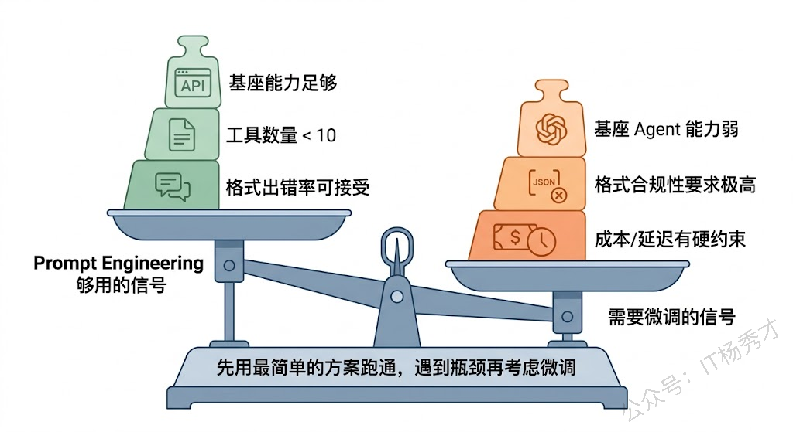
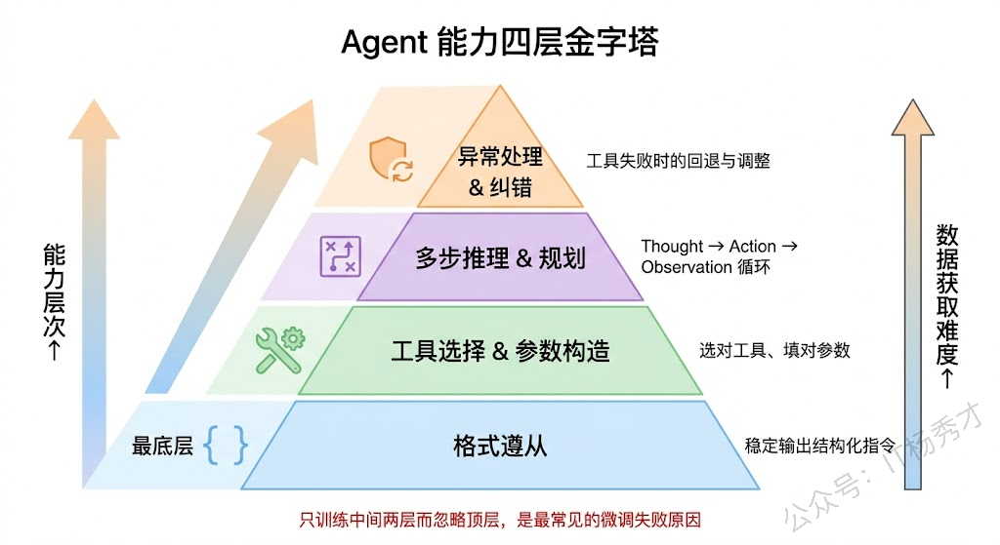
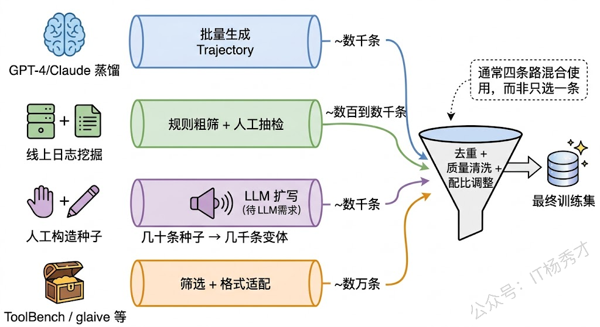
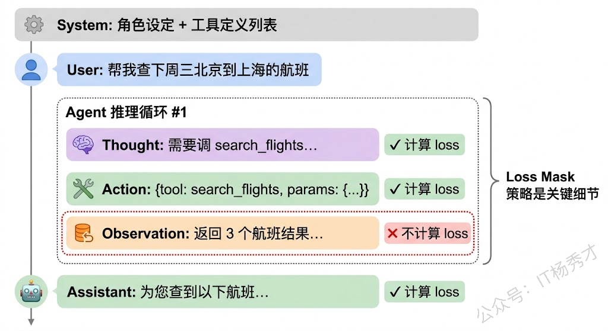
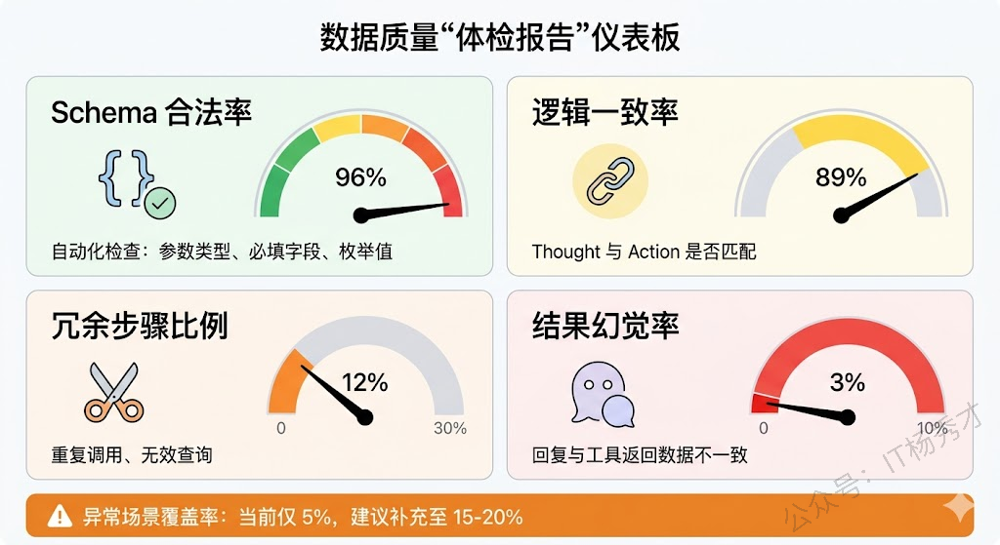
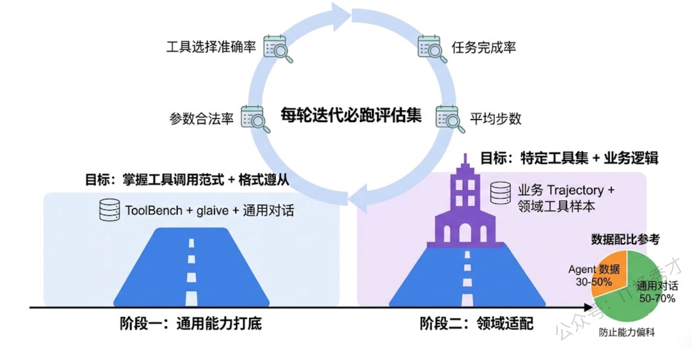

## **1. 问题分析**

做 Agent 的团队很多，但真正动手微调过 Agent 能力的人并不多。大部分人停留在 Prompt + 闭源 API 的阶段就基本上交差了，只有当你真的需要在开源模型上把 Agent 跑起来、或者对工具调用的稳定性有极致要求时，才会走到微调这一步。所以面试官抛出这道题，本质上是在做一次筛选——**你到底是"用过 Agent"还是"改过 Agent 的底层能力"**。而后半句"数据集如何收集"才是真正的技术深水区，因为 Agent 的训练数据和普通 SFT 数据有本质区别，这个区别决定了整个微调工程的难度。

### **1.1 什么情况下才需要微调**

并不是所有 Agent 项目都需要微调。GPT-4、Claude 这些闭源模型本身的 Function Calling 能力已经很强了，配合精心设计的 System Prompt 和工具描述，大部分场景够用。**真正把你逼上微调这条路的，往往是以下几种情况：**

第一种是**你在用开源模型做 Agent**。Llama、Qwen、DeepSeek 这些模型的基座版本，工具调用能力参差不齐。有些甚至没有原生的 Function Calling 支持，你不得不通过微调来"教会"它理解工具定义、生成结构化的调用指令。

第二种是**格式遵从性达不到生产要求**。Agent 场景对输出格式的要求极其严格——你需要模型每次都输出合法的 JSON、准确填写工具名和参数、在该停的时候停而不是自说自话。这种"守规矩"的能力，光靠 Prompt 约束效果有限，但通过微调让模型在训练阶段就反复练习正确格式，效果提升非常显著。

第三种是**成本和延迟的硬约束**。一个微调过的 7B 模型，在你的特定场景下可能比用长 Prompt 驱动的 70B 模型又快又便宜又稳。在 B2C 场景下这个差距乘以请求量就是巨大的成本节省。

如果你的项目不满足以上任何一种情况，大概率不需要微调，Prompt Engineering 加上工程优化就能搞定。在面试中能清楚地说出"什么时候该微调、什么时候不该"，比"我微调过"本身更有说服力。

### **1.2 Agent 微调的本质**

理解了什么时候该微调之后，下一个关键问题是：**你到底在训练模型的什么能力？**

普通的 SFT 是教模型"怎么回答问题"，Agent 的微调则是教模型"怎么思考、怎么行动、怎么应对变化"——这是一整套行为范式，而不只是一个输入输出的映射。

拆解来看，Agent 微调涉及的能力至少包括四个层面。**底层是格式遵从**：模型要能稳定输出你规定的结构化格式，比如 `{"tool": "xxx", "params": {...}}` 这样的 JSON，不能多字少字，不能把工具名拼错。**往上是工具选择与参数构造**：面对用户的请求和一组可用工具，模型要能选对工具、填对参数。**再往上是多步推理与规划**：复杂任务需要多轮 Thought → Action → Observation 循环，模型要知道什么时候该继续调工具、什么时候已经可以给最终回复了。**最顶层是异常处理与纠错**：工具返回了错误怎么办？搜索结果为空怎么办？上一步的判断有误怎么回退？

这四层能力不是孤立的——如果只训练了工具调用但没训练纠错，模型在真实场景中一碰到异常就会"傻掉"。好的 Agent 微调数据集需要覆盖所有这四个层面。

### **1.3 数据集收集**

终于到了这道题的核心。为什么说 Agent 的数据集收集特别难？因为你要的不是简单的问答对，而是**完整的交互轨迹（Trajectory）**。一条 Agent 训练样本长这样：用户说了什么 → 模型思考了什么（Thought）→ 决定调哪个工具（Action）→ 工具返回了什么（Observation）→ 模型又思考了什么 → 最终给出回复。这整条链路都要记录下来，而且每一步都必须是"正确示范"。

这意味着你没法像搞文本分类那样随便标注几千条数据就开练——每一条数据都是一个多轮、多步骤、带工具交互的完整场景。数据的采集难度和普通 SFT 完全不在一个量级上。

实践中，数据收集主要走四条路线，通常需要组合使用。

**路线一：强模型蒸馏。** 这是冷启动阶段最常用也最高效的方式。做法很直接：用 GPT-4 或 Claude 这样的强模型来扮演你的 Agent，给它同样的 System Prompt、同样的工具定义，然后批量灌入用户请求，让它生成完整的 Trajectory。你可以把这理解为"拜师学艺"——先让能力强的模型做示范，然后拿示范数据去教能力弱的模型。

这条路线的关键在于**输入请求的多样性**。如果你只准备了 50 个模板化的用户请求，训练出来的模型也只能应付这 50 种模式。正确的做法是先系统梳理你的业务场景中所有可能的用户意图类别，再在每个类别下用 LLM 批量生成多样化的具体表述。比如"查航班"这个意图，可以有"帮我看看周三北京到上海的飞机""下周有没有便宜的京沪航线""3 月 15 号首都机场出发去虹桥的航班"等几十种不同说法。意图覆盖面和表述多样性直接决定了最终数据集的质量上限。

**路线二：线上日志挖掘。** 如果你的 Agent 已经在线上跑着（哪怕是 Prompt 驱动的版本），那线上日志就是最珍贵的数据来源。每一次用户交互都会产生完整的 Trajectory，你要做的是从中筛选出高质量的成功案例。

筛选标准通常包括：任务是否成功完成、用户有没有给负面反馈、工具调用是否全部合法、推理步数是否合理（太多步可能说明走了弯路）。实际操作中，一般先用规则做粗筛（过滤掉工具调用报错的、超过最大步数的），再做人工抽检确认质量。这条路线的数据最真实、最贴合你的业务场景，但前提是你得有一个已经在跑的系统。

**路线三：人工构造种子 + LLM 扩写。** 对于一些关键能力（特别是异常处理和纠错），强模型的生成质量可能也不够好，这时候就需要由熟悉业务的工程师手工编写训练样本。比如你想训练模型在"API 返回超时"时学会重试、在"搜索结果为空"时学会换个关键词再搜，这类场景最好由人工精心构造几十条种子样本，确保每一步的思考和行动都是最佳实践。

然后用 LLM 对种子做变体扩充：换一种用户问法、换一个工具返回的具体数值、把两步任务改成三步——快速把几十条种子扩展到几千条，同时保持核心逻辑不变。这种"人工打样 + 机器量产"的模式在成本和质量之间取得了不错的平衡。

**路线四：开源数据集做基础底座。** 社区有不少可以直接用的 Agent 训练数据集。**ToolBench** 收录了上万个真实 API 的调用轨迹，覆盖面很广；**glaive-function-calling** 是大规模的 Function Calling 数据；**AgentInstruct** 是微软出品的 Agent 指令数据集；**Gorilla** 专注于 API 调用准确性。这些数据集适合作为第一阶段的通用能力训练，帮模型先掌握"什么是工具调用"的基本范式，但通常不能直接用于你的特定业务——你还需要在此基础上混入自己的领域数据做第二阶段适配。

### **1.4 训练数据的格式**

收集到原始数据后，还需要组织成模型能训练的格式。Agent 训练数据和普通 SFT 最大的区别是**多角色、多轮次、带结构化工具调用**。一条典型样本包含这些部分：

**System**（角色设定 + 工具列表）→ **User**（任务请求）→ **Assistant/Thought**（模型的思考过程）→ **Assistant/Action**（工具调用 JSON）→ **Tool**（工具返回结果）→ **Assistant/Thought**（基于结果继续思考）→ **Assistant**（最终回复）

这里有一个非常关键的训练细节：**Loss Mask**。在计算训练损失时，不是所有 token 都应该参与。User 的输入和 Tool 返回的结果是"外部信息"，不应该让模型去学习"生成"它们——只对模型自己产出的 Thought、Action 和最终回复计算 loss。这个细节处理不当，模型会学到奇怪的行为，比如试图"预测"工具会返回什么，而不是真正去调用工具。

格式方案上，业界主要有三种选择：OpenAI 的 Function Calling 格式（在 ChatML 中增加 `tool_calls` 和 `tool` 角色），最为通用；特殊 token 方案（用 `<tool_call>...</tool_call>` 标记界定工具调用边界），灵活但需要扩展词表；以及纯文本 ReAct 格式（Thought: ... Action: ... Observation: ...），最简单但解析不够可靠。选哪种取决于你的基座模型和推理框架。

### **1.5 数据质量**

数据收集完不等于能直接用。Agent 数据的质量把控比普通 SFT 更复杂——你不光要看最终回复对不对，还要检查**整条推理链路每一步是否合理**。

几个必须做的质量校验环节。**Schema 合法性**：每一次工具调用的参数是否符合定义？必填字段有没有漏？类型对不对？这个可以写代码自动化检查。**逻辑一致性**：模型说"我要查航班"结果调了酒店接口——这种思行不一致的样本必须剔除。**冗余步骤**：有些轨迹里模型查了一次信息已经够了又原封不动地查了一遍，这种冗余不光浪费 token，还会教模型养成"啰嗦"的习惯。**结果正确性**：最终回复和工具返回的数据是否一致？有没有"幻觉"——工具明明返回价格 500，模型却告诉用户 300。

还有一个特别容易被忽略的点：**刻意构造负样本**。如果训练集里全是一路顺畅的"幸福路径"，模型在真实环境中碰到工具超时、返回空结果、用户需求模糊等异常情况就会手足无措。好的训练集应该包含 10-20% 的异常场景样本——工具报错了模型怎么重试、搜索没结果怎么换策略、用户说的不清楚怎么追问。这类数据通常需要刻意构造，但对生产环境中的鲁棒性提升非常大。

### **1.6 训练策略上的实战经验**

最后分享几个在实践中验证过有效的训练策略。

**分阶段训练效果好过一步到位。** 第一阶段用开源的通用 Agent 数据（ToolBench、glaive-function-calling 等）训练，让模型先掌握"什么是工具调用"的基本范式和格式；第二阶段再混入你自己业务领域的 Trajectory 数据做适配，让模型学会你的特定工具集和交互逻辑。这种"先通后专"的策略，比直接在领域数据上训练效果稳定得多——原因也好理解，模型需要先建立一般性的"Agent 行为模式"，再在这个基础上学习具体场景。

**数据配比要认真调。** Agent 数据和通用对话数据必须混合训练，否则模型会"偏科"——工具调用能力上去了，日常对话能力却退化了。经验上 Agent 数据占 30-50%、通用对话数据占 50-70% 比较稳妥，但最终比例需要靠评估结果来微调。

**建评估集比建训练集更重要。** 维护一个 100-200 条的评估集，覆盖简单调用、多步推理、异常处理等各类场景，每轮训练迭代后都跑一遍。核心指标包括四个：工具选择准确率、参数合法率、任务完成率、平均推理步数。没有评估集的微调就是盲人摸象——你根本不知道改了什么、改好了还是改坏了。

***

## **2. 参考回答**

我在之前的项目中确实微调过 Agent 能力，主要是在开源模型上针对业务场景的工具调用和多步推理做增强。选择微调而不是纯 Prompt 驱动，核心原因有两个：一是我们用的开源基座模型 Agent 能力偏弱，光靠 Prompt 达不到生产可用的水平；二是对格式遵从性要求很高，工具调用必须严格符合我们的 JSON Schema，微调后这方面稳定性提升非常明显。

数据集收集是整个过程中最花精力的部分，我们多条路线并行。冷启动阶段主要靠 GPT-4 做蒸馏，给它同样的工具集和系统提示词，批量灌入我们梳理出的各类用户意图来生成 Trajectory 数据；同时对线上已有的 Agent 日志做筛选，按任务完成率和用户反馈挑出高质量的真实交互记录；对于异常处理这类关键场景，由工程师手工构造种子样本再用 LLM 做变体扩充。多源数据混合后要做严格的质量清洗——Schema 合法性校验、逻辑一致性检查、冗余步骤过滤，还要刻意补充 15% 左右的异常场景样本来增强鲁棒性。训练策略上采用了两阶段方案，先用 ToolBench 等开源数据打通用能力的底，再用业务数据做适配，Agent 数据和通用对话数据大概四六开防止偏科。另外 Loss Mask 是一个很影响效果的细节，只对模型自己产出的 Thought、Action 和最终回复算 loss，用户输入和工具返回不算。

## **学习交流**

> 如果您觉得文章有帮助，可以关注下秀才的<strong style="color: red;">公众号：IT杨秀才</strong>，后续更多优质的文章都会在公众号第一时间发布，不一定会及时同步到网站。点个关注👇，优质内容不错过

