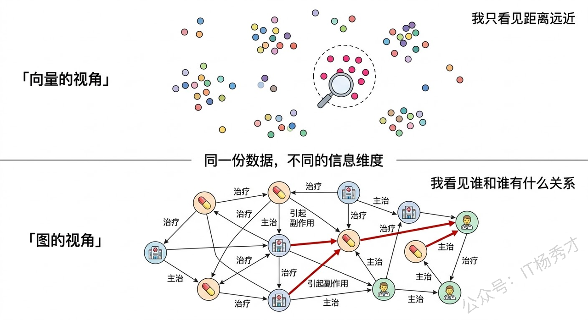
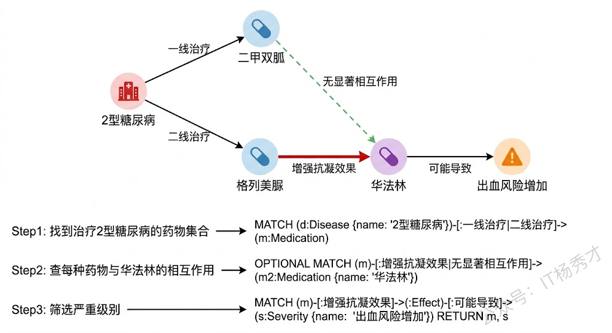
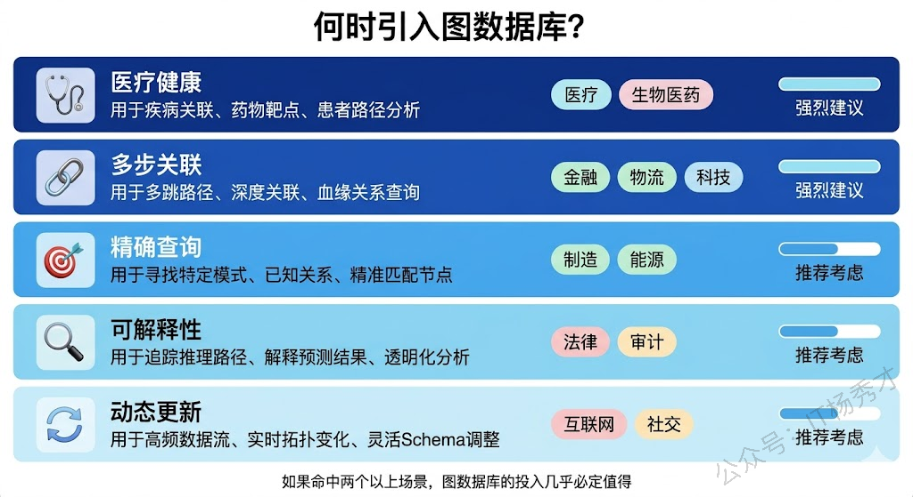
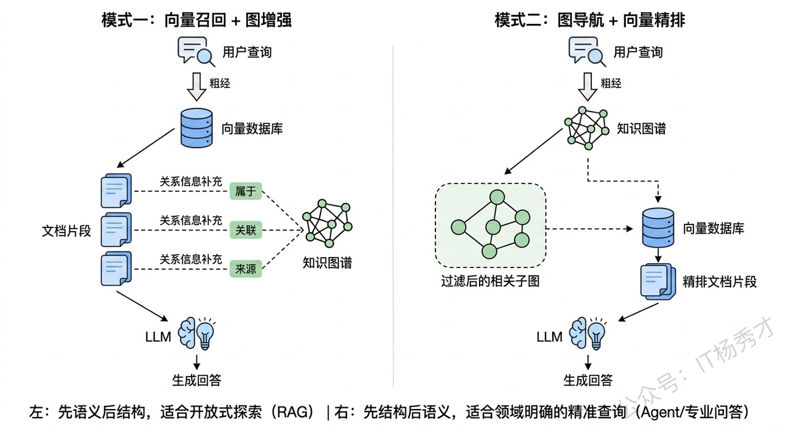
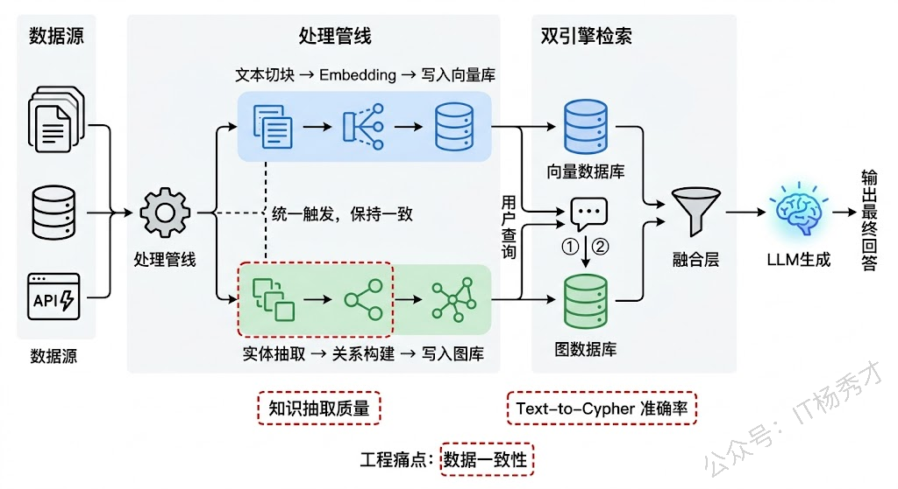
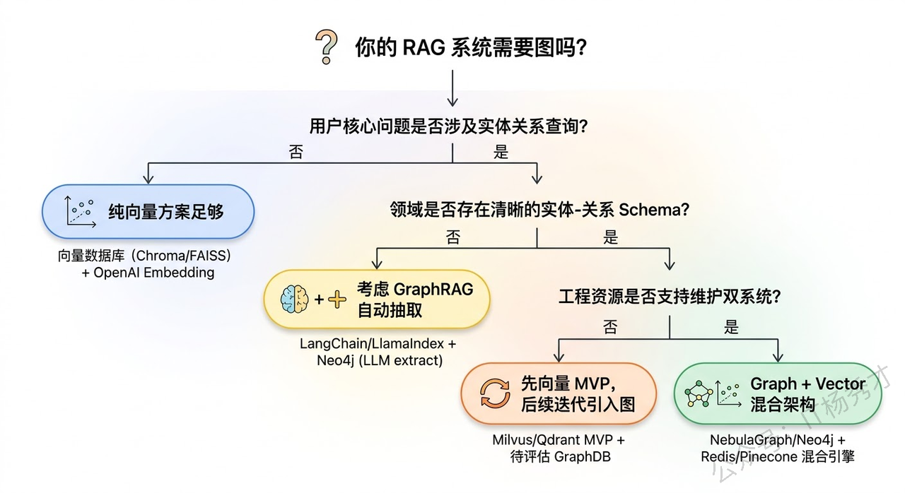

## **1. 题目分析**

假设你在做一个代码知识库的问答系统，用户问：

> "项目里哪些模块直接或间接依赖了 redis 客户端？"

向量检索在这里几乎没有发挥空间。你能召回的，是代码注释里提到 redis 的片段、或者某个配置文件的说明——但"A 模块 import 了 B，B 依赖了 C，C 封装了 redis 客户端"这条依赖链，根本不存在于任何一个单独的文本片段里。它存在于**模块和模块之间的调用关系**里。

这类问题的答案不是"找到语义相关的内容"，而是"沿着关系边走几步"。向量数据库没有边，自然也走不了。这也揭示了向量数据库和知识图谱之间最本质的区别：向量捕捉的是语义距离——两段内容说的是不是一件事；图捕捉的是实体之间的结构化关系——谁和谁有什么关联。很多听起来像"检索"的问题，其实是在问"哪些实体之间存在特定的关系"——这类问题，图天然更适合回答。

### **1.1 向量检索的能力边界**

要理解什么时候该引入图，先得搞清楚向量检索的能力边界到底在哪。

向量数据库的底层逻辑是把文本映射到高维空间中的一个点，然后用距离度量（余弦相似度、欧氏距离等）找到离 query 最近的那些点。这套机制在"找语义相似内容"这件事上运用得非常好——你问"如何提高代码质量"，它能帮你找到讨论"代码审查最佳实践""单元测试覆盖率"的段落，即使这些段落里一个字也没提"代码质量"这四个字。

但向量检索有三个结构性盲区。

**第一，它丢失了实体间的关系结构。** 文本被切成 chunk 之后，原本的上下文关联就被切断了。"张三是李四的主治医师"和"李四对青霉素过敏"可能分散在不同的 chunk 里，向量检索没有任何机制把这两条信息关联起来，回答不了"张三的病人中谁对青霉素过敏"。

**第二，它不擅长精确的属性约束查询。** 用户问"2023 年之后发表的、引用数超过 100 的、关于 Transformer 架构改进的论文"，这种带多维度精确筛选条件的查询，向量检索做不到。它能找到"关于 Transformer 改进"的语义相关内容，但无法过滤年份和引用数这些结构化属性。当然，可以在向量检索之外叠加元数据过滤，但这已经不是纯粹的向量能力了。

**第三，它无法做多步推理。** 用一个医药领域的例子来看——要从"疾病→治疗药物→药物相互作用→严重性级别"走完这条推理链，需要在多个实体之间连续跳转。向量检索每次只做一步相似性匹配，不具备这种链式遍历能力。

### **1.2 知识图谱的核心优势**

知识图谱本质上是一种用三元组（主语-谓词-宾语）来描述世界的方式。比如"阿司匹林—治疗→头痛"、"阿司匹林—可能引起→胃出血"、"胃出血—属于→严重副作用"——每一条三元组都是一个原子级的事实，而知识图谱就是由成千上万条这样的事实编织成的一张关系网络。图数据库（如 Neo4j、Amazon Neptune）则是存储和查询这种网络的专用引擎，天然支持沿着关系边进行遍历。

这种数据结构带来了三个向量做不到的能力。

**多步关系遍历**是最核心的一个。Cypher（Neo4j 的查询语言）里一行 `MATCH (d:Disease)-[:TREATED_BY]->(m:Drug)-[:INTERACTS_WITH]->(m2:Drug) WHERE d.name='Type 2 Diabetes' AND m2.name='Warfarin' RETURN m` 就能完成刚才那个糖尿病药物相互作用的查询。这种沿着关系边连续跳转的操作，对图数据库来说就是最基本的遍历，但对向量数据库来说根本不可能。

**精确事实检索**是另一个关键能力。当用户问"特斯拉的 CEO 是谁"时，这不是一个需要语义匹配的模糊问题——它在知识图谱里就是一条精确的三元组 `(Tesla, CEO, Elon Musk)`，直接查即可。向量检索在这类场景下既慢又不必要，还可能因为相似度排序不准确而返回错误答案。

**可解释的推理路径**则是在很多业务场景下的刚需。图查询返回的不只是结果，还有从起点到终点的完整路径——经过了哪些中间节点、走过了哪些关系边。在金融风控中，你可以清晰地展示"这个公司→实控人→关联公司→被执行人"的风险传导链；在医疗场景中，你可以回溯"为什么推荐这个药"的完整推理依据。这种可解释性是合规审计的硬需求，向量检索的相似度分数完全无法提供。

这里以一个医学领域的2型糖尿病药物治疗案例来看看知识图谱是怎么找这个关系的

### **1.3 五个应该引入图的典型场景**

理解了两者的能力差异之后，来看实际工程中什么时候该认真考虑引入图。

**场景一：领域知识高度结构化，实体关系是核心资产。** 医疗、法律、金融这三个领域是最典型的代表。医疗领域有疾病-症状-药物-副作用-禁忌症的复杂网络；法律领域有法条-判例-司法解释之间的引用和层级关系；金融领域有公司-股东-高管-交易-担保的关联网络。在这些领域，用户的高价值问题往往都是关系型的——"这个药能不能和那个药一起用""这条法规被哪些判例引用过""这家公司和那家公司是否存在关联交易"。如果你只用向量检索来服务这些场景，相当于守着一座金矿用铁锹挖。

**场景二：问答涉及多步推理。** 前面已经详细讲了。这里补充一个判断标准：如果你发现用户的问题需要"先找到 A，通过 A 找到 B，再通过 B 找到 C"这种链式逻辑，那几乎可以确定需要图。一个常见的信号是——你发现自己在 RAG 流程里需要做多轮检索（先检索一次拿到中间结果，把中间结果塞进新 query 再检索一次），这本质上就是在用向量检索模拟图遍历，效率很低且容易出错。

**场景三：需要精确的事实性回答，且容错空间极小。** 比如智能客服系统中"我的套餐剩余流量是多少""订单 XXX 的物流状态"这类问题。这些不是语义匹配问题，是精确查询问题。虽然这类场景更常见的做法是直接查业务数据库或调用 API，但如果你的系统里已经在构建统一的知识管理层，把这些结构化事实也纳入知识图谱管理，会比维护多套检索逻辑更干净。

**场景四：需要可追溯、可解释的推理过程。** 金融风控、医疗诊断辅助、合规审查这些场景，不仅要给出结论，还要说清楚"为什么"。图天然支持路径追溯——从结论节点沿着关系边回溯到起点，每一步都有迹可循。而向量检索只能给你一个相似度分数，"这段文字和你的问题相似度 0.87"——这在需要审计和追责的场景里远远不够。

**场景五：数据源频繁更新，且更新的是局部关系。** 知识图谱的更新是原子级的——新增一条三元组、修改一条关系、删除一个节点——不需要重新索引整个数据集。而向量数据库的更新往往意味着重新切块、重新 Embedding、重新入库，如果涉及的 chunk 和其他内容有上下文关联，处理起来更复杂。在数据频繁局部更新的场景中（比如实时变动的企业股权关系），图的维护成本显著低于向量。

### **1.4 Graph + Vector 混合架构**

到这里需要澄清一个常见误解：引入图并不意味着抛弃向量。在大多数真实系统中，最优解是两者混合使用。微软在 2024 年发布的 GraphRAG 就是这个方向的标志性工作。

混合架构的核心思路是让两种检索方式各干擅长的事，然后在结果层做融合。一种常见的模式是\*\*"向量召回 + 图增强"\*\*：先用向量检索做一轮宽泛的语义召回，得到初步结果后，再到知识图谱中查找这些结果涉及的实体和关系，用结构化信息来补充、验证、扩展语义检索的结果。比如向量检索返回了一段关于某种药物的文字，图数据库可以进一步补充这种药物的禁忌症、相互作用、适用人群等结构化信息，让最终送给 LLM 的上下文更完整。

另一种模式是\*\*"图导航 + 向量精排"\*\*：先用知识图谱定位到相关的实体和关系子图，确定一个精确的信息范围，然后在这个范围内用向量检索做语义匹配找到最相关的文本。这种模式适合那些"范围明确但表述模糊"的查询——用户大概知道要找什么领域的信息，但具体的提问方式很灵活。

GraphRAG 的做法更进一步：它在索引阶段就用 LLM 从原始文档中抽取实体和关系，构建一个社区结构的知识图谱，然后在检索时同时利用图的社区摘要和向量的语义匹配来生成更全面的回答。这种方式对"全局性问题"（比如"这个数据集的主要主题是什么"）的回答质量有显著提升。

### **1.5 工程落地**

说到这里，面试官可能会追问："那实际做的时候有什么坑？"这里聊几个真实会遇到的问题。

**知识图谱的构建成本很高。** 这是最大的门槛。传统做法是请领域专家手工标注实体和关系，速度慢、成本高、难以规模化。现在主流的做法是用 LLM 来自动抽取——给 LLM 一段文本，让它识别其中的实体和关系三元组。这种方式速度快很多，但抽取质量参差不齐，尤其在专业领域（医疗、法律）中，错误率可能不可接受，仍然需要人工审核。GraphRAG 采用的就是 LLM 自动抽取的路线，但它在抽取阶段的 token 消耗非常大，对大规模文档集来说成本是个实际问题。

**图查询的设计需要预先理解用户意图的类型。** 向量检索的好处是"万能"——不管用户怎么问，你都能算一个相似度出来。但图查询不是这样，你需要把自然语言 query 转换成结构化的图查询语句（比如 Cypher），这个转换过程本身就很有挑战。目前常见的方案是用 LLM 来做 Text-to-Cypher，但复杂查询的准确率还不够理想，需要配合 Schema 提示、Few-shot 示例等手段来提升。

**两套系统的数据一致性维护。** 如果你同时维护一个向量数据库和一个图数据库，同一份源数据的更新需要同步到两个系统。这不仅增加了工程复杂度，还容易出现数据不一致的问题。一种缓解方案是建立统一的数据处理管线——源数据变更触发一个 pipeline，同时更新向量索引和知识图谱。

### **1.6 选型判断**

最后，给一个简明的选型思路。面对一个具体项目，问自己三个问题：

1. **用户的核心问题是"找相似内容"还是"查关系"？** 如果主要是语义搜索、相似文档推荐这类场景，纯向量就够了。如果高频问题涉及实体之间的关系查询，图必须上。

2. **领域中是否存在可结构化的实体-关系体系？** 如果领域知识天然就有清晰的实体类型和关系类型（比如医药的"药物-疾病-症状"、法律的"法条-判例-当事人"），那知识图谱就是这些知识最自然的载体。如果领域知识主要是非结构化的长文本且实体关系不突出，图的价值就有限。

3) **你愿意为此投入多少工程成本？** 图数据库不是即插即用的东西，知识图谱的构建、维护、查询接口都需要持续投入。如果项目初期资源有限，先用向量检索快速跑通 MVP，等验证了需求之后再引入图，是更稳妥的节奏。

## **2. 参考回答**

这个问题我从实际项目经验出发来回答。向量数据库和知识图谱看到的是完全不一样维度的信息——向量捕捉语义相似性，图捕捉实体之间的结构化关系。当用户的核心需求是"查关系"而非"找相似"的时候，图就该上场了。

具体来说，我会在几类场景中优先考虑引入图。第一是领域知识高度结构化的场景，比如医药、法律、金融，这些领域天然有清晰的实体关系网络，用户的高价值问题往往是关系型的。第二是需要多步推理的场景，比如"治疗某疾病的药物中哪些和另一种药有相互作用"，这需要在多个实体间连续跳转，向量检索根本无法胜任。第三是需要可解释推理路径的场景，金融风控、合规审查这类业务不仅要给结果，还要说清楚推理链路，图天然支持路径追溯。

不过实际工程中，我通常不会用图完全替代向量，而是做混合架构。常见的组合方式有两种：一种是"向量召回+图增强"，先用向量检索做语义召回，再用知识图谱补充结构化的关系信息；另一种是"图导航+向量精排"，先用图确定检索范围，再在缩小的范围内做语义匹配。微软的 GraphRAG 就是这个方向的代表性工作。

落地的时候有几个坑需要注意。知识图谱的构建成本很高，现在主流用 LLM 自动抽取实体关系，但专业领域的准确率仍然需要人工审核。Text-to-Cypher 的转换准确率也是挑战，需要配合 Schema 提示和 Few-shot 来提升。还有双系统的数据一致性维护，最好建统一的数据处理管线。我的选型原则是——先用向量快速跑通 MVP，如果发现用户的高频问题确实涉及关系查询，再引入图做增强，不要为了技术先进性过早增加架构复杂度。

## **学习交流**

> 如果您觉得文章有帮助，可以关注下秀才的<strong style="color: red;">公众号：IT杨秀才</strong>，后续更多优质的文章都会在公众号第一时间发布，不一定会及时同步到网站。点个关注👇，优质内容不错过

